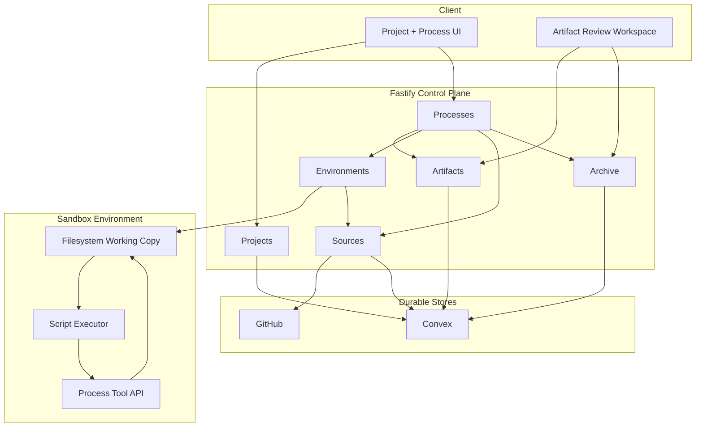
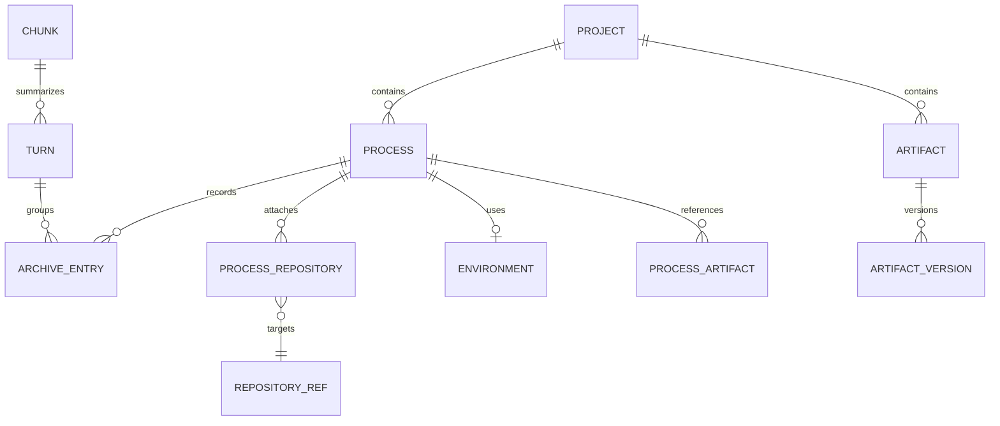
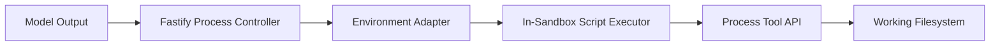
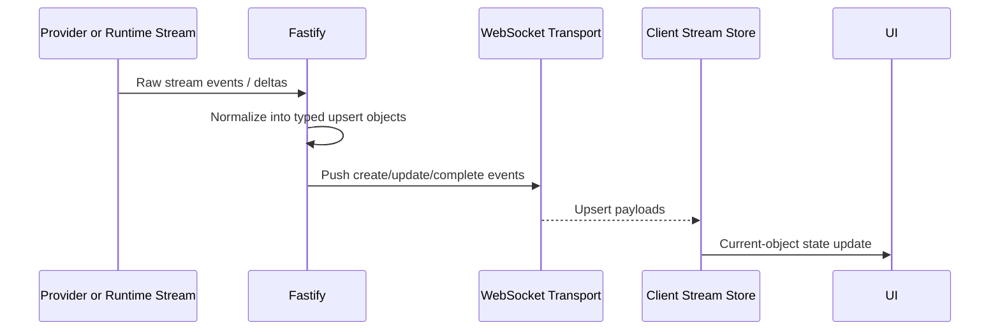
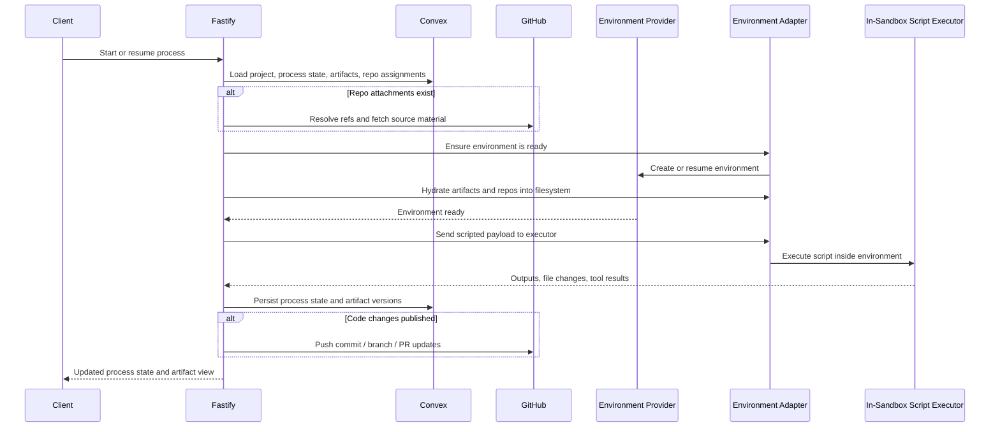

# Liminal Build Core Platform - Technical Architecture

## Status

This document defines the shared technical world for the Liminal Build core
platform. It establishes the system shape, canonical-source model, execution
environment model, and the technical boundaries that the first platform process
types inherit:

- `ProductDefinition`
- `FeatureSpecification`
- `FeatureImplementation`

This architecture is for the core platform stand-up, not for one narrow product
surface. It is also not a full design for every future bespoke process. It
defines the common substrate those process types build on and leaves explicit
extension seams where later decisions are still open.

---

## Architecture Thesis

Liminal Build is a Fastify-controlled, TypeScript-first web platform for
crafted processes. Fastify owns orchestration, auth, integrations, source
hydration, and environment control. Convex stores durable project, process, and
artifact state. Sandboxed environments provide disposable filesystem working
copies hydrated from canonical sources - Convex for artifacts and GitHub for
code - and checkpointed back to those stores. Scripted process code is received
outside the sandbox, then executed inside the sandbox by a local TypeScript
executor against a process-scoped tool API. Process types are implemented as
code-defined modules with their own state schemas, phase models, and toolsets
rather than as dynamic workflow definitions. The browser is served through
Fastify-owned authenticated shell pages and a Vite-built TypeScript client.
Live process updates flow to the browser over WebSocket as typed upsert objects.
The platform also preserves a full-fidelity canonical archive of process
history at low-level entry grain, from which turns, chunks, summaries, and
other managed views are derived later.

---

## Core Stack

| Component | Choice | Version | Rationale | Checked | Compatibility Notes |
|-----------|--------|---------|-----------|---------|---------------------|
| Runtime | Node.js | 24.x Active LTS line | Strong fit for Fastify, TypeScript tooling, local provider work, and managed environment portability | 2026-04-12 | Fastify 5 supports Node 20+; the current Node 24 line keeps the platform on the active LTS track |
| Web framework | Fastify | 5.x latest stable/docs line | Fastify fits the desired control-plane role: explicit boundaries, plugin encapsulation, strong TS support, and low ceremony | 2026-04-12 | Compatible with Node 20+ and current plugin ecosystem |
| Control plane language | TypeScript | 6.0 current stable line | Required for typed process modules, typed tool harnesses, and consistent shared code across server/runtime surfaces | 2026-04-12 | Shared language across Fastify app, local provider, and sandbox tooling |
| Auth | WorkOS AuthKit + WorkOS server APIs | Current AuthKit line | Strong fit for hosted auth and org/user ownership without inventing a custom auth stack | 2026-04-12 | Fastify mediates user auth; server-side secrets stay behind the API boundary |
| Durable process/artifact store | Convex | Current cloud/local/self-hosting line | Strong fit for durable state, local development, and document-like artifact persistence behind the Fastify boundary | 2026-04-12 | Used as persistence substrate, not as the primary application control plane |
| Code source of truth | GitHub | Current API/platform | Canonical source for code and repo provenance across review and implementation processes | 2026-04-12 | Hydrated into process environments as working copies |
| Client build tool | Vite | 8.x current stable line | Gives the browser app a polished dev/build pipeline while Fastify remains the real server/auth boundary | 2026-04-12 | Current Vite tooling expects a modern Node line; Fastify still serves the built assets in production |
| Protocol integration | MCP TypeScript SDK | Current SDK line | Needed as the clean integration boundary for internal and external context/tool servers | 2026-04-12 | Sits behind Fastify and process-controlled integration surfaces |

### Rejected Alternatives

| Considered | Why Rejected |
|-----------|-------------|
| Convex as the primary application backend | Conflicts with the desired architecture where Fastify owns orchestration, integrations, auth mediation, and environment control |
| Dynamic process schemas stored as generic JSON models | Conflicts with the crafted-process stance and would push the platform toward a generic workflow engine |
| Filesystem as canonical truth for artifacts | Breaks the reconstructible-environment model and makes process durability dependent on sandbox survival |
| Actor-first platform abstraction (`AgentType`) | Over-centers the persona/worker instead of the process and its progression |

---

## System Shape

The platform has four runtime surfaces and eight primary domains across them.
Fastify owns the control plane. Convex owns durable state. Sandboxed
environments own working files and runtime-local execution. GitHub owns
canonical code state. The top-tier map is deliberately human-curated around how
someone enters and navigates the platform: projects, processes, environments,
tools, artifacts, sources, archive, and review.

### Top-Tier Domains

| Domain | Runtime Surface | Owns | Depends On | Downstream Inherits |
|--------|-----------------|------|------------|---------------------|
| Projects | Fastify + Convex | Projects, memberships, project-level indexing, process registration | Auth, durable state | All process modules live inside a project and do not invent their own top-level containers |
| Processes | Fastify | Process lifecycle control, phase transitions, delegated work orchestration, process-module dispatch | Projects, Artifacts, Environments, Archive | Process types are executed through this domain and do not bypass it with ad hoc controllers |
| Environments | Fastify + provider backends | Disposable environments, hydration, checkpointing, environment identity, provider abstraction | Processes, Sources | Processes that need filesystem work request environments through this domain |
| Tool Runtime | Sandbox runtime | TypeScript scripted execution, process-scoped tool exposure, capability wiring inside the environment | Environments | Tool execution happens inside the environment and does not talk directly to canonical stores by default |
| Artifacts | Fastify + Convex + client review surface | Artifact records, versions, project/process attachment, package/export assembly | Projects, MDV-derived renderer | Artifact storage stays generic; process modules assign meaning |
| Sources | Fastify | GitHub source attachment, hydration provenance, MCP boundaries, external source mediation | Environments, Processes | Repos and external sources are attached to processes explicitly rather than discovered informally |
| Archive | Fastify + Convex + cache/index layers | Full-fidelity low-level process history, turn derivation, later chunk/view derivation inputs | Processes | Canonical history is preserved at entry grain; turns and chunks are derived over it |
| Review Workspace | Client + Fastify-backed APIs | Markdown/Mermaid rendering, artifact reading, process-aware review surface, package viewing | Artifacts, Processes, Archive | Review lives in the same platform surface as orchestration rather than in an external viewer |

The top-tier map is deliberately process-first. The platform does not revolve
around a generic chat engine or a dynamic workflow schema system. Every
first-party process module enters through the Processes domain, uses the
Artifacts and Archive domains, and requests environment work through the
Environments domain.

The state ownership between those domains is:

| Interaction | Downstream Inherits |
|-------------|---------------------|
| Project contains both processes and artifacts | Process modules should attach their work to a project rather than inventing separate containers |
| Processes reference artifacts rather than redefining their meaning | Artifact semantics stay process-owned and version-aware |
| Processes attach repositories by reference | Repo identity and repo relationship are separate concerns |
| Processes may use an environment without making it canonical | Environment loss must be survivable through rehydration |
| Full-fidelity archive entries are canonical while turns are derived | Context-management features can evolve without rewriting the archive |
| Chunks summarize turns instead of replacing them | Derived views remain rebuildable from the archive |

The execution split between the outer controller and the in-sandbox runtime is:

| Boundary | Downstream Inherits |
|----------|---------------------|
| Process controller lives outside the sandbox | Process state, persistence, and canonical-source policy stay trusted and centralized |
| Script executor lives inside the sandbox | Scripted code acts against local files and local repo material, not against a fake off-box proxy |
| Provider adapters only handle lifecycle and transport | Managed providers can vary without changing the process-facing tool model |
| Browser consumes typed upsert objects over WebSocket | Live UI state stays coherent without reconstructing raw provider deltas in the browser |

---

## Cross-Cutting Decisions

### Fastify Owns Control, Convex Owns Durable State

**Choice:** Fastify is the application control plane. Convex is the durable
state and artifact persistence layer behind that control plane.

**Rationale:** The platform needs explicit orchestration logic, auth/session
mediation, source hydration, environment management, and integration control.
Those responsibilities fit Fastify more naturally than a Convex-first backend
shape. Convex remains valuable as durable state, local/cloud persistence, and
document-like storage.

**Consequence:** Clients talk to Fastify. Fastify talks to Convex with trusted
credentials. Process modules do not treat Convex as their public orchestration
surface.

### Filesystem Is Working State Only

**Choice:** Sandboxed filesystems are always disposable working copies, never
canonical truth.

**Rationale:** The platform needs to be able to discard and recreate
environments. Durable artifact truth belongs in Convex. Durable code truth
belongs in GitHub. The filesystem exists to provide normal file semantics during
work, not to become the source of truth.

**Consequence:** Hydration and checkpointing are core responsibilities. Any
important unpublished local changes may be lost if a sandbox is discarded before
those changes are checkpointed or published.

### Process Types Are Code-and-Schema Modules

**Choice:** Each `ProcessType` is implemented in TypeScript with process-specific
tables/state, phases, and logic.

**Rationale:** The platform is for crafted processes, not for dynamic user
workflow configuration. Strong typing, explicit persistence, and process-owned
semantics matter more here than generic runtime flexibility.

**Consequence:** New process types require code, schema, and migrations. The
platform does not attempt to define one dynamic universal process-state schema.

### Artifact Semantics Stay Process-Owned

**Choice:** The Artifacts domain stores generic artifacts and versions. Process
modules define what those artifacts mean.

**Rationale:** The same artifact model should support PRDs, tech architecture
docs, epics, tech designs, publish outputs, review docs, and future process
outputs without hard-coding a global ontology for each one.

**Consequence:** "Accepted epic", "current tech design", and similar meanings
live in process-specific state and phase logic rather than in the generic
artifact layer.

### Full-Fidelity Archive Is Canonical

**Choice:** The platform preserves a full-fidelity canonical archive of process
history at low-level entry grain.

**Rationale:** Long-horizon context management, chunking, fidelity gradients,
retrieval, and bespoke summarization strategies all need the original material.
If the system stores only already-grouped or already-compressed history, later
view generation becomes lossy and brittle.

**Consequence:** The archive is append-oriented and durable. It is not the same
thing as current process state, and it is not automatically the same thing as
active model context.

### Canonical Archive Entry Taxonomy

**Choice:** The canonical archive stores the following finalized low-level entry
types:

- `user_message`
- `model_message`
- `reasoning`
- `script_emission`
- `tool_call`
- `tool_result`
- `process_event`

**Rationale:** These entry types are the smallest useful platform-wide units
for later turn-level querying, tool-call management, summarization, fidelity
gradients, and long-horizon context work. They separate the kinds of material
the platform already knows it will want to compress, strip, summarize, or query
differently without overfitting the archive to provider-specific wire shapes.

**Consequence:** The platform does not introduce a separate canonical
`model_turn` or `artifact_event` layer at this stage. More specific process
semantics stay in process state, artifact tables, or `process_event` subtypes.

### Only Finalized Entries Are Archived

**Choice:** Raw streaming deltas and interrupted partial objects are not written
to the canonical archive. Only finalized/completed entries are appended.

**Rationale:** Live streaming needs current-object upserts for UI binding, but
the durable archive should remain queryable, stable, and semantically useful
for later turn/chunk derivation and long-horizon context management.

**Consequence:** The streaming pipeline and browser state model may track
in-flight partial objects, but canonical history begins only once an entry has
completed.

### Turns Are Derived, Chunks Are Derived Later

**Choice:** `Turn` is the primary grouping derived from archived entries.
`Chunk` is a later derived grouping over one or more turns.

**Rationale:** A turn is the most legible human and process unit for querying
history. Different processes may later use different chunking and summarization
strategies, so chunking should not be baked into the archive grain.

**Consequence:** Archive entries carry the information needed to derive turns.
Turn-oriented query helpers can expose user messages, model messages, tool
calls, and other subsets without requiring a second canonical storage layer.

### Review and Approval Stay Process-Specific

**Choice:** Verification, review, and approval are expressed through process
phases and process-specific state before any meta-process abstraction is
introduced.

**Rationale:** These behaviors are central to Liminal Build, but they may not be
identical across process types. Premature extraction would push the architecture
toward a generic review engine before repetition has proved which abstractions
are real.

**Consequence:** If repeated review patterns emerge later, they can be lifted
into shared infrastructure. The initial platform does not require that.

### Repository Attachments Need Purpose and Access

**Choice:** Processes attach repositories with explicit purpose, access mode,
target ref, and hydration state.

**Rationale:** A repo may be present for research, review, or implementation.
Those are different relationships to the same canonical source and should not be
left implicit.

**Consequence:** Repository attachments belong to process state. Environments
materialize those attachments as working copies when hydrated.

### Any Process May Need Repositories

**Choice:** Repository hydration is available to any process type, not only to
`FeatureImplementation`.

**Rationale:** `ProductDefinition` and `FeatureSpecification` may need to inspect
existing systems, multiple repos, or reference code as part of planning or
design work. Restricting repo access to implementation would create an
artificial split between artifact-heavy and code-informed work.

**Consequence:** Source attachment and hydration are platform capabilities.
Process-specific specs decide when and why a process uses them.

### Local Provider First

**Choice:** The first required environment provider is a local provider that
supports the full working model.

**Rationale:** A strong local provider is the fastest way to validate the
environment and tool harness model, debug hydration/checkpoint behavior, and
avoid early lock-in to one managed provider.

**Consequence:** Managed providers are an extension seam, not a prerequisite for
the first platform cut.

### Three-Provider Standup Set

**Choice:** The architecture standup assumes an initial provider set of:

- `LocalProvider`
- `DaytonaProvider`
- `CloudflareSandboxProvider`

**Rationale:** The local provider keeps development cheap and fast. Daytona is
the closest current managed fit for the reconstructible-filesystem approach.
Cloudflare Sandbox forces the provider abstraction to stay honest across a
different managed platform shape and prevents early overfitting to Daytona's
particular lifecycle model.

**Consequence:** The provider interface should be designed and reviewed against
all three providers, even though the local provider remains the first
implementation and Daytona remains the first managed implementation.

### One-Shot Script Execution First

**Choice:** The first scripted execution model is one-shot: the outer controller
sends one script payload into the sandbox-local executor, receives one result,
and treats any warm daemon model as a later optimization.

**Rationale:** The platform does not require in-memory continuity as a source of
truth. One-shot execution keeps recovery simpler, reduces cross-provider
assumptions, and fits the disposable-environment model.

**Consequence:** A daemonized executor may be added later if performance or
stateful local caches justify it, but the first provider abstraction should not
depend on that.

### Fastify + Vite Client Integration

**Choice:** Fastify owns authenticated shell pages and serves a Vite-built
TypeScript client app in production.

**Rationale:** Fastify remains the real app server and trusted auth/bootstrap
boundary. Vite improves client-side iteration, asset handling, and build output
without turning the frontend into a separate application server model.

**Consequence:** The main UI is one integrated client surface. Iframes are
reserved for selective isolation cases, not for primary app composition.

### WebSocket + Upsert Transport

**Choice:** WebSocket is the primary live transport to the browser. The backend
normalizes provider/runtime stream data into typed upsert objects before sending
it to the client.

**Rationale:** The platform needs bidirectional session/process communication,
not just one-way server push. Raw provider deltas are useful inside runtime
processing but are the wrong browser-facing state model.

**Consequence:** The browser consumes typed current-object upserts and renders
live process state without reconstructing raw provider event streams.

**Breakdown:**

1. A provider or in-sandbox runtime emits raw streaming events.
2. Fastify normalizes those events into typed upsert objects.
3. Fastify pushes those upserts to subscribed clients over WebSocket.
4. The client stream store applies the upserts to current-object state.
5. The UI renders from current-object state rather than raw deltas.

### Daytona as the First Managed Provider

**Choice:** The first managed environment provider after the local provider is
Daytona.

**Rationale:** Daytona's stop/start filesystem-persistence model, TypeScript SDK
surface, and open-source/self-hosting escape hatch fit the platform's current
architecture better than a memory-snapshot-first provider strategy. The current
platform model reconstructs work from canonical stores rather than relying on
preserved process memory.

**Consequence:** Daytona is the preferred first managed implementation. The
provider interface should still be shaped so local, Daytona, and Cloudflare
remain valid first-class targets.

---

## Boundaries and Flows

The key request path for the platform is process hydration and checkpointing.
This is the flow that ties projects, processes, artifacts, repos, environments,
and canonical sources together.

**Breakdown:**

1. Fastify loads canonical project/process/artifact state from Convex.
2. Fastify resolves any assigned repo inputs from GitHub.
3. Fastify uses an environment adapter to create or resume the process
   environment through the provider abstraction.
4. Hydration materializes the process working set into the filesystem.
5. Fastify sends the scripted payload into the in-sandbox executor.
6. The script executor runs against the process tool API inside the
   environment.
7. Fastify appends completed canonical history entries into the Archive domain.
8. Fastify checkpoints durable results back to Convex and, when relevant, to
   GitHub.
9. The client never treats the environment filesystem as source of truth.

**Downstream inherits:** Every process type that needs filesystem work follows
this same high-level pattern. The process type changes the state schema, phases,
and toolset; it does not invent a new canonical-source model.

---

## Constraints That Shape Process Specs

- **Projects sit above processes.** New process specs should not invent their
  own top-level containers.
- **Processes are durable; environments are disposable.** Specs must not treat a
  sandbox filesystem as canonical.
- **Process-specific state is real.** New process types must define explicit
  state schemas and persistence rather than relying on dynamic generic blobs.
- **Any process may need repositories.** Repo hydration is not reserved only for
  implementation work.
- **Artifacts remain generic.** Process specs must define which artifacts matter
  and why rather than assuming global artifact semantics already exist.
- **Archive entries stay low-grain.** Process specs should not store only
  already-grouped turns or already-compressed summaries as canonical history.
- **Controlled execution is default.** Scripted process code should be executed
  inside the sandbox through the in-sandbox executor and process tool API, not
  through unrestricted raw access.

---

## Decision Required Before Finalization

### Pi and MDV Adoption Cut Line

The architecture already assumes MDV-derived markdown/package ideas and
Pi-derived runtime ideas may be used. The exact keep/copy/replace line for:

- `pi-ai`
- `pi-agent-core`
- `pi-web-ui`
- MDV render/package modules

should be made explicit before the architecture is treated as final.

The decision is not just whether to reuse code. It is whether each candidate
should be adopted directly, ported selectively, or reimplemented cleanly inside
the current platform boundaries. The decision criteria are:

- speed of delivery for the core standup
- compatibility with the current Fastify- and process-centered architecture
- maintenance burden over time
- code quality and clarity relative to a clean-room implementation
- whether the source provides a pattern to learn from or a module to keep

---

## Living Document, Not Decree

This architecture is the starting position for the platform core, not an
inviolable decree. If downstream process specs or later tech design work expose
better boundaries, clearer provider seams, or better adoption choices, the
platform should follow the better shape and backfill the architecture rather
than freezing around a weaker earlier assumption.

---

## Open Questions for Tech Design

- Exact provider interface verbs and payloads for environment creation,
  hydration, checkpointing, and teardown
- Exact in-sandbox script executor implementation inside the sandbox
- Exact data model for delegated subcontext work under a parent process
- Exact package/export format for spec-oriented artifact sets
- Exact delegated-process history capture, turn-derivation metadata, and
  chunk/view provenance metadata
- Exact caching and freshness-check policy for repository hydration

---

## Appendix A: Reference Systems and Research Inputs

This appendix is the implementation-oriented reference index for the core
platform. Use the GitHub repo links and repo-relative paths below rather than
local filesystem paths when sharing or assigning work.

### Prior Systems and Local Research Repos

#### `liminal-ai/liminaldb`

Repo: [github.com/liminal-ai/liminaldb](https://github.com/liminal-ai/liminaldb)

Useful for:

- Fastify-owned authenticated shell/pages
- server-side bootstrap and template injection
- auth middleware and server-mediated session setup

Useful paths:

- `src/routes/app.ts`
- `src/routes/prompts.ts`
- `src/routes/modules.ts`
- `src/middleware/auth.ts`
- `src/lib/auth/`
- `src/ui/templates/shell.html`

Not the source of truth for:

- main UI composition for Liminal Build; the iframe/module pattern is reference
  material, not the default recommendation

#### `liminal-ai/mdv`

Repo: [github.com/liminal-ai/mdv](https://github.com/liminal-ai/mdv)

Useful for:

- markdown and Mermaid rendering
- package/export assembly
- Fastify + bundled client pattern

Useful paths:

- `src/server/app.ts`
- `src/server/services/render.service.ts`
- `src/server/services/mermaid-ssr.service.ts`
- `src/server/services/package.service.ts`
- `src/server/services/export.service.ts`
- `src/client/app-shell/index.ts`
- `esbuild.config.ts`

Not the source of truth for:

- final client build tooling; Liminal Build uses Vite rather than copying MDV's
  esbuild setup directly

#### `liminal-ai/liminal-context`

Repo: [github.com/liminal-ai/liminal-context](https://github.com/liminal-ai/liminal-context)

Useful for:

- canonical archive thinking
- history/provenance concepts
- upsert/current-object streaming ideas
- archive vs derived-view separation

Useful paths:

- `docs/liminal-architecture.md`
- `src/types/canonical.ts`
- `src/record/history.ts`
- `src/streaming/types.ts`
- `src/streaming/stream-manager.ts`

Not the source of truth for:

- the overall platform architecture; reuse the archive/projection ideas, not the
  earlier transcript-centric service split

#### `liminal-ai/liminal-builder`

Repo: [github.com/liminal-ai/liminal-builder](https://github.com/liminal-ai/liminal-builder)

Useful for:

- typed WebSocket stream contracts
- backend upsert normalization
- browser-facing stream delivery

Useful paths:

- `shared/stream-contracts.ts`
- `server/streaming/stream-event-schema.ts`
- `server/streaming/upsert-types.ts`
- `server/streaming/upsert-stream-processor.ts`
- `server/websocket/stream-delivery.ts`
- `server/websocket.ts`

Useful branch to review:

- `codex/desktop-prototype-fidelity`

Not the source of truth for:

- main UI composition; the iframe/portlet shell is informative but not the
  recommended default for Liminal Build

#### `pingdotgg/t3code`

Repo: [github.com/pingdotgg/t3code](https://github.com/pingdotgg/t3code)

Useful for:

- typed WebSocket/RPC contracts
- provider layering and provider registries
- server-authoritative runtime event flow

Useful paths:

- `packages/contracts/src/server.ts`
- `packages/contracts/src/provider.ts`
- `packages/contracts/src/providerRuntime.ts`
- `apps/server/src/ws.ts`
- `apps/server/src/provider/Services/ProviderService.ts`
- `apps/server/src/provider/Services/ProviderAdapterRegistry.ts`
- `apps/web/src/rpc/wsTransport.ts`
- `apps/web/vite.config.ts`

Not the source of truth for:

- frontend framework choice; carry over the transport discipline, not the React
  app structure

#### `badlogic/pi-mono`

Repo: [github.com/badlogic/pi-mono](https://github.com/badlogic/pi-mono)

Useful for:

- provider/runtime event shapes
- streaming event handling
- AI/provider abstraction patterns
- Vite-based web UI reference

Useful paths:

- `packages/ai/src/types.ts`
- `packages/ai/src/stream.ts`
- `packages/ai/src/utils/event-stream.ts`
- `packages/ai/src/providers/openai-responses.ts`
- `packages/mom/src/events.ts`

Not the source of truth for:

- adopting Pi wholesale; copy only the pieces that materially help the Liminal
  Build runtime and UI

### Official Docs and Standards

- Fastify docs: [fastify.dev/docs/latest](https://fastify.dev/docs/latest/)
- Vite docs: [vite.dev/guide](https://vite.dev/guide/)
- Convex docs: [docs.convex.dev](https://docs.convex.dev/)
- WorkOS AuthKit docs: [workos.com/docs/authkit](https://workos.com/docs/authkit)
- Daytona docs: [daytona.io/docs](https://www.daytona.io/docs/)
- Cloudflare Sandbox docs: [developers.cloudflare.com/sandbox](https://developers.cloudflare.com/sandbox/)
- MCP docs: [modelcontextprotocol.io/docs](https://modelcontextprotocol.io/docs/)
- MDN WebSocket docs: [developer.mozilla.org/WebSockets_API](https://developer.mozilla.org/en-US/docs/Web/API/WebSockets_API)

---

## Assumptions

| ID | Assumption | Status | Notes |
|----|------------|--------|-------|
| A1 | Fastify remains the control plane even if Convex usage grows | Validated | Intentional design stance |
| A2 | Convex remains suitable as canonical artifact/process persistence for artifact-heavy processes | Validated | Especially strong for local/cloud continuity |
| A3 | GitHub remains the canonical source of truth for code | Validated | Code sandboxes are working copies only |
| A4 | A local provider can prove the environment/tool model before the managed providers are fully implemented | Validated | This is the preferred sequence |
| A5 | Process modules will tolerate process-specific state tables instead of seeking a dynamic generic schema layer | Validated | Matches crafted-process stance |

---

## Relationship to Downstream

- **This document settles:** system shape, control-plane boundary, canonical
  source model, domain boundaries, process-module stance, environment model,
  artifact model at architectural altitude
- **Downstream process specs settle:** exact phases, exact artifact roles, exact
  toolsets, exact review behaviors for `ProductDefinition`,
  `FeatureSpecification`, and `FeatureImplementation`
- **Tech design still decides:** exact provider implementation, exact runtime
  code paths, exact DB schema details, exact UI composition details, and exact
  integration client libraries where this architecture intentionally leaves the
  seam open

---

## Validation Checklist

- [ ] Fastify is clearly the control plane and Convex is clearly the durable
      state layer
- [ ] Filesystem working copies are clearly not canonical truth
- [ ] Canonical artifact truth and canonical code truth are clearly distinct
- [ ] Process types are clearly code-defined, not dynamic
- [ ] Artifact semantics are clearly process-owned
- [ ] Repository purpose/access/hydration are clearly first-class concerns
- [ ] Environment hydration and checkpointing are shown as core flows
- [ ] Canonical archive entry taxonomy and finalized-entry rule are explicit
- [ ] Turns and later chunks are clearly derived over archived entries
- [ ] The architecture can support `ProductDefinition`, `FeatureSpecification`,
      and `FeatureImplementation` without process-specific hacks
- [ ] The document stays at platform architecture altitude rather than dropping
      into process-specific implementation detail
