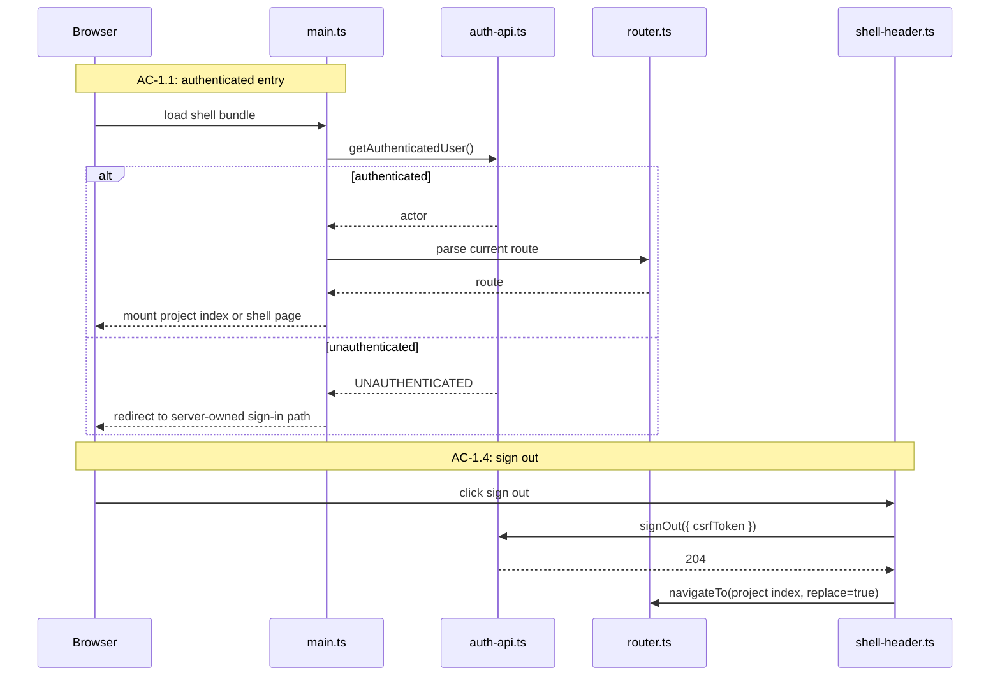
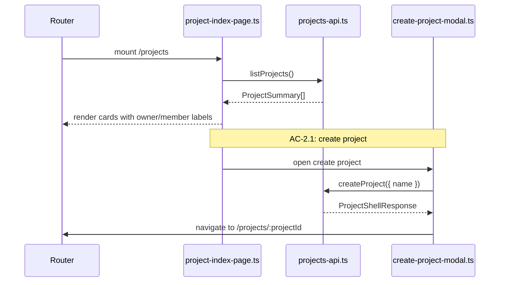
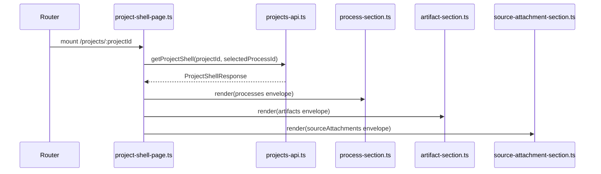
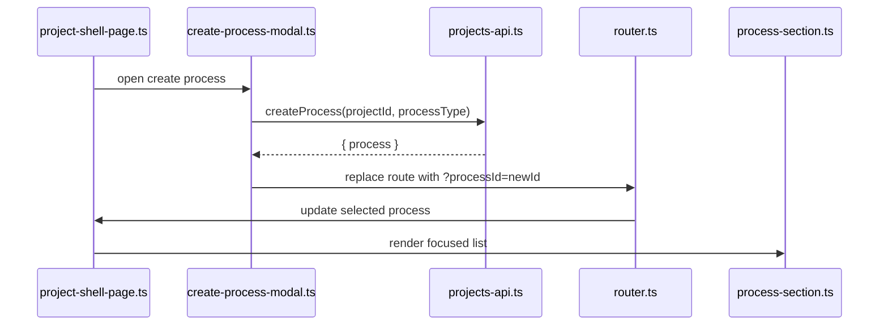

# Technical Design: Project and Process Shell Client

This companion document covers the browser-side implementation for Epic 1. The
client is a Vite-built vanilla TypeScript shell mounted inside the Fastify-owned
application boundary. It is not a separate SPA server and it does not own auth.

## HTML Shell: `apps/platform/client/index.html`

The browser receives one shell document for all authenticated project routes.
The HTML document stays intentionally thin:

- root mount element
- shell bootstrap script
- minimal server-injected bootstrap payload
- no route-specific markup duplicated across pages

The server-injected bootstrap payload should include only what the client needs
before its first API call:

- authenticated user summary
- current pathname and querystring
- CSRF token for browser-owned POST actions such as sign out
- environment-safe app config such as WorkOS sign-in origin

The client should not receive project or process data pre-rendered into the HTML
document. That keeps the shell delivery path stable and makes service-mock
testing easier.

## Client Bootstrap: `apps/platform/client/main.ts`

`main.ts` is the browser entry point. It should:

1. construct the application store
2. attach the router
3. load `/auth/me`
4. resolve the current route
5. mount the correct page module

If `/auth/me` fails with `UNAUTHENTICATED`, the bootstrap path should stop
immediately and redirect through the server-owned sign-in path. The client does
not attempt to recover or negotiate auth on its own.

### File Layout

```text
apps/platform/client/
├── index.html
├── main.ts
├── app/
│   ├── bootstrap.ts
│   ├── router.ts
│   ├── store.ts
│   ├── shell-app.ts
│   └── dom.ts
├── api/
│   ├── auth-api.ts
│   └── projects-api.ts
└── features/projects/
    ├── project-index-page.ts
    ├── project-shell-page.ts
    ├── create-project-modal.ts
    ├── create-process-modal.ts
    ├── shell-header.ts
    ├── process-section.ts
    ├── artifact-section.ts
    ├── source-attachment-section.ts
    ├── project-card.ts
    └── section-envelope.ts
```

## Client State: `apps/platform/client/app/store.ts`

The state model is intentionally simple in Epic 1. The client does not maintain
live process streaming state or offline mutation queues. It only needs enough
state to support shell navigation, modal visibility, route-derived selection,
and the current bootstrap payloads from the server.

### State Shape

```ts
export interface AppState {
  auth: {
    actor: AuthenticatedUser | null;
    isResolved: boolean;
    csrfToken: string | null;
  };
  route: {
    pathname: string;
    projectId: string | null;
    selectedProcessId: string | null;
  };
  projects: {
    list: ProjectSummary[] | null;
    isLoading: boolean;
    error: RequestError | null;
  };
  shell: {
    project: ProjectSummary | null;
    processes: ProcessSectionEnvelope | null;
    artifacts: ArtifactSectionEnvelope | null;
    sourceAttachments: SourceAttachmentSectionEnvelope | null;
    selectedProcessBanner: string | null;
    isLoading: boolean;
    error: RequestError | null;
  };
  modals: {
    createProjectOpen: boolean;
    createProcessOpen: boolean;
  };
}
```

The store should remain synchronous and framework-free. A small evented store
with explicit `get()`, `set()`, and `subscribe()` semantics is enough for Epic
1 and keeps the shell easy to reason about.

### State Store Interface

```ts
export interface AppStore {
  get(): AppState;
  set(next: Partial<AppState>): void;
  patch<K extends keyof AppState>(key: K, value: AppState[K]): void;
  subscribe(listener: (state: AppState) => void): () => void;
}
```

## Router: `apps/platform/client/app/router.ts`

The router is History API-based and route-derived. It does not persist selected
process state server-side. Its job is to interpret the browser URL, resolve the
current shell page, and keep the UI and URL aligned.

### Supported Routes

| Route | Meaning |
|-------|---------|
| `/projects` | Project index |
| `/projects/:projectId` | Project shell with no focused process |
| `/projects/:projectId?processId=:processId` | Project shell with route-derived selected process |

### Router Rules

- Browser refresh must re-open the current route.
- Back/forward navigation must restore project index vs project shell cleanly.
- If `processId` is present but missing from the loaded shell summaries, the
  router clears the selection with `history.replaceState()` and surfaces a
  process-unavailable banner in the shell.

### Route Parsing Interface

```ts
export interface ParsedRoute {
  kind: "project-index" | "project-shell";
  projectId: string | null;
  selectedProcessId: string | null;
}

export function parseRoute(url: URL): ParsedRoute;
export function navigateTo(route: ParsedRoute, options?: { replace?: boolean }): void;
```

## API Client Layer

The client mocks at the API boundary and lets routing, state updates, DOM
composition, and section rendering run for real.

### `apps/platform/client/api/auth-api.ts`

```ts
export async function getAuthenticatedUser(): Promise<AuthenticatedUser>;
export async function signOut(args: { csrfToken: string }): Promise<void>;
```

### `apps/platform/client/api/projects-api.ts`

```ts
export async function listProjects(): Promise<ProjectSummary[]>;

export async function createProject(body: CreateProjectRequest): Promise<ProjectShellResponse>;

export async function getProjectShell(args: {
  projectId: string;
  selectedProcessId?: string | null;
}): Promise<ProjectShellResponse>;

export async function createProcess(args: {
  projectId: string;
  processType: SupportedProcessType;
}): Promise<CreateProcessResponse>;
```

## Page and Section Architecture

### Project Index Page: `features/projects/project-index-page.ts`

Responsibilities:

- render project list or empty state
- render owner/member labels
- surface same-name disambiguation context
- open the create-project modal
- delegate project-open navigation to the router

### Project Shell Page: `features/projects/project-shell-page.ts`

Responsibilities:

- render active project identity and role
- render the shell header including sign-out
- request aggregated shell bootstrap when route changes
- render section envelopes for processes, artifacts, and source attachments
- surface unavailable banners and shell-level errors

### Section Modules

| Module | Responsibility |
|--------|----------------|
| `process-section.ts` | Render process summaries, current focus, status chips, next action, and available actions |
| `artifact-section.ts` | Render artifact summaries, version labels, and attachment context |
| `source-attachment-section.ts` | Render source summaries, purpose, target ref, hydration state, and attachment context |
| `section-envelope.ts` | Shared renderer helpers for `ready`, `empty`, and `error` states |

Each section module consumes its envelope contract directly. The page does not
re-interpret section payloads into a second client-only abstraction layer.

## Module Responsibility Matrix

| Module | Status | Responsibility | Dependencies | ACs Covered |
|--------|--------|----------------|--------------|-------------|
| `app/bootstrap.ts` | NEW | Resolve auth, start router, mount initial page | auth API, router, store | AC-1.1, AC-1.4 |
| `app/router.ts` | NEW | Parse URLs, navigate, restore selected process state | store, page loaders | AC-2.2, AC-2.3, AC-5.1, AC-6.2 |
| `project-index-page.ts` | NEW | Render accessible project list and empty state | projects API, create-project modal | AC-1.2, AC-1.3, AC-2.1 |
| `project-shell-page.ts` | NEW | Load and render aggregated shell response | projects API, section modules | AC-2.2, AC-3.1 to AC-6.3 |
| `create-project-modal.ts` | NEW | Validate project name and submit create requests | projects API, store | AC-2.1, AC-6.1a |
| `create-process-modal.ts` | NEW | Show supported process types and submit create requests | projects API, store | AC-4.1, AC-4.2, AC-6.1b |
| `shell-header.ts` | NEW | Show active actor/project context and sign-out action | auth API, router | AC-1.4, AC-2.3 |
| `process-section.ts` | NEW | Render process summaries and focus state | shell response contracts | AC-3.2, AC-4.4, AC-5.3 |
| `artifact-section.ts` | NEW | Render artifact summaries and empty/error states | shell response contracts | AC-3.3, AC-6.3 |
| `source-attachment-section.ts` | NEW | Render source summaries and empty/error states | shell response contracts | AC-3.4, AC-6.3 |

## Flow 1: Bootstrap, Auth Resolution, and Sign Out

**Covers:** AC-1.1, AC-1.4

The client enters every project route through the same bootstrap path. It does
not try to infer auth from stale local state. It asks the server for the current
actor, then either mounts the project shell or yields to the server-owned
redirect flow. Sign out follows the inverse path and clears the browser back to
a signed-out shell state. The bootstrap payload is also the source of the CSRF
token used by the sign-out request.



**Skeleton Requirements**

| What | Where | Stub Signature |
|------|-------|----------------|
| Bootstrap module | `apps/platform/client/app/bootstrap.ts` | `export async function bootstrapApp(): Promise<void> { throw new NotImplementedError('bootstrapApp') }` |
| Router | `apps/platform/client/app/router.ts` | `export function parseRoute(url: URL): ParsedRoute { throw new NotImplementedError('parseRoute') }` |
| Auth API | `apps/platform/client/api/auth-api.ts` | `export async function getAuthenticatedUser(): Promise<AuthenticatedUser> { throw new NotImplementedError('getAuthenticatedUser') }` |
| Shell header | `apps/platform/client/features/projects/shell-header.ts` | `export function renderShellHeader(...args: unknown[]): HTMLElement { throw new NotImplementedError('renderShellHeader') }` |

**TC Mapping for this Flow**

| TC | Tests | Module | Setup | Assert |
|----|-------|--------|-------|--------|
| TC-1.1a | authenticated bootstrap mounts app | `tests/service/server/auth-routes.test.ts` | Valid cookie | Shell HTML returned |
| TC-1.1b | unauthenticated bootstrap redirects | `tests/service/server/auth-routes.test.ts` | No session | Redirect before client mount |
| TC-1.1c | invalid session redirects | `tests/service/server/auth-routes.test.ts` | Invalid cookie | Redirect and cookie cleared |
| TC-1.4a | sign out action ends session | `tests/service/server/auth-routes.test.ts` | Valid session and CSRF token | 204 and cleared session |
| TC-1.4b | revisiting route after sign out requires auth | `tests/service/server/auth-routes.test.ts` | Signed-out state | Redirect to login |

The authoritative TC mapping for AC-1.4c remains server-owned in
`auth-routes.test.ts`, because the TC is about blocking access to the authenticated
working surface after logout. The client companion still expects a non-TC shell
test that clears rendered project data after logout success so stale project
content does not linger in the DOM.

## Flow 2: Project Index and Project Creation

**Covers:** AC-1.2, AC-1.3, AC-2.1, AC-6.1a

The project index is the user's first durable working surface. It must explain
what the user can open, distinguish same-name projects across owners, and make
project creation straightforward without introducing shell instability when the
user cancels.



**TC Mapping for this Flow**

| TC | Tests | Module | Setup | Assert |
|----|-------|--------|-------|--------|
| TC-1.2b | empty state shown when no projects exist | `tests/service/client/project-index-page.test.ts` | Empty list response | Empty state + create CTA visible |
| TC-1.2d | same-name projects distinguishable | `tests/service/client/project-index-page.test.ts` | Two same-name summaries with different owner names | Both cards rendered distinctly |
| TC-1.3a | owner role shown | `tests/service/client/project-index-page.test.ts` | Owner project summary | Owner label visible |
| TC-1.3b | member role shown | `tests/service/client/project-index-page.test.ts` | Member project summary | Member label visible |
| TC-2.1a | valid project creation transitions to shell | `tests/service/server/project-create-api.test.ts` | Valid input | 201 shell response |
| TC-2.1b | missing name validation | `tests/service/client/create-project-modal.test.ts` | Empty input submit | Validation message shown |
| TC-2.1c | cancel project creation | `tests/service/client/create-project-modal.test.ts` | Open modal, cancel | Modal closes, no request |
| TC-2.1d | duplicate name rejected | `tests/service/server/project-create-api.test.ts` | Existing owned name | Conflict surfaced |
| TC-6.1a | cancel project creation returns to stable index | `tests/service/client/create-project-modal.test.ts` | Modal open | Index remains unchanged |

## Flow 3: Project Shell Render with Section Envelopes

**Covers:** AC-2.2, AC-2.3, AC-3.1, AC-3.3, AC-3.4, AC-6.3

The project shell page is the browser projection of the aggregated bootstrap
response. It owns route-driven fetches, section envelope rendering, unavailable
banners, and active-project orientation. It does not decompose the aggregated
response into separate fetch lifecycles.



**TC Mapping for this Flow**

| TC | Tests | Module | Setup | Assert |
|----|-------|--------|-------|--------|
| TC-2.2a | open project from index | `tests/service/client/project-router.test.ts` | Click project card | Router navigates to shell and fetches bootstrap |
| TC-2.2b | open project from direct URL | `tests/service/client/project-router.test.ts` | Initial route `/projects/:id` | Shell loads without prior index route |
| TC-2.2c | switch between projects | `tests/service/client/project-router.test.ts` | Navigate project A → B | Project B shell replaces A cleanly |
| TC-2.3a | active project identity shown | `tests/service/client/project-shell-page.test.ts` | Loaded shell response | Project name and role visible |
| TC-2.3b | refresh inside shell | `tests/service/client/project-router.test.ts` | Reload current route | Same project route rehydrates |
| TC-2.3c | browser navigation restores shell/index state | `tests/service/client/project-router.test.ts` | History back/forward | Matching page restored |
| TC-3.1a | populated shell sections render | `tests/service/client/project-shell-page.test.ts` | All sections `ready` | Three populated sections visible |
| TC-3.1b | empty shell sections render | `tests/service/client/project-shell-page.test.ts` | All sections `empty` | Empty states shown |
| TC-3.1c | partial population renders mixed states | `tests/service/client/project-shell-page.test.ts` | Processes `ready`, others `empty` | Mixed section states render coherently |
| TC-3.3a through TC-3.3e | artifact section render behavior | `tests/service/client/artifact-section.test.ts` | Mock artifact envelopes | Version, scope context, ordering render correctly |
| TC-3.4a through TC-3.4e | source section render behavior | `tests/service/client/source-attachment-section.test.ts` | Mock source envelopes | Purpose, ref, hydration, scope, ordering render correctly |
| TC-6.3a through TC-6.3c | one failed section does not block shell | `tests/service/client/project-shell-page.test.ts` | One section `error`, others not | Shell still renders project and healthy sections |

## Flow 4: Process Focus, Create Process, and Return Visibility

**Covers:** AC-3.2, AC-4.1, AC-4.2, AC-4.3, AC-4.4, AC-5.1, AC-5.3, AC-6.1b, AC-6.2b

This flow is where the shell becomes actionable rather than merely informative.
The user can create a process, see the process appear in the list, focus one
process through the route, and later return to that route with enough summary
context to decide what to do next.



**TC Mapping for this Flow**

| TC | Tests | Module | Setup | Assert |
|----|-------|--------|-------|--------|
| TC-3.2a through TC-3.2h | process summary rendering across statuses | `tests/service/client/process-section.test.ts` | Mock process envelopes for each status | Correct status, next action, and available actions visible |
| TC-4.1a | supported process types available | `tests/service/client/create-process-modal.test.ts` | Open create-process modal | Only three supported types shown |
| TC-4.1c | unsupported process types absent | `tests/service/client/create-process-modal.test.ts` | Open modal | No placeholder or unsupported option rendered |
| TC-4.2d | no manual label entry at creation | `tests/service/client/create-process-modal.test.ts` | Open modal | No manual name input present |
| TC-4.4c | focused process visibly selected | `tests/service/client/project-router.test.ts` | Route includes valid `processId` | Focus styling/banner applied |
| TC-5.1a | browser reload restores project shell | `tests/service/client/project-router.test.ts` | Reload shell route | Same shell state re-fetched |
| TC-5.1b | return later restores durable route state | `tests/integration/platform-shell.test.ts` | Re-open route after sign-in | Project shell visible again |
| TC-5.3a through TC-5.3c | interrupted/waiting/failed return visibility | `tests/service/client/process-section.test.ts` | Mock summary envelopes | Actionable return state rendered |
| TC-6.1b | cancel process creation | `tests/service/client/create-process-modal.test.ts` | Modal open, cancel | No request and shell unchanged |
| TC-6.2b | missing selected process reference | `tests/service/client/project-router.test.ts` | Route has missing `processId` | Banner shown and query cleared |

## Interface Definitions

### Shared Response Types Used by the Client

```ts
export interface AuthenticatedUser {
  id: string;
  email: string | null;
  displayName: string | null;
}

export interface RequestError {
  code: string;
  message: string;
  status: number;
}
```

### Page Interfaces

```ts
export interface ProjectIndexPageDeps {
  store: AppStore;
  api: Pick<typeof import("../api/projects-api"), "listProjects" | "createProject">;
  router: {
    openProject(projectId: string): void;
  };
}

export interface ProjectShellPageDeps {
  store: AppStore;
  api: Pick<typeof import("../api/projects-api"), "getProjectShell" | "createProcess">;
  router: {
    replaceSelectedProcess(projectId: string, processId: string | null): void;
  };
}
```

### Section Renderers

```ts
export interface ProcessSectionProps {
  envelope: ProcessSectionEnvelope;
  selectedProcessId: string | null;
}

export interface ArtifactSectionProps {
  envelope: ArtifactSectionEnvelope;
}

export interface SourceAttachmentSectionProps {
  envelope: SourceAttachmentSectionEnvelope;
}
```

### Modal Actions

```ts
export interface CreateProjectModalActions {
  submit(name: string): Promise<void>;
  cancel(): void;
}

export interface CreateProcessModalActions {
  submit(processType: SupportedProcessType): Promise<void>;
  cancel(): void;
}
```

## Client Testing Strategy

Client tests run in JSDOM and mock only the API boundary. The router, store, DOM
updates, and section renderers run for real. That keeps the test surface close
to what a user actually experiences without dragging in browser-wide E2E costs
for every change.

Primary test entry points:

- `project-index-page.ts`
- `project-shell-page.ts`
- `project-router.ts`
- `create-project-modal.ts`
- `create-process-modal.ts`
- section modules

Manual verification still matters because Epic 1 is largely a shell-feel epic.
Visual hierarchy, spacing, empty-state clarity, and route transitions need a
quick gorilla pass even after automated tests pass.
