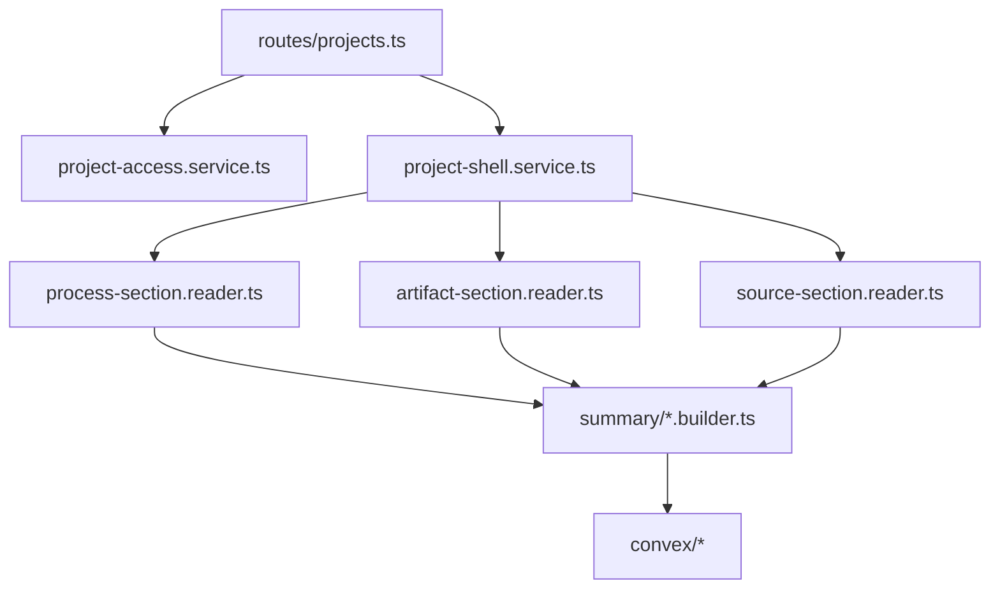
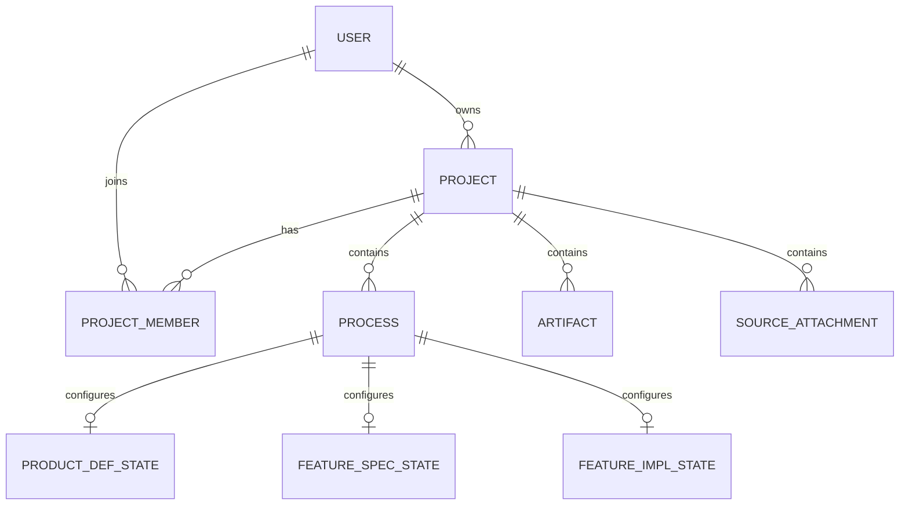
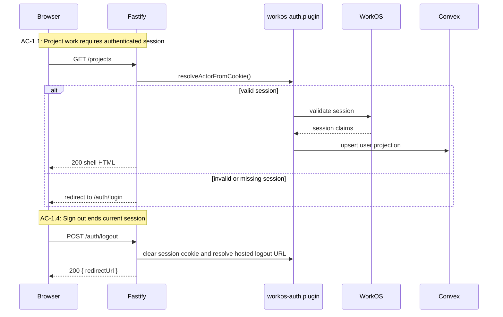
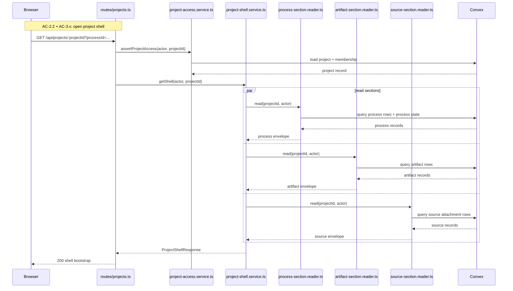
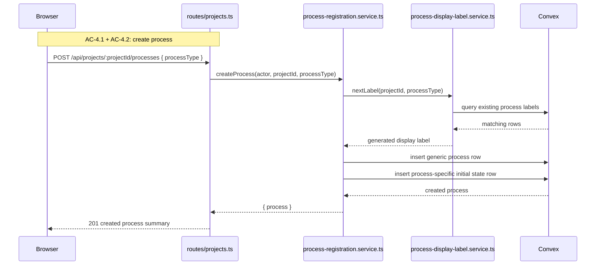
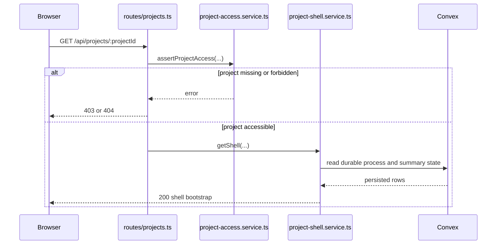

# Technical Design: Project and Process Shell Server

This companion document covers the Fastify, WorkOS, Convex, and API design for
Epic 1. It expands the server-owned parts of the index document into exact
module boundaries, flow design, and copy-paste-ready interfaces.

## Server Bootstrap

The server is a single Fastify 5 application that owns shell delivery, auth,
project APIs, and durable-state orchestration. Epic 1 does not split the shell
into a separate SPA server. Fastify remains the real app boundary in both
development and production.

### Entry Point: `apps/platform/server/index.ts`

Responsibilities:

- load environment configuration
- construct the Fastify app
- register `@fastify/vite` in dev and production modes
- start the HTTP server
- expose a health endpoint for local verification and integration tests

### App Factory: `apps/platform/server/app.ts`

Responsibilities:

- register cookie handling and auth plugin
- register Fastify's Zod validator/serializer compilers once at app startup
- register auth and project routes
- register Vite integration and shell HTML handling
- attach shared error handling and request logging

The app factory is the main service-mock test entry point. Server tests should
build the app and exercise routes through `app.inject()` rather than calling
services directly.

### Route Schema and Type-Provider Strategy

Epic 1 should use Zod-authored shared contracts together with
`fastify-type-provider-zod`.

- `apps/platform/shared/contracts/` is the source of truth for browser/server
  request and response shapes
- each contract module exports both the Zod schema and inferred TS types
- `app.ts` wires `validatorCompiler` and `serializerCompiler` once
- route modules and plugins call `withTypeProvider<ZodTypeProvider>()` within
  their local Fastify scope rather than assuming provider types propagate
  globally through encapsulation

This keeps runtime validation, serialization, and TypeScript inference aligned
without maintaining parallel handwritten interfaces plus separate route
validators.

### CSRF Strategy

Epic 1 uses Fastify-native CSRF protection for browser-owned mutating auth
actions, beginning with `POST /auth/logout`.

- `csrf.plugin.ts` wraps `@fastify/csrf-protection` alongside `@fastify/cookie`
- the plugin generates a token during shell HTML delivery
- the token is injected into `window.__SHELL_BOOTSTRAP__`
- the client sends the token back in `X-CSRF-Token`
- `routes/auth.ts` runs Fastify's CSRF validation before clearing the session

This keeps logout specific and explicit. The shell does not need a generic
client-side CSRF framework yet, but it does need one concrete, documented path
for the first POST action in the app chrome.

## Top-Tier Surface Nesting

| Surface | Epic 1 Nesting |
|---------|----------------|
| Projects | `routes/projects.ts`, `project-index.service.ts`, `project-create.service.ts`, `project-shell.service.ts` |
| Processes | `process-registration.service.ts`, `process-summary.builder.ts`, process-specific state writers |
| Artifacts | `artifact-section.reader.ts`, `artifact-summary.builder.ts` |
| Sources | `source-section.reader.ts`, `source-summary.builder.ts` |
| Auth boundary | `workos-auth.plugin.ts`, `auth-session.service.ts`, `auth-user-sync.service.ts`, `routes/auth.ts` |

The shell route layer lives inside the Projects surface, but it reaches into
Processes, Artifacts, and Sources through summary readers only. That keeps Epic
1 in a projection posture rather than prematurely implementing deeper workflows.

## Module Architecture

```text
apps/platform/server/
├── index.ts
├── app.ts
├── plugins/
│   ├── cookies.plugin.ts
│   ├── workos-auth.plugin.ts
│   ├── vite.plugin.ts
│   └── csrf.plugin.ts
├── routes/
│   ├── auth.ts
│   └── projects.ts
├── services/
│   ├── auth/
│   │   ├── auth-session.service.ts
│   │   └── auth-user-sync.service.ts
│   └── projects/
│       ├── project-access.service.ts
│       ├── project-index.service.ts
│       ├── project-create.service.ts
│       ├── project-shell.service.ts
│       ├── process-registration.service.ts
│       ├── process-display-label.service.ts
│       ├── readers/
│       │   ├── process-section.reader.ts
│       │   ├── artifact-section.reader.ts
│       │   └── source-section.reader.ts
│       └── summary/
│           ├── process-summary.builder.ts
│           ├── artifact-summary.builder.ts
│           └── source-summary.builder.ts
├── schemas/
│   ├── auth.ts
│   ├── projects.ts
│   └── common.ts
└── errors/
    ├── codes.ts
    ├── app-error.ts
    └── section-error.ts
```

### Module Responsibility Matrix

| Module | Status | Responsibility | Dependencies | ACs Covered |
|--------|--------|----------------|--------------|-------------|
| `plugins/workos-auth.plugin.ts` | NEW | Validate session cookies, build request actor, protect project shell routes | WorkOS SDK, cookies, auth services | AC-1.1, AC-1.3, AC-1.4 |
| `routes/auth.ts` | NEW | `/auth/me`, `/auth/logout`, login/callback redirect flow | auth services, schemas | AC-1.1, AC-1.4 |
| `routes/projects.ts` | NEW | `/api/projects` and `/api/projects/:projectId` handlers | project services, schemas | AC-1.2 to AC-6.3 |
| `project-index.service.ts` | NEW | Read accessible projects for current actor | access service, Convex queries | AC-1.2, AC-1.3 |
| `project-create.service.ts` | NEW | Create project and owner membership atomically | Convex mutations | AC-2.1, AC-6.1a |
| `project-shell.service.ts` | NEW | Compose aggregated shell response and capture section failures | access service, section readers | AC-2.2, AC-3.1, AC-6.3 |
| `process-registration.service.ts` | NEW | Create process row and initial process-specific state rows | label service, Convex mutations | AC-4.1 to AC-4.4 |
| `process-display-label.service.ts` | NEW | Generate project-local auto labels | Convex queries | AC-4.2, AC-4.3 |
| `process-section.reader.ts` | NEW | Read process rows, process-specific state, and projected shell summaries | summary builder, Convex queries | AC-3.1, AC-3.2, AC-5.3 |
| `artifact-section.reader.ts` | NEW | Read artifact rows and build shell summaries | summary builder, Convex queries | AC-3.1, AC-3.3, AC-6.3 |
| `source-section.reader.ts` | NEW | Read source attachment rows and build shell summaries | summary builder, Convex queries | AC-3.1, AC-3.4, AC-6.3 |

### Component Interaction Diagram



The route layer owns HTTP semantics and request error codes. The shell service
owns aggregation and partial-failure policy. Readers own one section each.
Builders translate durable records into browser-facing summaries.

## Durable State Model

Epic 1 establishes the durable schema split instead of delaying it. The shell
needs generic process records immediately, but later process epics need
process-specific state without unwinding a generic JSON blob model.

### Convex Tables

| Table | Purpose | Notes |
|-------|---------|-------|
| `users` | Authenticated platform users | Keyed by internal Convex id; stores WorkOS external id |
| `projects` | Durable project container | Stores project identity and owner reference |
| `projectMembers` | Owner/member access records | Supports access gating and role display |
| `processes` | Generic process identity and shell fields | Stores `processType`, `displayLabel`, `status`, `phaseLabel`, `hasEnvironment`, timestamps |
| `processProductDefinitionStates` | ProductDefinition-specific initial state | Minimal row created at process registration |
| `processFeatureSpecificationStates` | FeatureSpecification-specific initial state | Minimal row created at process registration |
| `processFeatureImplementationStates` | FeatureImplementation-specific initial state | Minimal row created at process registration |
| `artifacts` | Generic artifact rows | Shell reads summary projections only |
| `sourceAttachments` | Repo/source attachment rows | Shell reads summary projections only |

### Ownership Model



`artifacts` and `sourceAttachments` carry `projectId` and optional `processId`.
That preserves the project as the top-level container while still letting the
shell answer whether an item is project-scoped or process-scoped.

Each process row is type-exclusive with respect to process-specific state. A
`ProductDefinition` process gets exactly one row in
`processProductDefinitionStates` and no rows in the other two process-state
tables. The same rule applies to `FeatureSpecification` and
`FeatureImplementation`.

### Convex Field Outline

Chunk 0 should implement `convex/schema.ts` and the table modules using these
field names as the baseline durable model for Epic 1:

```ts
export interface UserRow {
  workosUserId: string;
  email: string | null;
  displayName: string | null;
  createdAt: string;
  updatedAt: string;
}

export interface ProjectRow {
  ownerUserId: string;
  name: string;
  lastUpdatedAt: string;
  createdAt: string;
  updatedAt: string;
}

export interface ProjectMemberRow {
  projectId: string;
  userId: string;
  role: "owner" | "member";
  createdAt: string;
  updatedAt: string;
}

export interface ProcessRow {
  projectId: string;
  processType: SupportedProcessType;
  displayLabel: string;
  status: ProcessStatus;
  phaseLabel: string;
  nextActionLabel: string | null;
  hasEnvironment: boolean;
  createdAt: string;
  updatedAt: string;
}

export interface ProcessProductDefinitionStateRow {
  processId: string;
  createdAt: string;
  updatedAt: string;
}

export interface ProcessFeatureSpecificationStateRow {
  processId: string;
  createdAt: string;
  updatedAt: string;
}

export interface ProcessFeatureImplementationStateRow {
  processId: string;
  createdAt: string;
  updatedAt: string;
}

export interface ArtifactRow {
  projectId: string;
  processId: string | null;
  displayName: string;
  currentVersionLabel: string | null;
  updatedAt: string;
}

export interface SourceAttachmentRow {
  projectId: string;
  processId: string | null;
  displayName: string;
  purpose: "research" | "review" | "implementation" | "other";
  targetRef: string | null;
  hydrationState: "not_hydrated" | "hydrated" | "stale" | "unavailable";
  updatedAt: string;
}
```

At minimum, Chunk 0 should provide indexes that support:

- `users` by `workosUserId`
- `projects` by `ownerUserId` and by `lastUpdatedAt`
- `projectMembers` by `projectId` and by `userId`
- `processes` by `projectId` and `updatedAt`
- `artifacts` by `projectId` and `updatedAt`
- `sourceAttachments` by `projectId` and `updatedAt`

## Core Interfaces

### Auth Actor

```ts
export interface AuthenticatedActor {
  userId: string;
  workosUserId: string;
  email: string | null;
  displayName: string | null;
}
```

### Section Envelope

```ts
export interface SectionError<TCode extends string = string> {
  code: TCode;
  message: string;
}

export interface ShellSectionEnvelope<TItem, TCode extends string = string> {
  status: "ready" | "empty" | "error";
  items: TItem[];
  error?: SectionError<TCode>;
}
```

### Route Handler Contracts

```ts
export interface ProjectShellParams {
  projectId: string;
}

export interface ProjectShellQuery {
  processId?: string;
}

export interface LogoutHeaders {
  "x-csrf-token": string;
}

export interface CreateProjectBody {
  name: string;
}

export interface CreateProcessBody {
  processType: "ProductDefinition" | "FeatureSpecification" | "FeatureImplementation";
}
```

### Service Interfaces

```ts
export interface ProjectShellService {
  getShell(args: {
    actor: AuthenticatedActor;
    projectId: string;
    selectedProcessId?: string;
  }): Promise<ProjectShellResponse>;
}

export interface ProjectSectionReader<TItem, TCode extends string = string> {
  read(args: {
    actor: AuthenticatedActor;
    projectId: string;
  }): Promise<ShellSectionEnvelope<TItem, TCode>>;
}

export interface ProcessRegistrationService {
  createProcess(args: {
    actor: AuthenticatedActor;
    projectId: string;
    processType: SupportedProcessType;
  }): Promise<{ process: ProcessSummary }>;
}
```

### Process Summary Projection Contract

```ts
export interface ProcessSummaryProjection {
  build(args: {
    process: ProcessRecord;
    state: unknown;
  }): ProcessSummary;
}
```

This interface is intentionally generic on the shell side. Each process module
owns how it derives `phaseLabel`, `nextActionLabel`, and `availableActions`.

## Flow 1: Authenticated Shell Entry and Sign Out

**Covers:** AC-1.1, AC-1.3, AC-1.4

This flow protects every project-facing route and ensures the shell only renders
for a validated actor. It also gives the shell a complete sign-out path in the
first pass instead of treating logout as future polish. The browser sees one
coherent auth boundary: sign in through WorkOS, work inside Fastify-owned
routes, sign out through Fastify-owned logout.



**Skeleton Requirements**

| What | Where | Stub Signature |
|------|-------|----------------|
| Auth plugin | `apps/platform/server/plugins/workos-auth.plugin.ts` | `export async function workosAuthPlugin(app: FastifyInstance) { throw new NotImplementedError('workosAuthPlugin') }` |
| CSRF plugin | `apps/platform/server/plugins/csrf.plugin.ts` | `export async function csrfPlugin(app: FastifyInstance) { throw new NotImplementedError('csrfPlugin') }` |
| Auth routes | `apps/platform/server/routes/auth.ts` | `export async function registerAuthRoutes(app: FastifyInstance) { throw new NotImplementedError('registerAuthRoutes') }` |
| Session service | `apps/platform/server/services/auth/auth-session.service.ts` | `export class AuthSessionService { async getActor(): Promise<AuthenticatedActor | null> { throw new NotImplementedError('AuthSessionService.getActor') } }` |
| User sync service | `apps/platform/server/services/auth/auth-user-sync.service.ts` | `export class AuthUserSyncService { async syncActor(): Promise<void> { throw new NotImplementedError('AuthUserSyncService.syncActor') } }` |

**TC Mapping for this Flow**

| TC | Tests | Module | Setup | Assert |
|----|-------|--------|-------|--------|
| TC-1.1a | authenticated shell route returns HTML | `tests/service/server/auth-routes.test.ts` | Valid session cookie, mocked WorkOS validation | 200 response with shell HTML |
| TC-1.1b | unauthenticated shell route redirects | `tests/service/server/auth-routes.test.ts` | No cookie | Redirect to sign-in |
| TC-1.1c | invalid session redirects and clears | `tests/service/server/auth-routes.test.ts` | Invalid/stale cookie | Redirect + cookie cleared |
| TC-1.3c | forbidden project route blocks access | `tests/service/server/projects-api.test.ts` | Valid actor without membership | 403 or unavailable shell contract |
| TC-1.4a | sign out clears session | `tests/service/server/auth-routes.test.ts` | Valid cookie | 200, redirectUrl, and cleared cookie |
| TC-1.4b | revisiting project URL requires auth again | `tests/service/server/auth-routes.test.ts` | Signed-out client | Redirect before project data |
| TC-1.4c | sign out removes active shell access | `tests/service/server/auth-routes.test.ts` | Existing session then logout | Subsequent project route blocked |

## Flow 2: Project Create and Project Index Read

**Covers:** AC-1.2, AC-2.1, AC-6.1a

The project index and project create flow are the first durable writes and reads
the platform exposes. The server has to enforce ownership semantics, support
same-name projects across different owners, and reject duplicate owned names
without leaking inaccessible projects.

```mermaid
sequenceDiagram
    participant Browser
    participant Route as routes/projects.ts
    participant Index as project-index.service.ts
    participant Create as project-create.service.ts
    participant Convex

    Note over Browser,Route: AC-1.2: list accessible projects
    Browser->>Route: GET /api/projects
    Route->>Index: listAccessibleProjects(actor)
    Index->>Convex: query projects + memberships
    Convex-->>Index: project rows
    Index-->>Route: project summaries
    Route-->>Browser: 200 project list

    Note over Browser,Route: AC-2.1: create project
    Browser->>Route: POST /api/projects { name }
    Route->>Create: createProject(actor, name)
    Create->>Convex: insert project + owner membership
    Convex-->>Create: created project
    Create-->>Route: ProjectShellResponse
    Route-->>Browser: 201 shell bootstrap
```

**Skeleton Requirements**

| What | Where | Stub Signature |
|------|-------|----------------|
| Projects route registration | `apps/platform/server/routes/projects.ts` | `export async function registerProjectRoutes(app: FastifyInstance) { throw new NotImplementedError('registerProjectRoutes') }` |
| Index service | `apps/platform/server/services/projects/project-index.service.ts` | `export class ProjectIndexService { async listAccessibleProjects(): Promise<ProjectSummary[]> { throw new NotImplementedError('ProjectIndexService.listAccessibleProjects') } }` |
| Create service | `apps/platform/server/services/projects/project-create.service.ts` | `export class ProjectCreateService { async createProject(): Promise<ProjectShellResponse> { throw new NotImplementedError('ProjectCreateService.createProject') } }` |

**TC Mapping for this Flow**

| TC | Tests | Module | Setup | Assert |
|----|-------|--------|-------|--------|
| TC-1.2a | project list only includes accessible projects | `tests/service/server/projects-api.test.ts` | Actor with memberships in three projects | Response includes three accessible summaries |
| TC-1.2c | inaccessible project omitted | `tests/service/server/projects-api.test.ts` | Extra project exists without membership | Project absent from response |
| TC-2.1a | create project success | `tests/service/server/project-create-api.test.ts` | Valid actor + unique name | 201 + owner membership + shell response |
| TC-2.1b | missing name rejected | `tests/service/server/project-create-api.test.ts` | Empty payload | 422 validation error |
| TC-2.1c | cancelled create creates no record | `tests/service/client/create-project-modal.test.ts` | Modal open, no submit | No request sent |
| TC-2.1d | duplicate owned name rejected | `tests/service/server/project-create-api.test.ts` | Existing owned name | 409 conflict |
| TC-6.1a | cancel project creation returns to stable state | `tests/service/client/create-project-modal.test.ts` | Modal open, cancel action | Modal closes, index unchanged |

## Flow 3: Aggregated Project Shell Bootstrap

**Covers:** AC-2.2, AC-3.1, AC-3.2, AC-3.3, AC-3.4, AC-5.2, AC-6.2b, AC-6.3

This is the central server flow for Epic 1. The browser opens one project and
receives one response. Internally, the server composes that response from
independent section readers. Project identity and access are all-or-nothing.
Section data is not. That split is what makes partial shell rendering possible
without client fan-out.



**Skeleton Requirements**

| What | Where | Stub Signature |
|------|-------|----------------|
| Shell service | `apps/platform/server/services/projects/project-shell.service.ts` | `export class ProjectShellService { async getShell(): Promise<ProjectShellResponse> { throw new NotImplementedError('ProjectShellService.getShell') } }` |
| Process reader | `apps/platform/server/services/projects/readers/process-section.reader.ts` | `export class ProcessSectionReader implements ProjectSectionReader<ProcessSummary> { async read() { throw new NotImplementedError('ProcessSectionReader.read') } }` |
| Artifact reader | `apps/platform/server/services/projects/readers/artifact-section.reader.ts` | `export class ArtifactSectionReader implements ProjectSectionReader<ArtifactSummary> { async read() { throw new NotImplementedError('ArtifactSectionReader.read') } }` |
| Source reader | `apps/platform/server/services/projects/readers/source-section.reader.ts` | `export class SourceSectionReader implements ProjectSectionReader<SourceAttachmentSummary> { async read() { throw new NotImplementedError('SourceSectionReader.read') } }` |
| Summary builders | `apps/platform/server/services/projects/summary/*.ts` | `export function buildProcessSummary(...) { throw new NotImplementedError('buildProcessSummary') }` |

**TC Mapping for this Flow**

| TC | Tests | Module | Setup | Assert |
|----|-------|--------|-------|--------|
| TC-2.2b | direct shell bootstrap by project URL | `tests/service/client/project-router.test.ts` | Router loads `/projects/:id` | API fetch fires and shell renders |
| TC-3.1a | populated shell response | `tests/service/client/project-shell-page.test.ts` | Project has all section data | All three sections render populated summaries |
| TC-3.1b | empty shell response | `tests/service/client/project-shell-page.test.ts` | Project has no items | All three sections render empty states |
| TC-3.1c | partial population | `tests/service/client/project-shell-page.test.ts` | Only process data exists | Process section renders while the others stay empty |
| TC-3.2a through TC-3.2h | process summary projection cases | `tests/service/client/process-section.test.ts` | Mock envelope variants | Visible status/action rendering matches summary |
| TC-3.3a through TC-3.3e | artifact summary projection cases | `tests/service/client/artifact-section.test.ts` | Mock artifact envelopes | Identity, version, scope, and ordering render correctly |
| TC-3.4a through TC-3.4e | source summary projection cases | `tests/service/client/source-attachment-section.test.ts` | Mock source envelopes | Purpose, ref, hydration state, scope, and ordering render correctly |
| TC-5.2a through TC-5.2c | shell loads without environment | `tests/service/server/project-shell-bootstrap-api.test.ts` | Processes without environments | Shell still returns durable summaries |
| TC-6.2b | invalid selected process reference | `tests/service/client/project-router.test.ts` | URL includes missing `processId` | Shell renders, selection cleared, banner shown |
| TC-6.3a through TC-6.3c | section-level read failures | `tests/service/server/project-shell-bootstrap-api.test.ts` | One reader throws, others succeed | Failing section envelope is `error`, others still return |

The server-bootstrap contract itself is still defended directly in
`project-shell-bootstrap-api.test.ts` through the non-TC section-envelope shape
and stable section-error-code tests in the test plan.

## Flow 4: Process Registration and Auto Labeling

**Covers:** AC-4.1, AC-4.2, AC-4.3, AC-4.4, AC-6.1b

Process registration is the first place the shell writes durable process state.
It must create a generic process row, the correct process-specific initial state
row, and a display label that keeps same-type processes distinct inside a
project without asking the user to name them manually.

Epic 1 uses a deterministic display-label format:

- `Product Definition #<n>`
- `Feature Specification #<n>`
- `Feature Implementation #<n>`

The sequence is project-local and process-type-local. Creating the second
`FeatureSpecification` in one project yields `Feature Specification #2` even if
other process types already exist in that project.

Registration writes exactly one process-specific state row, chosen by
`processType`. It never creates rows in the other two process-state tables.



**Skeleton Requirements**

| What | Where | Stub Signature |
|------|-------|----------------|
| Process registration service | `apps/platform/server/services/projects/process-registration.service.ts` | `export class ProcessRegistrationService { async createProcess(args: { actor: AuthenticatedActor; projectId: string; processType: SupportedProcessType }): Promise<{ process: ProcessSummary }> { throw new NotImplementedError('ProcessRegistrationService.createProcess') } }` |
| Label service | `apps/platform/server/services/projects/process-display-label.service.ts` | `export class ProcessDisplayLabelService { async nextLabel(args: { projectId: string; processType: SupportedProcessType }): Promise<string> { throw new NotImplementedError('ProcessDisplayLabelService.nextLabel') } }` |

**TC Mapping for this Flow**

| TC | Tests | Module | Setup | Assert |
|----|-------|--------|-------|--------|
| TC-4.1a | supported process types exposed | `tests/service/client/create-process-modal.test.ts` | Render modal | Only three allowed types shown |
| TC-4.1b | create ProductDefinition process | `tests/service/server/processes-api.test.ts` | Valid actor + project | 201 + created ProductDefinition summary |
| TC-4.1c | unsupported type rejected | `tests/service/server/processes-api.test.ts` | Invalid type payload | 422 invalid process type |
| TC-4.2a | initial process state exists | `tests/service/server/processes-api.test.ts` | Create process | Process row + type state row created |
| TC-4.2b | no environment required | `tests/service/server/processes-api.test.ts` | Create process | `hasEnvironment` false and summary still valid |
| TC-4.2c | process created in correct project | `tests/service/server/processes-api.test.ts` | Two accessible projects exist | New process only in selected project |
| TC-4.2d | no manual label entry | `tests/service/client/create-process-modal.test.ts` | Open create-process UI | No manual name field |
| TC-4.3a | different-type coexistence | `tests/service/server/processes-api.test.ts` | Existing process of other type | Both summaries remain distinct |
| TC-4.3b | same-type coexistence | `tests/service/server/processes-api.test.ts` | Existing same-type process | Labels remain distinct |
| TC-4.3c | existing state preserved | `tests/service/server/processes-api.test.ts` | Existing process has related summaries | Existing rows unchanged after new create |
| TC-4.4a | ordering by most recent update | `tests/service/client/process-section.test.ts` | Mock multiple process summaries | Newest first render order |
| TC-4.4b | new process rises to top | `tests/service/client/project-shell-page.test.ts` | Existing list then created process inserted | Created process appears first |
| TC-4.4c | focused process visible | `tests/service/client/project-router.test.ts` | URL with `processId` | Focused summary marked |
| TC-6.1b | cancel process creation | `tests/service/client/create-process-modal.test.ts` | Open modal, cancel | No request sent, shell unchanged |

## Flow 5: Unavailable and Recovery Semantics

**Covers:** AC-5.1, AC-5.3, AC-6.2

Epic 1 does not resume environments or processes directly, but it must preserve
enough durable state that the user can return and decide what to do next. The
server side of that requirement is simple but strict: never treat the absence of
an environment as the absence of the process, and never leak removed or
forbidden project data.



**TC Mapping for this Flow**

| TC | Tests | Module | Setup | Assert |
|----|-------|--------|-------|--------|
| TC-5.1c | server restart preserves shell data | `tests/integration/platform-shell.test.ts` | Seed Convex, restart server, reopen project | Same durable shell data returns |
| TC-5.3a | interrupted summary remains actionable | `tests/service/client/process-section.test.ts` | Interrupted process envelope | Resume/review/rehydrate/restart actions visible as applicable |
| TC-5.3b | waiting summary remains actionable | `tests/service/client/process-section.test.ts` | Waiting process envelope | Blocking action visible |
| TC-5.3c | failed summary visible | `tests/service/client/process-section.test.ts` | Failed process envelope | Failed state rendered distinctly |
| TC-6.2a | removed or forbidden bookmarked project | `tests/service/server/project-shell-bootstrap-api.test.ts` | Missing or forbidden project | 403/404 without project data |

## Error Handling Strategy

Request-level errors use `AppError` subclasses with stable machine-readable
codes. Section-level failures use `SectionError` values and are converted into
error envelopes inside `project-shell.service.ts`.

This split matters:

- request-level failures block the shell
- section-level failures degrade the shell

That distinction is central to AC-6.3 and should remain visible in route tests,
shared contracts, and client section rendering.

## Server-Side Testing Strategy

The server test entry points are:

- `app.inject()` for all auth and API route behavior
- Convex query/mutation boundaries mocked or test-backed, depending on suite
- WorkOS SDK boundaries mocked in service tests

Internal services are not mocked. The route handler, service orchestration, and
summary builders should run together in server service-mock tests. External
systems stay at the mock boundary:

- WorkOS SDK
- Convex client wrapper

Integration tests can run against a real Fastify server plus a prepared Convex
environment, but that is a `verify-all` concern, not the primary TDD layer.
