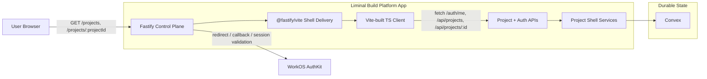
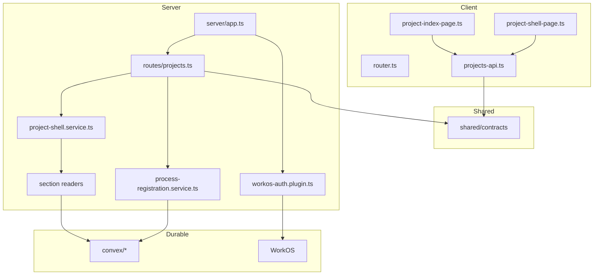

# Technical Design: Project and Process Shell

## Purpose

This document translates Epic 1 into implementable architecture for the first
working Liminal Build platform shell. It is the index document for a four-file
tech design set:

| Document | Role |
|----------|------|
| `tech-design.md` | Decision record, system view, repo shape, work breakdown |
| `tech-design-server.md` | Fastify, WorkOS, Convex, API, and summary-projection design |
| `tech-design-client.md` | Vite client shell, route model, page modules, and UI state design |
| `test-plan.md` | TC-to-test mapping, mock boundaries, fixtures, and test counts |

The downstream consumers are:

| Audience | What they need from this design |
|----------|---------------------------------|
| Reviewers | Clear decisions, exact boundaries, and visible trade-offs before implementation starts |
| Story authors | Chunk boundaries, relevant sections, and stable technical targets |
| Implementers | Exact file paths, contracts, and verification gates |

## Spec Validation

Epic 1 is designable after the recent backfills. Every AC now has an
implementation home, the shell contract can represent partial section failures,
logout is explicitly in scope, and process/source/artifact summaries carry the
minimum context required for a multi-process shell.

The design treats the epic as functionally complete and resolves the remaining
questions at implementation altitude rather than product altitude. No blocking
spec defects remain.

### Issues Found

| Issue | Spec Location | Resolution | Status |
|-------|---------------|------------|--------|
| Partial section failures were required behavior but were not represented in the original shell response contract | AC-6.3, Data Contracts | Epic was backfilled with section envelopes carrying `status`, `items`, and optional `error` | Resolved |
| Artifact and source summaries did not explain why an item appeared in the shell | AC-3.3, AC-3.4 | Epic was backfilled with minimal project-vs-process attachment context | Resolved |
| Logout behavior was missing from the original auth flow | Scope, Flow 1 | Epic now includes sign-out scope, endpoint, and AC/TC coverage | Resolved |
| The original shell contract implied array-only sections while the planned implementation uses one aggregated bootstrap | Data Contracts, Tech Design Questions | This design keeps the aggregated bootstrap and composes independent section readers behind it | Resolved — clarified |
| Optional `processId` on the shell route implied `PROCESS_NOT_FOUND` in the error table, but AC-6.2b requires the shell to remain usable when the selected process is missing | Query parameter contract, AC-6.2b | Aggregated shell bootstrap returns `200` for accessible projects and the client clears invalid process selection route state after comparing against `processes.items`; `PROCESS_NOT_FOUND` remains reserved for dedicated process resources | Resolved — clarified |

## Context

Epic 1 is the first slice that proves the platform's primary abstraction. The
user is not entering a generic chat product. They are entering a durable
project container that can hold multiple crafted processes, each with its own
identity, state, artifacts, and source relationships. If that shell feels weak,
the rest of the platform inherits a shaky foundation. If it feels reliable,
later epics can deepen process execution, review, and source hydration without
changing the user’s mental model.

The architecture already settles the larger technical world. Fastify owns the
application control plane. Convex stores durable project, process, artifact, and
source state. WorkOS owns the external authentication experience, but project
authorization remains application-owned. Environments, provider abstraction,
tool runtime, and live transport are later concerns. Epic 1 must respect those
future seams while intentionally not implementing them yet.

This is also a greenfield implementation. The current workspace contains specs
and references, not an existing Liminal Build codebase. The design therefore
needs to choose the initial repo shape, package-manager workflow, verification
scripts, and module boundaries explicitly. The reference repos are useful, but
none are the source of truth wholesale. `liminaldb` provides strong Fastify
auth-shell patterns. `mdv` provides a modular vanilla TypeScript shell
composition. `liminal-builder` and `liminal-context` inform later streaming and
archive design, but Epic 1 stays request/response only.

The implementation stance for this epic is specific by design. The server is a
Fastify 5 monolith running on Node 24. The client is a Vite-built vanilla
TypeScript app attached to Fastify through `@fastify/vite`. AuthKit is set up
with the WorkOS CLI and then adapted into Fastify-owned routes, cookie handling,
and session validation. Two developers each run their own local Convex
environment. Shared `staging` and `prod` Convex deployments remain cloud-hosted.
The design makes those environment assumptions explicit so Story 0 does not
discover them accidentally.

The implementation should also assume that first-time local setup may be
high-touch. Story 0 should not promise a fully unattended bootstrap for a new
developer machine. Human-assisted steps may be required for local Convex
initialization, WorkOS CLI configuration, callback/origin validation, and secret
provisioning before the normal `pnpm` workflows are reliable.

## Tech Design Question Answers

### Q1. How should the server compose the aggregated project-shell bootstrap?

Use one browser-facing bootstrap request and compose it from independent server
section readers:

- `ProjectShellService.getShell(projectId, processId, actor)`
- `ProcessSectionReader.read(projectId, actor)`
- `ArtifactSectionReader.read(projectId, actor)`
- `SourceAttachmentSectionReader.read(projectId, actor)`

The route returns a single `ProjectShellResponse`, but each section reader is a
separate module with its own tests and error handling. This preserves server
modularity while giving the browser one coherent shell bootstrap.

### Q2. What is the schema split between generic process records and process-specific state?

Use a generic `processes` table for identity, project ownership, type, status,
phase label, and update timestamps. Create one process-specific state table per
first-party process type:

- `processProductDefinitionStates`
- `processFeatureSpecificationStates`
- `processFeatureImplementationStates`

Epic 1 writes minimal initial rows into those process-specific tables at create
time. It does not yet depend on detailed downstream fields, but the table split
is established now so later process epics do not need a schema migration away
from generic blobs.

### Q3. How should owner/member relationships sync with auth?

Use WorkOS as the authenticated identity source and maintain app-owned durable
authorization tables in Convex:

- `users`
- `projects`
- `projectMembers`

Fastify validates the WorkOS session, upserts the authenticated user into
Convex, then authorizes project access through `projectMembers` and project
ownership records. The code path is identical across `local`, `staging`, and
`prod`; only the WorkOS credentials and callback origins differ by environment.

### Q4. What is the browser routing model?

Use shell routes owned by Fastify and hydrated by a client-side router:

- `GET /projects`
- `GET /projects/:projectId`
- `GET /projects/:projectId?processId=:processId`

Fastify serves the same shell HTML for authenticated project routes. The client
router resolves the active page and selected process from the URL. Selected
process state remains route-derived only in Epic 1, and an invalid selected
`processId` is cleared immediately after bootstrap via `history.replaceState()`.

### Q5. What exact envelope shape should partial failures use?

Use the same generic envelope for each shell section:

```ts
export interface ShellSectionEnvelope<TItem, TCode extends string = string> {
  status: "ready" | "empty" | "error";
  items: TItem[];
  error?: {
    code: TCode;
    message: string;
  };
}
```

Request-level access or not-found failures still return `401`, `403`, or `404`.
Section-level read failures stay inside the section envelope and do not fail the
entire shell response.

### Q6. How should `nextActionLabel`, `availableActions`, and interruption details be derived?

Each process module implements a shell summary projection function with a stable
generic output:

```ts
buildShellSummary(processRecord, processState) => ProcessSummary
```

The projection returns:

- `phaseLabel`
- `status`
- `nextActionLabel`
- `availableActions`

The generic shell never inspects process-specific state fields directly. It
renders only the projected summary. This keeps process semantics process-owned
while still making the shell actionable.

### Q7. How should WorkOS CLI scaffolding be adapted to Fastify?

Use the official WorkOS CLI to create or update AuthKit configuration for each
environment, then adapt the resulting Node-oriented assumptions into Fastify:

- a Fastify auth plugin owns WorkOS SDK configuration
- Fastify route handlers own `/auth/login`, `/auth/callback`, `/auth/me`, and
  `/auth/logout`
- `@fastify/cookie` owns cookie parsing/setting
- a small server-side session adapter normalizes WorkOS session data into
  request-scoped auth context

The CLI is the environment/bootstrap tool, not the runtime framework.

### Q8. Does Epic 1 need pagination or virtualization?

No. The first cut uses sorted in-memory lists for the project index and project
shell sections. The NFR targets are small enough that the simpler approach is
safer and easier to validate. The section modules are still isolated so list
virtualization can be added later without rewriting the page architecture.

## System View

### Top-Tier Surfaces Touched by Epic 1

| Surface | Source | This Epic's Role |
|---------|--------|------------------|
| Projects | Inherited from platform tech arch | Primary domain for project list, create, open, and shell identity |
| Processes | Inherited from platform tech arch | Create, summarize, and distinguish multiple processes within a project |
| Artifacts | Inherited from platform tech arch | Read-only shell summary projection; no review surface yet |
| Sources | Inherited from platform tech arch | Read-only shell summary projection; no hydration workflow yet |
| Auth boundary | Cross-cutting technical decision | Session validation, sign-in redirect, sign-out, actor resolution |

### System Context Diagram



The browser never talks directly to Convex or WorkOS. Fastify remains the
trusted control plane for shell HTML, authenticated APIs, and route protection.
The client owns rendering and route state. Convex owns durable data. WorkOS
owns the sign-in experience and session material that Fastify validates.

### External Contracts

#### Browser Entry Contracts

| Path | Owned By | Behavior |
|------|----------|----------|
| `/projects` | Fastify shell route | Returns authenticated shell HTML or redirects to sign-in |
| `/projects/:projectId` | Fastify shell route | Returns authenticated shell HTML or project unavailable/auth redirect |
| `/projects/:projectId?processId=...` | Fastify shell route + client router | Same shell HTML, with selected process resolved client-side |

#### API Contracts Used by Epic 1

| Endpoint | Purpose | Primary Consumer |
|----------|---------|------------------|
| `GET /auth/me` | Bootstrap authenticated user state | Client bootstrap |
| `POST /auth/logout` | End authenticated session | Shell header/logout action |
| `GET /api/projects` | Project index list | Project index page |
| `POST /api/projects` | Create project | Create-project modal |
| `GET /api/projects/:projectId` | Aggregated shell bootstrap | Project shell page |
| `POST /api/projects/:projectId/processes` | Create process | Create-process modal |

#### Request-Level Error Contracts

| Code | Status | Meaning | Client Handling |
|------|--------|---------|-----------------|
| `UNAUTHENTICATED` | 401 | No valid session | Clear shell state and redirect to sign-in |
| `PROJECT_FORBIDDEN` | 403 | Actor cannot open requested project | Show unavailable/access-denied page |
| `PROJECT_NOT_FOUND` | 404 | Requested project missing | Show unavailable page |
| `PROJECT_NAME_CONFLICT` | 409 | Duplicate owned project name | Inline project-create error |
| `INVALID_PROJECT_NAME` | 422 | Invalid project name input | Inline project-create validation error |
| `INVALID_PROCESS_TYPE` | 422 | Unsupported process type | Inline process-create validation error |

#### Section-Level Error Contracts

| Section | Example Code | Meaning | Client Handling |
|---------|--------------|---------|-----------------|
| `processes` | `PROJECT_SHELL_PROCESSES_LOAD_FAILED` | Process summaries could not be read | Render section error state; keep project shell usable |
| `artifacts` | `PROJECT_SHELL_ARTIFACTS_LOAD_FAILED` | Artifact summaries could not be read | Render section error state; keep process/source sections |
| `sourceAttachments` | `PROJECT_SHELL_SOURCES_LOAD_FAILED` | Source summaries could not be read | Render section error state; keep process/artifact sections |

An invalid `?processId=` in the shell URL is not a request-level error in Epic
1. The shell bootstrap still returns `200` for an accessible project, and the
client heals the stale selection immediately after bootstrap via
`history.replaceState()` once it has compared the requested id against
`processes.items`.

### Shared Contract Interfaces

These are the core shared contracts that `apps/platform/shared/contracts/`
should export. The server and client companions reference these types rather
than redefining them independently.

```ts
export type SupportedProcessType =
  | "ProductDefinition"
  | "FeatureSpecification"
  | "FeatureImplementation";

export type ProjectRole = "owner" | "member";
export type ProcessStatus =
  | "draft"
  | "running"
  | "waiting"
  | "paused"
  | "completed"
  | "failed"
  | "interrupted";

export type ProcessAvailableAction =
  | "open"
  | "respond"
  | "resume"
  | "review"
  | "rehydrate"
  | "restart";

export type AttachmentScope = "project" | "process";

export interface AuthenticatedUser {
  id: string;
  email: string | null;
  displayName: string | null;
}

export interface ShellBootstrapPayload {
  actor: AuthenticatedUser | null;
  pathname: string;
  search: string;
  csrfToken: string | null;
  auth: {
    loginPath: "/auth/login";
    logoutPath: "/auth/logout";
  };
}

export interface SectionError<TCode extends string = string> {
  code: TCode;
  message: string;
}

export interface ShellSectionEnvelope<TItem, TCode extends string = string> {
  status: "ready" | "empty" | "error";
  items: TItem[];
  error?: SectionError<TCode>;
}

export interface ProjectSummary {
  projectId: string;
  name: string;
  ownerDisplayName: string | null;
  role: ProjectRole;
  processCount: number;
  artifactCount: number;
  sourceAttachmentCount: number;
  lastUpdatedAt: string;
}

export interface ProcessSummary {
  processId: string;
  displayLabel: string;
  processType: SupportedProcessType;
  status: ProcessStatus;
  phaseLabel: string;
  nextActionLabel: string | null;
  availableActions: ProcessAvailableAction[];
  hasEnvironment: boolean;
  updatedAt: string;
}

export interface ArtifactSummary {
  artifactId: string;
  displayName: string;
  currentVersionLabel: string | null;
  attachmentScope: AttachmentScope;
  processId: string | null;
  processDisplayLabel: string | null;
  updatedAt: string;
}

export interface SourceAttachmentSummary {
  sourceAttachmentId: string;
  displayName: string;
  purpose: "research" | "review" | "implementation" | "other";
  targetRef: string | null;
  hydrationState: "not_hydrated" | "hydrated" | "stale" | "unavailable";
  attachmentScope: AttachmentScope;
  processId: string | null;
  processDisplayLabel: string | null;
  updatedAt: string;
}

export interface ProjectShellResponse {
  project: ProjectSummary;
  processes: ShellSectionEnvelope<ProcessSummary, "PROJECT_SHELL_PROCESSES_LOAD_FAILED">;
  artifacts: ShellSectionEnvelope<ArtifactSummary, "PROJECT_SHELL_ARTIFACTS_LOAD_FAILED">;
  sourceAttachments: ShellSectionEnvelope<SourceAttachmentSummary, "PROJECT_SHELL_SOURCES_LOAD_FAILED">;
}

export interface CreateProjectRequest {
  name: string;
}

export interface CreateProcessRequest {
  processType: SupportedProcessType;
}

export interface CreateProcessResponse {
  process: ProcessSummary;
}

export interface RequestError {
  code:
    | "UNAUTHENTICATED"
    | "PROJECT_FORBIDDEN"
    | "PROJECT_NOT_FOUND"
    | "PROJECT_NAME_CONFLICT"
    | "INVALID_PROJECT_NAME"
    | "INVALID_PROCESS_TYPE";
  message: string;
  status: number;
}
```

### Runtime Prerequisites

| Prerequisite | Where Needed | Verification |
|--------------|--------------|--------------|
| Node.js `24.14.x` | Local + CI | `node --version` |
| `pnpm` `10.x` | Local + CI | `pnpm --version` |
| WorkOS CLI (`workos`) | Local bootstrap only | `npx workos@latest --help` |
| WorkOS AuthKit env vars for `local`, `staging`, `prod` | Local + deployed environments | Present in environment configuration |
| Convex deployment target (`local`, `staging`, `prod`) | Local + deployed environments | `npx convex dev` or deployed env configured |
| Playwright browser install | Local + CI for deep verification | `pnpm exec playwright install --with-deps` |

Initial setup assumption: the first successful local environment bootstrap may
require direct human assistance. Verification scripts should validate a prepared
environment, but Story 0 should also ship setup notes/checklists for the manual
steps around local Convex, WorkOS CLI configuration, and environment secrets.

## Repo Shape and Module Architecture Overview

### Repo Layout

```text
/
├── package.json
├── pnpm-workspace.yaml
├── biome.json
├── tsconfig.base.json
├── vitest.workspace.ts
├── playwright.config.ts
├── convex/
│   ├── schema.ts
│   ├── users.ts
│   ├── projects.ts
│   ├── projectMembers.ts
│   ├── processes.ts
│   ├── processProductDefinitionStates.ts
│   ├── processFeatureSpecificationStates.ts
│   ├── processFeatureImplementationStates.ts
│   ├── artifacts.ts
│   └── sourceAttachments.ts
└── apps/
    └── platform/
        ├── client/
        ├── server/
        └── shared/
```

This is a monolith in deployment shape, but not a flat source tree. The split
between `client`, `server`, `shared`, and `convex` keeps Fastify in control
while still isolating browser code, server code, shared contracts, and durable
state definitions.

### Module Responsibility Matrix

| Module | Status | Responsibility | Dependencies | ACs Covered |
|--------|--------|----------------|--------------|-------------|
| `apps/platform/server/app.ts` | NEW | Fastify assembly, plugin registration, shell routes, API routes | plugins, routes | AC-1.1 to AC-6.3 |
| `apps/platform/server/plugins/workos-auth.plugin.ts` | NEW | WorkOS SDK wiring, request actor resolution, route guards | WorkOS SDK, cookies | AC-1.1, AC-1.3, AC-1.4 |
| `apps/platform/server/routes/auth.ts` | NEW | `/auth/me`, `/auth/logout`, sign-in/callback redirects | auth plugin, session service | AC-1.1, AC-1.4 |
| `apps/platform/server/routes/projects.ts` | NEW | Project list, create, shell bootstrap, process create APIs | project services, schemas | AC-1.2 to AC-6.3 |
| `apps/platform/server/services/projects/project-shell.service.ts` | NEW | Compose aggregated shell bootstrap from section readers | access service, section readers | AC-2.2, AC-3.1, AC-6.3 |
| `apps/platform/server/services/projects/readers/*` | NEW | Read one shell section independently and return section envelope | Convex queries, summary builders | AC-3.1 to AC-3.4, AC-6.3 |
| `apps/platform/server/services/projects/process-registration.service.ts` | NEW | Create process row, seed process-specific state, generate display label | Convex mutations, label service | AC-4.1 to AC-4.4 |
| `apps/platform/client/app/router.ts` | NEW | Resolve `/projects` and `/projects/:projectId` routes, selected process state | bootstrap, pages | AC-2.2, AC-2.3, AC-5.1, AC-6.2 |
| `apps/platform/client/features/projects/project-index-page.ts` | NEW | Render accessible projects, empty state, create-project entry | projects API, store | AC-1.2, AC-1.3, AC-2.1 |
| `apps/platform/client/features/projects/project-shell-page.ts` | NEW | Render active shell, section envelopes, unavailable and recovery states | projects API, section modules | AC-2.3, AC-3.1 to AC-6.3 |
| `apps/platform/client/features/projects/create-*.ts` | NEW | Project and process create overlays/actions | API modules, store | AC-2.1, AC-4.1, AC-6.1 |
| `apps/platform/shared/contracts/*.ts` | NEW | Shared request/response contracts and error-code vocabulary | none | Supports all API-facing ACs |
| `convex/*.ts` | NEW | Durable tables, queries, and mutations backing shell behavior | Convex runtime | AC-1.2, AC-2.1, AC-3.1 to AC-5.3 |

### Dependency Map



The client depends only on typed shared contracts and browser-facing APIs. The
server owns all composition and external integration. Convex and WorkOS stay at
the system edge and are mocked there in service tests.

Shared browser/server contracts should be authored as Zod schemas first in
`apps/platform/shared/contracts/`, with TypeScript types exported from
`z.infer<typeof schema>`. Fastify route modules should use
`fastify-type-provider-zod` and re-apply `withTypeProvider<ZodTypeProvider>()`
within each plugin scope so route inference stays intact across Fastify's
encapsulation boundaries.

## Stack and Version Grounding

### Inherited Core Stack

| Component | Version Line | Why It Stays |
|-----------|--------------|--------------|
| Node.js | `24.14.x` | Platform architecture decision; compatible with current toolchain |
| TypeScript | `6.0.x` | Platform architecture decision; current stable line |
| Fastify | `5.8.x` | Platform control-plane boundary |
| Vite | `8.0.x` | Platform client build choice |
| Convex | `1.35.x` | Platform durable-state layer |
| WorkOS Node SDK | `8.12.x` | Platform auth integration |
| Zod | `4.3.x` | Shared contract validation |
| `@types/node` | `25.6.x` | Aligns TS tooling with the Node 24 runtime line |

### Epic-Scoped Additions

| Package | Version | Purpose | Research Confirmed |
|---------|---------|---------|-------------------|
| `@fastify/vite` | `9.0.0` | Attach the Vite-built client to the Fastify monolith in dev and production | Yes — npm package describes it as the official Fastify plugin for Vite integration; peer deps support Fastify 5 and Vite 6+ |
| `@fastify/cookie` | `11.0.2` | Cookie parsing and session cookie management | Yes — current compatible line with Fastify 5 |
| `fastify-type-provider-zod` | `6.1.0` | Typed route schemas with Fastify 5 + Zod 4 | Yes — peer deps explicitly match Fastify 5.5+ and Zod 4.1.5+ |
| `@fastify/csrf-protection` | `7.1.0` | Fastify-native CSRF protection for logout and any future mutating browser endpoints | Yes — current compatible line for Fastify 5 and integrates directly with `@fastify/cookie` |
| `fastify-plugin` | `5.1.0` | Typed internal plugins and shared Fastify decorations | Yes — current stable line and a small fit-for-purpose dependency in a plugin-heavy app |
| `tsx` | `4.21.0` | TypeScript dev runner for the Fastify app and supporting scripts | Yes — current stable line and compatible with Node 24 |
| `@testing-library/dom` | `10.4.1` | DOM-focused client service tests for the vanilla TS client | Yes — current stable line and a strong fit for user-visible shell assertions |
| `@testing-library/user-event` | `14.6.1` | User interaction simulation in client tests | Yes — current stable line |
| `jsdom` | `29.0.2` | Browser-like environment for client service tests | Yes — current stable line |
| `@playwright/test` | `1.59.1` | Deep verification for critical shell flows | Yes — current stable line |

## Verification Scripts

| Script | Command | Purpose |
|--------|---------|---------|
| `red-verify` | `pnpm format:check && pnpm lint && pnpm typecheck && pnpm build` | Red exit gate: catches formatting, lint, type, and build issues before Green |
| `verify` | `pnpm red-verify && pnpm test:service && pnpm test:client` | Standard implementation gate |
| `green-verify` | `pnpm verify && pnpm guard:no-test-changes` | Green exit gate with test immutability protection |
| `verify-all` | `pnpm verify && pnpm test:integration && pnpm test:e2e` | Deep verification gate for story completion and release prep |

If `test:integration` or `test:e2e` are not implemented yet, the scripts should
emit an explicit `SKIP:` message and exit `0` until the suites exist.

## Work Breakdown Overview

| Chunk | Scope | ACs | Est. Tests | Relevant Docs |
|-------|-------|-----|------------|---------------|
| Chunk 0 | Workspace foundation, shared contracts, Convex schema skeleton, auth/config scaffolding, setup notes/checklists, verification scripts, fixtures | — | 0 TC + 0 non-TC | `tech-design.md` §Shared Contract Interfaces, §Runtime Prerequisites, §Verification Scripts; `tech-design-server.md` §Durable State Model; `test-plan.md` §Fixture Strategy |
| Chunk 1 | Authenticated entry, project index access gate, role visibility, sign out | AC-1.1 to AC-1.4 | 13 TC + 4 non-TC | `tech-design.md` §Tech Design Question Answers > Q3, Q7; `tech-design-server.md` §Flow 1: Authenticated Shell Entry and Sign Out; `tech-design-client.md` §Flow 1: Bootstrap, Auth Resolution, and Sign Out |
| Chunk 2 | Project creation, project open, active project orientation | AC-2.1 to AC-2.3, AC-6.1a | 11 TC + 1 non-TC | `tech-design.md` §Tech Design Question Answers > Q4; `tech-design-server.md` §Flow 2: Project Create and Project Index Read; `tech-design-client.md` §Flow 2: Project Index and Project Creation; `tech-design-client.md` §Flow 3: Project Shell Render with Section Envelopes; `test-plan.md` §tests/service/client/project-router.test.ts; `test-plan.md` §tests/service/client/project-shell-page.test.ts |
| Chunk 3 | Project shell summaries, section envelopes, empty/error states | AC-3.1 to AC-3.4, AC-6.3 | 24 TC + 3 non-TC | `tech-design.md` §Tech Design Question Answers > Q1, Q5, Q6; `tech-design-server.md` §Flow 3: Aggregated Project Shell Bootstrap; `tech-design-client.md` §Flow 3: Project Shell Render with Section Envelopes |
| Chunk 4 | Process registration, auto-labels, process list ordering/focus | AC-4.1 to AC-4.4, AC-6.1b | 14 TC + 3 non-TC | `tech-design.md` §Tech Design Question Answers > Q2, Q6; `tech-design-server.md` §Flow 4: Process Registration and Auto Labeling; `tech-design-client.md` §Flow 4: Process Focus, Create Process, and Return Visibility; `test-plan.md` §tests/service/server/processes-api.test.ts |
| Chunk 5 | Reload, return, unavailable states, recovery visibility | AC-5.1 to AC-5.3, AC-6.2 | 11 TC + 2 non-TC | `tech-design.md` §Tech Design Question Answers > Q4, Q6; §External Contracts > Request-Level Error Contracts, Section-Level Error Contracts; `tech-design-server.md` §Flow 5: Unavailable and Recovery Semantics; `tech-design-client.md` §Router, §Flow 4: Process Focus, Create Process, and Return Visibility; `test-plan.md` §tests/integration/platform-shell.test.ts |

### Chunk Dependencies

```text
Chunk 0
  ↓
Chunk 1
  ↓
Chunk 2
  ↓
Chunk 3
  ↓
Chunk 4
  ↓
Chunk 5
```

This is intentionally vertical. Each chunk leaves the system in a more coherent
state than before, rather than front-loading all server work and postponing the
user-visible shell until late in the sequence.

## Open Questions

| # | Question | Owner | Blocks | Resolution |
|---|----------|-------|--------|------------|
| Q1 | Should section error codes be generic (`*_LOAD_FAILED`) or section-and-cause specific (`*_QUERY_FAILED`, `*_SUMMARY_BUILD_FAILED`)? | Tech Lead | Chunk 3 | Pending |

## Deferred Items

| Item | Related AC | Reason Deferred | Future Work |
|------|-----------|-----------------|-------------|
| Manual process naming / renaming | AC-4.2 | Auto-generated labels are sufficient for Epic 1 | Epic 2+ UX refinement |
| WebSocket live shell updates | AC-5.x adjacency | Live updates belong to active process work, not shell stand-up | Epic 2 |
| Environment hydration and provider behavior | AC-5.2 adjacency | Shell only shows summary state; environment model begins later | Epic 3 |
| Artifact review surface | AC-3.3 adjacency | Shell summaries only in Epic 1 | Epic 4 |
| Repository hydration and freshness resolution workflows | AC-3.4 adjacency | Shell summary visibility only in Epic 1 | Epic 5 |
| Pagination / virtualization | AC-3.x, AC-4.4 | Not needed at current NFR scale | Future performance hardening |

## Related Documentation

- Epic: `epic.md`
- Decision memo: `decision-memo.md`
- Client companion: `tech-design-client.md`
- Server companion: `tech-design-server.md`
- Test plan: `test-plan.md`
