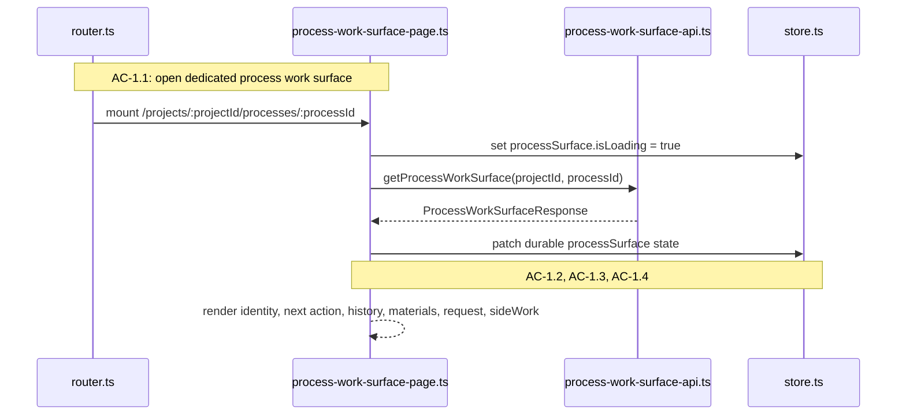
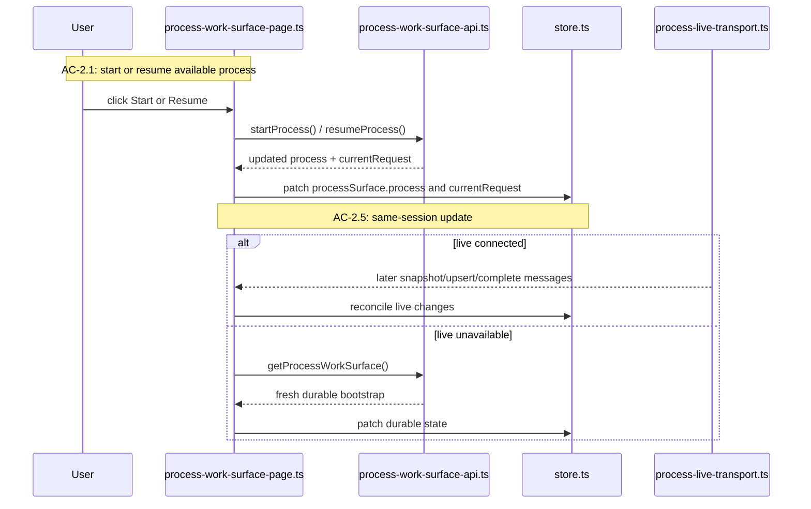
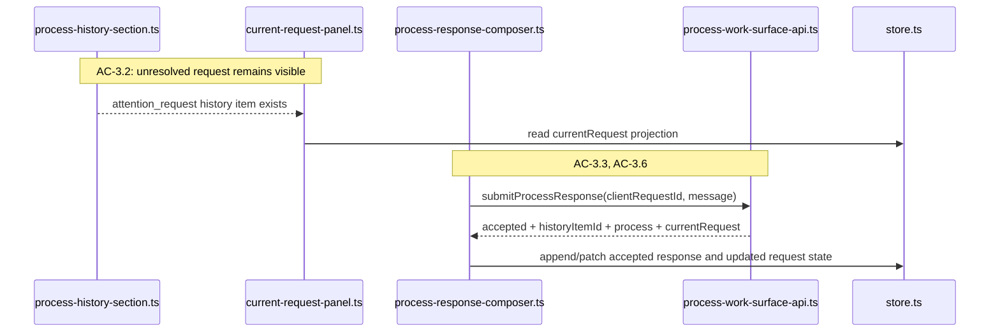
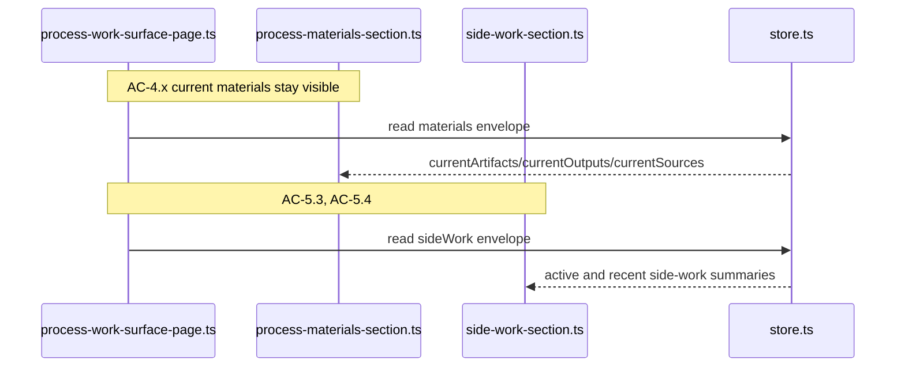
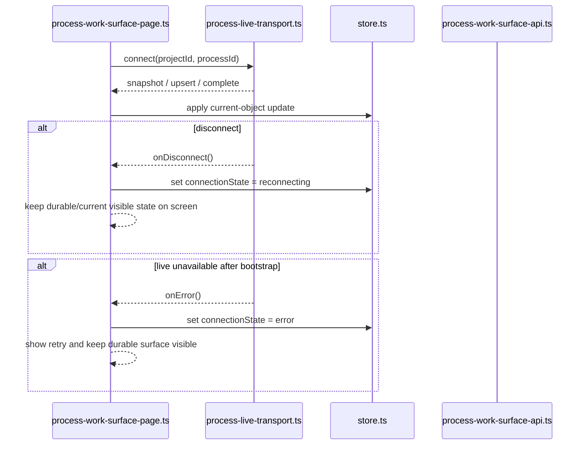

# Technical Design: Process Work Surface Client

This companion document covers the browser-side implementation for Epic 2. The
client remains the same Vite-built vanilla TypeScript shell mounted inside the
Fastify-owned application boundary. Epic 2 does not introduce a second client
app or a different frontend framework. It extends the existing shell with a
dedicated process route, a process-surface state slice, and a typed live-update
client.

## HTML Shell and Route Model

The browser still receives one shell document for all authenticated project and
process routes. Epic 2 does not embed process work in a separate micro-app. The
server delivers the same HTML shell, and the client router decides whether the
current route is:

- project index
- project shell
- process work surface

This matters because Epic 2 inherits Epic 1's authenticated shell bootstrap. The
process work surface is a deeper route within the same browser app, not a new
bootstrap path.

### Supported Routes

| Route | Meaning |
|-------|---------|
| `/projects` | Project index |
| `/projects/:projectId` | Project shell |
| `/projects/:projectId/processes/:processId` | Dedicated process work surface |

### Router File Changes

`apps/platform/client/app/router.ts` remains the router entry point, but it
gains a third route kind and stops using Epic 1's `?processId=` querystring as
the active-work route.

```ts
export type ParsedRoute =
  | { kind: 'project-index'; projectId: null; selectedProcessId: null; processId: null }
  | { kind: 'project-shell'; projectId: string; selectedProcessId: string | null; processId: null }
  | { kind: 'process-work-surface'; projectId: string; selectedProcessId: null; processId: string };
```

The querystring-selected process remains a shell-only focus state for the
summary list. Opening active process work always moves onto the dedicated process
route.

`parseRoute()` must check the dedicated process pattern before the broader
`/projects/:projectId` shell pattern. Otherwise a valid process route will be
misclassified as a project-shell route.

## Client Bootstrap

`apps/platform/client/main.ts` and `apps/platform/client/app/bootstrap.ts` keep
the same high-level sequence from Epic 1:

1. load `/auth/me`
2. resolve current route
3. mount the correct page

Epic 2 adds one more page target, not a new bootstrap model. The client still
does not negotiate auth on its own and still redirects immediately on
`UNAUTHENTICATED`.

## Client State

Epic 1's store was intentionally shell-shaped. Epic 2 needs one more dedicated
state slice for the process work surface. The most important design rule is to
keep durable bootstrap state and live transport state separate enough that
reload, reconnect, and in-session updates remain understandable.

`currentRequest` is part of that live state model, not just part of bootstrap.
The client should accept explicit live `current_request` messages rather than
trying to re-derive the pinned request from chronological history on every
update.

### AppState Extensions

`apps/platform/client/app/store.ts` should extend `AppState` with:

```ts
export interface ProcessSurfaceState {
  project: {
    projectId: string;
    name: string;
    role: 'owner' | 'member';
  } | null;
  process: ProcessSurfaceSummary | null;
  history: ProcessHistorySectionEnvelope | null;
  materials: ProcessMaterialsSectionEnvelope | null;
  currentRequest: CurrentProcessRequest | null;
  sideWork: SideWorkSectionEnvelope | null;
  isLoading: boolean;
  error: RequestError | null;
  live: {
    connectionState: 'idle' | 'connecting' | 'connected' | 'reconnecting' | 'error';
    subscriptionId: string | null;
    lastSequenceNumber: number | null;
    error: RequestError | null;
  };
}
```

Add a top-level `processSurface` key to `AppState` rather than overloading the
existing `shell` slice. The project shell and process work surface are adjacent
surfaces with different state models. Keeping them separate avoids a creeping
union type that makes both pages harder to reason about.

### Store Responsibilities

`createAppStore()` remains synchronous and framework-free. The store should not
become a generalized event bus. It still needs only:

- `get()`
- `set()`
- `patch()`
- `subscribe()`

The new process-surface slice increases state volume, not the complexity of the
store primitive itself.

## Browser API Layer

Epic 2 adds one HTTP API client and one live transport client.

### `apps/platform/client/browser-api/process-work-surface-api.ts`

```ts
export async function getProcessWorkSurface(args: {
  projectId: string;
  processId: string;
}): Promise<ProcessWorkSurfaceResponse>;

export async function startProcess(args: {
  projectId: string;
  processId: string;
}): Promise<StartProcessResponse>;

export async function resumeProcess(args: {
  projectId: string;
  processId: string;
}): Promise<ResumeProcessResponse>;

export async function submitProcessResponse(args: {
  projectId: string;
  processId: string;
  clientRequestId: string;
  message: string;
}): Promise<SubmitProcessResponseResponse>;
```

These functions are the client-side mock boundary for process-surface HTTP
behavior.

### `apps/platform/client/browser-api/process-live-transport.ts`

```ts
export interface ProcessLiveTransport {
  connect(args: {
    projectId: string;
    processId: string;
    onMessage: (message: LiveProcessUpdateMessage) => void;
    onDisconnect: () => void;
    onError: (error: Error) => void;
  }): { close(): void };
}
```

This module wraps the browser `WebSocket` API. The page and store consume typed
messages, not raw websocket event objects.

## Feature File Layout

```text
apps/platform/client/features/processes/
├── process-work-surface-page.ts
├── process-history-section.ts
├── current-request-panel.ts
├── process-materials-section.ts
├── side-work-section.ts
├── process-response-composer.ts
└── process-live-status.ts
```

The new `processes/` feature directory keeps Epic 2 code out of the existing
`features/projects/` shell modules while still living under the same client app.

### Module Responsibility Matrix

| Module | Status | Responsibility | Dependencies | ACs Covered |
|--------|--------|----------------|--------------|-------------|
| `app/router.ts` | MODIFIED | Add process-work-surface route parsing and navigation helpers | shared contracts | AC-1.1, AC-6.1, AC-6.4 |
| `app/store.ts` | MODIFIED | Hold durable process-surface state and live transport metadata | shared contracts | AC-1.4, AC-2.2, AC-3.6, AC-6.x |
| `browser-api/process-work-surface-api.ts` | NEW | HTTP bootstrap and process action calls | fetch, shared contracts | AC-1.1 to AC-3.6 |
| `browser-api/process-live-transport.ts` | NEW | Typed browser WebSocket transport | WebSocket, shared contracts | AC-2.2, AC-2.3, AC-6.2, AC-6.3, AC-6.5 |
| `process-work-surface-page.ts` | NEW | Route-driven bootstrap, live subscription lifecycle, action orchestration, section rendering | store, HTTP API, live transport, process feature modules | AC-1.1 to AC-6.6 |
| `process-history-section.ts` | NEW | Render visible history section envelope and chronological items | shared contracts | AC-1.4, AC-2.3, AC-3.3, AC-6.6 |
| `current-request-panel.ts` | NEW | Render pinned unresolved request and attention-required state | shared contracts | AC-3.2, AC-5.1, AC-5.2 |
| `process-materials-section.ts` | NEW | Render artifacts, outputs, sources, and empty/error states | shared contracts | AC-4.1 to AC-4.4, AC-6.6 |
| `side-work-section.ts` | NEW | Render side-work summaries, statuses, and result summaries | shared contracts | AC-5.3, AC-5.4, AC-6.6 |
| `process-response-composer.ts` | NEW | Submit responses, block invalid submits, surface in-session validation state | process API, store | AC-3.1 to AC-3.6 |
| `process-live-status.ts` | NEW | Show connected/disconnected/reconnecting state and retry path | store | AC-6.2, AC-6.5 |

## Flow 1: Route Entry and Durable Process Surface Bootstrap

**Covers:** AC-1.1, AC-1.2, AC-1.3, AC-1.4, AC-6.1, AC-6.4

This flow is the first user-visible difference between Epic 1 and Epic 2. The
user is no longer just focusing a process inside the shell; they are opening a
dedicated work surface. The page needs to resolve the route, fetch the durable
bootstrap, and render enough current state that the user can orient immediately.



**Skeleton Requirements:**

| What | Where | Stub Signature |
|------|-------|----------------|
| Route parsing support | `apps/platform/client/app/router.ts` | `export function parseRoute(url: URL): ParsedRoute { throw new NotImplementedError('parseRoute') }` |
| Process work-surface API client | `apps/platform/client/browser-api/process-work-surface-api.ts` | `export async function getProcessWorkSurface(): Promise<ProcessWorkSurfaceResponse> { throw new NotImplementedError('getProcessWorkSurface') }` |
| Process work-surface page | `apps/platform/client/features/processes/process-work-surface-page.ts` | `export function renderProcessWorkSurfacePage(deps: ProcessWorkSurfacePageDeps): HTMLElement { throw new NotImplementedError('renderProcessWorkSurfacePage') }` |

**TC Mapping for this Flow:**

| TC | Tests | Module | Setup | Assert |
|----|-------|--------|-------|--------|
| TC-1.1a | open process from project shell | `tests/service/client/process-router.test.ts` | Start on project shell, activate open-process action | Router navigates to dedicated process route |
| TC-1.1b | direct process URL opens surface | `tests/service/client/process-router.test.ts` | Initial route is process route | Process surface page mounts and fetches bootstrap |
| TC-1.2a | active process identity shown | `tests/service/client/process-work-surface-page.test.ts` | Mock bootstrap response | Project/process identity visible |
| TC-1.3a | next step shown on load | `tests/service/client/process-work-surface-page.test.ts` | Bootstrap with nextActionLabel | Next action visible |
| TC-1.3b | blocker shown on load | `tests/service/client/process-work-surface-page.test.ts` | Bootstrap with waiting/currentRequest | Blocker visible |
| TC-1.4a | bootstrap includes current work state | `tests/service/client/process-work-surface-page.test.ts` | Bootstrap with history/materials | Both sections render together |
| TC-1.4b | early process empty history state | `tests/service/client/process-history-section.test.ts` | Empty history envelope | Clear empty history state shown |
| TC-6.1a | browser reload restores process surface | `tests/service/client/process-router.test.ts` | Reload current process route | Same route and bootstrap fetch restored |
| TC-6.1b | return later restores visible state | `tests/integration/process-work-surface.test.ts` | Reopen process route in fresh session | Latest durable process surface visible |
| TC-6.4a | missing process shows unavailable state | `tests/service/client/process-router.test.ts` | Route loads with `PROCESS_NOT_FOUND` | Unavailable state rendered |
| TC-6.4b | revoked access blocks process surface | `tests/service/client/process-router.test.ts` | Route loads with forbidden response | Access-denied state rendered |

## Flow 2: Start and Resume Actions With Same-Session Updates

**Covers:** AC-2.1, AC-2.4, AC-2.5

Start and resume are not just mutations; they are the first moment where the
surface shifts from a durable bootstrap snapshot to active in-session state.
These actions must update the surface immediately, before later live updates
fill in more activity.



**Skeleton Requirements:**

| What | Where | Stub Signature |
|------|-------|----------------|
| Start action API client | `apps/platform/client/browser-api/process-work-surface-api.ts` | `export async function startProcess(): Promise<StartProcessResponse> { throw new NotImplementedError('startProcess') }` |
| Resume action API client | `apps/platform/client/browser-api/process-work-surface-api.ts` | `export async function resumeProcess(): Promise<ResumeProcessResponse> { throw new NotImplementedError('resumeProcess') }` |

**TC Mapping for this Flow:**

| TC | Tests | Module | Setup | Assert |
|----|-------|--------|-------|--------|
| TC-2.1a | start draft process | `tests/service/client/process-work-surface-page.test.ts` | Draft process bootstrap + start action | Process state changes in-session |
| TC-2.1b | resume paused process | `tests/service/client/process-work-surface-page.test.ts` | Paused process bootstrap + resume action | Process state changes in-session |
| TC-2.1c | resume interrupted process | `tests/service/client/process-work-surface-page.test.ts` | Interrupted process bootstrap + resume action | Process state changes in-session |
| TC-2.4a | waiting state shown after active work | `tests/service/client/process-live-store.test.ts` | Live update moves process to waiting | Waiting state visible |
| TC-2.4b | completed state shown after active work | `tests/service/client/process-live-store.test.ts` | Live update completes process | Completed state visible |
| TC-2.4c | failed/interrupted state shown after active work | `tests/service/client/process-live-store.test.ts` | Live update fails or interrupts process | Resulting state visible |
| TC-2.5a | successful start updates in same session | `tests/service/client/process-work-surface-page.test.ts` | Start response succeeds | No manual refresh required |
| TC-2.5b | successful resume updates in same session | `tests/service/client/process-work-surface-page.test.ts` | Resume response succeeds | No manual refresh required |

## Flow 3: Conversation, Current Request, and Response Submission

**Covers:** AC-3.1, AC-3.2, AC-3.3, AC-3.4, AC-3.5, AC-3.6, AC-5.1, AC-5.2

This flow is where the process work surface has to feel like process work rather
than a transcript viewer. The user needs to read chronological history, keep a
current unresolved request pinned, submit responses in context, and avoid false
"waiting for reply" states when the process is not actually asking for anything.



**Skeleton Requirements:**

| What | Where | Stub Signature |
|------|-------|----------------|
| Current request panel | `apps/platform/client/features/processes/current-request-panel.ts` | `export function renderCurrentRequestPanel(props: CurrentRequestPanelProps): HTMLElement { throw new NotImplementedError('renderCurrentRequestPanel') }` |
| Response composer | `apps/platform/client/features/processes/process-response-composer.ts` | `export function renderProcessResponseComposer(deps: ProcessResponseComposerDeps): HTMLElement { throw new NotImplementedError('renderProcessResponseComposer') }` |
| Submit response API client | `apps/platform/client/browser-api/process-work-surface-api.ts` | `export async function submitProcessResponse(): Promise<SubmitProcessResponseResponse> { throw new NotImplementedError('submitProcessResponse') }` |

**TC Mapping for this Flow:**

| TC | Tests | Module | Setup | Assert |
|----|-------|--------|-------|--------|
| TC-3.1a | multi-turn discussion remains in one surface | `tests/service/client/process-work-surface-page.test.ts` | Bootstrap with existing conversation, submit response, receive follow-up | Same page and context preserved |
| TC-3.1b | follow-up question remains in context | `tests/service/client/current-request-panel.test.ts` | History + currentRequest update | Follow-up request stays in same process surface |
| TC-3.2a | outstanding request remains visible | `tests/service/client/current-request-panel.test.ts` | Bootstrap with unresolved request | Request panel visible |
| TC-3.2b | outstanding request clears or changes | `tests/service/client/current-request-panel.test.ts` | Submit response or receive new request | Panel clears or updates |
| TC-3.3a | submitted response appears in history | `tests/service/client/process-history-section.test.ts` | Successful response submission | New history item visible |
| TC-3.3b | response remains after reload | `tests/integration/process-work-surface.test.ts` | Submit response then reload | Response still visible |
| TC-3.4a | no false waiting state during active work | `tests/service/client/current-request-panel.test.ts` | Running process with no currentRequest | No pinned request shown |
| TC-3.4b | completed process does not show open reply state | `tests/service/client/process-response-composer.test.ts` | Completed process bootstrap | Composer hidden/disabled appropriately |
| TC-3.5a | empty response rejected | `tests/service/client/process-response-composer.test.ts` | Empty input submit | Validation shown, no API call |
| TC-3.5b | failed submission does not create partial history | `tests/service/client/process-response-composer.test.ts` | API returns error | No misleading history item created |
| TC-3.6a | successful response appears in same session | `tests/service/client/process-work-surface-page.test.ts` | Successful submit | History updates in-session |
| TC-3.6b | current request or process state updates in same session | `tests/service/client/process-work-surface-page.test.ts` | Successful submit | Request/process state updates in-session |
| TC-5.1a | routine progress distinct from attention request | `tests/service/client/process-history-section.test.ts` | History with progress + pinned request | Distinction visible |
| TC-5.1b | attention-required item remains visible in mixed activity | `tests/service/client/current-request-panel.test.ts` | Later routine updates arrive | Current request remains pinned |
| TC-5.2a | unresolved request stays visible | `tests/service/client/current-request-panel.test.ts` | Idle with unresolved request | Request remains visible |
| TC-5.2b | resolved request no longer shown as unresolved | `tests/service/client/current-request-panel.test.ts` | Request resolves | Pinned unresolved view clears |

## Flow 4: Materials, Current Outputs, and Side Work

**Covers:** AC-4.1, AC-4.2, AC-4.3, AC-4.4, AC-5.3, AC-5.4

The process surface is not just a history and request surface. It also needs to
behave like a workspace. The user has to see the current artifacts, outputs,
sources, and side-work summaries that matter right now, and those views must
change when the process focus changes.



**Skeleton Requirements:**

| What | Where | Stub Signature |
|------|-------|----------------|
| Materials section | `apps/platform/client/features/processes/process-materials-section.ts` | `export function renderProcessMaterialsSection(props: ProcessMaterialsSectionProps): HTMLElement { throw new NotImplementedError('renderProcessMaterialsSection') }` |
| Side-work section | `apps/platform/client/features/processes/side-work-section.ts` | `export function renderSideWorkSection(props: SideWorkSectionProps): HTMLElement { throw new NotImplementedError('renderSideWorkSection') }` |

**TC Mapping for this Flow:**

| TC | Tests | Module | Setup | Assert |
|----|-------|--------|-------|--------|
| TC-4.1a | materials visible with active work | `tests/service/client/process-materials-section.test.ts` | Ready materials envelope | Artifacts/outputs visible beside history |
| TC-4.1b | source attachments visible when relevant | `tests/service/client/process-materials-section.test.ts` | Materials include sources | Sources visible |
| TC-4.2a | current revision context visible for artifact | `tests/service/client/process-materials-section.test.ts` | Artifact with version label | Revision context shown |
| TC-4.2b | current output identity visible | `tests/service/client/process-materials-section.test.ts` | Output record | Output identity shown |
| TC-4.3a | phase change updates materials | `tests/service/client/process-live-store.test.ts` | Live materials upsert | Materials view updates |
| TC-4.3b | output revision updates visible context | `tests/service/client/process-live-store.test.ts` | Output upsert | Revision context updates |
| TC-4.4a | empty materials state shown | `tests/service/client/process-materials-section.test.ts` | Empty materials envelope | Empty state visible |
| TC-4.4b | previous materials do not linger | `tests/service/client/process-live-store.test.ts` | Transition to empty materials | Old materials removed |
| TC-5.3a | active side work shown distinctly | `tests/service/client/side-work-section.test.ts` | Ready side-work envelope with active item | Side-work summary visible |
| TC-5.3b | multiple side-work items remain distinguishable | `tests/service/client/side-work-section.test.ts` | Multiple side-work items | Distinct labels/statuses shown |
| TC-5.4a | completed side work shows returned result | `tests/service/client/side-work-section.test.ts` | Completed side-work item | Result summary shown |
| TC-5.4b | failed side work shows failure outcome | `tests/service/client/side-work-section.test.ts` | Failed side-work item | Failure summary shown |
| TC-5.4c | parent-process change shown after side-work outcome | `tests/service/client/process-work-surface-page.test.ts` | Side-work result plus process change | Parent process state visibly updated |

## Flow 5: Live Transport, Reconnect, and Section-Level Degradation

**Covers:** AC-2.2, AC-2.3, AC-6.2, AC-6.3, AC-6.5, AC-6.6

This is the client-side coherence flow. The process surface opens from durable
HTTP data, then moves into a live session through typed upserts. When the socket
fails or one section fails independently, the client must preserve what the user
can still trust.



**Skeleton Requirements:**

| What | Where | Stub Signature |
|------|-------|----------------|
| Live transport client | `apps/platform/client/browser-api/process-live-transport.ts` | `export function createProcessLiveTransport(): ProcessLiveTransport { throw new NotImplementedError('createProcessLiveTransport') }` |
| Live status component | `apps/platform/client/features/processes/process-live-status.ts` | `export function renderProcessLiveStatus(props: ProcessLiveStatusProps): HTMLElement { throw new NotImplementedError('renderProcessLiveStatus') }` |

**TC Mapping for this Flow:**

| TC | Tests | Module | Setup | Assert |
|----|-------|--------|-------|--------|
| TC-2.2a | running state visible during active work | `tests/service/client/process-live-store.test.ts` | Process upsert to running | Running state rendered |
| TC-2.2b | phase change visible while open | `tests/service/client/process-live-store.test.ts` | Phase upsert | Phase label updates |
| TC-2.3a | progress updates appear as readable activity | `tests/service/client/process-history-section.test.ts` | History item upsert | Readable progress shown |
| TC-2.3b | new activity appears in chronological order | `tests/service/client/process-history-section.test.ts` | Multiple history updates | Correct order maintained |
| TC-6.2a | connection loss does not erase visible state | `tests/service/client/process-work-surface-page.test.ts` | Disconnect after bootstrap | Existing state remains visible |
| TC-6.2b | connection-loss state shown | `tests/service/client/process-live-status.test.ts` | Disconnect event | Disconnected/reconnecting state shown |
| TC-6.3a | reconnected surface reconciles to latest state | `tests/service/client/process-live-store.test.ts` | Disconnect then bootstrap + snapshot | Store reconciles to latest state |
| TC-6.3b | finalized visible items not duplicated after reconcile | `tests/service/client/process-live-store.test.ts` | Reconnect with overlapping finalized items | No duplicates |
| TC-6.5a | bootstrap succeeds when live subscription fails | `tests/service/client/process-work-surface-page.test.ts` | HTTP success + websocket error | Durable surface still usable |
| TC-6.5b | retry path visible after live subscription failure | `tests/service/client/process-live-status.test.ts` | Live connect error | Retry control visible |
| TC-6.6a | history section failure does not block surface | `tests/service/client/process-work-surface-page.test.ts` | History envelope error | Only history section degrades |
| TC-6.6b | materials section failure does not block surface | `tests/service/client/process-work-surface-page.test.ts` | Materials envelope error | Only materials section degrades |
| TC-6.6c | side-work section failure does not block surface | `tests/service/client/process-work-surface-page.test.ts` | Side-work envelope error | Only side-work section degrades |

## Interface Definitions

### Page-Level Dependencies

```ts
export interface ProcessWorkSurfacePageDeps {
  store: AppStore;
  api: Pick<
    typeof import('../../browser-api/process-work-surface-api'),
    'getProcessWorkSurface' | 'startProcess' | 'resumeProcess' | 'submitProcessResponse'
  >;
  liveTransport: ProcessLiveTransport;
  router: {
    openProject(projectId: string): void;
    openProcess(projectId: string, processId: string): void;
  };
}
```

### Section Interfaces

```ts
export interface ProcessHistorySectionProps {
  envelope: ProcessHistorySectionEnvelope;
}

export interface CurrentRequestPanelProps {
  currentRequest: CurrentProcessRequest | null;
  processStatus: ProcessSurfaceSummary['status'];
}

export interface ProcessMaterialsSectionProps {
  envelope: ProcessMaterialsSectionEnvelope;
}

export interface SideWorkSectionProps {
  envelope: SideWorkSectionEnvelope;
}

export interface ProcessResponseComposerDeps {
  store: AppStore;
  api: Pick<
    typeof import('../../browser-api/process-work-surface-api'),
    'submitProcessResponse'
  >;
}

export interface ProcessLiveStatusProps {
  connectionState: ProcessSurfaceState['live']['connectionState'];
  error: RequestError | null;
  onRetry: () => void;
}
```

### Live Update Apply Contract

```ts
export interface ApplyLiveProcessMessageArgs {
  state: ProcessSurfaceState;
  message: LiveProcessUpdateMessage;
}

export function applyLiveProcessMessage(args: ApplyLiveProcessMessageArgs): ProcessSurfaceState {
  throw new NotImplementedError('applyLiveProcessMessage');
}
```

This pure reducer-like helper keeps the live reconciliation policy testable
without turning the store itself into a special-purpose subsystem.

`applyLiveProcessMessage()` should handle:

- `process` messages by replacing `processSurface.process`
- `history` messages by merging visible history items by `historyItemId`
- `current_request` messages by replacing `processSurface.currentRequest`, including `null` payloads when the pinned request clears
- `materials` messages by replacing `processSurface.materials`
- `side_work` messages by replacing `processSurface.sideWork`

## Client Testing Strategy

Epic 2 keeps the same core client testing philosophy as Epic 1:

- mock at the browser API and live-transport boundary
- let router, store, DOM updates, and section modules run for real
- assert on observable user-facing state, not internal implementation details

Primary client test entry points:

- `tests/service/client/process-router.test.ts`
- `tests/service/client/process-work-surface-page.test.ts`
- `tests/service/client/process-history-section.test.ts`
- `tests/service/client/current-request-panel.test.ts`
- `tests/service/client/process-materials-section.test.ts`
- `tests/service/client/side-work-section.test.ts`
- `tests/service/client/process-response-composer.test.ts`
- `tests/service/client/process-live-store.test.ts`
- `tests/service/client/process-live-status.test.ts`

Manual verification will matter more in Epic 2 than Epic 1 because the surface
is judged heavily on coherence and feel: progress clarity, request visibility,
reconnect behavior, and whether in-session updates feel trustworthy.
