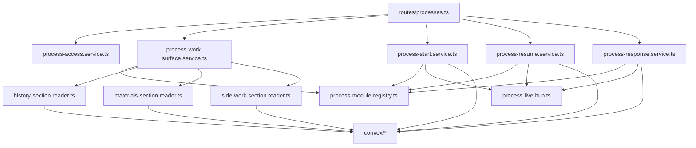
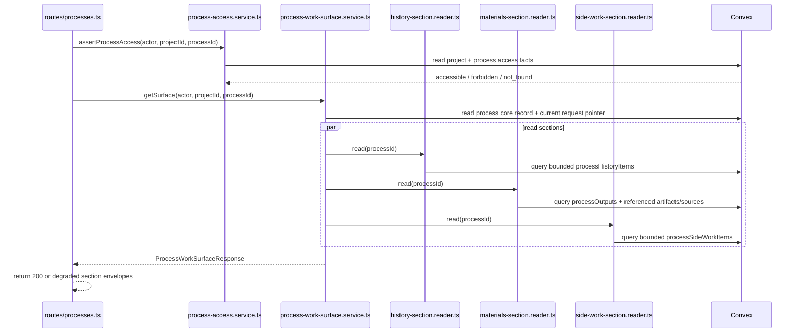
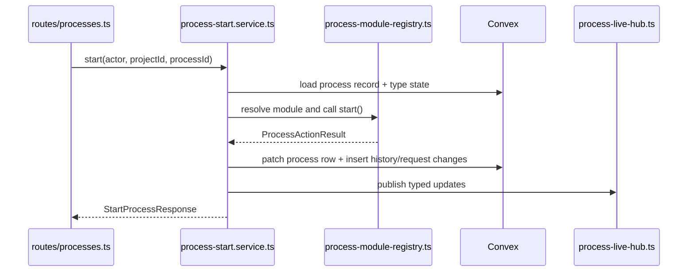
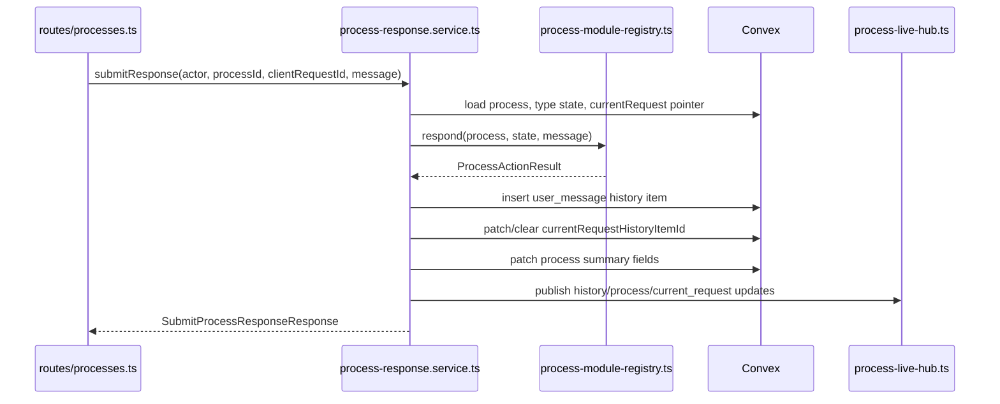
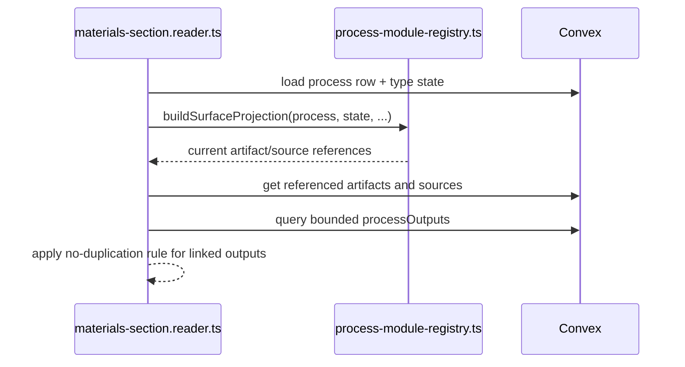
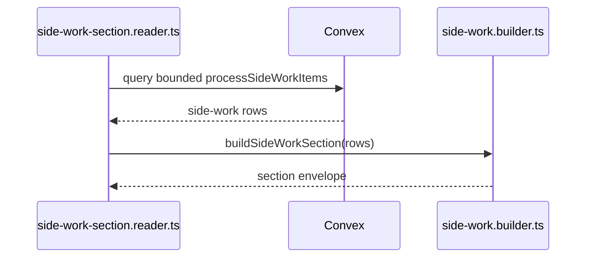
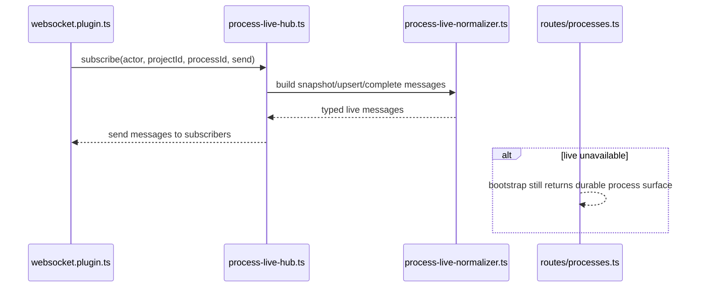

# Technical Design: Process Work Surface Server

This companion document covers the Fastify, WebSocket, service, and Convex
design for Epic 2. It expands the server-owned parts of the index document into
exact module boundaries, durable state decisions, flow design, and copy-paste
ready interfaces.

## Server Bootstrap

The server remains a single Fastify 5 application that owns shell delivery,
auth, project APIs, and process APIs. Epic 2 adds process-surface APIs and a
WebSocket live-update path inside the same Fastify monolith. It does not add a
second server or let the browser connect to Convex directly.

### Entry Point: `apps/platform/server/index.ts`

Responsibilities remain the same:

- load environment configuration
- construct the Fastify app
- start the HTTP server

Epic 2 adds one more responsibility inside app startup: ensure websocket support
is registered before process routes are mounted.

### App Factory: `apps/platform/server/app.ts`

`app.ts` remains the main assembly point. Epic 2 extends it to:

- register the new websocket plugin
- register process routes after auth and websocket plugins are ready
- decorate the Fastify instance with the process live hub and new process
  services

The assembly order matters. `@fastify/websocket` must be registered before any
route using websocket handlers, otherwise Fastify will not attach the websocket
route behavior correctly.

## Top-Tier Surface Nesting

| Surface | Epic 2 Nesting |
|---------|----------------|
| Projects | Existing project shell remains the entry path into a process |
| Processes | `routes/processes.ts`, process action services, process module registry, process live hub |
| Artifacts | Materials reader resolves current artifact context for the process surface |
| Sources | Materials reader resolves current source context for the process surface |
| Archive | Epic 2 adds visible process history only; the full canonical archive remains a later concern |

The process surface is process-owned. Project services are still relevant for
entry and access, but the main server-side implementation should live under
`services/processes/` instead of extending the Epic 1 shell services beyond
their natural role.

## Module Architecture

```text
apps/platform/server/
├── app.ts
├── plugins/
│   ├── cookies.plugin.ts
│   ├── csrf.plugin.ts
│   ├── vite.plugin.ts
│   ├── workos-auth.plugin.ts
│   └── websocket.plugin.ts                 # NEW
├── routes/
│   ├── auth.ts
│   ├── projects.ts
│   └── processes.ts                        # NEW
├── services/
│   ├── auth/
│   ├── projects/
│   └── processes/
│       ├── process-access.service.ts       # NEW
│       ├── process-work-surface.service.ts # NEW
│       ├── process-start.service.ts        # NEW
│       ├── process-resume.service.ts       # NEW
│       ├── process-response.service.ts     # NEW
│       ├── process-module-registry.ts      # NEW
│       ├── live/
│       │   ├── process-live-hub.ts         # NEW
│       │   └── process-live-normalizer.ts  # NEW
│       ├── readers/
│       │   ├── history-section.reader.ts   # NEW
│       │   ├── materials-section.reader.ts # NEW
│       │   └── side-work-section.reader.ts # NEW
│       └── summary/
│           ├── process-history.builder.ts   # NEW
│           ├── current-request.projector.ts # NEW
│           ├── process-materials.builder.ts # NEW
│           └── side-work.builder.ts         # NEW
└── errors/
    ├── app-error.ts
    ├── codes.ts
    └── section-error.ts
```

### Module Responsibility Matrix

| Module | Status | Responsibility | Dependencies | ACs Covered |
|--------|--------|----------------|--------------|-------------|
| `plugins/websocket.plugin.ts` | NEW | Register websocket support and attach process live hub to the app instance | Fastify, `@fastify/websocket` | Supports AC-2.2, AC-2.3, AC-6.2, AC-6.3, AC-6.5 |
| `routes/processes.ts` | NEW | HTML route for process surface, bootstrap/action HTTP routes, websocket route | auth plugin, process access service, process services | AC-1.1 to AC-6.6 |
| `process-access.service.ts` | NEW | Assert project/process access, distinguish missing vs forbidden vs accessible | project access service, Convex store | AC-1.1, AC-6.4 |
| `process-work-surface.service.ts` | NEW | Compose the full process-surface bootstrap from core process state, section readers, and current request projector | process access, readers, registry | AC-1.2 to AC-6.6 |
| `process-start.service.ts` | NEW | Start a draft process, persist resulting visible state, publish live updates | registry, Convex store, live hub | AC-2.1, AC-2.5 |
| `process-resume.service.ts` | NEW | Resume paused/interrupted process, persist resulting visible state, publish live updates | registry, Convex store, live hub | AC-2.1, AC-2.5 |
| `process-response.service.ts` | NEW | Validate, persist, and apply one user response into the process, update current request, publish live updates | registry, Convex store, live hub | AC-3.2 to AC-3.6 |
| `process-module-registry.ts` | NEW | Resolve the correct process work-surface module for each process type | process-specific state loaders | AC-1.3, AC-3.x, AC-4.x, AC-5.x |
| `live/process-live-hub.ts` | NEW | Manage websocket subscribers and fan out typed current-object updates | websocket plugin, normalizer | AC-2.2, AC-2.3, AC-6.2, AC-6.3, AC-6.5 |
| `live/process-live-normalizer.ts` | NEW | Normalize server-side process changes into browser-facing `snapshot`/`upsert`/`complete` messages | summary builders, shared contracts | AC-2.3, AC-6.3 |
| `readers/history-section.reader.ts` | NEW | Read bounded visible history rows and return a section envelope | Convex queries, history builder | AC-1.4, AC-3.3, AC-6.6 |
| `readers/materials-section.reader.ts` | NEW | Read current artifact/source/output context and return a section envelope | Convex queries, materials builder, module registry | AC-4.1 to AC-4.4, AC-6.6 |
| `readers/side-work-section.reader.ts` | NEW | Read bounded current side-work summary rows and return a section envelope | Convex queries, side-work builder | AC-5.3, AC-5.4, AC-6.6 |

### Component Interaction Diagram



## Durable State Model

Epic 2 adds three new durable concerns:

- visible process history
- current side-work summaries
- current process-owned outputs

It also upgrades the generic process record so the shared work surface can find
the current unresolved request efficiently.

### Design Stance

Do not implement the full Feature 5 canonical archive now. Epic 2 only needs
durable, user-facing visible history that supports reload, reconnect, and pinned
current request projection. The full low-level archive taxonomy remains a later
layer.

Do not put high-churn visible history or side-work summary state on the main
`processes` record. Convex's generated guidance explicitly warns against putting
high-churn operational data on shared records. Process identity and status stay
on `processes`; live surface rows move into their own tables.

### Convex Tables

| Table | Status | Purpose | Notes |
|-------|--------|---------|-------|
| `processes` | MODIFIED | Generic process identity and surface summary fields | Add `currentRequestHistoryItemId` pointer |
| `processHistoryItems` | NEW | Durable visible process history items for the process surface | User-facing history only, not full canonical archive |
| `processSideWorkItems` | NEW | Current side-work summary items | Active items plus recent outcomes still relevant to parent process |
| `processOutputs` | NEW | Current process-owned output summaries | Outputs in progress and outputs not yet published as durable artifacts |
| `artifacts` | EXISTS | Durable artifact rows | Read as current materials when process surface references them |
| `sourceAttachments` | EXISTS | Durable source rows | Read as current materials when process surface references them |
| `processProductDefinitionStates` | MODIFIED | ProductDefinition-specific state | Add small bounded fields needed for current materials projection |
| `processFeatureSpecificationStates` | MODIFIED | FeatureSpecification-specific state | Same pattern |
| `processFeatureImplementationStates` | MODIFIED | FeatureImplementation-specific state | Same pattern |

### Convex Field Outline

The new tables should be added to `convex/schema.ts` and implemented with typed
Convex functions rather than `ctx: any`.

```ts
export const processHistoryItemKindValidator = v.union(
  v.literal('user_message'),
  v.literal('process_message'),
  v.literal('progress_update'),
  v.literal('attention_request'),
  v.literal('side_work_update'),
  v.literal('process_event'),
);

export const processHistoryItemLifecycleValidator = v.union(
  v.literal('current'),
  v.literal('finalized'),
);

export const requestStateValidator = v.union(
  v.literal('none'),
  v.literal('unresolved'),
  v.literal('resolved'),
  v.literal('superseded'),
);

export const processHistoryItemsTableFields = {
  processId: v.id('processes'),
  kind: processHistoryItemKindValidator,
  lifecycleState: processHistoryItemLifecycleValidator,
  requestState: requestStateValidator,
  text: v.string(),
  relatedSideWorkId: v.union(v.id('processSideWorkItems'), v.null()),
  relatedArtifactId: v.union(v.id('artifacts'), v.null()),
  clientRequestId: v.union(v.string(), v.null()),
  createdAt: v.string(),
  finalizedAt: v.union(v.string(), v.null()),
};

export const processSideWorkItemsTableFields = {
  processId: v.id('processes'),
  displayLabel: v.string(),
  purposeSummary: v.string(),
  status: v.union(v.literal('running'), v.literal('completed'), v.literal('failed')),
  resultSummary: v.union(v.string(), v.null()),
  updatedAt: v.string(),
};

export const processOutputsTableFields = {
  processId: v.id('processes'),
  linkedArtifactId: v.union(v.id('artifacts'), v.null()),
  displayName: v.string(),
  revisionLabel: v.union(v.string(), v.null()),
  state: v.string(),
  updatedAt: v.string(),
};
```

### `processes` Table Changes

`convex/processes.ts` should add one optional pointer field to the generic
process record:

```ts
currentRequestHistoryItemId: v.union(v.id('processHistoryItems'), v.null())
```

This keeps `currentRequest` cheap to resolve without storing a separate request
table. The current unresolved request is still a history item; the process row
simply points to the item that is currently pinned.

### Index Plan

Convex's generated guidance requires indexes rather than `filter`, bounded
queries rather than unbounded `.collect()`, and index names that include all
indexed fields. The new tables should therefore add:

| Table | Index | Purpose |
|-------|-------|---------|
| `processHistoryItems` | `by_processId_and_createdAt` on `['processId', 'createdAt']` | Read visible history oldest→newest for bootstrap |
| `processHistoryItems` | `by_processId_and_requestState_and_createdAt` on `['processId', 'requestState', 'createdAt']` | Resolve latest unresolved request without filtering |
| `processSideWorkItems` | `by_processId_and_updatedAt` on `['processId', 'updatedAt']` | Read current/recent side-work summary rows |
| `processOutputs` | `by_processId_and_updatedAt` on `['processId', 'updatedAt']` | Read current output summaries |

### Query Discipline

Use the Convex guidelines directly:

- no `filter` on queries
- no unbounded `.collect()` for process history or side-work bootstrap
- use `.take(n)` for bounded reads
- use typed `query`, `mutation`, `internalQuery`, `internalMutation` imports
- use proper `QueryCtx`/`MutationCtx` types or generated function context types
- always include validators

Bootstrap bounds for Epic 2:

- history: `.take(200)`
- side work: `.take(20)`
- outputs: `.take(20)`

These align with the Epic 2 NFRs and keep the process surface bounded by design.

## Core Interfaces

### Process Surface Summary

```ts
export interface ProcessSurfaceProjection {
  process: ProcessSurfaceSummary;
  currentRequest: CurrentProcessRequest | null;
  materialRefs: {
    artifactIds: string[];
    sourceAttachmentIds: string[];
  };
}
```

### Process Action Result

```ts
export interface ProcessActionResult {
  process: ProcessSurfaceSummary;
  currentRequest: CurrentProcessRequest | null;
  historyItemsToPublish: ProcessHistoryItem[];
  sideWorkToPublish: SideWorkItem[];
  materialSectionsChanged: boolean;
}
```

### Process Surface Service

```ts
export interface ProcessWorkSurfaceService {
  getSurface(args: {
    actor: AuthenticatedActor;
    projectId: string;
    processId: string;
  }): Promise<ProcessWorkSurfaceResponse>;
}
```

### Process Live Hub

```ts
export interface ProcessLiveHub {
  subscribe(args: {
    actorId: string;
    projectId: string;
    processId: string;
    send: (message: LiveProcessUpdateMessage) => void;
  }): { close(): void };
  publish(args: {
    projectId: string;
    processId: string;
    messages: LiveProcessUpdateMessage[];
  }): void;
}
```

## Flow 1: Durable Process Surface Bootstrap

**Covers:** AC-1.1, AC-1.2, AC-1.3, AC-1.4, AC-6.1, AC-6.4, AC-6.6

The bootstrap route is the server-side anchor of the entire feature. The client
cannot open a process surface coherently unless the server can resolve project
and process access, read the generic process record, project the current request,
and read three secondary surfaces independently enough to degrade one without
collapsing the rest.



**Skeleton Requirements:**

| What | Where | Stub Signature |
|------|-------|----------------|
| Process routes | `apps/platform/server/routes/processes.ts` | `export async function registerProcessRoutes(app: FastifyInstance): Promise<void> { throw new NotImplementedError('registerProcessRoutes') }` |
| Process access service | `apps/platform/server/services/processes/process-access.service.ts` | `export class ProcessAccessService { async getProcessAccess(): Promise<ProcessAccessResult> { throw new NotImplementedError('ProcessAccessService.getProcessAccess') } }` |
| Process surface service | `apps/platform/server/services/processes/process-work-surface.service.ts` | `export class ProcessWorkSurfaceService { async getSurface(): Promise<ProcessWorkSurfaceResponse> { throw new NotImplementedError('ProcessWorkSurfaceService.getSurface') } }` |

**TC Mapping for this Flow:**

| TC | Tests | Module | Setup | Assert |
|----|-------|--------|-------|--------|
| TC-1.1a | open process from project shell | `tests/service/server/process-html-routes.test.ts` | Authenticated actor, accessible process | HTML shell returned |
| TC-1.1b | direct process URL opens surface | `tests/service/server/process-html-routes.test.ts` | Authenticated actor, direct process route | HTML shell returned |
| TC-1.2a | active process identity shown | `tests/service/server/process-work-surface-api.test.ts` | Accessible process with summary data | Response includes process/project identity |
| TC-1.3a | next step shown on load | `tests/service/server/process-work-surface-api.test.ts` | Process with nextActionLabel | Response includes next action |
| TC-1.3b | blocker shown on load | `tests/service/server/process-work-surface-api.test.ts` | Waiting process with currentRequest | Response includes blocker/request |
| TC-1.4a | bootstrap includes current work state | `tests/service/server/process-work-surface-api.test.ts` | Visible history/materials/sideWork exist | Response contains all sections |
| TC-1.4b | early process still opens cleanly | `tests/service/server/process-work-surface-api.test.ts` | Empty history/materials/sideWork | Empty envelopes returned |
| TC-6.1a | reload restores visible state | `tests/integration/process-work-surface.test.ts` | Seed durable state then reload | Same durable surface returned |
| TC-6.1b | return later restores state | `tests/integration/process-work-surface.test.ts` | Fresh session reopen | Latest durable state returned |
| TC-6.4a | missing process route unavailable | `tests/service/server/process-work-surface-api.test.ts` | Process missing | 404 process unavailable |
| TC-6.4b | revoked access blocks process | `tests/service/server/process-work-surface-api.test.ts` | Forbidden actor | 403 without leaked data |
| TC-6.6a-c | secondary section failures degrade independently | `tests/service/server/process-work-surface-api.test.ts` | Reader throws per section | Core process remains visible, failing section returns error envelope |

## Flow 2: Start and Resume Process Actions

**Covers:** AC-2.1, AC-2.4, AC-2.5

Start and resume are process actions, not generic record patches. The service
layer needs to validate action availability, dispatch into the correct process
module, update the generic process record, persist any immediate visible history
or request changes, and publish the typed live messages the browser expects.



**Skeleton Requirements:**

| What | Where | Stub Signature |
|------|-------|----------------|
| Start service | `apps/platform/server/services/processes/process-start.service.ts` | `export class ProcessStartService { async start(): Promise<StartProcessResponse> { throw new NotImplementedError('ProcessStartService.start') } }` |
| Resume service | `apps/platform/server/services/processes/process-resume.service.ts` | `export class ProcessResumeService { async resume(): Promise<ResumeProcessResponse> { throw new NotImplementedError('ProcessResumeService.resume') } }` |
| Module registry | `apps/platform/server/services/processes/process-module-registry.ts` | `export class ProcessModuleRegistry { getModule(): ProcessWorkSurfaceModule<Record<string, unknown>> { throw new NotImplementedError('ProcessModuleRegistry.getModule') } }` |

**TC Mapping for this Flow:**

| TC | Tests | Module | Setup | Assert |
|----|-------|--------|-------|--------|
| TC-2.1a | start draft process | `tests/service/server/process-actions-api.test.ts` | Draft process | 200 with updated process state |
| TC-2.1b | resume paused process | `tests/service/server/process-actions-api.test.ts` | Paused process | 200 with updated process state |
| TC-2.1c | resume interrupted process | `tests/service/server/process-actions-api.test.ts` | Interrupted process | 200 with updated process state |
| TC-2.4a | waiting state shown after active work | `tests/service/server/process-live-updates.test.ts` | Action result transitions to waiting | Live messages include waiting summary |
| TC-2.4b | completed state shown after active work | `tests/service/server/process-live-updates.test.ts` | Action result completes process | Live messages include completed summary |
| TC-2.4c | failed/interrupted state shown after active work | `tests/service/server/process-live-updates.test.ts` | Action result fails/interupts | Live messages include resulting state |
| TC-2.5a | start updates in same session | `tests/service/server/process-actions-api.test.ts` | Successful start | HTTP response contains updated process/currentRequest |
| TC-2.5b | resume updates in same session | `tests/service/server/process-actions-api.test.ts` | Successful resume | HTTP response contains updated process/currentRequest |

## Flow 3: Response Submission and Current Request Projection

**Covers:** AC-3.2, AC-3.3, AC-3.4, AC-3.5, AC-3.6, AC-5.1, AC-5.2

The response flow ties together three representations of process state:

- chronological visible history
- pinned current unresolved request
- current process summary

The design must make those three move together without duplicating or losing the
user-facing request state.



**Current Request Projection Rule**

The server-side rule should mirror the epic exactly:

- `attention_request` history items remain in chronological history permanently
- `processes.currentRequestHistoryItemId` points to the currently unresolved
  request history item
- `current-request.projector.ts` loads that pointed row and projects it into the
  pinned `currentRequest` payload
- when a request is resolved or superseded, the history row remains and the
  pointer clears or moves

This avoids separate tables for what is logically one user-facing request.

**Skeleton Requirements:**

| What | Where | Stub Signature |
|------|-------|----------------|
| Response service | `apps/platform/server/services/processes/process-response.service.ts` | `export class ProcessResponseService { async respond(): Promise<SubmitProcessResponseResponse> { throw new NotImplementedError('ProcessResponseService.respond') } }` |
| Current request projector | `apps/platform/server/services/processes/summary/current-request.projector.ts` | `export function projectCurrentRequest(args: { requestHistoryItem: ProcessHistoryItem | null }): CurrentProcessRequest | null { throw new NotImplementedError('projectCurrentRequest') }` |

**TC Mapping for this Flow:**

| TC | Tests | Module | Setup | Assert |
|----|-------|--------|-------|--------|
| TC-3.2a | specific outstanding request remains visible | `tests/service/server/process-work-surface-api.test.ts` | Unresolved request pointer set | `currentRequest` payload returned |
| TC-3.2b | outstanding request clears or changes after response | `tests/service/server/process-actions-api.test.ts` | Response resolves or supersedes request | Pointer clears or moves |
| TC-3.3a | submitted response appears in history | `tests/service/server/process-actions-api.test.ts` | Successful response | New `user_message` history item inserted |
| TC-3.3b | response remains after reload | `tests/integration/process-work-surface.test.ts` | Response then rebootstrap | History item persists |
| TC-3.4a | no false waiting state during non-interactive work | `tests/service/server/process-work-surface-api.test.ts` | Running process with no request pointer | No `currentRequest` returned |
| TC-3.4b | completed process does not present open reply state | `tests/service/server/process-work-surface-api.test.ts` | Completed process | Available actions omit `respond` |
| TC-3.5a | empty response rejected | `tests/service/server/process-actions-api.test.ts` | Empty message | 422 invalid response |
| TC-3.5b | failed response submission does not create partial history | `tests/service/server/process-actions-api.test.ts` | Downstream process module rejects | No misleading history row inserted |
| TC-3.6a | successful response appears in same session | `tests/service/server/process-actions-api.test.ts` | Successful response | HTTP response + live publications reflect new history |
| TC-3.6b | resulting request/process state updates in same session | `tests/service/server/process-actions-api.test.ts` | Successful response | HTTP response + live publications reflect updated request/process |
| TC-5.1a | routine progress distinct from attention request | `tests/service/server/process-work-surface-api.test.ts` | Progress + current request rows | Bootstrap returns both history and currentRequest |
| TC-5.1b | attention-required item remains visible in mixed activity | `tests/service/server/process-live-updates.test.ts` | Progress events after request | Request projection remains until resolved |
| TC-5.2a | unresolved request stays visible | `tests/service/server/process-work-surface-api.test.ts` | Unresolved pointer remains set | Current request returned |
| TC-5.2b | resolved request no longer shown as unresolved | `tests/service/server/process-actions-api.test.ts` | Resolve request | Pointer cleared |

## Flow 4: Current Materials and Current Outputs

**Covers:** AC-4.1, AC-4.2, AC-4.3, AC-4.4

The materials flow is where the shared surface meets process-owned semantics.
Artifacts and source attachments already exist as generic tables, but the
current-material view is process-owned. The process module decides which artifact
IDs and source IDs are currently relevant. The server then reads those durable
rows and combines them with current process-owned outputs.



**No-Duplication Rule**

If a current output is already represented by a current artifact version, the
server keeps the artifact in `currentArtifacts` and omits a second unconnected
entry from `currentOutputs`. `processOutputs` is reserved for outputs still in
progress, outputs not yet published as artifacts, or outputs that still need a
separate current-state row.

**Skeleton Requirements:**

| What | Where | Stub Signature |
|------|-------|----------------|
| Materials reader | `apps/platform/server/services/processes/readers/materials-section.reader.ts` | `export class MaterialsSectionReader { async read(): Promise<ProcessMaterialsSectionEnvelope> { throw new NotImplementedError('MaterialsSectionReader.read') } }` |
| Materials builder | `apps/platform/server/services/processes/summary/process-materials.builder.ts` | `export function buildProcessMaterials(args: { artifacts: ProcessArtifactReference[]; outputs: ProcessOutputReference[]; sources: ProcessSourceReference[]; error?: ProcessSurfaceSectionError }): ProcessMaterialsSectionEnvelope { throw new NotImplementedError('buildProcessMaterials') }` |
| Process outputs module | `convex/processOutputs.ts` | `export const listProcessOutputs = query({ args: { processId: v.id('processes') }, handler: async (ctx, args) => { throw new NotImplementedError('listProcessOutputs') } })` |

**TC Mapping for this Flow:**

| TC | Tests | Module | Setup | Assert |
|----|-------|--------|-------|--------|
| TC-4.1a | materials visible alongside work | `tests/service/server/process-work-surface-api.test.ts` | Materials exist | Materials envelope returned |
| TC-4.1b | sources visible when relevant | `tests/service/server/process-work-surface-api.test.ts` | Referenced source ids exist | Source refs returned |
| TC-4.2a | revision context visible for artifact | `tests/service/server/process-work-surface-api.test.ts` | Artifact with version | Response includes version label |
| TC-4.2b | current output identity visible | `tests/service/server/process-work-surface-api.test.ts` | Output row exists | Response includes output identity |
| TC-4.3a | phase change updates materials | `tests/service/server/process-live-updates.test.ts` | Process module changes material refs | Live materials update published |
| TC-4.3b | output revision updates visible context | `tests/service/server/process-live-updates.test.ts` | Output row patched | Live materials update published |
| TC-4.4a | empty materials state shown | `tests/service/server/process-work-surface-api.test.ts` | No refs, no outputs | Empty materials envelope returned |
| TC-4.4b | previous materials do not linger | `tests/service/server/process-live-updates.test.ts` | Refs cleared | New empty/updated materials published |

## Flow 5: Side Work Summary and Parent-Process Result Application

**Covers:** AC-5.3, AC-5.4

Side work is modeled as its own summary table because the user needs a current
surface for active or recently completed side work. History still records the
chronological moments, but the side-work section answers a different question:
"what separate work is currently active or recently changed?"



**Skeleton Requirements:**

| What | Where | Stub Signature |
|------|-------|----------------|
| Side-work reader | `apps/platform/server/services/processes/readers/side-work-section.reader.ts` | `export class SideWorkSectionReader { async read(): Promise<SideWorkSectionEnvelope> { throw new NotImplementedError('SideWorkSectionReader.read') } }` |
| Side-work builder | `apps/platform/server/services/processes/summary/side-work.builder.ts` | `export function buildSideWorkSection(args: { items: SideWorkItem[]; error?: ProcessSurfaceSectionError }): SideWorkSectionEnvelope { throw new NotImplementedError('buildSideWorkSection') }` |
| Side-work Convex module | `convex/processSideWorkItems.ts` | `export const listProcessSideWorkItems = query({ args: { processId: v.id('processes') }, handler: async (ctx, args) => { throw new NotImplementedError('listProcessSideWorkItems') } })` |

**TC Mapping for this Flow:**

| TC | Tests | Module | Setup | Assert |
|----|-------|--------|-------|--------|
| TC-5.3a | active side work shown distinctly | `tests/service/server/process-work-surface-api.test.ts` | Active side-work rows | Distinct side-work items returned |
| TC-5.3b | multiple side-work items distinguishable | `tests/service/server/process-work-surface-api.test.ts` | Multiple side-work rows | Distinct labels/statuses returned |
| TC-5.4a | completed side work shows result | `tests/service/server/process-work-surface-api.test.ts` | Completed side-work row | Result summary returned |
| TC-5.4b | failed side work shows failure outcome | `tests/service/server/process-work-surface-api.test.ts` | Failed side-work row | Failure summary returned |
| TC-5.4c | parent-process change shown after side-work outcome | `tests/service/server/process-live-updates.test.ts` | Side-work result causes process summary change | Side-work + process updates both published |

## Flow 6: Live Updates, Reconnect, and Fallback Degradation

**Covers:** AC-2.2, AC-2.3, AC-6.2, AC-6.3, AC-6.5, AC-6.6

The server live path should stay deliberately small. It is not a general message
bus. It is a process-surface publisher for typed current-object updates that
match the browser-facing contracts.



**Server-Side Rule**

Do not stream raw deltas or partial provider fragments to the browser. The live
hub only publishes typed current-object messages matching the shared contract.
That includes a dedicated `current_request` entity so the browser can keep the
pinned unresolved request coherent without re-deriving it from chronological
history on every update. `current_request` always uses the stable entity id
`current_request`; when the pinned request clears, the live message carries
`payload: null`.

**Skeleton Requirements:**

| What | Where | Stub Signature |
|------|-------|----------------|
| Websocket plugin | `apps/platform/server/plugins/websocket.plugin.ts` | `export async function websocketPlugin(app: FastifyInstance): Promise<void> { throw new NotImplementedError('websocketPlugin') }` |
| Live hub | `apps/platform/server/services/processes/live/process-live-hub.ts` | `export class ProcessLiveHubImpl implements ProcessLiveHub { subscribe() { throw new NotImplementedError('subscribe') } publish() { throw new NotImplementedError('publish') } }` |
| Live normalizer | `apps/platform/server/services/processes/live/process-live-normalizer.ts` | `export function normalizeProcessLiveMessages(args: { process: ProcessSurfaceSummary | null; historyItems?: ProcessHistoryItem[]; currentRequest?: CurrentProcessRequest | null; materials?: ProcessMaterialsSectionEnvelope; sideWork?: SideWorkSectionEnvelope; messageType: 'snapshot' | 'upsert' | 'complete' | 'error'; correlationId?: string | null; sectionError?: ProcessSurfaceSectionError | null; subscriptionId: string; processId: string; startingSequenceNumber: number }): LiveProcessUpdateMessage[] { throw new NotImplementedError('normalizeProcessLiveMessages') }` |

**TC Mapping for this Flow:**

| TC | Tests | Module | Setup | Assert |
|----|-------|--------|-------|--------|
| TC-2.2a | running state visible during active work | `tests/service/server/process-live-updates.test.ts` | Process update published | Running process message emitted |
| TC-2.2b | phase change visible while open | `tests/service/server/process-live-updates.test.ts` | Phase update published | Phase message emitted |
| TC-2.3a | progress updates readable | `tests/service/server/process-live-updates.test.ts` | Progress item update | Browser-facing progress message emitted |
| TC-2.3b | new activity chronological | `tests/service/server/process-live-updates.test.ts` | Multiple history item updates | Sequence numbers monotonic |
| TC-6.2a | connection loss does not erase visible state | `tests/service/server/process-live-updates.test.ts` | Subscription closes | No server-side destructive state mutation occurs |
| TC-6.2b | connection-loss state shown | `tests/service/client/process-live-status.test.ts` | Client concern | Covered client-side |
| TC-6.3a | reconnected surface reconciles | `tests/integration/process-work-surface.test.ts` | Bootstrap + resubscribe | New snapshot received |
| TC-6.3b | finalized items not duplicated after reconcile | `tests/service/server/process-live-updates.test.ts` | Re-snapshot existing finalized item | Same history id reused |
| TC-6.5a | bootstrap succeeds when live unavailable | `tests/service/server/process-work-surface-api.test.ts` | Live hub unavailable | HTTP bootstrap still returns 200 |
| TC-6.5b | retry path visible | `tests/service/client/process-live-status.test.ts` | Client concern | Covered client-side |
| TC-6.6a-c | section degradation preserved | `tests/service/server/process-work-surface-api.test.ts` | Reader failures | Error envelopes returned without collapsing core surface |

## Server-Side Testing Strategy

The main server test entry points are:

- `app.inject()` for all HTML and HTTP behavior
- websocket route tests against the Fastify app with mocked external boundaries
- direct Convex function service-mock tests for the new Epic 2 Convex modules if
  the team accepts the added `convex-test` lane

External boundaries to mock in service tests:

- WorkOS/auth session validation
- Convex client/store adapter for Fastify route tests
- websocket network boundary where needed

Internal server modules should not be mocked:

- route handlers
- process services
- process module registry
- readers/builders/projectors
- live normalizer

This preserves the real integration between the modules that actually create
process-surface behavior.
