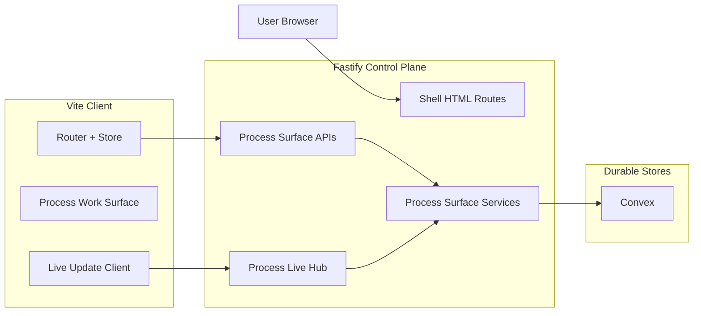
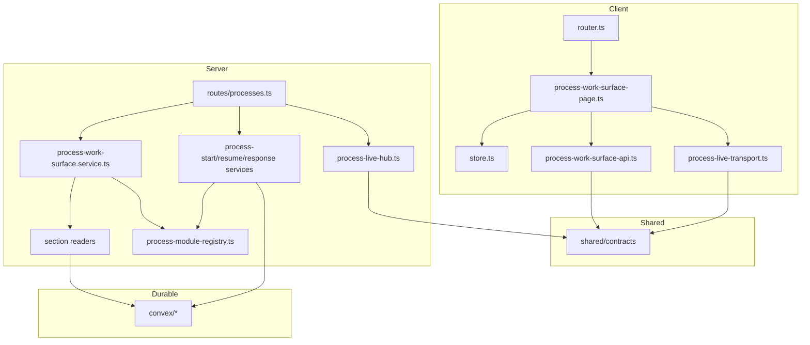

# Technical Design: Process Work Surface

## Purpose

This document translates Epic 2 into implementable architecture for the Liminal
Build process work surface. It is the index document for a four-file tech design
set:

| Document | Role |
|----------|------|
| `tech-design.md` | Decision record, validation, system view, module architecture overview, work breakdown |
| `tech-design-client.md` | Route model, client state, process surface UI, live-update client, browser flow design |
| `tech-design-server.md` | Fastify routes, WebSocket integration, process-surface services, Convex state model, projection and action design |
| `test-plan.md` | TC-to-test mapping, mock strategy, fixtures, test counts, chunk verification plan |

The downstream consumers are:

| Audience | What they need from this design |
|----------|---------------------------------|
| Reviewers | Clear design decisions, scope discipline, and visible trade-offs before implementation starts |
| Story authors | Chunk boundaries, relevant design sections, and stable technical targets for enrichment |
| Implementers | Exact file paths, interface targets, mock boundaries, and verification gates |

## Spec Validation

Epic 2 is designable after the latest clarification pass. The feature now makes
the pinned-vs-chronological request distinction explicit, distinguishes side-work
summary state from history state, defines same-session mutation update behavior,
and resolves process-surface degradation behavior at the spec level. The
remaining work is implementation design, not spec repair.

The design still needs to be explicit about one important line: Epic 2 delivers
the process control surface and visible live state, not the full execution
substrate. Environment lifecycle, tool harness execution, canonical archive
taxonomy, and rich artifact review remain separate concerns owned by later
epics.

### Issues Found

| Issue | Spec Location | Resolution | Status |
|-------|---------------|------------|--------|
| `currentRequest` and visible history were initially ambiguous | AC-3.2, Data Contracts | Epic now states that requests are issued into visible history and projected into a pinned unresolved request view while still active | Resolved |
| `sideWork` summary state and chronological history were initially ambiguous | AC-5.3, AC-5.4, Data Contracts | Epic now distinguishes current summary items from related history records | Resolved |
| Mutation success behavior did not define same-session surface update expectations | AC-2.x, AC-3.x, Data Contracts | Epic now states that successful actions update the visible surface immediately, then reconcile through live updates or fallback bootstrap | Resolved |
| Process-surface section failure policy was initially deferred to Tech Design | AC-6.x, Tech Design Questions | Epic now defines section-by-section degradation when core process identity and status are still available | Resolved |
| Epic 2 still defined `PROCESS_LIVE_UPDATES_UNAVAILABLE` as a `503` request error even though the surface must remain usable from durable bootstrap state | Data Contracts, Error Responses | This design treats live-unavailable as a post-bootstrap live transport state, not as an HTTP bootstrap failure. Durable bootstrap remains `200`; live failure is surfaced through the live client state and retry path | Resolved — deviated |
| The current Convex scaffold uses `queryGeneric`/`mutationGeneric`, `ctx: any`, and some broad `.collect()` reads that do not match the generated Convex AI guidelines | Existing codebase in `convex/*.ts` | This design standardizes new and modified Convex modules on guideline-compliant validators, typed contexts, bounded queries, and explicit indexes. Existing scaffold shortcuts are treated as implementation debt, not as design precedent | Resolved — deviated |
| The original Epic 1 design assumed a greenfield repo, but the current workspace already contains a working shell scaffold | Epic 1 tech design context | This design nests within the actual `apps/platform`, `convex`, and `tests` structure already in the repo | Resolved — clarified |

## Context

Epic 2 is the second half of Milestone 1. Epic 1 established the durable
project shell: authenticated entry, project listing, project shell summaries,
process registration, and return-later shell visibility. Epic 2 is the first
time the platform has to feel like a process product instead of a shell around
records. The user needs to open one process and stay oriented through active
progress, conversation, current materials, unresolved requests, and return-later
state without reconstructing what is happening from summaries alone.

The technical architecture already constrains the shape of this work. Fastify is
the control plane. Convex is the durable state layer behind that control plane.
The browser consumes typed upsert objects over WebSocket instead of raw provider
deltas. The platform is process-first, not transcript-first, and process types
remain code-defined modules with process-owned semantics. The design therefore
needs to add a dedicated process-surface route, a browser store that can hold
durable and live state together, and a server-side projection/action layer that
keeps the shared work surface generic without flattening process-specific
behavior into one universal schema blob.

The current codebase is no longer just a Story 0 scaffold. It already contains
the Epic 1 shell implementation shape: a Fastify app in `apps/platform/server`,
a Vite-built vanilla TypeScript client in `apps/platform/client`, Zod-authored
shared contracts in `apps/platform/shared/contracts`, and a Convex-backed
`PlatformStore` abstraction that feeds the server services. That is a strength:
Epic 2 can extend those seams instead of inventing parallel ones. It is also a
constraint: the design should preserve the existing shell route model where it
still makes sense, keep the server as the composition root, and avoid
over-engineering a brand-new client architecture that fights the current code.

The highest-risk area in this design is state coherence across three different
truth layers. The browser needs a durable bootstrap for reload and re-entry, a
live current-object stream for in-session coherence, and a clear boundary
between visible user-facing process history and the fuller canonical archive
planned for Epic 5. The design therefore needs to introduce a forward-compatible
visible-history model for the process surface without pretending to solve the
entire archive problem early.

## Tech Design Question Answers

### Q1. What is the exact browser route model for entering a dedicated process work surface?

Use a dedicated process route nested under the existing project route family:

- `GET /projects`
- `GET /projects/:projectId`
- `GET /projects/:projectId/processes/:processId`

Fastify continues to serve the same authenticated shell HTML for all project and
process routes. The client router expands from two route kinds to three:

- `project-index`
- `project-shell`
- `process-work-surface`

Epic 1's `?processId=` query parameter remains a shell-level focus affordance for
the project shell only. Opening active work moves the user onto the dedicated
process route. This keeps the process work surface bookmarkable, reloadable, and
distinct from the project shell without creating a second HTML application.

### Q2. What exact browser store shape should hold durable process history, current live objects, current materials, and side-work items?

Extend the existing synchronous app store with a dedicated `processSurface`
slice. Keep durable bootstrap state and live transport state in the same slice,
but do not collapse them into one undifferentiated object. The client needs to
remember what came from bootstrap, what is currently connected, and how to
reconcile finalized visible items after reconnect.

The client slice should hold:

- route-resolved process identity (`projectId`, `processId`)
- durable bootstrap payload (`project`, `process`, `history`, `materials`,
  `currentRequest`, `sideWork`)
- request-level load state and error
- live connection state (`idle`, `connecting`, `connected`, `reconnecting`,
  `error`)
- active subscription metadata (`subscriptionId`, `lastSequenceNumber`)
- live transport error or disconnect banner state

The client applies typed `snapshot`, `upsert`, `complete`, and `error` messages
into current-object state. Finalized history items are keyed by `historyItemId`
so reconnect/reload can merge state without duplicating items the user has
already seen settle.

### Q3. What exact WebSocket subscription/authentication model should the platform use for process live updates?

Use `@fastify/websocket` inside the existing Fastify monolith. Register the
plugin before routes so Fastify can intercept WebSocket routes correctly. Expose
one browser-facing route:

- `GET /ws/projects/:projectId/processes/:processId`

Authentication and authorization follow the same server-owned session model as
the HTTP shell routes:

- session cookie is validated server-side
- project/process access is checked before the connection is accepted
- unauthorized connections are rejected before subscription starts

The server sends typed process-surface messages only after successful access
resolution. The client does not connect directly to Convex or any provider
runtime.

### Q4. What exact reconciliation policy should the client use after reconnect?

Use bootstrap-first, stream-second reconciliation.

1. Process route opens.
2. Browser fetches the durable process-surface bootstrap over HTTP.
3. Browser opens the WebSocket subscription.
4. Server sends a `snapshot` message describing the current live objects for the
   surface.
5. Browser applies later `upsert` and `complete` messages in `sequenceNumber`
   order within the active `subscriptionId`.

Reconnect rules:

- If the socket drops, keep the last visible durable/current state on screen.
- On reconnect, fetch a fresh durable bootstrap before resubscribing.
- Merge finalized history items by `historyItemId`.
- Treat `complete` as the settling edge for current live objects.
- Replace current-object state with newer `snapshot`/`upsert` payloads instead of
  replaying raw deltas.

This keeps the browser state legible even if the process progresses while the
user is disconnected.

### Q5. What exact process-surface projection contract should each process module implement?

Introduce a process module registry for the first time. Epic 1 could derive
shell summaries from the generic `processes` row and minimal type-state rows.
Epic 2 needs more than that: current materials, current request, current output
visibility, action availability, and response semantics are process-owned.

Each process module implements a shared interface:

```ts
export interface ProcessWorkSurfaceModule<TState> {
  processType: SupportedProcessType;
  getState(args: { processId: string }): Promise<TState | null>;
  buildShellSummary(args: { process: ProcessRecord; state: TState }): ProcessSummary;
  buildSurfaceProjection(args: {
    process: ProcessRecord;
    state: TState;
    visibleHistory: ProcessHistoryItem[];
    sideWork: SideWorkItem[];
    outputs: ProcessOutputRecord[];
    artifactLookup: Map<string, ArtifactSummary>;
    sourceLookup: Map<string, SourceAttachmentSummary>;
  }): ProcessSurfaceProjection;
  start(args: { process: ProcessRecord; state: TState; actorId: string }): Promise<ProcessActionResult>;
  resume(args: { process: ProcessRecord; state: TState; actorId: string }): Promise<ProcessActionResult>;
  respond(args: {
    process: ProcessRecord;
    state: TState;
    actorId: string;
    message: string;
    clientRequestId: string;
  }): Promise<ProcessActionResult>;
}
```

This keeps the shared process work surface generic while letting each process
module own its phase semantics, prompts, output shaping, and response behavior.

### Q6. What exact data model should represent visible side work if full inspectable subthreads remain out of scope?

Use a dedicated `processSideWorkItems` table for current summary state and a
related visible history trail in `processHistoryItems`.

The table stores bounded, user-facing summary state:

- `processId`
- `displayLabel`
- `purposeSummary`
- `status`
- `resultSummary`
- `updatedAt`

Visible history records the chronological moments:

- side work started
- side work status changed
- side work completed or failed
- parent process changed because of that outcome

This matches the epic: users see current side-work status in a summary section
without requiring a full subordinate-thread viewer.

### Q7. What exact persistence grain should Epic 2 use for visible process history before Epic 5 delivers the full canonical archive?

Add a durable `processHistoryItems` table now as the user-facing visible history
layer for the process surface. Do not implement the full Feature 5 canonical
archive taxonomy in Epic 2.

This table stores user-facing visible items only:

- user messages
- process messages
- progress updates
- attention requests
- side-work updates
- process events

Each row is a stable visible item, not a raw streaming delta. Rows may move from
`current` to `finalized`, but they are never replayed as opaque low-level
provider fragments in the browser.

Epic 5 can later add the lower-level canonical archive and derive richer views
without invalidating the Epic 2 process surface.

### Q8. What exact error and retry model should the work surface use when the durable bootstrap succeeds but live transport is unavailable?

Treat HTTP bootstrap and live transport as separate outcomes.

- If HTTP bootstrap fails, the process surface fails at request level.
- If HTTP bootstrap succeeds and WebSocket subscription fails, the process
  surface still opens from durable state.
- The live area shows `disconnected` or `reconnecting`.
- A retry control attempts a fresh subscription.
- Successful `start`, `resume`, and `respond` actions still update the visible
  process state in-session through the returned HTTP payload.
- If no live connection is available, the client automatically re-fetches the
  current durable process-surface bootstrap after a successful action so the
  surface remains coherent.

Section-level failures inside `history`, `materials`, or `sideWork` follow the
same degradation pattern as Epic 1's shell sections: core process identity and
status remain visible while the failing section shows an error state.

## System View

### Top-Tier Surfaces Touched by Epic 2

| Surface | Source | This Epic's Role |
|---------|--------|------------------|
| Projects | Inherited from platform tech arch | Provides the project context and access boundary for entering a process surface |
| Processes | Inherited from platform tech arch | Primary domain for process-surface bootstrap, process actions, process module dispatch, and live state publication |
| Artifacts | Inherited from platform tech arch | Supplies current artifact context for the materials section |
| Sources | Inherited from platform tech arch | Supplies current source context for the materials section |
| Archive | Inherited from platform tech arch | Informs the durable-vs-live boundary and future archive compatibility, but full canonical archive behavior remains out of scope |
| Review Workspace | Inherited from platform tech arch | Adjacent surface only; Epic 2 keeps current materials visible without delivering rich review workflows |

### System Context Diagram

Epic 2 adds one new browser route family and one new live transport boundary,
but it still lives inside the same Fastify-controlled application boundary. The
client never talks directly to Convex. Convex remains the durable state
substrate behind Fastify.



### External Contracts

#### Browser Entry Contracts

| Path | Owned By | Behavior |
|------|----------|----------|
| `/projects` | Fastify shell route | Returns authenticated shell HTML or redirects to sign-in |
| `/projects/:projectId` | Fastify shell route | Returns authenticated shell HTML or unavailable/auth redirect |
| `/projects/:projectId/processes/:processId` | Fastify shell route | Returns authenticated shell HTML or process/project unavailable/auth redirect |

#### API and Live Contracts Used by Epic 2

| Contract | Purpose | Primary Consumer |
|----------|---------|------------------|
| `GET /api/projects/:projectId/processes/:processId` | Durable process-surface bootstrap | Process work-surface page |
| `POST /api/projects/:projectId/processes/:processId/start` | Start a draft process | Start action in process surface |
| `POST /api/projects/:projectId/processes/:processId/resume` | Resume a paused/interrupted process | Resume action in process surface |
| `POST /api/projects/:projectId/processes/:processId/responses` | Submit one process response | Response composer |
| `GET /ws/projects/:projectId/processes/:processId` | Live typed process updates | Process live client |

#### Request-Level Error Contracts

| Code | Status | Meaning | Client Handling |
|------|--------|---------|-----------------|
| `UNAUTHENTICATED` | 401 | No valid session | Clear surface state and redirect to sign-in |
| `PROJECT_FORBIDDEN` | 403 | Actor cannot open requested project | Show unavailable/access-denied page |
| `PROJECT_NOT_FOUND` | 404 | Requested project missing | Show unavailable page |
| `PROCESS_NOT_FOUND` | 404 | Requested process missing inside project | Show process-unavailable page |
| `PROCESS_ACTION_NOT_AVAILABLE` | 409 | Start/resume/respond invalid in current state | Show inline action error, keep current surface |
| `INVALID_PROCESS_RESPONSE` | 422 | Submitted response invalid | Keep composer visible with validation/error state |

#### Live Transport Status Codes

| Code | Meaning | Client Handling |
|------|---------|-----------------|
| `PROCESS_LIVE_UPDATES_UNAVAILABLE` | Live subscription could not start or could not remain connected after durable bootstrap succeeded | Keep durable surface visible, set live status to disconnected/error, show retry path |

#### Section-Level Process Surface Error Contracts

| Section | Example Code | Meaning | Client Handling |
|---------|--------------|---------|-----------------|
| `history` | `PROCESS_SURFACE_HISTORY_LOAD_FAILED` | Visible process history could not be read | Render history section error state; keep process surface usable |
| `materials` | `PROCESS_SURFACE_MATERIALS_LOAD_FAILED` | Current materials could not be read | Render materials section error state; keep process surface usable |
| `sideWork` | `PROCESS_SURFACE_SIDE_WORK_LOAD_FAILED` | Side-work summary items could not be read | Render side-work section error state; keep process surface usable |

#### Runtime Prerequisites

| Prerequisite | Where Needed | Verification |
|--------------|--------------|--------------|
| Node.js `24.14.x` | Local + CI | `node --version` |
| pnpm `10.x` | Local + CI | `pnpm --version` |
| WorkOS AuthKit env vars | Local + deployed environments | Present in environment configuration |
| Convex deployment target (`local`, `staging`, `prod`) | Local + deployed environments | `npx convex dev` or deployed env configured |
| Browser WebSocket support | Local manual verification + e2e | Open process surface and confirm live subscription connects |

## Repo Shape and Module Architecture Overview

### Repo Layout

Epic 2 extends the existing platform app rather than adding a second app or a
parallel server. The repo layout below shows the new or modified surfaces that
this feature introduces.

```text
/
├── apps/
│   └── platform/
│       ├── client/
│       │   ├── app/
│       │   │   ├── router.ts                       # MODIFIED: add process-work-surface route kind
│       │   │   └── store.ts                        # MODIFIED: add processSurface state slice
│       │   ├── browser-api/
│       │   │   ├── projects-api.ts                 # EXISTS
│       │   │   ├── process-work-surface-api.ts     # NEW
│       │   │   └── process-live-transport.ts       # NEW
│       │   └── features/
│       │       ├── projects/                       # EXISTS
│       │       └── processes/
│       │           ├── process-work-surface-page.ts # NEW
│       │           ├── process-history-section.ts   # NEW
│       │           ├── current-request-panel.ts     # NEW
│       │           ├── process-materials-section.ts # NEW
│       │           ├── side-work-section.ts         # NEW
│       │           ├── process-response-composer.ts # NEW
│       │           └── process-live-status.ts       # NEW
│       ├── server/
│       │   ├── app.ts                              # MODIFIED: register websocket plugin and process routes
│       │   ├── plugins/
│       │   │   └── websocket.plugin.ts             # NEW
│       │   ├── routes/
│       │   │   ├── projects.ts                     # MODIFIED: link/open process route helpers
│       │   │   └── processes.ts                    # NEW
│       │   └── services/
│       │       ├── projects/                       # EXISTS
│       │       └── processes/
│       │           ├── process-access.service.ts   # NEW
│       │           ├── process-work-surface.service.ts # NEW
│       │           ├── process-start.service.ts    # NEW
│       │           ├── process-resume.service.ts   # NEW
│       │           ├── process-response.service.ts # NEW
│       │           ├── process-module-registry.ts  # NEW
│       │           ├── live/
│       │           │   ├── process-live-hub.ts     # NEW
│       │           │   └── process-live-normalizer.ts # NEW
│       │           ├── readers/
│       │           │   ├── history-section.reader.ts  # NEW
│       │           │   ├── materials-section.reader.ts # NEW
│       │           │   └── side-work-section.reader.ts # NEW
│       │           └── summary/
│       │               ├── process-history.builder.ts   # NEW
│       │               ├── current-request.projector.ts # NEW
│       │               ├── process-materials.builder.ts # NEW
│       │               └── side-work.builder.ts         # NEW
│       └── shared/
│           └── contracts/
│               ├── schemas.ts                       # MODIFIED
│               ├── state.ts                         # MODIFIED
│               ├── process-work-surface.ts          # NEW
│               └── live-process-updates.ts          # NEW
├── convex/
│   ├── schema.ts                                    # MODIFIED
│   ├── processes.ts                                 # MODIFIED
│   ├── processHistoryItems.ts                       # NEW
│   ├── processSideWorkItems.ts                      # NEW
│   └── processOutputs.ts                            # NEW
└── tests/
    ├── fixtures/
    │   ├── process-surface.ts                       # NEW
    │   ├── process-history.ts                       # NEW
    │   └── side-work.ts                             # NEW
    ├── service/
    │   ├── client/                                  # MODIFIED
    │   └── server/                                  # MODIFIED
    └── integration/
        └── process-work-surface.test.ts             # NEW
```

### Module Responsibility Matrix

| Module | Status | Responsibility | Dependencies | ACs Covered |
|--------|--------|----------------|--------------|-------------|
| `apps/platform/server/routes/processes.ts` | NEW | HTML route for process work surface, API routes for bootstrap/start/resume/respond, WebSocket route registration | auth plugin, process services, websocket plugin | AC-1.1 to AC-6.6 |
| `apps/platform/server/plugins/websocket.plugin.ts` | NEW | Register `@fastify/websocket`, expose live hub on app instance, ensure plugin precedes route registration | Fastify app, live hub | Supports AC-2.2, AC-2.3, AC-6.2, AC-6.3, AC-6.5 |
| `apps/platform/server/services/processes/process-work-surface.service.ts` | NEW | Compose process-surface bootstrap from core process state, section readers, and current request projection | process access, readers, module registry | AC-1.2 to AC-6.6 |
| `apps/platform/server/services/processes/process-start.service.ts` | NEW | Start draft process, persist first visible updates, publish live process changes | module registry, Convex store, live hub | AC-2.1, AC-2.5 |
| `apps/platform/server/services/processes/process-resume.service.ts` | NEW | Resume paused/interrupted process, persist visible updates, publish live changes | module registry, Convex store, live hub | AC-2.1, AC-2.5 |
| `apps/platform/server/services/processes/process-response.service.ts` | NEW | Validate and persist process response, update current request state, publish live changes | module registry, Convex store, live hub | AC-3.2 to AC-3.6 |
| `apps/platform/server/services/processes/process-module-registry.ts` | NEW | Route process-type-specific projection and action behavior through registered modules | process-specific state readers | AC-1.3, AC-3.x, AC-4.x, AC-5.x |
| `apps/platform/server/services/processes/live/process-live-hub.ts` | NEW | Manage active subscriptions and publish typed process-surface messages to connected clients | websocket plugin, normalizer | AC-2.2, AC-2.3, AC-6.2, AC-6.3, AC-6.5 |
| `apps/platform/server/services/processes/readers/*.ts` | NEW | Read bounded visible history, materials, and side-work sections from durable state | Convex queries, summary builders | AC-1.4, AC-4.x, AC-5.x, AC-6.6 |
| `apps/platform/client/app/router.ts` | MODIFIED | Parse and navigate dedicated process-surface routes | store, page loaders | AC-1.1, AC-6.1, AC-6.4 |
| `apps/platform/client/app/store.ts` | MODIFIED | Hold process-surface durable state, live connection state, and reconciliation metadata | shared contracts | AC-1.4, AC-2.2, AC-3.6, AC-6.x |
| `apps/platform/client/browser-api/process-work-surface-api.ts` | NEW | Browser API client for process-surface bootstrap and actions | fetch, shared contracts | AC-1.1 to AC-3.6 |
| `apps/platform/client/browser-api/process-live-transport.ts` | NEW | Browser WebSocket transport for typed process live updates | WebSocket, shared contracts | AC-2.2, AC-2.3, AC-6.2, AC-6.3, AC-6.5 |
| `apps/platform/client/features/processes/process-work-surface-page.ts` | NEW | Orchestrate bootstrap, live subscription lifecycle, section rendering, and unavailable states | process API client, live transport, store, section modules | AC-1.1 to AC-6.6 |
| `apps/platform/client/features/processes/process-response-composer.ts` | NEW | Accept and submit process responses, validation, in-session error/success feedback | process API client, store | AC-3.1 to AC-3.6 |
| `convex/processHistoryItems.ts` | NEW | Durable visible process history items and bounded history reads | schema, typed Convex queries/mutations | AC-1.4, AC-3.3, AC-5.x, AC-6.1, AC-6.3 |
| `convex/processSideWorkItems.ts` | NEW | Durable side-work summary records and bounded summary reads | schema, typed Convex queries/mutations | AC-5.3, AC-5.4, AC-6.6 |
| `convex/processOutputs.ts` | NEW | Durable current-output summary records for process surface | schema, typed Convex queries/mutations | AC-4.1 to AC-4.3 |
| `convex/processes.ts` | MODIFIED | Generic process record queries/mutations for bootstrap, start, resume, current request pointer, and action validation | schema, process-state tables | AC-1.2, AC-2.x, AC-3.x, AC-6.x |

### Dependency Map



## Shared Contract Interfaces

Epic 2 introduces a new shared contract surface that sits alongside Epic 1's
project-shell contracts. These types belong in new shared contract modules:

- `apps/platform/shared/contracts/process-work-surface.ts`
- `apps/platform/shared/contracts/live-process-updates.ts`

They are the source of truth for the process-surface browser/server boundary.

### Process Surface Types

```ts
export interface ProcessSurfaceSummary {
  processId: string;
  displayLabel: string;
  processType: SupportedProcessType;
  status: ProcessStatus;
  phaseLabel: string;
  nextActionLabel: string | null;
  availableActions: Array<'start' | 'respond' | 'resume' | 'review' | 'restart'>;
  updatedAt: string;
}

export interface ProcessSurfaceSectionError {
  code:
    | 'PROCESS_SURFACE_HISTORY_LOAD_FAILED'
    | 'PROCESS_SURFACE_MATERIALS_LOAD_FAILED'
    | 'PROCESS_SURFACE_SIDE_WORK_LOAD_FAILED';
  message: string;
}

export interface ProcessHistoryItem {
  historyItemId: string;
  kind:
    | 'user_message'
    | 'process_message'
    | 'progress_update'
    | 'attention_request'
    | 'side_work_update'
    | 'process_event';
  lifecycleState: 'current' | 'finalized';
  text: string;
  createdAt: string;
  relatedSideWorkId: string | null;
  relatedArtifactId: string | null;
}

export interface ProcessHistorySectionEnvelope {
  status: 'ready' | 'empty' | 'error';
  items: ProcessHistoryItem[];
  error?: ProcessSurfaceSectionError;
}

export interface CurrentProcessRequest {
  requestId: string;
  requestKind: 'clarification' | 'decision' | 'approval' | 'course_correction' | 'other';
  promptText: string;
  requiredActionLabel: string | null;
  createdAt: string;
}

export interface ProcessArtifactReference {
  artifactId: string;
  displayName: string;
  currentVersionLabel: string | null;
  roleLabel: string | null;
  updatedAt: string;
}

export interface ProcessOutputReference {
  outputId: string;
  displayName: string;
  revisionLabel: string | null;
  state: string;
  updatedAt: string;
}

export interface ProcessSourceReference {
  sourceAttachmentId: string;
  displayName: string;
  purpose: SourcePurpose;
  targetRef: string | null;
  hydrationState: HydrationState;
  updatedAt: string;
}

export interface ProcessMaterialsSectionEnvelope {
  status: 'ready' | 'empty' | 'error';
  currentArtifacts: ProcessArtifactReference[];
  currentOutputs: ProcessOutputReference[];
  currentSources: ProcessSourceReference[];
  error?: ProcessSurfaceSectionError;
}

export interface SideWorkItem {
  sideWorkId: string;
  displayLabel: string;
  purposeSummary: string;
  status: 'running' | 'completed' | 'failed';
  resultSummary: string | null;
  updatedAt: string;
}

export interface SideWorkSectionEnvelope {
  status: 'ready' | 'empty' | 'error';
  items: SideWorkItem[];
  error?: ProcessSurfaceSectionError;
}

export interface ProcessWorkSurfaceResponse {
  project: {
    projectId: string;
    name: string;
    role: ProjectRole;
  };
  process: ProcessSurfaceSummary;
  history: ProcessHistorySectionEnvelope;
  materials: ProcessMaterialsSectionEnvelope;
  currentRequest: CurrentProcessRequest | null;
  sideWork: SideWorkSectionEnvelope;
}

export interface StartProcessResponse {
  process: ProcessSurfaceSummary;
  currentRequest: CurrentProcessRequest | null;
}

export interface ResumeProcessResponse {
  process: ProcessSurfaceSummary;
  currentRequest: CurrentProcessRequest | null;
}

export interface SubmitProcessResponseResponse {
  accepted: true;
  historyItemId: string;
  process: ProcessSurfaceSummary;
  currentRequest: CurrentProcessRequest | null;
}
```

### Live Update Types

```ts
interface LiveProcessUpdateMessageBase {
  subscriptionId: string;
  processId: string;
  sequenceNumber: number;
  entityId: string;
  correlationId: string | null;
  completedAt: string | null;
}

export type LiveProcessUpdateMessage =
  | (LiveProcessUpdateMessageBase & {
      messageType: 'snapshot' | 'upsert' | 'complete';
      entityType: 'process';
      payload: ProcessSurfaceSummary;
    })
  | (LiveProcessUpdateMessageBase & {
      messageType: 'snapshot' | 'upsert' | 'complete';
      entityType: 'history';
      payload: ProcessHistoryItem;
    })
  | (LiveProcessUpdateMessageBase & {
      messageType: 'snapshot' | 'upsert' | 'complete';
      entityType: 'current_request';
      payload: CurrentProcessRequest | null;
    })
  | (LiveProcessUpdateMessageBase & {
      messageType: 'snapshot' | 'upsert' | 'complete';
      entityType: 'materials';
      payload: ProcessMaterialsSectionEnvelope;
    })
  | (LiveProcessUpdateMessageBase & {
      messageType: 'snapshot' | 'upsert' | 'complete';
      entityType: 'side_work';
      payload: SideWorkSectionEnvelope;
    })
  | (LiveProcessUpdateMessageBase & {
      messageType: 'error';
      entityType: 'history' | 'materials' | 'side_work';
      payload: ProcessSurfaceSectionError;
    });
```

`current_request` uses a stable `entityId` of `current_request`. When the pinned
request clears, the server emits a `current_request` message with
`payload: null`, allowing the client to clear `processSurface.currentRequest`
without re-deriving that state from history.

## Stack and Version Grounding

### Inherited Core Stack

| Component | Version | Why It Stays |
|-----------|---------|--------------|
| Node.js | `24.14.x` | Inherited platform runtime, already enforced in repo engines |
| TypeScript | `6.0.2` | Shared language across server, client, and Convex |
| Fastify | `5.8.4` | Inherited control-plane boundary |
| Vite | `8.0.8` | Existing client build tool |
| Convex | `1.35.1` | Existing durable state layer |
| Zod | `4.3.6` | Existing shared contract layer |
| WorkOS Node SDK | `8.12.1` | Existing auth integration |

### Epic-Scoped Additions

| Package | Version | Purpose | Research Confirmed |
|---------|---------|---------|-------------------|
| `@fastify/websocket` | `11.2.0` | Register typed WebSocket routes inside the existing Fastify app for process live updates | Yes — current package listings and release metadata show `11.2.0` as the latest Fastify 5-compatible line |
| `@types/ws` | `8.5.11` | TypeScript types for websocket handler signatures used with `@fastify/websocket` | Yes — community package listings show the current DefinitelyTyped line as `8.5.11` |
| `convex-test` | `0.0.39` | Direct Convex function tests for new visible-history, side-work, and output functions | Yes — Convex guidance and release notes indicate `0.0.39` or later for current Convex runtime behavior |
| `@edge-runtime/vm` | `5.0.0` | Edge-runtime environment required by Convex testing guidance | Yes — current package listings show `5.0.0` as the active line paired with modern edge-runtime usage |

### Rejected Additions

| Considered | Why Rejected |
|-----------|--------------|
| `socket.io` | Adds an unnecessary protocol layer and fallback transport complexity when the platform architecture already chose plain WebSocket with typed upsert messages |
| Bare `ws` route integration without Fastify plugin | Works technically, but loses Fastify route lifecycle integration and increases custom wiring burden for auth/access checks |
| Implementing the full Feature 5 canonical archive now | Solves a broader problem than Epic 2 needs and would blur milestone boundaries |

## Verification Scripts

Epic 2 extends the repo's existing verification gates rather than inventing a
separate workflow. The main change is adding a direct Convex test lane for new
Convex modules and ensuring `verify` includes it.

The repo currently has only `server` and `client` workspaces in
`vitest.workspace.ts`. Epic 2 should add a third workspace entry:

```ts
{
  test: {
    name: 'convex',
    environment: 'edge-runtime',
    include: ['convex/**/*.test.ts'],
  },
}
```

Each Convex test file should follow the generated Convex guidance:

- include `/// <reference types="vite/client" />`
- build a `modules` map with `import.meta.glob("./**/*.ts")`
- pass that map into `convexTest(schema, modules)`

| Script | Command | Purpose |
|--------|---------|---------|
| `red-verify` | `corepack pnpm run format:check && corepack pnpm run lint && corepack pnpm run typecheck && corepack pnpm run build` | Red exit gate: catches format, lint, type, and build issues before Green |
| `test:convex` | `corepack pnpm exec vitest run --project convex` | Convex function service-mock tests for new process-surface tables and functions |
| `verify` | `corepack pnpm run red-verify && corepack pnpm run test:convex && corepack pnpm run test:service && corepack pnpm run test:client` | Standard development gate |
| `green-verify` | `corepack pnpm run verify && corepack pnpm run guard:no-test-changes` | Green exit gate with test immutability protection |
| `verify-all` | `corepack pnpm run verify && corepack pnpm run test:integration && corepack pnpm run test:e2e` | Deep verification gate for chunk completion and release prep |

If `test:e2e` remains a placeholder when Epic 2 starts, it must continue to
emit an explicit `SKIP:` message and exit `0` instead of silently pretending the
suite exists.

## Work Breakdown Overview

| Chunk | Scope | ACs | Est. Tests | Relevant Docs |
|-------|-------|-----|------------|---------------|
| Chunk 0 | Shared contracts, route/state vocabulary, websocket plugin wiring, fixtures, Convex table skeletons, test utilities | — | 0 TC + 0 non-TC | `tech-design.md` §Repo Shape and Module Architecture Overview, §Verification Scripts; `tech-design-client.md` §Client Bootstrap and Route Model; `tech-design-server.md` §Durable State Model; `test-plan.md` §Fixture Strategy |
| Chunk 1 | Process route entry, durable bootstrap, process orientation, request-level unavailable handling | AC-1.1 to AC-1.4, AC-6.4 | 9 TC + 8 non-TC | `tech-design-client.md` §Flow 1; `tech-design-server.md` §Flow 1 |
| Chunk 2 | Start/resume actions, same-session update behavior, resulting state transitions | AC-2.1, AC-2.4, AC-2.5 | 8 TC + 2 non-TC | `tech-design-client.md` §Flow 2; `tech-design-server.md` §Flow 2 |
| Chunk 3 | Conversation, pinned current request, invalid response handling, in-session response updates | AC-3.1 to AC-3.6, AC-5.1, AC-5.2 | 16 TC + 4 non-TC | `tech-design-client.md` §Flow 3; `tech-design-server.md` §Flow 3 |
| Chunk 4 | Materials section, current outputs, linked-artifact no-duplication behavior | AC-4.1 to AC-4.4 | 8 TC + 2 non-TC | `tech-design-client.md` §Flow 4; `tech-design-server.md` §Flow 4 |
| Chunk 5 | Side-work summaries and parent-process result visibility | AC-5.3, AC-5.4 | 5 TC + 5 non-TC | `tech-design-client.md` §Flow 4; `tech-design-server.md` §Flow 5 |
| Chunk 6 | Live updates, reconnect, durable fallback, section-level degradation | AC-2.2, AC-2.3, AC-6.1 to AC-6.3, AC-6.5, AC-6.6 | 15 TC + 10 non-TC | `tech-design-client.md` §Flow 5; `tech-design-server.md` §Flow 6 |

### Chunk Dependencies

```text
Chunk 0
  ↓
Chunk 1
  ↓
Chunk 2
  ↓
Chunk 3
  ↓
Chunk 4
  ↓
Chunk 5
  ↓
Chunk 6
```

This remains intentionally vertical. Each chunk leaves the work surface in a
more coherent state than before instead of front-loading all live transport or
all Convex changes before the surface can be exercised end to end.

## Open Questions

None at design handoff. The design resolves the major implementation-shaping
questions needed to begin story derivation and technical enrichment.

## Deferred Items

| Item | Related AC | Reason Deferred | Future Work |
|------|-----------|-----------------|-------------|
| Full inspectable delegated subthreads | AC-5.3, AC-5.4 | Epic 2 only needs side-work summary/result visibility | Future process orchestration epic |
| Full canonical archive entry taxonomy and turn derivation | AC-3.3, AC-6.1 adjacency | Owned by Feature 5 | Epic 5 |
| Rich markdown/Mermaid artifact reading inside the process surface | AC-4.x adjacency | Epic 2 keeps materials visible, not fully reviewable | Epic 4 |
| Environment/runtime-driven live progress from sandbox execution | AC-2.x adjacency | Epic 2 defines the process-surface and live contract first | Epic 3 |

## Related Documentation

- Epic: `epic.md`
- Client companion: `tech-design-client.md`
- Server companion: `tech-design-server.md`
- Test plan: `test-plan.md`
- Core platform PRD: `../../core-platform-prd.md`
- Core platform architecture: `../../core-platform-arch.md`
