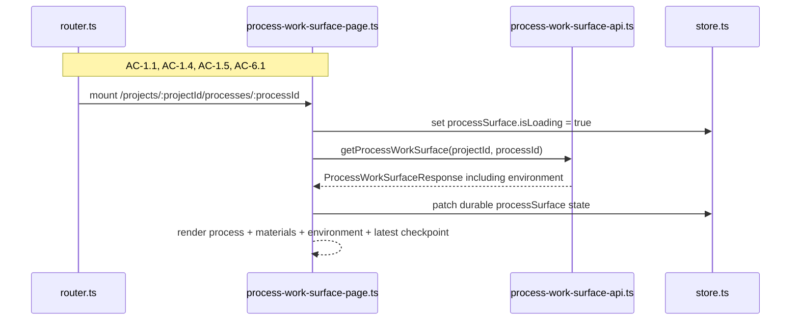
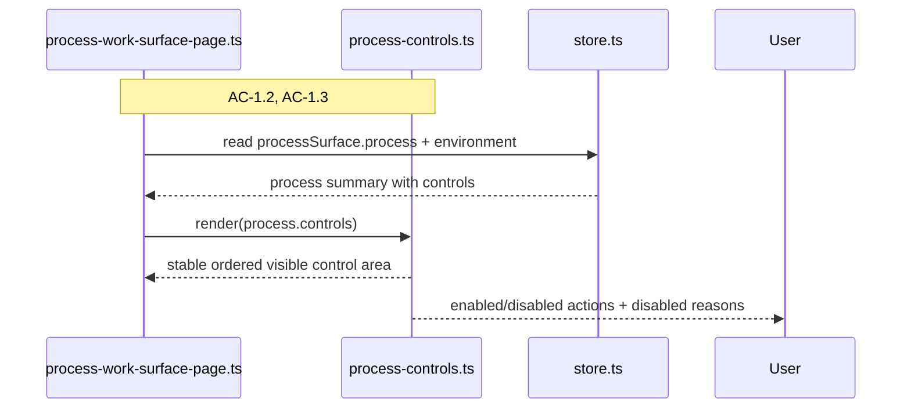
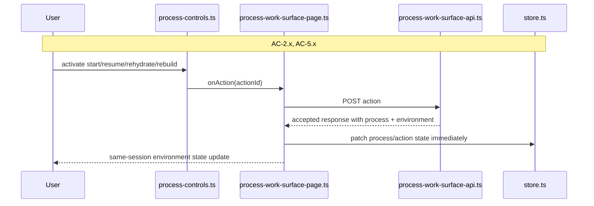
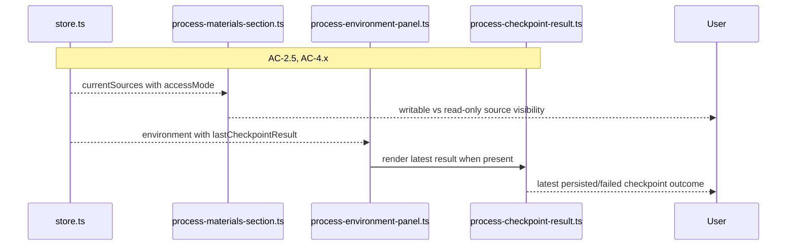
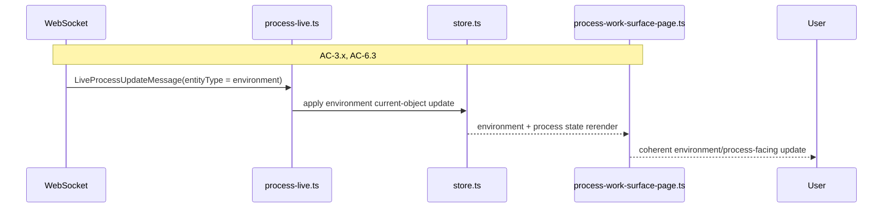

# Technical Design: Process Environment and Controlled Execution Client

This companion document covers the browser-side implementation for Epic 3. The
client remains the same Vite-built vanilla TypeScript shell mounted inside the
Fastify-owned application boundary. Epic 3 does not introduce a second client
app, a provider-specific browser path, or a direct browser-to-sandbox transport.
It extends the existing process work surface with environment summary state, a
stable visible control area, latest checkpoint visibility, and additional action
flows for `rehydrate` and `rebuild`.

## HTML Shell and Route Model

The browser still receives one shell document for all authenticated project and
process routes. Epic 3 is a deeper process-surface capability, not a new HTML
application. The route model stays:

- project index
- project shell
- process work surface

That matters because the user should experience Epic 3 as a richer version of
the existing process surface, not as a handoff into a separate execution tool.
The browser still orients through the same `process-work-surface` route and the
same shell header.

### Supported Routes

| Route | Meaning |
|-------|---------|
| `/projects` | Project index |
| `/projects/:projectId` | Project shell |
| `/projects/:projectId/processes/:processId` | Dedicated process work surface with environment state |

### Router File Changes

`apps/platform/client/app/router.ts` does not need a new route kind for Epic 3.
The process work surface remains the same top-level route. The extension is in
what that route renders, not where it lives.

Route parsing should stay exactly one level deep:

- project shell remains the summary surface
- process work surface remains the active-work surface
- environment work is rendered inside the active-work surface

That preserves bookmarkability, reload behavior, and the existing browser
back/forward model.

## Client Bootstrap

`apps/platform/client/app/bootstrap.ts` keeps the same high-level sequence from
Epic 2:

1. load `/auth/me`
2. resolve current route
3. fetch durable bootstrap for the active route
4. mount the correct page
5. open live subscription when the route is a process surface

Epic 3 extends the process route bootstrap payload. It does not replace the
bootstrap model. The important client rule is still bootstrap-first,
live-second. The browser should render from durable process truth first, then
layer environment and checkpoint changes in through typed live updates.

### Bootstrap Consequence

The existing process-surface bootstrap call already returns:

- `project`
- `process`
- `history`
- `materials`
- `currentRequest`
- `sideWork`

Epic 3 adds:

- `environment`

The browser should treat `environment` as another first-class durable bootstrap
entity, not as an optional side fetch. If the environment service is currently
unavailable, the bootstrap still succeeds and the page renders from durable
state with `environment.state = unavailable`.

## Client State

Epic 2 already introduced the correct high-level shape: a dedicated
`processSurface` slice separate from the project shell. Epic 3 should keep that
shape and extend it rather than inventing a nested environment store or a second
live-reconciliation path. The page still needs one coherent process-surface
state tree.

The main client design rule is to keep three concepts distinct:

- process lifecycle state
- environment lifecycle state
- action availability and disabled reasons

The current UI collapses most of that into `process.availableActions` and only
renders enabled actions. Epic 3 must stop doing that. The browser should keep
`availableActions` for backward-compatible action checks, but render from the
full `controls` array so disabled controls remain visible and explain why they
are unavailable.

### AppState Extensions

`apps/platform/shared/contracts/state.ts` and `apps/platform/client/app/store.ts`
should extend `ProcessSurfaceState` with:

```ts
export interface ProcessSurfaceState {
  projectId: string | null;
  processId: string | null;
  project: ProcessSurfaceProject | null;
  process: ProcessSurfaceSummary | null;
  history: ProcessHistorySectionEnvelope | null;
  materials: ProcessMaterialsSectionEnvelope | null;
  currentRequest: CurrentProcessRequest | null;
  sideWork: SideWorkSectionEnvelope | null;
  environment: EnvironmentSummary | null;
  isLoading: boolean;
  error: RequestError | null;
  actionError: RequestError | null;
  live: {
    connectionState: 'idle' | 'connecting' | 'connected' | 'reconnecting' | 'error';
    subscriptionId: string | null;
    lastSequenceNumber: number | null;
    error: RequestError | null;
  };
}
```

Key consequence:

- `process` owns process lifecycle, labels, and control metadata
- `environment` owns environment lifecycle and latest checkpoint visibility
- `actionError` remains request-scoped, not a substitute for durable environment
  failure state

### Store Responsibilities

`createAppStore()` remains synchronous and framework-free. The store still does
not need to become a generalized event bus. Epic 3 increases the amount of
state and the number of valid transitions, but not the complexity of the store
primitive itself.

The store must now support:

- bootstrap patching for `environment`
- live patching for `environment`
- same-session optimistic/accepted action updates for `start`, `resume`,
  `rehydrate`, and `rebuild`
- preserving durable state while live transport fails or reconnects

## Browser API Layer

Epic 3 modifies one existing HTTP API client and continues to use the existing
live-transport path. There is no new provider-facing browser API module.

### `apps/platform/client/browser-api/process-work-surface-api.ts`

Extend the existing module with:

```ts
export async function getProcessWorkSurface(args: {
  projectId: string;
  processId: string;
}): Promise<ProcessWorkSurfaceResponse>;

export async function startProcess(args: {
  projectId: string;
  processId: string;
}): Promise<StartProcessResponse>;

export async function resumeProcess(args: {
  projectId: string;
  processId: string;
}): Promise<ResumeProcessResponse>;

export async function rehydrateEnvironment(args: {
  projectId: string;
  processId: string;
}): Promise<RehydrateEnvironmentResponse>;

export async function rebuildEnvironment(args: {
  projectId: string;
  processId: string;
}): Promise<RebuildEnvironmentResponse>;
```

This module remains the mock boundary for process-surface HTTP behavior.

### Error Mapping

The fallback error parser should be extended so the browser can distinguish:

- `PROCESS_ENVIRONMENT_NOT_RECOVERABLE`
- `PROCESS_ENVIRONMENT_PREREQUISITE_MISSING`
- `PROCESS_ENVIRONMENT_UNAVAILABLE`

The browser should still treat later environment lifecycle failure as live or
durable state, not as a request-level error after an action is accepted.

## Feature File Layout

```text
apps/platform/client/features/processes/
├── process-work-surface-page.ts                 # MODIFIED
├── process-history-section.ts                   # EXISTS
├── current-request-panel.ts                     # EXISTS
├── process-materials-section.ts                 # MODIFIED
├── side-work-section.ts                         # EXISTS
├── process-response-composer.ts                 # EXISTS
├── process-live-status.ts                       # EXISTS
├── process-environment-panel.ts                 # NEW
├── process-controls.ts                          # NEW
└── process-checkpoint-result.ts                 # NEW
```

This keeps Epic 3 inside the existing `features/processes/` surface. The new
environment UI should not be pushed into a separate top-level feature directory,
because it is not a separate surface from the user's point of view.

### Module Responsibility Matrix

| Module | Status | Responsibility | Dependencies | ACs Covered |
|--------|--------|----------------|--------------|-------------|
| `app/bootstrap.ts` | MODIFIED | Extend process-route bootstrap, action handling, and live subscription updates with environment state | store, browser API, live applier | AC-1 through AC-6 |
| `app/store.ts` | MODIFIED | Hold environment summary and latest checkpoint visibility alongside existing process-surface state | shared contracts | AC-1, AC-4, AC-5, AC-6 |
| `app/process-live.ts` | MODIFIED | Apply `environment` live updates as a first-class entity | shared live contracts | AC-2, AC-3, AC-4, AC-6 |
| `browser-api/process-work-surface-api.ts` | MODIFIED | Add `rehydrate` and `rebuild` HTTP actions and parse extended bootstrap/errors | fetch, shared contracts | AC-2, AC-5, AC-6 |
| `process-work-surface-page.ts` | MODIFIED | Route-driven bootstrap, action orchestration, layout composition, and degraded-state rendering | store, browser API, child components | AC-1 through AC-6 |
| `process-environment-panel.ts` | NEW | Render environment summary, status label, blocked reason, last hydrated/checkpoint timestamps, and latest checkpoint result | shared contracts | AC-1, AC-4, AC-5, AC-6 |
| `process-controls.ts` | NEW | Render the stable visible control area using `controls`, not only `availableActions` | shared contracts, page callbacks | AC-1.2, AC-1.3, AC-5.x |
| `process-checkpoint-result.ts` | NEW | Render latest visible checkpoint outcome consistently | environment summary | AC-4.4, AC-4.5, AC-6.1, AC-6.4 |
| `process-materials-section.ts` | MODIFIED | Render source `accessMode` and keep current-material projection semantics intact | shared contracts | AC-2.5, AC-4.3 |
| `process-live-status.ts` | EXISTS | Continue to show connection/disconnect/retry state for the whole process surface | live state | AC-6.3 |

## Flow 1: Route Entry, Durable Bootstrap, and Environment Summary

**Covers:** AC-1.1, AC-1.4, AC-1.5, AC-6.1, AC-6.2, AC-6.4

This flow is still the user's first interaction with the process surface. Epic
3 deepens that first-load experience by adding a visible environment summary and
latest checkpoint visibility, but it should not change the overall mental model.
The browser still opens one process route, fetches one durable bootstrap, and
renders one coherent page.



### Design Notes

- `environment` should be required in the bootstrap contract
- if no environment exists, render `absent`, not blank space
- if the environment layer is unavailable, render `unavailable`, not a page
  failure
- latest checkpoint result should render inside the environment panel, not as a
  second unrelated section

### TC Mapping for this Flow

| TC | Tests | Module | Setup | Assert |
|----|-------|--------|-------|--------|
| TC-1.1a | environment state visible on first load | `tests/service/client/process-work-surface-page.test.ts` | bootstrap includes environment | environment panel renders state label |
| TC-1.1b | absent environment renders legibly | `tests/service/client/process-work-surface-page.test.ts` | bootstrap with `environment.state = absent` | absent state visible, no broken layout |
| TC-1.4a | reload preserves environment truth | `tests/integration/process-work-surface.test.ts` | route reload with changed durable environment state | refreshed environment state rendered |
| TC-1.5a | process remains visible without environment | `tests/service/client/process-work-surface-page.test.ts` | bootstrap with lost/absent environment | process identity and materials still visible |
| TC-6.1a | reopen restores latest durable environment + checkpoint result | `tests/integration/process-work-surface.test.ts` | reopen route after prior env work | environment panel shows latest durable summary |
| TC-6.2a | absence does not erase durable checkpoint result | `tests/integration/process-work-surface.test.ts` | bootstrap with absent environment + prior checkpoint | latest checkpoint still visible |
| TC-6.4a | finalized history not duplicated on reopen | `tests/integration/process-work-surface.test.ts` | reopen after settled history | no duplicate rows |
| TC-6.4b | prior checkpoint result not restated as new work | `tests/integration/process-work-surface.test.ts` | reopen after settled checkpoint | shown as existing state, not new event styling |

## Flow 2: Stable Visible Controls and Disabled Reasons

**Covers:** AC-1.2, AC-1.3, matrix coverage under AC-1.1 and AC-5.1

This is the biggest browser behavior shift in Epic 3. Today the process page
renders only enabled actions by checking `availableActions`. That will not work
for Epic 3 because the user must see the stable control set and understand why
actions are blocked.

The page should therefore stop rendering action buttons directly from
`availableActions` and instead render a dedicated control component from
`process.controls`. `availableActions` remains useful for backward-compatible
checks and analytics, but it is no longer the render source of truth.



### Design Notes

- the control set should be rendered in one stable order
- disabled controls should use `disabledReason` as readable text, not only a
  tooltip if the control library has one later
- control rendering should stay generic; environment-specific meaning comes from
  state and labels, not hardcoded client logic

### TC Mapping for this Flow

| TC | Tests | Module | Setup | Assert |
|----|-------|--------|-------|--------|
| TC-1.2a | stable control set remains visible | `tests/service/client/process-work-surface-page.test.ts` | bootstrap with mixed enabled/disabled controls | all standard controls render in stable order |
| TC-1.2b | disabled controls remain visible | `tests/service/client/process-work-surface-page.test.ts` | controls include disabled items | disabled buttons remain rendered |
| TC-1.3a | disabled reason shown for blocked environment action | `tests/service/client/process-work-surface-page.test.ts` or dedicated control test | disabled `rehydrate` / `rebuild` | readable blocked reason visible |
| TC-1.3b | disabled reason shown for blocked process action | `tests/service/client/process-work-surface-page.test.ts` or dedicated control test | disabled `start` / `resume` / `respond` | readable blocked reason visible |
| TC-1.1c-k | environment state and control matrix | `tests/service/client/process-work-surface-page.test.ts` | bootstrap fixtures for each matrix state | control enable/disable behavior matches matrix |

## Flow 3: Start, Resume, Rehydrate, and Rebuild With Same-Session Updates

**Covers:** AC-2.1, AC-2.3, AC-2.4, AC-5.2, AC-5.3, AC-5.5

These actions follow the same browser pattern:

- trigger one HTTP action
- patch accepted state in the same session immediately
- then let live updates move the environment and process through later states

The important client rule is that action acceptance and later lifecycle failure
must stay distinct. If `rehydrate` is accepted and the provider later fails, the
browser should continue showing the accepted action path plus a later failed
environment state, not rewrite history into a fake request error.



### Design Notes

- keep one shared page-level action dispatcher instead of duplicating button
  logic across components
- `actionError` is only for immediate request rejection
- later environment failures should render through `environment.state`,
  `blockedReason`, and latest checkpoint result
- `rehydrate` and `rebuild` should not clear the page back to a generic loading
  screen; they should preserve the visible process surface while showing updated
  environment state

### TC Mapping for this Flow

| TC | Tests | Module | Setup | Assert |
|----|-------|--------|-------|--------|
| TC-2.1a | start enters preparation state in same session | `tests/service/client/process-work-surface-page.test.ts` | start action accepted | store/page update to preparing without full reload |
| TC-2.1b | resume enters preparation when needed | `tests/service/client/process-work-surface-page.test.ts` | resume accepted | environment state updates in place |
| TC-2.3a | hydration progress becomes visible | `tests/service/client/process-live.test.ts` | environment live updates | page shows preparing/hydrating state |
| TC-2.3b | hydration failure becomes visible | `tests/service/client/process-live.test.ts` | later environment failure update | page shows failed/unavailable state without request error rewrite |
| TC-2.4a | running begins after readiness | `tests/service/client/process-live.test.ts` | accepted start then ready/running updates | process/environment transition shown in sequence |
| TC-2.4b | running does not begin after failed preparation | `tests/service/client/process-live.test.ts` | failure after accepted action | running state never shown falsely |
| TC-5.2a | rehydrate refreshes stale environment | `tests/service/client/process-work-surface-page.test.ts` | stale env + accepted rehydrate | environment state moves out of stale in same session |
| TC-5.2b | rehydrate updates visible state | `tests/service/client/process-live.test.ts` | later success update | environment panel transitions to ready/running |
| TC-5.3a | rebuild replaces lost environment | `tests/service/client/process-work-surface-page.test.ts` | lost env + accepted rebuild | environment state becomes rebuilding/preparing |
| TC-5.3b | rebuild does not depend on prior survival | `tests/service/client/process-live.test.ts` | rebuild success with new environment id | page remains coherent and updates environment summary |
| TC-5.5a | rebuild blocked by missing prerequisite | `tests/service/client/process-work-surface-page.test.ts` | rebuild request rejected | `actionError` shows immediate rejection |
| TC-5.5b | rehydrate blocked when rebuild required | `tests/service/client/process-work-surface-page.test.ts` | rehydrate request rejected with recoverability error | immediate readable rejection shown |

## Flow 4: Materials, Access Mode, and Latest Checkpoint Visibility

**Covers:** AC-2.5, AC-4.1, AC-4.2, AC-4.3, AC-4.4, AC-4.5

The process surface should still feel like one workspace, not a history log plus
an unrelated environment widget. That means source writability and latest
checkpoint visibility should connect naturally to the materials and environment
areas the user is already looking at.

The client should therefore:

- render `accessMode` on current source rows
- render latest checkpoint result in the environment panel
- keep checkpoint visibility latest-only, matching the epic
- never invent a second checkpoint-history UI in this slice



### Design Notes

- source access mode should be visible as text, not only iconography
- latest checkpoint result should show target label, target ref when present, and
  outcome
- failed checkpoint results should remain readable after reopen
- checkpoint results should not be rendered as a scrolling list in Epic 3

### TC Mapping for this Flow

| TC | Tests | Module | Setup | Assert |
|----|-------|--------|-------|--------|
| TC-2.5a | writable source identifiable | `tests/service/client/process-work-surface-page.test.ts` | materials with read_write source | writable label visible |
| TC-2.5b | read-only source identifiable | `tests/service/client/process-work-surface-page.test.ts` | materials with read_only source | read-only label visible |
| TC-4.1a | durable artifact output persists visibly | `tests/service/client/process-live.test.ts` + integration | successful artifact checkpoint update | materials/checkpoint UI reflect success |
| TC-4.1b | artifact output recoverable after reopen | `tests/integration/process-work-surface.test.ts` | reopen after artifact checkpoint | latest result and current artifact context visible |
| TC-4.2b | code checkpoint result process-visible | `tests/service/client/process-live.test.ts` | latest result with source target ref | source identity and ref visible |
| TC-4.3a | read-only source never offers code checkpointing as outcome | `tests/service/client/process-work-surface-page.test.ts` | read-only source + result set | UI does not imply writable checkpoint path for that source |
| TC-4.4a | artifact checkpoint result visible | `tests/service/client/process-work-surface-page.test.ts` | bootstrap/live env with artifact checkpoint success | latest result shows artifact success |
| TC-4.4b | code checkpoint result visible | `tests/service/client/process-work-surface-page.test.ts` | bootstrap/live env with code checkpoint success | latest result shows source + ref |
| TC-4.5a | artifact checkpoint failure shown | `tests/service/client/process-live.test.ts` | failed latest result | failure visible in environment panel |
| TC-4.5b | code checkpoint failure shown | `tests/service/client/process-live.test.ts` | failed code checkpoint | failure visible with target details |

## Flow 5: Live Environment Updates, Reconnect, and Degraded Operation

**Covers:** AC-3.1, AC-3.2, AC-3.3, AC-3.4, AC-6.3

Epic 3 should preserve the strongest part of the current client design:
bootstrap-first, current-object live updates second. `environment` should be
added as just another live entity, not a parallel stream model. That keeps
reconnect, stale-sequence handling, and fallback bootstrap semantics consistent.



### Live Apply Contract

`apps/platform/client/app/process-live.ts` should add one more entity branch:

```ts
if (args.message.entityType === 'environment') {
  nextState.environment = args.message.payload;
  return nextState;
}
```

The stale-message rules remain unchanged:

- ignore cross-process messages
- ignore stale sequence numbers within one subscription
- treat live transport as assistive, not authoritative over durable bootstrap

### TC Mapping for this Flow

| TC | Tests | Module | Setup | Assert |
|----|-------|--------|-------|--------|
| TC-3.1a | running execution state visible | `tests/service/client/process-live.test.ts` | environment upsert to running | environment panel updates to running |
| TC-3.2a | execution activity is process-facing | `tests/service/client/process-live.test.ts` | mixed process/history/environment updates | page renders coherent process-facing view |
| TC-3.2b | browser does not reconstruct raw fragments | `tests/service/client/process-live.test.ts` | typed current-object updates only | no fragment assembly logic needed |
| TC-3.3a | waiting distinct from running | `tests/service/client/process-live.test.ts` | process waiting + environment not running | distinct labels visible |
| TC-3.3b | checkpointing distinct from running | `tests/service/client/process-live.test.ts` | environment upsert checkpointing | checkpointing state visible |
| TC-3.4a | execution failure leaves surface legible | `tests/service/client/process-live.test.ts` | environment/process failure update | prior sections remain visible |
| TC-6.3a | durable surface remains usable when live updates fail | `tests/service/client/process-work-surface-page.test.ts` + integration | bootstrap success + live disconnect | page remains readable, retry state visible |

## Interface Definitions

### Page-Level Dependencies

```ts
export interface ProcessWorkSurfacePageDeps {
  store: AppStore;
  targetDocument: Document;
  targetWindow: Window & typeof globalThis;
  onOpenProject: (projectId: string) => void;
  onStartProcess: (projectId: string, processId: string) => Promise<void>;
  onResumeProcess: (projectId: string, processId: string) => Promise<void>;
  onRehydrateEnvironment: (projectId: string, processId: string) => Promise<void>;
  onRebuildEnvironment: (projectId: string, processId: string) => Promise<void>;
  onSubmitProcessResponse?: (projectId: string, processId: string, message: string) => void;
  onRetryLiveSubscription?: (projectId: string, processId: string) => void;
}
```

### Environment Panel Interface

```ts
export interface ProcessEnvironmentPanelProps {
  environment: EnvironmentSummary | null;
  targetDocument: Document;
}
```

### Controls Interface

```ts
export interface ProcessControlsProps {
  controls: ProcessControlState[];
  targetDocument: Document;
  onAction: (actionId: ProcessControlState['actionId']) => void;
}
```

### Checkpoint Result Interface

```ts
export interface ProcessCheckpointResultProps {
  result: LastCheckpointResult | null;
  targetDocument: Document;
}
```

### Live Update Apply Contract

```ts
export interface ApplyLiveProcessMessageArgs {
  state: ProcessSurfaceState;
  message: LiveProcessUpdateMessage;
}

export function applyLiveProcessMessage(args: ApplyLiveProcessMessageArgs): ProcessSurfaceState;
```

Contract rules:

- `environment` payload replaces the current environment summary wholesale
- `lastCheckpointResult` travels inside `environment`, not as a separate entity
- request-level action errors are not synthesized from later live failures
- reconnect still begins with a fresh durable bootstrap before the next live
  subscription

## Client Testing Strategy

The client test strategy should stay consistent with the current repo:

- page-level tests for full process-surface behavior
- live-apply tests for current-object reconciliation
- mock only external boundaries such as `fetch` and `WebSocket`
- do not mock store logic or page child composition unnecessarily

### Mock Boundaries

Mock these:

- `fetch` through the browser API boundary
- browser `WebSocket`
- config/bootstrap payload injection when needed

Do not mock these:

- `applyLiveProcessMessage`
- `createAppStore`
- process page layout composition

### Primary Client Test Files

| File | Primary Coverage |
|------|------------------|
| `tests/service/client/process-work-surface-page.test.ts` | bootstrap rendering, controls, environment panel, access-mode visibility, immediate action rejection |
| `tests/service/client/process-live.test.ts` | `environment` entity reconciliation, latest checkpoint result updates, process/environment state distinction |
| `tests/integration/process-work-surface.test.ts` | durable reopen with environment summary and latest checkpoint result |

### Non-TC Decided Tests

- control order remains stable when enabled states change
- disabled reasons remain visible across rerenders
- environment panel handles `null` and `absent` distinctly
- latest checkpoint result render handles `code`, `artifact`, and `mixed` kinds
- environment live updates do not wipe unrelated history/materials/side-work
  state
