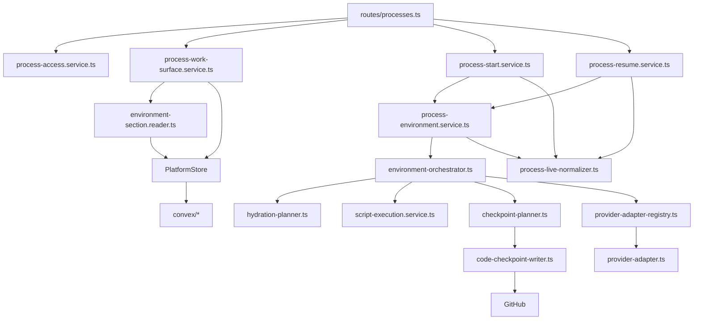
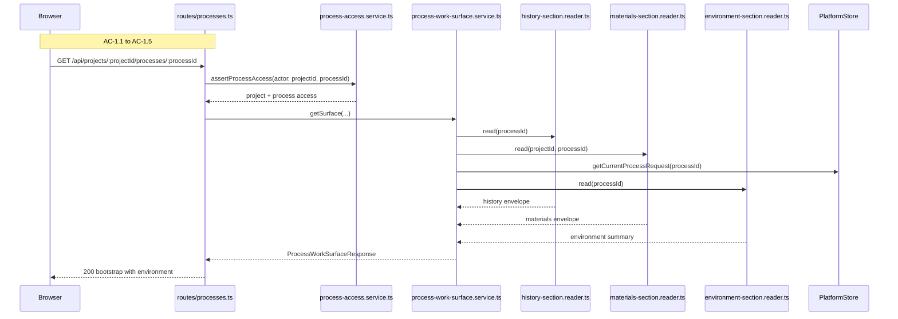
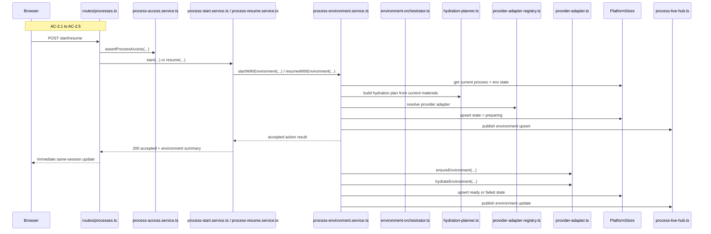
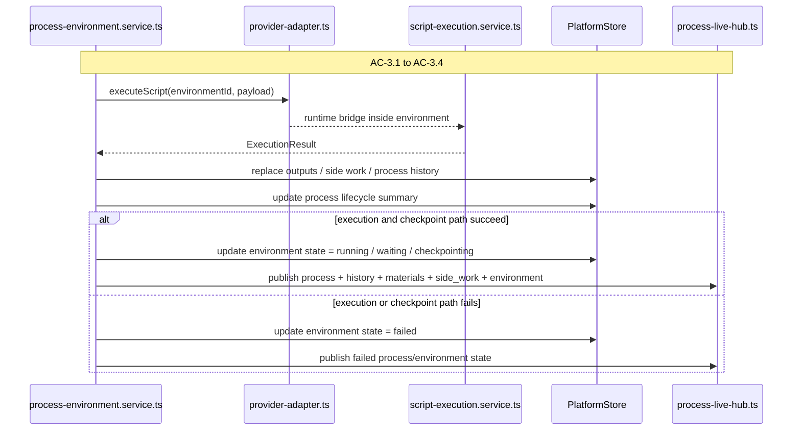
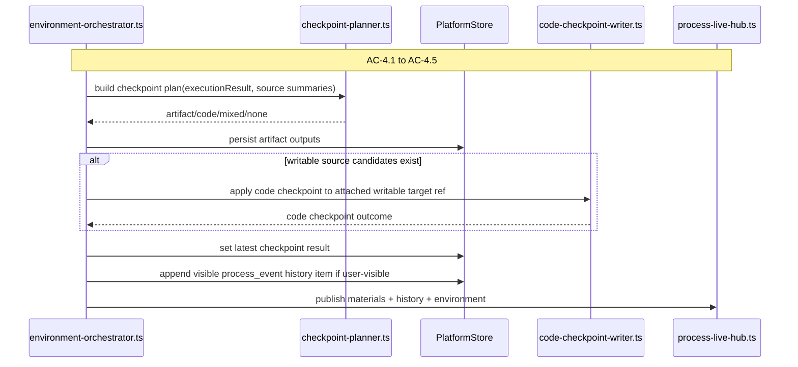
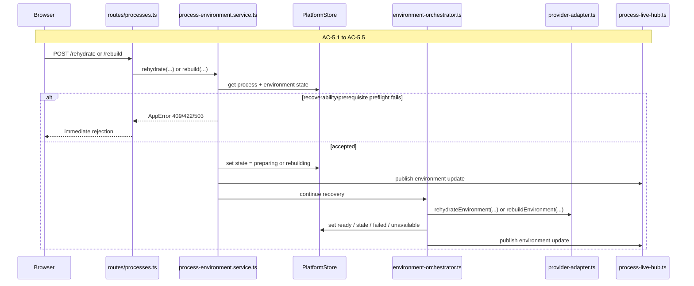
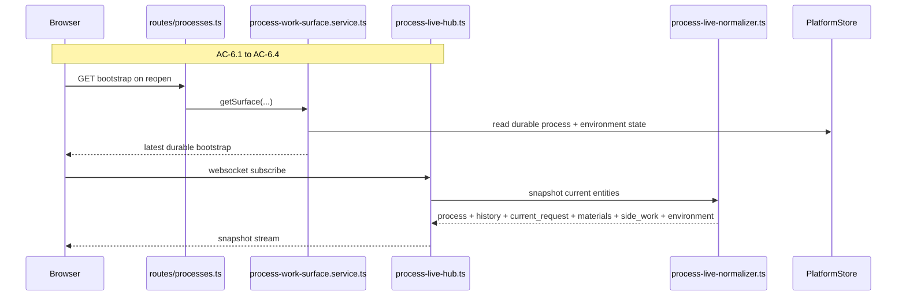

# Technical Design: Process Environment and Controlled Execution Server

This companion document covers the Fastify, provider, orchestration, live
transport, and Convex design for Epic 3. It expands the server-owned parts of
the index document into exact module boundaries, durable-state decisions, flow
design, and copy-paste-ready interfaces.

## Server Bootstrap

The server remains one Fastify 5 monolith. Epic 3 does not introduce a second
server, a separate execution daemon as the public control plane, or any
browser-to-provider direct path. The browser still enters through the existing
process route family. Fastify still owns auth, access checks, action acceptance,
provider orchestration, canonical writes, and live publication.

Epic 3 adds one new server concern beneath the existing process route: a
platform-owned environment orchestration layer. That layer is responsible for
turning process-surface actions into provider lifecycle work, hydration,
execution, checkpoint planning, and recovery. It is not a second product
surface. It is a deeper implementation layer inside the existing process
surface.

### Entry Point: `apps/platform/server/index.ts`

Responsibilities remain the same:

- load environment configuration
- construct the Fastify app
- start the HTTP server

Epic 3 adds one more startup responsibility: load provider configuration needed
to assemble the hosted Daytona reference provider and reserve space for the
fast-follow local provider configuration. The exact env var names remain
dependency-research-gated in this draft, but the location of that configuration
is settled: server config loads it, app assembly wires it in, and request
handlers never build providers ad hoc.

### App Factory: `apps/platform/server/app.ts`

`app.ts` remains the main assembly point. Epic 3 extends it to:

- register provider-adapter wiring during startup
- instantiate the environment orchestrator and process environment service
- pass the new environment reader and environment service into process routes and
  process-surface services
- preserve the existing websocket registration and process live hub wiring from
  Epic 2

The assembly order matters:

1. auth/session plugins still register first
2. websocket support still registers before process websocket routes
3. shared process services are instantiated
4. provider adapters are assembled from config
5. routes are mounted after those services are ready

The new environment stack should be created once at app startup, not per
request. Provider adapters are long-lived integration objects, not request-local
ephemera.

### Provider Configuration Stance

Epic 3 is intentionally two-provider work:

- hosted `DaytonaProvider` first
- `LocalProvider` as a contract-compatible fast follow

That means the server companion should treat Daytona as the reference provider
semantics for environment lifecycle. Local is allowed to be weaker for trusted
development, but it is not allowed to simplify the provider contract. The
contract is shaped by the hosted provider path, then satisfied by local.

The first research pass narrows the likely dependency choices:

- hosted Daytona integration candidate: `@daytonaio/sdk` `0.166.0`
- GitHub write client candidate: `@octokit/rest` `22.0.1`

This draft therefore no longer treats those as completely open-ended. The
remaining uncertainty is in exact wiring and policy, not in the broad package
direction.

Provider selection should follow one server-owned default policy when a process
has no existing environment state row:

- Epic 3 default: `daytona`
- local is used only when environment configuration explicitly switches the
  default for development or tests

Once a `processEnvironmentStates` row exists, `providerKind` becomes durable and
recovery actions reuse that recorded provider.

## Top-Tier Surface Nesting

| Surface | Epic 3 Server Nesting |
|---------|------------------------|
| Processes | Existing `routes/processes.ts`, process action services, process live hub, and process module registry remain the public control-plane seam |
| Environments | New server-owned orchestration, provider adapter, hydration, checkpoint, and recovery modules live under `services/processes/environment/` |
| Tool Runtime | Execution happens through a server-owned call into an in-environment executor boundary; no browser-facing runtime controller is added |
| Artifacts | Existing artifact persistence remains canonical for artifact checkpoint success, with process-facing projection returning to the process surface |
| Sources | Existing source attachments gain durable `accessMode`; source writability gates code checkpointing but does not create a new direct browser action |
| Archive | Epic 3 still does not implement the full archive. Settled environment/checkpoint moments appear in visible process history and logs, not a new archive domain API |

The key nesting rule is: environment work belongs under the existing process
surface control plane. The server should not expose separate `/api/environments/*`
browser routes in this slice. The process route stays the user's entry point,
and the process action model stays the top-level control vocabulary even when
those actions trigger environment work behind the scenes.

## Module Architecture

```text
apps/platform/server/
├── app.ts
├── routes/
│   └── processes.ts                                   # MODIFIED
├── services/
│   ├── projects/
│   │   └── platform-store.ts                          # MODIFIED
│   └── processes/
│       ├── process-access.service.ts                  # EXISTS
│       ├── process-work-surface.service.ts            # MODIFIED
│       ├── process-start.service.ts                   # MODIFIED
│       ├── process-resume.service.ts                  # MODIFIED
│       ├── process-response.service.ts                # EXISTS
│       ├── process-module-registry.ts                 # EXISTS
│       ├── readers/
│       │   ├── history-section.reader.ts              # EXISTS
│       │   ├── materials-section.reader.ts            # MODIFIED
│       │   ├── side-work-section.reader.ts            # EXISTS
│       │   └── environment-section.reader.ts          # NEW
│       ├── environment/
│       │   ├── process-environment.service.ts         # NEW
│       │   ├── environment-orchestrator.ts            # NEW
│       │   ├── provider-adapter.ts                    # NEW
│       │   ├── provider-adapter-registry.ts           # NEW
│       │   ├── daytona-provider-adapter.ts            # NEW (reference provider, research-gated internals)
│       │   ├── local-provider-adapter.ts              # NEW (fast follow)
│       │   ├── hydration-planner.ts                   # NEW
│       │   ├── checkpoint-planner.ts                  # NEW
│       │   ├── code-checkpoint-writer.ts              # NEW
│       │   └── script-execution.service.ts            # NEW
│       └── live/
│           ├── process-live-hub.ts                    # MODIFIED
│           └── process-live-normalizer.ts             # MODIFIED
└── errors/
    ├── app-error.ts
    ├── codes.ts                                       # MODIFIED
    └── section-error.ts

apps/platform/shared/contracts/
├── process-work-surface.ts                            # MODIFIED
├── live-process-updates.ts                            # MODIFIED
└── state.ts                                           # MODIFIED

convex/
├── schema.ts                                          # MODIFIED
├── processes.ts                                       # MODIFIED
├── processHistoryItems.ts                             # MODIFIED
├── processOutputs.ts                                  # MODIFIED
├── sourceAttachments.ts                               # MODIFIED
└── processEnvironmentStates.ts                        # NEW
```

### Module Responsibility Matrix

| Module | Status | Responsibility | Dependencies | ACs Covered |
|--------|--------|----------------|--------------|-------------|
| `routes/processes.ts` | MODIFIED | Extend bootstrap and action routes with `environment`, `rehydrate`, and `rebuild` behavior while preserving the existing process route family | auth, process services, request/response contracts | AC-1 to AC-6 |
| `process-work-surface.service.ts` | MODIFIED | Compose durable process bootstrap including environment summary and latest checkpoint visibility | access service, section readers, registry, `PlatformStore` | AC-1, AC-4, AC-6 |
| `process-start.service.ts` | MODIFIED | Convert `start` into a process action that performs preflight checks, enters preparation, and delegates lifecycle work to the environment service | access service, environment service, live hub | AC-2, AC-3, AC-6 |
| `process-resume.service.ts` | MODIFIED | Convert `resume` into a process action that performs recoverability checks and delegates lifecycle work to the environment service | access service, environment service, live hub | AC-2, AC-3, AC-5, AC-6 |
| `readers/environment-section.reader.ts` | NEW | Read durable environment summary and latest checkpoint result for the bootstrap path | `PlatformStore` | AC-1, AC-4, AC-6 |
| `readers/materials-section.reader.ts` | MODIFIED | Extend source projections with `accessMode` and maintain current-materials projection semantics | `PlatformStore`, materials builder | AC-2, AC-4, AC-5 |
| `environment/process-environment.service.ts` | NEW | Public server façade for prepare, execute, checkpoint, rehydrate, rebuild, and teardown coordination | orchestrator, provider registry, planners, live hub | AC-2, AC-3, AC-4, AC-5, AC-6 |
| `environment/environment-orchestrator.ts` | NEW | Sequence lifecycle steps and enforce the accepted-action versus later-failure boundary | provider adapters, planners, writers, `PlatformStore` | AC-2, AC-3, AC-4, AC-5, AC-6 |
| `environment/provider-adapter.ts` | NEW | Shared provider contract for Daytona first and Local fast follow | provider research output | AC-2, AC-3, AC-5 |
| `environment/provider-adapter-registry.ts` | NEW | Resolve the correct provider adapter by `providerKind` and environment policy | app config, provider adapters | AC-2, AC-5 |
| `environment/daytona-provider-adapter.ts` | NEW | Hosted Daytona lifecycle implementation behind the provider contract | Daytona SDK/API, research-gated | AC-2, AC-3, AC-5 |
| `environment/local-provider-adapter.ts` | NEW | Local fast-follow provider implementation behind the same contract | local runtime/process strategy, research-gated | AC-2, AC-3, AC-5 |
| `environment/hydration-planner.ts` | NEW | Build a deterministic working-set hydration plan from current artifacts, outputs, and attached sources | `PlatformStore`, current material refs | AC-2, AC-5 |
| `environment/checkpoint-planner.ts` | NEW | Decide artifact/code checkpoint targets, enforce writability, and shape latest-result projection | `PlatformStore`, source summaries | AC-4, AC-6 |
| `environment/code-checkpoint-writer.ts` | NEW | Apply code persistence to canonical source targets without exposing provider/runtime internals to the browser | GitHub boundary, checkpoint planner | AC-4 |
| `environment/script-execution.service.ts` | NEW | Send a one-shot script payload into the environment executor and normalize the result for the outer controller | provider adapter | AC-3, AC-4 |
| `live/process-live-normalizer.ts` | MODIFIED | Add `environment` as a first-class live entity and embed latest checkpoint result inside it | shared contracts, environment summary projection | AC-2, AC-3, AC-4, AC-6 |
| `services/projects/platform-store.ts` | MODIFIED | Add durable reads and writes for environment summary, state transitions, and latest checkpoint visibility | Convex functions | AC-1, AC-4, AC-5, AC-6 |
| `convex/processEnvironmentStates.ts` | NEW | Persist environment lifecycle summary and latest checkpoint result separately from generic process lifecycle | schema, typed Convex functions | AC-1, AC-4, AC-5, AC-6 |
| `convex/sourceAttachments.ts` | MODIFIED | Add durable `accessMode` to source attachments and expose it in server projections | schema, current source projection | AC-2, AC-4 |

### Component Interaction Diagram



## Durable State Model

Epic 3 adds one new durable concern and extends two existing ones:

- current environment summary and recovery state
- latest visible checkpoint result
- source attachment writability

It intentionally does **not** add a separate browser-facing ordered checkpoint
history table. The epic only promises latest-result visibility. Settled
checkpoint moments may still appear in visible process history, and canonical
success history already lives in GitHub or artifact versions.

### Design Stance

Keep process lifecycle and environment lifecycle separate.

- `processes` stays the source of truth for generic process status
- `processEnvironmentStates` becomes the source of truth for environment status
- process-surface projection combines them for the browser

Do not store high-churn environment progress on the generic `processes` row.
The Convex guidance is clear on separating high-churn operational data from
shared records. Environment summary belongs in its own table keyed by
`processId`.

Do not add a platform-owned append-only checkpoint table in Epic 3.

- successful code checkpoint history already exists in GitHub
- successful artifact checkpoint history should exist in artifact/version state
- latest visible checkpoint state is sufficient for the process surface
- failed or blocked checkpoint moments should appear in process-visible history
  and logs

### Environment State Authority

The server should own the following environment states:

| State | Meaning | Recovery Implication |
|-------|---------|----------------------|
| `absent` | No current environment exists | `start` or `resume` may create one if process state allows |
| `preparing` | Environment exists or is being created while hydration/setup is in progress | wait for readiness or failure |
| `ready` | Environment is hydrated and available for execution | `start` or `resume` may proceed if process state allows |
| `running` | Active execution is occurring in the environment | recovery controls disabled |
| `checkpointing` | Durable writes are settling | process should not present as idle |
| `stale` | Environment still exists but current canonical inputs no longer match the working-set fingerprint | `rehydrate` is the preferred path |
| `failed` | Preparation or execution failed in a recoverable or partially recoverable way | `rehydrate`, `rebuild`, or `restart` depending on process/environment state |
| `lost` | The previous environment can no longer be reached or trusted as a base | `rebuild` is required |
| `rebuilding` | Recovery is reconstructing the environment from canonical inputs | wait for readiness or failure |
| `unavailable` | Environment lifecycle service/provider path is currently unavailable | keep durable process surface open; expose blocked recovery path |

### Convex Tables

| Table | Status | Purpose | Notes |
|-------|--------|---------|-------|
| `processes` | MODIFIED | Generic process lifecycle summary | Continue to own process status, phase, and next action summary only |
| `processEnvironmentStates` | NEW | Durable environment summary and latest visible checkpoint result | One row per process |
| `processHistoryItems` | MODIFIED | Visible process-facing history | Add settled checkpoint/recovery process events as needed |
| `processOutputs` | MODIFIED | Current process output summaries | Remains an input to hydration and artifact checkpoint planning |
| `sourceAttachments` | MODIFIED | Durable source summary rows | Add `accessMode` so writability is durable and explicit |
| process-specific state tables | UNCHANGED SHAPE FOR EPIC 3 | Continue to store process-owned artifact/source refs | Environment orchestration consumes them but does not move their meaning into the generic layer |

### Convex Field Outline

All new and modified Convex functions should follow the generated Convex
guidelines:

- use `query`, `mutation`, `internalQuery`, `internalMutation`, or `action`
  from `./_generated/server`
- include validators for every function
- use typed contexts, not `ctx: any`
- avoid unbounded arrays on shared records
- keep high-churn operational state off generic shared rows

#### `processEnvironmentStates`

```ts
export const checkpointKindValidator = v.union(
  v.literal('artifact'),
  v.literal('code'),
  v.literal('mixed'),
);

export const checkpointOutcomeValidator = v.union(
  v.literal('succeeded'),
  v.literal('failed'),
);

export const environmentStateValidator = v.union(
  v.literal('absent'),
  v.literal('preparing'),
  v.literal('ready'),
  v.literal('running'),
  v.literal('checkpointing'),
  v.literal('stale'),
  v.literal('failed'),
  v.literal('lost'),
  v.literal('rebuilding'),
  v.literal('unavailable'),
);

export const checkpointResultValidator = v.object({
  checkpointId: v.string(),
  checkpointKind: checkpointKindValidator,
  outcome: checkpointOutcomeValidator,
  targetLabel: v.string(),
  targetRef: v.union(v.string(), v.null()),
  completedAt: v.string(),
  failureReason: v.union(v.string(), v.null()),
});

export const processEnvironmentStatesTableFields = {
  processId: v.id('processes'),
  providerKind: v.union(v.literal('daytona'), v.literal('local')),
  environmentId: v.union(v.string(), v.null()),
  state: environmentStateValidator,
  blockedReason: v.union(v.string(), v.null()),
  lastHydratedAt: v.union(v.string(), v.null()),
  lastCheckpointAt: v.union(v.string(), v.null()),
  lastCheckpointResult: v.union(checkpointResultValidator, v.null()),
  workingSetFingerprint: v.union(v.string(), v.null()),
};
```

#### `sourceAttachments` additions

```ts
accessMode: v.union(v.literal('read_only'), v.literal('read_write'))
```

This is a durable property of the attachment, not a transient execution hint.
Checkpoint planning reads it from durable source state and refuses code
checkpointing when the attachment is read-only.

#### `processHistoryItems` additions

Epic 3 should not create a second visible history subsystem. Reuse
`processHistoryItems` to surface settled environment and checkpoint moments with
`process_event` rows when the event is user-visible:

- environment entered preparation
- environment recovery required rebuild
- latest checkpoint failed
- checkpoint succeeded and changed canonical state

These are visible timeline events, not a substitute for full archive work.

### `processes` Table Changes

Do not add environment lifecycle fields to `processes`. The only expected
generic process-row change is to keep shell and process-surface summary
projections coherent with the new control vocabulary:

- the current repo already stores `hasEnvironment` on `processes`; Epic 3 should
  keep that field for first-cut compatibility with existing shell and process
  summary contracts
- touched write paths should derive and maintain that field from
  `processEnvironmentStates` instead of inventing a same-slice migration away
  from it
- `availableActions` continues to be a projection, not a persisted array

That means the environment summary should still be read and composed into
projections at service level, but the existing stored `hasEnvironment` field is
kept as a compatibility field in Epic 3 rather than silently normalized away.

### Index Plan

`processEnvironmentStates` should define:

```ts
defineTable(processEnvironmentStatesTableFields)
  .index('by_processId', ['processId'])
  .index('by_environmentId', ['environmentId'])
```

No cross-process operational index is needed for the first cut. The process
surface always resolves environment state by `processId`, and reverse lookup by
`environmentId` is enough for provider callbacks or recovery tooling if that
becomes necessary.

### Query Discipline

The current repo still has some scaffold shortcuts in Convex modules. Epic 3
should not treat those as precedent.

The design stance for all new or modified Convex code is:

- replace `queryGeneric` / `mutationGeneric` usage in touched files
- use proper validators and generated types
- prefer indexed lookups and targeted reads over broad `.collect()` patterns
- keep hydration/checkpoint summaries bounded and row-oriented
- use `internal*` functions for server-only environment transitions that should
  not be public Convex API surface

That keeps the new environment state layer aligned with the generated guidance
instead of extending the Story 0 shortcuts.

## Core Interfaces

### Environment Summary Projection

```ts
export interface EnvironmentSummaryRecord {
  environmentId: string | null;
  providerKind: 'daytona' | 'local';
  state:
    | 'absent'
    | 'preparing'
    | 'ready'
    | 'running'
    | 'checkpointing'
    | 'stale'
    | 'failed'
    | 'lost'
    | 'rebuilding'
    | 'unavailable';
  blockedReason: string | null;
  lastHydratedAt: string | null;
  lastCheckpointAt: string | null;
  lastCheckpointResult: LastCheckpointResult | null;
  workingSetFingerprint: string | null;
}
```

### Last Checkpoint Result

```ts
export interface LastCheckpointResult {
  checkpointId: string;
  checkpointKind: 'artifact' | 'code' | 'mixed';
  outcome: 'succeeded' | 'failed';
  targetLabel: string;
  targetRef: string | null;
  completedAt: string;
  failureReason: string | null;
}
```

### Provider Adapter

```ts
export interface EnsureEnvironmentArgs {
  processId: string;
  providerKind: 'daytona' | 'local';
}

export interface EnsuredEnvironment {
  providerKind: 'daytona' | 'local';
  environmentId: string;
  workspaceHandle: string;
}

export interface HydrationPlan {
  fingerprint: string;
  artifactInputs: Array<{
    artifactId: string;
    displayName: string;
    versionLabel: string | null;
  }>;
  outputInputs: Array<{
    outputId: string;
    displayName: string;
    revisionLabel: string | null;
  }>;
  sourceInputs: Array<{
    sourceAttachmentId: string;
    displayName: string;
    targetRef: string | null;
    accessMode: 'read_only' | 'read_write';
  }>;
}

export interface HydrationResult {
  environmentId: string;
  hydratedAt: string;
  fingerprint: string;
}

export interface ScriptPayload {
  format: 'ts-module-source';
  entrypoint: 'default';
  source: string;
}

export interface ExecuteEnvironmentScriptArgs {
  environmentId: string;
  scriptPayload: ScriptPayload;
}

export interface PlatformProcessOutputWriteInput {
  outputId?: string;
  linkedArtifactId: string | null;
  displayName: string;
  revisionLabel: string | null;
  state: string;
  updatedAt?: string;
}

export interface PlatformSideWorkWriteInput {
  sideWorkId?: string;
  displayLabel: string;
  purposeSummary: string;
  status: 'running' | 'completed' | 'failed';
  resultSummary: string | null;
  updatedAt?: string;
}

export interface ExecutionResult {
  processStatus: 'running' | 'waiting' | 'completed' | 'failed' | 'interrupted';
  processHistoryItems: ProcessHistoryItem[];
  outputWrites: PlatformProcessOutputWriteInput[];
  sideWorkWrites: PlatformSideWorkWriteInput[];
  artifactCheckpointCandidates: ArtifactCheckpointCandidate[];
  codeCheckpointCandidates: CodeCheckpointCandidate[];
}

export interface EnvironmentProviderAdapter {
  providerKind: 'daytona' | 'local';
  ensureEnvironment(args: EnsureEnvironmentArgs): Promise<EnsuredEnvironment>;
  hydrateEnvironment(args: {
    environmentId: string;
    plan: HydrationPlan;
  }): Promise<HydrationResult>;
  executeScript(args: ExecuteEnvironmentScriptArgs): Promise<ExecutionResult>;
  rehydrateEnvironment(args: {
    environmentId: string;
    plan: HydrationPlan;
  }): Promise<HydrationResult>;
  rebuildEnvironment(args: {
    processId: string;
    providerKind: 'daytona' | 'local';
    plan: HydrationPlan;
  }): Promise<HydrationResult & EnsuredEnvironment>;
  teardownEnvironment(args: { environmentId: string }): Promise<void>;
}
```

`scriptPayload` is a self-contained TypeScript module source string whose
default export is the executor entrypoint. The exact packaging/bootstrap helper
used to transport or compile that module remains research-gated, but the
controller/executor contract should be treated as TypeScript module source
rather than as an opaque free-form string.

### Checkpoint Planning

```ts
export interface ArtifactCheckpointCandidate {
  artifactId: string;
  displayName: string;
  revisionLabel: string | null;
  contentsRef: string;
}

export interface CodeCheckpointCandidate {
  sourceAttachmentId: string;
  displayName: string;
  targetRef: string | null;
  accessMode: 'read_only' | 'read_write';
  workspaceRef: string;
}

export interface CheckpointPlan {
  kind: 'artifact' | 'code' | 'mixed' | 'none';
  artifactCandidates: ArtifactCheckpointCandidate[];
  codeCandidates: CodeCheckpointCandidate[];
}
```

### Process Environment Service

```ts
export interface ProcessEnvironmentService {
  startWithEnvironment(args: {
    actorId: string;
    projectId: string;
    processId: string;
  }): Promise<ProcessEnvironmentActionResult>;
  resumeWithEnvironment(args: {
    actorId: string;
    projectId: string;
    processId: string;
  }): Promise<ProcessEnvironmentActionResult>;
  rehydrate(args: {
    actorId: string;
    projectId: string;
    processId: string;
  }): Promise<ProcessEnvironmentActionResult>;
  rebuild(args: {
    actorId: string;
    projectId: string;
    processId: string;
  }): Promise<ProcessEnvironmentActionResult>;
}

export interface ProcessEnvironmentActionResult {
  process: ProcessSurfaceSummary;
  environment: EnvironmentSummary;
  currentRequest: CurrentProcessRequest | null;
  accepted: true;
}
```

### PlatformStore Extensions

```ts
export interface PlatformStore {
  // existing Epic 1 + Epic 2 methods...

  getProcessEnvironmentState(args: {
    processId: string;
  }): Promise<EnvironmentSummaryRecord | null>;

  upsertProcessEnvironmentState(args: {
    processId: string;
    patch: Partial<EnvironmentSummaryRecord> & {
      providerKind: 'daytona' | 'local';
      state: EnvironmentSummaryRecord['state'];
    };
  }): Promise<EnvironmentSummaryRecord>;

  markProcessEnvironmentLost(args: {
    processId: string;
    blockedReason: string | null;
  }): Promise<EnvironmentSummaryRecord>;

  setProcessEnvironmentCheckpointResult(args: {
    processId: string;
    result: LastCheckpointResult;
  }): Promise<EnvironmentSummaryRecord>;
}
```

## Flow 1: Durable Process Surface Bootstrap with Environment Summary

Epic 3 should preserve the strongest current server pattern from Epic 2:
bootstrap-first, then live updates. The process route remains readable and
reopenable from durable state even when no active environment exists or the
environment provider is currently unavailable. The new environment behavior must
therefore enter as another section of the existing bootstrap, not as a separate
lazy read that makes the whole surface feel probabilistic.

The server consequence is simple but important: `process-work-surface.service.ts`
should add environment reading in parallel with the existing history, materials,
current-request, and side-work reads. If the environment read fails while core
process access succeeds, the route should still return a usable process surface
with `environment.state = unavailable` rather than turning the whole request into
an HTTP failure.



### Skeleton Requirements

| What | Where | Stub Signature |
|------|-------|----------------|
| Environment reader | `apps/platform/server/services/processes/readers/environment-section.reader.ts` | `export class EnvironmentSectionReader { async read(...) { throw new NotImplementedError('EnvironmentSectionReader.read'); } }` |
| Platform store method | `apps/platform/server/services/projects/platform-store.ts` | `getProcessEnvironmentState(...)` |
| Convex state module | `convex/processEnvironmentStates.ts` | public/internal typed functions for get/upsert/markLost/setCheckpointResult |

### TC Mapping for this Flow

| TC | Tests | Module | Setup | Assert |
|----|-------|--------|-------|--------|
| TC-1.1a | bootstrap returns visible environment state | `tests/service/server/process-work-surface-api.test.ts` | process has environment state row | response includes `environment.state` |
| TC-1.1b | absent environment still renders legibly | `tests/service/server/process-work-surface-api.test.ts` | no environment row or `absent` row | response includes `environment.state = absent` |
| TC-1.4a | reload preserves environment truth | `tests/integration/process-work-surface.test.ts` | mutate durable environment state between reads | reopened route reflects durable state |
| TC-1.5a | process remains visible without environment | `tests/service/server/process-work-surface-api.test.ts` | process accessible, env absent/lost | process + materials still returned |

## Flow 2: Start and Resume with Environment Preparation and Hydration

Start and resume are no longer simple process-lifecycle writes. They become
server-controlled orchestration entries. The server must first decide whether
environment work is required, whether the current state allows the requested
action, and whether the canonical prerequisites already known at preflight time
permit acceptance. Only then should the action be accepted and move the process
surface into preparation.

This is also where the accepted-action boundary matters most. Immediate HTTP
rejection is only for state that is already known:

- action unavailable in current process/environment state
- missing canonical prerequisites already known before provider work starts
- environment path unavailable before request acceptance

Later failures in creation, hydration, or execution should not be re-labeled as
HTTP action failures after acceptance.



### Design Notes

- `start` and `resume` services should become thin wrappers over
  `ProcessEnvironmentService`
- hydration planning should use the current-materials projection model already
  established in Epic 2; no project-wide "hydrate everything" behavior
- `accessMode` should be visible during planning but should not itself change
  whether source hydration occurs; it changes whether later code checkpointing is
  permitted

### TC Mapping for this Flow

| TC | Tests | Module | Setup | Assert |
|----|-------|--------|-------|--------|
| TC-2.1a | start enters preparation state | `tests/service/server/process-actions-api.test.ts` | draft process + provider stub | response includes `environment.state = preparing` |
| TC-2.1b | resume enters preparation when needed | `tests/service/server/process-actions-api.test.ts` | resumable process + stale/lost env state | response includes preparation/recovery state |
| TC-2.2a | hydration uses current process materials | `tests/service/server/process-actions-api.test.ts` | materials refs + provider stub | adapter called with only current refs |
| TC-2.2b | partial working set hydrates correctly | `tests/service/server/process-actions-api.test.ts` | only artifacts or only sources | hydration plan omits absent categories |
| TC-2.3a | hydration progress visible | `tests/service/server/process-live-updates.test.ts` | provider emits staged progress | environment live update shows preparation/hydration state |
| TC-2.3b | hydration failure visible | `tests/service/server/process-live-updates.test.ts` | provider fails hydration after acceptance | environment state becomes failed/unavailable with blocked reason |
| TC-2.4a | running begins after readiness | `tests/service/server/process-live-updates.test.ts` | successful ensure + hydrate + execute kickoff | process/environment transition reaches running after ready |
| TC-2.4b | running does not begin after failed preparation | `tests/service/server/process-actions-api.test.ts` | provider fails before readiness | process is not presented as running |
| TC-2.5a | writable source identifiable | `tests/service/server/process-work-surface-api.test.ts` | source attachment with `read_write` | source projection includes `accessMode = read_write` |
| TC-2.5b | read-only source identifiable | `tests/service/server/process-work-surface-api.test.ts` | source attachment with `read_only` | source projection includes `accessMode = read_only` |

## Flow 3: Controlled Execution and Live Environment State

Epic 3 inherits the architecture's one-shot execution model. The outer
controller prepares the environment, sends one script payload into the
environment executor, receives one result, and remains authoritative for all
canonical writes and browser-facing live publication. The executor is not a
second orchestration brain. It is a controlled runtime inside the environment.

The browser still receives typed current-object updates, not raw provider or
executor event fragments. That means the server needs to normalize execution
progress into:

- updated process summary
- visible history items
- updated environment summary
- updated current request when relevant



### Design Notes

- the provider adapter owns transport into the execution box
- the execution service owns the payload/result protocol
- Fastify remains responsible for deciding what becomes user-visible live state
- no raw stdout/stderr terminal stream becomes the browser-facing model in this
  slice

### TC Mapping for this Flow

| TC | Tests | Module | Setup | Assert |
|----|-------|--------|-------|--------|
| TC-3.1a | running execution state visible | `tests/service/server/process-live-updates.test.ts` | provider returns running execution state | environment/process updates show running |
| TC-3.2a | execution activity is process-facing | `tests/service/server/process-live-updates.test.ts` | execution returns progress entries | live stream contains normalized process/history payloads |
| TC-3.2b | browser does not reconstruct raw fragments | `tests/service/server/process-live-updates.test.ts` | mocked provider emits raw-like steps | published messages are typed current objects |
| TC-3.3a | waiting distinct from running | `tests/service/server/process-live-updates.test.ts` | execution result requests user input | process status waiting, environment not running |
| TC-3.3b | checkpointing distinct from running | `tests/service/server/process-live-updates.test.ts` | execution completes with checkpoint plan | environment enters checkpointing state |
| TC-3.4a | execution failure leaves surface legible | `tests/service/server/process-actions-api.test.ts` | provider/executor fails after acceptance | prior visible state remains, environment/process failure path returned |

## Flow 4: Checkpointing Durable Artifact Outputs and Writable Source Changes

Checkpointing is the server step that turns environment-local work back into
canonical truth. The important architectural boundary is that the environment
never writes canonical state directly. The outer controller plans checkpoint
targets, applies artifact persistence through the existing durable store, applies
code persistence through the source boundary, and then projects the latest
visible checkpoint result back onto the environment summary.

The first cut should keep code persistence intentionally narrow:

- only already-attached writable sources are eligible
- the checkpoint target is the attached writable target ref
- no branch-management, PR creation, or review workflow is introduced here

That keeps Epic 3 aligned with its own scope instead of quietly pulling Feature
5 work back in.



### Writability Guard

`PROCESS_SOURCE_WRITE_NOT_ALLOWED` should not be treated as a direct
browser-request error for `start`, `resume`, `rehydrate`, or `rebuild`. The
browser is not submitting a checkpoint target in those requests.

The correct server behavior is:

- checkpoint planner inspects durable source `accessMode`
- if a source is read-only, it is excluded from code checkpoint candidates
- if execution produced code-change candidates for only read-only sources, the
  server records a failed or blocked checkpoint result
- the user sees that through process history + latest checkpoint result, not as
  a synthetic direct action-request contract

### Canonical Code Write Boundary

The recommended first implementation client for GitHub writes is
`@octokit/rest` `22.0.1`.

Why this is the current recommendation:

- it is the official Node-oriented REST client
- it is narrower than the top-level `octokit` package
- Epic 3 needs a controlled server-side write boundary, not the broader
  all-batteries SDK surface

Epic 3 should write back to the same attached writable target ref directly. It
should not invent an intermediate branch automatically in this slice. That keeps
branch-management workflow out of Epic 3 and matches the attached-source model
already established in the epic.

If a source is marked writable but the attached target is not a writable branch
or otherwise cannot accept direct writes, the checkpoint planner should treat
that as a blocked write target and surface a failed or blocked checkpoint result
rather than inventing a new branch automatically.

### TC Mapping for this Flow

| TC | Tests | Module | Setup | Assert |
|----|-------|--------|-------|--------|
| TC-4.1a | durable artifact output persists | `tests/service/server/process-actions-api.test.ts` | execution result contains artifact outputs | artifact persistence called, latest result updated |
| TC-4.1b | artifact output recoverable after reopen | `tests/integration/process-work-surface.test.ts` | successful artifact checkpoint then reopen | bootstrap returns latest checkpoint result and durable artifact state |
| TC-4.2a | writable source code checkpoint succeeds | `tests/service/server/process-actions-api.test.ts` | writable source candidate + Git writer stub | code checkpoint writer called with attached target ref |
| TC-4.2b | code checkpoint result process-visible | `tests/service/server/process-live-updates.test.ts` | successful code checkpoint | environment payload includes latest checkpoint result with source identity/ref |
| TC-4.3a | read-only source cannot receive checkpoint | `tests/service/server/process-actions-api.test.ts` | read-only source candidate | no code checkpoint call made; result reflects ineligible path |
| TC-4.4a | artifact checkpoint result visible | `tests/service/server/process-live-updates.test.ts` | successful artifact checkpoint | environment latest result reflects artifact success |
| TC-4.4b | code checkpoint result visible | `tests/service/server/process-live-updates.test.ts` | successful code checkpoint | environment latest result includes target ref |
| TC-4.5a | artifact checkpoint failure shown | `tests/service/server/process-live-updates.test.ts` | artifact persistence fails | latest result outcome failed + visible event |
| TC-4.5b | code checkpoint failure shown | `tests/service/server/process-live-updates.test.ts` | Git writer fails | latest result outcome failed + blocked reason/history |

## Flow 5: Rehydrate, Rebuild, and Recovery

Recovery is where the environment lifecycle must stay honest. `rehydrate`
refreshes a still-recoverable environment from current canonical inputs.
`rebuild` discards trust in the current environment base and reconstructs from
canonical truth. These are distinct operations and the server should model them
that way instead of treating both as generic restart verbs.

The server also needs to preserve the same acceptance-boundary rule here:

- if the system already knows rehydrate cannot succeed because the environment is
  not recoverable, reject immediately and explain that rebuild is required
- if rebuild is blocked because canonical prerequisites are missing, reject
  immediately
- later provider failures after acceptance become environment state transitions,
  not retroactive HTTP action failures



### TC Mapping for this Flow

| TC | Tests | Module | Setup | Assert |
|----|-------|--------|-------|--------|
| TC-5.1a | stale distinct from failed | `tests/service/server/process-work-surface-api.test.ts` | stale env state row | bootstrap returns `stale` |
| TC-5.1b | lost distinct from absent | `tests/service/server/process-work-surface-api.test.ts` | lost env state row | bootstrap returns `lost` |
| TC-5.2a | rehydrate refreshes stale working copy | `tests/service/server/process-actions-api.test.ts` | stale recoverable environment | provider rehydrate called |
| TC-5.2b | rehydrate updates visible state | `tests/service/server/process-live-updates.test.ts` | successful rehydrate | environment state transitions to ready/running |
| TC-5.3a | rebuild replaces lost environment | `tests/service/server/process-actions-api.test.ts` | lost environment | provider rebuild called, new environment id stored |
| TC-5.3b | rebuild does not depend on prior survival | `tests/service/server/process-actions-api.test.ts` | missing prior env handle | rebuild still succeeds from canonical inputs |
| TC-5.4a | durable artifact state survives recovery | `tests/integration/process-work-surface.test.ts` | checkpoint then rebuild | artifact state still visible after recovery |
| TC-5.4b | durable code persistence survives recovery | `tests/integration/process-work-surface.test.ts` | code checkpoint then rebuild | latest checkpoint result and source state still visible |
| TC-5.5a | rebuild blocked by missing canonical prerequisite | `tests/service/server/process-actions-api.test.ts` | missing material refs or unavailable canonical source | immediate 422/503 rejection |
| TC-5.5b | rehydrate blocked when rebuild required | `tests/service/server/process-actions-api.test.ts` | nonrecoverable env state | immediate 409 rejection with rebuild guidance |

## Flow 6: Reopen, Live Degradation, and Fallback Recovery

Epic 3 inherits the current surface rule that durable bootstrap is primary and
live transport is assistive. The new environment behavior must fit that rule.
That means:

- latest visible environment summary is durable
- latest visible checkpoint result is durable
- live transport improves in-session coherence
- live failure must never make the process unreadable if bootstrap still works

`environment` should therefore be just another typed current-object entity in
the live protocol. The server should not create a special-case live transport
channel for it.



### Live Entity Extension

`live-process-updates.ts` should add:

```ts
entityType: 'environment'
payload: EnvironmentSummary
```

Checkpoint outcomes do not become their own live entity type. They travel inside
`environment.lastCheckpointResult`, matching the epic's latest-only checkpoint
visibility model.

### TC Mapping for this Flow

| TC | Tests | Module | Setup | Assert |
|----|-------|--------|-------|--------|
| TC-6.1a | reopen restores durable state | `tests/integration/process-work-surface.test.ts` | prior environment work + checkpoint result | bootstrap includes latest environment + latest checkpoint result |
| TC-6.2a | absence does not erase durable results | `tests/integration/process-work-surface.test.ts` | remove env after checkpoint success | reopen still shows durable checkpoint result and artifacts/source projections |
| TC-6.3a | durable surface usable when live updates fail | `tests/service/server/process-live-updates.test.ts` + client counterpart in test plan | bootstrap succeeds, websocket unavailable | no bootstrap failure; live unavailable handled separately |
| TC-6.4a | finalized history not duplicated on reopen | `tests/integration/process-work-surface.test.ts` | settled history then reconnect/reopen | no duplicate history items |
| TC-6.4b | prior checkpoint result not restated as new work | `tests/integration/process-work-surface.test.ts` | settled checkpoint result before reopen | bootstrap shows existing latest result without generating a new event |

## Provider Research Gates

This server design intentionally stops short of naming specific new dependencies
for the provider and runtime stack. The following pieces are architecture-settled
but dependency-research-gated:

| Area | Settled Here | Still Research-Gated |
|------|--------------|----------------------|
| Daytona provider | Hosted Daytona is the first reference provider and `@daytonaio/sdk` is the leading package candidate | auth flow details, environment creation API shape in code, exact adapter composition |
| Local provider | Contract-compatible fast follow | exact workspace/process strategy and any helper library choice |
| Script execution | One-shot execution through provider-owned environment | exact runtime/bootstrap helper choice |
| Code checkpoint writer | Server-owned GitHub write boundary and `@octokit/rest` is the leading package candidate | auth wiring, retry policy, and rate-limit handling |

That means implementation companion details should use interface names and
module responsibilities confidently, but mark concrete package choices as
pending research until they are verified.

## Server-Side Testing Strategy

The server test strategy should continue following the repo's current pattern:

- Fastify route/service tests at the route entry point
- mock only external boundaries
- exercise internal orchestration modules for real
- use integration tests for reopen/recovery across durable state and live
  bootstrap behavior
- add one service-level execution-boundary test so the tool-harness guarantee is
  not only implied by architecture prose

### Mock Boundaries

Mock these:

- provider adapters
- code checkpoint writer / GitHub boundary
- config/env injection
- clock/time helpers when deterministic timestamps are needed

Do not mock these:

- process action services
- environment orchestrator
- section readers
- live normalizer
- `PlatformStore` contract in route tests when `InMemoryPlatformStore` can cover
  the seam

The existing `ProcessModuleRegistry` remains the process-type seam for
process-owned projections and actions. Epic 3's environment infrastructure does
not bypass it for process semantics, but it does sit beneath it as shared
substrate rather than becoming another registry-owned concern.

### Primary Server Test Files

| File | Primary Coverage |
|------|------------------|
| `tests/service/server/process-work-surface-api.test.ts` | bootstrap contract, environment summary visibility, access-mode projection |
| `tests/service/server/process-actions-api.test.ts` | start/resume/rehydrate/rebuild acceptance and preflight rejection rules |
| `tests/service/server/script-execution.service.test.ts` | executor payload contract and process-scoped tool-harness boundary |
| `tests/service/server/process-live-updates.test.ts` | `environment` live entity, progress/current-object semantics, checkpoint-result publication |
| `tests/integration/process-work-surface.test.ts` | reopen, durable environment summary, latest checkpoint visibility, no-duplication guarantees |
| `convex/processes.test.ts` | touched generic lifecycle helpers |
| `convex/processOutputs.test.ts` | output replacement behavior as checkpoint input |
| `convex/processSideWorkItems.test.ts` | side-work replacement behavior when execution results update parent state |
| `convex/processEnvironmentStates.test.ts` | new durable environment summary and latest-result behavior |

### Non-TC Decided Tests

These should appear in the test plan even though they are not 1:1 epic TCs:

- provider callback or follow-up update with unknown `environmentId` is ignored
- stale working-set fingerprint recomputation does not mark unchanged environments
  stale
- checkpoint planner produces `none` cleanly when execution makes no durable
  changes
- read-only and writable source candidates mixed in one run produce the correct
  partial checkpoint plan
- latest checkpoint result overwrite semantics do not duplicate visible history
  unless the new outcome is itself user-visible
- the executor receives only the process-scoped tool API and not raw GitHub or
  Convex credentials
- rebuild tears down the prior environment when a recoverable provider handle
  exists and the provider requires explicit cleanup
