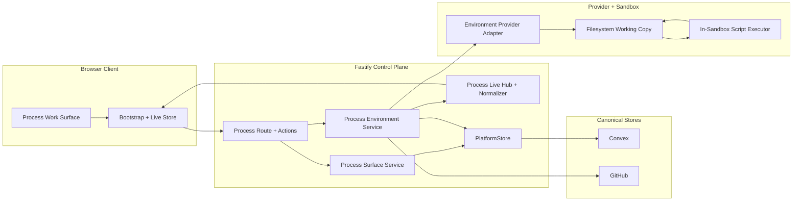
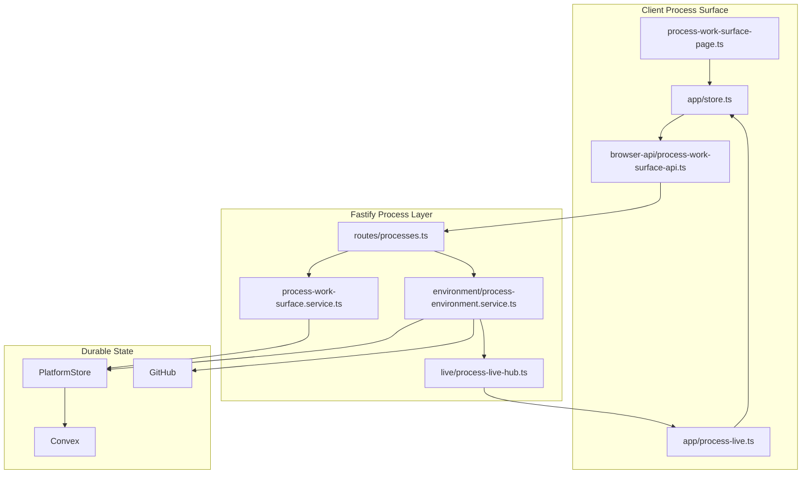

# Technical Design: Process Environment and Controlled Execution

## Purpose

This document translates Epic 3 into implementable architecture for the first
usable environment and controlled-execution slice of Liminal Build. It is the
index document for a four-file tech design set:

| Document | Role |
|----------|------|
| `tech-design.md` | Decision record, validation, inherited architecture, system view, module architecture overview, work breakdown |
| `tech-design-client.md` | Process-surface contract extension, browser state, live reconciliation, UI composition, and control rendering |
| `tech-design-server.md` | Fastify routes, process/environment orchestration, provider adapters, durable-state model, hydration, checkpointing, and live publication |
| `test-plan.md` | TC-to-test mapping, mock boundaries, fixtures, chunk test counts, and verification plan |

The downstream consumers are:

| Audience | What they need from this design |
|----------|---------------------------------|
| Reviewers | Clear architectural decisions, visible risks, and explicit dependency-research gates before implementation starts |
| Story authors | Stable chunk boundaries, relevant section references, and clear technical targets for story enrichment |
| Implementers | Exact file paths, interface targets, state-model decisions, mock boundaries, and verification gates |

## Spec Validation

Epic 3 is designable after the recent contract and coverage fixes. The spec now
anchors checkpoint visibility in the primary process-surface contract, makes the
accepted-action versus later-failure boundary explicit, clarifies that discard
and teardown are system-driven rather than user-driven in this slice, and
strengthens the environment-state/control coverage enough to support technical
design without inventing product behavior.

The remaining work is implementation design, not product repair. The main
technical burden is now architectural: how to extend the current process
work-surface seams with environment orchestration, how to keep environment state
distinct from process lifecycle state, and how to make checkpointing real
without collapsing Feature 3 into the broader source-management scope that
belongs to Feature 5.

One contract clarification matters to the implementation shape. Earlier Epic 3
contract language listed `PROCESS_SOURCE_WRITE_NOT_ALLOWED`, but the current
browser-facing actions
do not submit a direct checkpoint target. This design resolves that by treating
source writability as a server-side checkpoint-planning guard, not as a new
browser-triggered action family. The browser still sees the outcome through the
existing process action and checkpoint result surfaces.

### Issues Found

| Issue | Spec Location | Resolution | Status |
|-------|---------------|------------|--------|
| Checkpoint results were required behavior but were not attached to the primary process-surface contract | AC-4.4, AC-6.1, Data Contracts | Epic now anchors checkpoint visibility in `environment.lastCheckpointResult` and reopen behavior restores the latest visible settled result | Resolved |
| The spec did not distinguish immediate HTTP rejection from accepted action followed by later live failure | Action responses, Error Responses | Epic now defines a clear acceptance boundary: preflight failures reject immediately, later lifecycle failures surface through environment/checkpoint state | Resolved |
| Environment discard was implied by the mental model but not scoped as a user-visible control | User Profile, Scope | Epic now states that discard and teardown are system-driven in this slice and user-initiated discard is out of scope | Resolved |
| The environment-state vocabulary was larger than its explicit coverage | AC-1.1, AC-5.1 | Epic now includes an environment-state/control matrix and blocked `rehydrate` coverage | Resolved |
| `PROCESS_SOURCE_WRITE_NOT_ALLOWED` still lacks a clean browser request path | Error Responses, Action Acceptance Boundary | This design treats writability as a server-side checkpoint guard. Start/resume/rehydrate/rebuild reject only on action availability, recoverability, missing prerequisites, or environment unavailability. Writability failures surface through checkpoint planning and checkpoint result state rather than as a new browser action shape | Resolved — clarified |

## Context

Epic 3 is the first slice that makes the platform's execution model real. Epic 1
proved that the user can work inside a durable project shell. Epic 2 proved that
one process can have a coherent browser-facing work surface with durable
bootstrap, current materials, pinned unresolved requests, live upserts, and
return-later behavior. Epic 3 is where that visible process surface stops being
only a control-and-observation layer and starts coordinating a disposable
working environment that can hydrate, execute, checkpoint, recover, and reopen
without becoming the source of truth itself.

The architecture already settles the larger technical world. Fastify is the
outer controller. Convex remains the durable state layer behind `PlatformStore`.
The browser still consumes one process-surface bootstrap plus typed WebSocket
upserts. GitHub remains canonical for code. The sandbox filesystem remains a
working copy only. The design therefore cannot create a parallel environment
application or a direct-to-provider browser model. It has to extend the current
process work-surface read/action/live seam so the new environment behavior feels
like a deepening of the existing platform rather than a second product bolted on
beside it.

The current repo shape is a constraint and a strength. The server already has a
real process route, process action services, section readers, a live hub, a live
normalizer, and a `PlatformStore` abstraction. The client already has a process
page, a browser API layer, a central bootstrap/store flow, and typed live
reconciliation. That means the design should prefer extending those seams over
adding parallel route families or bypassing them with special-purpose state
machines. The highest-value path is to introduce an environment orchestration
layer under the existing process route and extend the shared contracts so the
client can stay in the same bootstrap-plus-live mental model it already uses.

The highest-risk design area is state separation. Epic 3 introduces a second
meaningful state machine beside process status: environment readiness and
recoverability. If those are collapsed together, the UI becomes misleading and
the server becomes hard to reason about. If they are separated too aggressively,
the product feels fragmented. The design has to keep process lifecycle,
environment lifecycle, current materials, and checkpoint visibility distinct but
connected so that a user can understand one process in one place.

The second high-risk area is dependency selection. Environment and execution work
is where stale memory-based package choices become expensive and unsafe. This
index intentionally does not finalize any epic-scoped dependency additions from
memory. It establishes the architecture frame first, then reserves fresh
research for the specific places where package or SDK choices would materially
affect security, maintenance, or compatibility.

## Dependency Research Status

This index separates inherited platform decisions from epic-scoped additions that
require fresh research before the companion docs are finalized.

### Inherited Decisions

These are already settled by the technical architecture and current repo:

| Area | Current Choice | Source | Index Position |
|------|----------------|--------|----------------|
| Runtime | Node 24 active LTS line | Platform tech arch + current repo | Inherited |
| Control plane | Fastify 5 monolith | Platform tech arch + current repo | Inherited |
| Client build | Vite 8 | Platform tech arch + current repo | Inherited |
| Durable store | Convex behind `PlatformStore` | Platform tech arch + current repo | Inherited |
| Auth | WorkOS mediated by Fastify | Platform tech arch + current repo | Inherited |
| Live transport | WebSocket + typed upsert objects | Platform tech arch + current repo | Inherited |
| Execution stance | One-shot execution first; hosted Daytona first; LocalProvider fast follow | Platform tech arch + current repo direction | Inherited |

### Existing Dependency Baseline

The current direct dependency set was pressure-tested before deeper provider and
runtime design work continues.

Current direct-dependency findings:

| Package | Current | Latest Seen | Current Assessment |
|---------|---------|-------------|--------------------|
| `fastify` | `5.8.4` | `5.8.5` | Slightly behind latest patch; not inside the currently published GitHub advisory ranges reviewed during this pass |
| `@workos-inc/node` | `8.12.1` | `8.13.0` | Slightly behind latest patch; no direct GitHub advisory records found in this pass |
| `@biomejs/biome` | `2.4.11` | `2.4.12` | Slightly behind latest patch; no security concern surfaced in this pass |
| `vite` | `8.0.8` | `8.0.8` | Current and outside the published GitHub advisory ranges reviewed during this pass |
| `convex` | `1.35.1` | `1.35.1` | Current; no direct GitHub advisory records found in this pass |
| `vitest` | `4.1.4` | `4.1.4` | Current and outside the published GitHub advisory ranges reviewed during this pass |
| `zod` | `4.3.6` | `4.3.6` | Current and outside the published GitHub advisory ranges reviewed during this pass |
| `jsdom` | `29.0.2` | `29.0.2` | Current; no active direct advisory signal surfaced in this pass |
| `@playwright/test` | `1.59.1` | `1.59.1` | Current; no direct GitHub advisory records found in this pass |

Important limitation:

- `pnpm audit` is currently not usable because the npm audit endpoint it relies
  on now returns `410`
- `npm audit` is not a valid substitute in this repo because there is no
  `package-lock.json`
- this pass therefore gives a good direct-dependency pressure test, not a full
  transitive audit

Design consequence:

- patch bumps for `fastify`, `@workos-inc/node`, and `@biomejs/biome` should be
  considered low-risk maintenance work
- a pnpm-compatible transitive-audit workflow should be researched and adopted
  before environment/runtime work grows deeper

### Research Conclusions

The first dependency research pass produced enough signal to narrow the likely
implementation choices for Epic 3.

| Area | Recommendation | Why |
|------|----------------|-----|
| Hosted provider | `@daytonaio/sdk` `0.166.0` | Daytona remains the best first reference provider because its sandbox lifecycle matches the provider abstraction we want to prove without forcing the whole design into a more opinionated platform model |
| Local fast-follow provider | No new dependency by default | After the contract is shaped against hosted Daytona, local should start as a contract-compatible provider using app-owned workspace/process primitives unless research later proves a helper library is needed |
| GitHub code writes | `@octokit/rest` `22.0.1` | Narrower and more focused than the all-batteries `octokit` package while still being the official Node-oriented REST client for the checkpoint/write use case |
| Alternate managed provider | Defer `@cloudflare/sandbox` `0.8.11` | Cloudflare remains valuable as a later compatibility check, but its platform shape is more opinionated and should not be the first provider that defines Epic 3’s contract |

### Considered and Rejected

| Option | Resolution | Why |
|--------|------------|-----|
| Design the provider contract around a homemade local sandbox first | Rejected | High risk of shaping the interface around a toy environment instead of a real managed provider lifecycle |
| Use Cloudflare as the first reference provider | Rejected for Epic 3 | Better as a later abstraction-pressure test than as the first provider shape |
| Use the top-level `octokit` package first | Rejected for now | Broader than the current need; `@octokit/rest` is the tighter fit unless later work needs more GitHub surface area |

### Research Required Before Finalization

No new package or version is committed to the repo in this index draft. The following
epic-scoped additions require fresh research before the companion docs lock in
concrete implementation choices:

| Area | Why Research Is Required | Draft Position |
|------|--------------------------|----------------|
| Hosted Daytona implementation strategy | The package candidate is now identified, but auth flow, sandbox-creation path, and exact server-side adapter composition still need concrete implementation research | Required before finalizing provider interfaces and runtime prerequisites |
| Local provider implementation strategy | Local is a fast-follow provider against the same contract and should be researched after the Daytona reference path is settled | Required before finalizing fast-follow local-provider design |
| In-sandbox execution helper strategy | Execution is security-sensitive and should not rely on stale assumptions about TS execution helpers or bundling/runtime wrappers | Required before naming executor packaging |
| GitHub write implementation details | The client-library candidate is now identified, but auth wiring, retry policy, and rate-limit handling still need implementation research | Required before finalizing checkpoint implementation detail |
| Filesystem hydration/checkpoint helper libraries | Any helper that touches file sync, temp workspace lifecycle, or archive generation is security-sensitive and should be researched explicitly | Required before finalizing provider + checkpoint modules |
| pnpm-compatible transitive audit workflow | Current direct-dependency pressure testing is useful but insufficient for full confidence | Required before environment/runtime dependency work is treated as fully validated |

### Research Gate

The client/server companion docs may define interfaces, seams, and module
boundaries now, but they should leave any new dependency choice explicitly
marked as `research required` until:

1. current ecosystem status is checked
2. compatibility with Node 24 / Fastify 5 / current repo scripts is checked
3. maintenance and advisory posture are checked
4. alternatives considered and rejected are documented

## Tech Design Question Answers

### Q1. What exact provider interface should the platform use for environment creation, hydration, execution, checkpointing, rehydrate, rebuild, and teardown?

Use a provider adapter interface owned by the Fastify process/environment layer.
The outer controller remains in the server process. Provider adapters own only
environment lifecycle and transport into the working environment.

The shared adapter contract should be:

```ts
interface EnvironmentProviderAdapter {
  providerKind: 'daytona' | 'local';
  ensureEnvironment(args: EnsureEnvironmentArgs): Promise<EnsuredEnvironment>;
  hydrateEnvironment(args: HydrateEnvironmentArgs): Promise<HydrationResult>;
  executeScript(args: ExecuteEnvironmentScriptArgs): Promise<ExecutionResult>;
  rehydrateEnvironment(args: RehydrateEnvironmentArgs): Promise<HydrationResult>;
  rebuildEnvironment(args: RebuildEnvironmentArgs): Promise<HydrationResult & EnsuredEnvironment>;
  teardownEnvironment(args: TeardownEnvironmentArgs): Promise<void>;
}
```

The first reference implementation target is `DaytonaProviderAdapter` against a
hosted Daytona environment. `LocalProviderAdapter` is a fast-follow provider
that must satisfy the same contract. The interface is still shaped against the
tech arch's three-provider set so the design does not overfit to Daytona-only
assumptions.

### Q2. What exact browser contract should extend the Epic 2 process surface so the visible control area can remain stable while preserving backward-compatible process action semantics?

Keep the existing Epic 2 process surface as the base contract and extend it
rather than replacing it.

The browser-facing additions are:

- `process.controls`: the full visible control set
- `process.availableActions`: the enabled subset, preserved for backward
  compatibility with the current action model
- `environment`: current environment summary
- `environment.lastCheckpointResult`: latest visible settled checkpoint outcome,
  including project artifact/version details when a checkpoint creates or
  revises an artifact
- new action endpoints for `rehydrate` and `rebuild`
- live `environment` upserts over the existing WebSocket channel

The client continues to treat the process route as one coherent surface. It does
not mount a second environment page or a second live subscription model.

### Q3. What exact durable state model should represent environment state, preparation progress, recovery state, and last checkpoint result without confusing current process status with current environment status?

Introduce a new generic platform-owned durable table:

- `processEnvironmentStates`

This table is keyed by `processId` and stores:

- current `environmentId` when one exists
- `providerKind`
- `state`
- `blockedReason`
- `lastHydratedAt`
- `lastCheckpointAt`
- `lastCheckpointResult`, including project artifact target/version identifiers
  and version-level producing-process provenance when artifact persistence
  settles (`versionProvenanceProcessId` in Epic 3's process-surface contract;
  the same underlying identity Epic 5 names `producedByProcessId` on artifact
  versions)
- a durable working-set fingerprint used to decide `stale` versus `ready`

`processes` remains the source of truth for process lifecycle (`draft`,
`running`, `waiting`, `failed`, and so on). `processEnvironmentStates` becomes
the source of truth for environment lifecycle (`preparing`, `rehydrating`,
`ready`, `checkpointing`, `stale`, `lost`, and so on). The process-surface
projection combines both without collapsing them into one status field.

### Q4. What exact persistence unit should represent canonical code updates for already-attached writable sources in this epic?

GitHub remains canonical for code. Convex stores only the process-facing record
of what checkpoint attempt happened and what canonical target it settled
against.

The first cut should use:

- canonical code truth in GitHub
- latest visible checkpoint result projected into `processEnvironmentStates`
- visible checkpoint moments emitted into `processHistoryItems` as settled
  process-facing events

This slice does not require a browser-facing ordered checkpoint history table.
If implementation pressure later shows a need for an append-only structured
checkpoint record separate from visible history, that can be added as a
design-time deviation in the companion docs.

### Q5. What exact security and credential model should the server use when a process hydrates attached sources and persists durable code work back to canonical code truth?

Keep all trusted credentials outside the browser and outside the in-sandbox
executor.

The security model is:

- browser calls Fastify with session cookie only
- Fastify validates auth and project/process access
- Fastify resolves source attachment access mode before hydration or checkpoint
- provider adapters receive only the minimum data needed to materialize or
  inspect the environment
- the in-sandbox executor receives filesystem access and a process-scoped tool
  API, not direct GitHub or Convex credentials
- canonical artifact and code writes are performed by the outer controller after
  execution results are collected and validated

This keeps the server authoritative for source policy, canonical writes, and
checkpoint guardrails.

### Q6. What exact freshness and invalidation policy should decide when a working copy is `stale`, when `rehydrate` is sufficient, and when `rebuild` is required?

Drive freshness from a durable working-set fingerprint rather than from ad hoc
UI guesses.

The fingerprint should include:

- current artifact ids and current version ids or labels from the process's
  referenced project-level materials
- current output ids and current revision labels
- current source attachment ids
- source `targetRef`
- source `hydrationState`
- provider kind

The comparison should be deterministic:

- build a stable JSON object with keys in fixed order
- sort each input collection by id before serialization
- serialize to UTF-8 JSON
- store the sha-256 hex digest as `workingSetFingerprint`

Use these rules:

- `ready`: environment exists and the fingerprint matches current canonical inputs
- `stale`: environment exists, is still recoverable, but current canonical inputs
  no longer match
- `rehydrate`: valid when the environment still exists and only the working set
  needs refresh
- `rebuild`: required when the environment is gone, unrecoverable, provider
  identity changed, or the working copy can no longer be trusted as a base for a
  refresh

### Q7. What exact persistence grain should capture environment events and checkpoint outcomes before the full canonical archive and derived-view work lands in the follow-on Feature 5 epic?

Use the existing visible-history layer plus the new environment-state layer. Do
not invent the full archive early.

Before Feature 5:

- settled user-facing environment and checkpoint moments are written into
  `processHistoryItems`
- current environment summary and latest checkpoint result are written into
  `processEnvironmentStates`
- operational detail beyond that stays in structured server logs, not in a new
  user-facing archive surface

This gives reopen, degraded-mode, and checkpoint visibility enough durable truth
without pre-solving the full archive taxonomy.

### Q8. What exact failure and retry model should the surface use when durable process state loads successfully but environment lifecycle or checkpoint work is unavailable?

Keep the durable process surface open and degrade the environment slice.

Rules:

- `GET /api/projects/:projectId/processes/:processId` still returns `200` when
  process access succeeds, even if environment lifecycle work is unavailable
- `environment.state` becomes `unavailable`, `failed`, `stale`, or `lost`
  depending on the condition
- immediate action requests fail only when preflight rejection is already known
- accepted actions later settle through `environment` upserts and checkpoint
  result state
- live transport loss keeps the last durable/current surface visible and follows
  the existing bootstrap-first reconnect model
- recovery is user-driven through `rehydrate`, `rebuild`, `restart`, or reload;
  no silent background environment retries are assumed in the first cut

## System View

### Top-Tier Surfaces Touched by Epic 3

| Surface | Source | This Epic's Role |
|---------|--------|------------------|
| Processes | Inherited from platform tech arch + current process route | Primary route, action, and live-orchestration surface that owns user entry into environment work |
| Environments | Inherited from platform tech arch, not yet implemented in repo | New platform-owned lifecycle domain introduced under the existing process work-surface seam |
| Tool Runtime | Inherited from platform tech arch, not yet implemented in repo | One-shot in-sandbox execution target reached through the environment adapter, not directly from the browser |
| Artifacts | Inherited from platform tech arch + current materials surface | Project-level artifact versions are hydration inputs and artifact checkpoint targets |
| Sources | Inherited from platform tech arch + current source summaries | Hydration input, writability guard, and canonical code checkpoint target |
| Shared contracts and live state | Inherited from current technical baseline | Contract extension point for environment summary, controls, and environment live upserts |

### System Context Diagram



### Browser-Facing Entry Points

| Surface | Path | Role |
|---------|------|------|
| Process route HTML | `/projects/{projectId}/processes/{processId}` | Authenticated shell entry for one active process |
| Process bootstrap API | `/api/projects/{projectId}/processes/{processId}` | Durable bootstrap for process, materials, side work, current request, and environment |
| Process start action | `/api/projects/{projectId}/processes/{processId}/start` | Start draft process and enter environment preparation when needed |
| Process resume action | `/api/projects/{projectId}/processes/{processId}/resume` | Resume eligible process and enter environment preparation when needed |
| Environment rehydrate action | `/api/projects/{projectId}/processes/{processId}/rehydrate` | Refresh a recoverable environment from current canonical inputs |
| Environment rebuild action | `/api/projects/{projectId}/processes/{processId}/rebuild` | Reconstruct an unusable or lost environment from canonical inputs |
| Live updates | `/ws/projects/{projectId}/processes/{processId}` | Typed current-object updates for process, history, materials, side work, current request, and environment |

### Canonical Boundaries

| Boundary | Design Consequence |
|----------|--------------------|
| Browser -> Fastify only | Browser never talks directly to Convex, GitHub, or providers |
| Fastify -> Convex through `PlatformStore` | Durable environment state and latest checkpoint visibility are server-owned |
| Fastify -> GitHub for canonical code writes | Code checkpointing never makes the sandbox filesystem canonical |
| Provider adapter -> sandbox only | Provider-specific lifecycle stays behind one server-owned abstraction |
| Executor -> filesystem and tool API only | Scripted work stays controlled and does not receive raw canonical-store credentials |

### Runtime Prerequisites

| Prerequisite | Where Needed | Status |
|--------------|--------------|--------|
| Node 24.x and `pnpm@10.33.0` | Local + CI | Inherited and already required by repo |
| Convex deployment and app env vars | Local + CI | Inherited and already required by repo |
| WorkOS credentials and callback/origin config | Local + CI | Inherited and already required by repo |
| Hosted Daytona workspace, credentials, and SDK/API configuration | Local dev + shared environments used for provider validation | Research required before finalization |
| Local provider execution prerequisites | Local dev fast follow | Research required before finalization |

## Module Boundaries

### Top-Tier Surfaces

| Surface | Source | This Epic's Module Role |
|---------|--------|-------------------------|
| Process work-surface read/action/live path | Inherited from current technical baseline | Extend the current route/service/live seam with environment state and recovery actions |
| Environments domain | Inherited from tech arch | Add new orchestration, planning, provider, and checkpoint modules under the server process layer |
| Tool Runtime domain | Inherited from tech arch | Add an execution boundary under server-owned environment orchestration, not as a browser-owned module |
| Platform store and durable state boundary | Inherited from current technical baseline | Extend `PlatformStore` and Convex state so environment summary and checkpoint visibility remain durable |
| Shared contract and state root | Inherited from current technical baseline | Extend process-surface, live-update, and client store contracts rather than creating a second contract tree |

### Module Architecture Overview

```text
apps/platform/server/routes/processes.ts                                   # MODIFIED
apps/platform/server/services/processes/process-work-surface.service.ts     # MODIFIED
apps/platform/server/services/processes/process-start.service.ts            # MODIFIED
apps/platform/server/services/processes/process-resume.service.ts           # MODIFIED
apps/platform/server/services/processes/live/process-live-normalizer.ts     # MODIFIED
apps/platform/server/services/processes/live/process-live-hub.ts            # MODIFIED
apps/platform/server/services/processes/readers/environment-section.reader.ts # NEW
apps/platform/server/services/processes/environment/process-environment.service.ts # NEW
apps/platform/server/services/processes/environment/environment-orchestrator.ts     # NEW
apps/platform/server/services/processes/environment/provider-adapter.ts            # NEW
apps/platform/server/services/processes/environment/provider-adapter-registry.ts   # NEW
apps/platform/server/services/processes/environment/local-provider-adapter.ts      # NEW
apps/platform/server/services/processes/environment/hydration-planner.ts           # NEW
apps/platform/server/services/processes/environment/checkpoint-planner.ts          # NEW
apps/platform/server/services/processes/environment/script-execution.service.ts    # NEW

apps/platform/client/browser-api/process-work-surface-api.ts               # MODIFIED
apps/platform/client/app/bootstrap.ts                                      # MODIFIED
apps/platform/client/app/process-live.ts                                   # MODIFIED
apps/platform/client/app/store.ts                                          # MODIFIED
apps/platform/client/features/processes/process-work-surface-page.ts        # MODIFIED
apps/platform/client/features/processes/process-environment-panel.ts        # NEW
apps/platform/client/features/processes/process-controls.ts                 # NEW

apps/platform/shared/contracts/process-work-surface.ts                     # MODIFIED
apps/platform/shared/contracts/live-process-updates.ts                     # MODIFIED
apps/platform/shared/contracts/state.ts                                    # MODIFIED

apps/platform/server/services/projects/platform-store.ts                   # MODIFIED
convex/schema.ts                                                           # MODIFIED
convex/processes.ts                                                        # MODIFIED
convex/sourceAttachments.ts                                                # MODIFIED
convex/processEnvironmentStates.ts                                         # NEW
```

### Module Responsibility Matrix

| Module | Status | Responsibility | Dependencies | ACs Covered |
|--------|--------|----------------|--------------|-------------|
| `apps/platform/server/routes/processes.ts` | MODIFIED | Extend process bootstrap and actions with environment summary, `rehydrate`, and `rebuild` routes | process services, auth, request/response contracts | AC-1, AC-2, AC-5, AC-6 |
| `process-work-surface.service.ts` | MODIFIED | Assemble process bootstrap including `environment` and latest checkpoint visibility | process access, section readers, `PlatformStore` | AC-1, AC-6 |
| `readers/environment-section.reader.ts` | NEW | Read durable environment summary and latest checkpoint result without coupling it to history/materials readers | `PlatformStore` | AC-1, AC-4, AC-6 |
| `environment/process-environment.service.ts` | NEW | Server-owned orchestration facade for prepare, execute, checkpoint, rehydrate, rebuild, and teardown | orchestrator, provider registry, planners, `PlatformStore`, live hub | AC-2, AC-3, AC-4, AC-5 |
| `environment/environment-orchestrator.ts` | NEW | Coordinate lifecycle sequencing and acceptance-boundary behavior for start/resume/rehydrate/rebuild | provider adapter, planners, live publisher | AC-2, AC-5, AC-6 |
| `environment/provider-adapter*.ts` | NEW | Abstract hosted Daytona first and local fast-follow provider implementations behind one lifecycle contract | Daytona SDK/API, local runtime strategy | AC-2, AC-3, AC-5 |
| `environment/hydration-planner.ts` | NEW | Build working-set hydration plans from current artifact references and versions, outputs, and attached sources | `PlatformStore`, current material refs | AC-2, AC-5 |
| `environment/checkpoint-planner.ts` | NEW | Decide artifact/code checkpoint targets, append-version behavior for existing artifacts, writability, and latest visible result projection | `PlatformStore`, source summaries, GitHub boundary | AC-4, AC-6 |
| `environment/script-execution.service.ts` | NEW | Send one-shot script payloads into the sandbox executor and normalize results for the outer controller | provider adapter, executor boundary | AC-3, AC-4 |
| `apps/platform/client/browser-api/process-work-surface-api.ts` | MODIFIED | Add `rehydrate` and `rebuild` browser API calls and extend bootstrap parsing | shared contracts, `fetch` | AC-1, AC-2, AC-5, AC-6 |
| `apps/platform/client/app/store.ts` | MODIFIED | Extend process-surface state with environment summary, controls, and latest checkpoint visibility | shared state contracts | AC-1, AC-4, AC-6 |
| `apps/platform/client/app/process-live.ts` | MODIFIED | Reconcile `environment` live upserts into current-object state | live contracts, store | AC-2, AC-3, AC-4, AC-6 |
| `process-work-surface-page.ts` + new process environment components | MODIFIED / NEW | Render environment state, stable controls, checkpoint visibility, and degraded-mode UI in the existing work surface | store, browser API, child components | AC-1 through AC-6 |
| `apps/platform/shared/contracts/process-work-surface.ts` | MODIFIED | Extend bootstrap/action contracts with `environment`, controls, access mode, and checkpoint result shapes | Zod root contracts | AC-1 through AC-6 |
| `apps/platform/shared/contracts/live-process-updates.ts` | MODIFIED | Add `environment` live entity and latest-checkpoint transport rules | process-surface contracts | AC-2, AC-3, AC-4, AC-6 |
| `apps/platform/server/services/projects/platform-store.ts` | MODIFIED | Add server-facing durable reads/writes for environment state, latest checkpoint result, and recovery state | Convex function refs | AC-1, AC-4, AC-5, AC-6 |
| `convex/processEnvironmentStates.ts` | NEW | Persist durable environment summary and latest checkpoint result separate from process lifecycle | Convex schema + indexes | AC-1, AC-4, AC-5, AC-6 |
| `convex/processes.ts` | MODIFIED | Keep process lifecycle transitions distinct while coordinating with environment planning and current material refs | `processEnvironmentStates`, process-specific state | AC-2, AC-3, AC-5 |
| `convex/sourceAttachments.ts` | MODIFIED | Extend source summaries with access mode so writability is durable and explicit | schema, process materials projection | AC-2, AC-4 |

### Component Interaction Diagram



## Verification Scripts

Epic 3 inherits the repo's existing verification tiers. The design should reuse
them rather than inventing new story-level commands:

| Script | Purpose | Current Command |
|--------|---------|-----------------|
| `red-verify` | TDD Red exit gate | `corepack pnpm run red-verify` |
| `verify` | Standard development verification | `corepack pnpm run verify` |
| `green-verify` | TDD Green exit gate | `corepack pnpm run green-verify` |
| `verify-all` | Deep verification before story completion or release | `corepack pnpm run verify-all` |

The companion docs and test plan should map Epic 3 work onto the existing
service, client, integration, and Convex lanes instead of proposing a new
verification regime.

## Work Breakdown Summary

The chunk structure should stay aligned with the epic's story seams so the BA
can shard stories cleanly from this design.

| Chunk | Scope | ACs | Primary Surfaces |
|-------|-------|-----|------------------|
| Chunk 0 | Contract, durable-state, fixtures, and environment vocabulary foundation | Supports all ACs | Shared contracts, `PlatformStore`, Convex, test fixtures |
| Chunk 1 | Environment summary and stable visible controls on first load | AC-1.1 to AC-1.5 | Process route, process bootstrap, client page/store |
| Chunk 2 | Start/resume preparation and hydration planning | AC-2.1 to AC-2.5 | Process actions, environment service, materials projection |
| Chunk 3 | Controlled execution and live environment state | AC-3.1 to AC-3.4 | Provider adapter, script execution, live hub/client reconciliation |
| Chunk 4 | Durable checkpointing for artifacts and writable sources | AC-4.1 to AC-4.5 | Checkpoint planner, GitHub boundary, latest result projection |
| Chunk 5 | Rehydrate, rebuild, and recovery semantics | AC-5.1 to AC-5.5 | Environment service, provider adapter, recovery UI |
| Chunk 6 | Return-later and degraded operation | AC-6.1 to AC-6.4 | Durable bootstrap, live failure handling, integration recovery tests |

### Chunk Dependencies

```text
Chunk 0 -> Chunk 1 -> Chunk 2 -> Chunk 3 -> Chunk 4 -> Chunk 5 -> Chunk 6
```

This stays mostly linear because each later capability depends on the earlier
ones being real:

- no live execution before a real preparation/hydration path exists
- no checkpointing before execution exists
- no recovery semantics before checkpoint and environment state exist
- no reopen/degraded guarantees before environment summary and latest checkpoint
  visibility are durable

Implementation gating:

- Chunk 0 and most of Chunk 1 can proceed from the current design set
- Chunks 2 through 5 depend on closing the remaining research gates for hosted
  Daytona wiring, local fast-follow shape, execution helper choice, and GitHub
  write implementation details
- Chunk 6 depends on those earlier implementation gates because reopen and
  degraded-mode semantics rely on durable environment and checkpoint behavior
  already existing

Provider implementation sequencing inside those chunks should be:

- hosted Daytona first as the reference provider path for environment lifecycle
  and execution
- local provider second as a contract-compatible fast follow
- Cloudflare and other providers deferred until the Daytona-shaped contract is
  stable enough to evaluate against another managed environment

## Resolved Design Notes

No blocking open questions remain at this design altitude.

That does not mean all implementation work is unblocked. The dependency research
gates above still need to close before the core provider/runtime/checkpoint
chunks move from design into full implementation.

The low-level questions that surfaced during drafting are now resolved in the
design:

- latest checkpoint visibility stays latest-only in Epic 3
- writable sources write back to the same attached target ref
- `accessMode` should be handled as a schema/projection backfill in touched code
  and fixtures rather than as a separate product decision

## Implementation Follow-Ups

- Apply low-risk patch bumps for `fastify`, `@workos-inc/node`, and
  `@biomejs/biome`
- Adopt a pnpm-compatible transitive-audit workflow before environment/runtime
  dependency work is treated as fully validated

## Deferred Items

| Item | Related AC | Reason Deferred | Future Work |
|------|-----------|-----------------|-------------|
| Cloudflare and other managed-provider implementations beyond Daytona | AC-2, AC-3, AC-5 | Daytona is the first reference provider for Epic 3; additional managed providers should be evaluated after the contract stabilizes | Follow-on environment/provider work after Epic 3 |
| User-initiated environment discard or teardown control | Scope, AC-5 | Explicitly out of scope for this slice | Later environment-management UX |
| Full GitHub workflow surfaces (branching, review, PR management) | AC-4 | Belongs to broader source-management and review work, not this environment slice | Feature 5 / later process-specific epics |
| Ordered checkpoint-results browser surface | AC-4.4, AC-6.1 | Epic defines latest-result visibility only | Later review/history expansion if needed |
| Full canonical archive entry taxonomy for environment/runtime events | AC-6, tech arch | Belongs to the archive follow-on slice | Feature 5 |

## Related Documentation

- Epic: `docs/spec-build/v2/epics/03--process-environment-and-controlled-execution/epic.md`
- Platform tech arch: `docs/spec-build/v2/core-platform-arch.md`
- Current-state baseline:
  - `docs/onboarding/current-state-index.md`
  - `docs/onboarding/current-state-process-work-surface.md`
  - `docs/onboarding/current-state-tech-design.md`
  - `docs/onboarding/current-state-code-map.md`
