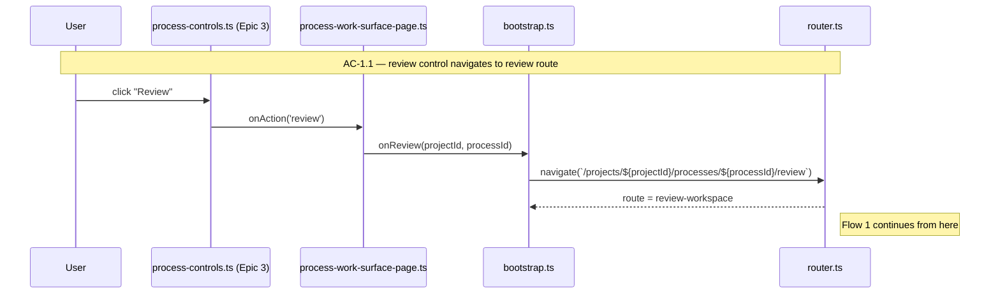
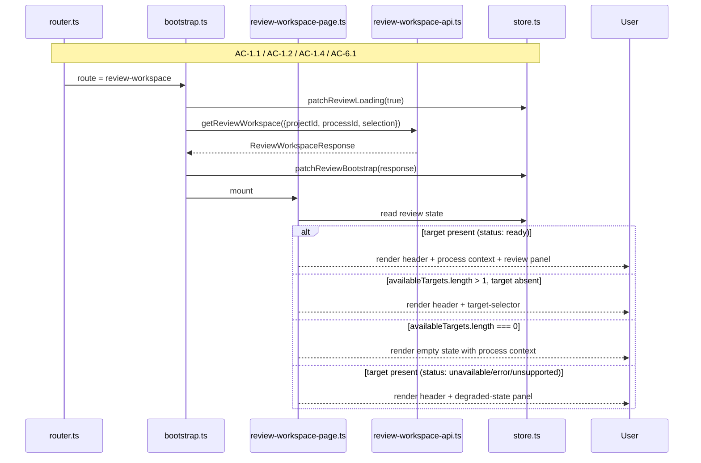
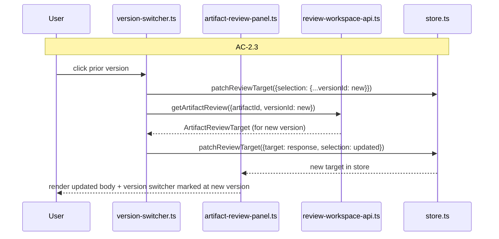
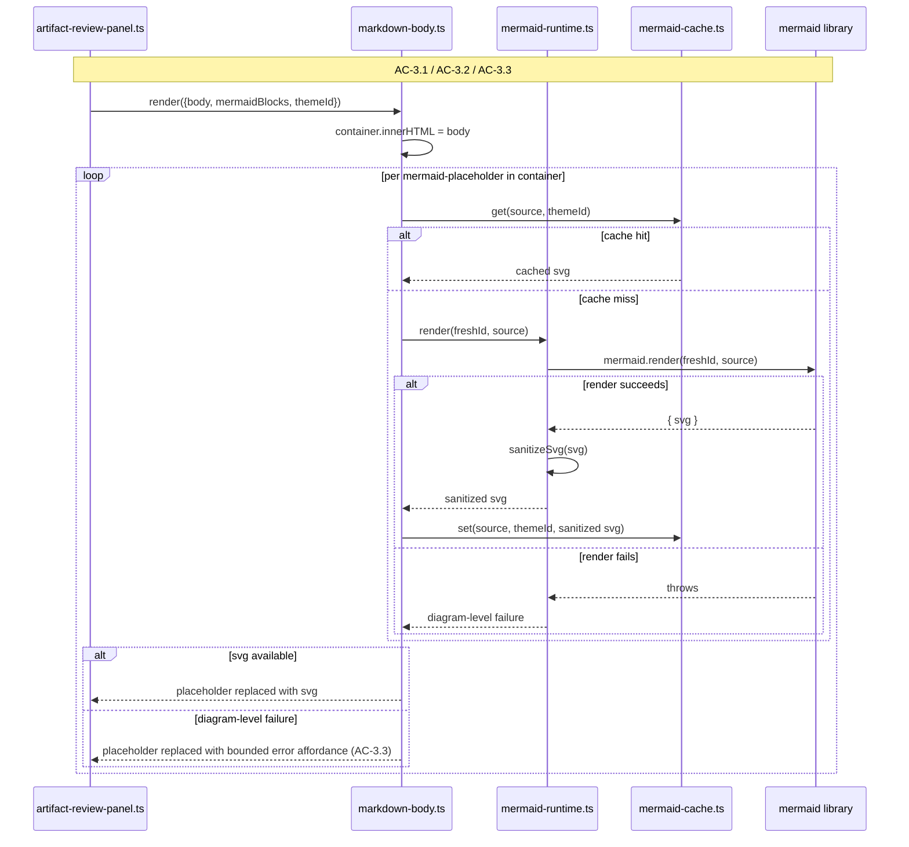
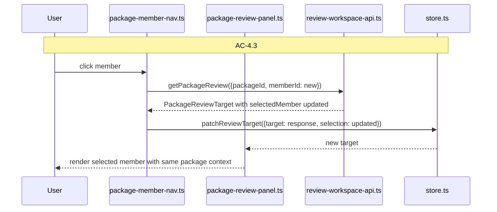
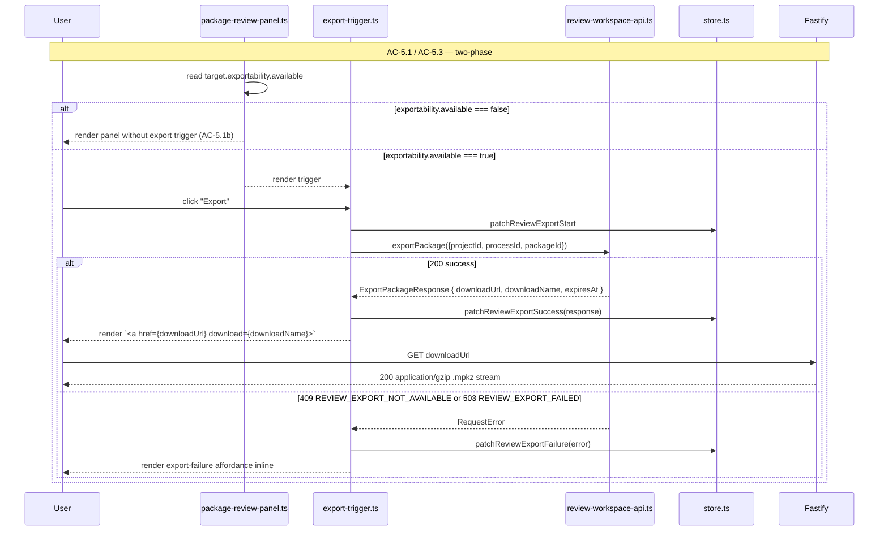

# Technical Design: Artifact Review and Package Surface — Client

This companion document covers the browser-side implementation for Epic 4. The client remains the same Vite-built vanilla TypeScript shell mounted inside the Fastify-owned application boundary. Epic 4 does not introduce a second client app, a live-update transport for review, or any framework change. It extends the route model with a new review route, adds a fresh feature subtree for the review workspace, and introduces a client-side Mermaid render layer that hydrates server-emitted placeholders with cached SVGs.

The client work is intentionally lighter than the process surface work. Review has no websocket subscription, no same-session action reconciliation, no live envelope. A durable bootstrap returns the workspace; reload replays the bootstrap; one HTTP request per navigation. What the client gains instead is surface richness — markdown rendering container, Mermaid hydration, version switching, package member navigation, and the single-action export trigger — but all of that sits on straightforward fetch-and-render plumbing.

## HTML Shell and Route Model

The browser still receives one shell document for all authenticated routes. The existing shell handles project index, project shell, and process work surface; Epic 4 adds review as a fourth top-level route. Users orient through the same shell header, same auth, same bootstrap payload shape; the review route just routes to a different feature tree underneath.

### Supported Routes

| Route | Meaning |
|-------|---------|
| `/projects` | Project index |
| `/projects/:projectId` | Project shell |
| `/projects/:projectId/processes/:processId` | Dedicated process work surface |
| `/projects/:projectId/processes/:processId/review` | **New: review workspace** |

The review URL always carries the process context. Query state (`?targetKind=artifact&targetId=...&versionId=...` or `?targetKind=package&targetId=...&memberId=...`) selects what is reviewed. Direct reopen from a bookmark deserializes the query state and loads the same target.

### Router File Changes

`apps/platform/client/app/router.ts` gains one new route kind: `review-workspace`. The matcher pattern is `/projects/:projectId/processes/:processId/review`, and query state is parsed into a `ReviewWorkspaceSelection` structure that the page reads without re-parsing the URL. Route parsing stays one level deep per route family — review is its own top-level route, not a nested sub-route of the process surface — to preserve bookmarkability, the browser back/forward model, and consistent behavior on reload.

## Client Bootstrap

`apps/platform/client/app/bootstrap.ts` follows the same high-level sequence:

1. load `/auth/me`
2. resolve current route (adds `review-workspace` to the route-kind enum)
3. fetch durable bootstrap for the active route
4. mount the correct page
5. no live subscription for review (this is where review diverges from the process surface)

The review route bootstrap is a single HTTP call: `GET /api/projects/:projectId/processes/:processId/review` with query string forwarded verbatim. The response is the complete workspace state — project context, process context, available targets, and optional selected target with its rendered body and Mermaid sidecar. The client renders from that response with no second fetch, no subscription, no deferred panel loads. Reload or return-later replays the same bootstrap and the durable workspace state is what gets rendered again.

One consequence: the review page's first-paint is entirely driven by the server response. There is no skeleton-then-hydrate split, no progressive loading of sections. The page either renders from the bootstrap response (200) or renders a route-level unavailable state (401/403/404). This is simpler than the process surface's bootstrap-plus-live pattern and is exactly matched to Epic 4's "review remains usable from durable state even when no active environment exists" posture.

## Client State

Epic 2 already introduced the pattern of a route-scoped state slice separate from the project shell. Epic 4 adds a `reviewWorkspace` slice at the same altitude as `processSurface`. The slice holds the complete bootstrap response plus loading and error flags; no derived or intermediate state is kept there.

```ts
export interface ReviewWorkspaceState {
  projectId: string | null;
  processId: string | null;
  selection: ReviewWorkspaceSelection | null;

  project: ReviewWorkspaceProjectContext | null;
  process: ProcessReviewContext | null;
  availableTargets: ReviewTargetSummary[];
  target: ReviewTarget | null;

  isLoading: boolean;
  error: RequestError | null;
  exportState: {
    isExporting: boolean;
    lastExport: ExportPackageResponse | null;
    error: RequestError | null;
  };
}

export interface ReviewWorkspaceSelection {
  targetKind?: 'artifact' | 'package';
  targetId?: string;
  versionId?: string;
  memberId?: string;
}
```

The `selection` field is the client-side mirror of the query-state that drove the current bootstrap. It lets the page render the currently-chosen version/member before any switch has been navigated, and it lets the version switcher compute "is this the current selection" without re-parsing the URL.

The `exportState` slice is local to the review workspace because export is a review-workspace action. `isExporting` drives the export-button loading state; `lastExport` holds the successful response (so the UI can present a download link); `error` carries any immediate export rejection (409 `REVIEW_EXPORT_NOT_AVAILABLE` or 503 `REVIEW_EXPORT_FAILED`). `lastExport` does not persist across page reloads; it is session-local state.

### Store Responsibilities

`createAppStore()` remains synchronous and framework-free. Epic 4 adds new patch actions for the review slice:

- `patchReviewBootstrap` — replaces `project`, `process`, `availableTargets`, `target`, clears `isLoading` and `error`
- `patchReviewLoading` — sets `isLoading: true`
- `patchReviewError` — records a bootstrap error
- `patchReviewTarget` — used when a version or member switch response returns a new target (keeps bootstrap context intact, replaces only the target and selection)
- `patchReviewExport*` — export-state patches (start, success, failure, reset)

Review has no live-message application; `apps/platform/client/app/process-live.ts` is not touched.

## Browser API Layer

One new module: `apps/platform/client/browser-api/review-workspace-api.ts`. It is the mock boundary for all review HTTP calls.

```ts
export async function getReviewWorkspace(args: {
  projectId: string;
  processId: string;
  selection: ReviewWorkspaceSelection;
}): Promise<ReviewWorkspaceResponse>;

export async function getArtifactReview(args: {
  projectId: string;
  processId: string;
  artifactId: string;
  versionId?: string;
}): Promise<ArtifactReviewTarget>;

export async function getPackageReview(args: {
  projectId: string;
  processId: string;
  packageId: string;
  memberId?: string;
}): Promise<PackageReviewTarget>;

export async function exportPackage(args: {
  projectId: string;
  processId: string;
  packageId: string;
}): Promise<ExportPackageResponse>;
```

The `getReviewWorkspace` call drives the initial bootstrap. `getArtifactReview` and `getPackageReview` are the targeted in-page switches (version switching within an artifact, member switching within a package) — they return just the target-level payload without re-fetching the entire workspace envelope. `exportPackage` is a POST that returns the export response metadata (phase 1 of the two-phase export flow); the user's browser then GETs `response.downloadUrl` to stream the `.mpkz` bytes (phase 2). The `getReviewWorkspace` call is not invoked from `exportPackage` — phase 2 is a direct anchor navigation to the signed download URL.

### Error Mapping

The fallback error parser is extended so the browser can distinguish Epic 4 error codes:

- `REVIEW_TARGET_NOT_FOUND` (404) — the requested target-specific endpoint or
  export-download URL cannot be resolved. On review-workspace bootstrap, the
  same code may also arrive inside a `200` response as `target.error.code`
  when project/process context resolves but the selected target is now
  unavailable
- `REVIEW_EXPORT_NOT_AVAILABLE` (409) — the target is not currently exportable
- `REVIEW_EXPORT_FAILED` (503) — export preparation failed

These are request-level errors that map to the `error` field on the review workspace state or the `exportState.error` field on export. Bounded degraded states inside the review envelope (`target.status === 'error'`, `bodyStatus: 'error'`, `members[].status === 'unavailable'`) are not errors — they are part of the 200 response and render as inline degraded affordances, not as request failures.

## Feature File Layout

```text
apps/platform/client/features/
├── processes/
│   └── process-work-surface-page.ts # MODIFIED — wire review control's onAction to navigate to review route
└── review/                          # NEW subtree
    ├── review-workspace-page.ts     # NEW — route-level page composition
    ├── artifact-review-panel.ts     # NEW — one-artifact review with version switcher
    ├── package-review-panel.ts      # NEW — one-package review with member nav
    ├── markdown-body.ts             # NEW — mounts server HTML, hydrates Mermaid placeholders
    ├── mermaid-cache.ts             # NEW — lifted from mdv/src/client/components/mermaid-cache.ts
    ├── mermaid-runtime.ts           # NEW — mermaid.initialize() + mermaid.render() wrapper with sanitization
    ├── target-selector.ts           # NEW — multi-target selection state UI
    ├── version-switcher.ts          # NEW — artifact version list (pure render)
    ├── package-member-nav.ts        # NEW — package member list (pure render)
    ├── export-trigger.ts            # NEW — export button + in-flight state + download link
    ├── degraded-state.ts            # NEW — shared degradation affordance rendering
    └── unsupported-fallback.ts      # NEW — unsupported-format target rendering
```

All new review UI lives under `features/review/`. The one modification outside that subtree is `process-work-surface-page.ts`, which is extended to route the `review` control's click into the review route.

### Module Responsibility Matrix

| Module | Status | Responsibility | Dependencies | ACs Covered |
|--------|--------|----------------|--------------|-------------|
| `app/router.ts` | MODIFIED | Parse `/projects/:projectId/processes/:processId/review` into a `review-workspace` route kind with selection query state | — | AC-1 |
| `app/bootstrap.ts` | MODIFIED | Dispatch review-route bootstrap; populate store; mount review page; **expose `onReview` navigator** (`(projectId, processId) => navigate(/.../review)`) passed to the process work surface page | store, browser api | AC-1, AC-6 |
| `app/shell-app.ts` | MODIFIED | Add review-workspace to the page-selection hub | store | AC-1 |
| `app/store.ts` | MODIFIED | Hold `ReviewWorkspaceState`; patch actions for bootstrap, target, export, error | shared contracts | AC-1 through AC-6 |
| `browser-api/review-workspace-api.ts` | NEW | HTTP client for review bootstrap, artifact, package, export; extended error mapping | fetch, shared contracts | AC-1 through AC-6 |
| `features/processes/process-work-surface-page.ts` | **MODIFIED** | Wire the `review` control's `onAction` dispatcher: when the user clicks the `review` control (already rendered from Epic 3's `controls` array with `enabled: true` when reviewability exists), invoke the page-provided `onReview` callback which navigates to the review route | store, callback from bootstrap | AC-1.1 |
| `review-workspace-page.ts` | NEW | Route-driven composition: header, process context, target selector or review panel, back-to-process control | store, browser api, child panels | AC-1, AC-6 |
| `artifact-review-panel.ts` | NEW | Render one `ArtifactReviewTarget`: identity, version switcher, body area, unsupported fallback | markdown-body, version-switcher | AC-2, AC-3 |
| `package-review-panel.ts` | NEW | Render one `PackageReviewTarget`: package identity, member nav, selected member review, export trigger gated on `exportability.available` when the snapshot retains at least one durable member and no member is unavailable | artifact-review-panel (for selected member's artifact), package-member-nav, export-trigger | AC-4, AC-5 |
| `markdown-body.ts` | NEW | Mount server-rendered HTML via `innerHTML`; locate `.mermaid-placeholder` nodes and replace with rendered SVG | mermaid-runtime, mermaid-cache | AC-3 |
| `mermaid-runtime.ts` | NEW | Initialize Mermaid once per session; wrap `mermaid.render()` with fresh-id generation, error boundary, and client-side SVG sanitization via `dompurify` directly (not `isomorphic-dompurify`, which pulls jsdom into the client bundle) | mermaid, dompurify | AC-3 |
| `mermaid-cache.ts` | NEW (lifted) | LRU cache keyed on `fnv1a(source):themeId` | — | AC-3 |
| `target-selector.ts` | NEW | Render available targets list when no target is selected and more than one exists | store | AC-1 |
| `version-switcher.ts` | NEW | Pure rendering component for the version list; **does not perform the fetch itself**. On selection, calls `onSelect(versionId)` upward; the parent panel fires the targeted API call and updates the URL via `history.pushState` | callbacks | AC-2 |
| `package-member-nav.ts` | NEW | Render package member list; on selection, calls `onSelect(memberId)` upward; the parent panel fires the targeted API call and updates the URL | callbacks | AC-4 |
| `export-trigger.ts` | NEW | Render export button (only when `exportability.available === true`); handle request lifecycle (idle → in-flight → success-with-download-link → failure); on success, render `<a href={downloadUrl} download={downloadName}>` which the user clicks to trigger the phase-2 GET | store, browser api | AC-5 |
| `degraded-state.ts` | NEW | Shared component for bounded-failure affordances — reused across `target.status === 'error' | unavailable | unsupported'`, `bodyStatus: 'error'`, `members[].status === 'unavailable'`, `PackageMemberReview.status !== 'ready'` | — | AC-3.3, AC-4.4, AC-6.2, AC-6.3 |
| `unsupported-fallback.ts` | NEW | Renders four elements when `contentKind: 'unsupported'`: (1) artifact displayName as a heading, (2) version label + ISO `createdAt` timestamp, (3) a short explanatory paragraph ("This artifact version's format is not reviewable in the current release"), (4) a descriptive note listing the currently supported `contentKind` values ("Supported formats: markdown") so users understand the constraint rather than seeing a generic error. No download button, no raw-bytes fetch affordance, no "request review" action — first cut intentionally leaves those out. A future epic that adds `pdf` or `image` contentKinds extends this component by adding a kind→renderer dispatch rather than inventing a parallel fallback | — | AC-3.4 |

## Flow 0: Process-Surface Entry into Review

**Covers:** AC-1.1 (entry from process surface)

The canonical entry point into the review workspace is the `review` control on the process work surface. Epic 3 already renders this control as part of the stable controls area; what changes in Epic 4 is that (a) the control becomes `enabled: true` when the process has at least one reviewable target (server-side, per the updated `controls[review].enabled` projection), and (b) clicking it navigates to the review route.



### Design Notes

- `process-controls.ts` already fires an `onAction(actionId)` callback on click; Epic 3's infrastructure is unchanged
- `process-work-surface-page.ts` receives `onAction` from its page deps; the `review` case routes to a new `onReview` callback provided by `bootstrap.ts`
- `bootstrap.ts`'s `onReview` navigator performs a `history.pushState` to the review route and kicks off the review bootstrap sequence (Flow 1)
- the `review` control is only enabled when the server's `controls[review].enabled === true`; when disabled, clicking does nothing — no navigation fires, consistent with every other disabled control in the Epic 3 control vocabulary

### TC Mapping for this Flow

| TC | Tests | Module | Setup | Assert |
|----|-------|--------|-------|--------|
| TC-1.1a (entry half) | review control click navigates to review route | `tests/service/client/process-work-surface-page.test.ts` | process with enabled `review` control | click fires `onReview`; URL changes to review route |
| TC-1.1b (client half) | disabled review control does not navigate | `tests/service/client/process-work-surface-page.test.ts` | process with disabled `review` control | click has no navigation effect |

## Flow 1: Route Entry, Durable Bootstrap, and Target Rendering

**Covers:** AC-1.1 (bootstrap half), AC-1.2, AC-1.3, AC-1.4, AC-6.1, AC-6.2

The review route's first interaction loads the durable workspace state and renders. Epic 4's experience is a fresh top-level page each time a review URL is opened, whether from the process surface's `review` action or from a bookmark.



### Design Notes

- the page's entire first paint is driven by store state post-bootstrap; there is no intermediate skeleton
- on error (401/403/404), the page renders a route-level unavailable state with process context visible where possible
- the target-selection state (multi-target, no selection) keeps the process context visible per AC-1.2b — the selector is an inline component within the page, not a modal or a separate route
- the "return from review" affordance (AC-1.4) is a link back to `/projects/:projectId/processes/:processId`; the page always renders this link in the header so it works regardless of target state

### TC Mapping for this Flow

| TC | Tests | Module | Setup | Assert |
|----|-------|--------|-------|--------|
| TC-1.1a | open review from process surface | `tests/service/client/review-workspace-page.test.ts` | bootstrap response with single artifact target | review panel renders for that artifact |
| TC-1.1c | single reviewable target opens directly | `tests/service/client/review-workspace-page.test.ts` | bootstrap response with one target, no selection | review panel renders that target |
| TC-1.1d | multiple targets open in selection state | `tests/service/client/review-workspace-page.test.ts` | bootstrap response with multiple targets, no selection | target-selector renders; no stale body |
| TC-1.1e | zero-target direct route | `tests/service/client/review-workspace-page.test.ts` | bootstrap response with empty availableTargets | empty state renders with process context |
| TC-1.2a | process-aware context visible | `tests/service/client/review-workspace-page.test.ts` | any bootstrap response | project + process identity + target identity (when present) visible in header |
| TC-1.2b | target selection keeps process context | `tests/service/client/review-workspace-page.test.ts` | multi-target selection state | header still shows project + process |
| TC-1.3a | single artifact target identified | `tests/service/client/review-workspace-page.test.ts` | `target.targetKind === 'artifact'` | panel labels target as one artifact |
| TC-1.3b | package target identified | `tests/service/client/review-workspace-page.test.ts` | `target.targetKind === 'package'` | panel labels target as package |
| TC-1.4a | return to process from review | `tests/service/client/review-workspace-page.test.ts` | any bootstrap response | header renders link to `/projects/:projectId/processes/:processId` |
| TC-6.1a | reopen artifact review | `tests/integration/review-workspace.test.ts` | prior review workspace session; reload route | page renders same artifact + version |
| TC-6.1b | reopen package review | `tests/integration/review-workspace.test.ts` | prior package review; reload route | page renders same package + member |
| TC-6.2a | missing artifact shows unavailable | `tests/service/client/review-workspace-page.test.ts` | target with status: unavailable | degraded-state affordance visible; no stale content |
| TC-6.2b | missing package shows unavailable | `tests/service/client/review-workspace-page.test.ts` | target with status: unavailable (package) | degraded-state affordance; no stale package content |
| TC-6.2c | revoked access blocks direct URL | `tests/service/client/review-workspace-page.test.ts` | bootstrap returns 403 | route-level unavailable state renders |

## Flow 2: Artifact Version Switching

**Covers:** AC-2.1, AC-2.2, AC-2.3, AC-2.4

Version switching within an artifact is the first in-page action that the review surface supports. Selecting a different version triggers a targeted API fetch (`getArtifactReview` with a new `versionId`) rather than a full bootstrap replay, because the workspace context — project, process, available targets — has not changed.



### Design Notes

- the URL is updated via `history.pushState()` so browser back navigates to prior version
- version switching within an artifact does not re-fetch the workspace envelope; it only updates the `target` in store and the URL query state
- the `selectedVersion.createdAt` is displayed with the version label so users can distinguish revisions ordered in time
- the switcher presents versions in `createdAt` descending order (newest first), matching AC-2.3b
- a no-version state (AC-2.4) suppresses the version switcher entirely and shows a clear "no reviewable version yet" affordance with the artifact identity still visible

### TC Mapping for this Flow

| TC | Tests | Module | Setup | Assert |
|----|-------|--------|-------|--------|
| TC-2.1a | new revision becomes current | `tests/service/client/artifact-review-panel.test.ts` | target with two versions, newest first | version switcher highlights newest as `currentVersionId` |
| TC-2.1b | earlier revision remains reviewable | `tests/service/client/artifact-review-panel.test.ts` | target with two versions; selectedVersionId is older | body renders older version content |
| TC-2.2a | artifact identity visible | `tests/service/client/artifact-review-panel.test.ts` | artifact target | artifact displayName rendered |
| TC-2.2b | version identity visible | `tests/service/client/artifact-review-panel.test.ts` | any version selected | versionLabel rendered alongside body |
| TC-2.3a | prior version opens distinctly | `tests/service/client/version-switcher.test.ts` | click prior version from two-version list | new versionId becomes selection; body re-renders |
| TC-2.3b | versions ordered newest to oldest | `tests/service/client/version-switcher.test.ts` | three versions | DOM order descending by createdAt |
| TC-2.4a | no-version state shown | `tests/service/client/artifact-review-panel.test.ts` | target with zero versions (`status: empty`) | no version switcher; clear no-version affordance visible |

## Flow 3: Markdown and Mermaid Client-Side Render

**Covers:** AC-3.1, AC-3.2, AC-3.3, AC-3.4 (client half)

The server has already done the heavy lifting: markdown is parsed, syntax-highlighted via Shiki, sanitized via DOMPurify, and shipped as HTML with Mermaid fences replaced by placeholder divs. The client's job is two steps — mount the HTML and hydrate the placeholders with rendered SVGs.



### Design Notes

- `container.innerHTML = body` is safe because the server already ran DOMPurify with the locked-down config. The HTML string arrives trusted at the browser boundary
- Mermaid initialization runs once per session in `mermaid-runtime.ts` with the full config: `{ startOnLoad: false, securityLevel: 'strict', theme: <app theme>, suppressErrors: true, logLevel: 'fatal', flowchart: { htmlLabels: false } }`
- `mermaid.render()` is always called with a **fresh, unique id** — never reuse an id. Using an id counter or nanoid suffices. Reusing ids is a known Mermaid footgun (#4369) that causes "diagram already registered" failures
- SVG post-sanitization uses `dompurify` directly (not `isomorphic-dompurify`, which bundles jsdom and inflates the client build) with `USE_PROFILES: { svg: true, svgFilters: true }` and `FORBID_TAGS: ['foreignObject']`. The server has already sanitized the HTML body; the SVG is a separate render output that must also be sanitized before DOM injection. The same `dompurify ^3.4.0` pnpm override applies here as on the server — one sanitizer version, used in two different import forms (`isomorphic-dompurify` server-side for the jsdom-backed HTML sanitize, `dompurify` client-side for the native-DOM SVG sanitize)
- the LRU cache is keyed on `fnv1a(source):themeId` so reviewing the same diagram twice in one session (e.g., after switching versions where a diagram is shared) does not re-render
- per-diagram failures are bounded — a broken Mermaid source shows a small error affordance in place of that one diagram and the rest of the artifact continues to render
- `ALLOW_DATA_ATTR: false` on the server DOMPurify config combined with the narrow `ADD_ATTR: ['data-block-id']` allowlist means the `data-block-id` attribute on `.mermaid-placeholder` divs is the only data-attribute the client can rely on for placeholder lookup — which is exactly the intent
- unsupported artifact fallback (AC-3.4) renders via `unsupported-fallback.ts` and does not call `markdown-body.ts` at all; there is no content to render

### Mermaid Runtime Initialization

```ts
// apps/platform/client/features/review/mermaid-runtime.ts
import mermaid from 'mermaid';
import DOMPurify from 'dompurify';

let initialized = false;
let renderCounter = 0;

export function initializeMermaid(themeId: string): void {
  if (initialized) return;
  mermaid.initialize({
    startOnLoad: false,
    securityLevel: 'strict',
    theme: themeId === 'dark' ? 'dark' : 'default',
    suppressErrors: true,
    logLevel: 'fatal',
    flowchart: { htmlLabels: false },
  });
  initialized = true;
}

export async function renderMermaid(source: string): Promise<{ svg: string } | { error: string }> {
  try {
    const id = `mermaid-runtime-${++renderCounter}`;
    const { svg } = await mermaid.render(id, source);
    const sanitized = DOMPurify.sanitize(svg, {
      USE_PROFILES: { svg: true, svgFilters: true },
      FORBID_TAGS: ['foreignObject'],
    });
    return { svg: sanitized };
  } catch (error) {
    return { error: error instanceof Error ? error.message : String(error) };
  }
}
```

### TC Mapping for this Flow

| TC | Tests | Module | Setup | Assert |
|----|-------|--------|-------|--------|
| TC-3.1a | markdown structure preserved | `tests/service/client/markdown-body.test.ts` | body HTML with headings, tables, lists, code | DOM contains expected structure after innerHTML mount |
| TC-3.2a | Mermaid renders in workspace | `tests/service/client/markdown-body.test.ts` | body with mermaid placeholder + mermaidBlocks sidecar | placeholder replaced with rendered SVG (mermaid mocked to return known SVG) |
| TC-3.3a | Mermaid failure degrades locally | `tests/service/client/markdown-body.test.ts` | mermaid render throws (mocked) | placeholder replaced with bounded error affordance; other diagrams still render |
| TC-3.4a | unsupported artifact fallback | `tests/service/client/artifact-review-panel.test.ts` | target with `contentKind: unsupported` | unsupported-fallback component renders; no markdown-body mount attempted |

## Flow 4: Package Navigation

**Covers:** AC-4.1, AC-4.2, AC-4.3, AC-4.4

Package review composes package-level affordances (identity, member nav, export trigger) around a single active member rendered via the same `artifact-review-panel` used in Flow 2. Switching members is a targeted fetch that updates only the selected-member portion of the package state.



### Design Notes

- package context (package identity, packageType, member list) remains visible while switching members; only the selectedMember area updates
- the member nav visually marks the selected member and preserves package order (AC-4.2b)
- **the default-selected member when no `memberId` is specified is computed server-side** as the first `ready` member, falling through to the first durable `unsupported` member only when no member is ready. If no durable member exists, the package is unavailable and this panel does not mount. The client renders whichever member the server marked as `selectedMemberId`; no client-side default-selection logic
- one unavailable member (`members[].status === 'unavailable'`) renders a non-navigable, grayed-out entry in the member nav with the unavailable affordance; other members remain navigable
- **`PackageMemberReview` carries its own `status` and optional `error`**, distinct from the inner `artifact` field. When `selectedMember.status === 'ready'`, the artifact-review-panel renders the populated `artifact` as it would for single-artifact review. When `selectedMember.status !== 'ready'`, the client renders the degraded-state affordance with the member's error message; `artifact` is not expected to be populated in that case
- package review panel hosts the export trigger (see Flow 5) as a peer control alongside the member nav; trigger visibility gates on `target.exportability.available`, which remains `true` for unsupported-but-durable members and flips to `false` only when no durable members remain or any member is unavailable

### TC Mapping for this Flow

| TC | Tests | Module | Setup | Assert |
|----|-------|--------|-------|--------|
| TC-4.1a | package review opens as one set | `tests/service/client/package-review-panel.test.ts` | package target with three members | panel renders package identity + member nav + first member |
| TC-4.2a | package membership visible | `tests/service/client/package-review-panel.test.ts` | package with members | member nav lists each member with identity |
| TC-4.2b | member order visible | `tests/service/client/package-review-panel.test.ts` | members with increasing positions | DOM order matches position ascending |
| TC-4.3a | package context preserved on member review | `tests/service/client/package-review-panel.test.ts` | package with selectedMember | package identity + member nav rendered alongside member detail |
| TC-4.3b | selecting different member updates detail | `tests/service/client/package-member-nav.test.ts` | click different member | selectedMember area shows new member's artifact content |
| TC-4.3c | first ready member default | `tests/service/client/package-review-panel.test.ts` | package with members (first unavailable, second ready), no memberId | selectedMember is the second member (first with status: ready) |
| TC-4.4a | package remains open when one member fails | `tests/service/client/package-review-panel.test.ts` | package with one unavailable member | package identity + member nav + healthy members rendered; unavailable member shown non-navigable with affordance |

## Flow 5: Export Trigger

**Covers:** AC-5.1, AC-5.2 (client half), AC-5.3

The export trigger is a single-action control in the package review panel. It is rendered only when `PackageReviewTarget.exportability.available === true`. Clicking the button performs phase 1 of the two-phase export flow (POST /export), receives signed-URL metadata, and renders a download link. The user then clicks the link to perform phase 2 (GET the signed URL to stream `.mpkz` bytes). A failed phase-1 response is shown inline without closing the review workspace.



### Design Notes

- **The export button is not rendered at all** when `exportability.available === false`. The client does not attempt to determine exportability by walking members itself — the server's exportability field is authoritative (AC-5.1b). Unsupported-but-durable members do not suppress the trigger on their own
- **Two-phase flow**: phase 1 returns JSON metadata; phase 2 is a direct anchor navigation to the signed URL. The client's `review-workspace-api.ts` handles only phase 1. Phase 2 is the user clicking the rendered `<a href>` — no client-side `fetch` is involved
- The download anchor includes both `href={downloadUrl}` and `download={downloadName}` so browsers that honor the `download` attribute save with the suggested filename; others fall back to the URL's last segment
- **Expired URL handling**: if the user waits past `expiresAt` and clicks the download link, the server returns 404 at phase 2. The client has no direct signal from that 404 (the browser handles the failed navigation). The user re-clicks the export button to re-trigger phase 1 and get a fresh URL
- **Export failures (phase 1)** render as a bounded affordance in the export-trigger area; the rest of the package review panel remains operational (AC-5.3a)
- Once `lastExport` is set in store, the button changes label to "Export again" so users can generate a fresh URL after the previous one expires, without losing the prior success visibility
- `exportState.lastExport` does not persist across page reloads (it lives in the ephemeral review-workspace store slice). A reload re-loads the bootstrap without any prior export metadata — the user re-exports if they want a fresh URL

### TC Mapping for this Flow

| TC | Tests | Module | Setup | Assert |
|----|-------|--------|-------|--------|
| TC-5.1a | export current package | `tests/service/client/export-trigger.test.ts` | exportable package; API mocks 200 | download link renders with downloadName + downloadUrl |
| TC-5.1b | export not offered for non-exportable | `tests/service/client/package-review-panel.test.ts` | package with unavailable member or zero durable members | export trigger not rendered |
| TC-5.2a | export matches reviewed versions | *(server-side concern — see server doc)* | — | — |
| TC-5.3a | export failure does not close review | `tests/service/client/export-trigger.test.ts` | API returns 503 | failure affordance renders; package review panel remains operational |
| TC-5.3b | expired export requires re-export | `tests/service/client/export-trigger.test.ts` | user clicks export twice; first response expires, second returns fresh | both clicks POST; second click renders fresh download link |

## Flow 6: Degraded Rendering

**Covers:** AC-3.3, AC-4.4, AC-6.2, AC-6.3

The degraded-state rendering is spread across multiple failure points — whole-target unavailable, body-render failure within a target, one package member unavailable, one Mermaid diagram failing. A single `degraded-state.ts` component is reused across all of these so the visual language is consistent and the surface always tells the user clearly "this specific thing didn't work" without collapsing adjacent state.

The failure taxonomy:

| Failure Point | Where | Component |
|---------------|-------|-----------|
| Request-level (401/403/404) | Route-level unavailable page | Route handler in `bootstrap.ts` |
| Whole target unavailable (`target.status: unavailable`, commonly `REVIEW_TARGET_NOT_FOUND`) | Page body | `degraded-state.ts` |
| Whole target unsupported (`target.status: unsupported`) | Page body | `unsupported-fallback.ts` |
| Artifact version body render failed (`bodyStatus: 'error'`) | Inside artifact panel | `degraded-state.ts` |
| Artifact version format unsupported (`contentKind: unsupported`) | Inside artifact panel | `unsupported-fallback.ts` |
| One Mermaid diagram failed | Inside markdown body | Inline diagram-level error affordance |
| One package member unavailable | Inside member nav | Grayed-out non-navigable entry with affordance |
| Export failure | Inside export trigger area | Inline error affordance |

### Design Notes

- the degraded-state component always surfaces the identity of what failed (artifact id, version label, member id, etc.) and a short message; it never shows raw error strings or technical stack traces
- errors from server responses are already sanitized (server-side `REVIEW_*` error codes are known strings, not user-generated content); the client renders them directly
- diagram-level failures store only the failure message, not the full error object, in the DOM to avoid leaking implementation details
- the surface never collapses when a degradation occurs — every failure above keeps the rest of the workspace operational

### TC Mapping for this Flow

| TC | Tests | Module | Setup | Assert |
|----|-------|--------|-------|--------|
| TC-3.3a (client) | diagram failure degrades locally | `tests/service/client/markdown-body.test.ts` | diagram render throws | one diagram replaced with affordance; other diagrams and artifact text remain |
| TC-4.4a | package member failure does not hide healthy members | `tests/service/client/package-review-panel.test.ts` | one unavailable member | package + member nav + healthy members render |
| TC-6.2a | missing artifact shows unavailable | `tests/service/client/review-workspace-page.test.ts` | target unavailable | degraded-state shown in place of review panel |
| TC-6.2b | missing package shows unavailable | `tests/service/client/review-workspace-page.test.ts` | target unavailable (package) | degraded-state shown |
| TC-6.3a | artifact body failure preserves context | `tests/service/client/artifact-review-panel.test.ts` | `bodyStatus: 'error'` on selected version | version switcher + identity remain; body area shows error affordance |
| TC-6.3b | package member failure preserves package | `tests/service/client/package-review-panel.test.ts` | one unavailable member | identity + healthy members remain visible |

## Interface Definitions

### Page-Level Dependencies

```ts
export interface ReviewWorkspacePageDeps {
  store: AppStore;
  targetDocument: Document;
  targetWindow: Window & typeof globalThis;
  onBackToProcess: (projectId: string, processId: string) => void;
  onSelectTarget: (selection: ReviewWorkspaceSelection) => Promise<void>;
  onSelectVersion: (artifactId: string, versionId: string) => Promise<void>;
  onSelectMember: (packageId: string, memberId: string) => Promise<void>;
  onExportPackage: (projectId: string, processId: string, packageId: string) => Promise<void>;
}
```

### Markdown Body Interface

```ts
export interface MarkdownBodyProps {
  body: string;
  mermaidBlocks?: MermaidBlock[];
  themeId: string;
  targetDocument: Document;
}

export function mountMarkdownBody(container: HTMLElement, props: MarkdownBodyProps): Promise<void>;
```

### Version Switcher Interface

```ts
export interface VersionSwitcherProps {
  versions: ArtifactVersionSummary[];
  selectedVersionId: string;
  targetDocument: Document;
  onSelect: (versionId: string) => void;
}
```

### Package Member Nav Interface

```ts
export interface PackageMemberNavProps {
  members: PackageMember[];
  selectedMemberId: string;
  targetDocument: Document;
  onSelect: (memberId: string) => void;
}
```

### Export Trigger Interface

```ts
export interface ExportTriggerProps {
  packageId: string;
  isExporting: boolean;
  lastExport: ExportPackageResponse | null;
  error: RequestError | null;
  targetDocument: Document;
  onExport: () => void;
}
```

### Degraded State Interface

```ts
export interface DegradedStateProps {
  title: string;
  message: string;
  targetDocument: Document;
}
```

## Accessibility

The epic's accessibility NFR requires review navigation, version selection, and export actions to be keyboard reachable; artifact identity, version identity, and review-target status to be available as readable text (not color alone); and Mermaid render failures plus unsupported-format states to be available as readable text. Every new client component honors these requirements by construction:

### Keyboard Navigation

- **Version switcher**: rendered as a `<ul role="listbox">` with each version as `<li role="option" tabindex="0">`. Arrow-up/arrow-down cycle the focus; Enter activates the currently focused version. The currently selected version carries `aria-selected="true"`
- **Package member nav**: same pattern as the version switcher — `listbox` + `option` semantics. Unavailable members carry `aria-disabled="true"` and are skipped by arrow-key navigation
- **Export trigger**: standard `<button>` semantics; `aria-live="polite"` region for the export-state messages so screen readers announce in-flight/success/failure state transitions
- **Back-to-process control**: standard `<a href>` link; tab order puts it near the header so keyboard users reach it before the body
- **Target selector**: grid of target options when available; arrow-key navigation plus Enter

### Text Affordances

- Review target identity, version identity, package identity, member identity all render as readable text — not as color-coded or icon-only badges
- **Review-target status** (`ready`, `empty`, `error`, `unsupported`, `unavailable`) renders as a readable label ("Unavailable", "Unsupported format", "No version yet", etc.) next to any icon or color indicator, never as color/icon alone; `empty` is reserved for the explicit zero-version artifact case
- **Mermaid render failure** per-diagram renders as "Diagram failed to render: {sanitized message}" in the placeholder slot; the error text is programmatically associated with the failed region via `aria-describedby`
- **Unsupported-format fallback** renders with explicit text like "This version's format is not reviewable in the current release" alongside the artifact identity
- **Degraded-state component** receives `title` and `message` props that always render as text; color is supplementary

### Focus Management

- Route entry (bootstrap complete) focuses the review workspace page heading (`<h1 tabindex="-1">`) so screen readers announce the new context
- Target selection (from target-selector) moves focus into the now-rendered review panel
- Version switching within an artifact preserves focus on the version switcher so arrow navigation can continue
- Package member switching preserves focus on the member nav

### Non-Motion Cues

No state transition relies on animation alone. Loading spinners are paired with text ("Loading…"); export-state changes include text updates in the `aria-live` region; version-switch transitions are instant with no required animation.

## Client Bundle Size Budget

Epic 4 adds new client dependencies (`mermaid`, `dompurify`) and an in-browser renderer with a non-trivial footprint. The design commits to a bundle-size budget so the first import-everything PR doesn't drift past acceptable:

| Surface | Budget (gzipped, added to the client bundle) |
|---------|-----------------------------------------------|
| Baseline (existing Epic 1–3 client) | (unchanged) |
| Review workspace route, including Mermaid lazy-loaded chunks measured on first diagram render | **≤ 600 KB gzipped delta over baseline** |
| `dompurify` (shared across review workspace) | ~20 KB gzipped, included in the budget |
| Mermaid core + first diagram type's lazy chunk | ~350 KB gzipped, included in the budget |
| Review workspace page components + router extension | ~50 KB gzipped, included in the budget |

The budget is enforced by a new test — `tests/service/client/bundle-budget.test.ts` — that builds the client and asserts the review-workspace route's bundle (main + first-render lazy chunks) stays at or below the stated limit. The test runs in the `test:client` lane. Future Mermaid version bumps or renderer feature additions that breach the budget are caught before merge.

The 600 KB budget is deliberately loose because Mermaid alone drives most of it; tightening is a follow-on concern if bundle size becomes a real issue for end users. What the budget prevents is silent growth — Shiki-client, KaTeX-client, or other bundle-heavy additions either fit in the budget or require a design-time conversation.

## Cross-Epic Contract: `markdown-it` `html: false`

Epic 4's render pipeline runs `markdown-it` with `html: false`. This is stricter than MDV's default and is the first line of defense against agentic-input XSS. **Cross-epic implication for downstream process-module epics**: artifact content must use markdown constructs rather than raw HTML. The following will be silently dropped at the parser layer:

- Inline HTML tags: `<br>`, `<div>`, `<span>`, `<p>`, `<pre>`, etc.
- HTML entities beyond the standard set (e.g., `&alpha;` works; custom entity references do not)
- HTML comments

Process-module epics that produce artifact content should emit pure markdown. If a downstream epic has a legitimate need for HTML features that markdown does not express, the conversation is not "turn on raw HTML" — the conversation is "what's the sanitization model that preserves those features." This design contract is deliberate and non-negotiable for the first-cut review security posture.

## Client Testing Strategy

The client test strategy stays consistent with the repo's current pattern — page-level tests for full review-surface behavior, panel-level tests for focused behavior, mock only the browser API and the Mermaid library, do not mock store logic or child composition.

### Mock Boundaries

Mock these:

- `apps/platform/client/browser-api/review-workspace-api.ts` — all HTTP calls
- `mermaid` library — client-side render call (return fixture SVGs)
- `dompurify` (client build) / `isomorphic-dompurify` (server build in anything imported through the page path) — only when testing the sanitizer itself; otherwise run it for real
- bootstrap payload injection when needed

Do not mock these:

- `createAppStore` — run the real store
- `router.ts` — run real route parsing
- child components of `review-workspace-page.ts` — exercise through composition
- `mermaid-cache.ts` — real LRU behavior is what we are testing

### Primary Client Test Files

| File | Primary Coverage |
|------|------------------|
| `tests/service/client/review-workspace-page.test.ts` | route entry, bootstrap rendering, target-selection state, degraded-state envelope rendering, return-to-process control |
| `tests/service/client/artifact-review-panel.test.ts` | single-artifact render, version switcher integration, unsupported fallback, body render failure |
| `tests/service/client/package-review-panel.test.ts` | package-level composition, member failure isolation, export trigger integration |
| `tests/service/client/version-switcher.test.ts` | version list rendering, selection, URL query-state updates |
| `tests/service/client/package-member-nav.test.ts` | member list rendering, selection, unavailable-member visual state |
| `tests/service/client/markdown-body.test.ts` | HTML mount, Mermaid placeholder hydration, cache hit/miss, diagram failure |
| `tests/service/client/export-trigger.test.ts` | export action lifecycle, success/failure rendering, re-export after expiry |
| `tests/service/client/review-router.test.ts` | review-workspace route parsing |
| `tests/integration/review-workspace.test.ts` | durable reopen across all target kinds |

### Non-TC Decided Tests

These tests appear in the test plan even though they are not 1:1 epic TCs — they protect invariants and defend the client surface:

- version switcher order remains stable across version-count changes
- package member nav renders unavailable members non-navigably and does not attempt to fetch their content on hover
- markdown body mount does not re-hydrate already-rendered Mermaid placeholders on re-render (cache key covers this)
- Mermaid diagram failure does not wipe adjacent diagrams that already rendered
- each Mermaid render call uses a fresh, unique id (asserted via spy on `mermaid.render()`)
- export trigger state transitions are atomic — no "exporting" state leaks after success or failure
- review workspace page renders process context even when target is missing, unavailable, or errored
- route-level 404/403 renders a route-level unavailable state, not a partial review workspace
- back-to-process link is present in all rendered states, including degraded
- artifact review panel composition of version switcher + markdown body + unsupported fallback never renders two content modes simultaneously (e.g., fallback + body)
