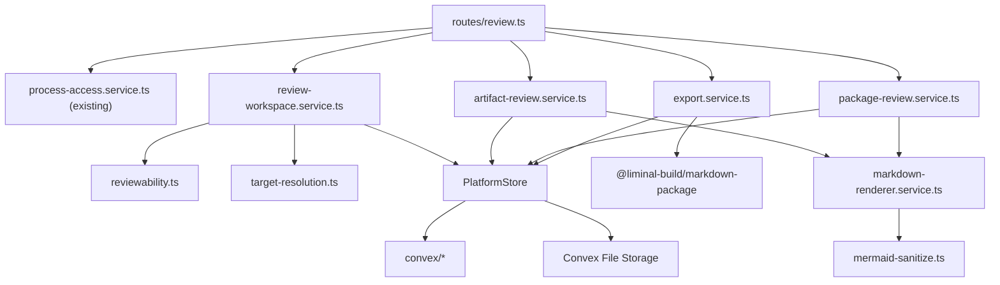
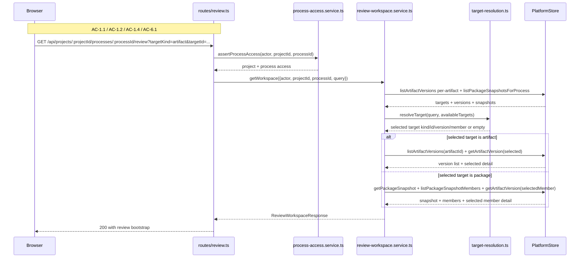
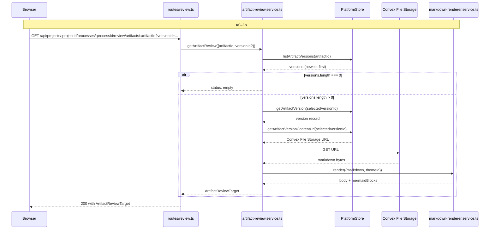
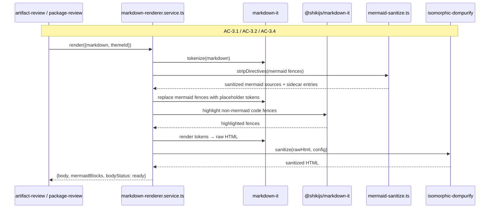
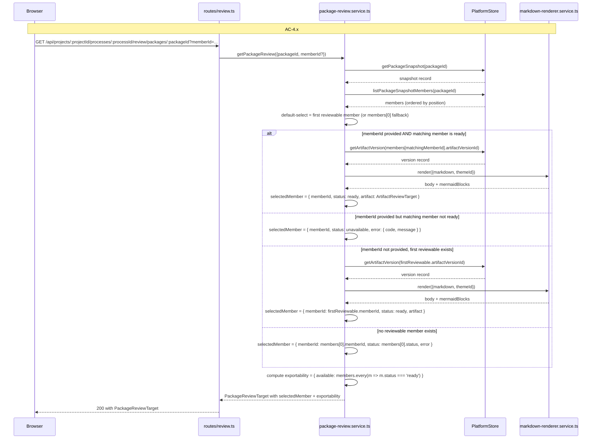
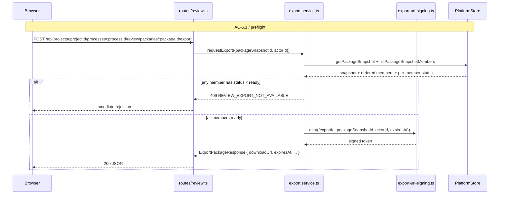
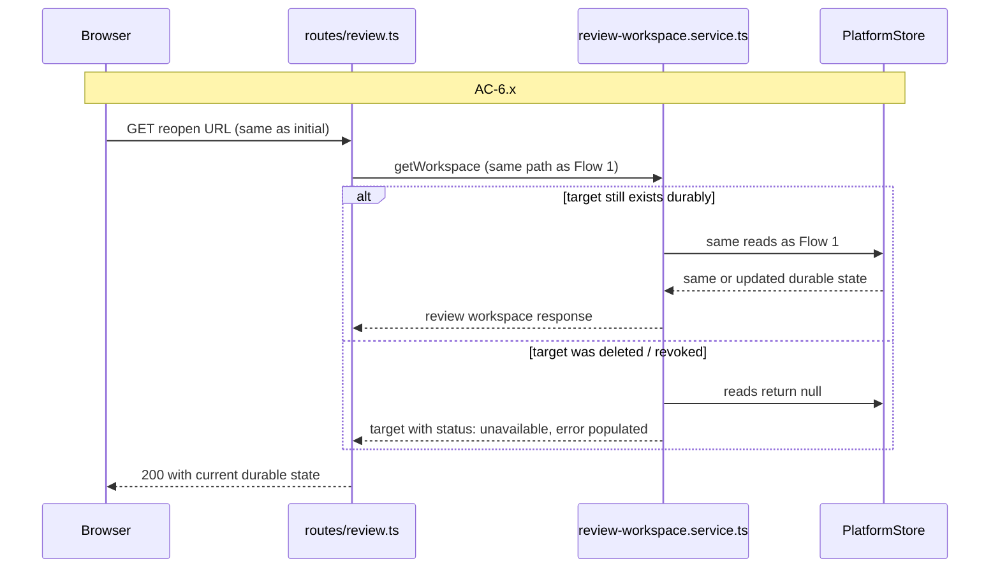

# Technical Design: Artifact Review and Package Surface — Server

This companion document covers the Fastify control plane, render pipeline, export pipeline, durable Convex state additions, and the `@liminal-build/markdown-package` workspace package for Epic 4. It expands the server-owned parts of the index into exact module boundaries, durable-state decisions, flow design, and copy-paste-ready interfaces.

## Server Bootstrap

The server remains one Fastify 5 monolith. Epic 4 does not introduce a second server, a separate renderer daemon, or any browser-to-Convex direct path. The browser enters through the existing project and process route families plus the new `review` route. Fastify still owns auth, access checks, target resolution, markdown rendering, sanitization, and the streaming export response.

Epic 4 adds three new server concerns beneath the existing surface set: a dedicated review route family, a server-side markdown render pipeline, and a streaming export path that composes Convex File Storage content into a `.mpkz` archive. None of these are public products of their own — they are deeper implementation layers inside the existing authenticated application boundary.

### Entry Point: `apps/platform/server/index.ts`

Responsibilities remain the same — load environment configuration, construct the Fastify app, start the HTTP server. Epic 4 adds one startup responsibility: ensure the Convex client used by `PlatformStore` is configured with File Storage access credentials that can mint signed URLs via `ctx.storage.getUrl()`. Those credentials already exist in the repo (Epic 3's closure chunks introduced `contentStorageId` writes), so Epic 4's work here is validation, not new configuration.

### App Factory: `apps/platform/server/app.ts`

`app.ts` remains the main assembly point. Epic 4 extends it to:

- instantiate a single `MarkdownRendererService` at startup (it lazy-initializes its Shiki highlighter on first render; not per-request)
- instantiate the review service trio (`ReviewWorkspaceService`, `ArtifactReviewService`, `PackageReviewService`) and the `ExportService`, each as long-lived request-scoped singletons
- register the new `review` route module with access to the services above plus `PlatformStore`
- preserve the existing websocket registration, process routes, and project routes wiring

Assembly order matters:

1. auth/session plugins first
2. WebSocket support (unchanged; review does not subscribe)
3. Shared services (PlatformStore, rendering services)
4. Review services built against rendering + platform store
5. Routes mounted after services are ready

`MarkdownRendererService.create()` is an async factory because Shiki's highlighter loads language grammars lazily. The factory is awaited once during app startup; the resulting service is injected into both artifact and package review services. Language grammars are fixed at startup — the set mirrors MDV's list (`javascript`, `typescript`, `python`, `go`, `rust`, `java`, `c`, `cpp`, `sql`, `yaml`, `json`, `bash`, `html`, `css`, `markdown`, `toml`, `dockerfile`) with aliases for `js`, `ts`, `py`, `sh`, `yml`. The language list is intentionally small to keep startup time and memory reasonable; adding a language is a config change, not a runtime discovery.

## Top-Tier Surface Nesting

| Surface | Epic 4 Server Nesting |
|---------|-----------------------|
| Processes | Existing `routes/processes.ts` and process services remain authoritative for the process work surface. Epic 4 extends the `controls[review].enabled` computation inside `process-work-surface.service.ts` (primary seam — gates the user's click) and the `availableActions` shell projection inside `platform-store.ts` (secondary seam — keeps shell descriptive state consistent). Both consult reviewability; no new contract field |
| Artifacts | **Schema migration**: `artifacts` table trims to identity-and-attachment (`projectId`, `processId`, `displayName`, new `createdAt`). Removed: `contentStorageId`, `currentVersionLabel`, `updatedAt` — all three relocate to or are derived from `artifactVersions`. Epic 3's checkpoint writer is rewritten to insert a new `artifactVersions` row rather than overwrite in place |
| Review | **New surface** — `routes/review.ts` and `services/review/*`. Entirely server-owned, no process-surface responsibility bleeds in |
| Packages | **New surface** — `services/review/package-review.service.ts` plus new Convex tables. Epic 4 ships the typed `publishPackageSnapshot` internal mutation that downstream process-module epics call when they decide to publish; Epic 4 itself contains no production caller of that mutation |
| Rendering | **New shared substrate** — `services/rendering/*`. Not a route surface on its own; consumed by review services only in Epic 4 |

The key nesting rule: review work belongs under a new route family at the same altitude as `projects` and `processes`. It is not a sub-route of process. The URL structure reflects process-aware context (`/projects/.../processes/.../review`) but the server route handler owns the review semantics end-to-end and does not delegate to the process work surface service.

## Module Architecture

```text
apps/platform/server/
├── app.ts                                                    # MODIFIED
├── routes/
│   ├── projects.ts                                           # EXISTS
│   ├── processes.ts                                          # EXISTS
│   └── review.ts                                             # NEW
├── services/
│   ├── projects/
│   │   └── platform-store.ts                                 # MODIFIED
│   ├── processes/
│   │   ├── process-work-surface.service.ts                   # MODIFIED (review control enablement consults reviewability)
│   │   └── readers/
│   │       └── materials-section.reader.ts                   # MODIFIED (artifact summary derives currentVersionLabel + updatedAt from artifactVersions)
│   ├── review/                                               # NEW subtree
│   │   ├── review-workspace.service.ts                       # NEW
│   │   ├── artifact-review.service.ts                        # NEW
│   │   ├── package-review.service.ts                         # NEW
│   │   ├── export.service.ts                                 # NEW (two-phase: POST → JSON, GET → stream)
│   │   ├── export-url-signing.ts                             # NEW (mint + verify download URL tokens)
│   │   ├── reviewability.ts                                  # NEW (pure: reviewable target computation)
│   │   └── target-resolution.ts                              # NEW (pure: target selection from query state)
│   └── rendering/                                            # NEW subtree
│       ├── markdown-renderer.service.ts                      # NEW
│       ├── github-slugger.ts                                 # NEW (vendored)
│       ├── markdown-it-anchor.ts                             # NEW (vendored)
│       ├── markdown-task-lists.ts                            # NEW (our own)
│       └── mermaid-sanitize.ts                               # NEW
└── errors/
    ├── app-error.ts                                          # EXISTS
    ├── codes.ts                                              # MODIFIED (add REVIEW_* codes)
    └── section-error.ts                                      # EXISTS

apps/platform/shared/contracts/
├── review-workspace.ts                                       # NEW
└── state.ts                                                  # MODIFIED

packages/markdown-package/                                    # NEW workspace package
├── package.json
├── tsconfig.json
├── src/
│   ├── index.ts
│   ├── cli.ts
│   ├── types.ts
│   ├── errors.ts
│   ├── manifest/
│   │   ├── parser.ts
│   │   └── scaffold.ts
│   ├── tar/
│   │   ├── create.ts                                         # file-path create (lifted)
│   │   ├── create-from-entries.ts                            # NEW streaming in-memory API
│   │   ├── extract.ts
│   │   ├── inspect.ts
│   │   ├── list.ts
│   │   ├── manifest.ts
│   │   ├── read.ts
│   │   └── shared.ts
│   └── render/
│       └── index.ts                                          # optional render helper (not used by Fastify)
└── README.md

convex/
├── schema.ts                                                 # MODIFIED
├── artifacts.ts                                              # MODIFIED
├── artifactVersions.ts                                       # NEW
├── packageSnapshots.ts                                       # NEW
└── packageSnapshotMembers.ts                                 # NEW
```

### Module Responsibility Matrix

| Module | Status | Responsibility | Dependencies | ACs Covered |
|--------|--------|----------------|--------------|-------------|
| `routes/review.ts` | NEW | Review HTML route + review APIs (bootstrap, artifact, package, export POST, export download GET) | auth, review services, request/response contracts | AC-1 through AC-6 |
| `review-workspace.service.ts` | NEW | Assemble review workspace bootstrap: project + process context + available target summaries + optional selected target; delegates populated-target rendering to the appropriate target-specific service | process-access service, target-resolution, reviewability, `PlatformStore`, **artifact-review.service**, **package-review.service** | AC-1, AC-6 |
| `artifact-review.service.ts` | NEW | Resolve one artifact's versions, select version by query state, fetch content from Convex File Storage, render via `MarkdownRendererService`, return `ArtifactReviewTarget` | `PlatformStore`, renderer service | AC-2, AC-3, AC-6 |
| `package-review.service.ts` | NEW | Resolve one package snapshot + members, apply first-reviewable-member default, compute `exportability`, select member by query state, return `PackageReviewTarget` with selected-member `PackageMemberReview` envelope (status/error/artifact?) | `PlatformStore`, **artifact-review.service** (reused for selected member render) | AC-4, AC-5.1b, AC-6 |
| `export.service.ts` | NEW | Two-phase export: POST returns `ExportPackageResponse` JSON with a signed download URL; GET at that URL (handled by the same `routes/review.ts` module) streams the `.mpkz` archive through `createPackageFromEntries` into the Fastify reply body | `PlatformStore`, `@liminal-build/markdown-package`, `export-url-signing` | AC-5 |
| `export-url-signing.ts` | NEW | Mint and verify signed download URL tokens with embedded expiresAt; verification failures return 404 `REVIEW_TARGET_NOT_FOUND` for expired or invalid tokens | Node `crypto` | AC-5.3b |
| `reviewability.ts` | NEW (pure) | Pure function: given (artifact-version counts per artifact, package snapshot existence for process), produce `{ available: ReviewTargetSummary[], hasReviewable: boolean }` | none | AC-1 |
| `target-resolution.ts` | NEW (pure) | Parse query state, enforce target-selection rules (single-target auto-open, multi-target selection state, zero-target empty state) | none | AC-1 |
| `markdown-renderer.service.ts` | NEW | Server-side markdown → sanitized HTML + Mermaid sidecar. Pipeline: markdown-it (`html: false`) + `@shikijs/markdown-it` + vendored `markdown-it-anchor` + vendored `github-slugger` + purpose-built task-list renderer + `mermaid-sanitize` fence interception → placeholder replacement → isomorphic-dompurify | markdown-it, shiki, isomorphic-dompurify (direct deps) | AC-3 |
| `github-slugger.ts` | NEW (vendored) | Stable heading slug generator, deterministic across renders | none | AC-3 |
| `markdown-it-anchor.ts` | NEW (vendored) | Register heading anchors on markdown-it instances using the vendored slugger | vendored slugger | AC-3 |
| `markdown-task-lists.ts` | NEW (our own) | Scan tokenized list items for `[ ]` / `[x]` / `[X]` prefixes, replace with disabled checkbox inside label, tag parent list as task-list | none | AC-3 |
| `mermaid-sanitize.ts` | NEW | Strip `%%{init}%%`, `%%{config}%%`, `%%{wrap}%%` directives from mermaid fence sources; extract source + synthetic blockId for sidecar; replace fence in HTML with placeholder div | none | AC-3 |
| `platform-store.ts` | MODIFIED | Add durable reads for `artifactVersions`, `packageSnapshots`, `packageSnapshotMembers`; add `getArtifactVersionContentUrl` + `getLatestArtifactVersion` helpers; add `insertArtifactVersion` and `publishPackageSnapshot` typed write wrappers; **rewrite any existing call site that reads `artifacts.contentStorageId`** to use `getLatestArtifactVersion`; extend shell `availableActions` projections (multiple sites) to consult reviewability when including `'review'` | Convex functions, reviewability check | AC-1 through AC-6 |
| `materials-section.reader.ts` | MODIFIED | Artifact summary read-path rewrite — derive `currentVersionLabel` and `updatedAt` from `artifactVersions[latest]` via `getLatestArtifactVersion`. `ArtifactSummary` schema unchanged; derivation logic is the change | `PlatformStore` | AC-2 |
| `process-work-surface.service.ts` | **MODIFIED (primary review-enablement seam)** | Current `case 'review':` branch (`~line 278`) computes `{ enabled, disabledReason }` from process status only. Epic 4 extends this branch to also consult reviewability via `PlatformStore.hasReviewableTargets(processId)`. `enabled = true` iff the lifecycle status permits review AND at least one reviewable target exists. This is the seam that gates the user's actual click on the process-surface `review` control | `PlatformStore`, reviewability check | AC-1.1 |
| `platform-store.ts` shell `availableActions` projections | MODIFIED (secondary seam) | The shell-level process-list projections (multiple `availableActions` sites in `platform-store.ts`) include `'review'` in the action list based on lifecycle status. Epic 4 extends the same reviewability check so the shell's descriptive action list matches what the process surface actually enables. Nothing renders shell-level controls as clickable today, but keeping the two projections in sync prevents a drift bug when a future epic wires shell controls as interactive | Convex reads, reviewability check | AC-1.1 |
| `process-section.reader.ts` | UNCHANGED | Previously drafted as the modification site; corrected to the `process-work-surface.service.ts` + `platform-store.ts` pair above. `process-section.reader.ts` is the shell section reader for the processes list envelope; it does not compute the per-process `controls` array or `availableActions` and therefore does not need Epic 4 changes | — | — |
| `codes.ts` | MODIFIED | Add `REVIEW_TARGET_NOT_FOUND`, `REVIEW_EXPORT_NOT_AVAILABLE`, `REVIEW_EXPORT_FAILED` to the error-code enum | — | AC-1, AC-5, AC-6 |
| `review-workspace.ts` (contract) | NEW | Zod schemas for every review request/response type; `PackageMemberReview` with own status/error; `PackageReviewTarget.exportability` signal; review target error shape; review error codes | Zod | AC-1 through AC-6 |
| `@liminal-build/markdown-package` | NEW | Workspace package: library (create/extract/inspect/list/getManifest/readDocument + **new** `createPackageFromEntries`) + CLI (`mdvpkg`) | `tar-stream`, Node built-ins | AC-5 |
| `convex/artifactVersions.ts` | NEW | Durable per-artifact version rows (content pointer lives here after the storage model change); typed `internalMutation insertArtifactVersion`; `internalQuery` list / get / content-URL | Convex schema + typed functions | AC-2, AC-6 |
| `convex/packageSnapshots.ts` | NEW | Durable package snapshot headers; typed `internalMutation publishPackageSnapshot` (transactional insert of snapshot + all member rows); no update API (immutable after write) | Convex schema | AC-4 |
| `convex/packageSnapshotMembers.ts` | NEW | Durable snapshot member rows: snapshotId, position, artifactId, artifactVersionId (the pin); written transactionally inside `publishPackageSnapshot` | Convex schema | AC-4 |
| `convex/artifacts.ts` | **MODIFIED (storage model change)** | Table shape trims to four fields: `projectId` (kept), `processId` (kept), `displayName` (kept), `createdAt` (new). **Removed: `contentStorageId`, `currentVersionLabel`, `updatedAt`.** Rewrite Epic 3's checkpoint writer path to call `insertArtifactVersion` instead of overwriting the artifact row. Update every caller of the three removed fields to use `getLatestArtifactVersion`. See §Artifact Storage Model Change for the field-by-field delta and read-path implications for callers like `materials-section.reader.ts`. | AC-2 |

### Component Interaction Diagram



## Durable State Model

Epic 4 introduces three new tables and extends the existing `artifacts` table read paths. The design stance is to keep version identity, package snapshot identity, and snapshot membership as separate durable rows — never as embedded arrays on a parent — because all three have unbounded growth potential per-entity and live on the high-churn side of the Convex "shared record vs. high-churn data" boundary.

### Design Stance

Reduce the `artifacts` row to generic identity only. Epic 3's closure chunks landed `contentStorageId` on `artifacts` as the content pointer; Epic 4 removes that field and relocates the pointer to a new `artifactVersions` table. This is Shape A from the decision record — a single source of truth for "current artifact content" (the latest row in `artifactVersions`) rather than a denormalized field that write paths have to keep in sync.

A process that rapidly iterates on an artifact (say, 50 revisions across a work session) produces 50 `artifactVersions` rows — one per revision. That is exactly what a chronological history table is for. An embedded array on the `artifacts` row would concentrate per-revision churn on a shared identity row and tile the 1 MB per-row ceiling; a separate table is the standard Convex pattern and what the guidelines require.

Similarly, a process that publishes multiple review packages over its lifetime produces multiple `packageSnapshots` rows, and each snapshot has many member rows. Membership is a separate table so each snapshot can have a large, unbounded member set without causing shared-row churn.

Content itself lives in Convex File Storage. `artifactVersions.contentStorageId` is the pointer; the row does not hold the bytes. This preserves Epic 3's decision that artifact content lives in File Storage rather than inline in Convex documents (to avoid the 1 MB per-row ceiling); only the location of the pointer changes.

Package snapshots are **immutable after publication**. The `publishPackageSnapshot` mutation writes the snapshot row and all member rows in one transaction. There is no "update a snapshot after the fact" path in Epic 4. Revising an artifact produces a new `artifactVersions` row; publishing a new package produces a new `packageSnapshots` row. This immutability is what makes "the published package still points at the same member versions" a structural property rather than a runtime check.

Epic 4 defines the typed `publishPackageSnapshot` internal mutation but does not include any production caller. Downstream process-module epics decide when and what to publish and call this mutation from their module code. Epic 4's tests exercise the mutation through Convex test infrastructure to prove the contract and invariants are correct end-to-end.

### Artifact Storage Model Change

This is a **storage-model rewrite**, not a data-preserving migration of live user content. Epic 4 assumes the repo's pre-customer stance (stated in Epic 3's implementation addendum): dev-DB artifacts are throwaway, schema breaking changes land as direct edits, no migration dance. If Epic 4 were to ship post-customer, this section would need a real widen-migrate-narrow procedure instead; that is explicitly out of scope for the current slice.

Epic 4 trims the `artifacts` table to identity-and-attachment only, relocates all version-specific state to the new `artifactVersions` table, and rewrites Epic 3's checkpoint writer path. The work lands in Chunk 0 (schema change) + Chunk 2 (write-path rewrite and read-path rewrite).

#### Retained `artifacts` Fields After the Change

The post-change `artifacts` row carries exactly four fields — no version-specific state, no denormalized latest pointer:

- `projectId` *(kept)* — project attachment; required for shell-level artifact scoping
- `processId` *(kept, nullable)* — process attachment; nullable for project-scoped artifacts; attachment scope is artifact-identity-level, not version-level
- `displayName` *(kept)* — human-readable identity
- `createdAt` *(new)* — timestamp when the artifact identity was first inserted; serves as the fallback source for `ArtifactSummary.updatedAt` when no versions exist yet

Everything else about an artifact — what version is current, where content lives, when it was last updated — is derived from `artifactVersions` at read time.

#### `artifacts` Table: Field-by-Field Delta

The current Epic 3 `artifacts` table (`convex/artifacts.ts:19`) has six fields. After the change it has four. The precise delta:

| Field | Current (Epic 3) | After Change (Epic 4) | Notes |
|-------|------------------|------------------------|-------|
| `projectId` | `v.string()` | `v.string()` — **kept** | Project attachment; required for shell-level artifact scoping |
| `processId` | `v.union(v.string(), v.null())` | `v.union(v.string(), v.null())` — **kept** | Process attachment (nullable for project-scoped artifacts); attachment scope is artifact-identity-level, not version-level |
| `displayName` | `v.string()` | `v.string()` — **kept** | Human-readable identity |
| `currentVersionLabel` | `v.union(v.string(), v.null())` | **REMOVED** | Derived at read time from `artifactVersions[latest].versionLabel`; `null` when no versions exist |
| `contentStorageId` | `v.id('_storage')` | **REMOVED** | Moved to `artifactVersions.contentStorageId`; one row per revision |
| `updatedAt` | `v.string()` | **REMOVED** | Derived at read time from `artifactVersions[latest].createdAt`, falling back to `artifacts.createdAt` when no versions exist |
| `createdAt` | *(does not exist)* | `v.string()` — **added** | Records when the artifact identity itself was first inserted; serves as the fallback for `updatedAt` derivation in the zero-version case |

Post-change `artifacts` row shape:

```ts
export const artifactsTableFields = {
  projectId: v.string(),
  processId: v.union(v.string(), v.null()),
  displayName: v.string(),
  createdAt: v.string(),
};
```

Four fields, all identity-and-attachment. No version-specific state. Existing indexes on `artifacts` (notably `by_projectId_updatedAt`) need attention: `updatedAt` is no longer on the row, so queries that previously sorted artifacts by `updatedAt` must either sort by `artifacts.createdAt` (identity-level recency) or join against `artifactVersions` for true latest-activity ordering. Both options are acceptable for the first cut; the read-path rewrite documents which choice each call site makes.

#### Write-Path and Read-Path Delta

| Concern | Before (Epic 3) | After (Epic 4) |
|---------|------------------|-----------------|
| Checkpoint writer | Overwrites `artifacts.contentStorageId` on each revision | Calls `insertArtifactVersion` to append a new `artifactVersions` row; does not touch `artifacts` |
| Current content retrieval | Read `artifacts.contentStorageId` | `getLatestArtifactVersion(artifactId)` then `getArtifactVersionContentUrl(versionId)` |
| Latest version label | Read `artifacts.currentVersionLabel` | `getLatestArtifactVersion(artifactId).versionLabel` |
| Artifact summary `updatedAt` | Read `artifacts.updatedAt` | `getLatestArtifactVersion(artifactId)?.createdAt ?? artifacts.createdAt` |
| Orphaned blobs on revision | Old blob was orphaned | Every revision's blob stays referenced by its `artifactVersions` row |

Pre-customer stance in Epic 3's implementation addendum permits direct schema edits without a migration dance; dev-DB data is throwaway.

#### Artifact Summary Read-Path Rewrite

`ArtifactSummary` (from `apps/platform/shared/contracts/schemas.ts:143`) is the shape that shell and materials consumers see per-artifact. The schema **does not change** — it keeps `currentVersionLabel: string | null` and `updatedAt: string`. What changes is how those fields are *populated* after the storage model change. The `artifacts` row no longer carries these values as denormalized latest fields; instead they are derived at read time from the latest `artifactVersions` row.

| Summary field | Before (Epic 3) | After (Epic 4) |
|---------------|------------------|-----------------|
| `artifactId`, `displayName`, `attachmentScope`, `processId`, `processDisplayLabel` | Read directly from `artifacts` row (or join against `processes` for `processDisplayLabel`) | **Unchanged** — `artifactId`, `displayName`, `processId` still come from `artifacts`; `attachmentScope` is still derived from `processId === null`; `processDisplayLabel` still joins against `processes` |
| `currentVersionLabel` | From `artifacts.currentVersionLabel` | Derived from `artifactVersions[latest].versionLabel` for the artifact; `null` when no versions exist |
| `updatedAt` | From `artifacts.updatedAt` | Derived from `artifactVersions[latest].createdAt` for the artifact; falls back to the new `artifacts.createdAt` field when no versions exist |

Two specific callers need the read-path rewrite:

- **`apps/platform/server/services/processes/readers/materials-section.reader.ts`** — MODIFIED. Today this reader produces `ArtifactSummary` rows for the process work surface's materials envelope. Epic 4 extends its per-artifact projection to `getLatestArtifactVersion(artifactId)` and derive `currentVersionLabel` + `updatedAt` from that row. When the materials projection returns N artifacts, this costs N version-lookups; at first-cut material-list scale (≤ 20 items per process in Epic 2's NFR) this is acceptable. If a future epic materializes much larger materials lists, denormalization can be reintroduced as a performance optimization.
- **`apps/platform/server/services/projects/platform-store.ts`** — MODIFIED. Every call site that currently reads `artifacts.contentStorageId` or reads a denormalized `currentVersionLabel`/`updatedAt` off the `artifacts` row. The grep target is any reference to those three fields. Each site is rewritten to use `getLatestArtifactVersion` (a new `PlatformStore` method backed by the `by_artifactId_createdAt` Convex index).

No denormalized latest-version cache stays on `artifacts`. Single source of truth = `artifactVersions`. This is the same decision that drove Shape A for the content pointer; the summary fields follow the same principle.

### Convex Tables

| Table | Status | Purpose | Notes |
|-------|--------|---------|-------|
| `artifacts` | **MODIFIED (storage model change)** | Generic artifact identity-and-attachment row after Epic 4: `projectId`, `processId`, `displayName`, `createdAt` | `contentStorageId`, `currentVersionLabel`, `updatedAt` are removed; all version-specific state moves to or is derived from `artifactVersions`; new `createdAt` field added for identity-level recency |
| `artifactVersions` | NEW | One row per durable version of one artifact; content via File Storage | Indexed by `artifactId` + `createdAt` |
| `packageSnapshots` | NEW | One row per durable published package; immutable after publication | Indexed by `processId` + `publishedAt` |
| `packageSnapshotMembers` | NEW | Many rows per snapshot; pins (artifactId, artifactVersionId, position) | Indexed by `packageSnapshotId` + `position` |

### Convex Field Outline

All new Convex functions follow the generated Convex guidelines: use `query`, `mutation`, `internalQuery`, `internalMutation`, or `action` from `./_generated/server`; include validators for every function; use typed contexts; avoid unbounded arrays on shared records; use `internal*` functions for server-only paths that should not be public Convex API surface.

#### `artifactVersions`

```ts
export const contentKindValidator = v.union(
  v.literal('markdown'),
  v.literal('unsupported'),
);

export const artifactVersionsTableFields = {
  artifactId: v.id('artifacts'),
  versionLabel: v.string(),
  contentStorageId: v.id('_storage'),
  contentKind: contentKindValidator,
  bytes: v.number(),
  createdAt: v.string(),
  createdByProcessId: v.id('processes'),
};
```

Index plan:

```ts
defineTable(artifactVersionsTableFields)
  .index('by_artifactId_createdAt', ['artifactId', 'createdAt'])
  .index('by_createdByProcessId_createdAt', ['createdByProcessId', 'createdAt'])
```

The first index powers the per-artifact version list (AC-2). The second powers the process-scoped reviewability count (AC-1) without a collection scan.

#### `packageSnapshots`

```ts
export const packageSnapshotsTableFields = {
  processId: v.id('processes'),
  displayName: v.string(),
  packageType: v.string(),
  publishedAt: v.string(),
};
```

Index plan:

```ts
defineTable(packageSnapshotsTableFields)
  .index('by_processId_publishedAt', ['processId', 'publishedAt'])
```

#### `packageSnapshotMembers`

```ts
export const packageSnapshotMembersTableFields = {
  packageSnapshotId: v.id('packageSnapshots'),
  position: v.number(),
  artifactId: v.id('artifacts'),
  artifactVersionId: v.id('artifactVersions'),
};
```

Index plan:

```ts
defineTable(packageSnapshotMembersTableFields)
  .index('by_packageSnapshotId_position', ['packageSnapshotId', 'position'])
```

### Typed Write Mutations

Epic 4 introduces two typed internal mutations that downstream callers use to write to the new tables.

#### `insertArtifactVersion`

```ts
// convex/artifactVersions.ts
export const insertArtifactVersion = internalMutation({
  args: {
    artifactId: v.id('artifacts'),
    versionLabel: v.string(),
    contentStorageId: v.id('_storage'),
    contentKind: contentKindValidator,
    bytes: v.number(),
    createdByProcessId: v.id('processes'),
  },
  handler: async (ctx, args) => {
    const createdAt = new Date().toISOString();
    return await ctx.db.insert('artifactVersions', {
      ...args,
      createdAt,
    });
  },
});
```

Called by Epic 3's (rewritten) checkpoint writer path on every successful artifact checkpoint. The `createdAt` timestamp is set inside the mutation to keep the invariant "version rows are ordered by their real persistence time" authoritative.

#### `publishPackageSnapshot`

```ts
// convex/packageSnapshots.ts
export const publishPackageSnapshotMemberInput = v.object({
  artifactId: v.id('artifacts'),
  artifactVersionId: v.id('artifactVersions'),
  position: v.number(),
});

export const publishPackageSnapshot = internalMutation({
  args: {
    processId: v.id('processes'),
    displayName: v.string(),
    packageType: v.string(),
    members: v.array(publishPackageSnapshotMemberInput),
  },
  handler: async (ctx, args) => {
    const publishedAt = new Date().toISOString();
    const snapshotId = await ctx.db.insert('packageSnapshots', {
      processId: args.processId,
      displayName: args.displayName,
      packageType: args.packageType,
      publishedAt,
    });
    for (const member of args.members) {
      await ctx.db.insert('packageSnapshotMembers', {
        packageSnapshotId: snapshotId,
        artifactId: member.artifactId,
        artifactVersionId: member.artifactVersionId,
        position: member.position,
      });
    }
    return snapshotId;
  },
});
```

All writes happen inside one Convex mutation transaction. No update path exists for `packageSnapshots` or `packageSnapshotMembers`; once a snapshot is published it is immutable. Epic 4 does not call this mutation from any production code — it exists for downstream process-module epics to invoke when their publish decision fires.

### Query Discipline

New and modified Convex modules:

- use proper validators and generated types — never `ctx: any`
- prefer indexed lookups; no broad `.collect()` over whole tables
- keep per-artifact version reads bounded (page by `createdAt` when version count could be large; first cut supports up to 50 versions per artifact without paging)
- use `internalQuery` / `internalMutation` for server-only paths that should not be part of the public Convex API surface
- `publishPackageSnapshot` is transactional — never partial writes on error

## Core Interfaces

### Review Workspace Response (Bootstrap)

```ts
export interface ReviewWorkspaceResponse {
  project: ReviewWorkspaceProjectContext;
  process: ProcessReviewContext;
  availableTargets: ReviewTargetSummary[];
  target?: ReviewTarget;
}

export interface ReviewWorkspaceProjectContext {
  projectId: string;
  name: string;
  role: 'owner' | 'member';
}

export interface ProcessReviewContext {
  processId: string;
  displayLabel: string;
  processType: 'ProductDefinition' | 'FeatureSpecification' | 'FeatureImplementation';
  reviewTargetKind?: 'artifact' | 'package';
  reviewTargetId?: string;
}

export interface ReviewTargetSummary {
  position: number;
  targetKind: 'artifact' | 'package';
  targetId: string;
  displayName: string;
}
```

### Review Target Union

`ReviewTarget` is a tagged union over artifact and package kinds. When `targetKind === 'artifact'` the `artifact` field is populated; when `'package'` the `package` field is populated. The `status` field on every target carries the top-level state; `error` is populated only when status is `error | unsupported | unavailable`.

```ts
export interface ReviewTarget {
  targetKind: 'artifact' | 'package';
  displayName: string;
  status: 'ready' | 'empty' | 'error' | 'unsupported' | 'unavailable';
  artifact?: ArtifactReviewTarget;
  package?: PackageReviewTarget;
  error?: ReviewTargetError;
}

export interface ArtifactReviewTarget {
  artifactId: string;
  displayName: string;
  currentVersionId?: string;
  currentVersionLabel?: string;
  selectedVersionId?: string;
  versions: ArtifactVersionSummary[];
  selectedVersion?: ArtifactVersionDetail;
}

export interface ArtifactVersionSummary {
  versionId: string;
  versionLabel: string;
  isCurrent: boolean;
  createdAt: string;
}

export interface ArtifactVersionDetail {
  versionId: string;
  versionLabel: string;
  contentKind: 'markdown' | 'unsupported';
  bodyStatus?: 'ready' | 'error';
  body?: string;
  bodyError?: ReviewTargetError;
  mermaidBlocks?: MermaidBlock[];
  createdAt: string;
}

export interface MermaidBlock {
  blockId: string;
  source: string;
}

export type PackageMemberStatus = 'ready' | 'unsupported' | 'unavailable';

export type PackageExportability =
  | { available: true }
  | { available: false; reason: string };

export interface PackageReviewTarget {
  packageId: string;
  displayName: string;
  packageType: string;
  members: PackageMember[];
  selectedMemberId?: string;
  selectedMember?: PackageMemberReview;
  exportability: PackageExportability;
}

export interface PackageMember {
  memberId: string;
  position: number;
  artifactId: string;
  displayName: string;
  versionId: string;
  versionLabel: string;
  status: PackageMemberStatus;
}

export interface PackageMemberReview {
  memberId: string;
  status: PackageMemberStatus;
  error?: ReviewTargetError;
  artifact?: ArtifactReviewTarget;  // present only when status === 'ready'
}

export interface ReviewTargetError {
  code: 'REVIEW_TARGET_NOT_FOUND' | 'REVIEW_TARGET_UNSUPPORTED' | 'REVIEW_RENDER_FAILED' | 'REVIEW_MEMBER_UNAVAILABLE';
  message: string;
}
```

Review-target-scoped error codes:

| Code | Description |
|---|---|
| `REVIEW_TARGET_NOT_FOUND` | The requested review target (artifact, artifact version, or package) is no longer available in the review context. |
| `REVIEW_TARGET_UNSUPPORTED` | The current target or selected member cannot be rendered in the first-cut review workspace, but its identity remains visible. |
| `REVIEW_RENDER_FAILED` | The current target identity loaded, but bounded body or diagram rendering failed. |
| `REVIEW_MEMBER_UNAVAILABLE` | One package member is unavailable in the current package review context. |

### Export Response

Export is a **two-phase flow**. The POST `/export` endpoint returns a JSON metadata record with a signed GET download URL; the user's browser then GETs that URL to stream the `.mpkz` bytes. Expired URL retrieval returns 404 `REVIEW_TARGET_NOT_FOUND`.

```ts
export interface ExportPackageResponse {
  exportId: string;
  downloadName: string;
  downloadUrl: string;      // signed GET URL at /api/projects/:projectId/processes/:processId/review/exports/:exportId?token=...
  contentType: 'application/gzip';
  packageFormat: 'mpkz';
  expiresAt: string;        // ISO 8601; matches the signed URL's embedded expiry
}
```

The signed URL is a GET on the same route family (`routes/review.ts`), so no new route module is introduced; only a new handler inside `review.ts` for `GET /exports/:exportId`. The signing layer (`export-url-signing.ts`) uses Node's `crypto` module with an HMAC keyed on a server-side secret loaded from configuration. Token payload encodes `{ exportId, packageSnapshotId, actorId, expiresAt }`.

### Render Output Shape

`body` on `ArtifactVersionDetail` is **server-rendered, DOMPurify-sanitized HTML** with mermaid fences replaced by placeholder divs. `mermaidBlocks[]` is the sidecar of raw (directive-stripped) Mermaid sources; the client hydrates these into the placeholder divs. This interpretation is documented in the epic's Issues Found table as a spec clarification.

### PlatformStore Extensions

```ts
export interface PlatformStore {
  // existing Epic 1-3 methods...

  // Artifact version reads
  listArtifactVersions(args: {
    artifactId: string;
    limit?: number;
  }): Promise<ArtifactVersionRecord[]>;

  getArtifactVersion(args: {
    versionId: string;
  }): Promise<ArtifactVersionRecord | null>;

  getLatestArtifactVersion(args: {
    artifactId: string;
  }): Promise<ArtifactVersionRecord | null>;

  getArtifactVersionContentUrl(args: {
    versionId: string;
  }): Promise<string | null>;

  // Reviewability (consulted by process-work-surface.service.ts for controls[review].enabled
  // and by platform-store.ts for shell availableActions)
  hasReviewableTargets(args: {
    processId: string;
  }): Promise<boolean>;

  // Package snapshot reads
  listPackageSnapshotsForProcess(args: {
    processId: string;
  }): Promise<PackageSnapshotRecord[]>;

  getPackageSnapshot(args: {
    packageSnapshotId: string;
  }): Promise<PackageSnapshotRecord | null>;

  listPackageSnapshotMembers(args: {
    packageSnapshotId: string;
  }): Promise<PackageSnapshotMemberRecord[]>;

  // Typed write wrappers — exposed for Epic 3's rewritten checkpoint path and for downstream
  // process-module epics. Epic 4 tests exercise these directly; Epic 4 has no production caller.
  insertArtifactVersion(args: {
    artifactId: string;
    versionLabel: string;
    contentStorageId: string;
    contentKind: 'markdown' | 'unsupported';
    bytes: number;
    createdByProcessId: string;
  }): Promise<string>;  // returns the new artifactVersionId

  publishPackageSnapshot(args: {
    processId: string;
    displayName: string;
    packageType: string;
    members: Array<{
      artifactId: string;
      artifactVersionId: string;
      position: number;
    }>;
  }): Promise<string>;  // returns the new packageSnapshotId
}

export interface ArtifactVersionRecord {
  versionId: string;
  artifactId: string;
  versionLabel: string;
  contentStorageId: string;
  contentKind: 'markdown' | 'unsupported';
  bytes: number;
  createdAt: string;
  createdByProcessId: string;
}

export interface PackageSnapshotRecord {
  packageSnapshotId: string;
  processId: string;
  displayName: string;
  packageType: string;
  publishedAt: string;
}

export interface PackageSnapshotMemberRecord {
  memberId: string;
  packageSnapshotId: string;
  position: number;
  artifactId: string;
  artifactVersionId: string;
}
```

### Markdown Renderer Service

```ts
export interface RenderArtifactArgs {
  markdown: string;
  themeId: string;
}

export interface RenderArtifactResult {
  body: string;
  mermaidBlocks: MermaidBlock[];
  bodyStatus: 'ready' | 'error';
  bodyError?: ReviewTargetError;
}

export class MarkdownRendererService {
  static async create(config: MarkdownRendererConfig): Promise<MarkdownRendererService>;
  render(args: RenderArtifactArgs): RenderArtifactResult;
}

export interface MarkdownRendererConfig {
  shikiThemes: { light: string; dark: string };
  shikiLangs: string[];
  shikiLangAliases?: Record<string, string>;
  dompurifyConfig?: DOMPurify.Config;
}
```

The renderer never throws — it returns `bodyStatus: 'error'` with a populated `bodyError` when markdown parsing or sanitization fails. Mermaid sanitization is a pre-render step (fence interception inside the markdown-it pipeline) and cannot error the whole artifact; a malformed Mermaid source yields a non-empty `MermaidBlock` entry that the client will fail to render on its own.

### Export Service (Two-Phase)

```ts
export interface RequestExportArgs {
  projectId: string;
  processId: string;
  packageSnapshotId: string;
  actorId: string;
}

export interface DownloadExportArgs {
  projectId: string;
  processId: string;
  exportId: string;
  token: string;
  actorId: string;
}

export class ExportService {
  // Phase 1: POST /export — preflight validate, mint signed URL, return metadata
  requestExport(args: RequestExportArgs): Promise<ExportPackageResponse>;

  // Phase 2: GET /exports/:exportId?token=... — verify token, stream the .mpkz archive
  downloadExport(args: DownloadExportArgs): Promise<Readable>;
}
```

`requestExport` validates that every package member is available (otherwise `REVIEW_EXPORT_NOT_AVAILABLE`), mints a signed token via `export-url-signing.ts`, and returns the `ExportPackageResponse`. No bytes are streamed in this phase.

`downloadExport` verifies the token (rejects expired or invalid tokens with 404 `REVIEW_TARGET_NOT_FOUND`), re-validates the actor's access to the project/process, and returns a `Readable` that Fastify pipes into the reply body. Member content is streamed end-to-end via `createPackageFromEntries`.

### Export URL Signing

```ts
// export-url-signing.ts
export interface ExportTokenPayload {
  exportId: string;
  packageSnapshotId: string;
  actorId: string;
  expiresAt: string;  // ISO 8601
}

export interface ExportUrlSigner {
  mint(payload: ExportTokenPayload): string;  // base64url-encoded signed token
  verify(token: string): ExportTokenPayload | null;  // returns null on invalid/expired
}
```

`mint` produces a compact token: `base64url(payload) + "." + base64url(hmacSha256(secret, base64url(payload)))`. `verify` checks the HMAC and the `expiresAt`; either failure yields `null`. The signing secret is loaded from configuration at app startup — no per-request key fetch.

## Flow 1: Review Workspace Bootstrap

**Covers:** AC-1.1, AC-1.2, AC-1.3, AC-1.4, AC-6.1, AC-6.2

The review workspace bootstrap is the entry point from either the process work surface's `review` action or a direct URL reopen. The server resolves project and process access, computes reviewability, resolves the target from query state, and returns the workspace envelope in one durable read.



### Skeleton Requirements

| What | Where | Stub Signature |
|------|-------|----------------|
| Review route module | `apps/platform/server/routes/review.ts` | `export async function registerReviewRoutes(app: FastifyInstance, deps: ReviewRouteDeps): Promise<void>` |
| Review workspace service | `apps/platform/server/services/review/review-workspace.service.ts` | `export class ReviewWorkspaceService { async getWorkspace(args): Promise<ReviewWorkspaceResponse> { throw new NotImplementedError('ReviewWorkspaceService.getWorkspace'); } }` |
| Target resolution pure module | `apps/platform/server/services/review/target-resolution.ts` | `export function resolveTarget(query, available): TargetResolution { throw new NotImplementedError('resolveTarget'); }` |
| Reviewability pure module | `apps/platform/server/services/review/reviewability.ts` | `export function computeReviewability(versions, snapshots): { available: ReviewTargetSummary[]; hasReviewable: boolean } { throw new NotImplementedError('computeReviewability'); }` |
| PlatformStore methods | `apps/platform/server/services/projects/platform-store.ts` | `listArtifactVersions`, `getArtifactVersion`, `getLatestArtifactVersion`, `listPackageSnapshotsForProcess`, `hasReviewableTargets`, `insertArtifactVersion`, `publishPackageSnapshot` |
| Convex state modules | `convex/artifactVersions.ts`, `convex/packageSnapshots.ts`, `convex/packageSnapshotMembers.ts` | Public/internal typed queries + the two typed write mutations (`insertArtifactVersion`, `publishPackageSnapshot`) |

### TC Mapping for this Flow

Full TC→test mapping lives in `test-plan.md`; this table lists the TCs this flow's server-side behavior must validate.

| TC | Tests | Module | Setup | Assert |
|----|-------|--------|-------|--------|
| TC-1.1a | bootstrap opens from process surface | `tests/service/server/review-workspace-api.test.ts` | process with one reviewable artifact | response includes that artifact as selected target |
| TC-1.1b | review not falsely offered without reviewable output | `tests/service/server/processes-api.test.ts` | process with zero versions + zero snapshots | process summary `controls[review].enabled === false`; `controls[review].disabledReason` populated |
| TC-1.1c | single target opens directly | `tests/service/server/review-workspace-api.test.ts` | process with one target, no query state | response populates that target |
| TC-1.1d | multiple targets open in selection state | `tests/service/server/review-workspace-api.test.ts` | process with two targets, no query state | response returns availableTargets only; `target` omitted |
| TC-1.1e | zero-target direct route opens empty | `tests/service/server/review-workspace-api.test.ts` | process with zero targets, direct review URL | response returns empty availableTargets |
| TC-1.2a | process context visible | `tests/service/server/review-workspace-api.test.ts` | accessible process, any target | project + process fields populated |
| TC-1.2b | target-selection state keeps process context | `tests/service/server/review-workspace-api.test.ts` | multi-target selection state | project + process fields populated without `target` |
| TC-1.3a | single artifact target identified | `tests/service/server/review-workspace-api.test.ts` | artifact target | `target.targetKind === 'artifact'` |
| TC-1.3b | package target identified | `tests/service/server/review-workspace-api.test.ts` | package target | `target.targetKind === 'package'` |
| TC-6.1a | reopen artifact from durable state | `tests/integration/review-workspace.test.ts` | prior review, reload same URL | same artifact + version visible |
| TC-6.2a | missing artifact shows unavailable | `tests/service/server/review-workspace-api.test.ts` | artifact deleted after URL bookmarked | response returns target with status: unavailable |
| TC-6.2b | missing package shows unavailable | `tests/service/server/review-workspace-api.test.ts` | package snapshot deleted | status: unavailable |
| TC-6.2c | revoked access on direct URL is blocked | `tests/service/server/review-workspace-api.test.ts` | actor lost project access | 403 `PROJECT_FORBIDDEN` |

## Flow 2: Artifact Review with Version Switching

**Covers:** AC-2.1, AC-2.2, AC-2.3, AC-2.4, AC-6.3 (body-render degradation)

Artifact review resolves the full version history for one artifact, selects either the query-state version or the current version as default, fetches the selected version's content from Convex File Storage, and renders it through the markdown pipeline. When an artifact exists but has no reviewable version yet, the surface returns `status: empty` with the artifact identity but no selected version.



### Design Notes

- the version list is always returned in `createdAt` descending order; `isCurrent` is computed as `versions[0]` when present
- if query state specifies a `versionId` that does not exist, the response returns `status: unavailable` with the artifact identity still visible
- `getArtifactVersionContentUrl` returns a Convex-issued stable URL (via `ctx.storage.getUrl()` wrapped in an `internalQuery`); Fastify fetches content over HTTP in the same request and does not cache the URL across requests. Access control lives at the route boundary
- content fetches time out at **`ARTIFACT_CONTENT_FETCH_TIMEOUT_MS = 10_000`** (exported as a constant from `artifact-review.service.ts` so tests can patch it); if the fetch times out or otherwise fails, the response returns `bodyStatus: 'error'` with `bodyError: { code: 'REVIEW_RENDER_FAILED', message: ... }` while keeping the version list visible
- `contentKind: unsupported` versions are returned with only identity fields; no content fetch is attempted

### TC Mapping for this Flow

| TC | Tests | Module | Setup | Assert |
|----|-------|--------|-------|--------|
| TC-2.1a | new revision becomes current | `tests/service/server/artifact-review-api.test.ts` | artifact with two versions | versions[0] is the newer; `isCurrent: true` |
| TC-2.1b | earlier revision remains reviewable | `tests/service/server/artifact-review-api.test.ts` | artifact with two versions, query ?versionId=older | selectedVersion is the older one |
| TC-2.2a | artifact identity visible | `tests/service/server/artifact-review-api.test.ts` | artifact target | artifactId + displayName present |
| TC-2.2b | version identity visible | `tests/service/server/artifact-review-api.test.ts` | any version | versionLabel on selectedVersion |
| TC-2.3a | prior version opens distinctly | `tests/service/server/artifact-review-api.test.ts` | two versions; query prior | selectedVersionId ≠ currentVersionId |
| TC-2.3b | versions ordered newest to oldest | `tests/service/server/artifact-review-api.test.ts` | three versions | versions[].createdAt descending |
| TC-2.4a | no-version state shown | `tests/service/server/artifact-review-api.test.ts` | artifact with zero versions | status: empty, identity present |
| TC-6.3a | body render failure does not hide identity | `tests/service/server/artifact-review-api.test.ts` | content fetch fails (mocked) | selectedVersion has bodyStatus: error; version list still returned |

## Flow 3: Markdown and Mermaid Render Pipeline

**Covers:** AC-3.1, AC-3.2, AC-3.3 (server half), AC-3.4

The render pipeline turns a markdown string into sanitized HTML with Mermaid placeholders, emitting the raw Mermaid sources in a sidecar list for client-side hydration. The pipeline is pure: it takes bytes in, returns a structured result, and does not touch any store or external system.



### Render Configuration

```ts
const MARKDOWN_IT_OPTIONS = {
  html: false,
  linkify: true,
  typographer: false,
};

const SHIKI_THEMES = {
  light: 'github-light',
  dark: 'github-dark',
};

const SHIKI_LANGS = [
  'javascript', 'typescript', 'python', 'go', 'rust', 'java',
  'c', 'cpp', 'sql', 'yaml', 'json', 'bash',
  'html', 'css', 'markdown', 'toml', 'dockerfile',
];

const SHIKI_LANG_ALIASES = {
  js: 'javascript',
  ts: 'typescript',
  py: 'python',
  sh: 'bash',
  yml: 'yaml',
};

const DOMPURIFY_CONFIG = {
  USE_PROFILES: { html: true },
  FORBID_TAGS: ['style', 'math', 'form'],
  FORBID_ATTR: ['style'],
  ALLOW_DATA_ATTR: false,
  ALLOW_ARIA_ATTR: false,
};
```

### Mermaid Directive Stripping

`mermaid-sanitize.ts` is the first line of defense against the `%%{init}%%` CVE class. For each mermaid fence in the markdown source, it:

1. Captures the raw source
2. Applies a regex that removes directive lines: `/^\s*%%\{\s*(?:init|config|wrap)[^%]*%%/gm`
3. Produces a synthetic `blockId` (content-addressed hash so the same source yields a stable id across renders)
4. Returns `{ blockId, sanitizedSource }` for the sidecar
5. Emits a placeholder `<div class="mermaid-placeholder" data-block-id="{blockId}"></div>` in place of the original fence

The placeholder HTML is what ends up in `body`; the sanitized source goes in `mermaidBlocks[]`. The client calls `mermaid.render(freshRuntimeId, sanitizedSource)` and writes the resulting SVG into the placeholder div. Because directive-stripping happens server-side, the client's `mermaid.initialize({ securityLevel: 'strict', flowchart: { htmlLabels: false }, ... })` configuration is authoritative and cannot be overridden from inside a fence.

### DOMPurify Configuration

The server-side DOMPurify pass runs after markdown-it + Shiki produces raw HTML. The config above locks down known-XSS-vehicle tags and attributes:

- `FORBID_TAGS: ['style', 'math', 'form']` — `style` is historically the biggest mXSS vehicle; `math` is the MathML namespace-confusion surface; `form` is irrelevant for review content and reduces surface
- `FORBID_ATTR: ['style']` — inline CSS is not needed for markdown review
- `ALLOW_DATA_ATTR: false` — we do emit one data attribute (`data-block-id` on mermaid placeholders) via a narrow `ADD_ATTR` allowlist; everything else is rejected
- `ALLOW_ARIA_ATTR: false` — same stance

The `ADD_ATTR: ['data-block-id']` allowlist is intentional and narrow. Accepting the full data-attribute namespace would widen the surface unnecessarily.

### Render Failure Handling

The pipeline never throws. Failures at any stage (markdown-it parse error, Shiki lang-load failure, DOMPurify config rejection) produce a structured error return:

```ts
{
  body: '',
  mermaidBlocks: [],
  bodyStatus: 'error',
  bodyError: { code: 'REVIEW_RENDER_FAILED', message: '<sanitized message>' },
}
```

This lets the artifact review service return the version list and identity even when the selected version's content cannot be rendered.

### TC Mapping for this Flow

| TC | Tests | Module | Setup | Assert |
|----|-------|--------|-------|--------|
| TC-3.1a | markdown structure preserved | `tests/service/server/markdown-renderer.test.ts` | markdown with headings, tables, lists, code | rendered HTML includes `<h1>`, `<table>`, `<ul>`, `<pre><code>` |
| TC-3.2a (server half) | mermaid sidecar emitted | `tests/service/server/markdown-renderer.test.ts` | markdown with mermaid fence | `mermaidBlocks[]` contains entry; body contains `data-block-id` placeholder |
| TC-3.4a | unsupported artifact fallback | `tests/service/server/artifact-review-api.test.ts` | artifact version with `contentKind: unsupported` | response omits `body`/`mermaidBlocks`; target shows identity + unsupported status |

Additional non-TC tests for this flow: mermaid directive stripping rejects `%%{init}%%` line, rejects `%%{config}%%` line, rejects `%%{wrap}%%` line; DOMPurify config rejects inline `<style>` tags; markdown-it `html: false` rejects raw `<script>` tags; render error path returns structured error without throwing.

## Flow 4: Package Review

**Covers:** AC-4.1, AC-4.2, AC-4.3, AC-4.4

Package review resolves one published snapshot, returns the ordered member list, and fetches the selected member's artifact version detail through the same markdown render pipeline as Flow 2. A package member's `artifactVersionId` is the immutable pin — selecting a member always loads that specific version, never the artifact's current version.



### Design Notes

- members are always returned in `position` ascending order (published order)
- **default selected member when no `memberId` is provided is the first *reviewable* member** — `members.find(m => m.status === 'ready') ?? members[0]`. Falls through to `members[0]` only when no member is ready (at which point the whole package is degraded and identity still renders). This matches AC-4.3c ("the first reviewable member in package order")

**Empty-state naming — two distinct cases.** The review workspace distinguishes two "nothing to show here" states that a casual reader can conflate:

| State | Response shape | Where it occurs |
|-------|----------------|------------------|
| **No targets exist for the process** | `availableTargets: []`, `target` omitted entirely | Bootstrap response for a process with no artifact versions and no package snapshots. Drives the zero-target direct-route rendering per TC-1.1e |
| **A target is selected but has no reviewable inner content** | `target` is present with `target.status: 'empty'` | Artifact identity resolved but the artifact has zero `artifactVersions` rows, per AC-2.4 |

These are separate conditions with separate test setups — "empty workspace" (outer) vs. "empty target" (inner). The `target.status: 'empty'` string is a tagged value of the `ReviewTarget.status` enum and is not aliased with `availableTargets: []` anywhere in the type system
- a `members[].status` of `unsupported` or `unavailable` is computed per-member at read time: if the pinned `artifactVersionId` is missing (deleted in pathological cases or content is unreadable), that member reports the appropriate status while siblings continue to work
- when the selected member is unavailable, `selectedMember` is populated with `status: 'unavailable'` and a populated `error` field, but `selectedMember.artifact` is **omitted** (it's optional on the envelope). The package identity + members array remain populated
- `exportability.available` is computed as `members.every(m => m.status === 'ready')`; `exportability.reason` carries a human-readable reason when `available` is false (e.g., "One or more members are unavailable"). The client reads this field to decide whether to render the export trigger (AC-5.1b)

### TC Mapping for this Flow

| TC | Tests | Module | Setup | Assert |
|----|-------|--------|-------|--------|
| TC-4.1a | package opens as one set | `tests/service/server/package-review-api.test.ts` | package with three members | target.targetKind: package; members.length === 3 |
| TC-4.1b | published package stable after revision | `tests/service/server/package-review-api.test.ts` | package pinned at version V1; publish V2 | package still resolves to V1 content |
| TC-4.2a | members visible | `tests/service/server/package-review-api.test.ts` | package with members | each member has artifactId, versionId, displayName |
| TC-4.2b | member order visible | `tests/service/server/package-review-api.test.ts` | members with non-zero positions | returned members sorted ascending by position |
| TC-4.3a | package context preserved on member review | `tests/service/server/package-review-api.test.ts` | package, query ?memberId=... | packageId + members still populated alongside selectedMember |
| TC-4.3b | selecting a different member updates detail | `tests/service/server/package-review-api.test.ts` | two member queries with different ids | selectedMember.memberId matches query |
| TC-4.3c | package opens first reviewable member when no explicit member | `tests/service/server/package-review-api.test.ts` | package with members[0] status=unavailable, members[1] status=ready, no memberId in query | selectedMember.memberId === members[1].memberId (first with status: ready) |
| TC-4.4a | package remains open when one member fails | `tests/service/server/package-review-api.test.ts` | package with one unavailable member | package returned; that member has status: unavailable; others ready |

## Flow 5: Export Pipeline (Two-Phase)

**Covers:** AC-5.1, AC-5.2, AC-5.3

Export is a two-phase flow. Phase 1 is a POST that validates the export request, mints a signed download URL, and returns metadata. Phase 2 is a GET at the signed URL that streams the `.mpkz` archive bytes through `@liminal-build/markdown-package`'s `createPackageFromEntries` into the Fastify reply body. Splitting the two phases matches the spec's `ExportPackageResponse` contract (with `downloadUrl` + `expiresAt`), lets the client render a real download link before bytes flow, and gives expired-URL handling (AC-5.3b) a natural implementation.

### Phase 1: Request Export (POST)



### Phase 2: Download Export (GET)

```mermaid
sequenceDiagram
    participant Browser
    participant Route as routes/review.ts
    participant Export as export.service.ts
    participant Signing as export-url-signing.ts
    participant Pkg as "@liminal-build/markdown-package"
    participant Store as PlatformStore
    participant Storage as Convex File Storage

    Note over Browser,Storage: AC-5.2 / AC-5.3b / stream
    Browser->>Route: GET /api/projects/:projectId/processes/:processId/review/exports/:exportId?token=...
    Route->>Signing: verify(token)
    alt invalid or expired token
        Signing-->>Route: null
        Route-->>Browser: 404 REVIEW_TARGET_NOT_FOUND
    else valid
        Signing-->>Route: payload { packageSnapshotId, actorId, expiresAt }
        Route->>Export: downloadExport({exportId, token, actorId})
        Export->>Store: re-check package snapshot + members still available
        alt any member now unavailable
            Export-->>Route: 503 REVIEW_EXPORT_FAILED
            Route-->>Browser: 503 (with JSON error body)
        else still exportable
            Export->>Pkg: createPackageFromEntries({entries, manifest, compress: true})
            loop per member (streaming)
                Pkg->>Store: getArtifactVersionContentUrl(member.artifactVersionId)
                Store-->>Pkg: stable URL
                Pkg->>Storage: GET URL
                Storage-->>Pkg: content bytes (streamed into tar entry)
            end
            Pkg-->>Export: Readable
            Export-->>Route: Readable
            Route-->>Browser: 200 application/gzip + Content-Disposition attachment; pipes body
        end
    end
```

### Design Notes

- **Two-phase separation.** Phase 1 is a fast preflight + metadata return; phase 2 is the actual byte stream. They are separate HTTP requests on the same route module. This matches the `ExportPackageResponse` contract exactly and makes expired-URL behavior a natural token-verification failure (AC-5.3b).
- **Manifest first.** The `_nav.md` manifest is the first entry emitted into the tar by `createPackageFromEntries`. `@liminal-build/markdown-package`'s `scaffoldManifest` helper generates it from the snapshot metadata + member list before any content entries are written.
- **Member filenames.** Each member's archive filename is derived from its `displayName` with extension appended based on `contentKind` (`.md` for markdown; currently the only supported content kind). Collisions are resolved by appending `-{position}` to later duplicates.
- **Download URL expiry.** 15 minutes. Embedded in the token payload and also surfaced as `expiresAt` on the response.
- **Download URL reuse semantics.** The signed URL is **reusable within the expiry window** — the same URL can be GET'd multiple times until `expiresAt`, each GET re-validates the token, re-checks access + exportability, and streams a fresh archive. No single-use enforcement. This lets users copy the download link, re-download after an interrupted transfer, or share within the expiry if they choose. After `expiresAt`, every GET returns 404 `REVIEW_TARGET_NOT_FOUND` regardless of how many prior downloads succeeded.
- **Token verification is cheap.** HMAC verify is microseconds; no database round-trip for verification. The GET handler still re-reads package membership before streaming because the package could have become non-exportable between phase 1 and phase 2 (concurrent deletion, access revocation). That second check uses `PlatformStore` cached reads.
- **Mid-stream failures** (e.g., Convex File Storage fetch fails for one member) tear down the HTTP response; the client sees a truncated download and re-exports. We do not attempt to recover a partial archive.
- **Mid-stream auth.** If the actor's access to the project/process was revoked between phase 1 and phase 2, phase 2 returns 403 `PROJECT_FORBIDDEN` at the start; no bytes stream.

### Error → HTTP Status Mapping

| Error source | HTTP status | Error code |
|---|---|---|
| Preflight: any member has `status` ≠ `ready` | 409 | `REVIEW_EXPORT_NOT_AVAILABLE` |
| Phase 2: signed token invalid or expired | 404 | `REVIEW_TARGET_NOT_FOUND` |
| Phase 2: package snapshot deleted between phases | 404 | `REVIEW_TARGET_NOT_FOUND` |
| Phase 2: member unavailable between phases | 503 | `REVIEW_EXPORT_FAILED` |
| Phase 2: `PackageError(COMPRESSION_ERROR)` from workspace package | 503 | `REVIEW_EXPORT_FAILED` |
| Phase 2: `PackageError(READ_ERROR)` from workspace package | 503 | `REVIEW_EXPORT_FAILED` |
| Phase 2: Convex File Storage HTTP fetch fails mid-stream | Connection torn down | — (client retries) |
| Phase 2: workspace package byte cap exceeded | 503 | `REVIEW_EXPORT_FAILED` |
| Unauthenticated on either phase | 401 | `UNAUTHENTICATED` |
| Forbidden on either phase | 403 | `PROJECT_FORBIDDEN` |

### TC Mapping for this Flow

| TC | Tests | Module | Setup | Assert |
|----|-------|--------|-------|--------|
| TC-5.1a | export accepted and returns signed URL | `tests/service/server/review-export-api.test.ts` | exportable package | POST 200; response body is valid `ExportPackageResponse` with `downloadUrl`, `expiresAt`, `contentType: application/gzip`, `packageFormat: mpkz` |
| TC-5.1a (phase 2) | export download streams valid tar.gz | `tests/service/server/review-export-api.test.ts` | POST result's downloadUrl | GET returns 200 `application/gzip`; stream extracts to valid archive with expected members |
| TC-5.1b | export not offered for non-exportable | `tests/service/server/package-review-api.test.ts` | package with unavailable member | package review response has `exportability.available: false` with reason; client uses this to hide trigger |
| TC-5.1b (server-side) | preflight rejects when any member unavailable | `tests/service/server/review-export-api.test.ts` | package with unavailable member | POST returns 409 `REVIEW_EXPORT_NOT_AVAILABLE` |
| TC-5.2a | export matches reviewed versions | `tests/service/server/review-export-api.test.ts` | package pinned at V1; V2 also exists | extracted archive contains V1 bytes (not V2) |
| TC-5.2b | export manifest | `tests/service/server/review-export-api.test.ts` | exported archive | extracted `_nav.md` contains package identity + member identities in package order |
| TC-5.3a | export failure does not close review | client-side test (see tech-design-client.md) | — | — |
| TC-5.3b | expired export requires re-export | `tests/service/server/review-export-api.test.ts` | signed URL with past `expiresAt` | GET returns 404 `REVIEW_TARGET_NOT_FOUND` |

## Flow 6: Reopen and Degraded Operation

**Covers:** AC-6.1, AC-6.2, AC-6.3

Reopen is a fresh bootstrap against durable state. There is no session state to restore — the review workspace has none. The URL carries everything needed. The design implication: every review route must be idempotent against the same URL, regardless of when or how often it's hit, and must never return partial state that depends on prior in-session decisions.



### TC Mapping for this Flow

| TC | Tests | Module | Setup | Assert |
|----|-------|--------|-------|--------|
| TC-6.1a | reopen artifact review | `tests/integration/review-workspace.test.ts` | prior artifact review; reload URL | same artifact and version render |
| TC-6.1b | reopen package review | `tests/integration/review-workspace.test.ts` | prior package review; reload URL | same package and member render |
| TC-6.2a | missing artifact → unavailable | `tests/service/server/review-workspace-api.test.ts` | artifact deleted from durable state | target.status === unavailable; error populated |
| TC-6.2b | missing package → unavailable | `tests/service/server/review-workspace-api.test.ts` | snapshot deleted | status: unavailable |
| TC-6.2c | revoked access on direct URL | `tests/service/server/review-workspace-api.test.ts` | actor lost project access | 403 PROJECT_FORBIDDEN |
| TC-6.3a | artifact body render failure | `tests/service/server/artifact-review-api.test.ts` | content fetch fails | version list still returned; selectedVersion has bodyStatus: error |
| TC-6.3b | package member failure | `tests/service/server/package-review-api.test.ts` | one member unavailable | package still returned; other members ready |

## Workspace Package: `@liminal-build/markdown-package`

The workspace package is a first-class Liminal Build primitive that owns the `.mpk` / `.mpkz` markdown package format end-to-end. The library is lifted from `references/mdv/src/pkg/` — the code, test fixtures, and CLI surface are already well-shaped — with one additive API (`createPackageFromEntries`) required to match Liminal Build's Convex-backed content source.

### Monorepo Wiring

The repo's current pnpm workspace only includes `apps/*`. Epic 4 adds a `packages/*` glob and rewires the root build + test pipelines accordingly. Chunk 0 lands all of this at once so the workspace package builds and tests from day one.

**`pnpm-workspace.yaml`** (MODIFIED):
```yaml
packages:
  - 'apps/*'
  - 'packages/*'
```

**Root `package.json` scripts** (MODIFIED):
```json
{
  "scripts": {
    "build": "corepack pnpm -r --filter \"./packages/*\" build && corepack pnpm --filter @liminal-build/platform build",
    "test:packages": "corepack pnpm -r --filter \"./packages/*\" test",
    "verify": "corepack pnpm run red-verify && corepack pnpm run test:convex && corepack pnpm run test:service && corepack pnpm run test:client && corepack pnpm run test:packages",
    "verify-all": "corepack pnpm run verify && corepack pnpm run test:integration && corepack pnpm run test:e2e"
  }
}
```

The `build` script now compiles workspace packages first (so the platform app can depend on their `dist/` output during its own build) and then compiles the platform app. The `test:packages` lane becomes part of both `verify` and `verify-all` — the workspace package's tests never fall out of the default gate.

**Root `tsconfig.json`** (MODIFIED): add a reference to the workspace package for project-reference incremental builds:
```json
{
  "references": [
    { "path": "./apps/platform" },
    { "path": "./packages/markdown-package" }
  ]
}
```

### Package Structure

```json
{
  "name": "@liminal-build/markdown-package",
  "version": "0.1.0",
  "private": true,
  "type": "module",
  "bin": {
    "mdvpkg": "dist/cli.js"
  },
  "main": "dist/index.js",
  "exports": {
    ".": "./dist/index.js"
  },
  "scripts": {
    "build": "tsc -p tsconfig.json",
    "typecheck": "tsc --noEmit -p tsconfig.json",
    "test": "vitest run --environment node"
  },
  "dependencies": {
    "tar-stream": "3.1.8"
  },
  "devDependencies": {
    "@types/tar-stream": "^3.1.4",
    "typescript": "6.0.2",
    "vitest": "4.1.4"
  }
}
```

`tar-stream` is the only runtime dependency. Everything else uses Node built-ins (`node:fs`, `node:zlib`, `node:path`, `node:stream`). The package's own `tsconfig.json` extends the repo's base tsconfig and sets `composite: true` for project-reference builds.

### Library Surface

```ts
// packages/markdown-package/src/index.ts

// Existing directory-based API (lifted from MDV)
export { createPackage } from './tar/create.js';
export { extractPackage } from './tar/extract.js';
export { inspectPackage } from './tar/inspect.js';
export { listPackage } from './tar/list.js';
export { getManifest } from './tar/manifest.js';
export { readDocument } from './tar/read.js';

// NEW streaming in-memory API required by Fastify export path
export { createPackageFromEntries } from './tar/create-from-entries.js';

// Manifest helpers
export { parseManifest } from './manifest/parser.js';
export { scaffoldManifest } from './manifest/scaffold.js';

// Types and errors
export type * from './types.js';
export { PackageError, PackageErrorCode } from './errors.js';

// Constants
export { MANIFEST_FILENAME, MERMAID_DIAGRAM_TYPES } from './types.js';
```

### New Streaming Entry API

```ts
// packages/markdown-package/src/tar/create-from-entries.ts
import type { Readable } from 'node:stream';

export interface PackageEntry {
  path: string;
  content: Readable | Buffer | string;
}

export interface CreateFromEntriesOptions {
  entries: AsyncIterable<PackageEntry>;
  manifest: ManifestScaffold;
  compress?: boolean;
  maxEntryBytes?: number;
  maxTotalBytes?: number;
}

export function createPackageFromEntries(options: CreateFromEntriesOptions): Readable;
```

The returned `Readable` stream emits `.mpkz` (or `.mpk` if `compress: false`) bytes. Callers pipe it into a Fastify reply, a file system write stream, or any other consumer. The `manifest` is written as the first tar entry (`_nav.md`), followed by one entry per yielded `PackageEntry`. The `maxEntryBytes` and `maxTotalBytes` caps enforce bounded memory use per entry and bounded archive size overall; exceeding either terminates the stream with a `PackageError`.

### Manifest Format (`_nav.md`)

The manifest is a markdown document. The first fenced code block (```yaml ... ```) carries structured metadata; the remaining content is a human-readable navigation list.

**Metadata fields emitted by Epic 4's `scaffoldManifest` for a `packageSnapshots` row:**

| Field | Source | Notes |
|-------|--------|-------|
| `title` | `packageSnapshots.displayName` | Surfaces the package's user-visible name |
| `packageType` | `packageSnapshots.packageType` | Process-module-supplied kind label |
| `packageId` | `packageSnapshots._id` | Stable snapshot identifier |
| `publishedAt` | `packageSnapshots.publishedAt` | ISO 8601 UTC timestamp |

Not emitted by Epic 4: `version`, `author`, `description`, `status`. MDV's `ManifestMetadata` type declares these optional fields, but `packageSnapshots` does not carry them and Epic 4 does not invent synthetic values. If a downstream process-module epic decides a specific packageType warrants additional metadata, it either extends `packageSnapshots` (new column) or augments its own publish call to pass a richer manifest scaffold; Epic 4 ships only what it has data for.

Example manifest produced by `scaffoldManifest(snapshot, members)`:

```markdown
\`\`\`yaml
title: Feature Specification for User Authentication
packageType: FeatureSpecificationOutput
packageId: pkgs_abc123
publishedAt: 2026-04-15T14:32:11Z
\`\`\`

# Feature Specification for User Authentication

1. [Overview](overview.md)
2. [Data Contracts](data-contracts.md)
3. [Acceptance Criteria](acceptance-criteria.md)
```

Members are listed in package order (by `position`). `parseManifest` returns a typed representation with `metadata.title`, `metadata.packageType`, `metadata.packageId`, `metadata.publishedAt` populated and all other `ManifestMetadata` fields absent; `scaffoldManifest` produces the markdown form from `{ snapshot, orderedMembers }` input.

### Tar Adapter Hardening (Inherited from MDV + New)

MDV's tar handling is safe for trusted local files but exposes DoS vectors under agentic or untrusted input. Epic 4's adapter adds three hardening layers that MDV does not have:

1. **Decompression bomb protection**: every `createGunzip()` invocation passes `{ maxOutputLength: <cap> }`. The cap defaults to 256 MB per archive; `createPackageFromEntries` also enforces a per-entry `maxEntryBytes` cap (default 64 MB) inside its entry-processing loop.
2. **Memory pressure**: `createPackageFromEntries` does not buffer entries into memory. Each entry's `Readable` is piped directly through the tar packer. If a caller passes a `Buffer` or `string`, the adapter wraps it as a single-chunk stream.
3. **Entry name filter**: entry paths are rejected on `\0` bytes, drive-letter prefixes (`[A-Z]:` at position 0 even on POSIX inputs), and non-NFC-normalized unicode. The filter runs before every entry write and before every extract callback.

MDV's existing safety invariants are preserved:

- symlink / hardlink / device / fifo / character-device entry types are rejected hard — the tar extractor only accepts `file` and `directory` types
- `validateEntryPath` checks for `..` traversal and non-relative paths; extended with the drive-letter reject above
- `verifyRealPath` symlink check on extract is kept for defense-in-depth against pre-existing symlinks at the destination

### CLI Surface

The `mdvpkg` CLI (inherited from MDV) ships as `packages/markdown-package/src/cli.ts`. Commands:

- `mdvpkg create <sourceDir> -o <outputPath>` — file-path-based create (uses the lifted `createPackage`, not the new streaming API)
- `mdvpkg info <packagePath>` — print package metadata + member count
- `mdvpkg ls <packagePath>` — list package members
- `mdvpkg extract <packagePath> -o <outputDir>` — extract all members
- `mdvpkg manifest <packagePath>` — print the `_nav.md` manifest

Users who download a `.mpkz` from the review workspace can run `mdvpkg ls their-export.mpkz` to inspect it locally without importing the file back into any app.

### Deferred Work

`tar-stream` is pinned at `3.1.8`. The package's release cadence is slow (13 months between recent minors). A deferred item in the index logs the follow-on work to replace `tar-stream` with either a custom minimal ustar writer/reader or a vendored + refactored port against native Node streams. Epic 4 does not do this work; it captures the intent.

## Security Hardening Summary

The hardening posture across Epic 4's server surface:

- **Markdown input**: `markdown-it` runs with `html: false`. Raw HTML in agentic markdown output is dropped at the parser layer, not sanitized downstream. Cross-epic implication: downstream process-module epics that produce artifact content must emit markdown constructs, not raw HTML — any `<br>`, `<div>`, `<span>` in agentic output will be silently dropped.
- **Mermaid input**: `%%{init}%%`, `%%{config}%%`, `%%{wrap}%%` directives are stripped server-side before the source reaches the client. The server-side `mermaid-sanitize` module is the single source of truth for what Mermaid sees; the client cannot re-inject directives.
- **HTML output**: `isomorphic-dompurify@3.9.0` with pnpm override `dompurify>=3.4.0` closes the April-2026 advisory cluster. Config locks down `style`, `math`, `form` tags and inline `style` attributes. `ADD_ATTR: ['data-block-id']` is the sole data-attribute allowlist.
- **Tar processing**: gzip-bomb cap, per-entry byte cap, entry-name filter, symlink/hardlink rejection — all enforced by the workspace package, inherited by every caller including the `mdvpkg` CLI.
- **Content retrieval**: Convex File Storage URLs are obtained via `ctx.storage.getUrl()` at request time and fetched over HTTP **within the Fastify process**. The URL is a public capability — the storage ID is the sole credential, the URL does not expire, cannot be revoked short of blob deletion, and is publicly fetchable by anyone who possesses it (verified against [Convex docs](https://docs.convex.dev/file-storage/serve-files) + maintainer guidance in [get-convex/convex-backend#328](https://github.com/get-convex/convex-backend/issues/328) on 2026-04-17). **Fastify acts as the auth proxy.** The storage URL must never be returned in an HTTP response body, written to a structured log, included in an error payload, or exposed to browser code. Log redaction is enforced at the logger layer via a shared sanitizer that replaces any storage URL match with `[storage-url-redacted]`. If Epic 4 ever produces an artifact content response larger than ~20 MB (Convex's HTTP action body cap — relevant if we ever consider switching to an HTTP action pattern), stay with the current proxy pattern; it has no size cap.
- **Export token signing**: download URL tokens use HMAC-SHA-256 with a server-side secret (loaded from config at app startup). Token payload carries `exportId`, `packageSnapshotId`, `actorId`, `expiresAt`. Verification rejects invalid or expired tokens with 404 `REVIEW_TARGET_NOT_FOUND`.

## Observability

Epic 4's routes and services emit structured logs at the key lifecycle points. Every log line carries a common context envelope — `actorId`, `projectId`, `processId`, `outcome` — plus endpoint-specific fields. No log line ever contains raw artifact bytes, Mermaid source, or sanitized HTML.

### Log Points

| Event | Where Emitted | Fields (beyond common envelope) |
|-------|---------------|----------------------------------|
| Review workspace bootstrap | `review-workspace.service.ts` | `selectionTargetKind`, `availableTargetCount`, `responseStatus` |
| Artifact review resolved | `artifact-review.service.ts` | `artifactId`, `selectedVersionId`, `contentKind`, `bodyStatus` |
| Artifact content fetch failure | `artifact-review.service.ts` | `artifactId`, `selectedVersionId`, `errorCode: 'REVIEW_RENDER_FAILED'`, `reason` |
| Markdown render failure | `markdown-renderer.service.ts` | `artifactId`, `selectedVersionId`, `errorCode: 'REVIEW_RENDER_FAILED'`, `stage: 'parse' \| 'highlight' \| 'sanitize'` |
| Mermaid directive stripped | `mermaid-sanitize.ts` | `artifactId`, `selectedVersionId`, `blockId`, `directive: 'init' \| 'config' \| 'wrap'` — warn level |
| Package review resolved | `package-review.service.ts` | `packageId`, `memberCount`, `selectedMemberId`, `selectedMemberStatus`, `exportabilityAvailable` |
| Package member unavailable | `package-review.service.ts` | `packageId`, `memberId`, `artifactVersionId`, `reason` |
| Export requested (phase 1) | `export.service.ts` | `packageId`, `exportId`, `memberCount`, `expiresAt` |
| Export preflight rejected | `export.service.ts` | `packageId`, `errorCode: 'REVIEW_EXPORT_NOT_AVAILABLE'`, `reason` |
| Export download started (phase 2) | `export.service.ts` | `packageId`, `exportId` |
| Export download completed | `export.service.ts` | `packageId`, `exportId`, `bytesWritten`, `durationMs` |
| Export download failure | `export.service.ts` | `packageId`, `exportId`, `errorCode`, `bytesWritten`, `stage` |
| Token verification failure | `export-url-signing.ts` | `exportId`, `reason: 'expired' \| 'invalid' \| 'missing'` — info level |

### Structured Field Normalization

All log output uses the repo's existing Fastify-attached logger (pino). Log level conventions:

- `info` — successful lifecycle events (bootstrap, review resolved, export started/completed)
- `warn` — defensive rejections that are expected (Mermaid directive stripped, token expired, export preflight rejected)
- `error` — actual failures (render failure, content fetch failure, mid-stream export failure)

### Log Redaction

Convex File Storage URLs are public capability tokens (see Canonical Boundaries and Resolved Design Notes — storage URL access model). Any log line that originates from the content-fetch path must run through a shared log sanitizer that replaces storage URL matches with `[storage-url-redacted]` before the line is emitted. The sanitizer is a pino redaction rule keyed on the Convex storage URL prefix pattern, applied globally at logger configuration time. Tests assert that a deliberate log-attempt of a storage URL produces the redacted form. No per-call-site discipline is relied on — the redaction is structural.

The spec's observability NFR ("Artifact review opens, package review opens, and export failures are logged with request context, project ID, process ID, and target ID") is satisfied by the log points above. The log-point coverage plus the redaction rule are tested in the test plan's non-TC observability subsection.

## Server-Side Testing Strategy

The server test strategy follows the repo's existing pattern: Fastify route/service tests at the route entry point, mock only external boundaries, exercise internal orchestration for real, use integration tests for reopen semantics.

### Mock Boundaries

Mock these:

- Convex client (HTTP boundary to the durable store)
- Convex File Storage HTTP fetches (the signed-URL content retrieval is an HTTP boundary)
- Clock / time helpers when deterministic timestamps are needed

Do not mock these:

- review services, renderer service, mermaid-sanitize
- `PlatformStore` contract in route tests (use `InMemoryPlatformStore` per existing repo pattern)
- `@liminal-build/markdown-package` library functions (they are our code; integrate directly)

### Primary Server Test Files

| File | Primary Coverage |
|------|------------------|
| `tests/service/server/review-workspace-api.test.ts` | review bootstrap contract, target selection logic, degraded-state envelopes |
| `tests/service/server/artifact-review-api.test.ts` | artifact version list, version switching, content retrieval, render error degradation |
| `tests/service/server/package-review-api.test.ts` | package snapshot retrieval, member ordering, per-member failure isolation |
| `tests/service/server/review-export-api.test.ts` | export streaming, manifest shape, expired URL handling |
| `tests/service/server/markdown-renderer.test.ts` | render pipeline end-to-end, Mermaid sidecar, sanitization config, directive stripping |
| `tests/service/server/processes-api.test.ts` | extended to cover `reviewableTargetCount` projection |
| `tests/integration/review-workspace.test.ts` | durable reopen across all target kinds |
| `convex/artifactVersions.test.ts` | version insert, list by artifact, content URL resolution |
| `convex/packageSnapshots.test.ts` | snapshot insert, list by process |
| `convex/packageSnapshotMembers.test.ts` | member insert, list by snapshot ordered |
| `packages/markdown-package/tests/create-from-entries.test.ts` | streaming API round-trip: create → extract |
| `packages/markdown-package/tests/tar-hardening.test.ts` | gzip-bomb cap, entry-name filter, symlink rejection |
| `packages/markdown-package/tests/cli.test.ts` | `mdvpkg` command end-to-end against tmp fixtures |

### Non-TC Decided Tests

These tests appear in the test plan even though they are not 1:1 epic TCs — they protect invariants and defend the security posture:

- `markdown-it html: false` rejects raw `<script>` / `<iframe>` / `<style>` tags even before DOMPurify
- DOMPurify config rejects inline style attributes
- Mermaid directive strip rejects `%%{init:security=loose}%%` inputs
- Mermaid directive strip rejects `%%{config: {flowchart: {htmlLabels: "false"}}}%%` string-bypass attempts
- Render error path returns structured error result rather than throwing
- Artifact review returns `status: empty` for zero-version artifacts without attempting a content fetch
- Export preflight rejects before any byte streams when a member is unavailable
- Export manifest is the first entry in the tar stream
- Tar hardening: gzip bomb caps enforce at `maxOutputLength`
- Tar hardening: entry name with `\0` byte rejected
- Tar hardening: entry name with `C:` prefix rejected on POSIX input
- Tar hardening: symlink entry type rejected
- Content fetch timeout surfaces as `bodyStatus: 'error'` without crashing the route
- `hasReviewableTargets` returns `false` for processes with zero artifact versions and zero package snapshots
- `hasReviewableTargets` returns `true` for processes with at least one reviewable target of either kind
- `controls[review].enabled` reflects `hasReviewableTargets` result on every process-summary projection
- **Artifact version write path**: `insertArtifactVersion` appends a new version row without modifying the `artifacts` row
- **Epic 3 checkpoint path rewrite**: checkpoint writer calls `insertArtifactVersion` instead of overwriting `artifacts.contentStorageId`
- **Package publish invariants**: `publishPackageSnapshot` inserts snapshot + member rows transactionally (failure in member insert rolls back the snapshot row)
- **Package immutability**: no update function is exposed on `packageSnapshots` or `packageSnapshotMembers`; tests assert the public API surface has no `update*Snapshot` handler
- **Export token signing**: `mint` + `verify` round-trip preserves the payload
- **Export token tamper**: modified token body fails verification
- **Export token expiry**: token past `expiresAt` fails verification; 404 returned
- **Two-phase export preflight**: phase 1 succeeds for exportable package; phase 2 GET with valid token succeeds; mid-stream content-fetch failure produces clean HTTP teardown
- **Observability log points**: one dedicated test per log point verifies the log line is emitted with the expected structured fields on the happy and failure paths

The Convex function tests are direct tests against each function with no Fastify layer — they assert index usage, validator enforcement, that `internalQuery`/`internalMutation` functions stay out of the public API surface, and that `publishPackageSnapshot` is transactional (a member-insert failure rolls back the snapshot-row insert).
