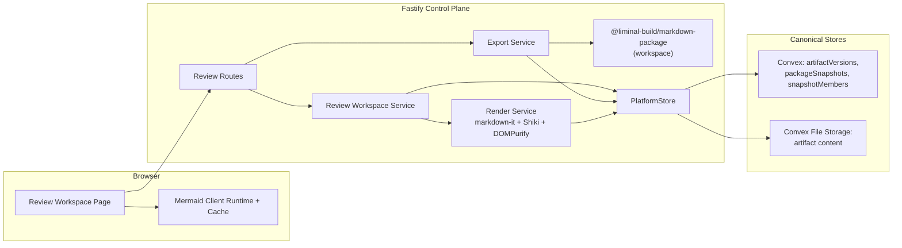
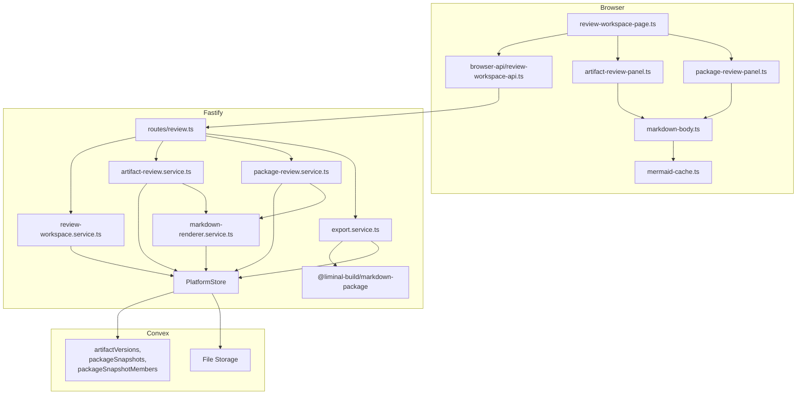

# Technical Design: Artifact Review and Package Surface

## Purpose

This document translates Epic 4 into implementable architecture for the first durable review and package surface in Liminal Build. It is the index document for a four-file tech design set:

| Document | Role |
|----------|------|
| `tech-design.md` | Decision record, spec validation, inherited architecture, system view, module architecture overview, dependency research, work breakdown |
| `tech-design-server.md` | Fastify routes, review and render services, export pipeline, Convex schema additions, workspace package internals, security hardening |
| `tech-design-client.md` | Review route, workspace page composition, markdown render container, client-side Mermaid with placeholder hydration, version switching, degraded-state rendering |
| `test-plan.md` | TC-to-test mapping, fixture strategy, chunk test counts, verification plan |

The downstream consumers are:

| Audience | What they need from this design |
|----------|---------------------------------|
| Reviewers | Clear architectural decisions, visible security risks, and explicit MDV-lift boundaries before implementation begins |
| Story authors | Stable chunk boundaries, coherent AC groupings, and clear technical targets for story enrichment |
| Implementers | Exact file paths, workspace package seams, Convex schema, interface targets, and verification gates |

## Spec Validation

Epic 4 is designable, with one correction already applied and two clarifications captured below. The spec now anchors the export format to the Liminal Build markdown package (`.mpkz`) primitive, keeps review entry tied to the existing process-surface `review` action, and separates bounded degraded-target failures from request-level errors.

Before starting design, the original spec specified `application/zip` for the export content type, written without consulting the `mdv` reference project that already provides the intended package format. That mismatch surfaced during the dependency research pass and was corrected in-place in the epic: `.mpkz` (tar + gzip) with an `_nav.md` manifest is now the first-cut export. The remaining clarifications are scoped to how render content is transported to the browser and how durable version identity is resolved.

### Issues Found

| Issue | Spec Location | Resolution | Status |
|-------|---------------|------------|--------|
| Export format initially specified as `application/zip`; correct Liminal Build intent is the `.mpkz` markdown package format from the `mdv` reference project | Feature Overview, Scope, AC-5, Data Contracts → Export Package Response | Epic revised to specify `.mpkz`, `application/gzip`, `_nav.md` manifest, and new `packageFormat` field | Resolved |
| `Artifact Version Detail.body` field name suggests raw markdown source; server-side render is the stronger implementation fit (smaller client bundle, centralized sanitization, matches MDV pattern) | Data Contracts → Artifact Version Detail | Design interprets `body` as **server-rendered, sanitized HTML** with Mermaid fences replaced by placeholder divs. `mermaidBlocks` carries the raw Mermaid sources for client-side hydration into those placeholders. The field name is kept as-is; the tech design documents the contract shape explicitly. | Resolved — clarified |
| `application/gzip` on a `.mpkz` file is the IANA-registered content type for gzip-wrapped content; the inner tar stream format is not reflected in the HTTP contentType | Data Contracts → Export Package Response | Keep `application/gzip`. The tar inside the gzip is a Liminal Build format detail carried by `packageFormat: 'mpkz'`, not by MIME type. Client and clients unpacking via `tar -xzf` get the right behavior. | Resolved — clarified |
| Current Epic 3 artifact write path overwrites `artifacts.contentStorageId` rather than preserving prior revisions; AC-2.1 ("earlier version remains available for review") cannot be satisfied against that schema | `convex/artifacts.ts` (Epic 3 closure chunks); AC-2.1, AC-2.3 | **Shape A — direct schema change to Epic 3's artifacts table.** Trim `artifacts` to identity-and-attachment (`projectId`, `processId`, `displayName`, new `createdAt`). Remove `contentStorageId`, `currentVersionLabel`, and `updatedAt`. All three relocate to or are derived from the new `artifactVersions` table, one row per revision. Epic 3's checkpoint writer path modifies from overwrite-in-place to append-a-version-row. Single source of truth for "current artifact content" = `latest artifactVersions row by createdAt`. Epic 4 owns this storage model change because pre-customer stance in Epic 3's addendum permits direct schema edits (no user-data preservation required) and the removed fields have no long-term callers yet. | Resolved — deviated |
| Export response contract has `downloadUrl` and `expiresAt` fields that imply a two-phase export flow, but initial server-side Flow 5 design described a single-phase inline streaming response | Data Contracts → Export Package Response; AC-5 | **Two-phase flow.** POST `/api/.../packages/:packageId/export` returns 200 JSON `ExportPackageResponse` with a signed GET URL. Client renders a download link; user-initiated GET streams the `.mpkz` bytes. Expired URL retrieval returns 404 `REVIEW_TARGET_NOT_FOUND`, matching TC-5.3b. | Resolved — clarified |
| `PackageMemberReview.artifact` was typed as `ArtifactReviewTarget`, which has no `status`/`error` fields to carry per-member degradation for the selected member | Flow 4, AC-4.4, AC-6.3 | Reshape `PackageMemberReview` to carry its own `status: 'ready' \| 'unsupported' \| 'unavailable'` and optional `error: ReviewTargetError`. `artifact` becomes optional, populated only when `status === 'ready'`. | Resolved — clarified |
| Default package member selection was "first member by position," but AC-4.3c specifies "the first *reviewable* member in package order" | AC-4.3c | Default selection resolves to `members.find(m => m.status === 'ready') ?? members[0]`. Falls through to the first member only when no member is ready (the package is already in degraded state at that point and identity still renders). | Resolved — clarified |
| Package exportability signal is consumed by the client (to hide the export trigger for non-exportable packages) but was not defined on the `PackageReviewTarget` contract | AC-5.1b | Add `exportability: { available: boolean; reason?: string }` to `PackageReviewTarget`. Computed server-side from member statuses. Client renders the trigger only when `available === true`. | Resolved — clarified |
| Epic 4 ships the `publishPackageSnapshot` typed internal mutation but no production caller; AC-4 and AC-5 (package review + export) read as unconditional user-deliverable outcomes in the epic, but end-to-end package review can only be exercised once a downstream process-module epic lands a production publisher | Feature Overview, AC-4, AC-5, Dependencies → Process dependencies | Epic scope was clarified in-place: artifact review is unconditionally user-deliverable in this epic, while package review/export ship as platform substrate that lights up when downstream process-module epics call `publishPackageSnapshot` from production flows. The epic now reflects that split in Feature Overview, In Scope, Dependencies, and the package-review/export flow intros. | Resolved — clarified |
| `review` enablement was initially pointed at `process-section.reader.ts`; the actual seam that gates the user's click is `apps/platform/server/services/processes/process-work-surface.service.ts` (the `case 'review':` branch around line 278) | — (design drafting error) | Corrected: primary seam is `process-work-surface.service.ts`; secondary seam is the `availableActions` projection in `platform-store.ts` for descriptive consistency with the shell. `process-section.reader.ts` is unchanged | Resolved — corrected |
| Artifact summary migration (how `currentVersionLabel` and `updatedAt` on `ArtifactSummary` continue to work after `artifacts.contentStorageId` is dropped) was not explicit in the first revision | — (design drafting gap) | `ArtifactSummary` schema unchanged; fields derived at read time from `artifactVersions[latest]` via a new `getLatestArtifactVersion` helper on `PlatformStore`. `materials-section.reader.ts` MODIFIED to co-query version rows per artifact. No denormalized latest cache on `artifacts` | Resolved — clarified |

Everything remaining is design work, not spec repair. Two items above (artifact storage model change, two-phase export flow) are load-bearing enough to affect the work breakdown directly — they are called out explicitly in the relevant chunks.

## Context

Epic 4 is the first slice of Liminal Build's review layer. Epic 1 established the project shell, Epic 2 the process work surface, and Epic 3 the environment lifecycle and durable checkpointing that turns process-local work into canonical artifact state. What Epic 3 ends with is a process that can produce durable artifact outputs and code-change records — but those outputs are only visible as current-state projections on the process surface. You cannot yet open an artifact, read its body, compare it to a prior version, or bundle a set of artifacts as a reviewable output package. Epic 4 fills exactly that gap.

The platform's longest-standing constraint is that the process work surface is process-aware, not a generic document browser. Review has to inherit that stance. Users enter review from the process they are working on, with that process context carried forward. The review workspace is not a cross-project artifact library, not a global archive, and not a substitute for source-management workflows — all of those are explicitly deferred. What review is, in Epic 4, is a dedicated surface that opens one artifact or one durable output package, preserves markdown structure and Mermaid diagrams in place, surfaces version history on one artifact, and exports a bounded package for users who need the outputs outside the platform.

The reference project `mdv` shapes significant portions of this design. MDV is an Electron/web markdown workspace Lee authored earlier, and it solved three problems Epic 4 needs answered: a server-side markdown rendering pipeline that handles GFM extensions and Mermaid extraction safely, an in-browser Mermaid renderer with LRU caching keyed on source and theme, and a durable `.mpk` / `.mpkz` markdown package format with a purpose-built library and CLI (`mdvpkg`). The design lifts MDV's render pipeline and pkg library wholesale, extends the pkg library with streaming/in-memory entry APIs for Liminal Build's Convex File Storage content source, and ships `mdvpkg` as a Liminal Build user tool so exports can be inspected locally. What the design does *not* lift is MDV's filesystem-oriented content path: Liminal Build's artifact content lives in Convex File Storage, not on local disk, and the review workspace reads that content through the `PlatformStore` boundary rather than reading files.

One posture change matters. MDV ingests markdown that humans authored locally; Liminal Build ingests markdown that agentic processes produced. That shift raises the bar on content sanitization: raw-HTML passthrough (`markdown-it` `html: true`, which MDV uses) is not safe, Mermaid's in-fence `%%{init}%%` directives can override the strict security level (real CVE class behind LobeChat RCE, Docmost, OneUptime), and DOMPurify's config defaults are not enough on their own. The tech design layers three defenses on top of MDV's baseline — stricter `markdown-it`, pre-render Mermaid directive stripping, and hardened DOMPurify post-passes on both markdown HTML and Mermaid SVG — and that stacking is visible throughout the flow design so nothing gets silently dropped.

The second posture change is durability. MDV treats documents as mutable local files. Liminal Build treats every artifact as a durable, versioned, process-published record. Epic 4 introduces two new durable concerns — `artifactVersions` as the versioned content pointer (one row per revision, each row pointing at its own Convex File Storage blob), and `packageSnapshots` plus `packageSnapshotMembers` as the durable, ordered, stable-forever record of what was published as one reviewable set. Epic 4 also modifies Epic 3's artifact schema: `contentStorageId`, `currentVersionLabel`, and `updatedAt` all come off the `artifacts` row, relocating to or being derived from `artifactVersions`. What remains on `artifacts` is identity-and-attachment only (`projectId`, `processId`, `displayName`, and a new `createdAt`). Epic 3's checkpoint path is updated to insert a new version row rather than overwrite in place. A package published today must still point at the same artifact versions after a member is revised tomorrow; that "pinned at publication" property is fundamental to review semantics and is expressed directly in the schema. Epic 4 does not own *when* packages get published or *what goes in them* — that decision lives in downstream process-module epics. What Epic 4 owns is the storage contract, the typed internal mutations that downstream callers use to write to the tables, and the test coverage that proves the contract is correct.

The review surface itself is intentionally simpler than the process work surface: no live updates, no websocket subscription, no same-session reconciliation. A durable bootstrap returns the review workspace state, reopen restores durable state, and one failing review target degrades to a bounded failure envelope without taking down the rest of the surface. That simpler contract means the client work is significantly lighter than the process surface — no second live transport, no complex reconnect/sequence logic — which in turn makes room for the genuinely new surface concerns: markdown rendering, Mermaid hydration, version switching, and package navigation.

## Dependency Research

Epic 4 introduces a coherent markdown-and-packaging stack into the repo. Nothing here is inferred from training data; every version, advisory, and compatibility claim was validated against current npm registry data, GitHub advisory databases, and community issue trackers during the Epic 4 research pass on 2026-04-16. Findings that deviate from the reference project's (`mdv`) resolved versions are called out explicitly.

### Inherited Decisions

The platform architecture already settles the larger technical world. Epic 4 inherits these decisions without re-litigation:

| Area | Current Choice | Source |
|------|----------------|--------|
| Runtime | Node 24 active LTS (`>=24.14.0 <25`) | Platform tech arch + current repo |
| Control plane | Fastify 5 monolith | Platform tech arch + current repo |
| Client build | Vite 8 | Platform tech arch + current repo |
| Durable store | Convex 1.35 behind `PlatformStore` | Platform tech arch + current repo |
| File content storage | Convex File Storage (`contentStorageId` pointer; Epic 4 relocates the pointer from `artifacts` to the new `artifactVersions` table — see Issues Found) | Epic 3 implementation addendum + Epic 4 storage model change |
| Auth | WorkOS mediated by Fastify | Platform tech arch + current repo |
| Validation | Zod 4.3 schemas at all contract boundaries | Platform tech arch + current repo |

### Epic-Scoped Stack Additions

Every package below was validated against current ecosystem state. The "Research-confirmed" column captures the decisive finding — a security patch, a known regression, a maintenance signal — that justifies the pin.

| Package | Version | Purpose | Research Confirmed |
|---------|---------|---------|-------------------|
| `markdown-it` | `14.1.1` | Core markdown parser | Latest; patches CVE-2026-2327 (linkify ReDoS); userland `punycode.js` so no Node 24 `DEP0040` warnings |
| `@shikijs/markdown-it` | `4.0.2` | Shiki syntax highlighting as a markdown-it plugin | Latest; pinned in lockstep with `shiki`; `engines: node >=20` |
| `shiki` | `4.0.2` | Syntax highlighting with themed output | Latest; **requires `skipLibCheck: true`** in tsconfig until shiki #1254 (dts regression under TS 6) closes; bundle-size budget managed by fine-grained imports (`shiki/core` + `@shikijs/engine-oniguruma`, not `shiki/bundle/full`) |
| `isomorphic-dompurify` | `3.9.0` | **Server-side only** — DOMPurify over jsdom for the markdown-rendered HTML sanitize pass | **Upgraded from MDV's 3.5.1**: MDV transitively resolves vulnerable `dompurify@3.3.3` (GHSA-39q2-94rc-95cp, `FORBID_TAGS` bypass). 3.9.0 pins `dompurify ^3.4.0`; engines `>=24.0.0` matches target |
| `dompurify` | `^3.4.0` (pnpm override) | **Client-side direct dependency + server-side transitive via isomorphic-dompurify.** Used directly on the client for Mermaid SVG sanitization — importing `isomorphic-dompurify` client-side would bundle jsdom into the browser build | Security-critical override — closes the ADD_TAGS/FORBID_TAGS short-circuit and four April-2026 advisories. Single version pinned across server and client via the root pnpm override so sanitizer behavior is identical both sides |
| `mermaid` | `11.14.0` | Client-side diagram rendering | **Upgraded from MDV's 11.13.0**: fixes sequence-diagram theme bug #7546 and adds SVG ID dedup (directly relevant when rendering multiple diagrams per artifact) |
| `tar-stream` | `3.1.8` | Low-level tar byte format (inside the workspace package only) | Latest; no advisories against the library itself; lightly maintained (13-month gap 3.1.7 → 3.1.8) — flagged as deferred replacement |
| `@types/tar-stream` | `^3.1.4` | Types for the above | devDep, current |

### Vendored Code (Not External Dependencies)

Three capabilities move from npm-dep-land into source code we own, following the project's "reduce attack surface where not required" principle:

| Capability | Origin | Placement |
|------------|--------|-----------|
| `github-slugger` | Small, zero-dep, ESM-native, 3.5 years stable | Vendored inline at `apps/platform/server/services/rendering/github-slugger.ts` |
| `markdown-it-anchor` | Heading anchor plugin for markdown-it, 19 months stable, dual ESM/CJS | Vendored inline at `apps/platform/server/services/rendering/markdown-it-anchor.ts` |
| Task-list rendering | `markdown-it-task-lists` is abandoned (2018) and CJS-only — not lifted | Purpose-built at `apps/platform/server/services/rendering/markdown-task-lists.ts`, ~50-100 LOC, emits always-disabled-in-label output for the read-only review surface |

### Workspace Package (Lifted from MDV)

MDV's `src/pkg/` tree becomes a first-class Liminal Build workspace package:

| Package | Path | Exports |
|---------|------|---------|
| `@liminal-build/markdown-package` | `packages/markdown-package/` | Library: `createPackage`, `createPackageFromEntries` (new streaming API), `extractPackage`, `inspectPackage`, `listPackage`, `getManifest`, `readDocument`, `parseManifest`, `scaffoldManifest`. CLI: `mdvpkg` |

Server-side export reads Convex File Storage content and pipes it through `createPackageFromEntries` (the new streaming API) into a byte stream served on a GET download URL — no temp files, no double-buffering. Users who download a `.mpkz` can inspect it locally with the `mdvpkg` CLI that ships from the same package.

**Monorepo wiring required.** The current repo workspace only lists `apps/*`; Epic 4 adds a `packages/*` glob. Explicit root-level changes:

| File | Change |
|------|--------|
| `pnpm-workspace.yaml` | Add `packages/*` to the `packages` list |
| `package.json` (root) | Extend `build` script to include workspace packages (e.g., `pnpm -r --filter "./packages/*" build`); add new `test:packages` script wired into `verify` and `verify-all` |
| `packages/markdown-package/package.json` | Declare `scripts.build`, `scripts.typecheck`, `scripts.test`; declare `tar-stream@3.1.8` as the only runtime dependency |
| `packages/markdown-package/tsconfig.json` | Extend the repo's base tsconfig; declare `composite: true` for project-reference incremental builds |
| `tsconfig.json` (root) | Add a project reference to the new workspace package |

These changes are listed explicitly so Chunk 0 has the full set of monorepo edits in one place rather than discovering them mid-implementation.

### Considered and Rejected

| Option | Resolution | Why |
|--------|------------|-----|
| Use generic `archiver` / `jszip` for export | Rejected | Bypasses the MDV-derived format that is the intended Liminal Build package primitive |
| Migrate to `@mdit/plugin-tasklist` instead of writing our own | Rejected | Adds an external dep for ~50 LOC of logic; rolling our own reduces surface cleanly |
| Replace `tar-stream` with custom ustar implementation for Epic 4 | Deferred | Feasible and small, but outside Epic 4's critical path; logged in Deferred Items |
| Shell out to system `tar` binary | Rejected for Epic 4 | Temp-file round-trip for Convex-sourced content adds complexity without removing the `tar-stream` dep (it just moves into the workspace package) |
| Upgrade to `node-tar` | Rejected | Heavier API, more transitive deps, longer CVE history than `tar-stream`; no meaningful improvement for our narrow use case |
| `tar-fs` | Rejected | Active CVEs (GHSA-xrg4-qp5w-2c3w, CVE-2024-12905, CVE-2025-48387) in the link-handling code we explicitly refuse to use |

### Known Transitive Limitation

`pnpm audit` remains broken in this repo because the underlying npm audit endpoint returns 410, and `npm audit` is not a valid substitute without a `package-lock.json`. Epic 3's tech design already flagged this; Epic 4 inherits the same limitation. Direct-dependency pressure testing via manual registry + advisory DB lookups is the current ceiling. A pnpm-compatible transitive-audit workflow should land before environment/runtime dependency work is treated as fully validated — tracked in Deferred Items alongside Epic 3's note.

## Tech Design Question Answers

### Q1. What exact durable schema should represent artifact versions and version content without collapsing generic artifact storage into one process-specific ontology?

Three new Convex tables — `artifactVersions` (one row per durable version of one artifact), `packageSnapshots` (one row per published package), and `packageSnapshotMembers` (many rows per snapshot) — plus a storage model change on the existing `artifacts` table (Epic 3's `contentStorageId` field moves out; this is a schema rewrite, not a data-preserving user-data migration). All three new tables are generic at the platform level: process-type-specific semantics (which artifacts constitute a reviewable package for a `FeatureSpecification` vs. a `FeatureImplementation`) stay in downstream process-module code, not in this schema.

After the migration, `artifacts` carries only identity-and-attachment fields: `projectId`, `processId`, `displayName`, and a new `createdAt` field. Previously-stored `contentStorageId`, `currentVersionLabel`, and `updatedAt` are removed. No version-specific state remains on the row.

`artifactVersions` stores `artifactId`, `versionLabel`, `contentStorageId` (the Convex File Storage handle, relocated here from `artifacts`), `contentKind` (`markdown` or `unsupported`), `bytes`, `createdAt`, and `createdByProcessId`. One row per revision; content itself still lives in Convex File Storage. "Current artifact content" is the latest row by `createdAt` — a single source of truth, no denormalized field to keep in sync.

`packageSnapshots` stores `processId`, `displayName`, `packageType`, `publishedAt`. `packageSnapshotMembers` stores `packageSnapshotId`, `position`, `artifactId`, and **`artifactVersionId`** — the durable pin. A package published today must still point at the same member versions after a later revision lands, and the version id on each member row is what makes that property inviolate. Both tables are immutable after `publishPackageSnapshot` writes them transactionally.

Epic 3's checkpoint writer path is rewritten as part of this work: instead of overwriting `artifacts.contentStorageId`, it calls `insertArtifactVersion(artifactId, contentStorageId, versionLabel, contentKind, bytes, createdByProcessId)` — a typed internal mutation Epic 4 introduces. Epic 4 does not own the *decision* to publish a package (that lives in downstream process-module epics), but it does own the typed `publishPackageSnapshot(processId, displayName, packageType, members)` internal mutation that process-module code calls when it decides to publish.

Full field lists, validators, index plans, and the rewrite of the Epic 3 checkpoint path are in `tech-design-server.md` under Durable State Model.

### Q2. What exact review-route and browser-state model should preserve process-aware review context while allowing direct reopen of one artifact or package?

The review route is `/projects/:projectId/processes/:processId/review` with query-string target selection (`?targetKind=artifact&targetId=...&versionId=...` or `?targetKind=package&targetId=...&memberId=...`). The route is one level deeper than the process work surface and always carries the process context forward. Entry from the process surface's `review` action populates the query state; direct reopen from a bookmark or browser history deserializes the query state and loads the same target.

Client state extends the existing `AppState` with a new `reviewWorkspace` slice, disjoint from `projectShell` and `processSurface`. The review workspace is not a second live surface; there is no WebSocket subscription for it in Epic 4. Bootstrap is a single HTTP fetch against the review endpoint, and reopen replays the same bootstrap against durable state.

Full client state shape, route parsing logic, and bootstrap sequencing are in `tech-design-client.md`.

### Q3. What exact markdown and Mermaid rendering strategy should the app use inside the Fastify/Vite platform boundary?

Server-side markdown rendering, client-side Mermaid hydration, with defense-in-depth sanitization at both layers.

On the server, `markdown-it@14.1.1` is configured with `html: false` (stricter than MDV — we ingest agentic output, not user-authored files), extended with `@shikijs/markdown-it` (Shiki syntax highlighting), the vendored `markdown-it-anchor` (with the vendored `github-slugger`), and the purpose-built task-list renderer. Mermaid fences are intercepted: the server strips `%%{init}%%`, `%%{config}%%`, and `%%{wrap}%%` directives from each Mermaid source (closing the LobeChat/Docmost/OneUptime CVE class), then emits a placeholder div (`<div class="mermaid-placeholder" data-block-id="..."></div>`) into the rendered HTML and returns the sanitized Mermaid source as a sidecar entry in the `mermaidBlocks` array on the response. `isomorphic-dompurify@3.9.0` post-processes the rendered HTML with `USE_PROFILES: { html: true }` plus `FORBID_TAGS: ['style', 'math', 'form']`, `FORBID_ATTR: ['style']`, `ALLOW_DATA_ATTR: false`, `ALLOW_ARIA_ATTR: false`, and a narrow `ADD_ATTR: ['data-block-id']` allowlist for the Mermaid placeholder. SVG does not appear in the server-rendered HTML (Mermaid SVG is generated and sanitized client-side).

On the client, the rendered HTML mounts into a dedicated container element via `innerHTML` (the server has already sanitized it). The client then locates each `.mermaid-placeholder` element and calls `mermaid.render(freshId, source)` for the matching `mermaidBlocks[]` entry. An LRU cache (lifted from MDV's `mermaid-cache.ts`, keyed on `fnv1a(source):themeId`) memoizes rendered SVGs. The returned SVG strings are DOMPurify-sanitized on the client with `USE_PROFILES: { svg: true, svgFilters: true }` and `FORBID_TAGS: ['foreignObject']` (Mermaid's main XHTML escape hatch; we don't need KaTeX labels in first cut) before insertion into the placeholder.

`mermaid.initialize()` runs once per session with MDV's defaults extended: `{ startOnLoad: false, securityLevel: 'strict', theme: <app theme>, suppressErrors: true, logLevel: 'fatal', flowchart: { htmlLabels: false } }`. The `flowchart.htmlLabels: false` is belt-and-suspenders against the string-`"false"` bypass class that has slipped past strict mode in other Mermaid integrations.

Full rendering pipeline shape, fence-interception rule ordering, and client-side hydration contract are in `tech-design-server.md` (Flow 4) and `tech-design-client.md` (Flow 3).

### Q4. What exact package membership model should define a reviewable output set in the generic platform layer before process-specific epics enrich it further?

A package is a **durable process-published snapshot of a fixed ordered set of artifact versions**. Membership is captured by `packageSnapshotMembers` rows, each of which pins (`packageSnapshotId`, `position`, `artifactId`, `artifactVersionId`). The `(artifactId, artifactVersionId)` pair is the source of truth for what the package contains — revising the artifact later publishes a new `artifactVersions` row, but the snapshot's member row continues pointing at the original version id. Snapshots do not mutate.

The platform layer exposes snapshots as opaque ordered lists. The `packageType` field is a user-visible string ("Feature Specification Package", "Feature Implementation Output Package") that downstream process-module code sets when publishing; Epic 4 does not hard-code one ontology for all process types. Who publishes a snapshot, when, and which artifact versions get included are all process-module concerns. Epic 4 owns only the storage, retrieval, review, and export of published snapshots.

Full table shape, index plan, and read-path projection are in `tech-design-server.md`.

### Q5. What exact fallback path should the workspace use for unsupported artifact formats in this slice?

The `contentKind` field on `ArtifactVersionDetail` takes values `markdown` or `unsupported`. Epic 4's first-cut renderer only handles `markdown`; everything else reports `contentKind: unsupported` and the review workspace shows the artifact identity, version identity, and a clear unsupported-format affordance without attempting to render content. The server does not inspect content bytes for format detection — `contentKind` is set at artifact-version insert time based on the producing process's declaration. Future epics that extend the renderer can add new `contentKind` values without schema migration.

The unsupported path is a bounded degraded state, not a hard error. The review target still loads (`status: unsupported`), the review workspace stays open, navigation continues to work, and the user sees enough to tell that a reviewable version exists but isn't renderable in this release. `REVIEW_TARGET_UNSUPPORTED` is the error-code label inside the bounded failure envelope.

### Q6. How should review-target failures degrade when identity loads but rendering or one package member fails?

The failure boundary sits one level below the review workspace envelope. Request-level errors (401, 403, 404, 503) apply only to resolution and authorization — the response cannot be produced at all. Once project identity, process identity, and target identity resolve, the response always returns 200 with the review workspace envelope populated. Problems *inside* that envelope surface as bounded degraded states on specific fields:

- `target.status = error | unsupported | unavailable` with a populated `target.error` record when the whole target is degraded (unsupported format, render failure, artifact unavailable)
- Inside an artifact review target, `selectedVersion.bodyStatus = error` with a populated `selectedVersion.bodyError` when markdown rendering fails for that version specifically
- Inside a package review target, `members[].status = unsupported | unavailable` for per-member list degradation; the `PackageMemberReview` envelope for the currently selected member carries its own `status` and optional `error` distinct from the inner `artifact` field (which is populated only when `status === 'ready'`)
- Mermaid diagram failures are client-side only — they are not reported through the server response; the client renders each diagram independently, catches individual render errors, and shows a per-diagram failure placeholder

This matches the section-envelope degradation idiom established in the project shell (Epic 1) and the process work surface (Epic 2). The review workspace response envelope is never replaced by an error object when the core identity resolves — the client always has enough structure to render *something*.

## System View

Epic 4 extends the existing process work surface with a new dedicated review surface. No new external systems are introduced; Convex remains the durable store, Convex File Storage remains the artifact content source, and WorkOS remains the auth provider. The only new piece is a workspace package for the `.mpkz` format, which itself depends only on Node built-ins and `tar-stream`.

### Top-Tier Surfaces Touched

| Surface | Source | This Epic's Role |
|---------|--------|-----------------|
| Processes | Inherited from platform tech arch + current process route | Process work surface's `review` action becomes actionable (page dispatches to the new review route); server-side controls projection consults reviewability to drive `controls[review].enabled` — no new contract field |
| Artifacts | Inherited from platform tech arch + current materials surface | **Schema migration**: `artifacts.contentStorageId` removed; content pointer moves to new `artifactVersions` table. Epic 3's checkpoint writer rewired from overwrite-in-place to append-version-row |
| Review | **New platform-owned surface introduced by this epic** | Owns review route, review workspace bootstrap, per-target render, and package navigation |
| Packages | **New platform-owned surface introduced by this epic** | Owns durable package snapshot tables + typed internal mutations for insert; does not own the *decision* to publish (that lives in downstream process-module epics) |
| Shared contracts | Inherited from current technical baseline | Contract extension point for review-surface request/response schemas and review-target error codes |

### System Context Diagram



### Browser-Facing Entry Points

| Surface | Path | Role |
|---------|------|------|
| Review route HTML | `/projects/:projectId/processes/:processId/review` | Authenticated shell entry for the review workspace; query string carries target selection |
| Review workspace bootstrap API | `GET /api/projects/:projectId/processes/:processId/review` | Returns project + process + availableTargets + optional target for the selected review target |
| Artifact review target API | `GET /api/projects/:projectId/processes/:processId/review/artifacts/:artifactId` | Returns one artifact's version list, selected version detail, and Mermaid sidecar |
| Package review target API | `GET /api/projects/:projectId/processes/:processId/review/packages/:packageId` | Returns one package snapshot with members and the selected member's artifact detail |
| Export package action | `POST /api/projects/:projectId/processes/:processId/review/packages/:packageId/export` | Streams a `.mpkz` archive through the workspace package's streaming entry API and returns export metadata for download |

The existing process work-surface bootstrap (`GET /api/projects/:projectId/processes/:processId`) is *not* changed structurally by Epic 4. The `review` action's enablement is driven inside `apps/platform/server/services/processes/process-work-surface.service.ts` — specifically the existing `case 'review':` branch that computes `{ enabled, disabledReason }` from process status. Epic 4 extends that branch to also consult reviewability (`artifactVersions` and `packageSnapshots` for the process) before setting `enabled: true`. The shell-level process-list projection in `apps/platform/server/services/projects/platform-store.ts` gets the same reviewability check applied to its `availableActions` list so the shell and the process surface agree on whether `review` is offered. The `ProcessSummary` contract adds no new field; enablement stays private to the server's controls-computation logic and evolves there if the rule changes later.

### Canonical Boundaries

| Boundary | Design Consequence |
|----------|--------------------|
| Browser → Fastify only | Review client never talks directly to Convex or File Storage |
| Fastify → Convex through `PlatformStore` | Durable version identity and snapshot membership are server-owned; no client-side mutation of version records |
| File content retrieval via Convex File Storage URL | Fastify obtains a Convex-issued URL via `ctx.storage.getUrl()` and fetches content once per render — **the URL never leaves the Fastify process**. `ctx.storage.getUrl()` returns a URL whose storage ID is the sole credential (verified against Convex docs + maintainer guidance in get-convex/convex-backend#328 on 2026-04-17): the URL is fully public, does not expire, cannot be revoked short of blob deletion, and anyone who obtains it can fetch the content. Fastify therefore acts as an auth-proxy: it reads with the storage URL internally and streams bytes through its own authenticated route. Storage URLs are **never** returned in HTTP response bodies, never written to structured logs, never included in error payloads, and never visible to browser code |
| Server renders markdown; client renders Mermaid | Shiki stays out of the client bundle; Mermaid stays out of the server runtime; neither has to know about the other's engine |
| `@liminal-build/markdown-package` is the only code that knows about tar bytes | `tar-stream` never leaks into the Fastify server's direct dependencies or into the browser bundle |

### Runtime Prerequisites

| Prerequisite | Where Needed | Status |
|--------------|--------------|--------|
| Node 24.x and `pnpm@10.33.0` | Local + CI | Inherited from repo |
| Convex deployment + app env vars | Local + CI | Inherited from repo |
| Convex File Storage enabled | Local + CI | Inherited from Epic 3 (already in use for artifact content) |
| WorkOS credentials | Local + CI | Inherited from repo |
| No external tar/gzip binary required | — | The workspace package uses `tar-stream` + Node's built-in `zlib`; no shell-out |

## Module Architecture Overview

Epic 4 introduces a new workspace package, a new client feature tree, and two new server service subtrees. Existing files are modified at well-defined seams.

### Module Responsibility Matrix

| Module | Status | Responsibility | ACs Covered |
|--------|--------|----------------|-------------|
| `packages/markdown-package/` | **NEW workspace package** | Lifted from MDV `src/pkg/`. Library: create / extract / inspect / list / getManifest / readDocument. New: `createPackageFromEntries` streaming API for Convex-backed content. CLI: `mdvpkg`. | AC-5 (export) |
| `apps/platform/server/routes/review.ts` | NEW | Review workspace HTML route and review API routes (bootstrap, artifact, package, export) | AC-1 to AC-6 |
| `apps/platform/server/services/review/review-workspace.service.ts` | NEW | Assemble review workspace bootstrap response from target availability | AC-1, AC-6 |
| `apps/platform/server/services/review/artifact-review.service.ts` | NEW | Resolve one artifact's versions, fetch content for selected version, render, emit response | AC-2, AC-3, AC-6 |
| `apps/platform/server/services/review/package-review.service.ts` | NEW | Resolve one package snapshot + members, fetch selected member's artifact version content, render | AC-4, AC-6 |
| `apps/platform/server/services/review/export.service.ts` | NEW | Stream artifact content from Convex File Storage through `@liminal-build/markdown-package` into the Fastify reply body | AC-5 |
| `apps/platform/server/services/rendering/markdown-renderer.service.ts` | NEW | Server-side markdown → sanitized HTML + Mermaid sidecar pipeline (markdown-it + Shiki + DOMPurify + Mermaid fence interception + directive stripping) | AC-3 |
| `apps/platform/server/services/rendering/github-slugger.ts` | NEW (vendored) | Heading slug generator; vendored inline from `github-slugger` | AC-3 |
| `apps/platform/server/services/rendering/markdown-it-anchor.ts` | NEW (vendored) | Heading anchor plugin for markdown-it; vendored inline from `markdown-it-anchor` | AC-3 |
| `apps/platform/server/services/rendering/markdown-task-lists.ts` | NEW (our own) | ~50-100 LOC task list renderer; always-disabled-in-label output for read-only review | AC-3 |
| `apps/platform/server/services/rendering/mermaid-sanitize.ts` | NEW | Strips `%%{init}%%`, `%%{config}%%`, `%%{wrap}%%` directives from Mermaid fences before rendering; extracts mermaid sources for sidecar | AC-3 |
| `apps/platform/server/services/projects/platform-store.ts` | MODIFIED | Add reads for `artifactVersions`, `packageSnapshots`, `packageSnapshotMembers`; add `getArtifactVersionContentUrl` helper; add typed internal-mutation wrappers for `insertArtifactVersion` and `publishPackageSnapshot` | AC-1 through AC-6 |
| `apps/platform/server/services/processes/process-work-surface.service.ts` | MODIFIED | **Primary seam for `review` enablement.** The current `case 'review':` branch (`~line 278`) computes `enabled` from process status only. Epic 4 extends it to also consult reviewability: `enabled = true` when the process status permits review AND at least one reviewable target exists (`artifactVersions` row or `packageSnapshots` row for the process). `disabledReason` is populated accordingly. This is where the user's actual click on the process-surface `review` control is gated | AC-1.1 |
| `apps/platform/server/services/projects/platform-store.ts` (shell `availableActions`) | MODIFIED | Secondary seam for descriptive consistency: the shell-level process-list projection's `availableActions` includes `'review'` based on lifecycle status. Extend the same reviewability check so the shell summary matches what the process surface actually lets the user do | AC-1.1 |
| `apps/platform/shared/contracts/review-workspace.ts` | NEW | Zod schemas for review bootstrap, artifact review, package review, export responses, review error codes, and the `PackageMemberReview` member-review envelope with its own status/error | AC-1 through AC-6 |
| `apps/platform/shared/contracts/state.ts` | MODIFIED | Add `ReviewWorkspaceState` route and state slices | AC-1, AC-6 |
| `apps/platform/client/app/router.ts` | MODIFIED | Add review-workspace route parsing | AC-1, AC-4, AC-6 |
| `apps/platform/client/app/bootstrap.ts` | MODIFIED | Bootstrap review route with durable workspace fetch; add `onReview` navigator passed to process work surface page | AC-1, AC-6 |
| `apps/platform/client/app/shell-app.ts` | MODIFIED | Page-selection hub adds review-workspace page | AC-1 |
| `apps/platform/client/app/store.ts` | MODIFIED | Add review workspace state slice | AC-1, AC-6 |
| `apps/platform/client/browser-api/review-workspace-api.ts` | NEW | HTTP API client for review bootstrap, artifact, package, export endpoints | AC-1 through AC-6 |
| `apps/platform/client/features/processes/process-work-surface-page.ts` | MODIFIED | Wire the `review` control's action dispatcher to the `onReview` handler, which navigates to `/projects/:projectId/processes/:processId/review` | AC-1.1 |
| `apps/platform/client/features/review/review-workspace-page.ts` | NEW | Review workspace page composition: header, process context, target selector, body area, degradation | AC-1, AC-2, AC-4, AC-6 |
| `apps/platform/client/features/review/artifact-review-panel.ts` | NEW | One-artifact review render: version switcher, body area, Mermaid hydration | AC-2, AC-3 |
| `apps/platform/client/features/review/package-review-panel.ts` | NEW | One-package review render: member list, package context, selected member area, export control gated on `exportability.available` | AC-4, AC-5 |
| `apps/platform/client/features/review/markdown-body.ts` | NEW | Mounts server-rendered HTML via `innerHTML`, hydrates `.mermaid-placeholder` nodes with client-rendered SVG | AC-3 |
| `apps/platform/client/features/review/mermaid-cache.ts` | NEW (lifted from MDV) | LRU cache keyed on `fnv1a(source):themeId` for rendered Mermaid SVGs | AC-3 |
| `apps/platform/client/features/review/export-trigger.ts` | NEW | Export action UI: POST export → render download link on success; handle failure inline | AC-5 |
| `convex/artifactVersions.ts` | NEW | Durable artifact version rows + typed `internalMutation insertArtifactVersion` + `internalQuery`s for list / get / content-URL | AC-2, AC-6 |
| `convex/packageSnapshots.ts` | NEW | Durable package snapshot headers + typed `internalMutation publishPackageSnapshot` (transactional insert of snapshot + members); immutable after write | AC-4 |
| `convex/packageSnapshotMembers.ts` | NEW | Durable snapshot members pinning (artifactId, artifactVersionId, position); written transactionally inside `publishPackageSnapshot` | AC-4 |
| `convex/artifacts.ts` | **MODIFIED (storage model change)** | Table shape trims to identity-and-attachment: `projectId`, `processId`, `displayName`, and a new `createdAt` field. **Removed fields: `contentStorageId`, `currentVersionLabel`, `updatedAt`** — all three relocate to or are derived from `artifactVersions`. Epic 3's checkpoint writer path is rewritten to insert a new `artifactVersions` row via `insertArtifactVersion` rather than overwrite in place. Every caller of the removed fields is rewritten to use `getLatestArtifactVersion`. See `tech-design-server.md` §Artifact Storage Model Change for the exact field-by-field delta. | AC-2 |
| `apps/platform/server/services/processes/readers/materials-section.reader.ts` | MODIFIED | Artifact summary read-path rewrite: per-artifact projections now co-query `artifactVersions` to derive `currentVersionLabel` (from latest `versionLabel`) and `updatedAt` (from latest `createdAt`, fallback to `artifacts.createdAt`). `ArtifactSummary` schema is unchanged; derivation changes | AC-2 |
| `convex/schema.ts` | MODIFIED | Remove `contentStorageId` from `artifacts` validator; add `artifactVersions`, `packageSnapshots`, `packageSnapshotMembers` tables + indexes | AC-2, AC-4 |

### Module Architecture File Tree

```text
packages/markdown-package/                         # NEW workspace package (lifted from mdv/src/pkg/)
├── package.json                                   # bin: mdvpkg, main: dist/index.js
├── tsconfig.json
├── src/
│   ├── index.ts                                   # library exports
│   ├── cli.ts                                     # mdvpkg CLI
│   ├── types.ts
│   ├── errors.ts
│   ├── manifest/
│   │   ├── parser.ts
│   │   └── scaffold.ts
│   ├── tar/
│   │   ├── create.ts                              # file-path-based create (inherits from mdv)
│   │   ├── create-from-entries.ts                 # NEW streaming in-memory entry API
│   │   ├── extract.ts
│   │   ├── inspect.ts
│   │   ├── list.ts
│   │   ├── manifest.ts
│   │   ├── read.ts
│   │   └── shared.ts
│   └── render/
│       └── index.ts                               # optional markdown render helper (not used by Fastify path)
└── README.md

apps/platform/server/
├── routes/
│   ├── projects.ts                                # EXISTS
│   ├── processes.ts                               # EXISTS
│   └── review.ts                                  # NEW (HTML + API routes + GET download URL handler)
├── services/
│   ├── projects/
│   │   └── platform-store.ts                      # MODIFIED (add artifactVersions + packageSnapshots reads; add content-URL helper; add insertArtifactVersion + publishPackageSnapshot wrappers)
│   ├── processes/
│   │   ├── process-work-surface.service.ts        # MODIFIED (review control enablement consults reviewability — primary seam)
│   │   └── readers/
│   │       └── materials-section.reader.ts        # MODIFIED (artifact summary derives currentVersionLabel + updatedAt from artifactVersions)
│   ├── review/                                    # NEW subtree
│   │   ├── review-workspace.service.ts
│   │   ├── artifact-review.service.ts
│   │   ├── package-review.service.ts
│   │   ├── export.service.ts                      # two-phase: POST returns signed URL JSON; GET streams bytes
│   │   ├── export-url-signing.ts                  # signed download URL mint + verify
│   │   ├── reviewability.ts                       # pure: reviewable target computation
│   │   └── target-resolution.ts                   # pure: target selection from query state
│   └── rendering/                                 # NEW subtree
│       ├── markdown-renderer.service.ts
│       ├── github-slugger.ts                      # vendored
│       ├── markdown-it-anchor.ts                  # vendored
│       ├── markdown-task-lists.ts                 # our own
│       └── mermaid-sanitize.ts

apps/platform/shared/contracts/
├── review-workspace.ts                            # NEW
└── state.ts                                       # MODIFIED

apps/platform/client/
├── app/
│   ├── router.ts                                  # MODIFIED
│   ├── bootstrap.ts                               # MODIFIED (add onReview navigator + review bootstrap wiring)
│   ├── shell-app.ts                               # MODIFIED
│   └── store.ts                                   # MODIFIED
├── browser-api/
│   └── review-workspace-api.ts                    # NEW
└── features/
    ├── processes/
    │   └── process-work-surface-page.ts           # MODIFIED (wire review control's onAction to onReview navigator)
    └── review/                                    # NEW subtree
        ├── review-workspace-page.ts
        ├── artifact-review-panel.ts
        ├── package-review-panel.ts
        ├── markdown-body.ts
        ├── mermaid-cache.ts                       # lifted from MDV
        ├── mermaid-runtime.ts                     # mermaid.initialize + render + SVG sanitize
        ├── target-selector.ts
        ├── version-switcher.ts
        ├── package-member-nav.ts
        ├── export-trigger.ts
        ├── degraded-state.ts
        └── unsupported-fallback.ts

convex/
├── schema.ts                                      # MODIFIED (remove contentStorageId from artifacts; add 3 new tables)
├── artifacts.ts                                   # MODIFIED (identity-and-attachment: projectId/processId/displayName/createdAt; contentStorageId/currentVersionLabel/updatedAt removed)
├── artifactVersions.ts                            # NEW (table + typed insertArtifactVersion + list/get/content-URL)
├── packageSnapshots.ts                            # NEW (table + typed publishPackageSnapshot)
└── packageSnapshotMembers.ts                      # NEW (member rows written transactionally inside publishPackageSnapshot)

pnpm-workspace.yaml                                # MODIFIED (add `packages/*` glob)
package.json (root)                                # MODIFIED (build + test:packages scripts)
tsconfig.json (root)                               # MODIFIED (add reference to workspace package)
```

### Component Interaction Diagram



## Verification Scripts

Epic 4 inherits the repo's existing verification tiers; no new script is needed at the epic level. The workspace package adds its own scoped test lane under the existing `pnpm` workspace script plumbing.

| Script | Purpose | Current Command |
|--------|---------|-----------------|
| `red-verify` | TDD Red exit gate | `corepack pnpm run red-verify` |
| `verify` | Standard development verification | `corepack pnpm run verify` |
| `green-verify` | TDD Green exit gate | `corepack pnpm run green-verify` |
| `verify-all` | Deep verification | `corepack pnpm run verify-all` |

The workspace package's tests run under `corepack pnpm --filter @liminal-build/markdown-package test` and are included in the root `test:service` lane via workspace globbing. A new `test:packages` lane — `corepack pnpm -r --filter "./packages/*" test` — is added to the root `package.json` and wired into both `verify` and `verify-all` so the workspace package's tests never fall out of the default gate.

## Work Breakdown

The chunk structure aligns with Epic 4's story seams so the BA can shard stories cleanly from this design. Each chunk goes through Skeleton → TDD Red → TDD Green before the next begins.

| Chunk | Scope | ACs | Primary Surfaces |
|-------|-------|-----|------------------|
| Chunk 0 | Foundation: monorepo wiring (`pnpm-workspace.yaml`, root `package.json`, root tsconfig), workspace package scaffold with build/test/typecheck scripts, shared contracts, Convex storage model change on `artifacts` (remove `contentStorageId`, `currentVersionLabel`, `updatedAt`; add `createdAt`), new Convex tables, typed internal-mutation skeletons (`insertArtifactVersion`, `publishPackageSnapshot`), vendored slugger/anchor/task-list stubs, rendering pipeline scaffold, test fixtures | supports all | `packages/markdown-package/`, shared contracts, Convex schema, rendering scaffolds, storage model change |
| Chunk 1 | Review entry and workspace bootstrap: review route, durable bootstrap contract, server-side `controls[review].enabled` enablement consulting reviewability, `process-work-surface-page.ts` wiring to navigate on review click, workspace page shell | AC-1.1 through AC-1.4 | review route, review workspace service, process-work-surface-page wiring, client page shell |
| Chunk 2 | Artifact versions and revision review: **rewrite Epic 3 checkpoint path** to insert into `artifactVersions` instead of overwriting `artifacts.contentStorageId`; `artifactVersions` reads; artifact review service; version list + current vs. prior; version switcher; no-version state | AC-2.1 through AC-2.4 | Epic 3 checkpoint path rewrite, `artifactVersions`, artifact review service, artifact review panel |
| Chunk 3 | Markdown and Mermaid rendering: markdown-it + Shiki + DOMPurify pipeline, Mermaid fence interception + directive strip, client-side Mermaid hydration + cache + SVG sanitize, bounded diagram failure, unsupported-format fallback | AC-3.1 through AC-3.4 | markdown-renderer, mermaid-sanitize, markdown-body, mermaid-runtime, mermaid-cache |
| Chunk 4 | Package review workspace: typed `publishPackageSnapshot` internal mutation (tested via Convex test infrastructure, no Epic 4 production caller); `packageSnapshots` + `packageSnapshotMembers` reads; package review service with first-reviewable-member default; `PackageMemberReview` envelope with status/error; member list; package context preservation; member-failure degradation | AC-4.1 through AC-4.4 | `publishPackageSnapshot`, packageSnapshots reads, package review service, package review panel |
| Chunk 5 | Package export (two-phase): streaming `createPackageFromEntries` in the workspace package; tar hardening (gzip-bomb cap, per-entry + cumulative byte caps, entry-name filter); Fastify POST export (returns signed-URL JSON) + GET download (streams bytes); signed URL mint + verify; expired-URL 404; `mdvpkg` CLI polish | AC-5.1 through AC-5.3 | export service, export-url-signing, `@liminal-build/markdown-package/tar/create-from-entries.ts`, export trigger UI |
| Chunk 6 | Reopen and degraded review states: durable reopen across all target kinds, unavailable/forbidden handling on direct review URLs, bounded render failure envelope on reload, accessibility verification | AC-6.1 through AC-6.3 | review workspace service, client router + bootstrap, degraded-state rendering, A11y manual verification |

### Chunk Dependencies

```text
Chunk 0 → Chunk 1 → Chunk 2 → Chunk 3 → Chunk 4 → Chunk 5 → Chunk 6
```

The chain is linear because each later capability depends on the earlier ones being real:

- no artifact review before `artifactVersions` exists and the bootstrap contract lands
- no markdown render before the artifact body retrieval path exists
- no package review before single-artifact review proves the render pipeline
- no export before the package review response shape is stable (export is one serialization of the same in-memory members)
- no reopen/degraded guarantees before the durable shapes are complete

Implementation gating: Chunks 0 through 4 can proceed from the current design set with no unresolved research gates. Chunk 5 requires the new `createPackageFromEntries` streaming API to be designed into the workspace package's first release — that design happens in Chunk 0 but the first tests that exercise it are in Chunk 5. Chunk 6 depends on the durable shapes from 2 and 4 existing so reopen is a real reload, not a fresh first-load.

## Resolved Design Notes

The design altitude is settled. Low-level implementation calls that surfaced during drafting are resolved here so they do not re-litigate downstream:

- **Render output shape**: the `body` field on `ArtifactVersionDetail` carries server-rendered, DOMPurify-sanitized HTML with Mermaid fences replaced by placeholder divs. `mermaidBlocks` is the sidecar of raw Mermaid sources the client hydrates into those placeholders.
- **Content retrieval**: Fastify obtains a Convex-issued URL via `PlatformStore.getArtifactVersionContentUrl()` (which calls `ctx.storage.getUrl()` internally through an `internalQuery`) and fetches the bytes over HTTP. **The URL is a public capability with no auth, no expiry, and no revocation short of blob deletion** (verified 2026-04-17 against Convex docs + maintainer guidance in get-convex/convex-backend#328). The URL never leaves the Fastify process. Fastify acts as the auth proxy for all content delivery; storage URLs are never exposed in response bodies, logs, or error payloads.
- **Artifact storage model change**: `artifacts` trims to identity-and-attachment (`projectId`, `processId`, `displayName`, new `createdAt`). Removed fields: `contentStorageId`, `currentVersionLabel`, `updatedAt` — all three relocate to or are derived from `artifactVersions`. Epic 3's checkpoint writer path is rewritten to insert a new version row per revision rather than overwrite the artifact row. This is a schema rewrite under the repo's pre-customer stance; no user-data-preservation migration dance is performed.
- **Package publish ownership**: Epic 4 ships the typed `publishPackageSnapshot` internal mutation and the immutability invariants that go with it (transactional snapshot + members insert; no update API). Epic 4 does not ship a production caller — downstream process-module epics decide when and what to publish, and call this API when their logic fires.
- **Export flow is two-phase**: POST `/api/.../packages/:packageId/export` returns 200 JSON with a signed GET URL and `expiresAt`. User's browser GETs the signed URL to stream the `.mpkz` bytes. Expired URL retrieval returns 404 `REVIEW_TARGET_NOT_FOUND`. Matches the epic's `ExportPackageResponse` contract and TC-5.3b cleanly.
- **Mermaid directive stripping is server-side**: the client receives only sources that have had `%%{init}%%` / `%%{config}%%` / `%%{wrap}%%` removed. This closes the CVE class and keeps client-side render config authoritative.
- **`markdown-it` with `html: false`**: Epic 4 ingests agentic output, not user-authored markdown. Raw-HTML passthrough (MDV's default) is not acceptable. **Cross-epic contract**: downstream process-module epics that produce artifacts must emit markdown constructs rather than raw HTML. `<br>`, `<div>`, `<span>`, and any other inline HTML in artifact content will be dropped at the parser layer. This is intentional and non-negotiable for the first-cut review security posture.
- **Review enablement stays server-side**: the `review` action's `controls[i].enabled` is computed by the existing controls projection, extended to consult reviewability (does the process have at least one `artifactVersions` row or `packageSnapshots` row?). No new field on the `ProcessSummary` contract; the shared process-summary shape stays narrow.
- **Default package member selection**: when a package has no explicit `memberId` in the query state, selection defaults to the first member with `status === 'ready'`; falls through to `members[0]` only when no member is ready. Matches AC-4.3c ("first reviewable member in package order").
- **Theme handling is deferred**: first-cut review runs on a single theme per user session. Theme switching would require re-rendering existing Mermaid SVGs (Mermaid's `reinitialize()` does not repaint already-rendered diagrams — a known pattern) and is scoped out of Epic 4.
- **CLI distribution**: `mdvpkg` ships as part of the workspace package's `bin` declaration. Users who install the platform via pnpm get it automatically under `node_modules/.bin/mdvpkg`. No separate distribution channel is defined in Epic 4.
- **Vendored code carries attribution**: the vendored `github-slugger` and `markdown-it-anchor` files include source attribution and license notices in headers. The task-list renderer is original and references the MIT-licensed prior art (`markdown-it-task-lists`) that informed its test fixtures.

## Implementation Follow-Ups

- Adopt a pnpm-compatible transitive-audit workflow before dependency work in Epic 4 or later epics is treated as fully validated (carried forward from Epic 3).
- Add a `test:packages` script to the root `package.json` and wire it into `verify` and `verify-all`.

## Deferred Items

| Item | Related AC | Reason Deferred | Future Work |
|------|-----------|-----------------|-------------|
| Replace `tar-stream` with custom ustar implementation or vendored + refactored variant | AC-5 | `tar-stream` is lightly maintained (13-month release gap) and pulls in `streamx` + bare-runtime transitives we do not need; Epic 4 pins the current version and moves on | Follow-on dependency-hardening epic or chunk |
| Theme switching inside review workspace | — | Requires Mermaid re-render from source with new IDs; out of scope for first cut | Future review-experience epic |
| Non-markdown artifact renderers (PDF, image, binary fallback) | AC-3.4 | First cut treats non-markdown as `contentKind: unsupported` with identity-only display | Future review-experience epic or process-specific epic |
| Historical checkpoint-results browser surface | — | Epic 3 provides latest-result visibility only; no ordered history surface | Not Epic 4 territory |
| Full archive / turn / chunk browsing | Out of scope | Feature 5 follow-on | Feature 5 epic |
| Ordered package-history surface (view all past package snapshots for a process) | — | Each snapshot is reviewable by ID, but there is no cross-snapshot history UI in Epic 4 | Future review-experience epic |
| Package member re-ordering, editing, or authoring | Scope | Explicitly out of scope | Future process-type-specific epic |
| Live-update subscription for review surface | A9 (validated assumption) | Review is durable-only; no live transport in first cut | Future if needed |
| Cross-project artifact library / global review | Scope | Explicitly out of scope | Not platform territory |
| pnpm-compatible transitive audit workflow | — | Ongoing cross-epic concern flagged by Epic 3 | Adjacent hardening epic |
| Export URL signing-key rotation | AC-5 | First cut uses a single HMAC secret loaded from config at app startup. Rotation (versioned secrets, in-flight token migration, secret-leak remediation) is real engineering work that first-cut Epic 4 does not undertake. Single-secret HMAC is sufficient for pre-customer internal use | Follow-on security-hardening work before any customer-facing deploy |
| Review contract versioning (e.g., `X-Liminal-Api-Version` header) | — | No contract-version header in first cut; bookmarked review URLs assume the `ReviewWorkspaceResponse` shape stays stable. A header-based scheme is follow-on work once there is a first breaking change in flight | Adjacent hardening epic once a contract change actually needs negotiation |
| `ReviewTargetError.code` enum expansion (e.g., `REVIEW_TARGET_DELETED` distinct from `REVIEW_MEMBER_UNAVAILABLE`) | AC-6.2 | First cut lumps "deleted after publication" and "currently unreadable" into `status: 'unavailable'` with the existing `REVIEW_MEMBER_UNAVAILABLE` code. Adding a separate `_DELETED` code is YAGNI until an observability or UX need demonstrates the distinction matters | Future review-experience epic once telemetry reveals the need |
| NFR performance-threshold reconsider | Performance NFRs | The first-cut NFR thresholds (200 KB markdown within 2 s; 20-member package within 2 s; export begins within 2 s) and the fixture sizes used to verify them were chosen with limited data on real-world agentic artifact sizes. Revisit once the first downstream process-module epic ships and we see actual size distributions | Performance-hardening pass after first real production traffic |

## Related Documentation

- Epic: `docs/spec-build/v2/epics/04--artifact-review-and-package-surface/epic.md`
- Platform tech arch: `docs/spec-build/v2/core-platform-arch.md`
- Predecessor epic (environment and checkpointing that produces the artifacts reviewed here): `docs/spec-build/v2/epics/03--process-environment-and-controlled-execution/`
- Reference project (source of markdown render pipeline, Mermaid cache, and `.mpkz` format): `references/mdv/`
- Current-state baseline:
  - `docs/onboarding/current-state-index.md`
  - `docs/onboarding/current-state-process-work-surface.md`
  - `docs/onboarding/current-state-tech-design.md`
  - `docs/onboarding/current-state-code-map.md`
- Companion tech design documents:
  - `docs/spec-build/v2/epics/04--artifact-review-and-package-surface/tech-design-server.md`
  - `docs/spec-build/v2/epics/04--artifact-review-and-package-surface/tech-design-client.md`
  - `docs/spec-build/v2/epics/04--artifact-review-and-package-surface/test-plan.md`
