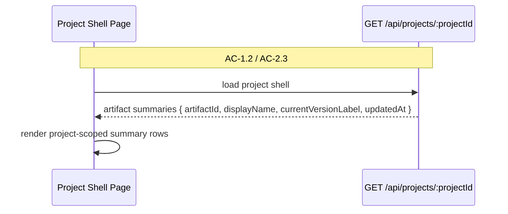
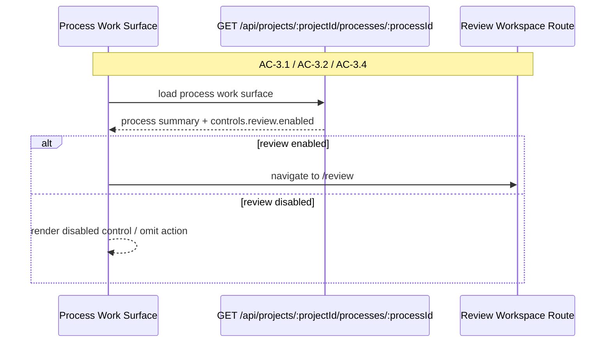
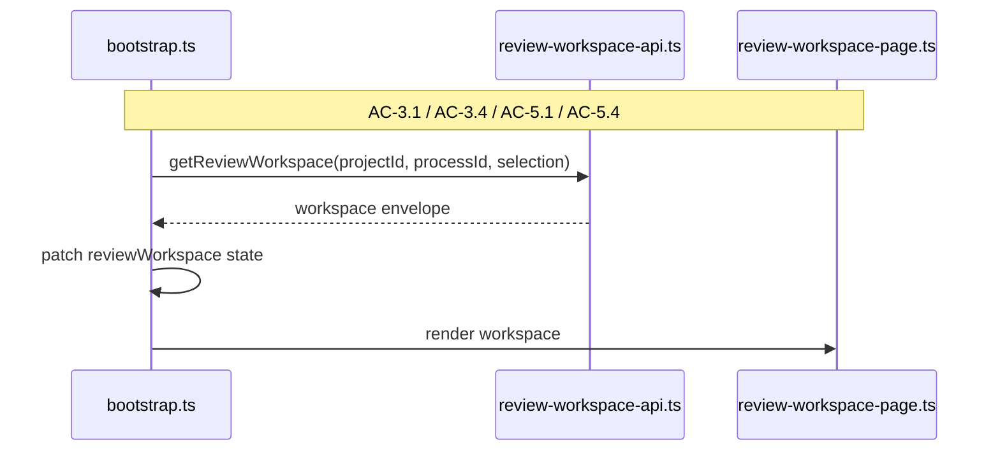
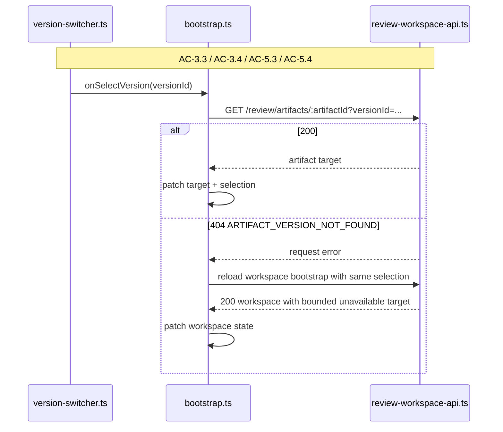
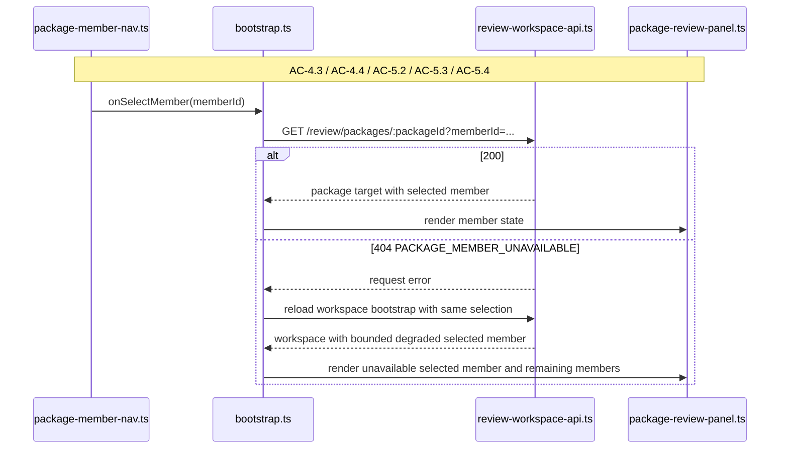

# Technical Design: Artifact Model and Review Provenance Alignment — Client

This companion document covers the browser-facing changes for Epic 5: project
shell artifact summaries, process-surface review entry behavior, review
workspace route/state handling, version/member selection, and bounded degraded
rendering. The server and durable model do most of the heavy lifting in this
epic, but the client still has to present the aligned model clearly and avoid
collapsing back into the old ownership language.

## Client Posture

Epic 5 does not add a new browser surface. The user still encounters artifacts
in three places:

- the project shell's artifact summary section
- the process work surface's current materials section
- the dedicated review workspace

What changes is the meaning those surfaces express.

The project shell stops talking like artifacts belong to one process. The
process work surface keeps showing process-local current meaning because that is
still process-owned. The review workspace becomes more careful about stale
selections: a missing explicit version or package member should not blow away
the whole workspace state when the server can still explain the degradation in
bounded terms.

The client therefore has two jobs in Epic 5. First, it needs to present the new
model cleanly. Second, it needs to preserve orientation when the server says
"this target still exists, but your selected version/member is stale" instead
of flattening that into one generic load failure.

## Top-Tier Surface Nesting

| Surface | Epic 5 Client Nesting |
|---------|------------------------|
| Project shell | Slimmer artifact summary contract and copy; no artifact-level process ownership language |
| Process work surface | Review action visibility continues to live here, but the client trusts server-provided reviewability rather than inferring from artifact provenance |
| Review workspace | Existing route/state/panel surface; selection and degraded-state handling become more precise |
| Shared client state | `reviewWorkspace` remains a dedicated state slice; target-level degradation stays inside `target`, while fatal load failures remain in `error` |

## Module Architecture

```text
apps/platform/client/
├── app/
│   ├── bootstrap.ts                              # MODIFIED
│   ├── router.ts                                 # MODIFIED
│   └── store.ts                                  # MODIFIED
├── browser-api/
│   └── review-workspace-api.ts                   # MODIFIED
└── features/
    ├── projects/
    │   └── artifact-section.ts                   # MODIFIED
    ├── processes/
    │   └── process-work-surface-page.ts          # MODIFIED
    └── review/
        ├── review-workspace-page.ts              # MODIFIED
        ├── artifact-review-panel.ts              # MODIFIED
        ├── package-review-panel.ts               # MODIFIED
        ├── version-switcher.ts                   # MODIFIED
        └── package-member-nav.ts                 # MODIFIED

apps/platform/shared/contracts/
├── schemas.ts                                    # MODIFIED
├── review-workspace.ts                           # MODIFIED
└── state.ts                                      # MODIFIED
```

### Responsibility Matrix

| Module | Status | Responsibility | ACs Covered |
|--------|--------|----------------|-------------|
| `artifact-section.ts` | MODIFIED | Render project artifact summaries as project-scoped durable assets only | AC-1, AC-2 |
| `process-work-surface-page.ts` | MODIFIED | Present review entry only when server says review is meaningful for the current process context | AC-3 |
| `bootstrap.ts` | MODIFIED | Keep review workspace state coherent across bootstrap, version/member selection, and fallback reloads | AC-3, AC-5 |
| `review-workspace-api.ts` | MODIFIED | Map new request-error codes and support non-destructive fallback when explicit selection reads fail | AC-3, AC-5 |
| `review-workspace-page.ts` | MODIFIED | Distinguish workspace load failures from bounded target degradation and preserve target selection affordances | AC-3, AC-5 |
| `artifact-review-panel.ts` | MODIFIED | Render zero-version empty state, unavailable-version messaging, and earlier-version selection with clearer provenance language | AC-2, AC-3 |
| `package-review-panel.ts` | MODIFIED | Render mixed-producer package members without ownership assumptions and keep unrelated members visible when one degrades | AC-4, AC-5 |
| `version-switcher.ts` | MODIFIED | Keep explicit version selection process-aware and recover gracefully when the selected version disappears later | AC-3, AC-5 |
| `package-member-nav.ts` | MODIFIED | Preserve selection and accessibility semantics while surfacing unavailable members accurately | AC-4, AC-5 |

## Contract and State Changes

Epic 5 changes the browser model in two places: the project-shell artifact
summary contract and the review workspace's distinction between fatal load
failure and bounded target degradation.

### 1. Project Artifact Summary

`artifactSummarySchema` becomes:

```ts
export const artifactSummarySchema = z.object({
  artifactId: z.string().min(1),
  displayName: z.string().min(1),
  currentVersionLabel: z.string().min(1).nullable(),
  updatedAt: z.string().min(1),
});
```

The client removes:

- `attachmentScope`
- `processId`
- `processDisplayLabel`

The project-shell artifact section therefore stops rendering text like
"Attached to Feature Specification #2" and instead renders only artifact
identity plus current-version projection.

### 2. Review Workspace State

The state split remains:

- `reviewWorkspace.error` for fatal request-level failure
- `reviewWorkspace.target` for bounded target-level state

What changes is how the client gets there.

`reviewWorkspace.error` is reserved for:

- unauthenticated
- forbidden
- project not found
- process not found
- server unavailable / generic request failure

`reviewWorkspace.target` now carries the nuanced states for:

- valid zero-version artifact (`status: empty`)
- unavailable target in current workspace context
- unsupported or unavailable selected package member inside a valid package
- stale explicit version/member selection after a fallback workspace reload

This keeps the review workspace page from short-circuiting into a generic
"failed to load" section when the server can still tell the user what happened.

## Flow 1: Project Shell Artifact Summary

Epic 5's first visible client change is small but important. The project shell
must stop implying that one process owns one artifact.



The old artifact section rendered a scope paragraph:

- `Project-scoped artifact.`
- `Attached to {processDisplayLabel}.`

Epic 5 removes that paragraph entirely. The updated row has:

- artifact name
- current version label or "No current version available."
- updated timestamp

That copy change matters because the project shell is where users form their
mental model of what artifacts are.

## Flow 2: Process Work Surface Review Entry

The process work surface already has a review affordance. Epic 5 changes what
that affordance means.



The client no longer needs to infer reviewability from artifact provenance or
package composition. It trusts the server's aligned review-context decision.
That is healthier for this epic because the rules now depend on several layers
the client should not try to recompute:

- current refs
- current package-building context
- published package snapshots
- zero-version exclusion
- degraded snapshot member states

## Flow 3: Review Workspace Bootstrap

Bootstrap remains the authoritative read for the review workspace. Epic 5
leans into that instead of trying to make every panel-level action own all
degradation semantics itself.



The bootstrap outcomes are now intentionally distinct:

| Outcome | Client State |
|---------|--------------|
| process context missing or forbidden | `reviewWorkspace.error` populated; `project` / `process` absent or null |
| no targets for this process | `availableTargets: []`, `target: null`, `error: null` |
| multi-target workspace awaiting selection | `availableTargets.length > 1`, `target: null`, `error: null` |
| zero-version direct artifact path | `target.status === 'empty'` |
| fully degraded published package target | `target.targetKind === 'package'`, package visible, selected member may be unavailable |
| stale explicit selection after reopen | `target.status === 'unavailable'` with exact error code |

This lets the page render targeted copy rather than one generic failure block.

## Flow 4: Explicit Version Selection

Version selection is where stale-state handling becomes visible.



The fallback reload is the key client decision in this epic. It preserves the
workspace shell, the target list, and the process context even when a selected
explicit version disappears later. Without this step, the client would have to
flatten a nuanced stale-selection case into a generic request failure.

### Version Switcher Behavior

`version-switcher.ts` keeps the same interaction model:

- click selection
- keyboard listbox navigation
- explicit selected/current labels

What changes is the result handling:

- successful explicit selection patches the artifact target directly
- failed explicit selection triggers bootstrap reload
- zero-version artifacts still render without a version switcher because
  `versions.length === 0`

## Flow 5: Package Member Selection and Degraded Members

Package review is where Epic 5 most clearly benefits from the aligned model.



The important client rule is that one unavailable member should not collapse
the package panel. The navigation list remains visible, other members remain
visible, and the selected-member subpanel carries the unavailable state.

### Package Member Navigation

`package-member-nav.ts` already supports:

- listbox keyboard navigation
- `ready` / `unsupported` / `unavailable` labels
- disabled selection for non-ready members

Epic 5 keeps that structure but updates the copy and expectations:

- a member may be unavailable even though the package itself is still valid
- an unavailable member is a provenance/degradation state, not evidence the
  package is out of process scope
- mixed-producer packages are normal, not exceptional

## Panel Rendering Changes

### `artifact-review-panel.ts`

This panel already renders:

- artifact identity
- current version label
- selected version label
- version switcher
- unsupported fallback
- markdown body

Epic 5 changes the messaging more than the structure:

- zero-version empty state becomes "This artifact exists in the current process
  context but has no durable version yet."
- unavailable-version messaging should mention version availability, not
  process mismatch
- current version label remains a projection of the latest durable version, not
  an ownership marker
- selected-version metadata and version-switcher rows expose
  `producedByProcessId` and `producedByProcessDisplayLabel` so the producing
  process remains visible in the review experience

### `package-review-panel.ts`

This panel already renders:

- package identity and type
- member nav
- selected-member subpanel
- export trigger

Epic 5 keeps that structure and changes the interpretation:

- selected member failure messages refer to unavailable pinned versions
- mixed-producer members are normal
- fully degraded published packages still remain targetable so reopen and
  provenance inspection remain possible
- exportability is still server-driven, but the client copy should explain
  "One or more pinned members are unavailable" rather than "This package is not
  owned by the current process"

## Interface Definitions

### Project Artifact Summary

```ts
export interface ArtifactSummary {
  artifactId: string;
  displayName: string;
  currentVersionLabel: string | null;
  updatedAt: string;
}
```

### Review Version Contracts

```ts
export interface ArtifactVersionSummary {
  versionId: string;
  versionLabel: string;
  isCurrent: boolean;
  createdAt: string;
  producedByProcessId: string;
  producedByProcessDisplayLabel: string | null;
}

export interface ArtifactVersionDetail extends ArtifactVersionSummary {
  contentKind: 'markdown' | 'unsupported';
  bodyStatus?: 'ready' | 'error';
  body?: string;
  bodyError?: ReviewTargetError;
  mermaidBlocks?: MermaidBlock[];
}
```

Client consequences:

- `version-switcher.ts` can keep its current listbox structure, but its row
  metadata should include the producing process display label, falling back to
  the id only when no display label can be resolved
- `artifact-review-panel.ts` should render the selected version's producing
  process display label beside the created timestamp, again falling back to the
  id only when needed
- package-member artifact panels inherit that same provenance field through the
  pinned artifact review payload

### Review Workspace Fallback Handling

```ts
type ReviewSelectionFailureCode =
  | 'ARTIFACT_VERSION_NOT_FOUND'
  | 'PACKAGE_MEMBER_UNAVAILABLE'
  | 'REVIEW_TARGET_NOT_FOUND';

type ReviewSelectionRecovery = {
  shouldReloadWorkspace: boolean;
  code: ReviewSelectionFailureCode;
};
```

Client rule:

- if a target-specific read fails with one of the codes above, reload the full
  workspace with the same route selection
- if bootstrap fails with auth/access/process errors, set `reviewWorkspace.error`
  and do not attempt bounded target rendering

### Review Workspace State Contract

No new top-level state slice is required. The important contract invariant is:

```ts
reviewWorkspace.error !== null
```

means "the workspace failed as a request," while:

```ts
reviewWorkspace.error === null && reviewWorkspace.target?.status === 'unavailable'
```

means "the workspace is readable, but the selected target degraded."

That distinction is the client-side backbone of AC-5.

## Accessibility and UX Notes

Epic 5 is not a styling epic, but it does tighten the semantics of existing
interactive controls:

- target selector remains a listbox and should keep keyboard navigation
- version switcher remains a listbox and should keep current/selected labels
- package member nav remains a listbox with `aria-disabled` on non-ready members
- stale explicit selections should preserve focus and heading context after the
  bootstrap fallback, rather than dumping the user onto a generic error screen

The product goal is orientation. Users should be able to tell whether they are
looking at:

- a valid empty artifact
- a missing explicit version
- a degraded package member
- a process/workspace access failure

without reconstructing the difference from a generic error banner.
