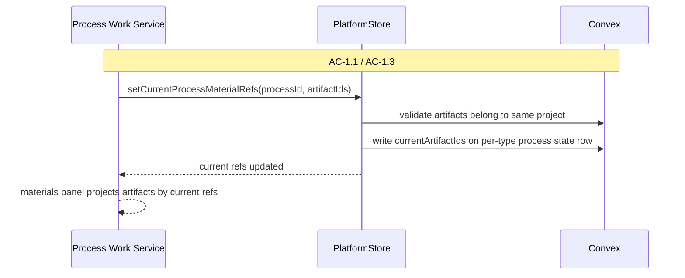
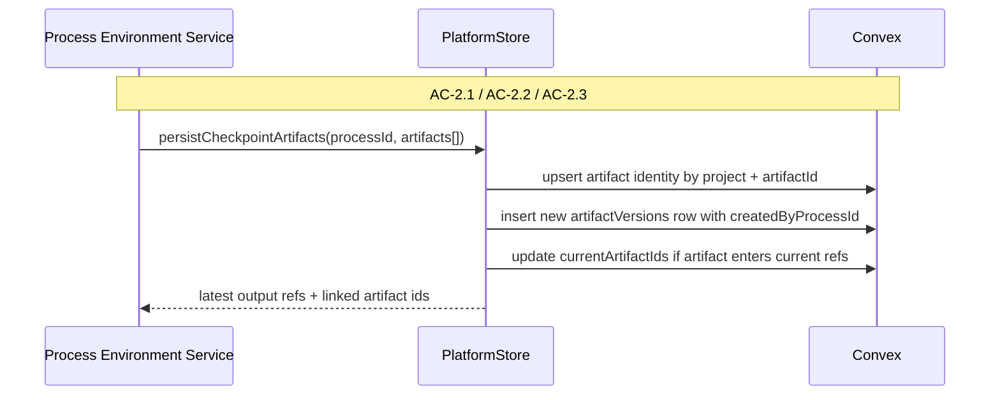
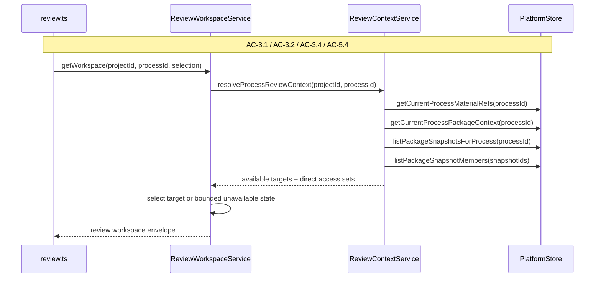
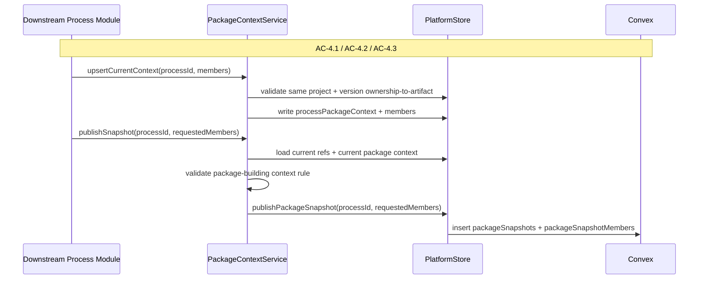
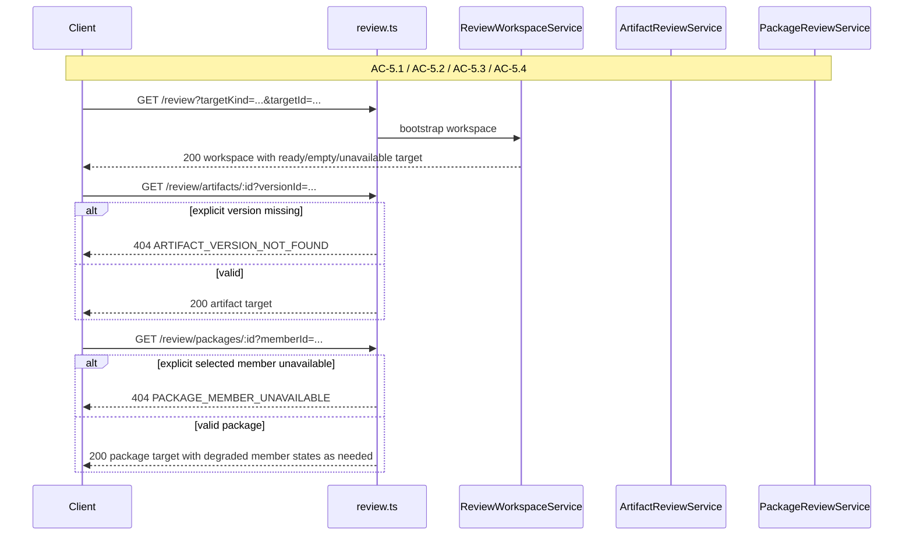

# Technical Design: Artifact Model and Review Provenance Alignment — Server

This companion document covers the Fastify control plane, review/package
services, `PlatformStore` boundary, Convex durable-state changes, and the
migration path for Epic 5. It expands the index into exact server-side module
boundaries, table decisions, flow design, and interface targets.

## Server Posture

Epic 5 does not create a second backend or a new top-level service. The server
still looks like one Fastify-owned control plane sitting over Convex durable
state and a browser client that talks only to Fastify. What changes is where
the alignment logic lives.

Today, some of that logic is trapped in the wrong layer. `PlatformStore`
implements high-level review target listing and package review assembly, which
means the pre-alignment same-process assumptions are duplicated in the Convex
store implementation and the in-memory test store. Epic 5 fixes that by
pulling review-context composition back up into review-owned services and pure
helpers while keeping `PlatformStore` focused on durable reads and writes.

That server posture is important because Epic 5 is fundamentally a policy
change. The durable store should answer factual questions:

- what artifact identities exist in this project?
- what versions exist for this artifact?
- what artifacts does this process currently reference?
- what package context does this process currently hold?
- what package snapshots and members exist?

The review/package services should answer semantic questions:

- which artifacts are reviewable from this process context?
- which versions are allowed for publication from this process context?
- which failures are missing-target failures versus missing-version failures?

That separation keeps the durable boundary reusable and keeps the semantic rules
close to the server surface that exposes them.

## Top-Tier Surface Nesting

| Surface | Epic 5 Server Nesting |
|---------|------------------------|
| Projects | `artifact-section.reader.ts` and project-shell summary builders drop artifact-level process ownership language |
| Processes | `process-work-surface.service.ts` keeps process current refs as the bounded working-set model and asks review services whether review is currently meaningful |
| Artifacts | `convex/artifacts.ts` trims the artifact row to project-scoped identity only; version provenance stays in `artifactVersions` |
| Review Workspace | `routes/review.ts` plus review services remain the owner of review/bootstrap/target semantics |
| Packages | Immutable `packageSnapshots` stay durable publication records; new mutable package-context tables support aligned publication eligibility and reopen flows |

## Module Architecture

```text
apps/platform/server/
├── app.ts                                             # MODIFIED
├── routes/
│   └── review.ts                                     # MODIFIED
├── schemas/
│   └── review.ts                                     # MODIFIED
├── services/
│   ├── projects/
│   │   ├── platform-store.ts                         # MODIFIED
│   │   └── readers/
│   │       └── artifact-section.reader.ts            # MODIFIED
│   ├── processes/
│   │   └── process-work-surface.service.ts           # MODIFIED
│   └── review/
│       ├── review-workspace.service.ts               # MODIFIED
│       ├── artifact-review.service.ts                # MODIFIED
│       ├── package-review.service.ts                 # MODIFIED
│       ├── review-context.service.ts                 # NEW
│       ├── review-context.ts                         # NEW pure helpers
│       ├── package-context.service.ts                # NEW
│       └── package-context.ts                        # NEW pure helpers

apps/platform/shared/contracts/
├── schemas.ts                                        # MODIFIED
├── review-workspace.ts                               # MODIFIED
└── process-work-surface.ts                           # MODIFIED

convex/
├── schema.ts                                         # MODIFIED
├── artifacts.ts                                      # MODIFIED
├── packageSnapshots.ts                               # MODIFIED
├── packageSnapshotMembers.ts                         # MODIFIED
├── processPackageContexts.ts                         # NEW
└── processPackageContextMembers.ts                   # NEW
```

### Responsibility Matrix

| Module | Status | Responsibility | Dependencies | ACs Covered |
|--------|--------|----------------|--------------|-------------|
| `app.ts` | MODIFIED | Wire `ReviewContextService` and `PackageContextService` into `DefaultArtifactReviewService`, `DefaultPackageReviewService`, `DefaultReviewWorkspaceService`, and process-surface review enablement; register any new review/package context dependencies at app composition time | Fastify service composition | AC-3 through AC-5 |
| `schemas/review.ts` | MODIFIED | Expand route schemas and response-code expectations so target-specific review endpoints can return exact 404 codes for missing explicit versions and unavailable package members | shared contracts | AC-3, AC-4, AC-5 |
| `routes/review.ts` | MODIFIED | Map review lookup result kinds and `AppError` subclasses to exact request codes instead of collapsing all null reads into `REVIEW_TARGET_NOT_FOUND` | review services, route schemas | AC-3 through AC-5 |
| `platform-store.ts` | MODIFIED | Provide low-level durable reads and writes for artifacts, versions, current refs, package contexts, and package snapshots; stop owning review-context composition | Convex queries/mutations, shared contracts | AC-1 through AC-5 |
| `review-context.service.ts` | NEW | Resolve aligned process review context from current refs, package context, and published package snapshots; answer `availableTargets`, direct-access eligibility, and review enablement | `PlatformStore`, pure helpers | AC-3, AC-5 |
| `package-context.service.ts` | NEW | Upsert current package-building context, seed from published snapshot on reopen, and validate publish eligibility against same-project + in-context rules | `PlatformStore`, pure helpers | AC-4 |
| `artifact-review.service.ts` | MODIFIED | Resolve artifact review through process review context, not artifact ownership; return zero-version empty state and exact missing-version failures | `PlatformStore`, `review-context.service.ts`, renderer | AC-2, AC-3, AC-5 |
| `package-review.service.ts` | MODIFIED | Resolve mixed-producer package members, keep unrelated members readable when one degrades, and classify selected-member failures accurately | `PlatformStore`, `review-context.service.ts`, `artifact-review.service.ts` | AC-4, AC-5 |
| `review-workspace.service.ts` | MODIFIED | Bootstrap the review workspace from aligned review context and keep bounded degraded target states inside the workspace envelope | process access, review services | AC-3, AC-5 |
| `artifact-section.reader.ts` | MODIFIED | Build project artifact summaries from project identity + latest version projection only | `PlatformStore` | AC-1, AC-2 |
| `process-work-surface.service.ts` | MODIFIED | Compute review control enablement from aligned review context instead of same-process production shortcuts | `review-context.service.ts` | AC-3 |
| `convex/artifacts.ts` | MODIFIED | Remove artifact-row process ownership and keep checkpoint writes version-oriented | `artifactVersions`, process refs | AC-1, AC-2 |
| `convex/processPackageContexts.ts` + members | NEW | Durable current package-building context with ordered pinned version members | Convex schema | AC-4 |
| `convex/packageSnapshots.ts` | MODIFIED | Publish immutable snapshots from aligned same-project/current-context rules instead of same-process-producer rules | Convex schema, package context validation | AC-4 |

## Durable State Model

The durable model after Epic 5 has five artifact/package layers:

1. project artifact identity
2. artifact versions with provenance
3. per-process current artifact refs
4. per-process current package-building context
5. immutable published package snapshots

### 1. `artifacts`: Project Identity Only

Current state still stores `processId` on the artifact row. Epic 5 removes it.

#### Table Shape

```ts
export const artifactsTableFields = {
  projectId: v.string(),
  displayName: v.string(),
  createdAt: v.string(),
};
```

#### Why

The artifact row should answer only one question: "what durable artifact
identity exists in this project?" If the row also says "this belongs to process
X," the rest of the system will keep trying to use that shortcut for review
eligibility, package publication, and process lineage. Epic 5 removes the
shortcut rather than trying to teach every caller not to use it.

### 2. `artifactVersions`: Keep Provenance Here

`artifactVersions` remains the version-provenance table. Epic 5 does not change
its core purpose; it leans harder on it.

#### Table Shape

```ts
export const artifactVersionsTableFields = {
  artifactId: v.id('artifacts'),
  versionLabel: v.string(),
  contentStorageId: v.id('_storage'),
  contentKind: v.union(v.literal('markdown'), v.literal('unsupported')),
  bytes: v.number(),
  createdAt: v.string(),
  createdByProcessId: v.id('processes'),
};
```

#### Required Reads

These reads become first-class rather than incidental:

- latest version by artifact id
- all versions by artifact id
- version by version id
- all artifacts ever produced by process id

Epic 5 keeps the existing indexes:

- `by_artifactId_createdAt`
- `by_createdByProcessId_createdAt`

### 3. Per-Type Current Refs: Keep the Bounded Working Set

Epic 5 keeps the existing per-type state rows:

- `processProductDefinitionStates.currentArtifactIds`
- `processFeatureSpecificationStates.currentArtifactIds`
- `processFeatureImplementationStates.currentArtifactIds`

These remain the canonical answer to "what artifacts are current for this
process?" They do not become historical membership and they do not become the
package pinning mechanism.

### 4. New Mutable Package Context

Epic 5 adds two new tables.

#### `processPackageContexts`

```ts
export const processPackageContextsTableFields = {
  processId: v.id('processes'),
  displayName: v.string(),
  packageType: v.string(),
  basePackageSnapshotId: v.union(v.id('packageSnapshots'), v.null()),
  updatedAt: v.string(),
};
```

Indexes:

- `by_processId`

This table stores the header row for one process's current package-building
context. The design assumes one current mutable context per process for this
epic. That is enough to support draft/edit/reopen behavior without committing
the platform to multi-draft package management yet.

#### Uniqueness, Cleanup, and Idempotency

Convex indexes do not enforce uniqueness, so Epic 5 defines the enforcement
rule in the write path, not in the index declaration.

`upsertCurrentProcessPackageContext` runs as one mutation and must:

1. query all `processPackageContexts` rows for `processId`
2. choose one canonical row:
   - latest `updatedAt`
   - tie-breaker: lowest `_id`
3. delete any duplicate header rows and their member rows in the same mutation
4. replace the canonical row's header fields with the requested payload
5. replace that row's members wholesale with the normalized requested member set

Idempotency rule:

- if the normalized requested payload matches the current canonical row and
  member set exactly, the mutation returns the existing row without creating a
  new one
- otherwise it performs a last-write-wins replacement of the canonical row and
  member set

Concurrency rule:

- because the entire operation runs in one Convex mutation, optimistic
  concurrency retries converge on one surviving canonical row
- duplicate cleanup is therefore part of every upsert, not a one-time repair job

#### `processPackageContextMembers`

```ts
export const processPackageContextMembersTableFields = {
  packageContextId: v.id('processPackageContexts'),
  position: v.number(),
  artifactId: v.id('artifacts'),
  artifactVersionId: v.id('artifactVersions'),
  displayName: v.string(),
  versionLabel: v.string(),
  pinnedAt: v.string(),
};
```

Indexes:

- `by_packageContextId_position`

This table stores the explicit pinned version members for the current context.
The denormalized `displayName` and `versionLabel` fields are intentional; they
let reopened or degraded contexts remain legible even if one of the downstream
rows later becomes unavailable.

### 5. Immutable Published Package Snapshots

`packageSnapshots` and `packageSnapshotMembers` remain immutable after write.
Epic 5 changes the publication rule, not the snapshot concept.

#### Current Rule to Remove

The current implementation rejects any member whose
`artifactVersion.createdByProcessId !== publishingProcessId`.

That rule is deleted.

#### New Publication Rule

A requested package member is allowed only when:

1. the artifact belongs to the same project as the publishing process
2. the version belongs to that artifact
3. the version is either:
   - the current version of a currently referenced artifact for that process, or
   - an explicit version already pinned in that same process's current package
     context

This rule is validated in the server package-context/publish path and mirrored
in the in-memory store used by tests.

## Store Boundary Changes

Epic 5 narrows `PlatformStore`. The store boundary should return durable facts,
not precomposed review semantics.

### Remove or Retire High-Level Review Composition

The following methods are retired from the long-term interface:

- `listProcessReviewTargets`
- `getProcessReviewPackage`

They currently embed the wrong policy. Epic 5 moves that logic into
`review-context.service.ts` and `package-review.service.ts`, which can use
store primitives and keep the policy local to the review/package surface.

During Chunk 0 and early Chunk 1 work, those methods may remain as deprecated
compile-bridge adapters while callers are being moved. They are not part of the
end-state interface for this epic and should be removed before Epic 5 closes.

### Add Low-Level Package-Context Primitives

```ts
export type ProcessPackageContextRecord = {
  packageContextId: string;
  processId: string;
  displayName: string;
  packageType: string;
  basePackageSnapshotId: string | null;
  updatedAt: string;
};

export type ProcessPackageContextMemberRecord = {
  memberId: string;
  packageContextId: string;
  position: number;
  artifactId: string;
  artifactVersionId: string;
  displayName: string;
  versionLabel: string;
  pinnedAt: string;
};

interface PlatformStore {
  listProjectArtifactsByIds(args: {
    projectId: string;
    artifactIds: string[];
  }): Promise<ArtifactSummary[]>;

  listProcessesByIds(args: {
    processIds: string[];
  }): Promise<Array<ProcessSummary & { projectId: string }>>;

  getCurrentProcessPackageContext(args: {
    processId: string;
  }): Promise<ProcessPackageContextRecord | null>;

  listProcessPackageContextMembers(args: {
    packageContextId: string;
  }): Promise<ProcessPackageContextMemberRecord[]>;

  upsertCurrentProcessPackageContext(args: {
    processId: string;
    displayName: string;
    packageType: string;
    basePackageSnapshotId: string | null;
    members: Array<{
      position: number;
      artifactId: string;
      artifactVersionId: string;
      displayName: string;
      versionLabel: string;
    }>;
  }): Promise<{
    context: ProcessPackageContextRecord;
    members: ProcessPackageContextMemberRecord[];
  }>;

  clearCurrentProcessPackageContext(args: {
    processId: string;
  }): Promise<void>;
}
```

### Keep Existing Durable Facts

These existing methods remain central:

- `listProjectArtifacts`
- `listProjectArtifactsByIds`
- `listArtifactVersions`
- `getArtifactVersion`
- `getLatestArtifactVersion`
- `getProcessRecord`
- `listProcessesByIds`
- `getCurrentProcessMaterialRefs`
- `listPackageSnapshotsForProcess`
- `getPackageSnapshot`
- `listPackageSnapshotMembers`
- `publishPackageSnapshot`

`publishPackageSnapshot` stays, but its validation rule changes and it becomes
context-aware rather than same-process-producer aware.

Why these additions matter:

- `listProjectArtifactsByIds` keeps review-context and package-context services
  from reimplementing ad hoc artifact/project joins
- `listProcessesByIds` is the primitive that lets review services derive
  `producedByProcessDisplayLabel` without turning `PlatformStore` back into a
  high-level review assembler

## Migration Plan

Epic 5 uses a direct pre-customer breaking rollout, not a widen-migrate-narrow
production migration. That choice is intentional. The repo is still pre-customer,
the current artifact-row ownership field is architecturally wrong, and trying
to preserve half-aligned intermediate schemas would add more implementation risk
than it removes.

Normative rollout rule:

- ship the new code and schema together
- reset any dev/local deployment whose legacy rows fail schema validation
- treat any one-off helper that preserves local dev data as optional developer
  convenience, not as Epic 5 scope

Epic 5 is therefore best delivered in three server-side phases.

### Phase A: Additive Alignment

Land the new package-context tables, store methods, review-context service, and
shared helper functions while the old artifact-row `processId` still exists.
This keeps the server buildable and lets tests move one seam at a time.

### Phase B: Policy Flip

Change review eligibility, package publication validation, and process-surface
review enablement to use current refs + package context + package snapshots.
Once these reads no longer depend on `artifacts.processId`, the old field is
only dead weight.

### Phase C: Artifact Row Cleanup

Remove `processId` from the `artifacts` table and from all summary builders,
shared contracts, fixtures, and tests. The expected path is a direct breaking
deploy with a dev deployment reset where legacy rows block schema validation.
An optional local helper may exist for developer convenience, but it is not
required for Epic 5 completion and is not part of the core story scope.

## Flow 1: Referencing Project Artifacts From Process Work

This flow is the durable-state baseline for AC-1. A later process should be
able to bring an existing project artifact into its current materials without
changing the artifact identity or claiming sole ownership of it.



Server consequences:

- no artifact row update when a process merely references an existing artifact
- project-shell artifact listing stays deduplicated because artifact identity is
  still one project-level row
- process materials panel is the place where per-process visibility appears

## Flow 2: Creating a New Version Without Reassigning the Artifact

This flow is the write-path center of AC-2.



The crucial server change is in `convex/artifacts.ts`:

- if `artifactId` is supplied and belongs to the same project, keep the same
  artifact row
- update `displayName` only if the checkpoint target label changes
- never patch a process ownership field because none exists anymore
- always insert a new `artifactVersions` row

Project and process summary reads then derive `currentVersionLabel` and
`updatedAt` from `getLatestArtifactVersion(artifactId)`.

## Flow 3: Review Context Resolution

This flow is the semantic heart of AC-3 and part of AC-5.



The alignment rule is implemented here, not in the store:

- current refs create artifact targets
- explicitly pinned artifact versions in the current package context also create
  artifact targets for their artifact identities, even if that artifact is no
  longer in today's current refs
- zero-version refs do not create default artifact targets
- package snapshots create package targets, including fully degraded snapshots
  whose members may all be unavailable later
- direct artifact access is allowed through current refs or pinned package
  context
- unrelated project artifacts stay unavailable

## Flow 4: Current Package Context and Publication

This flow settles AC-4.



Two details matter here:

1. A requested upstream version is allowed even when another process produced
   it, as long as it is the current version of a currently referenced artifact
   or already pinned in the same process's current package context.
2. An earlier pinned version stays eligible across reopen/edit flows because it
   lives in `processPackageContextMembers`, not only in ephemeral client state.

## Flow 5: Reopen and Degraded Provenance States

This flow settles AC-5 and the boundary between bounded target degradation and
request-level failure.



The core server rule is:

- bootstrap favors bounded degraded states
- explicit follow-up reads favor exact request-level error codes

That gives the UI a durable workspace shell while still keeping machine-readable
failure classification precise.

## Interface Definitions

### Shared Contract Shapes

Epic 5 needs more exact shared-contract guidance than the first draft provided.
The provenance rules are only implementable if they land in the actual shared
schemas, not just in prose.

```ts
export interface ArtifactVersionSummary {
  versionId: string;
  versionLabel: string;
  isCurrent: boolean;
  createdAt: string;
  producedByProcessId: string;
  producedByProcessDisplayLabel: string | null;
}

export interface ArtifactVersionDetail {
  versionId: string;
  versionLabel: string;
  contentKind: 'markdown' | 'unsupported';
  bodyStatus?: 'ready' | 'error';
  body?: string;
  bodyError?: ReviewTargetError;
  mermaidBlocks?: MermaidBlock[];
  createdAt: string;
  producedByProcessId: string;
  producedByProcessDisplayLabel: string | null;
}
```

Contract consequences:

- `apps/platform/shared/contracts/review-workspace.ts` adds
  `producedByProcessId` to both `artifactVersionSummarySchema` and
  `artifactVersionDetailSchema`
- the shared contracts also add `producedByProcessDisplayLabel` as an optional
  derived provenance field for user-facing review surfaces
- artifact review responses and package-member artifact projections must carry
  that field through without dropping it during pinned-version adaptation
- the client panels are expected to render or expose that provenance clearly
  enough that AC-2.2 remains visible in the product rather than only in logs or
  raw payloads
- naming rule: durable rows keep `createdByProcessId`; browser-facing contracts
  expose the same fact as `producedByProcessId` plus
  `producedByProcessDisplayLabel`

### Review Context Shapes

```ts
export type ProcessReviewContext = {
  currentArtifactIds: string[];
  artifactIdsReachableForDirectReview: Set<string>;
  artifactIdsVisibleInTargetList: Set<string>;
  packageSnapshotIdsVisibleInTargetList: Set<string>;
  zeroVersionArtifactIds: Set<string>;
};

export interface ReviewContextService {
  resolveProcessReviewContext(args: {
    projectId: string;
    processId: string;
  }): Promise<ProcessReviewContext>;

  listAvailableTargets(args: {
    projectId: string;
    processId: string;
  }): Promise<ReviewTargetSummary[]>;

  canReviewArtifact(args: {
    projectId: string;
    processId: string;
    artifactId: string;
  }): Promise<boolean>;

  hasAnyVisibleTargets(args: {
    projectId: string;
    processId: string;
  }): Promise<boolean>;
}
```

### Package Context Shapes

```ts
export interface PackageContextService {
  getCurrentContext(args: {
    processId: string;
  }): Promise<{
    context: ProcessPackageContextRecord | null;
    members: ProcessPackageContextMemberRecord[];
  }>;

  upsertCurrentContext(args: {
    processId: string;
    displayName: string;
    packageType: string;
    basePackageSnapshotId: string | null;
    members: Array<{
      position: number;
      artifactId: string;
      artifactVersionId: string;
    }>;
  }): Promise<{
    context: ProcessPackageContextRecord;
    members: ProcessPackageContextMemberRecord[];
  }>;

  publishFromCurrentContext(args: {
    processId: string;
    displayName: string;
    packageType: string;
    members: PackageSnapshotMemberWriteInput[];
  }): Promise<string>;
}
```

### Review Lookup Result Types

The first draft named the right error codes but did not make the mechanics
implementable enough. Epic 5 now standardizes the service result layer before
route mapping.

```ts
export type ArtifactReviewLookupResult =
  | { kind: 'artifact_ready'; artifact: ArtifactReviewTarget }
  | { kind: 'artifact_empty'; artifact: ArtifactReviewTarget }
  | { kind: 'artifact_unsupported'; target: ReviewTarget }
  | { kind: 'artifact_target_not_found' }
  | { kind: 'artifact_version_not_found'; artifactId: string; versionId: string };

export type PackageReviewLookupResult =
  | { kind: 'package_ready'; package: PackageReviewTarget }
  | { kind: 'package_target_not_found' }
  | { kind: 'package_member_unavailable'; packageId: string; memberId: string };
```

Route mapping rule:

- `routes/review.ts` consumes these result kinds directly
- bootstrap routes (`GET /review`) convert the not-found/version/member cases
  into bounded `target.status` / `target.error` states once project/process
  context has resolved
- target-specific routes keep exact request-level responses:
  - `artifact_target_not_found` -> `404 REVIEW_TARGET_NOT_FOUND`
  - `artifact_version_not_found` -> `404 ARTIFACT_VERSION_NOT_FOUND`
  - `package_target_not_found` -> `404 REVIEW_TARGET_NOT_FOUND`
  - `package_member_unavailable` -> `404 PACKAGE_MEMBER_UNAVAILABLE`

Implementation rule:

- where the review services already throw `AppError` subclasses, Epic 5 adds
  exact classes such as `ArtifactVersionNotFoundAppError`,
  `PackageMemberUnavailableAppError`, and `PackageMemberNotAllowedAppError`
- `routes/review.ts` may either map discriminated result kinds directly or map
  these exact `AppError` subclasses through `buildRequestError`, but it must no
  longer collapse them all into `REVIEW_TARGET_NOT_FOUND`

`server/schemas/review.ts` must therefore document those exact codes on the
artifact and package route schemas, even though the HTTP status remains `404`.

### Error Taxonomy

Shared request-level errors gain:

- `ARTIFACT_VERSION_NOT_FOUND`
- `PACKAGE_MEMBER_UNAVAILABLE`
- `PACKAGE_MEMBER_NOT_ALLOWED`

Review-target envelope errors gain the same codes where bootstrap needs bounded
degradation instead of a request-level failure.

This means the server now distinguishes four materially different cases:

| Condition | Bootstrap `/review` | Direct endpoint |
|-----------|---------------------|-----------------|
| Target not in current process context | bounded unavailable target with `REVIEW_TARGET_NOT_FOUND` | `404 REVIEW_TARGET_NOT_FOUND` |
| Explicit version missing | bounded unavailable artifact target with `ARTIFACT_VERSION_NOT_FOUND` | `404 ARTIFACT_VERSION_NOT_FOUND` |
| Explicit package member unavailable | bounded unavailable selected-member state with `PACKAGE_MEMBER_UNAVAILABLE` | `404 PACKAGE_MEMBER_UNAVAILABLE` |
| Publish request includes member outside allowed context | n/a | `409 PACKAGE_MEMBER_NOT_ALLOWED` |

## Observability

Epic 5 adds or sharpens the following log points:

- `artifact.alignment.checkpoint.persisted`
  - `artifactId`
  - `versionId`
  - `createdByProcessId`
  - `projectId`
- `review.context.resolved`
  - `projectId`
  - `processId`
  - `currentArtifactCount`
  - `directReviewArtifactCount`
  - `packageTargetCount`
  - `zeroVersionArtifactCount`
- `package.context.updated`
  - `processId`
  - `packageContextId`
  - `memberCount`
  - `basePackageSnapshotId`
- `package.publish.rejected`
  - `processId`
  - `reason`
  - `artifactId`
  - `artifactVersionId`
- `review.target.degraded`
  - `projectId`
  - `processId`
  - `targetKind`
  - `targetId`
  - `reason`

The observability goal is not more logs for their own sake. It is to make
later provenance debugging tractable when the failure is "missing version" or
"member outside allowed context" rather than a generic review failure.
