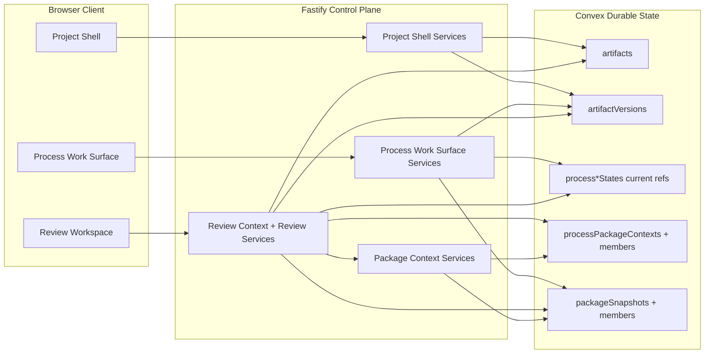

# Technical Design: Artifact Model and Review Provenance Alignment

## Purpose

This document translates Epic 5 into implementable architecture for the
artifact-model alignment step that sits between Epic 4's review/package surface
and Epic 6's broader source-management work. It is the index document for a
four-file tech design set:

| Document | Role |
|----------|------|
| `tech-design.md` | Decision record, spec validation, inherited architecture, system view, module architecture overview, and work breakdown |
| `tech-design-server.md` | Fastify, review services, `PlatformStore`, Convex schema, migration plan, package-context model, and error taxonomy |
| `tech-design-client.md` | Project-shell artifact summary changes, review workspace behavior, target-selection flows, bounded degraded states, and route/state updates |
| `test-plan.md` | TC-to-test mapping, fixtures, mock strategy, file inventory, chunk counts, and verification gates |

The downstream consumers are:

| Audience | What they need from this design |
|----------|---------------------------------|
| Reviewers | A clear account of what is changing in the durable model, what is staying process-owned, and where the current code still encodes the old ownership assumption |
| Story authors | Story-aligned chunk boundaries that match the epic's sequencing and leave no ambiguity about which contracts, migrations, and tests belong together |
| Implementers | Exact file targets, durable-state decisions, review-context rules, package-context rules, migration sequencing, and verification commands |

## Spec Validation

Epic 5 is designable. The requirements are concrete, the ACs and TCs are
usefully specific, and the epic asks the right questions for this phase. The
main work in validation was not repairing a broken epic; it was separating the
epic's aligned target model from the current repo's partially pre-alignment
implementation so the design could speak to both honestly.

The most important validation outcome is that the current repo is already
farther along than the onboarding pack says. The onboarding docs in
`docs/onboarding/` were cut on `2026-04-15` at commit `d85d69b...`, but the
working tree for this design is at `f14c88e...` on `2026-04-25`. Review and
package surfaces now exist in the code and tests. What Epic 5 has to realign
is not a hypothetical future review layer; it is a real, shipped-in-repo
review/package implementation whose core artifact assumptions are still too
close to "single primary process ownership."

That current-state gap changes the design emphasis. Epic 5 is not primarily a
net-new UI epic. It is a data-model, read-model, and policy-alignment epic
that preserves the existing review/package surfaces while changing the rules
those surfaces rely on. The design therefore stays tightly coupled to the
existing Fastify control plane, `PlatformStore` boundary, shared contracts, and
review route family rather than inventing new top-level product surfaces.

### Issues Found

| Issue | Spec Location | Resolution | Status |
|-------|---------------|------------|--------|
| Current onboarding pack says the markdown review workspace and package surface are not present, but the current repo now contains `routes/review.ts`, review services, review client pages, and full review/package test suites | `docs/onboarding/current-state-process-work-surface.md`, `docs/onboarding/current-state-tech-design.md` | Treat the onboarding pack as a stale baseline for this domain. Design against current code and tests, and record the drift here so later doc refresh work has a concrete starting point | Resolved — clarified |
| Epic 5's error-response table does not distinguish between review-workspace bootstrap reads, which benefit from bounded degraded target states, and target-specific follow-up reads, which can legitimately return request-level 404/409 responses | Data Contracts → Error Responses; AC-5.3, AC-5.4 | Design keeps the existing review-workspace bootstrap pattern: once project/process context resolves, `GET /review` returns `200` with bounded `target.status` / `target.error` degradation. Target-specific follow-up reads continue to use request-level `404` / `409` when the caller asks for an explicit missing version, missing member, or disallowed publication member | Resolved — clarified |
| Current `PlatformStore` interface owns high-level review-target composition and package review assembly, which bakes the pre-alignment same-process assumptions into every store implementation | Current code: `apps/platform/server/services/projects/platform-store.ts`; Epic Q3, Q5 | Epic 5 narrows `PlatformStore` back toward durable-state primitives and moves review-context composition into server review services and pure helpers. This is an intentional design deviation because the old interface shape would force the wrong policy to keep leaking into every store implementation | Resolved — deviated |
| Current package publication logic still requires every pinned member version to have `createdByProcessId === publishingProcessId`, which directly conflicts with AC-4.1 and AC-4.2 | Current code: package publication path in `platform-store.ts`; AC-4.1, AC-4.2 | Publish eligibility is rewritten around same-project membership plus current package-building context, not same-process production. Cross-process package members become valid when they are either current versions of currently referenced artifacts or explicitly pinned in the same process's current package context | Resolved |
| The epic asks how current package-building context should be represented durably, but the current repo only has immutable `packageSnapshots` and their members | Tech Design Questions Q4 | Design adds a dedicated mutable package-context model rather than overloading immutable package snapshots or broadening current-refs into a catch-all relation table | Resolved |
| The epic requires version provenance visibility via `producedByProcessId`, but raw ids alone are too thin for a user-facing provenance surface | Data Contracts → Artifact Version Summary; AC-2.2 | Design keeps `producedByProcessId` in browser-facing contracts and adds derived `producedByProcessDisplayLabel` so the UI can show readable provenance while still preserving the stable id | Resolved — clarified |

## Context

Epic 4 established the first review/package surface, but it did so on top of a
durable artifact model that still leaked an older assumption: one artifact row
could still look like it "belonged" to one process. The repo has already moved
some of the right semantics down to the version layer. `artifactVersions` has
`createdByProcessId`, the process work surface already projects current
materials from per-process current refs, and package snapshots already pin
explicit version ids. Epic 5 exists because those good local decisions are not
yet the platform's full governing model.

The problem shows up anywhere a later process touches earlier work. A
`FeatureSpecification` process should be able to reference a PRD created by a
`ProductDefinition` process without the artifact changing owners. A
`FeatureImplementation` process should be able to revise a tech design artifact
from an earlier specification process without rewriting the artifact row to say
"this belongs to implementation now." A publishing process should be able to
bundle pinned versions from several processes into one reviewable package
without being told that only versions it personally produced are legitimate.

This is why Epic 5 belongs between Epic 4 and Epic 6 rather than inside either
of them. Epic 4 proved there is a usable review/package surface. Epic 6 will
make broader claims about canonical sources, provenance, freshness, and later
archive work. If Epic 6 inherited the current artifact assumptions, it would
have to untangle project-scoped artifact identity, version provenance, process
working context, and package membership at the same time it is trying to settle
source-management behavior. Epic 5 narrows the job: fix the artifact world
first so later source work inherits the right semantics.

The current repo architecture helps here. Fastify already owns the review route
family, the client already owns a dedicated review workspace state slice, and
the durable model already has most of the necessary nouns: project artifacts,
artifact versions, per-process current refs, package snapshots, and package
members. The design therefore does not need a new product surface or a new
cross-runtime abstraction. It needs a cleaner separation of concerns and a
small amount of new durable state where the current implementation is missing a
shared, process-scoped package-context model.

The alignment target is simple to say even if it touches a lot of code:
artifacts are project-scoped durable identities, versions carry producing
process provenance, current process refs express what a process is working with
now, package contexts express which earlier versions a process has explicitly
pinned into current publishing work, and package snapshots express the durable
published result. Review and package behavior are allowed to look at all of
those layers, but none of those layers should collapse back into one overloaded
"artifact owner" field.

## Inherited Decisions

Epic 5 does not add new runtime dependencies and does not reopen the platform's
settled architectural choices. It inherits the current stack and works within
the same runtime surfaces already in use.

| Area | Current Choice | Source | Epic 5 Posture |
|------|----------------|--------|----------------|
| Control plane | Fastify 5 monolith | Platform tech arch + current repo | Keep. All browser-facing behavior still routes through Fastify |
| Durable state | Convex behind `PlatformStore` | Platform tech arch + current repo | Keep. Artifact and package alignment remain durable-store concerns, not browser concerns |
| Client build and app shell | Vite-built client, Fastify-served shell | Platform tech arch + current repo | Keep. No separate review SPA or artifact admin app |
| Shared contracts | Zod schemas in `apps/platform/shared/contracts` | Current repo | Keep. Epic 5 changes those schemas rather than bypassing them |
| Review surface shape | Existing `/projects/:projectId/processes/:processId/review` route family | Current repo | Keep. Behavior realigns inside the existing route family |
| Process current refs | Per-type process state tables store bounded current artifact ids | Current repo + epic assumptions | Keep as the bounded working-set model |

### Epic-Scoped Stack Additions

None. Epic 5 deliberately avoids new libraries. The work is in durable-state
shape, contract shape, service composition, and test coverage, not in new
package adoption.

## Tech Design Question Answers

### Q1. Should durable process-to-artifact relationship beyond current working-set refs be modeled through a dedicated relation table or by extending the existing current-ref model?

Do not add a generic process-to-artifact relation table in Epic 5.

The current-ref arrays in the per-type process state tables are still the right
model for "what this process is working with now." They are bounded, already
fit the process work-surface materials panel, and already line up with the
process-first architecture. The problem is not that current refs are too
simple; the problem is that the platform has been asking current refs to carry
concerns they were never meant to carry.

Epic 5 therefore keeps current refs for current working state and introduces a
separate durable package-context model for the one thing current refs cannot
encode cleanly: earlier pinned artifact versions that a process still needs to
carry forward in package publication and reopen/edit flows. That new context is
not a generic relation table. It is a process-scoped package-building context
with version-aware members, ordering, and reopen semantics.

This split is intentional:

- current refs answer "what artifacts are current for this process?"
- package-context members answer "which artifact versions has this process
  explicitly pinned into current package-building work?"
- published package members answer "what exact versions did this process
  publish as a durable package snapshot?"

That gives the platform three precise layers instead of one mushy relation
layer.

### Q2. Which existing artifact summary fields should be removed versus preserved as derived process-local display fields?

At the project shell level, remove the artifact-level process fields entirely.

The current `ArtifactSummary` contract still includes:

- `attachmentScope`
- `processId`
- `processDisplayLabel`

Those fields make sense only if a project artifact can still be described as
attached to one primary process. Epic 5 removes them from the project-shell
artifact summary contract and UI. The project shell keeps only project-scoped
artifact identity plus latest-version projection:

- `artifactId`
- `displayName`
- `currentVersionLabel`
- `updatedAt`

The process-local display fields stay where they belong: on
`ProcessArtifactReference` in the process materials panel. That contract already
has the right shape for this epic:

- `artifactId`
- `displayName`
- `currentVersionLabel`
- `roleLabel`
- `updatedAt`

This is the cleanest separation between project-scoped durable summary and
process-owned current meaning.

### Q3. How should current review-target eligibility be computed so it remains process-scoped without depending on single-process artifact ownership?

Review eligibility becomes a process-context computation, not an artifact-row
check.

The aligned algorithm is:

1. Start with the process's current artifact refs from its per-type state row.
2. Add any artifact versions already pinned in that same process's current
   package-building context.
3. Add any artifact versions pinned inside package snapshots published from
   that same process, because reopening package review remains a valid process
   review context.
4. Resolve those ids against the project's durable artifact identities and
   artifact versions.

From that combined process review context:

- artifact targets in `availableTargets` come from artifact identities that are
  either currently referenced by the process or explicitly pinned in that same
  process's current package-building context, provided the artifact has at least
  one durable version and remains in this process review context
- zero-version current refs remain excluded from the default artifact target
  list
- package targets in `availableTargets` come from published package snapshots
  for that process, including snapshots whose members may all be unavailable
  later; the snapshot remains reviewable as a durable provenance object even
  when its selected-member state is fully degraded
- direct artifact review succeeds when the artifact is reachable through
  current refs or pinned package context for that same process
- unrelated project artifacts remain unavailable

This keeps review process-scoped without relying on artifact-row ownership,
latest-version producer, or any other single-field shortcut.

### Q4. How should the already-defined current package-building context be represented durably so package publish, review, and reopen flows share the same bounded member set?

Add a dedicated mutable package-context model:

- `processPackageContexts`
- `processPackageContextMembers`

`processPackageContexts` is the header row for the current package-building
context owned by one process. It stores:

- `processId`
- `displayName`
- `packageType`
- `basePackageSnapshotId` for reopen/edit-from-snapshot flows
- `updatedAt`

`processPackageContextMembers` stores the ordered, explicit version pins inside
that current context:

- `packageContextId`
- `position`
- `artifactId`
- `artifactVersionId`
- `displayName`
- `versionLabel`
- `pinnedAt`

This context is mutable and process-scoped. Published `packageSnapshots` remain
immutable and durable. A publishing process can request a snapshot from any
member set that is valid inside its current package-building context. Reopening
an existing package automatically seeds the current context from the published
snapshot's
members, after which the process may keep earlier pinned versions, replace some
members with the current versions of currently referenced artifacts, or republish.

This is cleaner than overloading immutable package snapshots into drafts and
cleaner than trying to make current refs carry version-specific package pins.

### Q5. What is the cleanest migration path for persisted artifact rows and review tests that currently assume a primary process on the artifact row?

Use a staged code migration with a pragmatic data posture:

1. Change shared contracts and read models first so project-shell and
   review/workspace code stop relying on artifact-row process ownership.
2. Add the new package-context tables and store methods before removing the old
   package publication rule, so current and future publishers have a durable
   bounded context to validate against.
3. Rewrite artifact checkpoint, review eligibility, and package publication to
   stop reading `artifacts.processId`.
4. Remove `processId` from the `artifacts` table and delete the legacy summary
   fields from `ArtifactSummary`.
5. Migrate or reset dev data as needed. Because this repo is still pre-customer,
   a dev deployment reset is acceptable if a local environment does not need
   data preservation. The design still supports a one-off migration helper for
   teams that want to preserve local dev rows while iterating.

Test migration follows the same order: first update fixtures and contract tests
to the slimmer project artifact summary, then update review/package tests to
assert process-context eligibility instead of same-process ownership, then add
cross-process package and degraded-state coverage on top.

## System View

Epic 5 lives inside the same four runtime surfaces that already exist for this
part of the product: Fastify routes and services, shared client/server
contracts, the browser workspace/state layer, and Convex durable state. What
changes is the relationship between the concepts inside those surfaces.

### Top-Tier Surfaces Touched

| Surface | Source | Epic 5 Role |
|---------|--------|-------------|
| Projects | Inherited from platform tech arch + current project shell | Project-shell artifact summaries become truly project-scoped and lose artifact-level process fields |
| Processes | Inherited from platform tech arch + current process work surface | Process current refs remain the bounded working-set model; review enablement is recomputed from aligned review context |
| Artifacts | Inherited from platform tech arch + current artifact/version tables | Artifact identity becomes project-scoped only; version provenance remains version-scoped |
| Review Workspace | Existing Epic 4 surface | Review target resolution shifts from artifact ownership to process review context |
| Packages | Existing Epic 4 surface, expanded in this epic | Published snapshots stay immutable; current package-building context becomes durable and mutable |
| Shared Contracts | Current repo | Project summaries, review contracts, error codes, and client state all realign around the new model |

### System Context Diagram



### Model Split

The core architectural point of this epic is the model split below:

| Concern | Durable Home | Meaning |
|---------|--------------|---------|
| Project artifact identity | `artifacts` | "This artifact exists in this project" |
| Revision provenance | `artifactVersions.createdByProcessId` | "This version was produced by this process" |
| Current process working set | per-type process state `currentArtifactIds` | "This process is currently working with these artifacts" |
| Current package-building pins | `processPackageContexts` + members | "This process has explicitly pinned these artifact versions into current publication work" |
| Durable published package | `packageSnapshots` + members | "This exact ordered set of pinned versions was published as one package" |

The rest of the design is a consequence of keeping those layers distinct.

## Module Architecture Overview

Epic 5 is a four-surface change set: shared contracts, server services and
routes, browser read/render behavior, and Convex durable state.

```text
apps/platform/shared/contracts/
├── schemas.ts                               # MODIFIED
├── review-workspace.ts                      # MODIFIED
├── process-work-surface.ts                  # MODIFIED
└── state.ts                                 # MODIFIED

apps/platform/server/
├── app.ts                                     # MODIFIED
├── routes/
│   └── review.ts                            # MODIFIED
├── schemas/
│   └── review.ts                            # MODIFIED
├── services/
│   ├── projects/
│   │   ├── platform-store.ts                # MODIFIED
│   │   └── readers/
│   │       └── artifact-section.reader.ts   # MODIFIED
│   ├── processes/
│   │   └── process-work-surface.service.ts  # MODIFIED
│   └── review/
│       ├── review-workspace.service.ts      # MODIFIED
│       ├── artifact-review.service.ts       # MODIFIED
│       ├── package-review.service.ts        # MODIFIED
│       ├── review-context.service.ts        # NEW
│       └── package-context.service.ts       # NEW

apps/platform/client/
├── app/
│   ├── bootstrap.ts                         # MODIFIED
│   └── store.ts                             # MODIFIED
├── browser-api/
│   └── review-workspace-api.ts              # MODIFIED
└── features/
    ├── projects/
    │   └── artifact-section.ts              # MODIFIED
    ├── processes/
    │   └── process-work-surface-page.ts     # MODIFIED
    └── review/
        ├── review-workspace-page.ts         # MODIFIED
        ├── artifact-review-panel.ts         # MODIFIED
        ├── package-review-panel.ts          # MODIFIED
        ├── version-switcher.ts              # MODIFIED
        └── package-member-nav.ts            # MODIFIED

convex/
├── schema.ts                                # MODIFIED
├── artifacts.ts                             # MODIFIED
├── packageSnapshots.ts                      # MODIFIED
├── packageSnapshotMembers.ts                # MODIFIED
├── processPackageContexts.ts                # NEW
└── processPackageContextMembers.ts          # NEW
```

### Responsibility Matrix

| Module | Status | Responsibility | ACs Covered |
|--------|--------|----------------|-------------|
| `schemas.ts` | MODIFIED | Slim project artifact summary; add request-error codes for aligned review/package failures | AC-1, AC-2, AC-5 |
| `review-workspace.ts` | MODIFIED | Expand review-target error taxonomy and selected-target semantics for zero-version, unavailable-version, and unavailable-member cases | AC-3, AC-4, AC-5 |
| `app.ts` + `server/schemas/review.ts` | MODIFIED | Wire new review/package-context services into the running app and tighten route-level request/response contracts for exact review/package error codes | AC-3, AC-4, AC-5 |
| `platform-store.ts` | MODIFIED | Expose aligned durable-state primitives; remove review composition from the store boundary; add package-context reads/writes | AC-1 through AC-5 |
| `review-context.service.ts` | NEW | Compute process-scoped review context from current refs, package context, and package snapshots | AC-3, AC-5 |
| `package-context.service.ts` | NEW | Maintain the current mutable package-building context and validate publish eligibility against it | AC-4 |
| `artifact-review.service.ts` | MODIFIED | Resolve artifact review through process context rather than artifact-row ownership | AC-2, AC-3, AC-5 |
| `package-review.service.ts` | MODIFIED | Resolve mixed-producer package members and degrade per member rather than per package | AC-4, AC-5 |
| `artifact-section.ts` | MODIFIED | Render project artifact summaries without ownership language | AC-1, AC-2 |
| `process-work-surface.service.ts` | MODIFIED | Gate review enablement on aligned review context instead of same-process production heuristics | AC-3 |
| `bootstrap.ts` + `review-workspace-api.ts` | MODIFIED | Handle follow-up 404/409 responses by reloading bounded workspace state rather than collapsing the whole workspace | AC-5 |
| `processPackageContexts.ts` + members | NEW | Durable current package-building context for publish/reopen flows | AC-4 |

## Work Breakdown

Epic 5 maps cleanly to the story breakdown already proposed in the epic. The
work should still be implemented vertically, but the design keeps one clear
foundation chunk up front so later chunks do not have to keep rediscovering the
same contract and migration decisions.

### Chunk Summary

| Chunk | Scope | ACs | Planned Tests |
|-------|-------|-----|---------------|
| Chunk 0 | Foundations: contract changes, store narrowing, fixture refresh, migration helpers, package-context tables | — | 12 |
| Chunk 1 | Project artifact association without process ownership | AC-1.1 to AC-1.3 | 18 |
| Chunk 2 | Versioned checkpoint realignment and latest-version summary reads | AC-2.1 to AC-2.3 | 22 |
| Chunk 3 | Process-scoped artifact review realignment, including zero-version behavior | AC-3.1 to AC-3.4 | 27 |
| Chunk 4 | Cross-process package alignment and current package-building context | AC-4.1 to AC-4.4 | 23 |
| Chunk 5 | Reopen, unavailable, and degraded provenance states plus classification | AC-5.1 to AC-5.4 | 19 |

**Planned total:** 121 tests

### Chunk 0: Foundations

This chunk exists to make the rest of the epic legible. The wrong way to do
Epic 5 would be to mix schema removal, package-context introduction, review
policy changes, and UI copy adjustments into the first feature slice that
happens to need them. Chunk 0 instead lands the shared contracts, the store
boundary changes, the new package-context tables, and the migration scaffolding
that later chunks rely on.

Key deliverables:

- slimmer `ArtifactSummary` contract
- aligned review error codes and request codes
- new package-context tables and store methods
- review-context helper/service skeleton
- fixture and contract-test refresh

### Chunk 1: Project Artifact Association Without Process Ownership

This chunk removes ownership language from project-shell artifact state and
ensures a process can reference an existing project artifact without changing
artifact identity. The project shell and the process work surface both change
here, but only at the read-model level: the durable current-ref model remains
bounded and process-owned, while project artifact identity becomes cleanly
project-owned.

### Chunk 2: Versioned Checkpoint Realignment

This chunk rewrites the durable write path. Checkpointing a later revision of
an existing project artifact must create a new version while leaving the
artifact identity untouched. The chunk also settles the project-shell and
process-materials read-path rule for "current version label" and "updated at":
both are derived from the latest artifact version, not from artifact-row
ownership metadata.

### Chunk 3: Process-Scoped Artifact Review Realignment

This chunk is where the user first feels the alignment. A process can review an
artifact it currently references even if another process created or last revised
it. Zero-version artifacts stay out of the default target list, but direct
review paths become consistent and bounded. This chunk also removes the last
artifact-row ownership check from artifact review resolution.

### Chunk 4: Cross-Process Package Alignment

This chunk introduces the durable current package-building context and relaxes
package publish rules to the ones the epic actually wants: same project, valid
current process context, and explicit version pinning. Cross-process members
become normal as long as they are in context. Package snapshots remain
immutable; the mutable context exists so the process can reopen, edit, and
republish without losing bounded eligibility.

### Chunk 5: Reopen and Degraded Provenance States

This chunk is mostly about resilience and classification. It ensures the
workspace and package views degrade accurately when a reference disappears, a
specific version is missing, or one package member is unavailable later while
other members remain healthy. It also tightens observability so downstream
debugging can tell the difference between target lookup failures, version
failures, and member failures.

## Verification Scripts

Epic 5 uses the repo's existing verification tiers without adding a new lane.
No new dependency package means no new package-build lane is required beyond
what the repo already has.

| Script | Command | Purpose |
|--------|---------|---------|
| `red-verify` | `corepack pnpm run red-verify` | Format, lint, typecheck, and build without tests |
| `verify` | `corepack pnpm run verify` | Standard dev gate |
| `green-verify` | `corepack pnpm run green-verify` | Standard gate plus test-immutability guard |
| `verify-all` | `corepack pnpm run verify-all` | Deep gate including integration and scaffolded e2e |

## Open Questions

These do not block drafting, but they should remain visible while stories are
being prepared:

| # | Question | Owner | Blocks | Resolution |
|---|----------|-------|--------|------------|
| Q1 | Future extension only: after Epic 5 ships with one current mutable package-building context per process, should a later epic support more than one draft context per process? | Platform TL | Later process-module enrichment only; does not block Epic 5 implementation | Pending |

## Deferred Items

| Item | Related AC | Reason Deferred | Future Work |
|------|-----------|-----------------|-------------|
| Multi-draft package editing for one process | AC-4 | Epic 5 only needs one current package-building context per process to support bounded eligibility and reopen flows | Later process-module/package-authoring epic |
| Cross-project artifact reuse | Out of scope | Epic 5 explicitly keeps artifacts scoped to one project | Later artifact-sharing epic, if ever needed |
| Historical process-to-artifact relation browser | AC-1, AC-5 | Epic 5 keeps bounded current refs and package contexts, not a full historical relation product surface | Later archive/provenance UI work |
| Full onboarding-pack refresh for review/package current state | — | This design records the drift but does not own the documentation refresh project | Docs refresh after Epic 5 lands |

## Related Documentation

- Epic: `epic.md`
- Companion docs: `tech-design-server.md`, `tech-design-client.md`
- Test plan: `test-plan.md`
- Platform architecture: `docs/spec-build/v2/core-platform-arch.md`
- Platform PRD: `docs/spec-build/v2/core-platform-prd.md`
