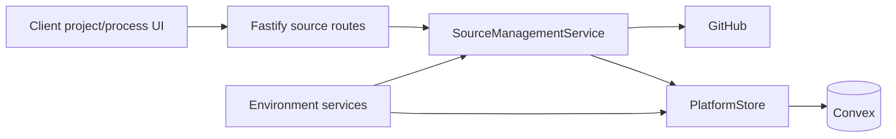
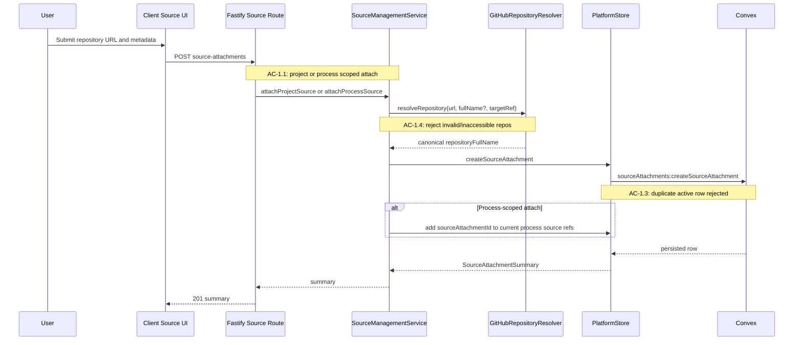
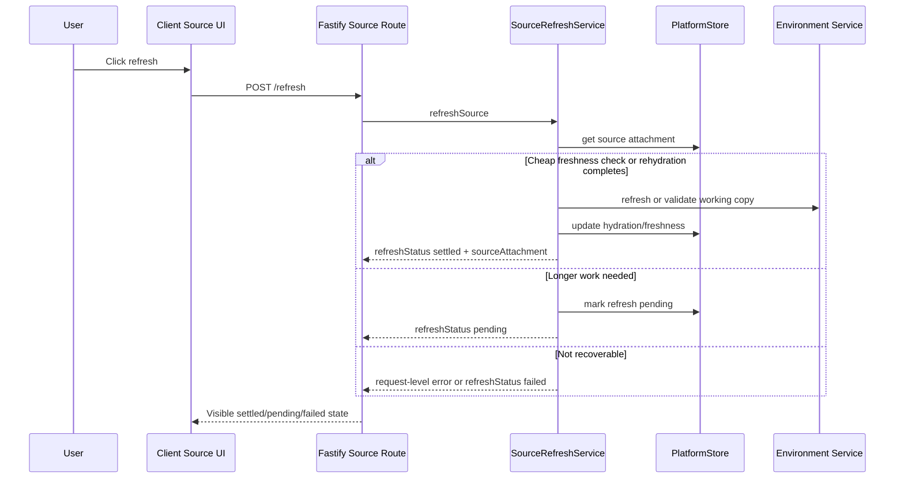
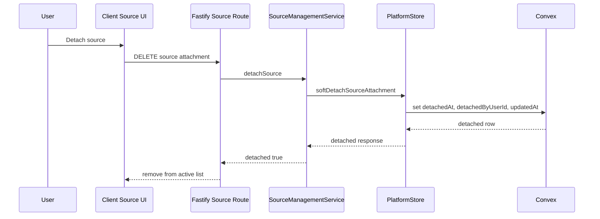

# Technical Design: Epic 6 Source Attachments and Canonical Source Management

## Purpose

This document translates Epic 6 into an implementable design for repository
source-management. It is the implementation blueprint for source attachment
lifecycle, source identity, freshness, provenance, detach, and reopen behavior.

| Audience | Value |
|----------|-------|
| Reviewers | Validate that Epic 6 fits the core platform architecture before code is written |
| Developers | Know which files, services, Convex functions, and contracts to change |
| Story Tech Sections | Reuse module responsibilities, interfaces, test mappings, and chunk boundaries |

Related documents:

- Epic: `docs/spec-build/v2/epics/06--source-attachments-and-canonical-source-management/epic.md`
- Test plan: `docs/spec-build/v2/epics/06--source-attachments-and-canonical-source-management/test-plan.md`
- Architecture: `docs/spec-build/v2/core-platform-arch.md`
- PRD: `docs/spec-build/v2/core-platform-prd.md`

Output configuration: Config A. Epic 6 gets this `tech-design.md` and a separate
`test-plan.md`. The work crosses client, Fastify, Convex, environment, and
GitHub boundaries, but the source-management slice is still coherent enough to
keep implementation depth in one index document.

## Spec Validation

Epic 6 is implementation-ready. The epic covers repository source lifecycle
only, leaves archive and derived views to Epic 7, and defers MCP/external-source
attachment beyond the Epic 5-7 sequence.

| Issue | Spec Location | Resolution | Status |
|-------|---------------|------------|--------|
| Source identity needs both operational URL and canonical GitHub identity | Data Contracts, AC-1.3, AC-4.x | Design stores `repositoryUrl` for clone/write operations and `repositoryFullName` for uniqueness/provenance. `repositoryFullName` is derived server-side when omitted. | Resolved - clarified |
| Refresh cannot always settle synchronously | AC-3.3, Refresh Response | Design returns `refreshStatus: settled | pending | failed`, with pending as operation metadata rather than a fifth hydration state. | Resolved - clarified |
| Process-scoped shadowing needs exact read rule | Tech Design Question 7 | Design defines an active-source resolver that combines project-scoped and process-scoped attachments, shadows by `repositoryFullName + targetRef`, and excludes detached rows. | Resolved |
| Detach representation needs exact storage shape | Tech Design Question 8 | Design adds soft-detach fields (`detachedAt`, `detachedByUserId`) and active-list filters. | Resolved |
| Source provenance storage is deferred by epic | AC-4.x | Design introduces durable `sourceProvenance` records with copied immutable source identity. | Resolved |

No design-time deviation from the PRD or architecture is required. Fastify
continues to own source-management policy and orchestration; Convex owns durable
records and atomic persistence invariants.

## Tech Design Questions Answered

| # | Epic Question | Design Answer |
|---|---------------|---------------|
| 1 | What exact browser interaction model should attach, update, refresh, and detach use without creating a separate source-management app? | Extend the existing project shell and process work surface. Project-scoped actions appear in the project source section; process-scoped actions appear in the process materials/source area. Client calls Fastify JSON APIs and renders settled/pending/degraded responses in-place. No standalone source app or live source subscription is added. |
| 2 | What exact durable schema should represent source attachments and provenance visibility? | Extend `sourceAttachments` with `repositoryFullName`, freshness fields, refresh progress fields, and soft-detach fields. Add `sourceProvenance` for process-specific provenance with copied immutable source identity. Artifact ownership remains untouched. |
| 3 | What exact conflict rule applies for same repository/target ref across related contexts? | Duplicate key is active `projectId + processId + repositoryFullName + targetRef`. Same identity/ref may exist once at project scope and once at process scope. Process-scoped rows shadow project-scoped rows only for that process's current-source read. |
| 4 | What exact refresh/freshness policy maps to the four source states? | The canonical states remain `not_hydrated`, `hydrated`, `stale`, and `unavailable`. Target-ref changes make hydrated rows stale. Refresh returns settled/pending/failed operation metadata; pending is not a fifth hydration state. Branch freshness is checked when the surface reads or refresh is requested, not by background polling. |
| 5 | What provenance surface shows informed-work and received-code-update relationships? | Add a process provenance endpoint and client section that reads durable `sourceProvenance` entries. Entries are `informed_work` or `received_code_update`, copy repository identity, and enrich current attachment context independently when available. |
| 6 | How should shell/process surfaces stay coherent across project and process scope? | Keep project shell source summaries for project-wide management. Process work surfaces show current sources after active-source resolution, including process-scoped shadowing and applicable project-scoped rows. |
| 7 | What exact current-source read algorithm combines scopes and degrades boundedly? | `resolveActiveProcessSources` excludes detached rows, starts from current material refs, pulls in process-scoped siblings when they shadow an active project-scoped source, partitions by scope, shadows by `repositoryFullName + targetRef`, sorts by `updatedAt`, and preserves per-row degraded metadata. |
| 8 | What soft-detach representation preserves identity and provenance? | Add `detachedAt` and `detachedByUserId` to source attachments. Active listings filter detached rows, but provenance entries remain durable because they copy identity and may retain nullable `sourceAttachmentId`. |

## Context

Epic 6 implements the repository-focused half of PRD Feature 5. Earlier epics
already made source attachments visible enough for hydration and checkpointing,
but that substrate is not yet a complete management surface. Today, Convex has a
`sourceAttachments` table, project shell summaries expose attached sources, and
process materials can show current source references. Environment hydration and
code checkpointing already use `repositoryUrl` as the operational clone/write
address.

The missing layer is user- and process-facing source management. A user needs to
attach a GitHub repository to a project or to one process, classify why it is
attached, understand whether it can receive writes, refresh stale or missing
working copies, detach it from current use without erasing history, and later
understand which sources informed or received process work. Those behaviors
cannot be implicit side effects of environment hydration.

The core architecture shapes the design. GitHub remains code truth. The
sandboxed filesystem is only a disposable working copy. Fastify is the source
management control plane: it validates repository identity, enforces project and
process access, resolves shadowing rules, coordinates refresh, and records
provenance intent. Convex stores durable source attachment and provenance rows
behind Fastify with validators and indexes that preserve integrity.

Epic 6 also establishes contracts that Epic 7 will consume. Source provenance is
durable and process-specific; it copies immutable repository identity at the
time work is informed or code is updated. Archive entries in Epic 7 can link to
those provenance records without asking source attachments to become archive
truth.

## System View

### Top-Tier Surfaces

| Surface | Source | This Epic's Role |
|---------|--------|------------------|
| Projects | Core architecture | Project-scoped source attachments appear in the project shell and can be managed there |
| Processes | Core architecture | Process-scoped attachments, current-source views, and source provenance appear in the process work surface |
| Sources | Core architecture | Primary Epic 6 domain; owns repository attachment lifecycle, freshness, detach, and provenance records |
| Environments | Core architecture | Hydrates active source attachments and reports freshness/checkpoint effects |
| Tool Runtime | Core architecture | Produces source-use and code-update signals through environment execution results |
| Archive | Core architecture | Downstream consumer only; Epic 6 provides source provenance that Epic 7 can reference |

### Runtime Flow



The normal path starts in the existing project shell or process work surface.
The client calls Fastify API routes. Fastify validates auth and project/process
access, delegates source-specific decisions to `SourceManagementService`, then
persists through `PlatformStore` into Convex. GitHub is consulted for repository
identity and accessibility; environment services consume active source summaries
for hydration and checkpointing.

### External Contracts

Epic 6 introduces no new third-party package. It uses the existing GitHub
integration surface already present for code checkpointing.

| External Boundary | Used For | Mock Strategy |
|-------------------|----------|---------------|
| GitHub API / clone identity | Validate repository existence, access, canonical `owner/name`, and target ref resolution | Mock in server service tests through a `GitHubRepositoryResolver` interface |
| Environment provider | Refresh or rehydrate working copies when needed | Mock provider adapter/service in process-level tests; do not mock internal source services |
| Convex | Durable source attachment and provenance persistence | Use Convex function tests for durable invariants; in Fastify service tests use existing PlatformStore fakes or in-memory harnesses |

### Runtime Prerequisites

| Prerequisite | Where Needed | How to Verify |
|--------------|--------------|---------------|
| WorkOS-authenticated Fastify request | All source-management routes | Existing auth middleware populates `request.actor` |
| GitHub token/config | Repository validation and branch freshness checks | Epic 6 introduces a dedicated `GitHubRepositoryResolver` seam over the existing app GitHub configuration |
| Convex deployment/local backend | Durable source and provenance records | `pnpm run convex:dev` for runtime; tests use in-memory/mocked stores |
| Environment refresh seam | Refresh/recovery paths | Epic 6 introduces a dedicated source refresh seam over existing process/environment services rather than assuming a full source-management implementation already exists |
| Existing verification scripts | Story execution | `pnpm run red-verify`, `pnpm run verify`, `pnpm run green-verify`, `pnpm run verify-all` |

## Decisions

| Decision | Rationale | Consequence |
|----------|-----------|-------------|
| Keep `repositoryUrl` and add `repositoryFullName` | `repositoryUrl` is operational clone/write input; `owner/name` is stable GitHub identity for uniqueness and provenance | Create accepts URL-first requests and may derive full name; persisted summaries return both |
| Source-management routes live in Fastify | Architecture says Fastify owns orchestration, auth, integrations, and source policy | Convex functions remain trusted persistence operations, not public app API |
| Soft detach rather than hard delete | Prior provenance and historical source identity must remain visible after detach | Active source reads filter detached rows; provenance can still resolve copied identity |
| Refresh may be pending | Repo fetch/hydration work can exceed a short request | Pending state is operation metadata, not a fifth canonical hydration state |
| Process-scoped attach updates current process source refs immediately | The epic says a process-scoped attachment belongs to one process as current source state and becomes visible immediately | `attachProcessSource` persists the source row and adds its id to that process's current source refs in the same orchestration path |
| Process scope shadows project scope only in current-source reads | Same repo can be useful both project-wide and process-specific | Durable rows can coexist; resolver picks process-scoped row for that process when identity/ref collide |
| Read-write attachments require branch-like target refs | Durable code updates need a writable moving ref rather than an immutable commit/tag | `read_write` attachments reject tag/commit target refs; `read_only` attachments may use branch/tag/commit |
| Provenance records copy immutable identity | Detach or access loss must not erase process history | Provenance stores `repositoryFullName`, `repositoryUrl`, `targetRef`, relationship kind, and optional attachment id |

## Module Boundaries

### File Architecture

```
convex/
├── sourceAttachments.ts                         # MODIFIED: durable CRUD/query functions for source lifecycle
├── sourceProvenance.ts                          # NEW: durable source provenance records and process reads
└── schema.ts                                    # MODIFIED: source fields, provenance table, indexes

apps/platform/shared/contracts/
├── schemas.ts                                   # MODIFIED: source summary fields, source provenance schemas
├── source-management.ts                         # NEW: route request/response contracts and route constants
└── index.ts                                     # MODIFIED: exports

apps/platform/server/schemas/
└── source-management.ts                         # NEW: Zod route schemas for source-management APIs

apps/platform/server/routes/
└── source-management.ts                         # NEW: Fastify routes for attach/update/refresh/detach/provenance

apps/platform/server/services/sources/
├── source-management.service.ts                 # NEW: orchestration, validation, conflict/shadowing policy
├── source-identity.service.ts                   # NEW: URL parsing, canonical full-name derivation, target-ref normalization
├── github-repository-resolver.ts                # NEW: GitHub access/ref validation boundary
├── source-refresh.service.ts                    # NEW: refresh request handling and pending/settled result shaping
└── source-provenance.service.ts                 # NEW: provenance record creation/read enrichment

apps/platform/server/services/projects/
├── platform-store.ts                            # MODIFIED: source lifecycle/provenance methods
└── readers/source-section.reader.ts             # MODIFIED: active/non-detached project source summaries

apps/platform/server/services/processes/readers/
└── materials-section.reader.ts                  # MODIFIED: active-source resolver and process shadowing

apps/platform/client/features/projects/
└── source-attachment-section.ts                 # MODIFIED: management controls and pending/degraded state display

apps/platform/client/features/processes/
├── process-materials-section.ts                 # MODIFIED: current-source shadowing/freshness/provenance display
└── source-provenance-section.ts                 # NEW: process provenance section

tests/
├── fixtures/sources.ts                          # MODIFIED: repositoryFullName, freshness, detach, provenance fixtures
├── service/server/source-management-api.test.ts # NEW: Fastify route/service tests
├── service/server/source-management-service.test.ts # NEW: pure policy/resolver tests
├── service/client/source-management-ui.test.ts  # NEW: client behavior tests
└── service/client/source-provenance-section.test.ts # NEW: provenance UI tests
```

### Module Responsibility Matrix

| Module | Status | Responsibility | Dependencies | ACs Covered |
|--------|--------|----------------|--------------|-------------|
| `convex/sourceAttachments.ts` | Modified | Persist source rows, active queries, duplicate indexes, soft detach fields, hydration/freshness updates | Convex validators/schema | AC-1.x, AC-2.x, AC-3.x, AC-5.x, AC-6.x |
| `convex/sourceProvenance.ts` | New | Persist and read process-scoped provenance entries with copied source identity | Convex validators/schema | AC-4.x, AC-5.2 |
| `source-management.ts` contracts | New | Shared request/response schemas, error codes, route constants | Zod shared schemas | All route-facing ACs |
| `registerSourceManagementRoutes` | New | Authenticated Fastify API entry points | SourceManagementService, access services | AC-1.x through AC-6.x |
| `SourceManagementService` | New | Attach/update/detach orchestration, conflict rules, scope enforcement | PlatformStore, SourceIdentityService, GitHubRepositoryResolver | AC-1.x, AC-2.x, AC-5.x, AC-6.2 |
| `SourceRefreshService` | New | Refresh request policy, settled/pending/failed response mapping | PlatformStore, environment/service hooks, GitHub resolver | AC-3.x |
| `SourceProvenanceService` | New | Record/read provenance, enrich degraded entries independently | PlatformStore | AC-4.x, AC-5.2 |
| `MaterialsSectionReader` | Modified | Resolve current process sources with process-scoped shadowing and detached filtering | PlatformStore | AC-2.1, AC-3.1, AC-6.1 |
| `SourceSectionReader` | Modified | Project shell source summaries, excluding inactive rows from active lists | PlatformStore | AC-1.2, AC-2.1, AC-3.1, AC-5.3, AC-6.1 |
| Client source sections | Modified/New | Render management controls, freshness, provenance, detach, degraded states | Shared contracts | AC-1.2, AC-2.x, AC-3.x, AC-4.x, AC-5.x, AC-6.x |

## Data Model

### Convex `sourceAttachments`

The existing table remains the durable source attachment table. Epic 6 extends
it rather than introducing a parallel source identity table.

```typescript
export const sourceAttachmentsTableFields = {
  projectId: v.string(),
  processId: v.union(v.string(), v.null()),
  provider: v.literal('github'),
  displayName: v.string(),
  purpose: v.union(v.literal('research'), v.literal('review'), v.literal('implementation'), v.literal('other')),
  accessMode: v.union(v.literal('read_only'), v.literal('read_write')),
  repositoryUrl: v.string(),
  repositoryFullName: v.string(),
  targetRef: v.union(v.string(), v.null()),
  hydrationState: v.union(v.literal('not_hydrated'), v.literal('hydrated'), v.literal('stale'), v.literal('unavailable')),
  lastHydratedAt: v.union(v.string(), v.null()),
  lastHydratedResolvedRef: v.union(v.string(), v.null()),
  lastObservedRemoteResolvedRef: v.union(v.string(), v.null()),
  freshnessReason: v.union(v.string(), v.null()),
  refreshStatus: v.union(v.literal('idle'), v.literal('pending'), v.literal('failed')),
  refreshRequestedAt: v.union(v.string(), v.null()),
  detachedAt: v.union(v.string(), v.null()),
  detachedByUserId: v.union(v.string(), v.null()),
  updatedAt: v.string(),
};
```

Indexes:

| Index | Fields | Purpose |
|-------|--------|---------|
| `by_projectId_updatedAt` | `projectId`, `updatedAt` | Existing project shell reads |
| `by_projectId_processId_repositoryFullName_targetRef` | `projectId`, `processId`, `repositoryFullName`, `targetRef` | Duplicate detection and shadowing candidates |
| `by_projectId_detachedAt_updatedAt` | `projectId`, `detachedAt`, `updatedAt` | Active source listings |

Convex does not decide whether a repository is appropriate for a process. It
enforces durable invariants: valid enum values, project/process id fields,
duplicate active rows, and soft-detach persistence. Fastify computes the source
management intent before calling Convex.

Because Convex does not provide a declarative unique-index constraint, duplicate
prevention must be implemented inside the create mutation by querying
`by_projectId_processId_repositoryFullName_targetRef` for active rows and
rejecting matches where `detachedAt === null`. Fastify should also preflight for
better error messages, but Convex owns the final atomic guard.

Freshness for moving branch refs depends on durable snapshot fields:

- `lastHydratedResolvedRef`: the commit SHA or resolved ref hydrated into the working copy
- `lastObservedRemoteResolvedRef`: the most recently observed remote branch resolution

For branch refs, the read/refresh path resolves the current remote branch head
and compares it to `lastHydratedResolvedRef`. If they differ, the source becomes
`stale`. For tag or commit refs on `read_only` attachments, Epic 6 treats the
source as stable unless the ref becomes unavailable.

### Convex `sourceProvenance`

```typescript
export const sourceProvenanceTableFields = {
  projectId: v.string(),
  processId: v.string(),
  sourceAttachmentId: v.union(v.id('sourceAttachments'), v.null()),
  relationshipKind: v.union(v.literal('informed_work'), v.literal('received_code_update')),
  repositoryFullName: v.string(),
  repositoryUrl: v.string(),
  targetRef: v.union(v.string(), v.null()),
  eventId: v.union(v.string(), v.null()),
  entryStatus: v.union(v.literal('ready'), v.literal('degraded')),
  degradationReason: v.union(v.string(), v.null()),
  recordedAt: v.string(),
};
```

Indexes:

| Index | Fields | Purpose |
|-------|--------|---------|
| `by_processId_recordedAt` | `processId`, `recordedAt` | Process provenance reads |
| `by_sourceAttachmentId_recordedAt` | `sourceAttachmentId`, `recordedAt` | Source history and detach checks |

Provenance copies immutable identity because `sourceAttachmentId` may become
unavailable after detach. Reads should enrich from the current attachment when
possible, but the durable provenance entry is readable without it.

Each provenance read attempts to enrich these current-attachment fields when the
source row is still visible:

- `currentAttachmentDisplayName`
- `currentAttachmentScope`
- `currentAttachmentAccessMode`
- `currentAttachmentHydrationState`
- `currentAttachmentVisibility: 'available' | 'detached' | 'unavailable' | 'redacted'`

If project/process access is revoked, the response may still include the
durable provenance row when the caller otherwise has process access, but it
must redact current source details and set
`currentAttachmentVisibility: 'redacted'`.

## API Contracts

Shared contracts live in `apps/platform/shared/contracts/source-management.ts`
and are re-exported from `index.ts`.

```typescript
export type SourcePurpose = 'research' | 'review' | 'implementation' | 'other';
export type SourceAccessMode = 'read_only' | 'read_write';
export type HydrationState = 'not_hydrated' | 'hydrated' | 'stale' | 'unavailable';
export type SourceRefreshStatus = 'settled' | 'pending' | 'failed';
export type SourceProvenanceRelationship = 'informed_work' | 'received_code_update';

export interface CreateSourceAttachmentRequest {
  provider: 'github';
  repositoryUrl: string;
  repositoryFullName?: string;
  displayName: string;
  purpose: SourcePurpose;
  accessMode: SourceAccessMode;
  targetRef?: string | null;
}

export interface UpdateSourceAttachmentRequest {
  purpose?: SourcePurpose;
  accessMode?: SourceAccessMode;
  targetRef?: string | null;
}

export interface SourceAttachmentSummary {
  sourceAttachmentId: string;
  provider: 'github';
  repositoryUrl: string;
  repositoryFullName: string;
  displayName: string;
  attachmentScope: 'project' | 'process';
  processId: string | null;
  processDisplayLabel: string | null;
  purpose: SourcePurpose;
  accessMode: SourceAccessMode;
  targetRef: string | null;
  hydrationState: HydrationState;
  lastHydratedAt: string | null;
  lastHydratedResolvedRef: string | null;
  lastObservedRemoteResolvedRef: string | null;
  freshnessReason: string | null;
  refreshStatus?: 'idle' | 'pending' | 'failed';
  refreshRequestedAt?: string | null;
  detachedAt?: string | null;
  updatedAt: string;
}

export interface RefreshSourceAttachmentResponse {
  sourceAttachment?: SourceAttachmentSummary;
  refreshStatus: SourceRefreshStatus;
  refreshRequestedAt?: string;
}

export interface SourceProvenanceEntry {
  provenanceId: string;
  sourceAttachmentId: string | null;
  relationshipKind: SourceProvenanceRelationship;
  repositoryFullName: string;
  repositoryUrl: string;
  targetRef: string | null;
  currentAttachmentDisplayName: string | null;
  currentAttachmentScope: 'project' | 'process' | null;
  currentAttachmentAccessMode: SourceAccessMode | null;
  currentAttachmentHydrationState: HydrationState | null;
  currentAttachmentVisibility: 'available' | 'detached' | 'unavailable' | 'redacted';
  entryStatus: 'ready' | 'degraded';
  degradationReason: string | null;
  recordedAt: string;
}
```

### Routes

| Operation | Method | Path | Service Method |
|-----------|--------|------|----------------|
| Attach project source | POST | `/api/projects/:projectId/source-attachments` | `attachProjectSource` |
| Attach process source | POST | `/api/projects/:projectId/processes/:processId/source-attachments` | `attachProcessSource` |
| Update source | PATCH | `/api/projects/:projectId/source-attachments/:sourceAttachmentId` | `updateSource` |
| Refresh source | POST | `/api/projects/:projectId/source-attachments/:sourceAttachmentId/refresh` | `refreshSource` |
| Detach source | DELETE | `/api/projects/:projectId/source-attachments/:sourceAttachmentId` | `detachSource` |
| Get process source provenance | GET | `/api/projects/:projectId/processes/:processId/source-provenance` | `listProcessSourceProvenance` |

All routes require authenticated access. Project-scoped routes call the existing
`app.projectAccessService`; process-scoped attach/provenance reads also call
`app.processAccessService`.

### Error Codes

| Status | Code | Meaning |
|--------|------|---------|
| 401 | `UNAUTHENTICATED` | Actor is missing |
| 403 | `PROJECT_FORBIDDEN` | Actor lacks project access |
| 403 | `PROCESS_FORBIDDEN` | Actor lacks process access |
| 404 | `PROJECT_NOT_FOUND` | Project does not exist |
| 404 | `PROCESS_NOT_FOUND` | Process does not exist in project |
| 404 | `SOURCE_ATTACHMENT_NOT_FOUND` | Source attachment does not exist in project |
| 409 | `SOURCE_ATTACHMENT_CONFLICT` | Active row already exists for same identity, scope, and target ref, or the update would violate writable-ref policy |
| 409 | `SOURCE_ATTACHMENT_REFRESH_NOT_AVAILABLE` | Refresh cannot be accepted for this attachment state |
| 422 | `INVALID_SOURCE_ATTACHMENT` | Request body, repository identity, or target-ref policy is invalid |
| 503 | `SOURCE_ATTACHMENT_UNAVAILABLE` | GitHub repository/ref cannot be accessed right now |

## Service Interfaces

```typescript
export interface GitHubRepositoryResolver {
  resolveRepository(args: {
    repositoryUrl: string;
    repositoryFullName?: string;
    targetRef: string | null;
  }): Promise<
    | {
        kind: 'resolved';
        repositoryUrl: string;
        repositoryFullName: string;
        targetRef: string | null;
      }
    | { kind: 'invalid'; message: string }
    | { kind: 'inaccessible'; message: string }
  >;
}

export interface SourceManagementService {
  attachProjectSource(args: {
    actor: AuthenticatedActor;
    projectId: string;
    input: CreateSourceAttachmentRequest;
  }): Promise<SourceAttachmentSummary>;

  attachProcessSource(args: {
    actor: AuthenticatedActor;
    projectId: string;
    processId: string;
    input: CreateSourceAttachmentRequest;
  }): Promise<SourceAttachmentSummary>;

  updateSource(args: {
    actor: AuthenticatedActor;
    projectId: string;
    sourceAttachmentId: string;
    input: UpdateSourceAttachmentRequest;
  }): Promise<SourceAttachmentSummary>;

  detachSource(args: {
    actor: AuthenticatedActor;
    projectId: string;
    sourceAttachmentId: string;
  }): Promise<{ detached: true; sourceAttachmentId: string; detachedAt: string }>;
}

export interface SourceRefreshService {
  refreshSource(args: {
    actor: AuthenticatedActor;
    projectId: string;
    sourceAttachmentId: string;
  }): Promise<RefreshSourceAttachmentResponse>;
}

export interface SourceProvenanceService {
  recordSourceProvenance(args: {
    projectId: string;
    processId: string;
    sourceAttachmentId: string | null;
    relationshipKind: SourceProvenanceRelationship;
    repositoryFullName: string;
    repositoryUrl: string;
    targetRef: string | null;
    eventId?: string | null;
  }): Promise<SourceProvenanceEntry>;

  listProcessSourceProvenance(args: {
    actor: AuthenticatedActor;
    projectId: string;
    processId: string;
  }): Promise<{ entries: SourceProvenanceEntry[] }>;
}
```

## Flow-by-Flow Design

### Flow 1: Attach Repositories

This flow covers AC-1.1 through AC-1.4. The user attaches a GitHub repository
from either the project shell or a process work surface. Fastify validates scope
and repository identity before Convex persists the row.



For process-scoped attach, `SourceManagementService` must update the process's
current source refs so the new source appears immediately in
`materials.currentSources`. Project-scoped attach creates a durable shared
source row but does not automatically make that source current for every
process.

### Flow 2: Manage Purpose, Access Mode, and Target Ref

This flow covers AC-2.1 through AC-2.4. Purpose and access mode are durable
metadata. Target ref is part of the source definition; changing it marks a
previously hydrated attachment stale until refresh/rehydration catches up.

`SourceManagementService.updateSource` validates the actor, loads the active
source row, normalizes the target ref, and calls `PlatformStore.updateSource`.
Convex applies the update atomically. If the target ref changes while
`hydrationState === 'hydrated'`, the Fastify-side service includes the requested
freshness transition in the write plan and Convex persists it with the metadata
update. The resulting row uses `hydrationState: 'stale'` and a
`freshnessReason` such as `target_ref_changed`.

For `read_write` sources, the service validates that `targetRef` is a writable
branch ref before persistence. If `targetRef` is omitted for `read_write`,
Epic 6 resolves it to the repository default branch before the row is written.
`read_only` sources may use branch, tag, or commit refs.

### Flow 3: Hydration and Freshness

This flow covers AC-3.1 through AC-3.3. The four canonical states remain
`not_hydrated`, `hydrated`, `stale`, and `unavailable`. Pending refresh is not a
state in that enum; it is operation progress metadata returned by refresh and
visible in the client.

Branch freshness is evaluated from durable snapshot state plus live repository
resolution:

- if `targetRef` is a branch and the current remote resolution differs from
  `lastHydratedResolvedRef`, return `stale`
- if the working copy is recoverably missing, return `stale` with
  `freshnessReason: 'working_copy_missing'`
- if the branch/ref cannot be resolved safely, return `unavailable`
- if the source is `read_only` with a tag/commit ref, keep it `hydrated` unless
  the ref becomes unavailable
- for project-scoped sources surfaced on the project shell, only offer or accept
  refresh when exactly one current process working-copy target can be resolved;
  otherwise the project-shell control should be hidden/disabled and the backend
  should return request-level refresh-not-available rather than inventing a
  target



### Flow 4: Source Provenance

This flow covers AC-4.1 through AC-4.4. Process execution records provenance at
two moments: when an attached source informs process work and when a writable
source receives a durable code update. Environment execution services already
know the current source attachment ids and code checkpoint targets; Epic 6 adds
explicit provenance recording through `SourceProvenanceService`.

Read-only attachments can record `informed_work` but must not be represented as
`received_code_update`. Code checkpoint planning already blocks writes to
read-only sources; provenance records reinforce that boundary by deriving write
provenance only from successful writable checkpoint results.

Refresh does not create provenance. Provenance is reserved for execution-time
source influence and durable code updates so AC-4 remains about process work,
not source maintenance.

### Flow 5: Detach Sources

This flow covers AC-5.1 through AC-5.3. Detach is a soft operation. It removes
the source from future active source lists and current-source resolution, but it
does not delete provenance or mutate an already hydrated working copy mid-run.



### Flow 6: Reopen and Degraded State

This flow covers AC-6.1 through AC-6.3. Project shell and process work surface
reads continue to return section envelopes. One failed source/provenance lookup
must degrade locally rather than hiding healthy source rows.

`SourceSectionReader` and `MaterialsSectionReader` should preserve the existing
section envelope pattern. Active lists exclude detached rows; process materials
use the active-source resolver to combine project and process scopes. If an
enrichment lookup fails, the reader returns durable source identity with
`entryStatus: degraded` or a section-level source error only when the whole
section cannot load.

## Active Source Resolution

The active-source resolver is the central design answer for process-scoped
shadowing. It affects the process work surface and environment working-set
planning; it does not make every project-scoped source automatically current
for every process. A process sees only source attachments referenced by its
current material refs, after active filtering and shadowing are applied.

```typescript
export function resolveActiveProcessSources(args: {
  projectSources: SourceAttachmentSummary[];
  processId: string;
  currentSourceAttachmentIds: string[];
}): ProcessSourceReference[] {
  throw new NotImplementedError('resolveActiveProcessSources');
}
```

Resolution rules:

1. Exclude rows with `detachedAt`.
2. Build the base active set from rows whose `sourceAttachmentId` is in
   `currentSourceAttachmentIds`.
3. Partition active rows into project-scoped rows and rows where `processId`
   matches.
4. Compute shadow key as `${repositoryFullName}:${targetRef ?? ''}`.
5. If an active project-scoped row has a process-scoped sibling with the same
   shadow key, include the process-scoped sibling in the candidate set even when
   its id is not yet in `currentSourceAttachmentIds`.
6. Prefer the matching process-scoped row over the project-scoped row for that
   process only.
7. Sort visible rows by `updatedAt` descending.
8. Preserve degraded metadata independently per row.

This resolver belongs in Fastify/shared server logic, not Convex. Convex stores
rows; Fastify decides how one process sees its current source material.

## Implementation Chunks

| Chunk | Story | Scope | ACs | Primary Tests |
|-------|-------|-------|-----|---------------|
| 0 | Foundation | Shared contracts, Convex schema/indexes, fixtures, errors, resolver skeletons | All support | Relevant sections: API Contracts, Data Model. Non-TC: shared contract/schema expansion |
| 1 | Attach repositories | Routes, service validation, GitHub resolver, duplicate checks, process current-source mutation | AC-1.x | Relevant sections: Flow 1, Service Interfaces, Error Codes. Non-TC: URL/full-name mismatch, writable-ref policy, non-GitHub rejection |
| 2 | Manage metadata | Update route, target-ref stale logic, UI metadata display | AC-2.x | Relevant sections: Flow 2, API Contracts. Non-TC: none |
| 3 | Hydration/freshness | Refresh route, pending/settled/failed responses, branch snapshot comparison, freshness UI | AC-3.x | Relevant sections: Flow 3, Data Model. Non-TC: branch-head drift, refresh contract semantics |
| 4 | Provenance | Provenance records, process read endpoint, degraded enrichment, redaction behavior | AC-4.x | Relevant sections: Flow 4, Data Model, API Contracts. Non-TC: unavailable-source redaction |
| 5 | Detach | Soft detach, active-list filtering, provenance retention | AC-5.x | Relevant sections: Flow 5, Active Source Resolution. Non-TC: detached-row durability |
| 6 | Reopen/degraded | Reopen surfaces, access loss, partial failure behavior | AC-6.x | Relevant sections: Flow 6, Error Codes. Non-TC: none |

Chunk 0 creates durable vocabulary and fixtures. Chunks 1-6 should follow the
TDD loop: skeleton stubs, Red tests, Green implementation, then `green-verify`.

## Verification

| Script | Command | Use |
|--------|---------|-----|
| `red-verify` | `pnpm run red-verify` | After skeleton and Red tests; tests may fail but format/lint/typecheck/build pass |
| `verify` | `pnpm run verify` | Standard development gate |
| `green-verify` | `pnpm run green-verify` | After implementation passes; includes current no-test-changes guard |
| `verify-all` | `pnpm run verify-all` | Epic/story completion and integration confidence |

## Deferred Items

| Item | Related AC | Reason Deferred | Future Work |
|------|------------|-----------------|-------------|
| MCP-backed source attachment | Scope | Epic 6 is repository-focused | Later source-integration epic |
| Archive/turn/chunk views | Scope | Owned by Epic 7 | Epic 7 |
| Full background freshness polling | AC-3.x | Epic 6 uses read/request freshness checks | Later operational monitoring work |
| Complex branch protection/write policy UI | AC-2.x, AC-4.x | Epic 6 only distinguishes read-only vs writable and target ref | Later GitHub policy work |

## Resolved Implementation Decisions

| Decision | Applied In |
|----------|------------|
| Pending refresh is stored on the source row with `refreshStatus` and `refreshRequestedAt`; Epic 6 does not add a separate refresh-operations table. | Chunk 3 |
| `read_write` attachments require branch-like target refs. `read_only` attachments may use branch, tag, or commit refs. | Chunk 1 |
| Provenance is recorded only for execution-time source influence and durable code updates, never for manual refresh. | Chunk 4 |

## Self-Review Checklist

- [x] Every Epic 6 AC has a module owner.
- [x] Every Epic 6 TC is mapped in `test-plan.md`.
- [x] Fastify/Convex boundary is explicit.
- [x] Source identity and shadowing are explicit.
- [x] Refresh pending state is not a fifth hydration state.
- [x] Verification commands use project scripts.
