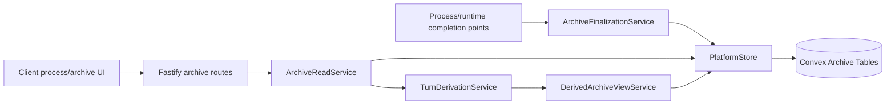
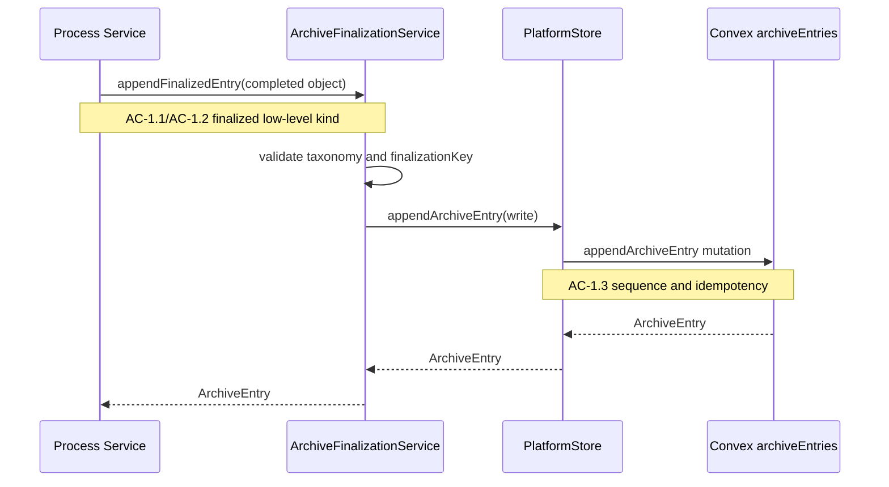

# Technical Design: Epic 7 Archive and Derived Views

## Purpose

This document translates Epic 7 into an implementable design for canonical
process archive, turn derivation, and non-summarizing structural derived views.
It is the implementation blueprint for preserving finalized low-level process
history while keeping live process state, turns, and derived views separate from
canonical truth.

| Audience | Value |
|----------|-------|
| Reviewers | Validate that archive work follows the core platform architecture |
| Developers | Know which routes, services, Convex functions, contracts, and tests to build |
| Story Tech Sections | Reuse interfaces, flow designs, TC mappings, and chunk breakdowns |

Related documents:

- Epic: `docs/spec-build/v2/epics/07--archive-and-derived-views/epic.md`
- Test plan: `docs/spec-build/v2/epics/07--archive-and-derived-views/test-plan.md`
- Architecture: `docs/spec-build/v2/core-platform-arch.md`
- Epic 6 tech design: `docs/spec-build/v2/epics/06--source-attachments-and-canonical-source-management/tech-design.md`

Output configuration: Config A. Epic 7 gets this `tech-design.md` and a separate
`test-plan.md`. The work crosses live process, Fastify, Convex, and client read
surfaces, but the archive domain is coherent enough for one index document.

## Spec Validation

Epic 7 is implementation-ready. It is scoped to canonical finalized archive
entries, deterministic turn derivation, minimal structural derived views, and
bounded degraded reads. It explicitly avoids model-generated summaries,
external-source attachment, and replacing the existing live WebSocket/upsert
model.

| Issue | Spec Location | Resolution | Status |
|-------|---------------|------------|--------|
| Current `processHistoryItems` vocabulary differs from canonical archive taxonomy | Baseline, Tech Design Question 2 | Design adds new `archiveEntries` while bridging current history for compatibility. No historical migration/backfill is included. | Resolved - clarified |
| Finalization boundary must prevent raw deltas and interrupted partial objects | AC-2.x, Tech Design Question 3 | Design introduces `ArchiveFinalizationService` and `finalizationKey` idempotency. Only completed objects call append. | Resolved |
| Turn and derived-view persistence could accidentally become canonical truth | AC-4.x, AC-5.x | Design treats turns and derived views as cached/rebuildable projections over `archiveEntries`. | Resolved |
| Minimal derived view could drift into summarization | AC-5.x | Design limits derived views to structural `turn_range` and `chunk_candidate` records without generated summary body. | Resolved |
| Provenance links must not duplicate Epic 5/6 ownership logic | AC-6.x | Design stores nullable related ids and enriches through existing artifact/source services at read time. Archive entries remain visible when enrichment degrades. | Resolved |

No design-time deviation from the PRD or architecture is required. Fastify owns
archive finalization policy, read orchestration, turn derivation, and derived
view refresh. Convex owns durable append/read storage, ordering, idempotency
guards, and optional cached projection records.

## Tech Design Questions Answered

| # | Epic Question | Design Answer |
|---|---------------|---------------|
| 1 | What durable schema stores archive entries, sequence numbers, related references, and idempotency keys? | Add `archiveEntries` with `projectId`, `processId`, `entryKind`, `sequence`, `finalizationKey`, `sourceObjectId`, body fields, related ids, status, and timestamps. Convex assigns sequence inside an append mutation and enforces `finalizationKey` idempotency per process. |
| 2 | What compatibility mapping bridges `processHistoryItems` and live updates, and is migration/backfill in scope? | Add compatibility helpers that map new finalized archive entries to existing process-history surfaces where needed. Existing `processHistoryItems` remain the legacy presentation read model. No historical migration/backfill is in scope for Epic 7. |
| 3 | What finalization boundary determines when entries are archived? | `ArchiveFinalizationService` is called only from completion points: accepted user responses, completed model/runtime objects, completed script emissions, finalized tool calls/results, and process events. Raw live deltas and interrupted partial objects never call append. |
| 4 | What derivation rules group archive entries into turns? | Turn derivation is deterministic over ordered archive entries. A `user_message` starts a new turn; following model/reasoning/script/tool/process entries attach to the active turn until the next `user_message`. Tool call/result correlation keeps paired tool entries in the same turn. |
| 5 | Should turns be persisted, computed on read, or cached with rebuild? | Turns are cached derived records in `archiveTurns` for bounded reads, but they are rebuildable from `archiveEntries` and never canonical truth. |
| 6 | What minimal derived-view representation should Epic 7 implement? | Implement structural `turn_range` and `chunk_candidate` views with source turn/archive ids, optional labels, and status metadata. No model-generated summaries or summarization prompts. |
| 7 | How should source/artifact provenance link without duplicating ownership logic? | Archive entries store nullable related ids (`relatedArtifactVersionId`, `relatedSourceProvenanceId`, `relatedToolCallId`). Read services enrich from existing artifact/source services and degrade per entry when related records are unavailable. |
| 8 | What pagination/indexing keeps reads bounded? | Convex indexes `archiveEntries` by `processId, sequence`, `archiveTurns` by `processId, turnIndex`, and derived views by `processId, updatedAt`. Fastify routes expose cursor pagination and default page limits. |
| 9 | What idempotency strategy prevents duplicate archive entries? | `appendArchiveEntry` checks `processId + finalizationKey`. A replay returns the existing entry or no-ops. Sequence assignment happens only on first append. |

## Context

The platform already has process history, but it is presentation history. The
current `processHistoryItems` table supports the process work surface and live
history upserts with a smaller vocabulary: `user_message`, `process_message`,
`progress_update`, `attention_request`, `side_work_update`, and
`process_event`. That is useful UI state, but it is not the full-fidelity
archive the PRD requires for long-horizon context management.

Epic 7 introduces canonical archive truth without tearing out the live surface.
Fastify still normalizes runtime events into typed WebSocket upserts for active
UI state. Separately, completed process objects are finalized into archive
entries at low-level grain. This preserves the active interaction model while
making later turn/query/chunk work rebuildable from a stable durable record.

The design is deliberately conservative around derived views. Turns and
structural views help later context-management work, but they do not replace
archive entries. A derived turn or chunk candidate can be rebuilt from the
archive. If derivation fails, the archive remains readable. That property is
more important than early summarization convenience.

Epic 7 also consumes Epic 5 and Epic 6 provenance without taking ownership of
those domains. Artifact versions keep producing-process provenance in the
artifact/version model. Source provenance keeps repository identity in Epic 6
records. Archive entries may link to those records and show related context, but
they do not redefine artifact ownership or source attachment lifecycle.

## System View

### Top-Tier Surfaces

| Surface | Source | This Epic's Role |
|---------|--------|------------------|
| Processes | Core architecture | Finalization points and archive read access live under one project/process |
| Archive | Core architecture | Primary Epic 7 domain; owns canonical entries and rebuildable projections |
| Projects | Core architecture | Project/process access gates archive reads |
| Artifacts | Core architecture | Provides related artifact-version context during archive reads |
| Sources | Core architecture + Epic 6 | Provides related source provenance context during archive reads |
| Client | Core architecture | Adds process-surface entry points for archive, turn, and structural-view reads |

### Runtime Flow



The append path is narrow and trusted. Fastify calls
`ArchiveFinalizationService` when a process object is complete. The service
normalizes the finalized object into canonical archive entry shape and asks
`PlatformStore` to append it. Convex assigns sequence and enforces idempotency.

The read path is broader. Fastify routes call `ArchiveReadService` for archive
entries, `TurnDerivationService` for turns, and `DerivedArchiveViewService` for
structural views. These services read durable archive data and enrich related
artifact/source context independently. A related-context failure degrades one
entry or view rather than hiding the archive.

## Decisions

| Decision | Rationale | Consequence |
|----------|-----------|-------------|
| Add new `archiveEntries` instead of replacing `processHistoryItems` | Current history is presentation-oriented and already used by live process surfaces | Epic 7 can preserve archive truth without destabilizing current UI |
| Fastify owns finalization policy | Architecture says Fastify owns orchestration and live-event normalization | Convex append functions are durable primitives with validators and idempotency guards |
| Convex assigns `sequence` atomically | Stable ordering must survive same timestamps and retries | Append mutation computes next sequence per process |
| Turns are cached projections | Long processes need bounded turn reads, but turns are derived | `archiveTurns` can be rebuilt from `archiveEntries` |
| Turn references must stay stable across rebuilds | Derived views cannot dangle when turn cache is refreshed | Turns get deterministic `turnId` values and derived views store stable turn ids plus turn-index ranges, not Convex row ids |
| Derived views are structural only | Prevents scope creep into summarization | `turn_range` and `chunk_candidate` contain boundaries/provenance, not generated summaries |
| No historical migration/backfill | Epic 7 is forward canonicalization plus compatibility bridge | Existing `processHistoryItems` remain visible, but old rows are not retroactively canonical |

## Module Boundaries

### File Architecture

```
convex/
├── archiveEntries.ts                         # NEW: append/read canonical archive entries
├── archiveTurns.ts                           # NEW: cached derived turn records
├── derivedArchiveViews.ts                    # NEW: structural derived-view records
└── schema.ts                                 # MODIFIED: archive tables and indexes

apps/platform/shared/contracts/
├── archive.ts                                # NEW: archive/turn/derived-view contracts and route builders
├── process-work-surface.ts                   # MODIFIED: optional archive entry points/actions in process surface contract
└── index.ts                                  # MODIFIED: exports

apps/platform/server/schemas/
└── archive.ts                                # NEW: Fastify route schemas for archive APIs

apps/platform/server/routes/
└── archive.ts                                # NEW: authenticated archive/turn/derived-view routes

apps/platform/server/services/archive/
├── archive-finalization.service.ts           # NEW: finalized-object to archive-entry mapping
├── archive-read.service.ts                   # NEW: archive read/enrichment/degraded-state orchestration
├── turn-derivation.service.ts                # NEW: deterministic turn derivation and rebuild
├── derived-archive-view.service.ts           # NEW: structural view creation/read/refresh
└── process-history-compat.service.ts         # NEW: bridge archive entries to existing history surface when needed

apps/platform/server/services/projects/
└── platform-store.ts                         # MODIFIED: archive append/read/projection methods

apps/platform/server/services/processes/
├── environment/process-environment.service.ts # MODIFIED: call finalization for execution/tool/process events
├── process-response.service.ts               # MODIFIED: archive accepted user responses
└── live/process-live-normalizer.ts           # UNCHANGED: live upserts remain current-object transport

apps/platform/client/features/processes/
├── archive-section.ts                        # NEW: process archive read surface
├── archive-turns-section.ts                  # NEW: derived turn surface
└── derived-archive-views-section.ts          # NEW: structural derived-view surface

apps/platform/client/app/
└── bootstrap.ts                              # MODIFIED: route archive actions to process/archive surfaces

tests/
├── fixtures/archive.ts                       # NEW: archive/turn/view fixtures
├── service/server/archive-api.test.ts        # NEW: Fastify archive route tests
├── service/server/archive-finalization.test.ts # NEW: finalization and idempotency tests
├── service/server/turn-derivation.test.ts    # NEW: deterministic turn derivation tests
├── service/client/archive-section.test.ts    # NEW: client archive rendering tests
├── service/client/archive-turns-section.test.ts # NEW: turn surface rendering tests
└── service/client/derived-archive-views.test.ts # NEW: derived-view UI tests
```

### Module Responsibility Matrix

| Module | Status | Responsibility | Dependencies | ACs Covered |
|--------|--------|----------------|--------------|-------------|
| `convex/archiveEntries.ts` | New | Append/read canonical entries, sequence assignment, idempotency guard, pagination | Convex schema | AC-1.x, AC-2.3, AC-3.x, AC-7.3 |
| `convex/archiveTurns.ts` | New | Store rebuildable cached turns | Convex schema | AC-4.x, AC-7.1 |
| `convex/derivedArchiveViews.ts` | New | Store/read structural derived views | Convex schema | AC-5.x, AC-7.x |
| `ArchiveFinalizationService` | New | Map completed process objects to archive entries; exclude deltas/partials | PlatformStore | AC-1.x, AC-2.x |
| `ArchiveReadService` | New | Read archive entries, enforce access via routes/services, enrich related context, degrade locally | PlatformStore, artifact/source services | AC-3.x, AC-6.x, AC-7.x |
| `TurnDerivationService` | New | Deterministically derive/rebuild turns from archive entries | PlatformStore | AC-4.x |
| `DerivedArchiveViewService` | New | Build/read non-summarizing structural views | PlatformStore, TurnDerivationService | AC-5.x, AC-7.x |
| `ProcessHistoryCompatService` | New | Bridge archive entries to existing history surfaces without migration | ArchiveReadService | A7, Story 0 |
| `registerArchiveRoutes` | New | Fastify entry points, auth/access, request/response validation | ProcessAccessService, archive services | AC-3.x through AC-7.x |
| Client archive sections | New | Render archive, turns, structural views, empty/degraded states | Shared contracts/API client | AC-3.x, AC-4.x, AC-5.x, AC-6.x, AC-7.x |

## Data Model

### Convex `archiveEntries`

```typescript
export const archiveEntryKindValidator = v.union(
  v.literal('user_message'),
  v.literal('model_message'),
  v.literal('reasoning'),
  v.literal('script_emission'),
  v.literal('tool_call'),
  v.literal('tool_result'),
  v.literal('process_event'),
);

export const archiveEntriesTableFields = {
  projectId: v.string(),
  processId: v.id('processes'),
  entryKind: archiveEntryKindValidator,
  sequence: v.number(),
  lifecycleState: v.literal('finalized'),
  finalizationKey: v.string(),
  sourceObjectId: v.union(v.string(), v.null()),
  bodyText: v.union(v.string(), v.null()),
  bodyData: v.union(
    v.object({
      jsonText: v.string(),
    }),
    v.null(),
  ),
  bodyFormat: v.union(v.literal('plain_text'), v.literal('markdown'), v.literal('structured'), v.literal('none')),
  relatedArtifactVersionId: v.union(v.id('artifactVersions'), v.null()),
  relatedSourceProvenanceId: v.union(v.string(), v.null()),
  relatedToolCallId: v.union(v.string(), v.null()),
  entryStatus: v.union(v.literal('ready'), v.literal('degraded')),
  degradationReason: v.union(v.string(), v.null()),
  recordedAt: v.string(),
};
```

Indexes:

| Index | Fields | Purpose |
|-------|--------|---------|
| `by_processId_sequence` | `processId`, `sequence` | Canonical archive pagination |
| `by_processId_finalizationKey` | `processId`, `finalizationKey` | Idempotency guard |
| `by_projectId_processId_recordedAt` | `projectId`, `processId`, `recordedAt` | Project/process scoped diagnostics |

`appendArchiveEntry` performs the final idempotency check and sequence assignment
inside one Convex mutation. Fastify can preflight finalization keys, but Convex
owns the atomic guard.

### Convex `archiveTurns`

```typescript
export const archiveTurnsTableFields = {
  projectId: v.string(),
  processId: v.id('processes'),
  turnId: v.string(),
  turnIndex: v.number(),
  archiveEntryIds: v.array(v.id('archiveEntries')),
  startedAt: v.string(),
  endedAt: v.string(),
  turnStatus: v.union(v.literal('ready'), v.literal('degraded')),
  degradationReason: v.union(v.string(), v.null()),
  rebuiltAt: v.string(),
};
```

Indexes:

| Index | Fields | Purpose |
|-------|--------|---------|
| `by_processId_turnId` | `processId`, `turnId` | Stable turn lookups across rebuilds |
| `by_processId_turnIndex` | `processId`, `turnIndex` | Turn pagination and stable ordering |

Turns are cached because bounded reads matter for long processes. The cache is
not canonical. `TurnDerivationService.rebuildTurns` must upsert turns by stable
`turnId` (`${processId}:turn:${turnIndex}`) so derived-view provenance stays
valid across rebuilds.

### Convex `derivedArchiveViews`

```typescript
export const derivedArchiveViewsTableFields = {
  projectId: v.string(),
  processId: v.id('processes'),
  viewKind: v.union(v.literal('turn_range'), v.literal('chunk_candidate')),
  startTurnIndex: v.union(v.number(), v.null()),
  endTurnIndex: v.union(v.number(), v.null()),
  sourceTurnIds: v.array(v.string()),
  sourceArchiveEntryIds: v.array(v.id('archiveEntries')),
  title: v.union(v.string(), v.null()),
  bodyText: v.union(v.string(), v.null()),
  viewStatus: v.union(v.literal('ready'), v.literal('degraded')),
  degradationReason: v.union(v.string(), v.null()),
  updatedAt: v.string(),
};
```

Indexes:

| Index | Fields | Purpose |
|-------|--------|---------|
| `by_processId_updatedAt` | `processId`, `updatedAt` | Derived-view reads |

For `turn_range`, `startTurnIndex` and `endTurnIndex` are required by Fastify
validation before persistence. For `chunk_candidate`, the view must include
source turn ids and source archive entry ids; it must not include generated
summary content. Derived-view rows may be deleted and recreated from turns; this
does not affect canonical archive entries.

The array fields in `archiveTurns` and `derivedArchiveViews` are intentionally
bounded. Epic 7 limits turn rows to one process turn and derived views to small
structural groupings, not unbounded child lists. Long-process pagination stays
at the archive-entry and turn level rather than trying to persist one giant
derived record.

## API Contracts

Shared contracts live in `apps/platform/shared/contracts/archive.ts`.

```typescript
export type ArchiveEntryKind =
  | 'user_message'
  | 'model_message'
  | 'reasoning'
  | 'script_emission'
  | 'tool_call'
  | 'tool_result'
  | 'process_event';

export interface ArchiveEntry {
  archiveEntryId: string;
  projectId: string;
  processId: string;
  entryKind: ArchiveEntryKind;
  sequence: number;
  lifecycleState: 'finalized';
  finalizationKey: string;
  sourceObjectId: string | null;
  bodyText: string | null;
  bodyData: { jsonText: string } | null;
  bodyFormat: 'plain_text' | 'markdown' | 'structured' | 'none';
  relatedArtifactVersionId: string | null;
  relatedSourceProvenanceId: string | null;
  relatedToolCallId: string | null;
  entryStatus: 'ready' | 'degraded';
  degradationReason: string | null;
  recordedAt: string;
}

export interface ArchivePage {
  entries: ArchiveEntry[];
  page: { cursor: string | null; nextCursor: string | null; hasMore: boolean };
}

export interface DerivedTurn {
  turnId: string;
  processId: string;
  turnIndex: number;
  archiveEntryIds: string[];
  startedAt: string;
  endedAt: string;
  turnStatus: 'ready' | 'degraded';
  degradationReason: string | null;
}

export interface DerivedArchiveView {
  derivedViewId: string;
  processId: string;
  viewKind: 'turn_range' | 'chunk_candidate';
  turnRange: { startIndex: number; endIndex: number } | null;
  sourceTurnIds: string[];
  sourceArchiveEntryIds: string[];
  title: string | null;
  bodyText: string | null;
  viewStatus: 'ready' | 'degraded';
  degradationReason: string | null;
  updatedAt: string;
}
```

### Routes

| Operation | Method | Path | Service |
|-----------|--------|------|---------|
| Get process archive | GET | `/api/projects/:projectId/processes/:processId/archive` | `ArchiveReadService.getArchive` |
| Get process turns | GET | `/api/projects/:projectId/processes/:processId/archive/turns` | `TurnDerivationService.getTurns` |
| Get derived archive views | GET | `/api/projects/:projectId/processes/:processId/archive/derived-views` | `DerivedArchiveViewService.listViews` |
| Refresh derived archive views | POST | `/api/projects/:projectId/processes/:processId/archive/derived-views/refresh` | `DerivedArchiveViewService.refreshViews` |

All routes use existing actor resolution and `app.processAccessService` to
enforce project/process access before archive services run.

### Route Validation and Error Responses

`apps/platform/server/schemas/archive.ts` should define these route schemas:

- archive page query: `cursor?: string | null`, `limit?: number`
- turn page query: `cursor?: string | null`, `limit?: number`
- derived-view refresh body: empty object for Epic 7

Route responses:

| Route | 200 | Errors |
|-------|-----|--------|
| `GET /archive` | `ArchivePage` | `401`, `403`, `404`, `422` |
| `GET /archive/turns` | `{ turns, page }` | `401`, `403`, `404`, `422` |
| `GET /archive/derived-views` | `{ views }` | `401`, `403`, `404`, `422` |
| `POST /archive/derived-views/refresh` | `{ views, refreshStatus }` | `401`, `403`, `404`, `409`, `422` |

Error codes:

| Status | Code | Meaning |
|--------|------|---------|
| 401 | `UNAUTHENTICATED` | Actor is missing |
| 403 | `PROJECT_FORBIDDEN` | Actor lacks project access |
| 404 | `PROJECT_NOT_FOUND` | Project does not exist |
| 404 | `PROCESS_NOT_FOUND` | Process does not exist in project |
| 409 | `ARCHIVE_DERIVATION_CONFLICT` | Derived-view refresh cannot safely reconcile with current archive state |
| 422 | `INVALID_ARCHIVE_REQUEST` | Cursor, limit, or derived-view refresh request is invalid |

## Service Interfaces

```typescript
export interface ArchiveFinalizationService {
  appendFinalizedEntry(args: {
    projectId: string;
    processId: string;
    entryKind: ArchiveEntryKind;
    finalizationKey: string;
    sourceObjectId?: string | null;
    bodyText?: string | null;
    bodyData?: { jsonText: string } | null;
    bodyFormat: ArchiveEntry['bodyFormat'];
    relatedArtifactVersionId?: string | null;
    relatedSourceProvenanceId?: string | null;
    relatedToolCallId?: string | null;
  }): Promise<ArchiveEntry>;

  appendFromProcessHistoryItem(args: {
    projectId: string;
    processId: string;
    historyItem: ProcessHistoryItem;
  }): Promise<ArchiveEntry | null>;
}

export interface ArchiveReadService {
  getArchive(args: {
    actor: AuthenticatedActor;
    projectId: string;
    processId: string;
    cursor?: string | null;
    limit?: number;
  }): Promise<ArchivePage>;
}

export interface TurnDerivationService {
  // Rebuilds cached turns by deterministic turnId rather than recreating
  // opaque row ids, so downstream view provenance remains stable.
  rebuildTurns(args: { projectId: string; processId: string }): Promise<DerivedTurn[]>;
  getTurns(args: {
    actor: AuthenticatedActor;
    projectId: string;
    processId: string;
    cursor?: string | null;
    limit?: number;
  }): Promise<{ turns: DerivedTurn[]; page: ArchivePage['page'] }>;
}

export interface DerivedArchiveViewService {
  listViews(args: {
    actor: AuthenticatedActor;
    projectId: string;
    processId: string;
  }): Promise<{ views: DerivedArchiveView[] }>;

  refreshViews(args: {
    actor: AuthenticatedActor;
    projectId: string;
    processId: string;
  }): Promise<{ views: DerivedArchiveView[]; refreshStatus: 'settled' | 'accepted' | 'degraded' }>;
}
```

### PlatformStore Additions

```typescript
export interface PlatformStore {
  appendArchiveEntry(args: {
    projectId: string;
    processId: string;
    entryKind: ArchiveEntryKind;
    finalizationKey: string;
    sourceObjectId?: string | null;
    bodyText?: string | null;
    bodyData?: { jsonText: string } | null;
    bodyFormat: ArchiveEntry['bodyFormat'];
    relatedArtifactVersionId?: string | null;
    relatedSourceProvenanceId?: string | null;
    relatedToolCallId?: string | null;
    entryStatus?: 'ready' | 'degraded';
    degradationReason?: string | null;
  }): Promise<ArchiveEntry>;

  listArchiveEntries(args: {
    processId: string;
    cursor?: string | null;
    limit: number;
  }): Promise<ArchivePage>;

  upsertArchiveTurns(args: {
    projectId: string;
    processId: string;
    turns: DerivedTurn[];
  }): Promise<void>;

  listArchiveTurns(args: {
    processId: string;
    cursor?: string | null;
    limit: number;
  }): Promise<{ turns: DerivedTurn[]; page: ArchivePage['page'] }>;

  replaceDerivedArchiveViews(args: {
    projectId: string;
    processId: string;
    views: DerivedArchiveView[];
  }): Promise<void>;

  listDerivedArchiveViews(args: {
    processId: string;
  }): Promise<DerivedArchiveView[]>;
}
```

Convex function validators should mirror these shapes directly. Fastify
services decide finalization, derivation, and refresh policy; `PlatformStore`
exposes only durable append/read/upsert/replace operations.

## Flow-by-Flow Design

### Flow 1: Capture Finalized Archive Entries

This flow covers AC-1.1 through AC-1.4. Finalization happens at trusted Fastify
completion points. Convex appends the durable entry only after Fastify decides
the object is finalized and maps it into the canonical taxonomy.



### Flow 2: Keep Live State Separate from Canonical Archive

This flow covers AC-2.1 through AC-2.3. Existing WebSocket upserts continue to
serve active UI state through `process-live-normalizer.ts` and
`process-live.ts`. Those live messages are not archive writes. Only completed
objects that reach a finalization point call `ArchiveFinalizationService`.

Retries are safe because every finalized object supplies a `finalizationKey`.
Examples:

- accepted user response: `response:${clientRequestId}`
- runtime model message: `model:${sourceObjectId}`
- tool call/result pair: `tool:${relatedToolCallId}:call` and `tool:${relatedToolCallId}:result`
- process event: `event:${sourceObjectId}`

### Flow 3: Read and Reopen Archive

This flow covers AC-3.1 through AC-3.4. The user reads archive entries through
Fastify routes under the existing process path. Archive reads do not depend on
environment state or live WebSocket state.

`ArchiveReadService` fetches a bounded page from Convex, then enriches related
artifact/source/tool context. Enrichment failures set `entryStatus: degraded`
and `degradationReason` on the response object for the affected entry only.
Read-time degradation must not mutate the canonical `archiveEntries` row unless
the row itself was originally persisted as degraded.

### Flow 4: Derive Turns

This flow covers AC-4.1 through AC-4.4. Turn derivation reads archive entries
in ascending `sequence`, groups them deterministically, and writes cached turns
when refresh/rebuild is requested.

Grouping rules:

1. `user_message` starts a new turn.
2. Entries before the first user message form turn `0` if they exist.
3. `model_message`, `reasoning`, `script_emission`, `tool_call`,
   `tool_result`, and `process_event` attach to the active turn.
  4. A `tool_result` with `relatedToolCallId` stays in the same turn as its
   matching `tool_call` when both are present.
  5. Degraded related context degrades the turn, not the archive entries.

Rebuild behavior is explicit: Epic 7 rebuilds turns on turn/derived-view read
or explicit derived-view refresh, not on every archive append. Rebuild upserts by
stable `turnId` and `turnIndex`.

### Flow 5: Produce Minimal Structural Views

This flow covers AC-5.1 through AC-5.5. Structural views are generated from
turns, not from raw live state. The first slice produces:

- `turn_range`: one contiguous range of turn indexes with source entry ids
- `chunk_candidate`: a candidate grouping over one or more turns for future
  context-management work

Neither view contains model-generated summaries. `bodyText`, when present, is a
deterministic label or structural note such as `Turns 4-8`.

### Flow 6: Connect Provenance

This flow covers AC-6.1 through AC-6.3. Archive entries store nullable related
ids. Read services enrich when possible:

- artifact context through `PlatformStore.listArtifactVersions` or a targeted
  artifact-version read helper
- source context through Epic 6 `sourceProvenance` reads
- tool context through `relatedToolCallId`

If a related record is unavailable, the entry remains visible. The archive
entry status becomes `degraded` for the read response, or an enriched response
includes degraded related-context metadata without mutating the stored canonical
entry.

### Flow 7: Return Later and Bound Long Reads

This flow covers AC-7.1 through AC-7.3. Archive entries, turns, and derived
views are durable or rebuildable from durable entries. Reads use cursor
pagination with default limits:

- archive entries: default 100, max 200
- turns: default 50, max 100
- derived views: default 50

A derived-view read or rebuild failure does not block archive reads. Routes
return degraded view state for derived failures and keep archive entries
available.

## Implementation Chunks

| Chunk | Story | Scope | ACs | Primary Tests |
|-------|-------|-------|-----|---------------|
| 0 | Foundation | Contracts, Convex schema, fixtures, error codes, compatibility mapping skeletons | All support | Relevant sections: API Contracts, Data Model. Non-TC: archive contract vocabulary and finalized-only schema test |
| 1 | Archive persistence | Append/read entries, taxonomy, ordering, idempotency, related ids | AC-1.x | Relevant sections: Flow 1, Data Model, Route Validation. Non-TC: atomic sequence assignment |
| 2 | Finalization boundary | Completion hooks, live/archive separation, retry idempotency | AC-2.x | Relevant sections: Flow 2, Service Interfaces. Non-TC: live-history separation, compatibility mapping decision |
| 3 | Archive read/reopen | Routes, access controls, empty/degraded states, environment-loss reads | AC-3.x | Relevant sections: Flow 3, Route Validation. Non-TC: invalid archive request handling |
| 4 | Turn derivation | Deterministic grouping, cached rebuild, degraded turns | AC-4.x | Relevant sections: Flow 4, Data Model. Non-TC: turn-zero grouping, rebuild stability |
| 5 | Structural derived views | `turn_range`, `chunk_candidate`, refresh, degradation | AC-5.x | Relevant sections: Flow 5, Route Validation. Non-TC: no generated summary body, stale/rebuilt derived views |
| 6 | Provenance coherence | Artifact/source enrichment and degraded related context | AC-6.x | Relevant sections: Flow 6, API Contracts. Non-TC: none |
| 7 | Reopen/bounded degradation | Reload behavior, derived failures, pagination | AC-7.x | Relevant sections: Flow 7, Route Validation. Non-TC: none |

## Verification

| Script | Command | Use |
|--------|---------|-----|
| `red-verify` | `pnpm run red-verify` | After skeleton and Red tests |
| `verify` | `pnpm run verify` | Standard development gate |
| `green-verify` | `pnpm run green-verify` | After implementation passes tests |
| `verify-all` | `pnpm run verify-all` | Story/Epic completion |

## Deferred Items

| Item | Related AC | Reason Deferred | Future Work |
|------|------------|-----------------|-------------|
| Historical migration/backfill from `processHistoryItems` | A7 | Epic 7 starts forward canonical archive and compatibility bridge | Later migration if needed |
| Model-generated summaries | Scope, AC-5.x | Structural views only | Later context-management epic |
| Model-specific prompt packing | Scope | Not required for archive truth | Later context-management epic |
| External-source archive integration | Scope | Epic 6/7 sequence is repository-focused | Later source-integration work |

## Resolved Implementation Decisions

| Decision | Applied In |
|----------|------------|
| `relatedSourceProvenanceId` is implemented as the stable Epic 6 provenance identifier and stays string-shaped in shared contracts unless cross-table typing becomes frictionless. | Chunk 6 |
| Turn cache rebuild happens on turn/derived-view read or explicit refresh, not on every archive append. | Chunk 4 |
| Compatibility mapping does not publish archive entries back into the live history stream. Live history publisher remains unchanged. | Chunk 2 |

## Self-Review Checklist

- [x] Every Epic 7 AC has a module owner.
- [x] Every Epic 7 Tech Design Question is answered.
- [x] Canonical archive and live upserts stay separate.
- [x] Turns and derived views are rebuildable, not canonical.
- [x] Structural views exclude generated summaries.
- [x] Verification commands use project scripts.
