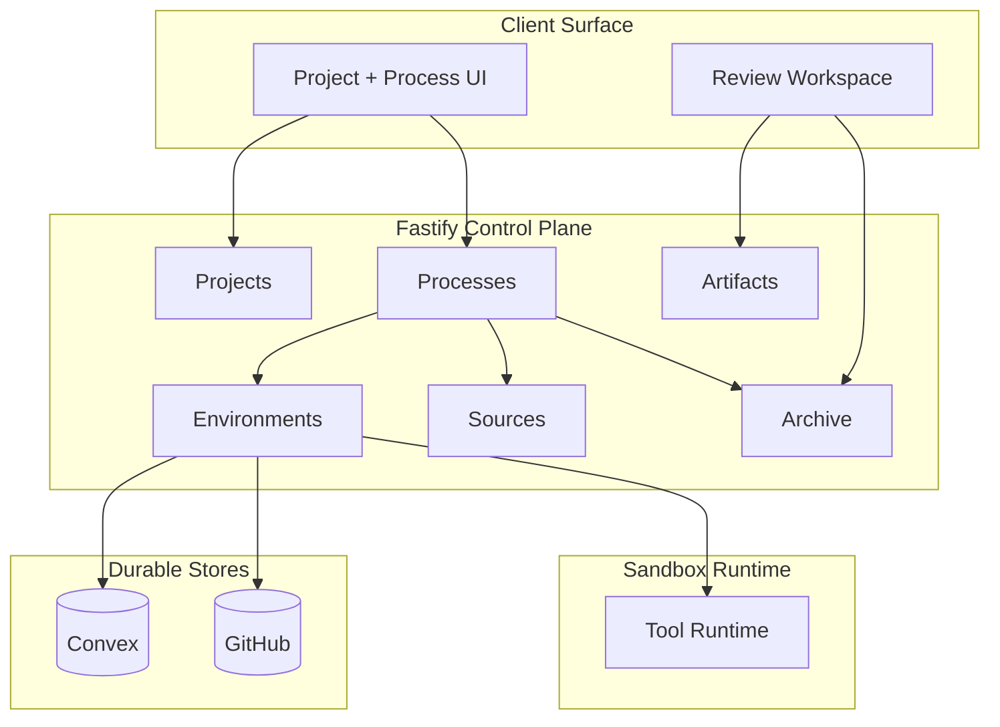

# Liminal Build Wiki

This wiki is the current-state map of Liminal Build. Liminal Build is a process-first platform for crafted spec-and-build software work, organized around a Fastify control plane, Convex durable state, GitHub as canonical code truth, and disposable sandbox environments. The pages support two reading speeds: grasp the platform from a small set of high-level pages, then drill into a subsystem on demand. The audience is developers working in the codebase and onboarding agents preparing to plan, design, or review.

## At a Glance

The platform spans four runtime surfaces — the browser client, the Fastify control plane, the sandbox runtime, and the durable stores — and the major platform surfaces and current top-tier domains distribute across them rather than partitioning cleanly into one surface each.

Review Workspace lives on the client and reads through Artifacts and Archive APIs. Tool Runtime executes inside the sandbox, reached from Environments after hydration. For the full domain map see [Top-Tier Domains](./current-technical-architecture/top-tier-domains.md), and for the architectural thesis see [Architecture Overview](./current-technical-architecture/overview.md).

## Start Here

- **[Current Technical Architecture](./current-technical-architecture/README.md)** — the technical world: thesis, stack, top-tier domains, cross-cutting decisions, key flows, and known hardening.
- **[Current Technical Design](./current-technical-design/README.md)** — the codebase organized by subsystem: process domain, runtime, project shell, artifacts, review/package/export, sources, archive, and the cross-cutting infrastructure layers.
- **[Conventions](./conventions/README.md)** — universal rules: glossary, repository layout, coding patterns, verification, error codes.
- **[Reference Material](./reference/README.md)** — source PRD and architecture, standup review reports, and audits backing the wiki.

## Suggested Reader Paths

- **New developer:**
  - [Architecture Overview](./current-technical-architecture/overview.md)
  - [Conventions: Glossary](./conventions/glossary.md), [Repository Layout](./conventions/repository-layout.md)
  - [Technical Design Overview](./current-technical-design/overview.md)
  - the relevant subsystem page in [Current Technical Design](./current-technical-design/README.md)
- **Reviewing platform shape:**
  - [Architecture Overview](./current-technical-architecture/overview.md)
  - [Top-Tier Domains](./current-technical-architecture/top-tier-domains.md)
  - [Key Runtime Flows](./current-technical-architecture/key-runtime-flows.md)
- **Code-review or tech-design agent:**
  - [Conventions: Coding Patterns](./conventions/coding-patterns-and-service-shape.md), [Testing and Verification](./conventions/testing-and-verification.md), [Error Codes](./conventions/error-codes.md), [Glossary](./conventions/glossary.md)
  - the relevant subsystem page in [Current Technical Design](./current-technical-design/README.md)
  - [Reference Material](./reference/README.md) only when source phrasing is needed
- **Agent or LLM orientation:**
  - [Architecture Overview](./current-technical-architecture/overview.md)
  - [Technical Design Overview](./current-technical-design/overview.md)
  - [Conventions](./conventions/README.md)
  - the relevant subsystem page in [Current Technical Design](./current-technical-design/README.md), with [Reference Material](./reference/README.md) as fallback

## Current Structure

- [Current Technical Architecture](./current-technical-architecture/README.md)
- [Current Technical Design](./current-technical-design/README.md)
- [Conventions](./conventions/README.md)
- [Reference Material](./reference/README.md)

## Notes

- Current-state oriented, not history-oriented. The standup review reports under [Reference Material](./reference/README.md) cover what was built epic by epic.
- Source PRD and source technical architecture remain available in [Reference Material](./reference/README.md) as evidence, not as the main reader path.
- Future condensed `llm.txt` onboarding files will be derived from this wiki's structure; pages are written so each can stand alone in a sliced extract.
