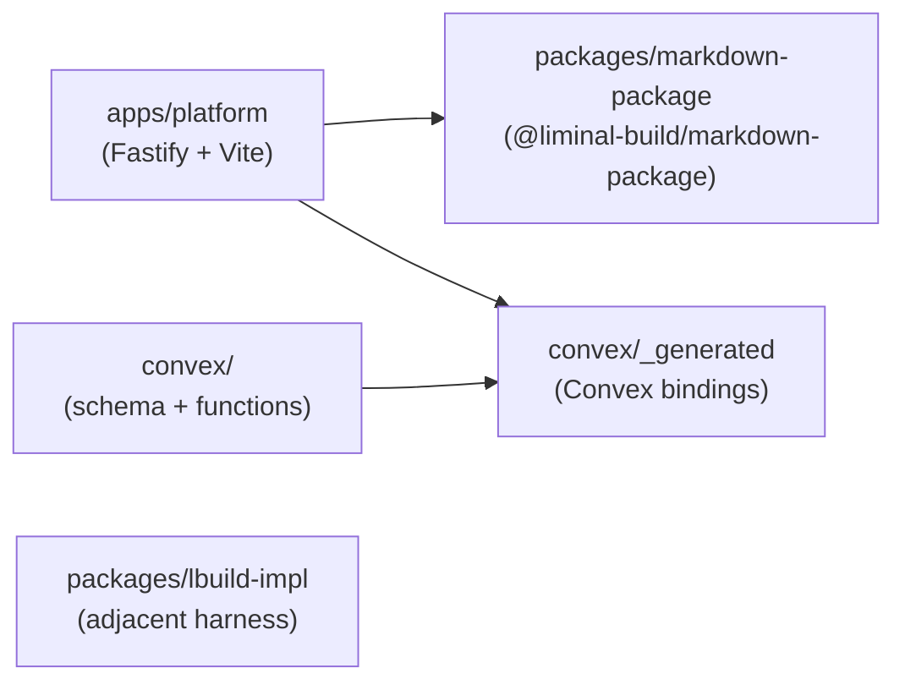

# Repository Layout

Liminal Build is a single pnpm workspace built around one runtime app. The platform app under `apps/platform` is the Fastify-controlled web application that serves every surface this wiki describes; the Convex subtree under `convex/` holds durable state and generated bindings; supporting workspace packages live under `packages/`. A reader can map any topic to a directory in one step using the workspace map and the per-workspace tables below.

## Workspace Map

The repository is rooted at one pnpm workspace with a small number of top-level directories.

```text
liminal-build/
├── apps/
│   └── platform/            # Fastify control plane + Vite client (single app)
│       ├── server/          # Fastify routes, services, schemas, plugins
│       ├── client/          # Vite-built TypeScript client
│       └── shared/          # Cross-runtime contracts (Zod-authored)
├── convex/                  # Durable state, schema, generated bindings
│   └── _generated/
├── packages/
│   ├── markdown-package/    # @liminal-build/markdown-package + mdvpkg CLI
│   └── lbuild-impl/         # Adjacent implementation harness (not in workspace)
├── docs/
│   ├── spec-build/          # PRDs, architecture, epic packs
│   ├── arch-standup-review/ # Standup review reports backing this wiki
│   ├── wiki/                # This wiki
│   └── setup/               # Local setup notes
├── scripts/                 # Local Convex startup, dev guards
├── tests/                   # Top-level service / client / integration suites
├── references/              # Local reference repos (read-only)
└── pnpm-workspace.yaml      # Workspace inclusion (apps/*, packages/*)
```

The `references/` directory holds reference repositories for inspiration only and is not part of the build. The top-level `tests/` directory carries cross-app service, client, integration, and e2e suites that import from `apps/platform` and `convex/` rather than living inside either workspace.

## Workspace Dependencies

The runtime control path is narrow: the platform app is the only consumer that ships to users, and it pulls from a small set of supporting packages.



`packages/lbuild-impl` is intentionally absent from the diagram: it is excluded from the pnpm workspace and the platform app does not consume it at runtime, so it has no edge into the runtime control path.

`apps/platform` is the only runtime control path and the only consumer of `@liminal-build/markdown-package` and the Convex generated client. `packages/markdown-package` is a pure library that produces `.mpkz` archives and exposes the `mdvpkg` CLI; it does not depend on Fastify or Convex. `packages/lbuild-impl` is excluded from the pnpm workspace (`pnpm-workspace.yaml` lists `!packages/lbuild-impl`) and sits adjacent to the platform — the platform app does not import it at runtime, and future `lspec-core`-style orchestration is expected above the controlled-execution result boundary rather than inside it.

## apps/platform

The platform app is a single Fastify server with an integrated Vite client; in production Fastify serves the bundled client and owns auth, orchestration, and integration boundaries. The app is divided into a server tree, a client tree, and a shared cross-runtime contracts tree, with each tree mapped one-to-one to a wiki page covering its design.

| Subdirectory | Owns | See |
|-|-|-|
| `server/` | Fastify control plane: routes, schemas, services, plugins, error catalog, integration boundaries | [Server Control Plane](../current-technical-design/server-control-plane.md) |
| `client/` | Vite-built TypeScript client: app shell, feature surfaces (`processes/`, `projects/`, `review/`), browser-api boundary | [Client Surfaces](../current-technical-design/client-surfaces.md) |
| `shared/` | Cross-runtime contracts (Zod-authored) consumed by both server and client | [Shared Contracts](../current-technical-design/shared-contracts.md) |

Inside `server/` the meaningful subdivisions are `routes/`, `schemas/`, `services/`, `plugins/`, `errors/`, and `scripts/`. Inside `client/` the meaningful subdivisions are `app/` (bootstrap and the central `store.ts` that holds app-level state), `browser-api/`, and `features/`. The single shared subdirectory is `shared/contracts/`.

## convex

The Convex subtree owns durable platform state. A single `schema.ts` file defines every durable table, while per-domain files carry the public queries/mutations and internal queries/mutations for that domain. The generated bindings under `_generated/` are produced by `convex dev` and are the only Convex surface the platform app imports directly.

| Path | Owns | See |
|-|-|-|
| `_generated/` | Type bindings produced by Convex (`api.js`, `server.js`, `dataModel.d.ts`) | — |
| `schema.ts` | Durable table definitions for every domain | [Convex Durable State and Projections](../current-technical-design/convex-durable-state-and-projections.md) |
| `projects.ts`, `projectMembers.ts` | Projects and membership records | [Project Shell](../current-technical-design/project-shell.md) |
| `processes.ts`, `processFeatureImplementationStates.ts`, `processFeatureSpecificationStates.ts`, `processProductDefinitionStates.ts` | Process records and per-process-type state | [Process Domain](../current-technical-design/process-domain.md) |
| `processHistoryItems.ts`, `processOutputs.ts`, `processSideWorkItems.ts` | Visible process history, outputs, and side-work read models | [Process Domain](../current-technical-design/process-domain.md) |
| `processEnvironmentStates.ts` | Durable authority for process environment lifecycle | [Process Runtime and Environments](../current-technical-design/process-runtime-and-environments.md) |
| `artifacts.ts`, `artifactVersions.ts` | Project-scoped artifact identity and version content/provenance | [Artifacts and Versions](../current-technical-design/artifacts-and-versions.md) |
| `packageSnapshots.ts`, `packageSnapshotMembers.ts`, `processPackageContexts.ts`, `processPackageContextMembers.ts` | Pinned package snapshots and mutable package context | [Review, Package, and Export](../current-technical-design/review-package-and-export.md) |
| `sourceAttachments.ts`, `sourceProvenance.ts` | Repository attachments and source-use provenance | [Source Management Domain](../current-technical-design/source-management-domain.md) |
| `archiveEntries.ts`, `archiveTurns.ts`, `derivedArchiveViews.ts` | Canonical archive entries plus derived turns and structural views | [Archive and Derived Views](../current-technical-design/archive-and-derived-views.md) |
| `users.ts` | User records | [Server Control Plane](../current-technical-design/server-control-plane.md) |
| `serviceApiKey.ts` | Env-keyed service API key validation helper (not a durable table) | [Server Control Plane](../current-technical-design/server-control-plane.md) |

Test files (`*.test.ts`) and the `test_helpers/` directory are colocated with the domain files but are not durable surfaces.

## packages

Two packages live under `packages/`. Only `markdown-package` is part of the pnpm workspace; `lbuild-impl` is excluded by `pnpm-workspace.yaml` and is treated as adjacent material rather than a runtime dependency.

### packages/markdown-package

Owns the `@liminal-build/markdown-package` library and the `mdvpkg` CLI binary. The package defines the `.mpkz` archive format (tar+gzip with `_nav.md`), manifest helpers, and pack/unpack logic; its only runtime dependency is `tar-stream`. It is consumed by the platform app's review and package surface to produce reviewable bundles, and by the CLI for offline pack/unpack work. See [Review, Package, and Export](../current-technical-design/review-package-and-export.md).

### packages/lbuild-impl

The adjacent implementation harness. It ships its own SDK (`./sdk`, `./sdk/contracts`, `./sdk/errors`) and `lbuild-impl` CLI binary, but is intentionally excluded from the pnpm workspace and is not imported by the platform app. Future orchestration integration of this kind belongs above the controlled-execution result boundary as orchestration envelope/flow machinery rather than folded into the in-sandbox runtime. See [Known Hardening and Deferrals](../current-technical-architecture/known-hardening-and-deferrals.md).

## docs and scripts

`docs/spec-build/` carries the v2 PRD, technical architecture, and per-epic spec packs that drove the platform standup. `docs/arch-standup-review/` carries the per-epic build summaries and post-standup notes that back this wiki — see [Reference Material](../reference/README.md). `docs/wiki/` is this wiki, and `docs/setup/` carries local setup notes covered by lint. `scripts/` holds the local Convex startup wrapper (`start-convex.ts`, which reads `.env.local` and binds explicit local-cloud and local-site ports) and the `guard-no-test-changes.mjs` dev guard used by `green-verify`.

## Top-Level Config

The repository root carries a small set of config files that govern workspace shape, language tooling, and verification.

| File | Controls |
|-|-|
| `pnpm-workspace.yaml` | Workspace inclusion (`apps/*`, `packages/*`, with `!packages/lbuild-impl` excluded) |
| `package.json` | Top-level scripts and the `red-verify` / `verify` / `green-verify` / `verify-all` tiers |
| `tsconfig.base.json` | Shared TypeScript compiler options inherited by per-workspace tsconfigs |
| `tsconfig.json` | Root TypeScript project, used by the root typecheck pass |
| `biome.json` | Lint and formatter rules across `apps/`, `packages/`, `convex/`, `tests/`, and root config |
| `vitest.workspace.ts` | Vitest workspace projects (Convex, service, client suites) |
| `playwright.config.ts` | Playwright e2e configuration |
| `.env.example` | Template for the per-worktree `.env.local` (server, Convex, auth, and sandbox secrets) |
| `.gitignore`, `.npmrc` | Repo-level VCS and pnpm configuration |

The `.convex/local/` directory is the local Convex backend's SQLite store and is per-worktree state, not committed source.

## Related

- [Conventions Home](./README.md)
- [Core Stack and Runtime Surfaces](../current-technical-architecture/core-stack-and-runtime-surfaces.md)
- [Technical Design Overview](../current-technical-design/overview.md)
