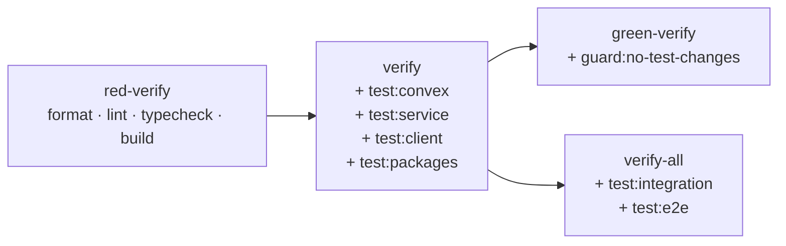

# Testing and Verification

The platform exposes four tiered verification commands — `red-verify`, `verify`, `green-verify`, and `verify-all` — that compose format, lint, typecheck, build, and the test suites into named gates a developer or review agent can invoke against the work in flight. Platform tests live primarily in a top-level `tests/` directory split by tier (`tests/service/server/`, `tests/service/client/`, `tests/integration/`, `tests/e2e/`), with Convex domain tests colocated alongside their domain files under `convex/` and the markdown package owning its own `tests/` directory inside `packages/markdown-package/`. The mock-at-the-external-boundary rule and the skeleton-stub convention it composes with live on [Coding Patterns and Service Shape](./coding-patterns-and-service-shape.md).

## Verification Tiers

The four gates form a ladder: each higher tier wraps the previous one and adds new phases. Command compositions below are sourced verbatim from the `scripts` block in the root `package.json`.

| Tier | Command | What It Runs | When To Use |
|-|-|-|-|
| Red exit | `red-verify` | `format:check` then `lint` then `typecheck` then `build` | TDD Red exit when stubs throw `AppError` with `notImplementedErrorCode` and tests are not yet expected to pass |
| Standard | `verify` | `red-verify` then `test:convex` then `test:service` then `test:client` then `test:packages` | Standard development gate run after every change |
| Green exit | `green-verify` | `verify` then `guard:no-test-changes` | TDD Green exit, paired with the test-immutability guard from `scripts/guard-no-test-changes.mjs` |
| Deep | `verify-all` | `verify` then `test:integration` then `test:e2e` | Deep verification including cross-app integration tests and Playwright end-to-end suites |

Every story-level slice exits through `verify` as the standard gate. `green-verify` is the gate TDD Green exits through and adds the no-test-changes guard so a Green pass cannot quietly bend tests instead of bending implementation. `verify-all` is the deepest gate and is what consumers reach for when an epic-level slice or a cross-app surface has been touched. The `red-verify` tier intentionally does not run any test suites — its job is to confirm the structural shape of the change before tests are expected to be green.

`green-verify` and `verify-all` both extend `verify` rather than each other: a Green TDD exit and a deep cross-app verification are independent decisions, and the test-immutability guard does not depend on integration or e2e suites running.

## Test Layout

The repository keeps platform service and client tests in a top-level `tests/` tree rather than colocated with `apps/platform/` source. Convex domain tests live alongside the domain files they exercise, and the markdown package owns its own test directory under its workspace.

| Location | What It Holds | Runner |
|-|-|-|
| `tests/service/server/` | Service-tier tests covering Fastify routes, services, and adapters | Vitest (node) |
| `tests/service/client/` | Service-tier tests covering browser client features and shells | Vitest (jsdom) |
| `tests/integration/` | Cross-app integration tests spanning `apps/platform/` and `convex/` | Vitest (node) |
| `tests/e2e/` | End-to-end browser suites | Playwright |
| `tests/fixtures/` | Shared test fixtures (process surfaces, archive inputs, source rows, etc.) | — |
| `tests/utils/` | Shared test utilities (`build-app`, `render-shell`, `package-snapshot-seed`) | — |
| `convex/*.test.ts` | Convex domain tests colocated with their domain files | Vitest (node) |
| `convex/test_helpers/` | Convex test scaffolding (e.g. `fake_convex_context.ts`) | — |
| `packages/markdown-package/tests/` | `@liminal-build/markdown-package` library tests | Vitest |

Platform server and client tests do not live colocated with `apps/platform/server/**` or `apps/platform/client/**` source — the live layout puts them in a single top-level `tests/service/` split that imports across both trees. Convex domain tests stay close to their domain files because the durable state surface is the unit under test. Cross-app integration and end-to-end suites live in `tests/integration/` and `tests/e2e/` and intentionally cross the platform/Convex boundary that the service-tier suites stop at. The Vitest workspace at `vitest.workspace.ts` defines two projects — `server` (node) and `client` (jsdom) — that scope the service-tier runs; Convex and integration suites invoke Vitest directly with explicit paths.

## Mock at the External Boundary

The universal rule is to mock at the external boundary, not at internal service or module boundaries. A test entering through a Fastify route or a service entry point exercises every internal module along the path; what gets replaced with a fake is the external dependency at the edge — the Convex client, Octokit, the sandbox provider adapter, the WorkOS SDK, the filesystem when relevant. Internal services compose without their own test seams: routes call services, services call readers and integration clients, and tests verify the observable behavior at the entry point.

Test fakes are typed against the same shared contracts as production code. The contract surface lives at `apps/platform/shared/contracts/` and is authored in Zod; both production code and tests consume the inferred types so a contract change is a typecheck failure on both sides at once. See [Coding Patterns: mock-at-external-boundary rule](./coding-patterns-and-service-shape.md) for the full pattern and how it composes with the skeleton-stub convention (stubs throw `AppError` with `notImplementedErrorCode`).

## Test Conventions

A small set of conventions hold across the test tree.

- Vitest `describe` and `it` names are written in terms of the behavior being asserted, not the function being called (e.g. `'replayed completion does not duplicate entry through service boundary'`).
- Test Condition (TC) IDs from the originating epic spec pack appear as the leading token of the `it` name when traceability is in scope (e.g. `'TC-2.3a completed live object archived once through finalization service'`).
- Shared fixtures live in `tests/fixtures/` (covering archive inputs, process surfaces, materials, package contexts, package snapshots, review workspace, sources, side work, mermaid sources, markdown content, and similar) and shared utilities live in `tests/utils/` (`build-app`, `render-shell`, `package-snapshot-seed`).
- Test state is in-memory throughout. Tests do not require a running Convex backend or a running Fastify server — Convex tests use the fake context under `convex/test_helpers/`, service tests build the Fastify app via `tests/utils/build-app.ts`, and client tests render through `tests/utils/render-shell.ts`. This matches the project's `CLAUDE.md` note that tests use in-memory stores and mocked auth throughout.
- Snapshot tests are not in active use; assertions are explicit against expected values and shapes rather than recorded snapshots.

## What Each Gate Catches

Each tier exists to catch a specific class of regression. The mapping below is what review agents and developers can rely on when choosing the gate to invoke.

| Concern | Caught By |
|-|-|
| Formatting drift (Biome formatter) | `red-verify` |
| Lint regressions (Biome linter) | `red-verify` |
| Type errors across root, platform, and packages | `red-verify` |
| Build regressions in `packages/*` and `apps/platform` | `red-verify` |
| Convex domain regressions (durable state surface) | `verify` (via `test:convex`) |
| Service-tier regressions in Fastify routes and services | `verify` (via `test:service`) |
| Client component and feature regressions | `verify` (via `test:client`) |
| Workspace package regressions (e.g. markdown package) | `verify` (via `test:packages`) |
| Accidental test edits during TDD Green | `green-verify` (via `guard:no-test-changes`) |
| Cross-app integration regressions | `verify-all` (via `test:integration`) |
| End-to-end browser regressions | `verify-all` (via `test:e2e`) |

`red-verify` catches everything that does not need a passing test to surface — structural changes, type drift, lint and format regressions, and any build-time failure across the workspace. `verify` is the standard developer gate and the one most stories exit through. `green-verify` adds the no-test-changes guard so a TDD Green exit cannot silently mutate the spec to match the implementation. `verify-all` adds the slow tiers — cross-app integration tests under `tests/integration/` and Playwright e2e under `tests/e2e/` — that exercise behaviors crossing process or browser boundaries.

## Related

- [Conventions Home](./README.md)
- [Coding Patterns and Service Shape](./coding-patterns-and-service-shape.md)
- [Repository Layout](./repository-layout.md)
- [Error Codes](./error-codes.md)
