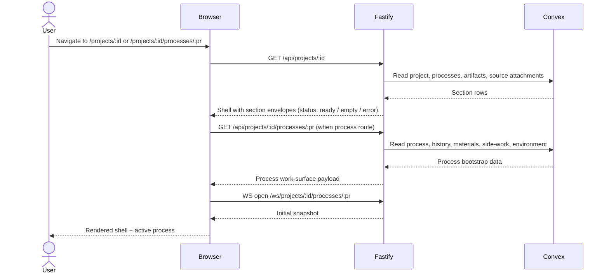
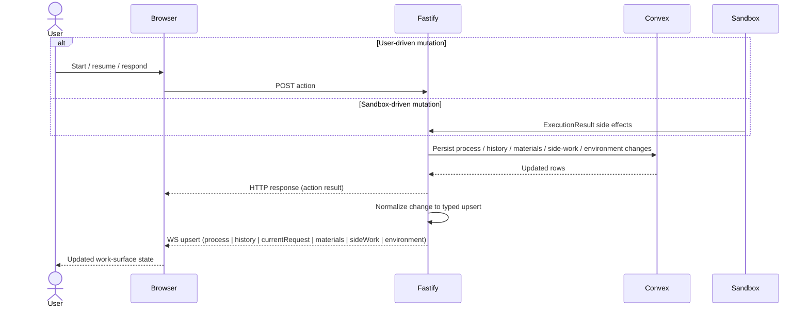
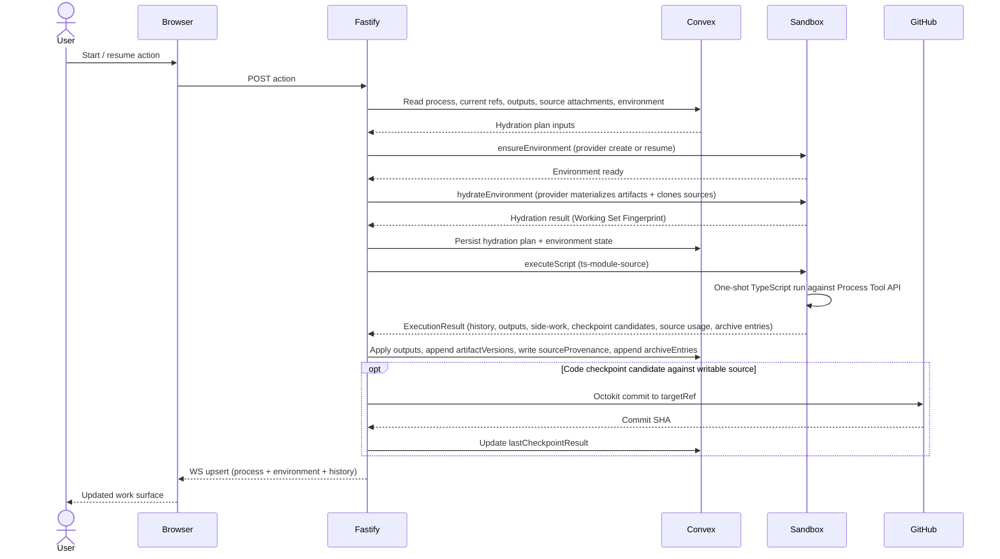
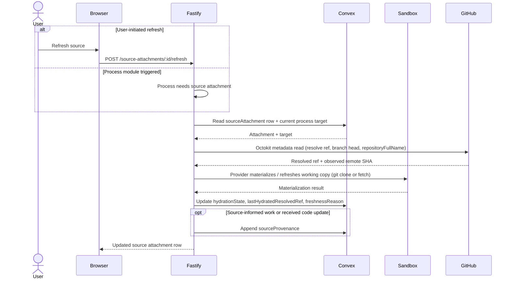
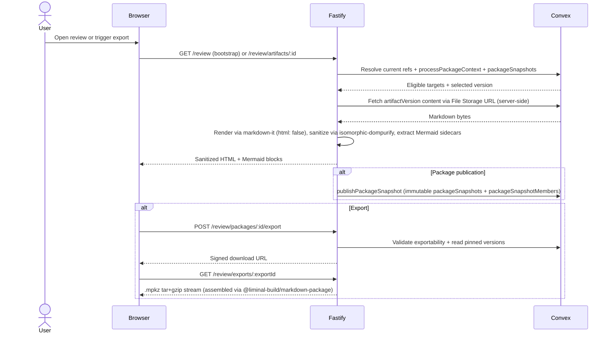

# Key Runtime Flows

Liminal Build runs as a Fastify control plane sitting between a thin browser client, Convex as durable state, GitHub as canonical code truth, and disposable sandbox environments materialized through provider adapters. The flows below cover the headline runtime sequences a developer or agent works with day to day: process bootstrap, work-surface live updates, the controlled execution cycle that ties every domain together, source hydration and refresh, review and package publication, and archive finalization. Each sequence is followed by a short breakdown that names what each step does and which subsystem implements it. Glossary terms link to [the canonical definitions](../conventions/glossary.md) on first use.

## Process Bootstrap and Selection

Process bootstrap is the path from a fresh URL to a usable workspace. The user lands on a project route or a process route, the browser fetches the aggregated [project shell](../current-technical-design/project-shell.md) for the project, and — when the route names a process — fetches the process work-surface bootstrap and opens a live-update WebSocket. The shell endpoint composes section envelopes for processes, artifacts, and source attachments so a single failing section degrades gracefully without breaking the rest of the page.



The shell composer in `apps/platform/server/services/projects/` runs three independent section readers and assembles the response Fastify returns. The [process domain](../current-technical-design/process-domain.md) services own the work-surface bootstrap: history, materials, side-work, environment, and the pinned current request. Once the durable bootstrap is in hand, the browser opens the WebSocket and Fastify replies with an initial [Snapshot](../conventions/glossary.md) so the client can render before any later upserts arrive. If a section read fails, Fastify still returns `200` with that section in `error` state; the client keeps the rest of the shell usable.

## Work Surface Live Update

After bootstrap, the work surface stays current through typed [Live Update](../conventions/glossary.md) messages. Mutations originate either from a user action posted to Fastify (start, resume, respond) or from a sandbox-side effect surfaced through `ExecutionResult`. Fastify writes the durable change to Convex, the in-memory live hub publishes a normalized [Upsert](../conventions/glossary.md) to subscribed sockets, and the browser reconciles current-object state by entity id. Raw provider deltas never reach the browser.



The publisher under `apps/platform/server/services/processes/live/` owns normalization and dispatch: it reads the durable row, builds the typed entity payload, and pushes it to the live hub. Action endpoints return immediately so the browser updates same-session, then the upsert arrives shortly after to deepen or settle the state. When live transport is unavailable, Fastify still returns the action result and the client falls back to refetching the durable bootstrap rather than treating live failure as a request failure.

## Controlled Execution Cycle

Controlled execution is the platform spine. A user action triggers an execution; Fastify resolves a [Hydration](../conventions/glossary.md) plan, ensures an environment exists through the configured Local or Daytona provider, asks the provider to materialize the working filesystem, sends a single TypeScript module into the in-sandbox executor, and applies the returned [ExecutionResult](../conventions/glossary.md) — process history, outputs, side work, artifact and code [Checkpoint](../conventions/glossary.md) candidates, source usage records, and archive entries — back to canonical stores before publishing live updates. Source clones and artifact-byte materialization happen inside the sandbox via the provider; only the Octokit code-checkpoint commit goes directly from Fastify to GitHub.



The orchestrator in `apps/platform/server/services/processes/environment/` builds the hydration plan from the process current artifact refs, current outputs, and active source attachments, then dispatches through `provider-adapter-registry.ts` to either `local-provider-adapter.ts` or `daytona-provider-adapter.ts`. The provider owns materialization: it writes artifact bytes from Convex File Storage into the working tree and runs `git clone` against each attached source's `repositoryUrl`. Fastify never streams source bytes to GitHub itself for hydration; that work stays inside the sandbox. The script-execution service sends a `ts-module-source` payload, the sandbox returns a structured `ExecutionResult`, and Fastify decomposes the result into Convex writes through the [process runtime services](../current-technical-design/process-runtime-and-environments.md). Artifact checkpoint candidates append `artifactVersions` rows tied to Convex File Storage; code checkpoint candidates against writable sources go through `OctokitCodeCheckpointWriter` directly to GitHub, with read-only sources rejected at planning time. Finalized history entries from the result also flow through `ArchiveFinalizationService` (see [Archive Finalization](#archive-finalization)). On hydration or execution failure the environment transitions to `failed` or `lost` rather than retroactively failing the original HTTP request, keeping the work surface coherent for `rehydrate` and `rebuild` recovery.

## Source Hydration and Refresh

Source hydration happens both as part of the controlled execution cycle and as a standalone refresh action. Fastify resolves the [Source Attachment](../conventions/glossary.md) row, reads GitHub metadata directly through Octokit when it needs to resolve a `repositoryFullName`, branch head, or ref existence, and then asks the provider to clone or refresh the working copy inside the sandbox. The durable hydration row updates once the provider reports success; provenance writes only when the source actually informs work or receives a durable code update, not on refresh alone. Project-scoped refresh is rejected unless the platform can resolve exactly one concrete process target.



The refresh service in `apps/platform/server/services/sources/` owns this orchestration. Octokit metadata reads stay direct because identity resolution does not need a sandbox; full clones and fetches always go through the provider so working-copy state stays inside the disposable filesystem. [Hydration State](../conventions/glossary.md) transitions to `hydrated`, `stale`, or `unavailable` based on the comparison between the freshly observed remote ref and `lastHydratedResolvedRef`, with [Freshness Reason](../conventions/glossary.md) set to `target_ref_changed`, `branch_head_moved`, `working_copy_missing`, `repository_unavailable`, `target_ref_unavailable`, or `access_revoked` when applicable. Pending refresh is operation status carried separately on the row, not a fifth hydration value. Provenance is recorded only when the source actually informs work or receives a durable code update — refresh by itself does not write a [Source Provenance](../conventions/glossary.md) row. The full mechanics live on the [source management domain page](../current-technical-design/source-management-domain.md).

## Review and Package Publication

The Review Workspace renders durable artifact versions and pinned package snapshots without depending on an active environment. When the user opens review for a process, Fastify computes eligibility through `ReviewContextService` from the process current refs and the [Process Package Context](../conventions/glossary.md), then renders selected version content server-side and returns sanitized HTML plus Mermaid sidecar blocks. Package publication is the second flow on this surface: a process module asks Fastify to publish a package snapshot pinning explicit `artifactVersionId`s, and a later signed-URL export streams the assembled `.mpkz` archive.



The render pipeline lives under `apps/platform/server/services/rendering/`. `MarkdownRendererService` runs `markdown-it` with `html: false` for safe parsing, intercepts Mermaid fences into placeholder divs while sanitizing `%%{init}%%`, `%%{config}%%`, and `%%{wrap}%%` directives out of source through `mermaid-sanitize.ts`, escapes code-fence content with HTML-escaping (no syntax highlighter is currently pinned despite Shiki-shaped configuration hooks), and runs the rendered HTML through `isomorphic-dompurify` with `html: false`-style profile constraints. Convex File Storage URLs stay inside Fastify and are never returned to the browser. Package publication, ordered members, exportability computation, and the two-phase signed-URL `.mpkz` export are owned by the [review, package, and export](../current-technical-design/review-package-and-export.md) services; archive assembly itself happens in the workspace package `@liminal-build/markdown-package`. A pinned [Package Member](../conventions/glossary.md) that resolves to an unavailable artifact version degrades that one member without hiding the rest of the package.

## Archive Finalization

Archive finalization is the trusted-completion gate between in-flight process activity and canonical process memory. `ArchiveFinalizationService` is called only at completion points — accepted user responses, finalized model messages, finalized script emissions, finalized tool calls and results, and durable process events — and writes a single [Archive Entry](../conventions/glossary.md) per call. Idempotency is enforced by Convex on `processId + finalizationKey`: second appends with the same key return the existing row without assigning a new sequence. Cached [Turn](../conventions/glossary.md) and [Derived Archive View](../conventions/glossary.md) rows are recomputed cache-first on read with bounded pagination.

```mermaid
sequenceDiagram
    actor User
    participant Browser
    participant Fastify
    participant Convex
    participant Sandbox

    alt User response
        User->>Browser: Submit response
        Browser->>Fastify: POST /responses (accepted)
    else Sandbox completion
        Sandbox->>Fastify: ExecutionResult with finalized history items
    else Process event
        Fastify->>Fastify: Lifecycle / checkpoint moment
    end
    Fastify->>Fastify: ArchiveFinalizationService.appendFinalizedEntry(finalizationKey)
    Fastify->>Convex: appendArchiveEntry (atomic uniqueness on processId + finalizationKey)
    alt First append
        Convex-->>Fastify: New row with assigned sequence
    else Idempotent retry
        Convex-->>Fastify: Existing row (no new sequence)
    end
    Browser->>Fastify: GET /archive or /archive/turns or /archive/derived-views
    Fastify->>Convex: Read archiveEntries / archiveTurns / derivedArchiveViews (bounded page)
    Convex-->>Fastify: Page rows (cache-first; rebuild from entries when missing)
    Fastify-->>Browser: Bounded archive / turn / view page
```

The archive services in `apps/platform/server/services/archive/` enforce the finalized-only rule: raw streaming deltas, partial model objects, and unsupported entry kinds are rejected without partial writes. Read services enrich entries with `relatedArtifactVersionId` and `relatedSourceProvenanceId` lookups; when enrichment fails for one entry, that entry degrades locally rather than rejecting the whole page. Turn derivation groups archive entries deterministically — a `user_message` opens a new turn, entries before the first user message form turn `0`, and a `tool_result` stays in the same turn as its matching `tool_call` — and rebuilds upsert by stable `${processId}:turn:${turnIndex}` ids so derived-view provenance survives rebuilds. The full canonical archive contract is documented in [archive and derived views](../current-technical-design/archive-and-derived-views.md), with no model-generated summaries: `chunk_candidate` views remain structural.

## Related

- [Architecture Overview](./overview.md)
- [Top-Tier Domains](./top-tier-domains.md)
- [Cross-Cutting Decisions](./cross-cutting-decisions.md)
- [Process Domain](../current-technical-design/process-domain.md)
- [Process Runtime and Environments](../current-technical-design/process-runtime-and-environments.md)
- [Archive and Derived Views](../current-technical-design/archive-and-derived-views.md)
