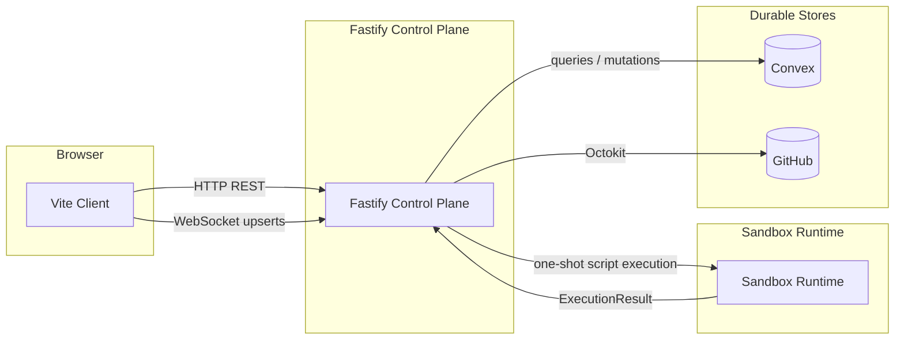

# Architecture Overview

Liminal Build is a process-first platform for crafted spec-and-build software work, organized around four runtime surfaces: a browser client, a Fastify control plane, a sandbox runtime, and a pair of durable stores. The control plane mediates every interaction, durable state and canonical code live behind it in [Convex](./core-stack-and-runtime-surfaces.md) and GitHub, and sandbox environments are disposable working copies hydrated from those canonical sources and checkpointed back. Process types are code-defined modules with their own state and toolset rather than dynamic workflow definitions, and live updates flow to the browser as typed upsert objects rather than raw provider deltas. The architecture section starts here and drills into stack, domains, cross-cutting decisions, runtime flows, and current hardening from this same stance.

## Architecture Thesis

Three separations carry the platform. The [Fastify Control Plane](../conventions/glossary.md) owns orchestration, auth mediation, source hydration, environment control, and integration boundaries; nothing reaches durable state or canonical code without passing through it. [Convex](../conventions/glossary.md) owns durable project, process, artifact, source, and archive state, and is reached only with trusted server credentials behind that control-plane boundary. GitHub owns canonical code: working copies materialize into sandboxes for editing, and durable code updates flow back through writable source attachments rather than from the filesystem itself.

The fourth surface, the [Sandbox Runtime](../conventions/glossary.md), is the disposable counterpart to the three durable separations. Sandboxes hold process-scoped working sets hydrated from Convex and GitHub, run one-shot TypeScript script execution against a process tool API, and return an [ExecutionResult](../conventions/glossary.md) the control plane interprets into checkpoints, history, source provenance, and archive entries. Discarding a sandbox should never lose canonical truth; it should only cost rehydration. That asymmetry — durable on three sides, disposable on one — is what allows process work to be reconstructed from canonical sources rather than recovered from preserved environment memory.

The trio of separations buys three things in turn. Splitting control from durable state keeps orchestration logic explicit and prevents the durable layer from becoming an ad hoc application backend. Splitting durable state from canonical code keeps artifact persistence and code persistence in the systems best shaped for each. Splitting canonical truth from working state keeps environments cheap to discard and the platform safe to rebuild around.

## Runtime Surfaces

The four surfaces sit in a fixed relationship: the browser talks only to Fastify, Fastify mediates every reach into Convex, GitHub, and the sandbox, and the sandbox returns work through the same control plane it was dispatched from. The transports between them are deliberately small in number and predictable in shape.

The diagram shows the Vite client reaching Fastify over HTTP for request/response work and over WebSocket for live upserts, Fastify reaching Convex with queries and mutations and GitHub through Octokit, and Fastify dispatching one-shot script execution into the sandbox runtime, which returns an `ExecutionResult` to the control plane. Subsystems that consume this surface map inherit two things. The control plane is the canonical mediator, so durable writes, canonical code updates, and sandbox dispatch all funnel through Fastify rather than running peer-to-peer between sandbox and durable stores. And the live transport is upsert-shaped, so the browser renders from typed current-object state rather than reconstructing raw provider deltas.

## What This Section Settles

The pages under this section together fix the architectural ground other readers should be able to stand on. The bullets below name what is settled and where to find each one elaborated.

- The four runtime surfaces and the components each surface owns are described in [Core Stack and Runtime Surfaces](./core-stack-and-runtime-surfaces.md).
- The eight top-tier domains and how they distribute across surfaces are mapped in [Top-Tier Domains](./top-tier-domains.md).
- Platform-wide decisions every subsystem inherits live in [Cross-Cutting Decisions](./cross-cutting-decisions.md).
- The canonical truth boundaries — Convex for durable state, GitHub for canonical code, sandbox for working state — are recorded in [Cross-Cutting Decisions](./cross-cutting-decisions.md).
- The headline runtime sequences for hydration, execution, checkpointing, and live delivery are walked in [Key Runtime Flows](./key-runtime-flows.md).
- Items still in active hardening or deliberately deferred are catalogued in [Known Hardening and Deferrals](./known-hardening-and-deferrals.md).

## Related

- [Architecture Section Home](./README.md)
- [Wiki Home](../README.md)
- [Technical Design Overview](../current-technical-design/overview.md)
- [Conventions](../conventions/README.md)
