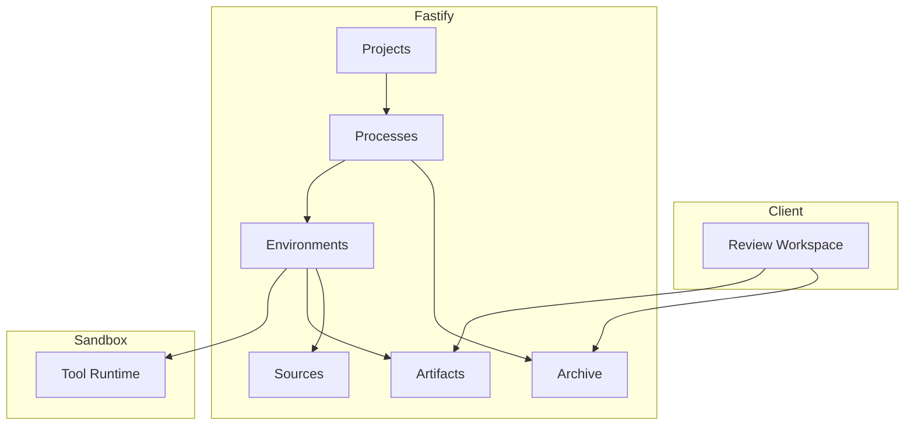

# Top-Tier Domains

Liminal Build is organized around eight top-tier domains — Projects, Processes, Environments, Tool Runtime, Artifacts, Sources, Archive, and Review Workspace — that distribute across the four runtime surfaces (browser client, Fastify control plane, sandbox runtime, durable stores) rather than partitioning cleanly into one surface each. The domains are the platform's coarsest product-organizing surface: every product-facing capability and durable concern nests within one of these domains, while a small set of cross-cutting infrastructure layers (Shared Contracts, Server Control Plane, Client Surfaces, Convex Durable State and Projections) supports them. Each section below names what the domain owns, what it depends on, the surface that hosts it, what downstream design pages should treat as settled, and the design-page drill-down for mechanics.

## Domain Map

The domain map shows ownership and the cross-domain reads that the platform actually exercises in flight. Subgraphs group domains lightly by primary runtime surface; edges are platform-level dependencies, not transport hops.

Projects sit above Processes and own the durable container every other domain scopes to. Processes drive Environments and write canonical entries into Archive — those two edges carry most of the in-flight work the platform does. Environments host the Tool Runtime inside the sandbox and reach back out to Artifacts (on checkpoint) and Sources (on hydrate and on code checkpoint), which is why Environments shows three outgoing edges. Review Workspace lives on the client and consumes the read-side surfaces of Artifacts and Archive without owning either. Design pages inherit this map as the canonical division of responsibility: a new capability nests into one of these eight domains rather than introducing a ninth.

## Projects

Projects exist so each crafted unit of work has a top-level durable container that processes, artifacts, package snapshots, and source attachments can scope into without inventing parallel containers. A [Project](../conventions/glossary.md) is the project-scoped identity row carrying ownership, membership, and the durable indexing every downstream domain joins against; cross-project references are not part of the model.

| Field | Value |
|-|-|
| Owns | `projects`, `projectMembers`, project-level indexing, project membership and authorization gates |
| Depends On | Auth (WorkOS), durable state (Convex) |
| Surface | Fastify control plane, Convex durable state |
| Treat as Settled | Project-scoped identity for processes, artifacts, packages, and source attachments; no cross-project references |
| Drill-down | [Project Shell](../current-technical-design/project-shell.md) |

## Processes

Processes exist so every crafted unit of work runs through one durable lifecycle with explicit phases, persistence, and toolset dispatch rather than a generic chat loop. A [Process](../conventions/glossary.md) is a project-scoped row bound to exactly one [ProcessType](../conventions/glossary.md) (currently `ProductDefinition`, `FeatureSpecification`, `FeatureImplementation`); the ProcessType supplies the state schema, phase model, and toolset, while the process row carries lifecycle status, current artifact references, and optional environment linkage.

| Field | Value |
|-|-|
| Owns | `processes`, per-ProcessType state tables, `processHistoryItems`, `processOutputs`, `processSideWorkItems`, phase transitions, ProcessType dispatch |
| Depends On | Projects, Artifacts, Environments, Sources, Archive |
| Surface | Fastify control plane, Convex durable state, browser client (Process Work Surface) |
| Treat as Settled | One ProcessType per process; code-defined ProcessType modules; presentation-grade [Visible History](../conventions/glossary.md) is distinct from canonical archive truth |
| Drill-down | [Process Domain](../current-technical-design/process-domain.md) |

## Environments

Environments exist so processes can do real filesystem work — running scripts, hydrating artifacts, materializing source repositories — without that filesystem ever becoming canonical truth that the platform would need to defend across restarts, provider failures, or sandbox loss. An [Environment](../conventions/glossary.md) is the disposable working filesystem attached to a process; the durable lifecycle authority lives in `processEnvironmentStates`, while the filesystem itself is reconstructible from artifact versions and active source attachments and is never treated as the source of truth.

| Field | Value |
|-|-|
| Owns | `processEnvironmentStates`, provider abstraction (Local, Daytona), hydration plans, [Working Set Fingerprint](../conventions/glossary.md), `lastCheckpointResult`, environment lifecycle (create / resume / discard) |
| Depends On | Processes, Sources, Artifacts |
| Surface | Fastify control plane plus provider backends; the working filesystem itself is provider-resident and ephemeral |
| Treat as Settled | Filesystem is working state only; durable lifecycle lives in `processEnvironmentStates`; provider contract stays neutral across Local and Daytona |
| Drill-down | [Process Runtime and Environments](../current-technical-design/process-runtime-and-environments.md) |

## Tool Runtime

Tool Runtime exists so scripted process code runs inside the sandbox against a controlled execution surface and returns a single structured result, keeping the platform — not the model — in charge of what crosses the sandbox-to-platform boundary. The [Tool Harness](../conventions/glossary.md) is the controlled execution surface and structured-result boundary between the in-environment executor and the platform; the current shape is an initial script and result-file boundary, with richer process-specific capability manifests still future work.

| Field | Value |
|-|-|
| Owns | In-sandbox script executor, [ExecutionResult](../conventions/glossary.md) contract, one-shot TypeScript module execution, structured-result interpretation back into Processes / Artifacts / Sources / Archive |
| Depends On | Environments |
| Surface | Sandbox runtime |
| Treat as Settled | One-shot script execution model; structured `ExecutionResult` as the side-effect contract; the executor reaches canonical stores only by way of the platform interpreting its result |
| Drill-down | [Process Runtime and Environments](../current-technical-design/process-runtime-and-environments.md) |

## Artifacts

Artifacts exist so review eligibility, package pinning, and multi-process content evolution can all key off a stable project-scoped identity that is independent of whichever process happens to produce a given version. An [Artifact](../conventions/glossary.md) is a project-scoped identity row carrying only `projectId`, display name, and creation time; an [Artifact Version](../conventions/glossary.md) is the append-only revision row carrying content storage id, version label, byte size, timestamps, and the [Producing Process](../conventions/glossary.md) provenance — both rows belong to this domain.

| Field | Value |
|-|-|
| Owns | `artifacts`, `artifactVersions`, content storage (Convex File Storage), version provenance, version-label assignment, version listing for review |
| Depends On | Projects, Processes (for producing-process provenance and current-ref reads) |
| Surface | Fastify control plane, Convex durable state, browser client (Review Workspace consumption) |
| Treat as Settled | Split between identity (`artifacts`) and content (`artifactVersions`); append-only versions; producing-process provenance recorded for read but not for ownership |
| Drill-down | [Artifacts and Versions](../current-technical-design/artifacts-and-versions.md) |

## Sources

Sources exist because canonical code lives in GitHub, and environments need a first-class way to hydrate from and check point durable code updates back to that canonical truth without making code part of the artifact model. A [Source Attachment](../conventions/glossary.md) is a durable repository relationship at project or process scope, carrying purpose, access mode, target ref, hydration state, and freshness metadata; the domain splits canonical [Repository Full Name](../conventions/glossary.md) identity from the operational [Repository URL](../conventions/glossary.md) used for clone and write paths, a distinction surfaced during Epic 6, and source-management remains a noted hardening item that should receive focused review before heavy product reliance — see [Known Hardening and Deferrals](./known-hardening-and-deferrals.md).

| Field | Value |
|-|-|
| Owns | `sourceAttachments`, `sourceProvenance`, repository identity vs operational URL split, [Hydration State](../conventions/glossary.md) and [Freshness Reason](../conventions/glossary.md), soft detach, [Access Mode](../conventions/glossary.md) gating for code checkpointing |
| Depends On | Projects, Processes, Environments, GitHub |
| Surface | Fastify control plane, Convex durable state, GitHub upstream |
| Treat as Settled | Canonical identity (`repositoryFullName`) is separate from operational URL; `read_only` sources fail closed for code checkpointing; provenance kinds are `informed_work` and `received_code_update` |
| Drill-down | [Source Management Domain](../current-technical-design/source-management-domain.md) |

## Archive

Archive exists so the platform retains a durable, idempotent, full-fidelity record of every turn it took at the smallest useful grain, suitable for later reconstruction, long-horizon context management, and downstream view derivation without redesigning canonical history each time a presentation changes. An [Archive Entry](../conventions/glossary.md) is the canonical finalized low-level row keyed by `processId + finalizationKey`; a [Turn](../conventions/glossary.md) is a deterministic grouping cached for bounded reads but rebuildable; a [Derived Archive View](../conventions/glossary.md) is a structural projection (`turn_range`, `chunk_candidate`) over turns — all three belong to this domain.

| Field | Value |
|-|-|
| Owns | `archiveEntries`, `archiveTurns`, `derivedArchiveViews`, canonical entry-kind taxonomy (`user_message`, `model_message`, `reasoning`, `script_emission`, `tool_call`, `tool_result`, `process_event`), idempotent finalization, turn derivation, structural view derivation |
| Depends On | Processes |
| Surface | Fastify control plane, Convex durable state |
| Treat as Settled | Canonical low-level entry kinds; only finalized entries are archived; finalization keying as the idempotency boundary; turns and derived views never become a second canonical layer |
| Drill-down | [Archive and Derived Views](../current-technical-design/archive-and-derived-views.md) |

## Review Workspace

Review Workspace exists so artifact and package consumption can be process-aware without being process-owned, with eligibility computed from current process refs and pinned package context rather than stored on the artifact itself. The [Review Workspace](../conventions/glossary.md) is the process-aware reader for artifacts and packages; eligibility is derived at read time from current process references and [Process Package Context](../conventions/glossary.md) rather than from artifact ownership, which is what lets a publishing process pin versions across multiple producing processes within one project.

| Field | Value |
|-|-|
| Owns | Markdown and Mermaid rendering, artifact reading surface, [Package Snapshot](../conventions/glossary.md) viewing, `.mpkz` export, computed review eligibility, pinned-context review composition |
| Depends On | Artifacts, Archive, Processes (for current-ref reads) |
| Surface | Browser client, with Fastify-backed read APIs |
| Treat as Settled | Eligibility is computed, not stored; package members pin explicit artifact versions; cross-process version sets within a project are valid |
| Drill-down | [Review, Package, and Export](../current-technical-design/review-package-and-export.md) |

## What Design Pages Inherit

Design pages within [Current Technical Design](../current-technical-design/README.md) inherit these eight domains as the canonical organizing surface: every design page sits within exactly one domain or within one of the four cross-cutting infrastructure layers (Shared Contracts, Client Surfaces, Server Control Plane, Convex Durable State and Projections). Designers and review agents should treat the eight domains as fixed; new functionality nests into them rather than introducing a ninth domain. The "Treat as Settled" rows above are the per-domain settled structures — canonical identities, ownership splits, and invariants downstream design and review work should design within rather than relitigate.

## Related

- [Architecture Overview](./overview.md)
- [Cross-Cutting Decisions](./cross-cutting-decisions.md)
- [Key Runtime Flows](./key-runtime-flows.md)
- [Conventions: Glossary](../conventions/glossary.md)
- [Current Technical Design](../current-technical-design/README.md)
