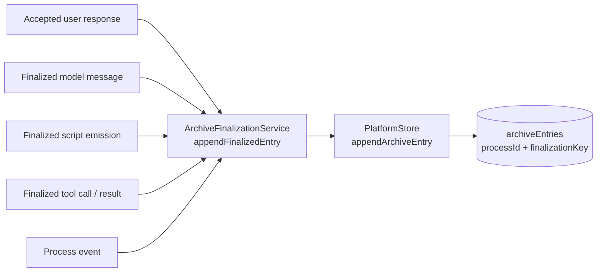
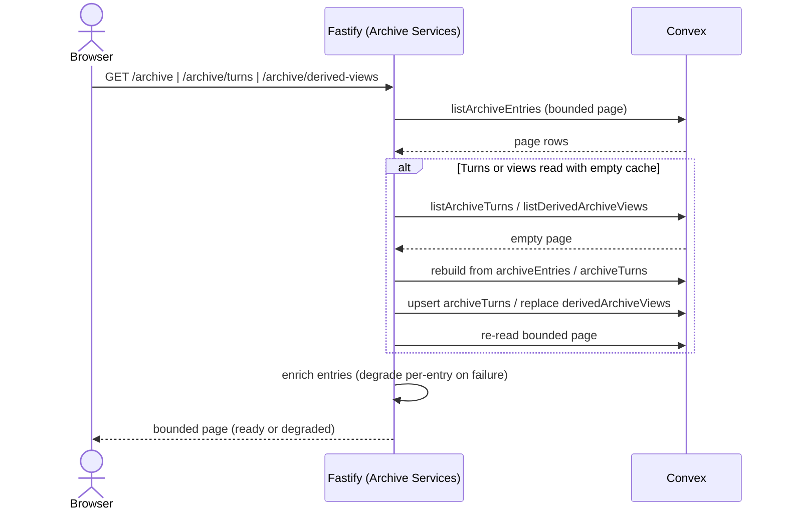

# Archive and Derived Views

The Archive is the canonical record of every finalized process turn at low-level grain. An [Archive Entry](../conventions/glossary.md) is one finalized history row in one of seven kinds — `user_message`, `model_message`, `reasoning`, `script_emission`, `tool_call`, `tool_result`, and `process_event` — keyed by `processId + finalizationKey` and assigned a stable per-process sequence on first append. Streaming deltas, partial model objects, and incomplete tool results are not archived; only finalized material crosses the append boundary. [Turn](../conventions/glossary.md) and [Derived Archive View](../conventions/glossary.md) rows are cached projections built on top of these entries, never canonical truth themselves. Archive reads are independent from environment state, so reload, environment loss, and provider failure do not block reading durable process memory.

## Architecture Recap

Liminal Build runs as four runtime surfaces — browser client, Fastify control plane, sandbox runtime, durable stores — and the Archive lives across the last two. Convex owns the durable archive tables `archiveEntries`, `archiveTurns`, and `derivedArchiveViews` along with their indexes and atomic write paths; Fastify mediates every archive write through `ArchiveFinalizationService` and exposes read paths through the archive routes. The browser client reads turns and derived views through Fastify and never writes to the archive directly.

## Canonical Archive Entries

Archive entries are the finalized low-level rows the platform retains for each process. The seven entry kinds below are settled — design pages should treat them as fixed rather than introducing new kinds without a cross-cutting deviation.

| Entry Kind | What It Records |
|-|-|
| `user_message` | Finalized user input accepted by the process. |
| `model_message` | Finalized model output. |
| `reasoning` | Finalized reasoning-like model or process material when appropriate. |
| `script_emission` | Finalized output from controlled script execution. |
| `tool_call` | Finalized record of a tool invocation. |
| `tool_result` | Finalized result of a tool invocation. |
| `process_event` | Durable lifecycle, checkpoint, and event history. |

Entries are append-only and retain `lifecycleState: finalized`; raw streaming deltas and partial runtime objects are rejected at the append boundary rather than persisted as canonical truth. Each entry carries optional related references — `relatedArtifactVersionId`, `relatedSourceProvenanceId`, `relatedToolCallId` — that read-time enrichment uses to attach artifact and source context. The entry shape lives on `archiveEntries` in `convex/archiveEntries.ts`, with the canonical contract in `apps/platform/shared/contracts/archive.ts`.

## Finalization Keying and Idempotency

Finalization keying is what lets the platform retry an append safely. The combination `(processId, finalizationKey)` is the uniqueness boundary: at most one entry exists per process per key, regardless of how many appends are attempted.

The append path in `ArchiveFinalizationService` trims and validates the `finalizationKey`, the Convex `appendArchiveEntry` mutation looks up any existing row by `by_processId_and_finalizationKey`, and on a hit returns the stored entry without inserting a new row or assigning a new sequence. Sequence assignment occurs only on first append: the next sequence is the most recent `sequence + 1` for that process, taken under the `by_processId_and_sequence` index. Subsequent appends with the same key are idempotent — they return the existing row, which keeps retries, deferred-binding reconciliation, and user-message bridging coherent without duplicating archive truth. The visible-history compat path emits stable shapes such as `response:{historyItemId}`, `model:{sourceObjectId}`, and `event:{sourceObjectId}`, with a `history:{sourceObjectId}` fallback — see `apps/platform/server/services/archive/process-history-compat.service.ts`. Tool-call and tool-result entries may use additional shapes in their finalization paths; treat those as constructed at the call site rather than centralized in the compat helper. Cross-link the [Finalization Key](../conventions/glossary.md) glossary entry.

## ArchiveFinalizationService

`ArchiveFinalizationService` in `apps/platform/server/services/archive/archive-finalization.service.ts` is the trusted-completion gate between in-flight process activity and canonical archive truth. Every finalized turn — accepted user response, finalized model message, finalized script emission, finalized tool call or result, durable process event — flows through this single service.

The service validates that `finalizationKey` is non-empty, that entry kinds requiring a `sourceObjectId` (`user_message`, `model_message`, `process_event`) carry one, and that `tool_call` and `tool_result` entries carry a `relatedToolCallId`, then forwards the input to `PlatformStore.appendArchiveEntry`. The Fastify service does not stamp `lifecycleState` itself; the Convex `appendArchiveEntry` mutation hard-codes `lifecycleState: 'finalized'` at insert time, so the finalized-only invariant is enforced at the durable boundary. Sandbox-side completion contributes finalized entries through the structured [ExecutionResult](../conventions/glossary.md) returned to Fastify; the platform interprets that result and routes finalized history through the same service. The compatibility helper `appendFromProcessHistoryItem` bridges legacy `processHistoryItems` rows whose kind maps onto an archive kind (`user_message` → `user_message`, `process_message` → `model_message`, `process_event` → `process_event`) and reuses the existing archive row for accepted user responses rather than creating a duplicate. See [Process Runtime and Environments: ExecutionResult Application](./process-runtime-and-environments.md) for how `ExecutionResult` decomposes into archive appends.

The flowchart shows the five completion points that feed `ArchiveFinalizationService` and how the service routes a single validated write through `PlatformStore.appendArchiveEntry` into the durable `archiveEntries` table. Consuming subsystems inherit a single append boundary: process services, runtime result interpretation, and bridge code all share the same gate, so the finalized-only invariant holds without per-caller duplication.

## Write Routing: Visible History vs Archive

Visible history and the canonical archive are two distinct write surfaces. The `processHistoryItems` table is the work-surface presentation row store — durable enough to survive reload and reconnect, but not the canonical record of what the process said and did. The `archiveEntries` table is the finalized canonical record, append-only and keyed by `(processId, finalizationKey)`. Some trigger events write to both surfaces, some write to only one, and some bypass both because their durable home is a different table altogether (side-work items, current outputs).

The matrix below summarizes the routing as it stands in live code. Refer back to the [Canonical Archive Entries](#canonical-archive-entries) section for the meaning of each archive `entryKind`; this matrix does not restate them.

| Trigger event | Visible history (`processHistoryItems.kind`) | Archive entry (`archiveEntries.entryKind`) | Finalization key |
|-|-|-|-|
| User submits accepted response | `user_message` | `user_message` | `response:{historyItemId}` |
| Model emits finalized message (via execution result) | `process_message` | `model_message` | `model:{sourceObjectId}` |
| Model emits finalized reasoning | — | `reasoning` | constructed by runtime on the `RuntimeArchiveEntry` |
| Tool call finalized | — | `tool_call` | constructed by runtime; `tool:{name}:call` shape appears only in test fixtures, not in any live runtime construction site in this repo |
| Tool result finalized | — | `tool_result` | constructed by runtime; `tool:{name}:result` shape appears only in test fixtures, not in any live runtime construction site in this repo |
| Script emission finalized | — | `script_emission` | constructed by runtime on the `RuntimeArchiveEntry` |
| Process event (lifecycle, checkpoint) | `process_event` | `process_event` | `event:{sourceObjectId}` |
| Progress update | `progress_update` | — | n/a |
| Attention request | `attention_request` | — | n/a |
| Side-work update row | `side_work_update` | — | n/a |
| Side-work item state change | — | — | n/a (writes to `processSideWorkItems` via `replaceCurrentProcessSideWorkItems`) |

A few notes on what the matrix says and does not say. The `response:{historyItemId}` and `event:{sourceObjectId}` keys are constructed in `process-history-compat.service.ts` via `buildHistoryItemArchiveFinalizationKey`, with a `history:{sourceObjectId}` fallback that is currently unreachable because the only history kinds the compat service maps to archive kinds are `user_message`, `process_message`, and `process_event`. The `model:{sourceObjectId}` shape is constructed there as well; live runtime model-message archive writes flow through `appendFromProcessHistoryItem` after the model output has been appended to `processHistoryItems` as a `process_message`. Tool-call and tool-result archive entries arrive at `appendFinalizedEntry` with their `finalizationKey` already set on the `RuntimeArchiveEntry` produced by the sandbox runtime; no live code path in this repo constructs the `tool:...:call` or `tool:...:result` shapes that appear in the test fixtures, so the precise key shape used at runtime is the runtime's choice rather than a centralized convention. Reasoning and script-emission entries follow the same runtime-constructed pattern. Side-work items have their own durable table and do not pass through either `processHistoryItems` or `archiveEntries`; the `side_work_update` history kind is reserved for surface-level status rows that the runtime may emit alongside the side-work table write.

## Turns

Turns are deterministic groupings over canonical archive entries, cached for bounded reads but rebuildable on demand. The `archiveTurns` table holds them; the row shape carries `turnId`, `turnIndex`, `archiveEntryIds`, `startedAt`, `endedAt`, `turnStatus`, `degradationReason`, and `rebuiltAt`.

`DefaultTurnDerivationService` in `apps/platform/server/services/archive/turn-derivation.service.ts` owns derivation. The grouping rules are: a `user_message` opens a new turn unless the active turn is empty; entries before the first `user_message` form turn `0`; `model_message`, `reasoning`, `script_emission`, `tool_call`, and `process_event` attach to the active turn; a `tool_result` correlates back to its matching `tool_call` by `relatedToolCallId` (or `sourceObjectId`) and stays in the same turn when the call is present; tool-result entries that cannot match degrade the local turn rather than failing the whole rebuild. Turn IDs are deterministic — `${processId}:turn:${turnIndex}` — so derived-view provenance survives rebuilds. Turn reads are cache-first: when the cache is empty and archive entries exist, the read service rebuilds turns from the canonical entries, upserts them by stable `turnId`, and returns the bounded page. Derivation is deterministic: given the same archive entries, the same turn shape results, and turns are not canonical truth themselves. See [Convex Durable State and Projections](./convex-durable-state-and-projections.md) for the durable-table layout that backs this cache.

## Derived Views

Derived views are structural projections over turns. The `derivedArchiveViews` table stores them; the row shape carries `derivedViewId`, `viewKind`, `startTurnIndex`, `endTurnIndex`, `sourceTurnIds`, `sourceArchiveEntryIds`, `title`, `bodyText`, `viewStatus`, `degradationReason`, and `updatedAt`. The wire contract exposes the same range as `turnRange: { startIndex, endIndex }` while the durable row stores `startTurnIndex` and `endTurnIndex` for indexing.

The current view kinds are:

- `turn_range` — a contiguous range of turns, one view per turn in the current build.
- `chunk_candidate` — a structural candidate grouping for a chunk, formed by grouping turns into fixed-size buckets (currently two-turn groups) without any model-generated content.

`DefaultDerivedArchiveViewService` in `apps/platform/server/services/archive/derived-archive-view.service.ts` builds these views deterministically from cached turns, dedupes source entry ids, marks any view containing a degraded turn as `degraded` with a structural reason, and writes through `PlatformStore.replaceDerivedArchiveViews`. Refresh checks an archive signature before and after the rebuild, returning `ARCHIVE_DERIVATION_CONFLICT` (HTTP 409) when archive truth changed mid-refresh. Derived views are structural only — they never carry model-generated summaries, and the test plan includes a guard that `chunk_candidate` rejects generated summary body content. Model-generated archive turn summaries are a deferred capability per [Known Hardening and Deferrals](../current-technical-architecture/known-hardening-and-deferrals.md), and design pages should treat any future summarization as living above this structural layer rather than inside it. The settled non-summarizing canonical-archive shape is documented in [Cross-Cutting Decisions: Canonical Archive at Low-Level Grain](../current-technical-architecture/cross-cutting-decisions.md).

## Read Path

The archive read path treats canonical entries, cached turns, and structural views as three independently bounded reads. Every read is paginated, every read enforces project and process access, and no read depends on an active environment.

`DefaultArchiveReadService` in `apps/platform/server/services/archive/archive-read.service.ts` reads `archiveEntries` directly through `PlatformStore.listArchiveEntries`, then runs `enrichArchiveEntries` from `archive-entry-enrichment.ts` to attach `relatedArtifactProvenance` and `relatedSourceProvenance` for entries that name them. Enrichment failures degrade the affected entry — `entryStatus: 'degraded'` with a structural `degradationReason` — without rejecting the whole page. `DefaultTurnDerivationService` and `DefaultDerivedArchiveViewService` are cache-first: a non-cursor read with no stored rows triggers a one-time rebuild from canonical entries (or from turns, for views) and then returns the bounded page. Default page sizes are 100 entries (max 200), 50 turns (max 100), and 50 derived views (max 50); invalid cursors or limits raise `INVALID_ARCHIVE_REQUEST` (HTTP 422). Because the read path consults Convex tables only, archive reads survive sandbox loss, environment failure, and degraded provider state — design pages should not couple archive reads to environment availability.

The sequence diagram shows the read path with cache rebuild: archive entries are read directly, while turns and derived views fall through to a bounded rebuild on cache miss before returning. Consuming subsystems inherit a uniform read shape — bounded pagination, ready or degraded status per row, no environment dependence — and can rely on enrichment failure degrading individual rows rather than collapsing the response.

## Routes and Services

Fastify exposes the archive read surface through four authenticated routes. Routes are thin: parameter validation is handled by the route schemas in `apps/platform/server/schemas/archive.ts`; the services own access checks, pagination, enrichment, and rebuild.

| Route | Method | Service |
|-|-|-|
| `/api/projects/:projectId/processes/:processId/archive` | GET | `DefaultArchiveReadService` (`archive-read.service.ts`) |
| `/api/projects/:projectId/processes/:processId/archive/turns` | GET | `DefaultTurnDerivationService` (`turn-derivation.service.ts`) |
| `/api/projects/:projectId/processes/:processId/archive/derived-views` | GET | `DefaultDerivedArchiveViewService` (`derived-archive-view.service.ts`) |
| `/api/projects/:projectId/processes/:processId/archive/derived-views/refresh` | POST | `DefaultDerivedArchiveViewService` (`derived-archive-view.service.ts`) |

The shell route `/projects/:projectId/processes/:processId/archive` renders the work-surface shell document for the archive view; see `apps/platform/server/routes/archive.ts` for the full route registration. Authenticated access is enforced through `ProcessAccessService` before any read, and `ARCHIVE_DERIVATION_CONFLICT` is returned from the refresh route when archive truth changes mid-rebuild.

## Adjacent Domains

- **Process Domain** — every archive entry is process-scoped; [Visible History](../conventions/glossary.md) (`processHistoryItems`) is presentation, archive entries are canonical, and the two are deliberately distinct (cross-link [Process Domain](./process-domain.md)).
- **Process Runtime and Environments** — `ExecutionResult` contributes finalized entries to the archive through the same `ArchiveFinalizationService` boundary (cross-link [Process Runtime and Environments](./process-runtime-and-environments.md)).
- **Convex Durable State** — three durable archive tables back this domain, with the canonical-versus-projection split realized as `archiveEntries` versus `archiveTurns` and `derivedArchiveViews` (cross-link [Convex Durable State and Projections](./convex-durable-state-and-projections.md)).
- **Server Control Plane** — Fastify owns the archive write path and the four archive routes; routes stay thin and services own orchestration (cross-link [Server Control Plane](./server-control-plane.md)).

## Patterns and Conventions

- Archive entries are append-only; raw streaming deltas and partial runtime objects are not archived.
- The seven entry kinds (`user_message`, `model_message`, `reasoning`, `script_emission`, `tool_call`, `tool_result`, `process_event`) are settled; new kinds require an explicit cross-cutting deviation.
- Finalization is keyed by `(processId, finalizationKey)`; subsequent appends with the same key return the existing row without assigning a new sequence.
- Turns are cached deterministic projections; cache-first reads rebuild on miss when canonical entries exist.
- Derived views are structural only; model-generated summaries are deferred and live above this layer rather than inside it.
- Read-time enrichment failures degrade individual entries, turns, or views rather than failing the whole page.
- Archive reads are independent from environment state — design pages should not couple archive reads to environment availability.
- Bounded pagination on every archive read; default 100/50/50 pages with explicit upper bounds and `INVALID_ARCHIVE_REQUEST` on invalid input.

## Likely Code Areas

The archive domain spans Fastify services, Convex domain files, route registration, shared contracts, and the cross-cutting test suites that exercise both surfaces.

| Concern | Path |
|-|-|
| Trusted-completion gate | `apps/platform/server/services/archive/archive-finalization.service.ts` |
| Bounded archive read with enrichment | `apps/platform/server/services/archive/archive-read.service.ts` |
| Turn derivation and cache-first read | `apps/platform/server/services/archive/turn-derivation.service.ts` |
| Structural derived views, refresh, conflict detection | `apps/platform/server/services/archive/derived-archive-view.service.ts` |
| Read-time artifact and source enrichment | `apps/platform/server/services/archive/archive-entry-enrichment.ts` |
| Legacy `processHistoryItems` to archive bridge | `apps/platform/server/services/archive/process-history-compat.service.ts` |
| Authenticated archive routes and shell | `apps/platform/server/routes/archive.ts` |
| Fastify route schemas | `apps/platform/server/schemas/archive.ts` |
| Shared archive contracts and route patterns | `apps/platform/shared/contracts/archive.ts` |
| Canonical entry table, append, list, idempotency | `convex/archiveEntries.ts` |
| Cached turn projection table and upsert | `convex/archiveTurns.ts` |
| Structural derived-view table and replace | `convex/derivedArchiveViews.ts` |
| Service-level archive tests | `tests/service/server/archive-api.test.ts`, `tests/service/server/archive-finalization.test.ts`, `tests/service/server/turn-derivation.test.ts`, `tests/service/server/derived-archive-view.test.ts` |
| Convex archive tests | `convex/archiveEntries.test.ts` |
| Client archive surface tests | `tests/service/client/archive-section.test.ts`, `tests/service/client/archive-turns-section.test.ts`, `tests/service/client/derived-archive-views.test.ts`, `tests/service/client/archive-router.test.ts` |

## Related

- [Technical Design Overview](./overview.md)
- [Process Domain](./process-domain.md)
- [Process Runtime and Environments](./process-runtime-and-environments.md)
- [Server Control Plane](./server-control-plane.md)
- [Convex Durable State and Projections](./convex-durable-state-and-projections.md)
- [Cross-Cutting Decisions: Canonical Archive at Low-Level Grain](../current-technical-architecture/cross-cutting-decisions.md)
- [Key Runtime Flows: Archive Finalization](../current-technical-architecture/key-runtime-flows.md)
- [Known Hardening and Deferrals](../current-technical-architecture/known-hardening-and-deferrals.md)
- [Top-Tier Domains: Archive](../current-technical-architecture/top-tier-domains.md)
