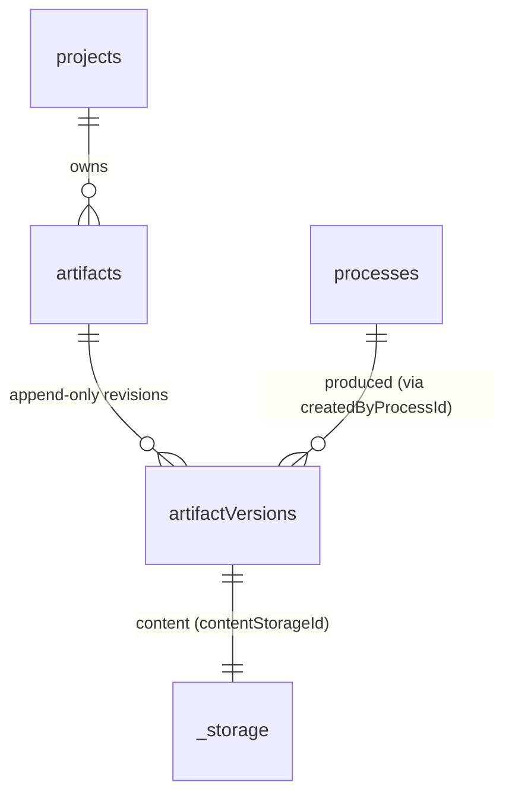

# Artifacts and Versions

The Artifacts domain splits durable artifact state across two tables: an [`artifacts`](../conventions/glossary.md) row carries only project-scoped identity — `projectId`, `displayName`, and `createdAt` — and never any process ownership; an [`artifactVersions`](../conventions/glossary.md) row carries the content storage id, version label, byte size, timestamps, and producing-process provenance via `createdByProcessId`. Identity is independent of producing process; process ownership lives on the version, never on the artifact. Append-only versioning, project-scoped identity, and per-version provenance are the load-bearing rules every consuming subsystem inherits, including review eligibility, package pinning, and checkpoint writes from environments.

## Architecture Recap

The platform runs across four surfaces: the browser client, the Fastify control plane under `apps/platform/server/`, sandbox runtimes, and durable stores. Convex owns the durable artifact tables (`artifacts`, `artifactVersions`) and Convex File Storage holds artifact bytes. The Fastify control plane proxies content fetches and never returns raw File Storage URLs to the browser; storage URLs are public capabilities and are kept inside the server boundary.

## Durable State

Artifact durable state is two cleanly separated tables, defined in `convex/artifacts.ts` and `convex/artifactVersions.ts` and registered in `convex/schema.ts`. The split exists so a project artifact can accept new versions from any process in the same project without ever changing artifact identity or transferring ownership.

| Table | Owns | File |
|-|-|-|
| `artifacts` | Project-scoped identity row: `projectId`, `displayName`, `createdAt` | `convex/artifacts.ts` |
| `artifactVersions` | Append-only revision row: `artifactId`, `versionLabel`, `contentStorageId`, `contentKind`, `bytes`, `createdAt`, `createdByProcessId` | `convex/artifactVersions.ts` |

The `artifacts` row carries no `processId`, no `attachmentScope`, no `currentVersionLabel`, and no `updatedAt` field. Producer identity lives only on the version row, recorded as `createdByProcessId` in Convex and surfaced to browser-facing review contracts as `producedByProcessId`. Project artifact summaries derive their `currentVersionLabel` and `updatedAt` from the latest version row at read time rather than caching them on the identity row. This is the canonical separation enforced by the [Artifact Identity vs Version Provenance](../current-technical-architecture/cross-cutting-decisions.md) decision and design pages preserve it.

## Identity vs Version Provenance

Identity and provenance are durable in different rows for a reason: review eligibility, package pinning, and multi-process content evolution all need a stable project-scoped identity that several processes can revise. A single primary-process owner on the artifact row would prevent later processes from cleanly producing new versions of the same asset.

An `artifacts` row is created the first time a project gets a new logical artifact — typically via `upsertArtifactCheckpoint` in `convex/artifacts.ts` when a process publishes a new asset for the first time. Subsequent revisions append to `artifactVersions` keyed by `artifactId`, with a fresh `createdByProcessId` recording the [Producing Process](../conventions/glossary.md) for that specific version. Mixed-producer artifacts — versions from multiple processes within the same project — are valid and intentional; the artifact identity itself does not "belong" to any one process. Review and package surfaces respect this by computing eligibility from current process refs and pinned package context rather than from artifact ownership shortcuts.

The diagram shows the four-way relationship: every `artifacts` row is project-scoped, each artifact has zero or more append-only `artifactVersions` rows, every version names exactly one producing process via `createdByProcessId`, and every version points at exactly one Convex File Storage entry via `contentStorageId`. The `_storage` node is the Convex File Storage internal table name (referenced at the type level as `Id<'_storage'>`); it is not a domain table. Consuming subsystems inherit this shape: Process current refs and Package members both pin exact `artifactVersionId` values, and the Review Workspace resolves provenance for display via the version row, not the artifact row.

The canonical separation is documented platform-wide in [Cross-Cutting Decisions: Artifact Identity vs Version Provenance](../current-technical-architecture/cross-cutting-decisions.md) and the related [Cross-Cutting Decisions: Review Eligibility From Process Refs and Pinned Context](../current-technical-architecture/cross-cutting-decisions.md).

## Content Storage

Artifact bytes live in Convex File Storage; an `artifactVersions` row references its content blob by `contentStorageId` (typed as `Id<'_storage'>`). Writes go through `persistCheckpointArtifactsInternal` in `convex/artifacts.ts`, which uploads the blob from a Convex action, hands the resulting storage id to a transactional mutation that inserts the version row, and rolls back any uploaded blobs if the row write fails so failures do not leak orphan storage entries.

Reads on the platform side go through Fastify, which fetches storage content server-side and never returns the underlying `getUrl` result to the browser. The control plane treats storage URLs as public capabilities that do not expire and are not browser-safe; they do not appear in response bodies, logs, or errors. Browser code consumes server-rendered content and version metadata only — see [Review, Package, and Export](./review-package-and-export.md) for the render and export consumers.

## Routes and Services

Artifact reads reach the browser through review routes registered in `apps/platform/server/routes/review.ts`; project-shell reads include slim artifact summaries assembled by the artifact-section reader. Writes are not browser-authored: artifact versions are appended only as a side effect of process work — through the checkpoint path from `ExecutionResult` interpretation — never via a direct authoring endpoint.

| Route | Method | Service |
|-|-|-|
| `/api/projects/:projectId/processes/:processId/review/artifacts/:artifactId` | GET | `apps/platform/server/services/review/artifact-review.service.ts` |
| `/api/projects/:projectId` (project-shell endpoint; artifact summaries are one section of the response) | GET | `apps/platform/server/services/projects/readers/artifact-section.reader.ts` |
| `/api/projects/:projectId/processes/:processId/review/packages/:packageId` (member pinned versions) | GET | `apps/platform/server/services/review/package-review.service.ts` |

Underneath the review services, `apps/platform/server/services/projects/platform-store.ts` wraps the Convex artifact and artifact-version queries (`listProjectArtifacts`, `listArtifactVersions`, `getArtifactVersion`, `getLatestArtifactVersion`, `getArtifactVersionContentUrl`) so higher-level review and package logic operates on durable facts without reaching into Convex directly. The `listProjectArtifacts` wrapper calls the underlying `artifacts:listProjectArtifactSummaries` Convex query. Markdown rendering for artifact bodies lives in `apps/platform/server/services/rendering/markdown-renderer.service.ts`.

## Artifact Versions and Adjacent Domains

Artifact versions are the canonical pinned reference shape across the platform, and several adjacent domains read or write `artifactVersionId` values rather than `artifactId` values when an exact revision matters.

- **Process current refs** — per-type process state tables (`processProductDefinitionStates`, `processFeatureSpecificationStates`, `processFeatureImplementationStates`) record `currentArtifactIds` for the bounded working set; current refs name artifact identities, while review and selection paths resolve through the latest or selected `artifactVersionId` (see [Process Domain](./process-domain.md)).
- **Package members** — `packageSnapshotMembers` rows pin exact `artifactVersionId` values in published [Package Snapshots](../conventions/glossary.md); mixed-producer members are allowed when every member is same-project and in-context (see [Review, Package, and Export](./review-package-and-export.md)).
- **Review eligibility** — `ReviewContextService` computes eligibility from current process refs and the [Process Package Context](../conventions/glossary.md), not from `createdByProcessId` (see [Review, Package, and Export](./review-package-and-export.md)).
- **Source Provenance** — `sourceProvenance` rows may reference `artifactVersionId` when recording `informed_work` relationships between source attachments and the versions they informed (see [Source Management Domain](./source-management-domain.md)).
- **Archive** — checkpoint candidates from an `ExecutionResult` append `artifactVersions` rows through `persistCheckpointArtifactsForService`; the act of producing a version is also recorded in archive entries for the producing process (see [Archive and Derived Views](./archive-and-derived-views.md)).

## Patterns and Conventions

The conventions below are domain-specific and are inherited by every consuming subsystem.

- `artifacts` rows carry no `processId`; producer identity lives only on the version row as `createdByProcessId` and surfaces in browser contracts as `producedByProcessId`.
- `artifactVersions` is append-only; existing version rows are not mutated. Revisions are new rows ordered by `createdAt`.
- Convex File Storage holds artifact bytes; the platform proxies content server-side and never sends raw storage URLs to the browser.
- Cross-process artifact authorship is valid; review and package surfaces respect mixed-producer artifacts within a project rather than treating later writers as taking ownership.
- Version-id pinning is the canonical exact-reference shape across packages, current refs, and provenance. Latest-version reads are derived through `getLatestArtifactVersion` rather than cached on the identity row.
- Project artifact summaries derive `currentVersionLabel` and `updatedAt` from the latest version, returning `null` for the label when the artifact has zero versions.
- Zero-version artifacts are excluded from default review target lists but remain valid as direct-target empty states reached through a known artifact identity.

## Likely Code Areas

The Artifacts domain is implemented across Convex durable functions, Fastify services that read through `PlatformStore`, and shared contracts that shape browser-facing review payloads.

| Concern | Path |
|-|-|
| Convex artifact identity table and checkpoint writes | `convex/artifacts.ts` |
| Convex artifact version table and version readers | `convex/artifactVersions.ts` |
| Schema registration and indexes | `convex/schema.ts` |
| Convex tests | `convex/artifacts.test.ts` |
| Server-side store wrapper for artifact reads | `apps/platform/server/services/projects/platform-store.ts` |
| Project artifact summary reader | `apps/platform/server/services/projects/readers/artifact-section.reader.ts` |
| Artifact review service | `apps/platform/server/services/review/artifact-review.service.ts` |
| Review context and eligibility resolution | `apps/platform/server/services/review/review-context.service.ts` |
| Review routes (artifact target endpoint) | `apps/platform/server/routes/review.ts` |
| Markdown rendering for artifact bodies | `apps/platform/server/services/rendering/markdown-renderer.service.ts` |
| Artifact and version contract schemas | `apps/platform/shared/contracts/review-workspace.ts` |

## Related

- [Technical Design Overview](./overview.md)
- [Project Shell](./project-shell.md)
- [Process Domain](./process-domain.md)
- [Process Runtime and Environments](./process-runtime-and-environments.md)
- [Review, Package, and Export](./review-package-and-export.md)
- [Source Management Domain](./source-management-domain.md)
- [Archive and Derived Views](./archive-and-derived-views.md)
- [Server Control Plane](./server-control-plane.md)
- [Convex Durable State and Projections](./convex-durable-state-and-projections.md)
- [Cross-Cutting Decisions: Artifact Identity vs Version Provenance](../current-technical-architecture/cross-cutting-decisions.md)
- [Top-Tier Domains: Artifacts](../current-technical-architecture/top-tier-domains.md)
