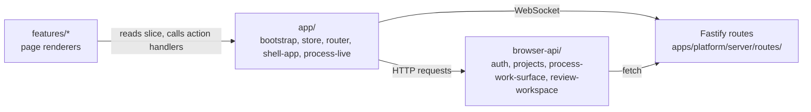
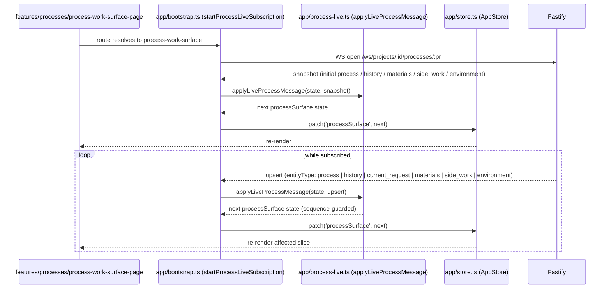

# Client Surfaces

The Liminal Build client is a Vite-built vanilla TypeScript app under `apps/platform/client/`, served by Fastify in production and during local `pnpm dev`. Every request and live update passes through Fastify; the browser never reads or writes Convex or GitHub directly. A thin `browser-api/` boundary wraps typed HTTP requests per domain, an app-level `store.ts` holds the current session and per-route surface state, and feature surfaces under `client/features/` compose the project shell, process work surface, archive view, and review workspace. This page is the client-side companion to the cross-cutting decision that browsers consume typed [Snapshot](../conventions/glossary.md) and [Upsert](../conventions/glossary.md) messages — never raw provider deltas — settled in [Browsers Consume Typed Upserts](../current-technical-architecture/cross-cutting-decisions.md).

## Architecture Recap

The client sits at the browser side of the four-surface platform. Every HTTP call lands on Fastify, every durable read or write goes through the [Fastify Control Plane](./server-control-plane.md), and live updates arrive over a single WebSocket per active process. Convex and GitHub are server-only stores; the client has no direct credentials or transport to either. Live state is delivered as typed [Section-Envelope](../conventions/glossary.md) `snapshot` and `upsert` messages reconciled by `subscriptionId` and `sequenceNumber`, so the client never sees raw model-provider streaming bytes.

## Client Tree

The client subtree is organized into three peer directories — `app/`, `browser-api/`, and `features/` — plus the Vite entry. The tree below shows the directories and the most load-bearing files; component-level files inside features are not enumerated.

```text
apps/platform/client/
├── index.html
├── main.ts                       (Vite entry; calls bootstrapApp)
├── app/
│   ├── bootstrap.ts              (action handlers, route loaders, live wiring)
│   ├── shell-app.ts              (route-to-page dispatcher)
│   ├── router.ts                 (URL parse + buildRouteHref + navigateTo)
│   ├── store.ts                  (AppStore: get / set / patch / subscribe)
│   ├── process-live.ts           (applyLiveProcessMessage reconciler)
│   └── dom.ts                    (root-element, bootstrap-payload, and generic DOM helpers)
├── browser-api/
│   ├── auth-api.ts               (/auth/me, /auth/logout, ApiRequestError)
│   ├── projects-api.ts           (project shell + project source attachments)
│   ├── process-work-surface-api.ts (process bootstrap, actions, archive, derived views)
│   └── review-workspace-api.ts   (review bootstrap, artifact + package targets, export)
└── features/
    ├── projects/                 (project-index, project-shell, source-attachment, modals)
    ├── processes/                (process-work-surface, archive, history, materials, side work, environment)
    └── review/                   (review-workspace, artifact + package panels, markdown + Mermaid render)
```

The single Vite entry is `main.ts`, which calls `bootstrapApp` from `app/bootstrap.ts`. Everything else is reached through that entry, the store, and the per-feature page renderers wired by `app/shell-app.ts`.

## App Bootstrap and Store

`main.ts` is one line: it calls `bootstrapApp()` from `app/bootstrap.ts`. The bootstrap module resolves the authenticated user via `getAuthenticatedUser`, constructs the `AppStore` with a parsed `defaultAppState`, parses the current URL into a `ParsedRoute` through `app/router.ts`, fetches the appropriate aggregate response (project list, project shell, process work-surface bootstrap, process archive, or review workspace bootstrap), opens a process live subscription when the route names a process, and hands the store to `createShellApp` from `app/shell-app.ts`. The shell app subscribes to the store and re-renders the right feature page on every state change.

The store is the central app-state mechanism. `AppStore` exposes `get()`, `set(partial)`, `patch(key, value)`, and `subscribe(listener)`, with each write validated against `appStateSchema` from `apps/platform/shared/contracts/`. The state shape is partitioned by surface so each feature reads a slice without colliding with the others. Top-level slices include `auth` (resolved actor + CSRF token), `route` (current pathname + selected ids), `projects` (index list), `shell` (project shell aggregate sections — project, processes, artifacts, sourceAttachments, selected-process banner), `processSurface` (process work-surface aggregate — process, history, materials, source provenance, current request, side work, environment, plus a `live` substate carrying `connectionState`, `subscriptionId`, `lastSequenceNumber`, and `error`), `archiveSurface` (process archive page + turns + derived views), `reviewWorkspace` (selection, available targets, current target, export state), and `modals`.

The store enforces the [Section-Envelope Graceful Degradation](../current-technical-architecture/cross-cutting-decisions.md) contract on every aggregate write: composite responses arrive with each section already carrying its own status, and the store accepts partial-success states without rejecting the whole envelope. Action handlers in `bootstrap.ts` patch one slice at a time (`store.patch('processSurface', next)`) and rely on Zod re-parsing for shape safety.

## Browser-API Boundary

`browser-api/` is the only place feature surfaces reach Fastify. Each module exports typed async functions per domain, reuses contract types and Zod schemas from `apps/platform/shared/contracts/`, and throws `ApiRequestError` from `auth-api.ts` carrying a `RequestError` payload (code, message, status) when Fastify returns a non-2xx. Feature pages and components import HTTP wrappers from `browser-api/`; they never call `fetch` against Fastify routes directly, and Convex or GitHub never appear at all on the client side.

| Module | Wraps | Notable Operations |
|-|-|-|
| `auth-api.ts` | `/auth/*` | `getAuthenticatedUser` (`GET /auth/me`), `signOut` (`POST /auth/logout` with `x-csrf-token`), `ApiRequestError` |
| `projects-api.ts` | `/api/projects/*`, `/api/projects/:id/source-attachments/*` | `listProjects`, `createProject`, `getProjectShell`, `createProcess`, `attachProjectSource`, `updateSourceAttachment`, `refreshSourceAttachment`, `detachSourceAttachment` |
| `process-work-surface-api.ts` | `/api/projects/:id/processes/:pr/*`, archive + derived views | `getProcessWorkSurface`, `startProcess`, `resumeProcess`, `submitProcessResponse`, `rehydrateEnvironment`, `rebuildEnvironment`, `getProcessArchive`, `getProcessArchiveTurns`, `getProcessDerivedArchiveViews`, `attachProcessSource`, `getProcessSourceProvenance` |
| `review-workspace-api.ts` | `/api/projects/:id/processes/:pr/review/*` | `getReviewWorkspace`, `getArtifactReview`, `getPackageReview`, `exportPackage` |

Live-update subscription and reconciliation live in the **app layer**, not in `browser-api/`. The reducer that turns a typed `LiveProcessUpdateMessage` into the next `processSurface` state is `app/process-live.ts` (function `applyLiveProcessMessage`); the WebSocket itself is opened, retried, and torn down by `app/bootstrap.ts` (`startProcessLiveSubscription`, which builds the URL through `buildProcessLiveUpdatesPath` from shared contracts and routes incoming messages through `liveProcessUpdateMessageSchema.safeParse`). Keeping live transport in the app layer means HTTP wrappers stay request/response only and the live reducer stays a pure function over `(state, message) -> state` that the test suite exercises directly.



The diagram shows the layering: feature surfaces depend on the store and the action handlers exposed by the app layer; HTTP requests flow only through `browser-api/`; WebSocket connections originate in the app layer because the live reducer needs direct access to the store; and every outbound edge terminates at Fastify, never at Convex or GitHub.

## Feature Surfaces

Three feature directories live under `client/features/`, each composing the page renderers used by the shell-app router. Surfaces are process-aware: the current process is part of the route, not feature-internal state, and `app/shell-app.ts` chooses the page renderer based on the parsed route plus which surface slice is populated.

| Feature | Surface | Consumes |
|-|-|-|
| `projects/` | Project index (`project-index-page`) and project shell aggregate (`project-shell-page`) with processes, artifacts, source attachments, and create-project / create-process / source-attachment composers | `GET /api/projects`, `POST /api/projects`, `GET /api/projects/:id`, `POST /api/projects/:id/processes`, `POST/PATCH/DELETE /api/projects/:id/source-attachments[/:saId][/refresh]` |
| `processes/` | Process work surface (`process-work-surface-page`) with history, materials, source provenance, current request, side work, environment panel, and start / resume / respond / rehydrate / rebuild controls; process archive page (`process-archive-page`) with archive entries, turns, and derived views | `GET /api/projects/:id/processes/:pr` and `POST` action endpoints; archive `GET /api/projects/:id/processes/:pr/archive[/turns][/derived-views]` plus refresh; live updates over `WS /ws/projects/:id/processes/:pr` |
| `review/` | Review workspace (`review-workspace-page`) with artifact review panel, package review panel, version switcher, package member nav, markdown body, Mermaid runtime, and export trigger | `GET /api/projects/:id/processes/:pr/review[/artifacts/:aid][/packages/:pid]`, `POST /api/projects/:id/processes/:pr/review/packages/:pid/export` |

Each feature directory is composed of small focused renderer modules organized by responsibility (panels, sections, composers, modals) rather than by file type — there is no global `components/` flat folder. The project shell, process work surface, and process archive are sibling pages selected by route; the [Review Workspace](./review-package-and-export.md) is its own feature surface separate from the process work surface, sharing a process id but not the live-update subscription.

## Live Update Reception

After bootstrap, the process work surface stays current through a single WebSocket subscription opened against `/ws/projects/:id/processes/:pr`. The connection is owned by `app/bootstrap.ts`; arriving messages are parsed against `liveProcessUpdateMessageSchema` and reduced into the next `processSurface` state by `applyLiveProcessMessage` in `app/process-live.ts`. The first message after open is the canonical [Snapshot](../conventions/glossary.md) — the client renders before any later [Upsert](../conventions/glossary.md) arrives, so reload, reconnect, and section degradation each settle to a coherent view.



The reducer guards against out-of-order messages within the active subscription by comparing `sequenceNumber` against `processSurface.live.lastSequenceNumber`, accepts and adopts a new `subscriptionId` when the channel changes, drops messages whose `processId` no longer matches the active surface, and merges history items by `historyItemId` so duplicate finalized entries do not appear. Section-level error messages (`messageType: 'error'` with an `entityType` of `history`, `materials`, or `side_work`) degrade only that section to a `status: 'error'` envelope; the rest of the work surface keeps rendering. When the WebSocket cannot open, `bootstrap.ts` records `connectionState: 'error'` and the work-surface live-status component surfaces a retry handle wired through `onRetryLiveSubscription`.

## Bootstrap Section Envelopes

Project shell, process work-surface, and review workspace bootstrap responses arrive as composite envelopes with per-section status fields, per the [Section-Envelope Graceful Degradation](../current-technical-architecture/cross-cutting-decisions.md) decision. The store accepts a degraded section without rejecting the response, and feature renderers under `features/projects/` (`section-envelope.ts`, `unavailable-state.ts`) translate `status: 'ready' | 'empty' | 'error'` into appropriate inline UI: ready sections render the data, empty sections render the empty state, and error sections render the bounded reason inline while the rest of the page stays usable. (The `'unavailable'` state is a separate route/page-level concept — e.g., environment-summary degradation or top-level page unavailable states — and is not part of the section-envelope status enum.) The same pattern applies on live updates — a `messageType: 'error'` upsert for `history`, `materials`, or `side_work` writes a typed error envelope into that slice without touching the others.

## Patterns and Conventions

- Feature surfaces import HTTP wrappers from `browser-api/`; they never call Fastify routes directly with `fetch` and never reach Convex or GitHub. The `browser-api/` modules are the only files in the client tree that call `fetch`.
- Routing lives at the app level (`app/router.ts`, `app/shell-app.ts`, `app/bootstrap.ts`); feature surfaces receive their context via route params resolved into store slices, plus action callbacks passed in by the shell.
- Component organization within each feature is by responsibility (panels, sections, composers, modals), not by type. There is no global `components/` flat folder.
- The store schema is parsed on every write, so type drift between feature renderers and the central state is caught at the point of write rather than at render.
- Live-update transport stays in `app/`; the reducer in `app/process-live.ts` is a pure function and is exercised directly by the client test suite.
- Client tests live in `tests/service/client/` (top-level), not colocated under `apps/platform/client/`. The runner is jsdom-based Vitest and tests import directly from `apps/platform/client/...`. See [Testing and Verification](../conventions/testing-and-verification.md) for the full test-lane layout.

## Likely Code Areas

The table maps the most common questions about the client tree to the file or directory that answers them.

| Concern | Path |
|-|-|
| Vite entry | `apps/platform/client/main.ts` |
| App bootstrap, action handlers, route loaders, live-subscription wiring | `apps/platform/client/app/bootstrap.ts` |
| Route-to-page dispatcher | `apps/platform/client/app/shell-app.ts` |
| URL parse, `buildRouteHref`, `navigateTo` | `apps/platform/client/app/router.ts` |
| App-level store (get / set / patch / subscribe; default state shape) | `apps/platform/client/app/store.ts` |
| Live-update reducer (`applyLiveProcessMessage`) | `apps/platform/client/app/process-live.ts` |
| Authenticated user + sign-out HTTP wrappers | `apps/platform/client/browser-api/auth-api.ts` |
| Project shell + project source-attachment HTTP wrappers | `apps/platform/client/browser-api/projects-api.ts` |
| Process work-surface, action, archive, derived-view HTTP wrappers | `apps/platform/client/browser-api/process-work-surface-api.ts` |
| Review workspace bootstrap, artifact / package targets, export | `apps/platform/client/browser-api/review-workspace-api.ts` |
| Project index, project shell, source attachment surfaces, modals | `apps/platform/client/features/projects/` |
| Process work surface, archive, history, materials, environment, side work | `apps/platform/client/features/processes/` |
| Review workspace, artifact / package panels, markdown + Mermaid render, export | `apps/platform/client/features/review/` |
| Client tests (jsdom Vitest) | `tests/service/client/` |

## Related

- [Technical Design Overview](./overview.md)
- [Shared Contracts](./shared-contracts.md)
- [Server Control Plane](./server-control-plane.md)
- [Project Shell](./project-shell.md)
- [Process Domain](./process-domain.md)
- [Review, Package, and Export](./review-package-and-export.md)
- [Cross-Cutting Decisions](../current-technical-architecture/cross-cutting-decisions.md)
