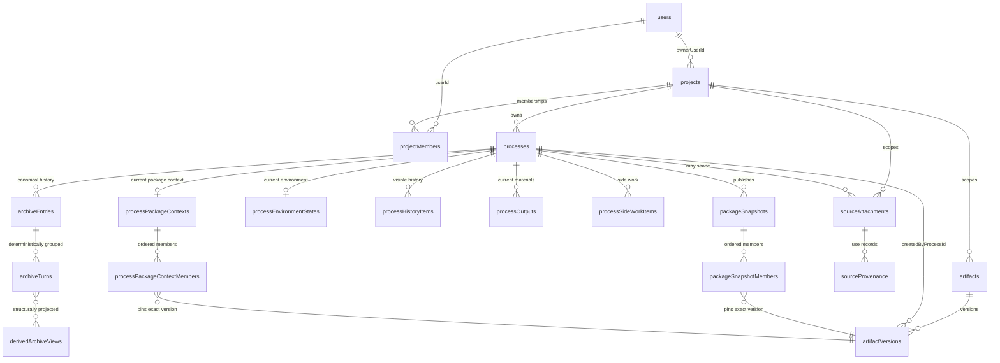

# Convex Durable State and Projections

[Convex](../conventions/glossary.md) owns every durable platform table. The single source of truth is `convex/schema.ts`, which composes per-domain field definitions into the working schema; per-domain files under `convex/` carry the public and internal queries and mutations that read and write each table. The `_generated/` bindings are produced by `convex dev` from that schema and used by the Convex app itself for typed function registration. The platform app does not import `_generated/api` or `_generated/server`; it reaches Convex through `ConvexPlatformStore` (`apps/platform/server/services/projects/platform-store.ts`), using `ConvexHttpClient` from `convex/browser` and string-based function references built with `makeFunctionReference` from `convex/server` (e.g. `makeFunctionReference<'mutation', ...>('processes:start')`). Document shapes come from `_generated/dataModel`. The browser never reads or writes Convex directly — every durable read and write traverses the [Fastify Control Plane](./server-control-plane.md), which orchestrates Convex calls and republishes typed live updates to the client.

## Architecture Recap

The durable layer is one of the four cross-cutting infrastructure layers under the top-tier domains in [Top-Tier Domains](../current-technical-architecture/top-tier-domains.md): Shared Contracts above, Client Surfaces and Server Control Plane in the runtime path, and Convex underneath. The platform's four runtime surfaces (browser client, Fastify control plane, sandbox runtime, durable stores) and the durable stores surface — Convex paired with GitHub — are the canonical context this layer operates within. The Fastify control plane stays in control of every transition between sandbox working state and durable Convex state per the [One-Shot Script Execution](../current-technical-architecture/cross-cutting-decisions.md) decision; sandbox runtimes return structured results, and Fastify decides what becomes archive truth, an artifact version, or a checkpoint write. Live updates on hot surfaces are imperative rather than reactive: a Fastify service writes the durable change to Convex, and after the mutation returns the same service publishes a typed message to an in-memory live hub that fans out to subscribed WebSocket clients per [Browsers Consume Typed Upserts](../current-technical-architecture/cross-cutting-decisions.md). Reactive Convex queries do exist, but inside the Convex app for some derivations — Fastify does not subscribe to Convex queries to drive browser updates.

## Schema and Generated Bindings

`schema.ts` is the only place tables are declared. Each table is defined with `defineTable` over a `*TableFields` object exported from a per-domain file (for example `archiveEntriesTableFields` from `convex/archiveEntries.ts`), then chained with `.index(...)` calls naming the access patterns the domain readers need. The schema is composed top-down so that adding a new durable table is a paired change in the per-domain field file and `schema.ts`.

The `convex/_generated/` directory holds bindings produced by `convex dev`: `api.js` for public function references, `server.js` for `query`, `mutation`, `internalQuery`, and `internalMutation` registration helpers, and `dataModel.d.ts` for `Id` and `Doc` types. These files are regenerated on every schema or function change and are not hand-edited. Inside the Convex app, per-domain files use `_generated/server` to register functions and `_generated/api` to compose calls between functions. The platform app imports neither; it dispatches Convex calls through `ConvexPlatformStore`, which holds a `ConvexHttpClient` and builds typed string references with `makeFunctionReference<'query' | 'mutation', ...>('module:name')`. `_generated/dataModel` is the only generated module `apps/platform/` reaches into, for `Id` and `Doc` types. Test helpers live in `convex/test_helpers/fake_convex_context.ts` alongside the durable surfaces but are not themselves a durable surface.

## Durable Table Inventory

`schema.ts` defines twenty-two durable tables, organized into per-domain files that own their queries, mutations, indexes, and validators. The "Owns" column captures the canonical responsibility recorded in [Conventions: Glossary](../conventions/glossary.md); the "Domain" column points to the top-tier domain that consumes the table.

| Table | File | Domain | Owns |
|-|-|-|-|
| `users` | `convex/users.ts` | Auth and Identity | WorkOS-backed user records and display metadata |
| `projects` | `convex/projects.ts` | Project | Project identity, owner, last-updated metadata |
| `projectMembers` | `convex/projectMembers.ts` | Project | Project membership rows with `owner` / `member` role |
| `processes` | `convex/processes.ts` | Process | Process records: type, status, phase, current-request linkage, environment flag |
| `processHistoryItems` | `convex/processHistoryItems.ts` | Process | Visible Process History — work-surface presentation history |
| `processSideWorkItems` | `convex/processSideWorkItems.ts` | Process | Side-work entries surfaced alongside the main process flow |
| `processOutputs` | `convex/processOutputs.ts` | Process | Current materials produced or referenced by the process |
| `processPackageContexts` | `convex/processPackageContexts.ts` | Review and Package | Mutable per-process Process Package Context (one per process) |
| `processPackageContextMembers` | `convex/processPackageContextMembers.ts` | Review and Package | Ordered package-context members pinning artifact versions |
| `processEnvironmentStates` | `convex/processEnvironmentStates.ts` | Process Runtime | Durable authority for current environment lifecycle and working set |
| `processProductDefinitionStates` | `convex/processProductDefinitionStates.ts` | Process | Per-process state for the ProductDefinition process type |
| `processFeatureSpecificationStates` | `convex/processFeatureSpecificationStates.ts` | Process | Per-process state for the FeatureSpecification process type |
| `processFeatureImplementationStates` | `convex/processFeatureImplementationStates.ts` | Process | Per-process state for the FeatureImplementation process type |
| `artifacts` | `convex/artifacts.ts` | Artifacts and Versions | Project-scoped Artifact identity (no process ownership) |
| `artifactVersions` | `convex/artifactVersions.ts` | Artifacts and Versions | Append-only Artifact Version rows with content storage and producing-process provenance |
| `packageSnapshots` | `convex/packageSnapshots.ts` | Review and Package | Immutable Package Snapshot records with publishing-process scope |
| `packageSnapshotMembers` | `convex/packageSnapshotMembers.ts` | Review and Package | Ordered Package Members pinning exact `artifactVersionId` values |
| `archiveEntries` | `convex/archiveEntries.ts` | Archive | Canonical Archive Entries at low-level grain, idempotent on Finalization Key |
| `archiveTurns` | `convex/archiveTurns.ts` | Archive | Cached deterministic Turn projections over archive entries |
| `derivedArchiveViews` | `convex/derivedArchiveViews.ts` | Archive | Structural derived views (`turn_range`, `chunk_candidate`) over turns |
| `sourceAttachments` | `convex/sourceAttachments.ts` | Source Management | Project- or process-scoped Source Attachment with hydration metadata |
| `sourceProvenance` | `convex/sourceProvenance.ts` | Source Management | Source Provenance rows recording `informed_work` and `received_code_update` use |

Per-domain files contain both public queries / mutations consumed by Fastify routes and internal queries / mutations called by other Convex functions. Reference fields between tables follow the architectural cross-cutting decisions: `artifactVersions.createdByProcessId` records the producing process on the version (exposed in review contracts as `producedByProcessId`); `artifacts` carries no `processId` per the [Artifact Identity vs Version Provenance](../current-technical-architecture/cross-cutting-decisions.md) decision; `archiveEntries` owns canonical history while `archiveTurns` and `derivedArchiveViews` are projections.

## Cross-Table Relationships

The load-bearing references encode project-level scoping, process-scoped working state, append-only version provenance, package pinning, and archive-to-projection layering. Cardinalities below match the live `*TableFields` shapes. Mandatory references use double-bar on the parent side; optional unions use the open circle.

Project-scoped identity is the canonical scope for processes, artifacts, and source attachments. Process is the next-level scope for transient and presentation state — environment, visible history, outputs, side work, package context — and for the package snapshots a process publishes. Archive entries are append-only and keyed by `(processId, finalizationKey)` for idempotency; a `by_processId_and_finalizationKey` index enforces it. Package members and process-package-context members both pin exact `artifactVersionId` values rather than tracking the latest version, so eligibility downstream stays stable. `archiveTurns` references its source `archiveEntryIds` as an array; `derivedArchiveViews` reference `sourceTurnIds` and `sourceArchiveEntryIds` arrays — both are reconstructible from canonical archive truth.

## Public vs Internal Functions

Per-domain files expose two function shapes. Public `query` and `mutation` functions are consumed by Fastify routes through `_generated/api`; internal `internalQuery` and `internalMutation` functions are called from other Convex functions to compose domain reads or to keep write paths atomic. Composite reads — for example the work-surface bootstrap that pulls a process record, its history, side work, outputs, and environment state — assemble inside Fastify services rather than inside a single Convex function, because each per-domain query stays scoped to its own table and indexes. Internal queries are scoped to backend function boundaries: they are not part of the public Convex API and are not callable from the platform app or browser.

## Projection Patterns

Projections in the codebase fall into four shapes. Each preserves canonical truth while providing the reading surface that consuming subsystems need.

- **Aggregate read patterns.** Project-shell and process work-surface payloads are assembled in Fastify services from multiple per-domain queries (project, processes, artifacts, environment state, source attachments). Convex queries themselves stay scoped to one domain; the composition lives in the control plane so section-level [Section-Envelope Graceful Degradation](../current-technical-architecture/cross-cutting-decisions.md) can degrade individual sections without collapsing the response.
- **Cached deterministic projections.** `archiveTurns` is a deterministic Turn grouping over `archiveEntries`; `derivedArchiveViews` carries structural views (`turn_range`, `chunk_candidate`) over turns. Both are stored for bounded reads but rebuildable from canonical archive entries — derived views can be deleted and rebuilt without affecting archive truth. Mechanics live in [Archive and Derived Views](./archive-and-derived-views.md).
- **Live-update projections.** Live updates flow imperatively from Fastify services. After a service writes a durable mutation to Convex, the service calls `processLiveHub.publish(...)` on an in-memory hub (`apps/platform/server/services/processes/live/process-live-hub.ts`) with a normalized publication; the hub fans out a typed snapshot or upsert message to subscribed WebSocket clients. Fastify does not subscribe to Convex queries to drive browser updates, and the browser does not subscribe to Convex directly. Entity types include `process`, `history`, `current_request`, `materials`, `side_work`, and `environment`.
- **Pinned package context.** `processPackageContexts` and `processPackageContextMembers` provide the mutable per-process building context that gathers pinned versions before publication; one current context per process, replaced atomically on upsert. `packageSnapshots` and `packageSnapshotMembers` are immutable after publication and pin exact `artifactVersionId` values across processes within the project. Mechanics live in [Review, Package, and Export](./review-package-and-export.md).

## Patterns and Conventions

Layer-specific conventions follow from the per-domain file shape and the cross-cutting decisions inherited from the architecture pages.

- One file per durable domain; multi-domain files are an anti-pattern. The `*TableFields` export composes into `schema.ts`, and queries / mutations in the same file own that table's read and write surface.
- `*.test.ts` files colocated with domain files (for example `archiveEntries.test.ts`, `processOutputs.test.ts`) are not durable surfaces.
- `convex/test_helpers/fake_convex_context.ts` is colocated test helpers; it provides an in-memory query/mutation context for unit tests and is not part of the durable surface.
- Schema indexes follow read patterns documented on the relevant domain page — examples include `by_projectId`, `by_processId_and_updatedAt`, `by_artifactId_createdAt`, `by_processId_and_sequence`, and the package-snapshot member position index.
- Migration is append-additive in the absence of a Convex migration framework: new optional fields are added before write paths emit them, and field removal coordinates with the platform code that reads the table. Schema-tightening changes (for example Epic 4 making `createdAt` required on artifacts and `displayName`/`versionLabel` required on package members) carry a backfill or dev-DB-reset note in the schema source.
- Convex usage follows `convex/_generated/ai/guidelines.md` per the project `CLAUDE.md`. Public versus internal function selection, validator authoring, and `ctx.runQuery` / `ctx.runMutation` composition all derive from those rules.

## Likely Code Areas

| Concern | Path |
|-|-|
| Durable schema | `/Users/leemoore/code/liminal-build/convex/schema.ts` |
| Generated bindings | `/Users/leemoore/code/liminal-build/convex/_generated/` |
| Per-domain function files | `/Users/leemoore/code/liminal-build/convex/` (one file per durable domain) |
| Test helpers | `/Users/leemoore/code/liminal-build/convex/test_helpers/fake_convex_context.ts` |
| Convex usage rules | `/Users/leemoore/code/liminal-build/convex/_generated/ai/guidelines.md` |
| Local Convex startup wrapper | `/Users/leemoore/code/liminal-build/scripts/start-convex.ts` |

## Related

- [Technical Design Overview](./overview.md)
- [Shared Contracts](./shared-contracts.md)
- [Server Control Plane](./server-control-plane.md)
- [Process Domain](./process-domain.md)
- [Process Runtime and Environments](./process-runtime-and-environments.md)
- [Artifacts and Versions](./artifacts-and-versions.md)
- [Review, Package, and Export](./review-package-and-export.md)
- [Source Management Domain](./source-management-domain.md)
- [Archive and Derived Views](./archive-and-derived-views.md)
- [Cross-Cutting Decisions](../current-technical-architecture/cross-cutting-decisions.md)
