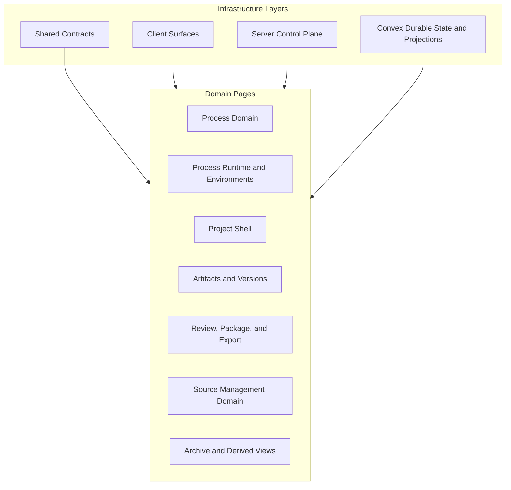

# Technical Design Overview

Design pages are organized by code geography. Four cross-cutting infrastructure layers — Shared Contracts, Client Surfaces, Server Control Plane, and Convex Durable State and Projections — sit under all eight platform domains, while seven domain-specific design pages drill into the product-organizing domains. Infrastructure pages map to directories under `apps/platform/` and `convex/`; domain pages map to platform behavior and link back into the infrastructure pages where their code lives. This section pairs with [Top-Tier Domains](../current-technical-architecture/top-tier-domains.md): the architecture page bounds the eight domains, and these pages drill into the code that implements them.

## Section Map

The section map shows how the design pages relate. Four infrastructure layers form a cross-cutting band that serves every domain page; the seven domain pages each describe a product-facing capability that consumes those layers.

Each infrastructure layer is a code-organization concern that serves every domain — contracts, client code, server code, and durable state — and is documented once on its own page rather than redescribed inside each domain. Each domain page describes a product-facing capability and links into the infrastructure pages where its underlying code lives. Readers entering at code geography (a directory) or at platform behavior (a domain) reach the same files in one or two hops.

## Infrastructure Layers

Infrastructure pages cover how the codebase is organized rather than what the platform does. Each page owns one cross-cutting layer and is referenced from every domain page that touches it.

| Page | Owns | Lives Under |
|-|-|-|
| [Shared Contracts](./shared-contracts.md) | Zod-authored contracts consumed by both server and client | `apps/platform/shared/contracts/` |
| [Client Surfaces](./client-surfaces.md) | Vite-built TypeScript client: bootstrap, store, browser-API boundary, feature surfaces | `apps/platform/client/` |
| [Server Control Plane](./server-control-plane.md) | Fastify routes, services, plugins, error catalog, integration boundaries | `apps/platform/server/` |
| [Convex Durable State and Projections](./convex-durable-state-and-projections.md) | Convex schema, durable tables, queries/mutations, generated bindings | `convex/` |

The directory-to-page mapping is also captured on [Repository Layout](../conventions/repository-layout.md), which is the right page to open when the question starts from a path rather than a layer.

## Domain Pages

Domain pages cover what the platform does. Each one drills into one of the eight top-tier domains; Environments and Tool Runtime are merged onto a single runtime page because they share lifecycle and execution mechanics.

| Page | Domain | Drills Into |
|-|-|-|
| [Project Shell](./project-shell.md) | Projects | project container, shell aggregator, project-scoped authz |
| [Process Domain](./process-domain.md) | Processes | process state, phases, work surface, history items, side work, current refs |
| [Process Runtime and Environments](./process-runtime-and-environments.md) | Environments and Tool Runtime | environment lifecycle, providers, hydration plan, controlled execution, ExecutionResult, code checkpoint |
| [Artifacts and Versions](./artifacts-and-versions.md) | Artifacts | artifact identity, version provenance, content storage |
| [Source Management Domain](./source-management-domain.md) | Sources | source attachments, provenance, repository identity vs URL, hydration state, scope shadowing |
| [Archive and Derived Views](./archive-and-derived-views.md) | Archive | canonical archive entries, finalization, turns, derived views |
| [Review, Package, and Export](./review-package-and-export.md) | Review Workspace | review eligibility, render pipeline, package snapshots, .mpkz export |

These pages should be read for what they treat as settled within their domain. The architecture-level boundaries between domains stay on [Top-Tier Domains](../current-technical-architecture/top-tier-domains.md) and are not relitigated here.

## How To Read This Section

Different reading orders fit different tasks:

- **Onboarding to a subsystem:** start at the relevant domain page; follow links into the infrastructure pages where its code lives.
- **Working in a directory:** start at the matching infrastructure page; follow links into the domain pages it serves.
- **Reviewing a change:** open the conventions pages first ([Coding Patterns](../conventions/coding-patterns-and-service-shape.md), [Testing and Verification](../conventions/testing-and-verification.md), [Error Codes](../conventions/error-codes.md)), then the relevant subsystem page.
- **Drafting a tech design or epic:** start at the relevant domain page for what it treats as settled; consult the architecture section ([Top-Tier Domains](../current-technical-architecture/top-tier-domains.md), [Cross-Cutting Decisions](../current-technical-architecture/cross-cutting-decisions.md)) for what is fixed across all domains.

## Related

- [Technical Design Section Home](./README.md)
- [Wiki Home](../README.md)
- [Architecture Overview](../current-technical-architecture/overview.md)
- [Top-Tier Domains](../current-technical-architecture/top-tier-domains.md)
- [Conventions](../conventions/README.md)
