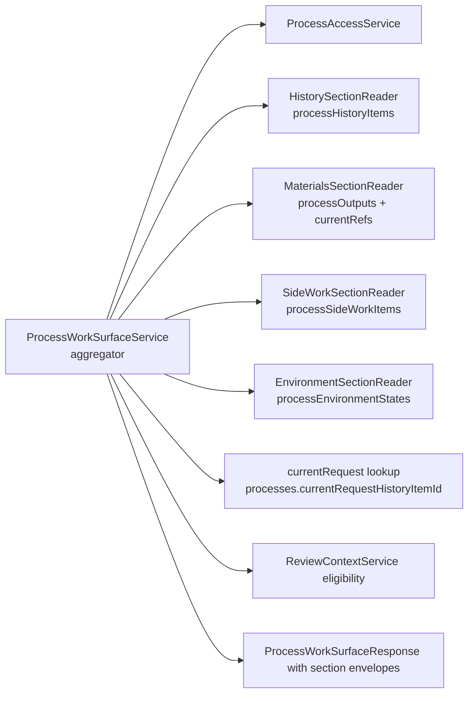
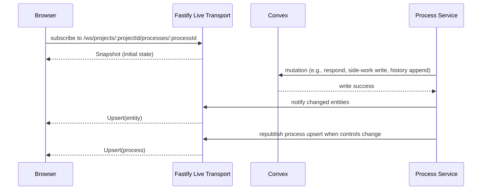

# Process Domain

A [Process](../conventions/glossary.md) is the durable unit of work inside a [Project](../conventions/glossary.md), scoped to exactly one [ProcessType](../conventions/glossary.md) — [ProductDefinition](../conventions/glossary.md), [FeatureSpecification](../conventions/glossary.md), or [FeatureImplementation](../conventions/glossary.md) — and carries durable lifecycle status, a phase model, current artifact and source references, an optional [Environment](../conventions/glossary.md), recent side work, and visible presentation history. The Process is the central platform entity: most other domains read from or write to it, and the [Process Work Surface](../conventions/glossary.md) is the active workspace where a user observes and steers it. The most easily-confused distinction this domain owns is the split between [Visible History](../conventions/glossary.md) (`processHistoryItems`, the work-surface presentation history, durable enough for reload) and the canonical [Archive Entry](../conventions/glossary.md) record (`archiveEntries`, finalized truth, append-only) — these complement each other and are not interchangeable. ProcessType behavior (state schema, phase model, toolset) lives in code modules registered with the runtime, never as runtime configuration.

## Architecture Recap

Liminal Build runs across four runtime surfaces — the browser client, the [Fastify Control Plane](../conventions/glossary.md), the disposable [Sandbox Runtime](../conventions/glossary.md), and durable [Convex](../conventions/glossary.md) state plus [GitHub](../conventions/glossary.md) for canonical code. Fastify mediates every cross-surface call, so process actions, history reads, environment lifecycle, and live subscriptions all flow through one control plane rather than fanning out from the browser to providers or stores directly. ProcessType modules are code-defined and registered into the platform; new ProcessTypes arrive through code, schema changes, and module-registry wiring rather than through runtime configuration (see [Cross-Cutting Decisions: Process Types Are Code-Defined Modules](../current-technical-architecture/cross-cutting-decisions.md)).

## Durable State

Process durable state is split across one central row, a small set of per-ProcessType state tables that the ProcessType module owns, and three operational read-model tables for visible history, output materials, and side work. The split exists so ProcessType-specific shape never leaks into the generic process record and so high-churn presentation state stays out of the identity row.

| Table | Owns | File |
|-|-|-|
| `processes` | Process identity, owner project, displayLabel, status, phaseLabel, nextActionLabel, `currentRequestHistoryItemId`, `hasEnvironment`, timestamps | `convex/processes.ts` |
| `processProductDefinitionStates` | Per-process state for ProductDefinition (schema owned by the module) | `convex/processProductDefinitionStates.ts` |
| `processFeatureSpecificationStates` | Per-process state for FeatureSpecification | `convex/processFeatureSpecificationStates.ts` |
| `processFeatureImplementationStates` | Per-process state for FeatureImplementation | `convex/processFeatureImplementationStates.ts` |
| `processHistoryItems` | Visible presentation history backing the work surface (durable for reload, not canonical) | `convex/processHistoryItems.ts` |
| `processOutputs` | Current output read model surfaced as materials | `convex/processOutputs.ts` |
| `processSideWorkItems` | Side-work read model summarized on the work surface | `convex/processSideWorkItems.ts` |

The central `processes` row carries identity, owner project, current phase, the pinned current-request pointer, and timestamps; it never grows ProcessType-shaped fields. Per-ProcessType state lives in dedicated tables so each ProcessType module can evolve its schema, phase logic, and current artifact references without forcing migration on the others. The three read-model tables (history, outputs, side work) carry operational state the work surface renders and are written through the process services — they are not the same as canonical archive material.

## ProcessType Modules

ProcessType modules are the seam between the generic process service layer and per-type semantics: each module supplies its own state schema, phase model, and toolset, and the work surface composes a typed projection per type. The first-party set is fixed at three: ProductDefinition for upstream planning, FeatureSpecification for implementation-ready spec packs, and FeatureImplementation for implementing a feature against an accepted spec pack.

ProcessTypes are not authored at runtime. New types arrive through a new code module, a new per-ProcessType state table, and registry wiring (see [Cross-Cutting Decisions: Process Types Are Code-Defined Modules](../current-technical-architecture/cross-cutting-decisions.md)). The registry class lives in `apps/platform/server/services/processes/process-module-registry.ts` and exposes `register`, `get`, and `list`; today it is instantiated empty in `apps/platform/server/app.ts` and the live `start`, `resume`, and work-surface services do not yet dispatch through it. Per-type state tables already exist (`processProductDefinitionStates`, `processFeatureSpecificationStates`, `processFeatureImplementationStates`), so the structural seam is in place; per-type module-driven dispatch — where Fastify reads `processes.processType` and asks the registered module for a `ProcessSurfaceProjection` of process summary, current request, and current artifact and source refs — is the intended shape rather than the current control flow.

## Phases and Current Refs

Each ProcessType defines a phase model and the central `processes` row carries the current `phaseLabel` plus the next-action label so the project shell and work surface can render orientation without walking the per-type state. Current artifact and source references are the second axis: per-ProcessType state carries `currentArtifactIds` and `currentSourceAttachmentIds` naming the artifacts and source attachments the process is currently working with, and the latest version of each named artifact is the operative content during process work.

Current refs name artifact identity, not version pins (see [Artifacts and Versions](./artifacts-and-versions.md)): `processes` per-type state carries artifact and source-attachment ids so a process can revise its working set without churning the project-level artifact row, while version pinning happens at review and package-publication time on `packageSnapshotMembers` rather than on the process row. The materials reader resolves current artifact ids and current source-attachment ids from the per-ProcessType state through `apps/platform/server/services/processes/readers/materials-section.reader.ts`, combining them with `processOutputs` rows for the work-surface materials envelope. Per-process source-attachment scoping lives alongside in `apps/platform/server/services/processes/active-process-sources.ts`, which filters project- and process-scope attachments down to the active set the materials reader joins against.

## Visible History, Outputs, and Side Work

The work surface answers three different presentation questions — "what happened in this process", "what materials are current", and "what side work is active" — through three independent read models, with visible history standing apart from the canonical archive entry record. Each has its own table, its own reader under `apps/platform/server/services/processes/readers/`, and its own section envelope so a single failing section degrades gracefully without collapsing the surface.

### Visible History

`processHistoryItems` is the durable presentation history backing the [Process Work Surface](../conventions/glossary.md). It carries user messages, process messages, progress updates, attention requests, side-work updates, and process events with `lifecycleState` of `current` or `finalized` and a `requestState` (`none`, `unresolved`, `resolved`, `superseded`) so the pinned current-request pointer on `processes.currentRequestHistoryItemId` can resolve directly into a history row. Visible history is durable enough to survive reload and reconnect, but it is not canonical — canonical truth lives in `archiveEntries` and is appended through `ArchiveFinalizationService` (see [Archive and Derived Views](./archive-and-derived-views.md)). Visible history writes complement archive writes; a finalized user response, for example, both updates the visible-history row and appends a canonical archive entry. They are not the same record and they are not interchangeable: a reader that reaches into `processHistoryItems` for canonical low-level history is reading the wrong table.

### Outputs

`processOutputs` is the current outputs read model. It carries per-process output summaries — outputs in progress, outputs not yet checkpointed into an artifact version, and current published outputs — that the materials section renders alongside current artifact references. The materials reader deduplicates outputs that are already represented by a linked current artifact, so an artifact-checkpointed output is not double-rendered. Outputs are operational read-model state, not canonical truth: durable artifact bytes live on `artifactVersions`, with `processOutputs` describing the working presentation.

### Side Work

`processSideWorkItems` carries side work performed alongside the main process — for example, source-attachment refreshes, environment hydrations, environment rebuilds, or other supporting work that should remain visible without flooding chronological history. The reader at `apps/platform/server/services/processes/readers/side-work-section.reader.ts` orders running items first and settled items by recency so active work stays at the top of the section. Lifecycle moments that affect the parent process (started, completed, failed) also surface as `side_work_update` rows on `processHistoryItems`, but the side-work section answers a current-state question, not a chronology question.

## Work Surface Aggregator

The work-surface aggregator is the central composition point for the Process Work Surface: one Fastify call assembles a coherent process snapshot from multiple per-domain reads instead of forcing the client to fan out. It runs in `apps/platform/server/services/processes/process-work-surface.service.ts` and is consumed by both the bootstrap HTTP route and the WebSocket subscription's initial snapshot.

The aggregator runs four section readers in parallel — history, materials, side work, and environment — alongside the central process record and the pinned current-request lookup, then derives a `ProcessSurfaceSummary` with computed control state (start, respond, resume, rehydrate, rebuild, restart, review) based on process status and environment lifecycle. The result is a `ProcessWorkSurfaceResponse` envelope where history, materials, and side work each carry their own `status` (`ready`, `empty`, or `error`) per [Cross-Cutting Decisions: Section-Envelope Graceful Degradation](../current-technical-architecture/cross-cutting-decisions.md); the environment section degrades to an `unavailable` summary on failure rather than an envelope `error` shape. When one of the three section readers throws, the aggregator returns 200 with that section in `error` state and a stable code (`PROCESS_SURFACE_HISTORY_LOAD_FAILED`, `PROCESS_SURFACE_MATERIALS_LOAD_FAILED`, `PROCESS_SURFACE_SIDE_WORK_LOAD_FAILED`); when the environment reader throws, the response carries an `EnvironmentSummary` with `state: 'unavailable'` and a `blockedReason` so the surrounding surface stays usable.

The diagram shows the aggregator delegating to one access check and four parallel section readers plus a current-request and review-eligibility lookup, then composing one envelope. Section readers do not call each other; the aggregator is the only place sections are stitched. Consumers (the work-surface HTTP route and the live snapshot builder) inherit one composite contract and one degradation rule.

## Live Transport

Live transport keeps the work surface current after bootstrap. The browser opens a WebSocket per process, Fastify authenticates the connection, sends an immediate [Snapshot](../conventions/glossary.md), and then pushes typed [Upsert](../conventions/glossary.md) messages whenever a process service mutates durable state. Raw provider deltas never cross the browser boundary — Fastify normalizes every change into entity-scoped current-object messages.

The browser receives typed `snapshot`, `upsert`, `complete`, and `error` messages reconciled by `subscriptionId` and `sequenceNumber`; entity types include `process`, `history`, `current_request`, `materials`, `side_work`, and `environment`. Finalized history items merge by `historyItemId` so reconnect or reload does not duplicate rows. The same-session control republish invariant is load-bearing: any environment transition that changes visible controls publishes a process upsert alongside the environment upsert, so the work surface's start, resume, rehydrate, and rebuild buttons stay coherent in-session (see [Known Hardening: Same-Session Control Republish Invariant](../current-technical-architecture/known-hardening-and-deferrals.md#same-session-control-republish-invariant)). Live publication and normalization live under `apps/platform/server/services/processes/live/`: `process-live-hub.ts` owns the in-memory subscription map and `process-live-normalizer.ts` translates each publication into the typed message stream the browser consumes.

### Publication Ownership

Live updates flow imperatively from Fastify services after durable mutations land — the publishing service decides which entity slices have changed and calls `processLiveHub.publish(...)` with one publication that the normalizer fans out into typed entity messages. The matrix below names the canonical publish call sites today, the entity types each is responsible for emitting, and where the same-session control republish invariant pairs `process` with `environment` (see [Convex Durable State and Projections](./convex-durable-state-and-projections.md) for the imperative-vs-reactive mechanism).

| Trigger | Publishing service | Entity types published | Coherence pairing |
|-|-|-|-|
| Process start accepted | `process-start.service.ts` | `process`, `current_request`, `environment` | `process` + `environment` paired so start controls reconcile with the new environment state |
| Process resume accepted | `process-resume.service.ts` | `process`, `current_request`, `environment` | `process` + `environment` paired |
| Process response submitted | `process-response.service.ts` | `process`, `history`, `current_request`, `environment` | `process` + `environment` paired so respond and resume controls match the post-response state |
| Rehydrate accepted (route handler) | `environment/process-environment.service.ts` (`rehydrate`) | `process`, `environment` | `process` + `environment` paired on entry to `rehydrating` |
| Rebuild accepted (route handler) | `environment/process-environment.service.ts` (`rebuild`) | `process`, `history`, `environment` | `process` + `environment` paired on entry to `rebuilding`; rebuild-started history item rides the same publication |
| Hydration preparation event (async) | `environment/process-environment.service.ts` (`executeHydration`) | `history` | None — preparation event publishes only the new history row |
| Hydration ready and process running (async) | `environment/process-environment.service.ts` (`executeHydration`) | `process`, `environment` | `process` + `environment` paired on transition to `ready`/`running` |
| Execution lane state changes (async) | `environment/process-environment.service.ts` (`executeExecution`) | `process`, `environment`, plus `history`, `current_request`, `materials`, `side_work` on completion or failure | `process` + `environment` paired across `running`, `checkpointing`, and terminal failure transitions |
| Checkpoint progress and outcome (async) | `environment/process-environment.service.ts` (`executeCheckpoint`) | `process`, `environment`, plus `history` and `materials` depending on the checkpoint slice | `process` + `environment` paired through artifact, code, mixed, and failed checkpoint transitions |
| Recovery outcome (rehydrate or rebuild settled) | `environment/process-environment.service.ts` (`publishRecoveryOutcome`) | `process`, `environment` | `process` + `environment` paired so post-recovery controls match the settled environment |
| Async failure fallback | `environment/process-environment.service.ts` (`handleAsyncFailure`, `transitionToFailed`) | `process`, `environment` when the process record is readable; `environment` only when the process record is missing | `process` + `environment` paired on the readable path; bare-environment publish is the degraded fallback |

## Routes and Services

Process routes live in `apps/platform/server/routes/processes.ts` and are intentionally thin: each handler authenticates the actor, delegates to the matching process service, and maps service errors onto Section-Envelope or request-level error codes. The HTTP shell route also serves the process work-surface page document, while the WebSocket route opens the live subscription.

| Route | Method | Service |
|-|-|-|
| `/projects/:projectId/processes/:processId` | GET (HTML) | `apps/platform/server/services/processes/process-access.service.ts` plus shell renderer |
| `/api/projects/:projectId/processes/:processId` | GET | `process-work-surface.service.ts` |
| `/api/projects/:projectId/processes/:processId/start` | POST | `process-start.service.ts` |
| `/api/projects/:projectId/processes/:processId/resume` | POST | `process-resume.service.ts` |
| `/api/projects/:projectId/processes/:processId/responses` | POST | `process-response.service.ts` |
| `/api/projects/:projectId/processes/:processId/rehydrate` | POST | `environment/process-environment.service.ts` |
| `/api/projects/:projectId/processes/:processId/rebuild` | POST | `environment/process-environment.service.ts` |
| `/ws/projects/:projectId/processes/:processId` | GET (WebSocket) | `process-work-surface.service.ts` for initial snapshot, `live/process-live-hub.ts` for ongoing publication |

Process creation itself is owned by the project shell route family (`POST /api/projects/:projectId/processes`) and described in [Project Shell](./project-shell.md); the routes above cover everything that operates on an existing process. The environment-lifecycle routes (`rehydrate`, `rebuild`) are process-shaped from the URL down but delegate into the environment service under `apps/platform/server/services/processes/environment/` (see [Process Runtime and Environments](./process-runtime-and-environments.md)); they are listed here because the work surface treats them as process actions.

## Process and Adjacent Domains

The Process is the connective tissue that ties the rest of the platform together — every other domain is reached through a Process or scoped under one. The table below names the six adjacent domains and the relationship Process holds with each.

| Adjacent Domain | Relationship | See |
|-|-|-|
| Project | Every Process belongs to exactly one Project; project-scoped authz gates every process route | [Project Shell](./project-shell.md) |
| Environment | A Process has an optional Environment for controlled execution; durable lifecycle lives in `processEnvironmentStates` | [Process Runtime and Environments](./process-runtime-and-environments.md) |
| Artifact Versions | Current refs name artifact identity; the latest version is operative during process work, and version pinning happens at review and package time | [Artifacts and Versions](./artifacts-and-versions.md) |
| Archive Entries | Every finalized turn from a Process produces canonical entries through `ArchiveFinalizationService` | [Archive and Derived Views](./archive-and-derived-views.md) |
| Sources | A Process may use Source Attachments at process or project scope; active scoping resolves through `active-process-sources.ts` | [Source Management Domain](./source-management-domain.md) |
| Process Package Context | Per-process building context that gathers pinned versions for publication | [Review, Package, and Export](./review-package-and-export.md) |

These connections are read-side reads from the Process out, not bidirectional ownership. The Project sits above the Process and gates access; Environments, Artifacts, Archive, Sources, and Package Context all key off `processId` and resolve through Fastify rather than reaching into Convex from the browser.

## Patterns and Conventions

- ProcessType modules own the state schema and phase model. ProcessType-specific logic stays inside the module and the per-type state table; the central process service does not branch on `processType` for ProcessType-shaped behavior.
- Visible history writes complement archive writes. Canonical low-level truth flows through `ArchiveFinalizationService` against `archiveEntries`; bypassing the archive service to write only `processHistoryItems` leaves canonical history incomplete.
- Live transport publishes typed `snapshot`, `upsert`, `complete`, and `error` messages keyed by entity. Raw provider deltas, partial JSON, and untyped fragments do not cross the browser boundary.
- Same-session control republish: any environment transition that changes visible controls publishes a process upsert alongside the environment upsert so the start, resume, rehydrate, and rebuild buttons reconcile coherently in-session.
- Section-Envelope responses on aggregate endpoints. Route handlers return 200 with per-section status on partial section failure and reserve request-level status codes for actual request-level problems (auth, project access, invalid parameters).
- Action handlers return immediately and Fastify follows with the live upsert. The HTTP response carries the action result; the browser's surface deepens or settles when the live message arrives.

## Likely Code Areas

The Process domain spans Fastify services, a thin route layer, shared contracts, Convex domain files, and one client feature directory.

| Concern | Path |
|-|-|
| Process services (access, start, resume, respond, work-surface aggregator, module registry, sources scoping) | `apps/platform/server/services/processes/` |
| History, materials, and side-work readers | `apps/platform/server/services/processes/readers/` |
| Live hub and live normalizer | `apps/platform/server/services/processes/live/` |
| Environment lifecycle services (rehydrate, rebuild, hydration planner, providers) | `apps/platform/server/services/processes/environment/` |
| Process routes (HTML, bootstrap, start, resume, respond, rehydrate, rebuild, live) | `apps/platform/server/routes/processes.ts` |
| Process route schemas | `apps/platform/server/schemas/processes.ts` |
| Process-related shared contracts | `apps/platform/shared/contracts/process-work-surface.ts` (work-surface request and response shapes, including current artifact and source references), `apps/platform/shared/contracts/live-process-updates.ts` (live snapshot, upsert, complete, and error message types) |
| Convex durable state for process and per-ProcessType rows | `convex/processes.ts`, `convex/processProductDefinitionStates.ts`, `convex/processFeatureSpecificationStates.ts`, `convex/processFeatureImplementationStates.ts` |
| Convex read models (history, outputs, side work) | `convex/processHistoryItems.ts`, `convex/processOutputs.ts`, `convex/processSideWorkItems.ts` |
| Client work-surface feature (page, sections, panels, composer, live status) | `apps/platform/client/features/processes/` |
| Service tests | `tests/service/`, `convex/processes.test.ts`, `convex/processOutputs.test.ts`, `convex/processSideWorkItems.test.ts` |

## Related

- [Technical Design Overview](./overview.md)
- [Project Shell](./project-shell.md)
- [Process Runtime and Environments](./process-runtime-and-environments.md)
- [Artifacts and Versions](./artifacts-and-versions.md)
- [Source Management Domain](./source-management-domain.md)
- [Archive and Derived Views](./archive-and-derived-views.md)
- [Review, Package, and Export](./review-package-and-export.md)
- [Server Control Plane](./server-control-plane.md)
- [Convex Durable State and Projections](./convex-durable-state-and-projections.md)
- [Cross-Cutting Decisions](../current-technical-architecture/cross-cutting-decisions.md)
- [Top-Tier Domains: Processes](../current-technical-architecture/top-tier-domains.md)
