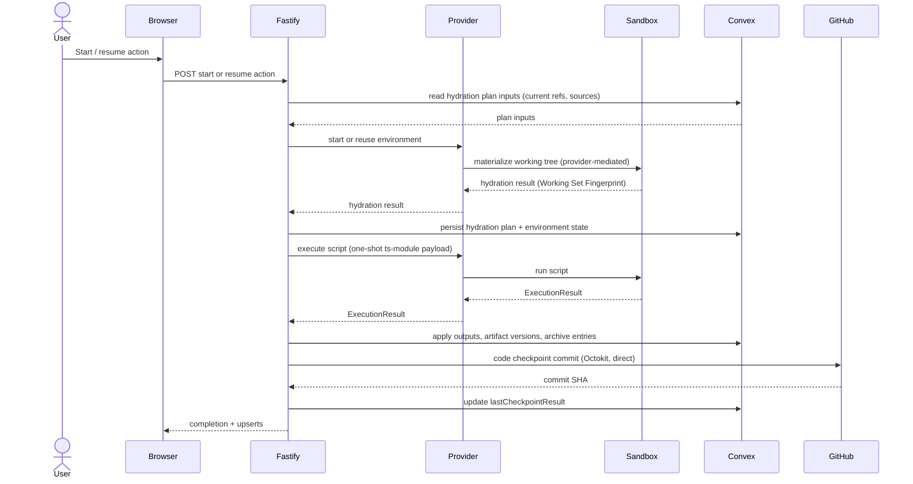

# Process Runtime and Environments

Every interaction with the sandbox is a one-shot TypeScript module execution that returns a structured [ExecutionResult](../conventions/glossary.md), and every [Environment](../conventions/glossary.md) is disposable and reconstructible from canonical stores. Two [Provider](../conventions/glossary.md) adapters — Local and Daytona — implement a shared adapter contract; durable lifecycle for each environment lives in `processEnvironmentStates`. Tool Runtime — the in-environment script executor and its result-file boundary — folds into this same domain because the executor only reaches canonical state by way of the platform interpreting the result it returns. The [Fastify Control Plane](../conventions/glossary.md) owns hydration planning, script dispatch, ExecutionResult application, and the direct Octokit code-checkpoint write; the working filesystem is never canonical and recovery is `rehydrate` or `rebuild`, not retroactive request failure.

## Architecture Recap

The platform runs as four surfaces — browser client, Fastify control plane, sandbox runtime, and Convex durable state plus GitHub canonical code — with Fastify mediating every cross-surface call. The working filesystem inside an environment is provider-resident and ephemeral; nothing persists there that cannot be reconstructed from artifact versions, source attachments, and process state. The platform stays in control of every transition between sandbox and durable state: the orchestrator builds the hydration plan, dispatches the one-shot script, and decomposes the returned ExecutionResult into Convex writes and Octokit commits.

## Durable Environment State

Environment lifecycle authority is a separate durable surface from the process row itself. Process lifecycle (`draft`, `running`, `waiting`, `completed`, `interrupted`) lives on `processes`; environment lifecycle lives on `processEnvironmentStates`, with one row per process. The companion flag `processes.hasEnvironment` is derived from the environment row and maintained on every mutation of environment state — it is a compatibility projection, not an independent source of truth.

Environment state is durable and observable on the [Process Work Surface](../conventions/glossary.md), but the working filesystem the state describes is not durable. Pending recovery operations are carried as operation status on the row (timestamps, `blockedReason`) rather than as additional state values.

The visible environment-state values, sourced from `convex/processEnvironmentStates.ts`:

| State | Meaning |
|-|-|
| `absent` | No working environment exists; `hasEnvironment` is `false`. |
| `preparing` | Environment is being created and initially hydrated. |
| `rehydrating` | Existing environment is being re-materialized from canonical inputs without a teardown. |
| `ready` | Working tree exists, hydration plan is current, and the next `start` or `resume` can dispatch directly. |
| `running` | One-shot script execution is in flight inside the working tree. |
| `checkpointing` | Artifact and/or code checkpoint persistence is in flight after a successful execution. |
| `stale` | Working set fingerprint has diverged from the current canonical fingerprint; the environment is read-projected as stale until a mutation reconciles. |
| `failed` | A hydration, execution, or checkpoint step failed; the environment exists but is not ready for new work without `rehydrate` or `rebuild`. |
| `lost` | The provider can no longer reach the previously created environment (sandbox not found, ref missing). |
| `rebuilding` | Existing environment is being torn down and recreated against a fresh hydration plan. |
| `unavailable` | The provider itself is not currently usable (auth, connection, or timeout failure). |

`absent` and `lost` are the two states where no working environment exists. Every other state implies the row's `environmentId` references a working sandbox or workspace handle. The `stale` projection is read-time: when the stored state is `ready` and the stored `workingSetFingerprint` differs from the recomputed fingerprint, summary reads project `stale` without rewriting durable state. The next mutation that touches the environment row reconciles the fingerprint and the projection becomes consistent.

The row also carries `lastHydratedAt`, `lastCheckpointAt`, `lastCheckpointResult` (latest only — kind, outcome, target ref, failure reason), `workingSetPlan` (the persisted hydration plan), `workingSetFingerprint`, and `blockedReason` (the user-readable explanation when the environment cannot accept work).

## Provider Adapters

A Provider materializes and operates an environment. Every Provider implements the same `ProviderAdapter` contract — `ensureEnvironment`, `hydrateEnvironment`, `executeScript`, `rehydrateEnvironment`, `rebuildEnvironment`, `teardownEnvironment`, and `resolveCandidateContents` — so the orchestrator does not branch on provider kind. The contract lives in `apps/platform/server/services/processes/environment/provider-adapter.ts` and the persisted `providerKind` (one of `local` or `daytona`) is authoritative once an environment row exists.

### Provider Adapter Registry

The registry is the only place Provider adapters are looked up. `DefaultProviderAdapterRegistry` in `apps/platform/server/services/processes/environment/provider-adapter-registry.ts` is constructed with the available adapters keyed by `providerKind` and resolves an adapter from a `ProviderKind` value. Resolving an unknown kind throws `PROVIDER_KIND_NOT_REGISTERED` so callers surface a 503 on the Fastify boundary. Services that need a Provider (the orchestrator, the script-execution service, the source-refresh service) take the registry as a constructor dependency rather than holding a direct adapter reference.

### Local Provider

`LocalProviderAdapter` in `local-provider-adapter.ts` runs the working tree on the host filesystem and shells out to `node --experimental-strip-types` for script execution. `ensureEnvironment` creates a directory under a configurable workspace root (default `os.tmpdir()/liminal-build-sandboxes`) and registers the environment id. Hydration writes artifact bytes from `PlatformStore.getArtifactContent` into `<workingTree>/artifacts/` and runs `git clone --depth 1` for each attached source into `<workingTree>/sources/<sanitized>`. Script execution writes the payload into `_liminal_exec.ts`, removes any stale `_liminal_exec_result.json`, runs `node --experimental-strip-types` against the script in the working tree, and reads the result file back. The Local provider is in-process — there is no separate `@liminal-local-provider` package — and `LocalProviderRuntime` is overridable so unit tests can stub the `git` and `node` shell-outs.

The Local adapter validates ExecutionResult shape and checkpoint candidate paths after a successful run: declared `contentsRef` and `workspaceRef` paths must resolve inside the working tree, must not use scheme prefixes (`mem://`, `git://`), and must point at existing files. A failure on any of those checks converts to a `failed` ExecutionResult with a finalized `process_event` history item rather than silently producing an invalid checkpoint.

### Daytona Provider

`DaytonaProviderAdapter` in `daytona-provider-adapter.ts` provisions a managed cloud sandbox via `@daytonaio/sdk`. `ensureEnvironment` calls `Daytona.create({ language: 'typescript' })` and resolves the sandbox's user home as the workspace root. Hydration uploads artifact bytes through `sandbox.fs.uploadFile` and runs `sandbox.git.clone` for each attached source, threading the `GITHUB_TOKEN` through the git auth args when the URL is a GitHub repo. Script execution uploads the payload to `workspace/_liminal_exec.ts`, runs `node --experimental-strip-types _liminal_exec.ts` via `sandbox.process.executeCommand`, and downloads `workspace/_liminal_exec_result.json` for parsing.

The `@daytonaio/sdk` runs in Fastify, not the sandbox; the SDK is the transport into the managed sandbox. Provider failures map to environment states through `ProviderLifecycleError`: `DaytonaAuthenticationError`, `DaytonaAuthorizationError`, `DaytonaConnectionError`, and `DaytonaTimeoutError` map to `unavailable`; `DaytonaNotFoundError` maps to `lost`; other `DaytonaError` instances map to `failed`. Sandbox env-var passthrough is currently unfiltered — see [Patterns and Conventions](#patterns-and-conventions) and [Known Hardening](../current-technical-architecture/known-hardening-and-deferrals.md).

### Cloudflare Provider (Deferred)

The provider abstraction is shaped for a third managed provider beyond Local and Daytona, and Cloudflare Sandbox is named in the architecture as a candidate. End-to-end validation against a hosted Cloudflare provider has not been exercised and is held until provider research closes — see [Known Hardening and Deferrals](../current-technical-architecture/known-hardening-and-deferrals.md). The registry would resolve a third `ProviderKind` value the same way it resolves the existing two.

## Hydration

[Hydration](../conventions/glossary.md) is the process-scoped materialization of a working set into the environment's filesystem. The hydration planner reads the process's current artifact references, current outputs, and active source attachments and produces a `HydrationPlan` with three input arrays — `artifactInputs`, `outputInputs`, `sourceInputs` — plus a deterministic `fingerprint`. The provider materializes the plan inside the working tree: artifact bytes flow from Convex File Storage into `artifacts/`, sources are cloned into `sources/<sanitized>`, and the planner enforces that hydration is process-scoped rather than whole-project.

`planHydrationWorkingSet` in `hydration-planner.ts` derives the `WorkingSetPlan` (artifact ids, source attachment ids, output ids) from `CurrentProcessMaterialRefs` and current output ids; `setProcessHydrationPlan` in `convex/processEnvironmentStates.ts` persists the plan and recomputes `workingSetFingerprint` after every write. The hydration plan inputs additionally carry display names, version labels, repository URLs, target refs, and `accessMode` so the provider has everything it needs without round-tripping through Convex during materialization.

Source materialization is provider-mediated. Octokit metadata reads (resolving `repositoryFullName`, ref existence, branch head) happen directly in Fastify; the working-copy clone happens inside the sandbox via the provider's `git` surface (Daytona) or a direct `git clone` shelled from the Local adapter. Fastify never streams source bytes to GitHub itself for hydration — that work stays inside the sandbox, which keeps the working filesystem provider-resident.

The [Working Set Fingerprint](../conventions/glossary.md) is the environment-scoped staleness signal. `computeWorkingSetFingerprint` builds canonical, sort-stable JSON over the persisted plan plus current artifact version labels, output revision labels, source target refs and hydration states, and the `providerKind`, then takes the lowercase SHA-256 hex digest. When the stored fingerprint diverges from the current canonical fingerprint, summary reads project `stale`; the platform may rehydrate (re-materialize against the same environment) or rebuild (tear down and recreate) in response.

## Controlled Execution

Controlled execution is the platform's runtime spine. A user action triggers an execute; Fastify resolves a hydration plan, ensures an environment exists through the configured Provider, asks the Provider to materialize the working filesystem, sends a single TypeScript module into the in-sandbox executor, and applies the returned ExecutionResult — process history, outputs, side work, artifact and code [Checkpoint](../conventions/glossary.md) candidates, source usage records, and archive entries — back to canonical stores before publishing live updates.

Hydration is provider-mediated — the working filesystem lives outside Fastify and only the provider writes into it. Provider adapters running inside the Fastify process do read artifact bytes from Convex File Storage before writing them into the working tree, and source clones happen via `git clone` inside the working tree rather than through Fastify byte-streaming, so source content never transits the Fastify process. Script execution is one-shot — the in-sandbox executor receives one ts-module payload, runs it, writes one result file, and exits. The platform interprets ExecutionResult into Convex writes and Octokit code commits, with the code-checkpoint commit the only direct Fastify-to-GitHub edge in this flow. Recovery uses `rehydrate` or `rebuild` rather than retroactively failing the original HTTP request: a hydration or execution failure transitions the environment row to `failed` or `lost` and is surfaced through the next `environment` upsert. The [Key Runtime Flows: Controlled Execution Cycle](../current-technical-architecture/key-runtime-flows.md) page is the canonical architecture-level reference for this same flow at a coarser grain.

## ExecutionResult Application

The Fastify boundary parses the structured result the script wrote to `_liminal_exec_result.json`, validates the top-level shape, and decomposes the result into discrete Convex writes and Octokit commits. Each result section maps to a specific durable concern; the orchestrator applies them in dependency order (history first, then outputs, side work, archive entries, then checkpoint persistence) so partial failure on one section does not corrupt the others.

| ExecutionResult Section | Applied To | Service |
|-|-|-|
| `processHistoryItems` | `processHistoryItems` row appends (visible work-surface history) | `ProcessEnvironmentService.applyExecutionResultSideEffects` writing through `PlatformStore.appendProcessHistoryItem` |
| `outputWrites` | `processOutputs` upsert/replace (current materials view) | `PlatformStore.replaceCurrentProcessOutputs` |
| `sideWorkWrites` | `processSideWorkItems` upsert/replace (side-work summary) | `PlatformStore.replaceCurrentProcessSideWorkItems` |
| `artifactCheckpointCandidates` | `artifactVersions` appends pinned to project-scoped `artifacts` | `CheckpointPlanner.planFor` then `PlatformStore.persistCheckpointArtifacts` |
| `codeCheckpointCandidates` | Direct GitHub commits to writable source target refs | `CheckpointPlanner.planFor` then `OctokitCodeCheckpointWriter.writeFor` |
| `usedSourceAttachmentIds` | `sourceProvenance` row appends, recorded only when work was source-informed or a code update was committed | `SourceProvenanceService.recordInformedWorkForCurrentSources` and `recordReceivedCodeUpdates` |
| `archiveEntries` | `archiveEntries` appends keyed by `processId + finalizationKey` | `ArchiveFinalizationService.appendFinalizedEntry` (with deferred binding for entries that reference checkpoint outputs) |

`processHistoryItems` are also forwarded to `ArchiveFinalizationService.appendFromProcessHistoryItem` so finalized history flows into canonical archive truth at the same moment it lands on the visible history. Archive entries that bind to artifact-checkpoint outputs or source-provenance records are deferred and re-emitted with their related ids after checkpoint persistence resolves.

Strict ExecutionResult schema validation is an active hardening item: the top-level shape is parsed and key arrays and nested fields are checked, but several inner payloads are still cast rather than schema-validated end to end. The expected shape is a single shared schema reused across Local, Daytona, tests, and any orchestration translator, with malformed nested data rejected at the controlled-execution boundary before it can reach checkpointing, history, source provenance, or archive paths — see [Known Hardening: Strict ExecutionResult Schema Validation](../current-technical-architecture/known-hardening-and-deferrals.md).

### ExecutionResult Wire Shape (Current State)

ExecutionResult is parsed at the controlled-execution boundary in `apps/platform/server/services/processes/environment/script-execution.service.ts` and the provider adapters that surround it; the top-level shape is validated, but per-section nested payloads are still cast rather than schema-validated. The sketch below names the current shape of each section to help a reader navigate the apply paths — it should not be treated as a frozen contract, since strict per-section schema validation is a deferred hardening item documented in [Known Hardening](../current-technical-architecture/known-hardening-and-deferrals.md).

The top-level envelope carries `processStatus` (one of `running`, `waiting`, `completed`, `failed`, `interrupted`) alongside the seven sections below. The canonical type lives next to the provider adapter contract in `apps/platform/server/services/processes/environment/provider-adapter.ts`, with the per-item shapes for history and archive entries reused from `apps/platform/shared/contracts/process-work-surface.ts` and `apps/platform/shared/contracts/archive.ts`.

| Section | Item shape (informal) | Apply path |
|-|-|-|
| `processHistoryItems` | `{ historyItemId, kind, lifecycleState, text, createdAt, relatedSideWorkId, relatedArtifactId }` — `kind` is one of `user_message`, `process_message`, `progress_update`, `attention_request`, `side_work_update`, `process_event`; the envelope is shared across kinds rather than varying per kind. | `PlatformStore.appendProcessHistoryItem` via `ProcessEnvironmentService.applyExecutionResultSideEffects`, then forwarded to `ArchiveFinalizationService.appendFromProcessHistoryItem`. |
| `outputWrites` | `{ outputId?, displayName, revisionLabel, linkedArtifactId, state, updatedAt? }` — replaces the current outputs view atomically. See [Process Domain](./process-domain.md) for output state semantics. | `PlatformStore.replaceCurrentProcessOutputs`. |
| `sideWorkWrites` | `{ sideWorkId?, displayLabel, purposeSummary, status, resultSummary, updatedAt? }` — `status` is one of `running`, `completed`, `failed`. | `PlatformStore.replaceCurrentProcessSideWorkItems`. |
| `artifactCheckpointCandidates` | `{ artifactId?, displayName, revisionLabel, contentsRef }` — `contentsRef` is a working-tree-relative path the provider resolves to bytes for the producing process. See [Artifacts and Versions](./artifacts-and-versions.md). | `CheckpointPlanner.planFor` then `PlatformStore.persistCheckpointArtifacts`. |
| `codeCheckpointCandidates` | `{ sourceAttachmentId, displayName, targetRef, accessMode, workspaceRef, filePath, commitMessage }` — `workspaceRef` is the working-tree path; `filePath` is the GitHub repo-relative path. | `CheckpointPlanner.planFor` (excludes non-`read_write` candidates as `skippedReadOnly`) then `OctokitCodeCheckpointWriter.writeFor`. |
| `usedSourceAttachmentIds` | `string[]` — flat list of attachment ids the script touched. See [Source Management Domain](./source-management-domain.md). | `SourceProvenanceService.recordInformedWorkForCurrentSources` and `recordReceivedCodeUpdates`, recorded only when work was source-informed or a code update was committed. |
| `archiveEntries` | `{ entryKind, finalizationKey, sourceObjectId, bodyText, bodyData, bodyFormat, relatedArtifactVersionId?, relatedSourceProvenanceId?, relatedToolCallId?, entryStatus?, degradationReason?, recordedAt?, artifactCheckpointIndex?, sourceProvenanceBinding? }` — `entryKind` is one of `user_message`, `model_message`, `reasoning`, `script_emission`, `tool_call`, `tool_result`, `process_event`; entries that reference checkpoint outputs or source-provenance records are deferred and rebound after checkpoint persistence. See [Archive and Derived Views](./archive-and-derived-views.md). | `ArchiveFinalizationService.appendFinalizedEntry`, with deferred rebinding through `reconcileDeferredArchiveEntries`. |

The history-item envelope is uniform across kinds — variants differ only in which kind discriminator is set and how `text` is interpreted downstream — so the sketch names the shared envelope rather than enumerating per-kind variants. Archive entries carry the richer per-section optional fields because they are the section that most directly crosses into deferred-binding territory.

## Code Checkpoint

`OctokitCodeCheckpointWriter` in `code-checkpoint-writer.ts` is the canonical code-write boundary. The orchestrator hands one code checkpoint candidate at a time; the writer commits the file content directly to the attached writable target ref of the source attachment's GitHub repository — no branch invention, no PR workflow. The writer parses `repositoryUrl` into `owner/repo`, reads the existing file SHA via `repos.getContent` when present, and calls `repos.createOrUpdateFileContents` with the existing SHA threaded through to keep update semantics correct.

If the target ref is missing, the repository URL does not match the expected `https://github.com/<owner>/<repo>` shape, or GitHub rejects the write (401, 403, 404, 409, 422), the writer returns `outcome: 'failed'` with a meaningful `failureReason` so the planner records a blocked checkpoint result rather than the orchestrator inventing alternatives. `CheckpointPlanner` excludes any candidate whose source [Access Mode](../conventions/glossary.md) is not `read_write` from the code-target list and emits it as a `skippedReadOnly` entry, which keeps read-only sources fail-closed at planning time. The writer's authentication uses `GITHUB_TOKEN`; constructing it without a token throws so production paths fail loud rather than silently falling back to the stub writer.

## Recovery

Recovery is split between rehydrate and rebuild, distinguished by whether the existing environment can be reused. `rehydrate` re-materializes the working tree against the same `environmentId`, refreshing artifacts, outputs, and source clones from canonical inputs; the Daytona path additionally calls `sandbox.start` or `sandbox.recover` first when the underlying sandbox state is not currently `started`. `rebuild` calls `teardownEnvironment` against the previous environment id (when present), creates a fresh environment via `ensureEnvironment`, and runs hydration against the new id. Both paths re-emit the working set fingerprint from the persisted hydration plan and write a process-event history entry on the visible work surface.

Already-known preflight blockers (no current artifact references, no provider configured, process in a non-recoverable lifecycle state) reject the action immediately as an HTTP error. Later provider, hydration, execution, or checkpoint failures become environment-state transitions — `failed`, `lost`, or `unavailable` — rather than retroactive HTTP request errors. The working set fingerprint is the staleness signal that triggers a rehydrate suggestion: when the stored fingerprint diverges from the current canonical fingerprint and the environment would otherwise read as `ready`, summaries project `stale` and the work surface invites the user to rehydrate.

## Tool Runtime

Tool Runtime is the in-sandbox executor and the structured-result boundary it returns across. The current shape is an initial script-and-result-file boundary: the executor receives a one-shot ts-module payload (`format: 'ts-module-source'`, `entrypoint: 'default'`, `source: string`), runs it against a process-scoped tool API materialized into the working tree, and writes a single ExecutionResult JSON document into `_liminal_exec_result.json`. Filesystem access (artifacts, sources, scratch space) is the only side channel available inside the sandbox; an explicit credential allowlist for the sandbox env is hardening-pending — see [Patterns and Conventions](#patterns-and-conventions).

`ScriptExecutionService` packages the payload — currently `buildIntegratedWorkspaceExecutionPayload` produces a process-type-aware default script that summarizes hydrated artifacts and stages a writable source note when one is present — and dispatches it through the provider registry's resolved adapter. The default payload writes an artifact summary, optionally writes a source-side note when a writable source is attached, and returns a structured result with `outputWrites`, `sideWorkWrites`, `artifactCheckpointCandidates`, `codeCheckpointCandidates`, and `usedSourceAttachmentIds`. Richer process-specific capability manifests, an `lspec-core` orchestration envelope above ExecutionResult, and a typed tool API beyond filesystem access remain future work; see [Top-Tier Domains: Tool Runtime](../current-technical-architecture/top-tier-domains.md) and [Known Hardening: lspec-core orchestration envelope](../current-technical-architecture/known-hardening-and-deferrals.md).

## Patterns and Conventions

Domain-specific conventions that apply across the runtime spine:

- One-shot script execution is the runtime stance: no warm daemons, no persistent shells, no long-lived REPL inside the sandbox.
- The Provider adapter registry is the only place adapters are looked up; services that need a Provider take the registry as a dependency, not a specific adapter.
- Hydration plans are computed in Fastify; materialization is provider-mediated, with the provider as the only surface that writes into the working tree.
- Octokit is direct in Fastify only for code-checkpoint writes and source-management metadata reads (`repositoryFullName` resolution, ref existence, branch head); full clones and fetches always go through the provider.
- Recovery transitions environment state to `failed`, `lost`, or `unavailable` rather than retroactively failing the original HTTP request.
- Working filesystem is working state only; never canonical. Anything that needs to survive a rebuild lives in `artifactVersions`, `sourceProvenance`, or GitHub.
- `read_only` sources are excluded at checkpoint planning time, not at write time.
- `processes.hasEnvironment` is derived from the environment row's `state`, not independently maintained.
- The sandbox env-var allowlist is hardening-pending: the script-execution path currently inherits a broad parent-process environment rather than enforcing an explicit allowlist. The expected shape is a minimal, named-only env passthrough so generated process code cannot read app secrets from `process.env`. See [Known Hardening](../current-technical-architecture/known-hardening-and-deferrals.md).

## Likely Code Areas

The runtime spine concentrates under one services subtree, with durable lifecycle and shared contracts adjacent.

| Concern | Path |
|-|-|
| Provider adapter contract | `apps/platform/server/services/processes/environment/provider-adapter.ts` |
| Provider adapter registry | `apps/platform/server/services/processes/environment/provider-adapter-registry.ts` |
| Local provider | `apps/platform/server/services/processes/environment/local-provider-adapter.ts` |
| Daytona provider | `apps/platform/server/services/processes/environment/daytona-provider-adapter.ts` |
| Hydration planner | `apps/platform/server/services/processes/environment/hydration-planner.ts` |
| Checkpoint planner | `apps/platform/server/services/processes/environment/checkpoint-planner.ts` |
| Checkpoint contract types | `apps/platform/server/services/processes/environment/checkpoint-types.ts` |
| Code checkpoint writer | `apps/platform/server/services/processes/environment/code-checkpoint-writer.ts` |
| Script execution service | `apps/platform/server/services/processes/environment/script-execution.service.ts` |
| Process environment orchestrator | `apps/platform/server/services/processes/environment/process-environment.service.ts` |
| In-environment script payload (smoke + default integrated payload) | `apps/platform/server/scripts/daytona-smoke.ts`, `script-execution.service.ts` (`buildIntegratedWorkspaceExecutionPayload`) |
| Durable environment lifecycle table | `convex/processEnvironmentStates.ts` |
| Environment and ExecutionResult contracts | `apps/platform/shared/contracts/process-work-surface.ts`, `apps/platform/shared/contracts/index.ts` |
| Tests | `tests/service/server/process-execution-orchestrator.test.ts`, `tests/service/server/process-environment-fire-and-forget.test.ts`, `tests/service/server/local-provider-adapter.test.ts`, `tests/service/server/daytona-provider-adapter.test.ts` |

## Related

- [Technical Design Overview](./overview.md)
- [Process Domain](./process-domain.md)
- [Source Management Domain](./source-management-domain.md)
- [Artifacts and Versions](./artifacts-and-versions.md)
- [Archive and Derived Views](./archive-and-derived-views.md)
- [Server Control Plane](./server-control-plane.md)
- [Shared Contracts](./shared-contracts.md)
- [Convex Durable State and Projections](./convex-durable-state-and-projections.md)
- [Cross-Cutting Decisions](../current-technical-architecture/cross-cutting-decisions.md)
- [Key Runtime Flows: Controlled Execution Cycle](../current-technical-architecture/key-runtime-flows.md)
- [Known Hardening and Deferrals](../current-technical-architecture/known-hardening-and-deferrals.md)
