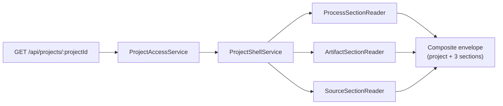

# Project Shell

A [Project](../conventions/glossary.md) is the top-level durable working container in Liminal Build: it owns processes, artifacts, package snapshots, and source attachments, and every durable row in those domains carries a `projectId` join column. Project-scoped identity is the canonical cross-domain scope across the platform — there is no second container above projects and no cross-project reference path. The [Project Shell](../conventions/glossary.md) is the front-door view of one project's processes, artifacts, and source attachments, composed by a single aggregator endpoint that returns a [Section-Envelope](../current-technical-architecture/cross-cutting-decisions.md) response so a degraded section never collapses the whole shell. This page maps the Project domain — container, membership, authz, shell aggregator, project routes — onto the services, durable tables, and contracts that implement it.

## Architecture Recap

Liminal Build distributes across four runtime surfaces — browser client, Fastify control plane, sandbox runtime, and durable stores — and Project sits at the top of the durable side, owning the container every other top-tier domain scopes into. Process, Artifact, Source, Archive, and Package work all carry `projectId`, so the Project surface is the entry point for any work the platform is asked to do.

## Durable State

Project-domain truth lives in two Convex domain files. Both are project-scoped only — neither table carries cross-project foreign keys.

| Table | Owns | File |
|-|-|-|
| `projects` | Project identity row: `ownerUserId`, `name`, `lastUpdatedAt`, `createdAt`, `updatedAt` | `convex/projects.ts` |
| `projectMembers` | Membership records joining `projectId` and `userId` with a role of `owner` or `member` | `convex/projectMembers.ts` |

`convex/projects.ts` exposes `listAccessibleProjectSummaries`, `getProjectAccess`, and `createProject`. The first two queries fold owned projects and membership rows into the same project-summary shape — durable identity fields `projectId`, `name`, and `lastUpdatedAt` alongside the computed `processCount`, `artifactCount`, `sourceAttachmentCount`, `ownerDisplayName`, and `role` — so the index and shell read paths share one summary projection. The `createProject` mutation atomically inserts the `projects` row plus an owner `projectMembers` row, with a `name_conflict` early return when the actor already owns a project of the same name. Cross-project name collisions are not enforced; uniqueness is per-owner.

## Project Shell Aggregator

The aggregator is the single durable read that powers the project home view. The browser fetches it on every shell route load; everything else on the shell page renders from this one response.

`GET /api/projects/:projectId` returns a composite payload composed from independent per-section reads: project header (identity and role), `processes` envelope, `artifacts` envelope, and `sourceAttachments` envelope. Each envelope carries its own `status` of `ready`, `empty`, or `error`, with section-scoped error codes (`PROJECT_SHELL_PROCESSES_LOAD_FAILED`, `PROJECT_SHELL_ARTIFACTS_LOAD_FAILED`, `PROJECT_SHELL_SOURCES_LOAD_FAILED`) when one reader degrades. The composite response itself is `200` whenever the project header read succeeds; section errors do not fail the request. This is the canonical [Section-Envelope Graceful Degradation](../current-technical-architecture/cross-cutting-decisions.md) shape — request-level failures stay reserved for actual request-level problems such as auth, project access, or invalid parameters.

`ProjectAccessService` resolves access first and returns the canonical project header. `ProjectShellService` then fans out to three section readers in parallel through `Promise.all`, and a per-reader try/catch converts a thrown reader failure into an `error`-status envelope rather than rejecting the composite. The three readers live alongside the orchestrator under `apps/platform/server/services/projects/readers/`, with summary builders that reshape Convex rows into browser-facing shapes living under `apps/platform/server/services/projects/summary/`. Item ordering is `updatedAt` descending in each section. The named section-envelope error codes are catalogued under [Error Codes](../conventions/error-codes.md).

## Authz and Membership

Project authz is app-owned. WorkOS establishes the authenticated identity through the [Server Control Plane](./server-control-plane.md) auth pipeline; project access is enforced from `projectMembers` and from the `ownerUserId` field on the `projects` row. Inside `getProjectAccess`, the owner row short-circuits to `accessible`; non-owners must have a `projectMembers` row matching `(projectId, userId)`.

Project-scoped routes verify access before delegating to a service. The flow is consistent across every project route: the request arrives with an authenticated actor, the route calls `ProjectAccessService.getProjectAccess` (or `assertProjectAccess` for action routes), and the service returns one of `accessible`, `forbidden`, or `not_found`. The route then either returns the relevant project-scoped error envelope or hands off to the domain service. The catalogued [error codes](../conventions/error-codes.md) for this layer are `UNAUTHENTICATED` (`401`), `PROJECT_FORBIDDEN` (`403`), and `PROJECT_NOT_FOUND` (`404`); process-scoped derivatives such as `PROCESS_FORBIDDEN` and `PROCESS_NOT_FOUND` follow the same shape on process routes that nest under a project. Membership editing — invitation, role change, removal — is not exposed on this surface; only the implicit owner-membership row created during project creation lives here today.

## Routes and Services

Project routes live in `apps/platform/server/routes/projects.ts` and delegate into per-concern services. Schemas are Zod-authored under `apps/platform/server/schemas/projects.ts` and shared with the client through `apps/platform/shared/contracts/`.

| Route | Method | Service |
|-|-|-|
| `/` | `GET` | Redirects to `/projects` (no service) |
| `/projects` | `GET` | Returns the authenticated shell HTML; pre-renders no project data |
| `/projects/:projectId` | `GET` | `ProjectAccessService` gates; returns shell HTML or an unavailable static page |
| `/api/projects` | `GET` | `ProjectIndexService` |
| `/api/projects` | `POST` | `ProjectCreateService` |
| `/api/projects/:projectId` | `GET` | `ProjectAccessService` + `ProjectShellService` |
| `/api/projects/:projectId/processes` | `POST` | `ProjectAccessService` + `ProcessRegistrationService` |

`ProjectIndexService` lists accessible projects and orders them by `lastUpdatedAt` descending. `ProjectCreateService` validates a trimmed non-empty name and surfaces `INVALID_PROJECT_NAME` (`422`) or `PROJECT_NAME_CONFLICT` (`409`) on rejection, returning a freshly constructed shell envelope on success so the client can pivot directly into the new project. `ProcessRegistrationService` accepts only the registered first-party [ProcessType](../conventions/glossary.md) values (`ProductDefinition`, `FeatureSpecification`, `FeatureImplementation`), assigns a deterministic project-local label through `ProcessDisplayLabelService`, and the platform store seeds the matching per-type state row alongside the generic `processes` row. Process-creation failures surface as `INVALID_PROCESS_TYPE` (`422`), with the access errors above propagating from the gate. The route module also handles `UNAUTHENTICATED` redirects, CSRF token issuance for the shell HTML, and clearing the session cookie on `invalid_session`.

## Project and Adjacent Domains

Project is the join column for every adjacent domain. The relationships are one-to-many in every case, and no domain introduces a parallel container above project.

- **Processes** — Every Process belongs to exactly one Project; project access gates every process route. See [Process Domain](./process-domain.md).
- **Artifacts** — Every Artifact carries `projectId` and is project-scoped; producing-process provenance lives on the version row, not on the artifact. See [Artifacts and Versions](./artifacts-and-versions.md).
- **Sources** — Source attachments may be project-scoped or process-scoped; the process-scoped attachment shadows the project-scoped one for that process's current-source view, and uniqueness keys off `repositoryFullName` within the project. See [Source Management Domain](./source-management-domain.md).
- **Packages** — Package snapshots are project-scoped, and members may pin versions across producing processes within one project. See [Review, Package, and Export](./review-package-and-export.md).

## Patterns and Conventions

A handful of project-domain conventions are worth holding onto when designing new work that nests into the project shell.

- Project-scoped identity is the canonical cross-domain scope; new tables join through `projectId` and do not introduce cross-project references.
- Aggregator routes return [Section-Envelope](../current-technical-architecture/cross-cutting-decisions.md) responses; per-section failures degrade locally and do not collapse the request.
- Project authz lives at the route layer through `ProjectAccessService`; service-level checks remain available for cross-project boundary violations on action paths.
- New domains attach to projects as project-scoped tables rather than introducing a parallel scope concept; process-scoped attachments shadow project-scoped attachments only where the Source Management Domain established that rule for a process's current-source view.
- Selected-process focus is route state, not durable shell state; stale `processId` query values heal client-side without failing the bootstrap.
- Process labels are deterministic and project-local (`Product Definition #N`, `Feature Specification #N`, `Feature Implementation #N`); manual naming UX has been deferred.

## Likely Code Areas

The Project domain spans three trees in `apps/platform/` plus the two Convex domain files.

| Concern | Path |
|-|-|
| Project services and section readers | `apps/platform/server/services/projects/` |
| Project routes | `apps/platform/server/routes/projects.ts` |
| Project route schemas | `apps/platform/server/schemas/projects.ts` |
| Project-related shared contracts | `apps/platform/shared/contracts/schemas.ts`, `state.ts` |
| Convex project tables and queries | `convex/projects.ts`, `convex/projectMembers.ts` |
| Client project surfaces | `apps/platform/client/features/projects/` |
| Project route and shell tests | `tests/service/server/projects-api.test.ts`, `tests/service/server/project-create-api.test.ts`, `tests/service/server/project-shell-bootstrap-api.test.ts` |

## Related

- [Technical Design Overview](./overview.md)
- [Process Domain](./process-domain.md)
- [Artifacts and Versions](./artifacts-and-versions.md)
- [Source Management Domain](./source-management-domain.md)
- [Review, Package, and Export](./review-package-and-export.md)
- [Server Control Plane](./server-control-plane.md)
- [Convex Durable State and Projections](./convex-durable-state-and-projections.md)
- [Cross-Cutting Decisions: Section-Envelope](../current-technical-architecture/cross-cutting-decisions.md)
- [Top-Tier Domains: Projects](../current-technical-architecture/top-tier-domains.md)
