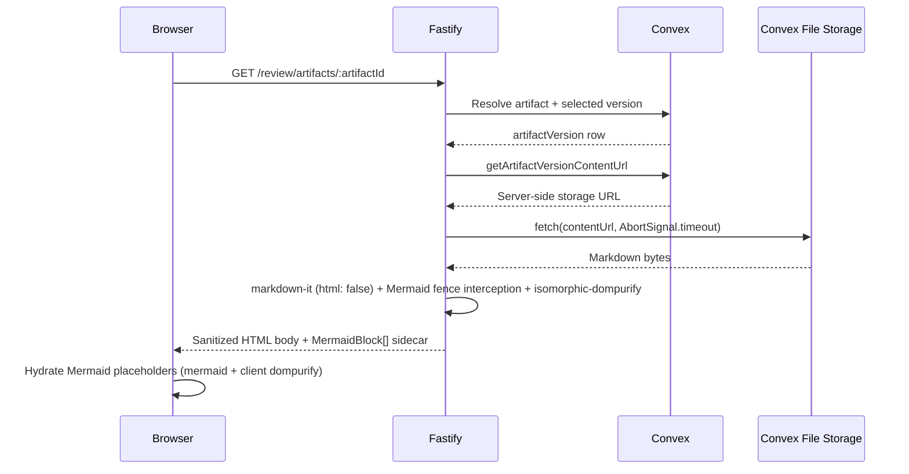
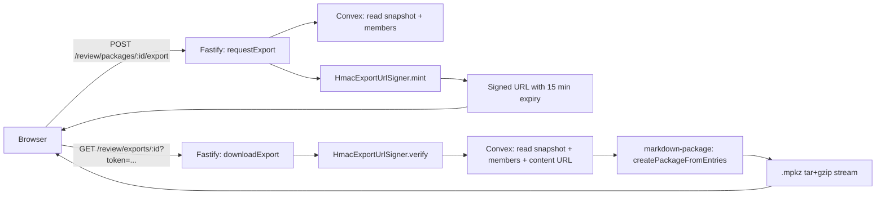

# Review, Package, and Export

The [Review Workspace](../conventions/glossary.md) is the process-aware reader for project artifacts and packages. Eligibility for a target is computed from the publishing process's current artifact refs and its mutable [Process Package Context](../conventions/glossary.md), never from artifact-row ownership or producing-process shortcuts. Publication produces an immutable [Package Snapshot](../conventions/glossary.md) row with ordered [Package Members](../conventions/glossary.md) that pin exact `artifactVersionId` values, so a snapshot's contents are stable even when the underlying artifacts gain later versions. The `.mpkz` export uses a two-phase signed-URL flow: an HMAC-signed download URL is minted on request, and the second-phase GET streams a tar+gzip archive assembled by the `@liminal-build/markdown-package` workspace package.

## Architecture Recap

The platform runs on four surfaces — browser client, [Fastify Control Plane](../conventions/glossary.md), sandbox runtime, and [Convex](../conventions/glossary.md) durable state. Review and Export live entirely on Fastify, the browser, and Convex: no sandbox is involved, because review reads durable artifact versions and packages rather than environment state. Convex File Storage holds artifact bytes, but storage URLs are public capabilities; Fastify fetches content server-side, renders it, and returns sanitized HTML, so raw URLs never reach the browser. Signed `.mpkz` download URLs follow the same proxy posture — the second-phase GET goes through Fastify, which verifies the HMAC and streams the archive.

## Durable State

Four Convex tables back the surface: two for immutable publication and two for the mutable per-process building context. The split is load-bearing — snapshots cannot drift after publication, and contexts can be replaced atomically while a process is still gathering pinned versions.

| Table | Owns | File |
|-|-|-|
| `packageSnapshots` | Immutable durable record of one published version set: `processId`, `displayName`, `packageType`, `publishedAt` | `convex/packageSnapshots.ts` |
| `packageSnapshotMembers` | Ordered members pinning exact `artifactVersionId`: `packageSnapshotId`, `position`, `artifactId`, `artifactVersionId`, `displayName`, `versionLabel` | `convex/packageSnapshotMembers.ts` |
| `processPackageContexts` | Mutable per-process building context: `processId`, `displayName`, `packageType`, `basePackageSnapshotId`, `updatedAt` | `convex/processPackageContexts.ts` |
| `processPackageContextMembers` | Ordered context members: `packageContextId`, `position`, `artifactId`, `artifactVersionId`, `displayName`, `versionLabel`, `pinnedAt` | `convex/processPackageContextMembers.ts` |

Snapshots and their members are append-only — `publishPackageSnapshot` validates same-project membership and the allowed-version set, then inserts the rows; no mutation or delete API exists. Contexts are replaced atomically: `upsertCurrentProcessPackageContext` patches the canonical context row, deletes its prior members, deletes any duplicate contexts for the same process, and inserts the new ordered members in one mutation. Mixed-producer members are valid in both contexts and snapshots when every member belongs to the same project as the publishing process.

## Review Context Service

The Review Workspace cannot read every project artifact; it can only read what the current process is working with or has explicitly pinned. The `DefaultReviewContextService` (under `apps/platform/server/services/review/review-context.service.ts`) computes that eligible set on each read.

Eligibility is computed, not stored. `DefaultReviewContextService` reads the process's current material refs (`getCurrentProcessMaterialRefs`) and the members of its current `processPackageContext` (`listProcessPackageContextMembers`), takes the union of artifact identities, and resolves the latest version for each. The resulting `ReviewTargetSummary` list is the entire input to the workspace's `availableTargets`. The same union — current refs plus pinned context members — also drives `canReviewArtifact`, so direct artifact endpoints reject anything outside that set with `REVIEW_TARGET_NOT_FOUND` rather than leaking unrelated project artifacts. Producing-process information is preserved on `artifactVersions.createdByProcessId` and surfaced as `producedByProcessId` in review contracts, but it is provenance, not eligibility. There is no stored eligibility table and no design page should introduce one.

For the platform-wide rule this service implements, see [Cross-Cutting Decisions: Review Eligibility From Process Refs and Pinned Context](../current-technical-architecture/cross-cutting-decisions.md).

## Render Pipeline

Markdown rendering is server-owned. Fastify fetches the artifact version's bytes from Convex File Storage using a server-side URL, renders to HTML, and returns sanitized HTML plus a Mermaid sidecar — the browser never receives a storage URL or raw markdown source.

The pipeline lives under `apps/platform/server/services/rendering/`:

- **Markdown parsing** — `markdown-it@14` runs with `html: false`, `linkify: true`, and `typographer: false`. Raw HTML in the source is rejected at the parser, not just stripped at sanitize time.
- **Mermaid extraction** — the renderer overrides `markdownIt.renderer.rules.fence` to intercept `mermaid` fences. Each Mermaid block is sent through `mermaid-sanitize.ts`, which strips `%%{init}%%`, `%%{config}%%`, and `%%{wrap}%%` directives from the source before it leaves the server. The block becomes a `MermaidBlock` sidecar entry; the body gets a placeholder `
` instead of inline source.
- **Code-fence handling** — non-Mermaid code fences are rendered as plain `<pre><code class="language-...">…</code></pre>` with HTML-escaped content. No syntax highlighter is wired in at runtime: `MarkdownRendererConfig` exposes Shiki-shaped configuration hooks (`shikiThemes`, `shikiLangs`, `shikiLangAliases`), but `apps/platform/package.json` does not pin a highlighter and `MarkdownRendererService.create` ignores those fields. The hook is unpinned by intent, not by oversight, so language-specific highlighting is currently a deferred capability.
- **Sanitization** — the rendered HTML runs through `isomorphic-dompurify@3.9` with the `html` profile, `FORBID_TAGS: ['style', 'math', 'form']`, `FORBID_ATTR: ['style']`, both `ALLOW_DATA_ATTR` and `ALLOW_ARIA_ATTR` set to `false`, and `ADD_ATTR: ['data-block-id']` so the Mermaid placeholder marker survives sanitization.
- **Anchor and task-list hooks** — `markdown-it-anchor.ts` and `markdown-task-lists.ts` exist as scaffold stubs from the original Story 0 setup; the live renderer does not call `markdownIt.use(...)` for either. Heading anchors and task-list rendering remain a deferred capability against this pipeline.

The Mermaid sidecar hydrates in the browser. `apps/platform/client/features/review/mermaid-runtime.ts` initializes `mermaid@11.14` with `securityLevel: 'strict'`, `flowchart.htmlLabels: false`, fresh per-render IDs, and a client-side `dompurify` sanitization pass over the produced SVG (`FORBID_TAGS: ['script', 'foreignObject']`, common event-handler attributes forbidden). `markdown-body.ts` walks the sanitized HTML, finds each placeholder, and substitutes the rendered SVG; per-diagram failures degrade only that block.

The diagram shows where the security boundaries land. Convex File Storage URLs stay inside Fastify, the parse-and-sanitize pass happens before any HTML reaches the browser, and Mermaid is the only stage that runs in the browser — and only against directive-stripped source.

## Package Publication

Publication turns a process's current package-building context into an immutable durable record. The flow is owned by `package-publication-policy.service.ts` together with `convex/packageSnapshots.ts`; the service composes the eligibility check, and the Convex mutation writes the rows atomically.

A process module asks the platform to publish: `listEligiblePackageArtifactVersionIds` builds the allowed set as the union of latest versions for current artifact refs plus every `artifactVersionId` already pinned in the current `processPackageContext`. `assertPackageMembersEligible` rejects any requested member whose version is outside that set, surfacing as `PACKAGE_MEMBER_NOT_ALLOWED`. The `publishPackageSnapshot` Convex mutation then re-validates: each `artifactVersion` exists, each version belongs to its claimed `artifactId`, each `artifact` belongs to the publishing process's project, member `position` values are non-negative integers and unique, and the allowed-version set is non-empty. After validation, one `packageSnapshots` row and one `packageSnapshotMembers` row per member are inserted with `displayName` and `versionLabel` derived server-side from the artifact and version rows. Publication does not modify member content — it pins exact `artifactVersionId` values and records the ordering. Subsequent revisions to those artifacts produce new versions but never alter the snapshot, which is why mixed-producer packages are stable across later process activity in the same project.

For how processes hold and revise the `processPackageContext` ahead of publication, see [Process Domain](./process-domain.md).

## Export and Signed URLs

`.mpkz` export is a two-phase signed-URL flow. Phase one validates exportability and mints a download URL; phase two exchanges the URL for a streamed archive. Both phases live in `apps/platform/server/services/review/export.service.ts` and `export-url-signing.ts`, behind the `/review/packages/:packageId/export` and `/review/exports/:exportId` routes.

In phase one (`requestExport`), `DefaultExportService` confirms the snapshot belongs to the requesting process, reads the ordered members, and validates that every pinned version is present and `contentKind === 'markdown'`; missing versions raise `REVIEW_EXPORT_NOT_AVAILABLE`. It then mints a fresh `exportId` (`randomUUID`) and an HMAC-signed token via `HmacExportUrlSigner` carrying `{ exportId, packageSnapshotId, actorId, expiresAt }`. The token is the base64url-encoded JSON payload concatenated with an HMAC-SHA256 signature; lifetime is 15 minutes. The response returns `downloadUrl`, `downloadName` (slugged display name plus `.mpkz`), `contentType: application/gzip`, `packageFormat: 'mpkz'`, and `expiresAt`.

In phase two (`downloadExport`), Fastify verifies the token with `HmacExportUrlSigner.verify` (timing-safe signature compare, expiry check), confirms the token's `actorId` matches the current actor and the `exportId` matches the URL, re-reads the snapshot and members, and assembles the archive. `createPackageFromEntries` from `@liminal-build/markdown-package` produces the tar+gzip stream with `_nav.md` as the manifest entry and one `<position>-<slug>.md` file per pinned member; member content is streamed from Convex File Storage through Fastify rather than buffered. The route sets `Content-Type: application/gzip`, `Content-Disposition: attachment; filename="..."`, and `Cache-Control: private, no-store, max-age=0` before piping the stream to the response.

The diagram shows why the flow is two-phase: phase one is short, authenticated, and durable enough to be retried, while phase two is the long-running stream and runs through token verification before any storage URL is touched. The signed URL is bearer-shaped but bound to the actor, the package, and a 15-minute expiry, so a leaked URL has narrow blast radius.

The archive format itself is owned by the `@liminal-build/markdown-package` workspace package (see [Conventions: Repository Layout](../conventions/repository-layout.md)). It declares `tar-stream` as its only runtime dependency (see [Core Stack and Runtime Surfaces](../current-technical-architecture/core-stack-and-runtime-surfaces.md)), exposes `createPackageFromEntries` (the export-relevant entry point) plus adjacent pack/inspect/extract helpers from `dist/index.js`, and ships the `mdvpkg` CLI binary so the same pack/unpack logic can be exercised offline against an `.mpkz` file on disk.

## Routes and Services

Review and export routes are registered in `apps/platform/server/routes/review.ts` and dispatch to the services above. Every route asserts process access through `ProcessAccessService` before reaching the review service layer.

| Route | Method | Service |
|-|-|-|
| `/projects/:projectId/processes/:processId/review` | GET | Renders the shell document; review SPA bootstraps from the workspace API |
| `/api/projects/:projectId/processes/:processId/review` | GET | `DefaultReviewWorkspaceService` (`review-workspace.service.ts`) |
| `/api/projects/:projectId/processes/:processId/review/artifacts/:artifactId` | GET | `DefaultArtifactReviewService` (`artifact-review.service.ts`) |
| `/api/projects/:projectId/processes/:processId/review/packages/:packageId` | GET | `DefaultPackageReviewService` (`package-review.service.ts`) |
| `/api/projects/:projectId/processes/:processId/review/packages/:packageId/export` | POST | `DefaultExportService.requestExport` (`export.service.ts`) |
| `/api/projects/:projectId/processes/:processId/review/exports/:exportId` | GET | `DefaultExportService.downloadExport` (`export.service.ts`) + `HmacExportUrlSigner.verify` |

Package publication does not have its own HTTP route in this surface: the `publishPackageSnapshot` Convex internal mutation is invoked from process modules through the platform store, not from the browser. This is the deliberate Epic 4 / Epic 5 posture — the substrate ships, and downstream process modules decide when to call it.

## Adjacent Domains

- **Artifacts and Versions** — packages pin exact `artifactVersionId` values and review eligibility consumes versions, but artifact identity and version provenance live one layer down (cross-link [Artifacts and Versions](./artifacts-and-versions.md)).
- **Process Domain** — processes hold the current `processPackageContext`, current artifact refs, and the work-surface review-control enablement; review surfaces are process-aware (cross-link [Process Domain](./process-domain.md)).
- **Project Shell** — packages, snapshots, and contexts are all project-scoped, and the project shell surfaces project artifact summaries derived from latest versions (cross-link [Project Shell](./project-shell.md)).
- **Convex Durable State** — the four package and context tables live alongside artifacts and process state in the Convex schema (cross-link [Convex Durable State and Projections](./convex-durable-state-and-projections.md)).

## Patterns and Conventions

The conventions below are specific to this surface and are inherited by any new design that touches review or packaging.

- Review eligibility is computed on each read from current process refs plus pinned `processPackageContext` members; there is no stored eligibility row.
- Package snapshots and their members are immutable after publication; package contexts are mutable and replaced atomically with one canonical current context per process.
- Mixed-producer members are valid in both snapshots and contexts when every member is same-project and in-context; cross-project or out-of-context members are rejected with `PACKAGE_MEMBER_NOT_ALLOWED`.
- Markdown parsing and sanitization run server-side; only Mermaid hydration runs client-side, against directive-stripped source with strict configuration.
- Convex File Storage URLs stay inside Fastify and are never returned to the browser, logged, or surfaced in errors; the same proxy posture applies to the second-phase `.mpkz` download.
- Bootstrap responses use section-envelope graceful degradation — an unavailable target renders bounded `target.status` rather than failing the whole workspace; target-specific endpoints return precise codes (`REVIEW_TARGET_NOT_FOUND`, `ARTIFACT_VERSION_NOT_FOUND`, `PACKAGE_MEMBER_UNAVAILABLE`).
- Multi-draft package contexts and model-generated archive turn summaries are deferred capabilities, not live behavior — see [Known Hardening and Deferrals](../current-technical-architecture/known-hardening-and-deferrals.md).

## Likely Code Areas

The table below maps the surface to its current code location.

| Concern | Path |
|-|-|
| Review workspace, context, and target services | `apps/platform/server/services/review/` |
| Render pipeline (markdown-it + Mermaid sidecar + isomorphic-dompurify) | `apps/platform/server/services/rendering/` |
| Package publication policy (eligibility helpers) | `apps/platform/server/services/review/package-publication-policy.service.ts` |
| Export service and HMAC URL signing | `apps/platform/server/services/review/export.service.ts`, `export-url-signing.ts` |
| Review and export routes | `apps/platform/server/routes/review.ts` |
| Convex package and context tables | `convex/packageSnapshots.ts`, `convex/packageSnapshotMembers.ts`, `convex/processPackageContexts.ts`, `convex/processPackageContextMembers.ts` |
| Markdown package archive format and CLI | `packages/markdown-package/src/` (manifest, tar, render, cli) |
| Client review feature (panels, body, Mermaid runtime, export trigger) | `apps/platform/client/features/review/` |
| Service-level tests | `tests/service/server/` for review service tests, `packages/markdown-package/tests/` for the archive package |

## Related

- [Technical Design Overview](./overview.md)
- [Process Domain](./process-domain.md)
- [Artifacts and Versions](./artifacts-and-versions.md)
- [Project Shell](./project-shell.md)
- [Source Management Domain](./source-management-domain.md)
- [Server Control Plane](./server-control-plane.md)
- [Convex Durable State and Projections](./convex-durable-state-and-projections.md)
- [Conventions: Repository Layout](../conventions/repository-layout.md)
- [Cross-Cutting Decisions](../current-technical-architecture/cross-cutting-decisions.md)
- [Key Runtime Flows: Review and Package Publication](../current-technical-architecture/key-runtime-flows.md)
- [Top-Tier Domains: Review Workspace](../current-technical-architecture/top-tier-domains.md)
