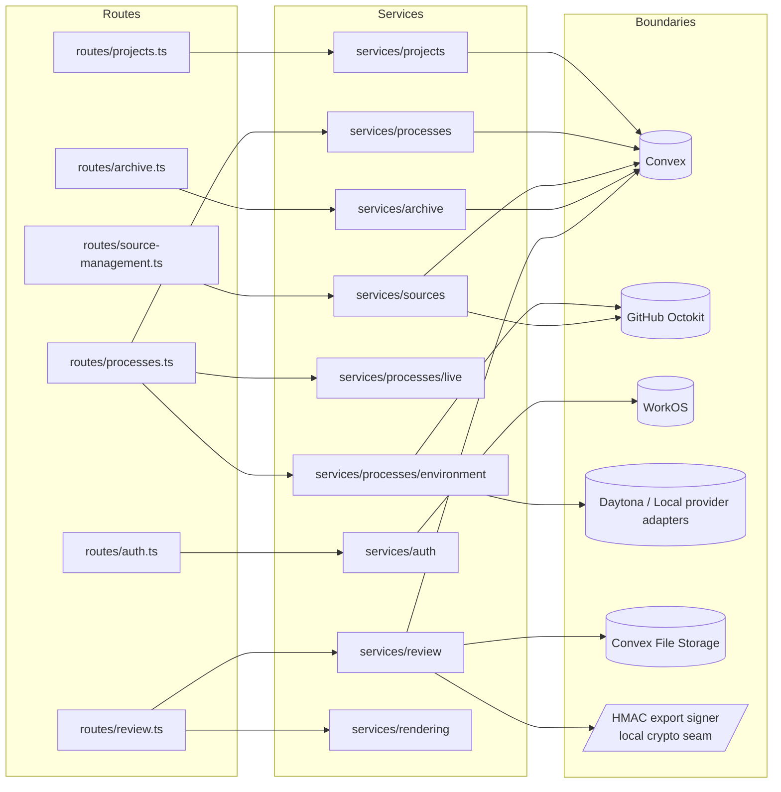

# Server Control Plane

The [Fastify Control Plane](../conventions/glossary.md) under `apps/platform/server/` mediates every cross-surface call: WorkOS auth, project and process orchestration, source hydration, environment lifecycle, archive read paths, review and export flows, and integration boundaries to Convex, GitHub, sandbox providers, and signed export storage. No browser, environment, or external integrator reads canonical state directly — every call passes through Fastify, which holds the only credentials that can speak to those external systems. This page maps the server tree to the eight platform domains and the four cross-cutting infrastructure layers covered in the [Cross-Cutting Decisions](../current-technical-architecture/cross-cutting-decisions.md) and [Key Runtime Flows](../current-technical-architecture/key-runtime-flows.md).

## Architecture Recap

The control plane is one of four surfaces — alongside the browser client, the sandbox runtime, and Convex — and routes stay thin while per-domain services constructed at boot handle the work. It is the only surface that holds Convex API keys, WorkOS credentials, GitHub tokens, Daytona keys, and the export HMAC secret. It brokers writes to Convex, plans and applies code checkpoints, dispatches script execution to provider adapters, derives composite read responses, and signs short-lived URLs for artifact and export downloads.

## Server Tree

The bootstrap entry is `server/index.ts`, which loads workspace env files and calls `createApp` in `server/app.ts`. The tree below reflects the live layout of `apps/platform/server/` two levels deep.

```text
apps/platform/server/
├── index.ts                  # process entry: load env, create app, listen
├── app.ts                    # bootstrap: createApp wires services, plugins, routes, error handler
├── config.ts                 # env loading, shell-bootstrap payload helpers
├── load-workspace-env.ts     # workspace .env loader
├── routes/
│   ├── archive.ts
│   ├── auth.ts
│   ├── processes.ts
│   ├── projects.ts
│   ├── review.ts
│   └── source-management.ts
├── schemas/
│   ├── archive.ts
│   ├── auth.ts
│   ├── common.ts
│   ├── processes.ts
│   ├── projects.ts
│   ├── review.ts
│   └── source-management.ts
├── services/
│   ├── archive/
│   ├── auth/
│   ├── processes/            # contains environment/, live/, readers/ subtrees
│   ├── projects/             # contains readers/, summary/ subtrees
│   ├── rendering/
│   ├── review/
│   └── sources/
├── plugins/
│   ├── cookies.plugin.ts
│   ├── csrf.plugin.ts
│   ├── vite.plugin.ts
│   ├── websocket.plugin.ts
│   └── workos-auth.plugin.ts
├── errors/
│   ├── app-error.ts
│   ├── codes.ts
│   └── section-error.ts
└── scripts/
    └── daytona-smoke.ts
```

The `services/` subtree groups one-to-one with platform domains; nested subdirectories under `services/processes/` (`environment/`, `live/`, `readers/`) and `services/projects/` (`readers/`, `summary/`) keep environment lifecycle, live-publication, and per-section readers separated from the top-level services that compose them.

## Bootstrap and Plugin Layering

`createApp` in `server/app.ts` builds the dependency graph in a fixed order — platform store first, then auth, projects, processes, sources and environment together (sources and provider adapters are interdependent), archive, review, and rendering services — decorating each onto the Fastify instance so route handlers can pull them off `app`. Fastify's Zod type provider is installed via `setValidatorCompiler` and `setSerializerCompiler` from `fastify-type-provider-zod` before any route registers, so every schema in `server/schemas/` is enforced at validation and serialization time.

```mermaid
flowchart TD
  bootstrap[index.ts loadServerEnv + createApp] --> compilers[setValidatorCompiler + setSerializerCompiler from fastify-type-provider-zod]
  compilers --> services[Service graph wired and decorated on app]
  services --> cookies[cookiesPlugin: signed cookie support]
  cookies --> csrf[csrfPlugin: csrf-protection token + cookie]
  csrf --> vite[vitePlugin: shell renderer + dev middleware / prod assets]
  vite --> websocket[websocketPlugin: process live hub decoration]
  websocket --> workos[workosAuthPlugin: preHandler attaches actor]
  workos --> routes[Route registrations: auth, archive, projects, processes, review, sources]
  routes --> healthcheck[/health inline route]
  healthcheck --> errorhandler[setErrorHandler: AppError to typed RequestError]
```

The diagram captures the fixed order in `createApp`: the Zod compilers install before service decoration so schemas are enforced from the first decorated route; cookie support is established before CSRF can sign tokens; CSRF arrives before any route uses `reply.generateCsrf`; the Vite plugin decorates `renderShellDocument` so HTML routes can render shell bootstrap payloads; the WebSocket plugin decorates `processLiveHub` so the process WebSocket route can subscribe; the WorkOS plugin installs the `preHandler` that resolves `request.actor` from the session cookie and syncs the actor through `AuthUserSyncService`. Plugins compose via `fastify-plugin` so their decorators are visible globally, then routes register, the inline `/health` route attaches, and `setErrorHandler` is registered last so the global handler catches any `AppError` from any preceding route and translates it to the typed response shape from `shared/contracts`.

## Routes

Route files register under `server/routes/` and attach Zod schemas from `server/schemas/`. Each handler verifies `request.actor`, performs access checks via `ProjectAccessService` or `ProcessAccessService`, calls a domain service, and translates thrown `AppError` values into typed `RequestError` responses with the catalog code as `code`.

| Route File | Methods | Path | Owns |
|-|-|-|-|
| `routes/auth.ts` | GET | `/auth/login` | Start WorkOS authorization, set signed state and returnTo cookies. |
| `routes/auth.ts` | GET | `/auth/callback` | Verify state, exchange code, seal session cookie, sync actor. |
| `routes/auth.ts` | GET | `/auth/me` | Return current actor or 401 with cleared cookie on invalid session. |
| `routes/auth.ts` | POST | `/auth/logout` | CSRF-protected logout; build WorkOS logout URL and clear cookies. |
| `routes/projects.ts` | GET | `/` | Redirect to `/projects`. |
| `routes/projects.ts` | GET | `/projects` | Render project-index shell HTML with bootstrap payload. |
| `routes/projects.ts` | GET | `/projects/:projectId` | Render project shell HTML with access enforcement. |
| `routes/projects.ts` | GET | `/api/projects` | List accessible projects for the actor. |
| `routes/projects.ts` | POST | `/api/projects` | Create project; composite (returns project shell envelope). |
| `routes/projects.ts` | GET | `/api/projects/:projectId` | Composite (section envelopes for sources, processes, artifacts, summary). |
| `routes/projects.ts` | POST | `/api/projects/:projectId/processes` | Register a new process inside a project. |
| `routes/processes.ts` | GET | `/projects/:projectId/processes/:processId` | Render process work-surface shell HTML. |
| `routes/processes.ts` | GET | `/api/projects/:projectId/processes/:processId` | Composite (section envelopes for history, materials, side work, environment). |
| `routes/processes.ts` | GET | `/ws/projects/:projectId/processes/:processId` | WebSocket subscribe for typed live publications. |
| `routes/processes.ts` | POST | `/api/projects/:projectId/processes/:processId/start` | Transition process into running and publish initial snapshot. |
| `routes/processes.ts` | POST | `/api/projects/:projectId/processes/:processId/responses` | Submit a process response and apply ExecutionResult. |
| `routes/processes.ts` | POST | `/api/projects/:projectId/processes/:processId/resume` | Resume a process after pause or degraded state. |
| `routes/processes.ts` | POST | `/api/projects/:projectId/processes/:processId/rehydrate` | Rebuild working set from canonical refs. |
| `routes/processes.ts` | POST | `/api/projects/:projectId/processes/:processId/rebuild` | Recreate environment and rehydrate from scratch. |
| `routes/archive.ts` | GET | `/projects/:projectId/processes/:processId/archive` | Render archive shell HTML with access enforcement. |
| `routes/archive.ts` | GET | `/api/projects/:projectId/processes/:processId/archive` | Page archive entries via cursor and limit. |
| `routes/archive.ts` | GET | `/api/projects/:projectId/processes/:processId/archive/turns` | Page derived turns. |
| `routes/archive.ts` | GET | `/api/projects/:projectId/processes/:processId/archive/derived-views` | List derived archive views. |
| `routes/archive.ts` | POST | `/api/projects/:projectId/processes/:processId/archive/derived-views/refresh` | Trigger derived-view refresh. |
| `routes/review.ts` | GET | `/projects/:projectId/processes/:processId/review` | Render review workspace shell HTML. |
| `routes/review.ts` | GET | `/api/projects/:projectId/processes/:processId/review` | Composite (review workspace context with available targets). |
| `routes/review.ts` | GET | `/api/projects/:projectId/processes/:processId/review/artifacts/:artifactId` | Return artifact review with rendered body and Mermaid blocks. |
| `routes/review.ts` | GET | `/api/projects/:projectId/processes/:processId/review/packages/:packageId` | Return package review with optional selected member. |
| `routes/review.ts` | POST | `/api/projects/:projectId/processes/:processId/review/packages/:packageId/export` | Request signed package export. |
| `routes/review.ts` | GET | `/api/projects/:projectId/processes/:processId/review/exports/:exportId` | Stream signed export download with no-store headers. |
| `routes/source-management.ts` | POST | `/api/projects/:projectId/source-attachments` | Attach a project-scoped source. |
| `routes/source-management.ts` | DELETE | `/api/projects/:projectId/source-attachments/:sourceAttachmentId` | Detach a source attachment. |
| `routes/source-management.ts` | PATCH | `/api/projects/:projectId/source-attachments/:sourceAttachmentId` | Update attachment fields. |
| `routes/source-management.ts` | POST | `/api/projects/:projectId/source-attachments/:sourceAttachmentId/refresh` | Refresh hydration metadata against GitHub. |
| `routes/source-management.ts` | POST | `/api/projects/:projectId/processes/:processId/source-attachments` | Attach a process-scoped source. |
| `routes/source-management.ts` | GET | `/api/projects/:projectId/processes/:processId/source-provenance` | List source provenance entries for a process. |

Routes stay thin: parsing, auth gate, access check, service call, response shape. Schemas attach via `fastify-type-provider-zod`, and any thrown `AppError` is mapped to the typed `RequestError` envelope by either the route's local `catch` or the global `setErrorHandler` in `app.ts`. Composite endpoints (project shell, process work surface, review workspace) catch per-section failures and return 200 with status envelopes per the [Cross-Cutting Decisions: Composite Section Envelopes](../current-technical-architecture/cross-cutting-decisions.md) pattern. The liveness probe `GET /health` is registered inline in `app.ts` rather than in a dedicated route file, after route plugins and before `setErrorHandler`; it returns a small JSON status payload and is covered by the bootstrap diagram above.

## Services

Services live one-to-one with platform domains. Each subgroup under `server/services/` owns a coherent slice — auth, projects, processes, sources, archive, review, rendering — and is constructed once at boot, decorated onto the Fastify instance, and pulled off `app` by route handlers. The actual subtree is the authority; the subsections below name files exactly as they appear under `services/`.



Each route file delegates to the matching service grouping; the `services/processes/environment/` and `services/processes/live/` subtrees handle environment lifecycle and live publication on behalf of the process routes, and `services/rendering` is consumed by the review services for artifact and package rendering. Convex is reached through `services/projects/platform-store.ts`, GitHub Octokit through the source-side resolver and the environment-side checkpoint writer, WorkOS through the auth-session service, sandbox providers through the provider adapters under `services/processes/environment/`, Convex File Storage through the platform store's signed-URL helper fronted by the artifact-review service, and the HMAC export signer through `services/review/export-url-signing.ts`.

### Auth Services

`services/auth/` holds the two services covering the WorkOS half of the [Authentication and Session Cookie](../current-technical-architecture/cross-cutting-decisions.md) flow. `auth-session.service.ts` (`AuthSessionService`) wraps the WorkOS Node SDK to mint authorization URLs, exchange callback codes, seal and unseal the session cookie, and produce logout URLs; it owns the cookie names (`sessionCookieName`, `authStateCookieName`, `authReturnToCookieName`) and the failure-reason taxonomy. `auth-user-sync.service.ts` (`AuthUserSyncService`) reconciles the authenticated actor into the durable `users` table via the platform store so downstream services can join on a stable user id.

### Projects Services

`services/projects/` owns project resolution, listing, creation, and the project-shell aggregator. `project-access.service.ts` (`ProjectAccessService`) resolves project membership and returns a discriminated `ok | forbidden | not_found` value. `project-create.service.ts` (`ProjectCreateService`) creates projects and seeds the bootstrap shell. `project-index.service.ts` (`ProjectIndexService`) lists every project the actor can see. `project-shell.service.ts` (`ProjectShellService`) is the aggregator behind `GET /api/projects/:projectId` and composes section envelopes from the readers in `services/projects/readers/` (`source-section.reader.ts`, `process-section.reader.ts`, `artifact-section.reader.ts`) and the summary builders in `services/projects/summary/` (`artifact-summary.builder.ts`, `process-summary.builder.ts`, `source-summary.builder.ts`). `process-display-label.service.ts` and `process-registration.service.ts` together cover process creation under a project; `platform-store.ts` exposes `ConvexPlatformStore` and `NullPlatformStore` as the durable-store boundary used by every other service. Mechanics live in [Project Shell](./project-shell.md).

### PlatformStore Method Inventory

`services/projects/platform-store.ts` defines the `PlatformStore` interface and three implementations: `ConvexPlatformStore` (production), `NullPlatformStore` (boot-time fallback), and `InMemoryPlatformStore` (test seam). Every Fastify service reads and writes durable state through this seam, and `ConvexPlatformStore` is the only place in the platform that holds a `ConvexHttpClient` and dispatches against `makeFunctionReference` strings. The table below inventories the public methods on `ConvexPlatformStore` so a reader debugging a call site can see at a glance which Convex function each method lands on; for the durable layer's import boundary and projection model, see [Convex Durable State and Projections](./convex-durable-state-and-projections.md).

The `Op` column reflects whether the method dispatches through `client.query`, `client.mutation`, or `client.action` (Convex actions are reserved for calls that traverse Convex File Storage or other Node-only APIs). A small handful of methods (notably `listProcessesByIds`, `listProjectArtifactsByIds`, `hasCanonicalRecoveryMaterials`) are derived helpers that compose other store methods rather than calling Convex directly; those rows mark `Op` as `derived`.

| Method | Op | What it does | Convex function |
|-|-|-|-|
| `upsertUserFromWorkOS` | mutation | Reconcile WorkOS actor into the durable users row. | `users:upsertUserFromWorkOS` |
| `listAccessibleProjects` | query | List projects the actor can access. | `projects:listAccessibleProjectSummaries` |
| `getProjectAccess` | query | Resolve accessible, forbidden, or not-found for an actor and project. | `projects:getProjectAccess` |
| `createProject` | mutation | Create a project; returns `created` or `name_conflict`. | `projects:createProject` |
| `createProcess` | mutation | Register a new process inside a project. | `processes:createProcess` |
| `startProcess` | mutation | Transition a process from draft into preparing. | `processes:startProcess` |
| `resumeProcess` | mutation | Resume a process after pause or interruption. | `processes:resumeProcess` |
| `transitionProcessToRunning` | mutation | Mark process running and return the updated summary. | `processes:markProcessRunning` |
| `transitionProcessToWaiting` | mutation | Mark process waiting (awaiting user response). | `processes:markProcessWaiting` |
| `transitionProcessToCompleted` | mutation | Mark process completed. | `processes:markProcessCompleted` |
| `transitionProcessToFailed` | mutation | Mark process failed. | `processes:markProcessFailed` |
| `transitionProcessToInterrupted` | mutation | Mark process interrupted (degraded recovery state). | `processes:markProcessInterrupted` |
| `submitProcessResponse` | mutation | Apply a submitted user response and append the history item. | `processes:submitProcessResponse` |
| `getSubmittedProcessResponse` | query | Look up an idempotent response by `clientRequestId`. | `processes:getSubmittedProcessResponse` |
| `getProcessRecord` | query | Read a single process summary by id (with `projectId`). | `processes:getProcessRecord` |
| `listProcessesByIds` | derived | Map ids through `getProcessRecord` and drop nulls. | (composes `processes:getProcessRecord`) |
| `listProjectProcesses` | query | List process summaries inside a project. | `processes:listProjectProcessSummaries` |
| `getCurrentProcessRequest` | query | Read the open assistant question for a process. | `processes:getCurrentProcessRequest` |
| `getCurrentProcessMaterialRefs` | query | Read the artifact and source-attachment ids on the working set. | `processes:getCurrentProcessMaterialRefs` |
| `setCurrentProcessMaterialRefs` | mutation | Replace the artifact and source-attachment ids on the working set. | `processes:setCurrentProcessMaterialRefs` |
| `listProcessHistoryItems` | query | List process history items for the work surface. | `processHistoryItems:listProcessHistoryItems` |
| `appendProcessHistoryItem` | mutation | Append a history item with optional related artifact or side-work id. | `processHistoryItems:appendProcessHistoryItem` |
| `listProcessOutputs` | query | List process output references for the working set. | `processOutputs:listProcessOutputs` |
| `replaceCurrentProcessOutputs` | mutation | Replace the output set with a new collection. | `processOutputs:replaceCurrentProcessOutputs` |
| `listProcessSideWorkItems` | query | List side-work items for the process. | `processSideWorkItems:listProcessSideWorkItems` |
| `replaceCurrentProcessSideWorkItems` | mutation | Replace side-work items with a new collection. | `processSideWorkItems:replaceCurrentProcessSideWorkItems` |
| `getProcessEnvironmentSummary` | query | Read the environment summary (state, provider, blocked reason). | `processEnvironmentStates:getProcessEnvironmentSummary` |
| `getProcessEnvironmentProviderKind` | query | Read the configured provider kind for the process environment. | `processEnvironmentStates:getProcessEnvironmentProviderKind` |
| `upsertProcessEnvironmentState` | mutation | Write environment state, last hydration, and last checkpoint. | `processEnvironmentStates:upsertProcessEnvironmentState` |
| `getProcessWorkingSetFingerprint` | query | Read the cached working-set fingerprint for hydration planning. | `processEnvironmentStates:getProcessWorkingSetFingerprint` |
| `getProcessHydrationPlan` | query | Read the persisted hydration plan for the process. | `processEnvironmentStates:getProcessHydrationPlan` |
| `setProcessHydrationPlan` | mutation | Persist a freshly-planned working set. | `processEnvironmentStates:setProcessHydrationPlan` |
| `hasCanonicalRecoveryMaterials` | derived | True when there are any material refs or outputs. | (composes `getCurrentProcessMaterialRefs` and `listProcessOutputs`) |
| `listProjectSourceAttachments` | query | List project source attachments. | `sourceAttachments:listProjectSourceAttachmentSummaries` |
| `getProjectSourceAttachment` | query | Read one project source attachment by id. | `sourceAttachments:getProjectSourceAttachmentSummary` |
| `createProjectSourceAttachment` | mutation | Create a project-scoped source attachment. | `sourceAttachments:createProjectSourceAttachment` |
| `createProcessSourceAttachment` | mutation | Create a process-scoped source attachment. | `sourceAttachments:createProcessSourceAttachment` |
| `updateSourceAttachment` | mutation | Update attachment fields and hydration metadata. | `sourceAttachments:updateSourceAttachment` |
| `detachSourceAttachment` | mutation | Soft-detach a source attachment. | `sourceAttachments:detachSourceAttachment` |
| `createSourceProvenance` | mutation | Record `informed_work` or `received_code_update` provenance. | `sourceProvenance:createSourceProvenance` |
| `listProcessSourceProvenance` | query | List provenance entries for a process. | `sourceProvenance:listProcessSourceProvenanceEntries` |
| `listProjectArtifacts` | query | List project artifact summaries. | `artifacts:listProjectArtifactSummaries` |
| `listProjectArtifactsByIds` | derived | Filter `listProjectArtifacts` by an id whitelist. | (composes `artifacts:listProjectArtifactSummaries`) |
| `getArtifactContent` | action | Materialize artifact body content for hydration. | `artifacts:fetchArtifactContentForService` |
| `persistCheckpointArtifacts` | action | Write a code checkpoint's artifact set into Convex. | `artifacts:persistCheckpointArtifactsForService` |
| `listArtifactVersions` | query | List artifact versions newest-first. | `artifactVersions:listArtifactVersions` |
| `getArtifactVersion` | query | Read one artifact version record by id. | `artifactVersions:getArtifactVersion` |
| `getLatestArtifactVersion` | query | Read the latest artifact version for an artifact. | `artifactVersions:getLatestArtifactVersion` |
| `getArtifactVersionContentUrl` | query | Mint a signed Convex File Storage URL for the version body. | `artifactVersions:getArtifactVersionContentUrl` |
| `appendArchiveEntry` | mutation | Append a finalized archive entry. | `archiveEntries:appendArchiveEntry` |
| `patchArchiveEntry` | mutation | Patch an existing archive entry's status or related refs. | `archiveEntries:patchArchiveEntry` |
| `listArchiveEntries` | query | Page archive entries via cursor and limit. | `archiveEntries:listArchiveEntries` |
| `upsertArchiveTurns` | mutation | Replace or upsert derived turns for a process. | `archiveTurns:upsertArchiveTurns` |
| `listArchiveTurns` | query | Page derived turns via cursor and limit. | `archiveTurns:listArchiveTurns` |
| `replaceDerivedArchiveViews` | mutation | Replace the derived archive view collection (service-keyed). | `derivedArchiveViews:replaceDerivedArchiveViewsForService` |
| `listDerivedArchiveViews` | query | List derived archive views (service-keyed). | `derivedArchiveViews:listDerivedArchiveViewsForService` |
| `listPackageSnapshotsForProcess` | query | List published package snapshots for the process. | `packageSnapshots:listPackageSnapshotsForProcess` |
| `getPackageSnapshot` | query | Read one package snapshot record by id. | `packageSnapshots:getPackageSnapshot` |
| `publishPackageSnapshot` | mutation | Publish a package snapshot after eligibility checks. | `packageSnapshots:publishPackageSnapshot` |
| `listPackageSnapshotMembers` | query | List members of a package snapshot in order. | `packageSnapshotMembers:listPackageSnapshotMembers` |
| `getCurrentProcessPackageContext` | query | Read the in-progress package context for a process. | `processPackageContexts:getCurrentProcessPackageContext` |
| `upsertCurrentProcessPackageContext` | mutation | Write the in-progress package context and its members. | `processPackageContexts:upsertCurrentProcessPackageContext` |
| `clearCurrentProcessPackageContext` | mutation | Clear the in-progress package context. | `processPackageContexts:clearCurrentProcessPackageContext` |
| `listProcessPackageContextMembers` | query | List members pinned in the current package context. | `processPackageContextMembers:listProcessPackageContextMembers` |

### Processes Services

`services/processes/` holds the process lifecycle services and a process module registry. `process-access.service.ts` (`ProcessAccessService`) layers a process check on top of the project access result. `process-module-registry.ts` enumerates the [ProcessType](../conventions/glossary.md) modules the platform exposes. `process-start.service.ts`, `process-resume.service.ts`, and `process-response.service.ts` cover start, resume, and response submission; each pulls from the platform store, drives [ProcessEnvironmentService](./process-runtime-and-environments.md), and publishes typed live updates via `ProcessLiveHub`. `process-work-surface.service.ts` (`DefaultProcessWorkSurfaceService`) is the work-surface aggregator behind `GET /api/projects/:projectId/processes/:processId`; it composes section envelopes from the readers in `services/processes/readers/` (`environment-section.reader.ts`, `history-section.reader.ts`, `materials-section.reader.ts`, `side-work-section.reader.ts`). `active-process-sources.ts` exposes the current attachments helper used during hydration and provenance recording. Mechanics live in [Process Domain](./process-domain.md).

### Environment and Runtime Services

`services/processes/environment/` holds the provider-adapter registry and the environment lifecycle services. `provider-adapter.ts` defines the adapter interface. `provider-adapter-registry.ts` exposes `DefaultProviderAdapterRegistry` (multi-kind) and `SingleAdapterRegistry` (test seam). `local-provider-adapter.ts` and `daytona-provider-adapter.ts` are the two implemented adapters; Daytona uses `@daytonaio/sdk`. `process-environment.service.ts` (`ProcessEnvironmentService`) owns rehydrate and rebuild and is the entry point that drives provider script execution, [Hydration](../conventions/glossary.md) planning, and code checkpointing. `script-execution.service.ts` is the thin shim from a script request to the provider's executor. `hydration-planner.ts` plans the working-set materialization, and `checkpoint-planner.ts` plus `code-checkpoint-writer.ts` (`OctokitCodeCheckpointWriter`) cover code [Checkpoint](../conventions/glossary.md) writes back to GitHub; `checkpoint-types.ts` carries the shared shapes. Mechanics live in [Process Runtime and Environments](./process-runtime-and-environments.md).

### Live Transport Services

`services/processes/live/` owns the live-publication seam between the control plane and subscribed browsers. `process-live-hub.ts` exposes `ProcessLiveHub` (the interface), `InMemoryProcessLiveHub` (the in-process default used in development and tests), and `NoopProcessLiveHub` (boot-time fallback when no hub is supplied). `process-live-normalizer.ts` shapes inputs into typed [Snapshot](../conventions/glossary.md) and [Upsert](../conventions/glossary.md) publications before they reach the WebSocket. The WebSocket route in `routes/processes.ts` subscribes via the hub on connection, sends the initial snapshot derived from the work-surface aggregator, and forwards subsequent upserts to each connected client per the [Browsers Consume Typed Upserts](../current-technical-architecture/cross-cutting-decisions.md) decision.

### Sources Services

`services/sources/` covers source attachment, refresh, and provenance recording. `source-management.service.ts` (`DefaultSourceManagementService`) owns project- and process-scoped attach, detach, and update flows and rejects writable-mode attachments without a branch ref. `source-refresh.service.ts` (`DefaultSourceRefreshService` plus `RuntimeSourceHydrationExecutor`) refreshes hydration state against GitHub and re-materializes the working copy through the provider registry. `github-repository-resolver.ts` (`OctokitGitHubRepositoryResolver`) wraps `@octokit/rest` for canonical metadata reads. `source-provenance.service.ts` (`DefaultSourceProvenanceService`) records `informed_work` and `received_code_update` provenance against active source attachments. `source-identity.service.ts` and `source-read-models.ts` round out identity normalization and read-side projections. Mechanics live in [Source Management Domain](./source-management-domain.md).

### Archive Services

`services/archive/` covers canonical archive reads and derived views. `archive-read.service.ts` (`DefaultArchiveReadService`) pages archive entries with cursor and limit. `turn-derivation.service.ts` (`DefaultTurnDerivationService`) projects entries into derived turns for review and history compatibility. `derived-archive-view.service.ts` (`DefaultDerivedArchiveViewService`) lists and refreshes derived views. `archive-finalization.service.ts` is the finalization side that writes archive entries on phase boundaries. `archive-entry-enrichment.ts` and `process-history-compat.service.ts` provide entry enrichment and the visible-history compatibility projection. Mechanics live in [Archive and Derived Views](./archive-and-derived-views.md).

### Review Services

`services/review/` covers review workspace composition, package publication policy, and signed export. `review-workspace.service.ts` (`DefaultReviewWorkspaceService`) composes the review workspace bootstrap and assembles available targets. `artifact-review.service.ts` (`DefaultArtifactReviewService`) renders artifact bodies through the markdown renderer. `package-review.service.ts` (`DefaultPackageReviewService`) renders package members. `package-publication-policy.service.ts` enforces publishability rules for review targets. `review-context.service.ts` and `review-context.ts` carry the resolved context shape. `export.service.ts` (`DefaultExportService`) drives package export preparation and downloads, and `export-url-signing.ts` (`HmacExportUrlSigner` plus `inspectExportTokenPayload`) signs and verifies short-lived export tokens against `REVIEW_EXPORT_HMAC_SECRET`. Mechanics live in [Review, Package, and Export](./review-package-and-export.md).

### Rendering Services

`services/rendering/` is the markdown-rendering pipeline used by review surfaces. `markdown-renderer.service.ts` (`MarkdownRendererService`) configures `markdown-it` with `html: false` and runs output through `isomorphic-dompurify` before returning the body and any extracted Mermaid blocks; the renderer does not include a syntax-highlighting integration. `mermaid-sanitize.ts` extracts and normalizes Mermaid blocks into the `MermaidBlock` contract, `markdown-it-anchor.ts` supplies header anchors, `markdown-task-lists.ts` handles task-list rendering, and `github-slugger.ts` keeps anchor slugs stable across renders.

## Integration Boundaries

The control plane is the only surface that holds external credentials, and each external system sits behind one named service that owns the wrapper. Tests mock at this external edge, never at internal service boundaries, per the [Coding Patterns and Service Shape](../conventions/coding-patterns-and-service-shape.md) rule.

| Integration | Wraps | Service |
|-|-|-|
| Convex | `ConvexHttpClient` and `makeFunctionReference` from `convex/browser` and `convex/server` | `services/projects/platform-store.ts` (`ConvexPlatformStore`) |
| GitHub metadata | `Octokit` from `@octokit/rest` | `services/sources/github-repository-resolver.ts` (`OctokitGitHubRepositoryResolver`) |
| GitHub code checkpoints | `Octokit` from `@octokit/rest` | `services/processes/environment/code-checkpoint-writer.ts` (`OctokitCodeCheckpointWriter`) |
| WorkOS | `WorkOS` from `@workos-inc/node` | `services/auth/auth-session.service.ts` (`AuthSessionService`) |
| Daytona sandbox | `Daytona` from `@daytonaio/sdk` | `services/processes/environment/daytona-provider-adapter.ts` (`DaytonaProviderAdapter`) |
| Local sandbox | Node `child_process` and workspace filesystem | `services/processes/environment/local-provider-adapter.ts` (`LocalProviderAdapter`) |
| Convex File Storage | Signed-URL access for artifact version content | `services/projects/platform-store.ts` (`ConvexPlatformStore.getArtifactVersionContentUrl`), fronted by `services/review/artifact-review.service.ts` |

## Error Catalog and Pipeline

Error classes and the catalog live under `server/errors/`. `app-error.ts` defines `AppError` with `code`, `message`, and `statusCode`; `section-error.ts` defines `SectionError` for failures inside composite section envelopes; `codes.ts` exports the named, code-tagged constants (`processEnvironmentNotRecoverableErrorCode`, `reviewExportFailedErrorCode`, `sourceAttachmentConflictErrorCode`, and the rest). The convention is named exports and code-tagged values; the error classes carry `code`, `message`, and (where typed) `statusCode`, and underlying causes are not preserved through these classes by default. The full machine-readable catalog lives in [Error Codes](../conventions/error-codes.md).

The Fastify error pipeline runs in two layers. Route handlers catch `AppError` after a service call, narrow the status code and code string, and return a typed `RequestError` envelope so client TypeScript can pattern-match. Anything not caught locally hits the global `setErrorHandler` in `app.ts`, which logs at warn level for `AppError` and at error level for unexpected exceptions, then returns the typed envelope or a 500 with `INTERNAL_SERVER_ERROR`. HTTP status mapping lives at the route layer rather than in the error class so a single error code can map to different statuses across endpoints.

## Patterns and Conventions

- Routes stay thin and delegate to services; access checks run before service calls and return discriminated outcomes.
- Services receive the platform store, Octokit clients, the provider adapter registry, the live hub, and the markdown renderer by constructor injection from `createApp`.
- Services live one-to-one with domain groups; cross-domain orchestration concentrates in aggregator services such as `ProjectShellService` and `DefaultProcessWorkSurfaceService`.
- Composite endpoints catch per-section failures and return 200 with section status envelopes carrying ready, error, or unavailable states.
- Schemas in `server/schemas/` author Zod shapes shared with `apps/platform/shared/contracts/`; routes attach them through `fastify-type-provider-zod` so request and response shapes are validated and serialized identically.
- Tests mock at external boundaries — Convex client, Octokit, WorkOS, provider adapters, file storage — and exercise real service compositions, per the [Coding Patterns and Service Shape](../conventions/coding-patterns-and-service-shape.md).
- Production boots fail fast: `createApp` throws when `NullPlatformStore` is detected in production, and warns when `InMemoryProcessLiveHub` is the configured hub.

## Likely Code Areas

The table below points at the entries a reviewer or onboarding agent should open first when the question is about server organization rather than a specific domain.

| Concern | Path |
|-|-|
| Process entry | `apps/platform/server/index.ts` |
| Bootstrap and dependency wiring | `apps/platform/server/app.ts` |
| Env loading | `apps/platform/server/config.ts`, `apps/platform/server/load-workspace-env.ts` |
| Route registrations | `apps/platform/server/routes/` |
| Request and response schemas | `apps/platform/server/schemas/` |
| Service groupings | `apps/platform/server/services/` |
| Plugin registrations | `apps/platform/server/plugins/` |
| Error classes and catalog | `apps/platform/server/errors/` |
| Operational scripts | `apps/platform/server/scripts/daytona-smoke.ts` |
| Service and route tests | `tests/service/server/` for server-side service and route tests; see [Conventions: Testing and Verification](../conventions/testing-and-verification.md) for the full layout including `tests/service/client/`, `tests/integration/`, `tests/e2e/`, shared infrastructure under `tests/fixtures/` and `tests/utils/`, and Convex-side tests colocated as `convex/*.test.ts`. |

## Related

- [Technical Design Overview](./overview.md)
- [Shared Contracts](./shared-contracts.md)
- [Convex Durable State and Projections](./convex-durable-state-and-projections.md)
- [Process Domain](./process-domain.md)
- [Process Runtime and Environments](./process-runtime-and-environments.md)
- [Project Shell](./project-shell.md)
- [Source Management Domain](./source-management-domain.md)
- [Archive and Derived Views](./archive-and-derived-views.md)
- [Review, Package, and Export](./review-package-and-export.md)
- [Conventions: Coding Patterns and Service Shape](../conventions/coding-patterns-and-service-shape.md)
- [Conventions: Error Codes](../conventions/error-codes.md)
- [Cross-Cutting Decisions](../current-technical-architecture/cross-cutting-decisions.md)
