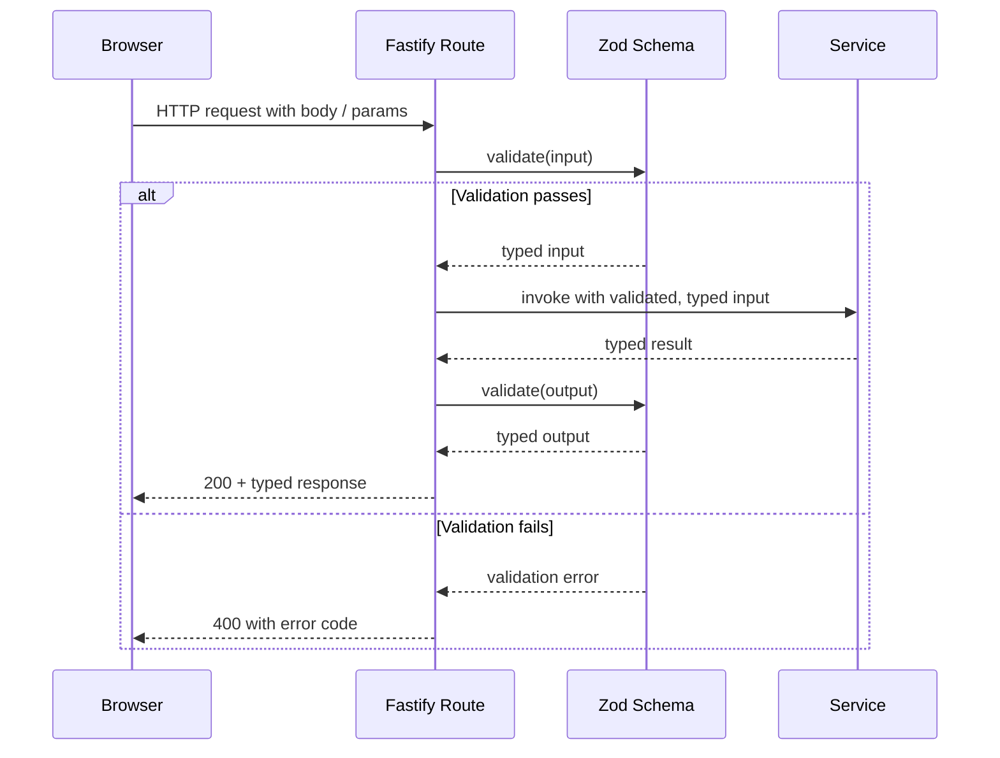

# Shared Contracts

Liminal Build authors every cross-runtime contract once, in Zod, under `apps/platform/shared/contracts/`. Fastify routes attach those schemas through `fastify-type-provider-zod` to validate request input, response output, and route parameters at the boundary, while the browser client imports the same Zod schemas and inferred TypeScript types directly rather than redefining either. No contract is authored twice. The universal authoring rules — named exports, `z.infer` for the matching type, no boundary code outside the contract file — live in [Coding Patterns and Service Shape](../conventions/coding-patterns-and-service-shape.md); this page maps the contract files that actually exist to the routes and client features that consume them.

## Architecture Recap

The platform runs across four surfaces — the browser client, the [Fastify Control Plane](../conventions/glossary.md), the [Sandbox Runtime](../conventions/glossary.md), and the durable stores ([Convex](../conventions/glossary.md) and [GitHub](../conventions/glossary.md)). Every cross-surface communication path travels through Fastify, so every cross-surface boundary has an attached Zod contract. The contracts directory is the single source of truth that anchors HTTP request and response shapes, the WebSocket [Live Update](../conventions/glossary.md) wire format, and the typed state envelopes the browser store reuses for its own slices.

## Contract Inventory

The live `apps/platform/shared/contracts/` tree is currently flat: one file per logical boundary plus a barrel `index.ts` that wildcard re-exports every contract module. Each file owns one cohesive surface boundary; downstream code imports through the barrel.

| Contract File | Owns | Consumed By |
|-|-|-|
| `schemas.ts` | Foundational shared enums (`ProcessStatus`, `ProjectRole`, `HydrationState`, `RequestErrorCode`, `SectionStatus`), the `RequestError` envelope, the `ShellSectionEnvelope` factory, the project-shell aggregate (`ProjectShellResponse` with `processes`, `artifacts`, and `sourceAttachments` section envelopes), the shell bootstrap payload, and the project / process / artifact / source summaries used across the platform. | `server/routes/projects.ts` (via `server/schemas/projects.ts`); `server/routes/auth.ts` (via `server/schemas/auth.ts`); `client/browser-api/projects-api.ts`; `client/browser-api/auth-api.ts`; imported across the contracts directory. |
| `process-work-surface.ts` | The process work-surface aggregate (`ProcessWorkSurfaceResponse` with project context, `processSurfaceSummary`, history / materials / side-work section envelopes, `currentProcessRequest`, and `environmentSummary`); start, resume, rehydrate, rebuild, and respond request and response shapes; route path patterns and path builders for the surface; `processSurfaceControlState` for surface controls. | `server/routes/processes.ts` (via `server/schemas/processes.ts`); `client/browser-api/process-work-surface-api.ts`. |
| `live-process-updates.ts` | The WebSocket message union for the process Live Update channel: typed `snapshot`, `upsert`, `complete`, and `error` messages keyed by entity type (`process`, `history`, `current_request`, `materials`, `side_work`, `environment`), each carrying the matching `process-work-surface.ts` payload; `error` is constrained to the section-shaped entities (`history`, `materials`, `side_work`). | `server/routes/processes.ts` WebSocket handler at `/ws/projects/:projectId/processes/:processId`; `client/browser-api/process-work-surface-api.ts` and the live-update consumer in `client/features/processes`. |
| `archive.ts` | The archive HTTP boundary: route patterns and path builders, `ArchiveEntry` shape with provenance (`relatedArtifactProvenance`, `relatedSourceProvenance`), `ArchivePage`, the [Turn](../conventions/glossary.md) shape (`DerivedTurn`, `ArchiveTurnPage`), and the [Derived Archive View](../conventions/glossary.md) shape (`DerivedArchiveView`, `derivedArchiveViewListResponse`, `derivedArchiveViewRefreshResponse`); pagination query schemas and the archive-scoped error code subset. | `server/routes/archive.ts` (via `server/schemas/archive.ts`); the archive feature in `client/features/processes`. |
| `review-workspace.ts` | The review workspace aggregate (`ReviewWorkspaceResponse` with project context, process context, `availableTargets`, and a target union of artifact or package); the `ArtifactReviewTarget` and `PackageReviewTarget` shapes with version detail and per-member review state; `ExportPackageResponse` for `.mpkz` exports; route patterns, path builders, and the review-scoped error codes. | `server/routes/review.ts` (via `server/schemas/review.ts`); `client/browser-api/review-workspace-api.ts`; `client/features/review`. |
| `source-management.ts` | Source attachment CRUD: `CreateSourceAttachmentRequest`, `UpdateSourceAttachmentRequest`, `RefreshSourceAttachmentResponse`, `DetachSourceAttachmentResponse`; the [Source Provenance](../conventions/glossary.md) entry shape and the `processSourceProvenanceSectionState` envelope used inside the process surface state; route patterns for project- and process-scoped attachments. | `server/routes/source-management.ts` (via `server/schemas/source-management.ts`); the source-attachment slice in the client store and the surface features that read provenance. |
| `state.ts` | The browser-side `AppState` shape and per-surface state slices (`processSurfaceState`, `archiveSurfaceState`, `reviewWorkspaceState`) plus the `parsedRoute` discriminated shape; composed entirely from the schemas above so the store and the wire share validators rather than parallel definitions. | The client store under `apps/platform/client/`; not attached to any Fastify route. |
| `index.ts` | Wildcard re-export of every contract module above. | Every server route handler and browser-api caller imports through this file. |

Each contract file is the single source of truth for the boundary it names. Routes attach the matching Zod schemas through `fastify-type-provider-zod` (`app.withTypeProvider<ZodTypeProvider>()`), so request bodies, params, querystrings, and response payloads are validated and typed end-to-end without a parallel client schema. Server-side route schemas in `apps/platform/server/schemas/` compose these contracts into Fastify route definitions; they exist to bind path/method/status to the contract, not to redefine shapes.

## Contract Validation Flow

Validation happens at the Fastify boundary. Services and durable-state writers receive already-typed input, and responses are checked against the same schema before they leave the process. The browser client uses the inferred types directly, with the option of running the same Zod parsers on payloads that crossed an untyped seam (for example, a script tag bootstrap payload).

Validation runs at the Fastify route boundary, never inside the service; services receive already-typed input and produce results that the route validates on the way out. The browser side imports those same schemas and their inferred types straight from `apps/platform/shared/contracts/`, so a wire shape changes once and propagates to every consumer at the type layer. Live updates follow the same rule: the server emits messages that match `liveProcessUpdateMessageSchema`, and the client treats incoming messages with the same union type rather than its own.

## Contract Categories

The four groupings below are explanatory reading paths through the contracts, not subdirectories. The live tree is flat; these categories help a reader find which file owns which kind of boundary.

### Domain Aggregate Contracts

The aggregate response contracts envelope a project shell or work-surface read with per-section status. `schemas.ts` defines `projectShellResponseSchema`, which composes a `projectSummary` with three section envelopes: `processSectionEnvelope`, `artifactSectionEnvelope`, and `sourceAttachmentSectionEnvelope`. `process-work-surface.ts` defines `processWorkSurfaceResponseSchema`, which envelopes the work surface as a `processSurfaceProject`, a `processSurfaceSummary` with derived `controls`, `processHistorySectionEnvelope`, `processMaterialsSectionEnvelope`, an optional `currentProcessRequest`, `sideWorkSectionEnvelope`, and an `environmentSummary`. `review-workspace.ts` defines `reviewWorkspaceResponseSchema`, which envelopes the workspace as a project context, process context, available targets list, and an optional `reviewTarget` discriminated union. The composite-with-section-envelopes shape is the platform's house pattern for surface aggregates: each section carries its own `status` (`ready`, `empty`, or `error`) and an optional typed error so a partial outage in one section does not collapse the whole response, per the [Section-Envelope Graceful Degradation](../current-technical-architecture/cross-cutting-decisions.md) cross-cutting decision.

### Live Update Contracts

`live-process-updates.ts` is the wire contract for the process WebSocket channel. The platform never streams raw provider deltas to the browser; it serves typed entity messages. `liveProcessUpdateMessageSchema` is a discriminated union over four message types (`snapshot`, `upsert`, `complete`, `error`) and six entity types (`process`, `history`, `current_request`, `materials`, `side_work`, `environment`) for the data variants, with each variant carrying the matching payload from `process-work-surface.ts` (for example, a `materials` `Upsert` carries a `processMaterialsSectionEnvelope`); the `error` variant is constrained to the section-shaped entities (`history`, `materials`, `side_work`). The message union enforces shape invariants at the boundary — for example, that a `process` message's `entityId` matches its `processId` and that error messages carry a `processSurfaceSectionError`. This is the implementation point of the [Browsers Consume Typed Upserts, Never Raw Provider Deltas](../current-technical-architecture/cross-cutting-decisions.md) decision, and it underwrites the canonical glossary terms `Snapshot`, `Upsert`, and `Live Update`.

### Per-Domain CRUD and Action Contracts

`schemas.ts` owns the project-creation request (`createProjectRequestSchema`) and the process-creation request and response (`createProcessRequestSchema`, `createProcessResponseSchema`). `process-work-surface.ts` owns the action contracts that drive a process forward — `startProcessResponseSchema`, `resumeProcessResponseSchema`, `rehydrateProcessResponseSchema`, `rebuildProcessResponseSchema`, `submitProcessResponseRequestSchema`, and `submitProcessResponseResponseSchema` — each of which returns the post-action `processSurfaceSummary`, optional `currentProcessRequest`, and `environmentSummary` so the client renders the new state without a second fetch. `source-management.ts` owns the source attachment CRUD set: create, update, refresh, detach, plus the per-process source provenance read. `archive.ts` owns the archive read endpoints — page, turns, and derived views — plus `archiveDerivedViewRefreshRequestSchema` for the projection-rebuild action. `review-workspace.ts` owns `exportPackageResponseSchema` for `.mpkz` exports. The same Zod types align across runtimes: Fastify routes validate inbound and outbound, and the browser client imports the inferred types as the only shape it knows.

### Provider and Sandbox Boundary Contracts

The sandbox boundary surfaces in shared contracts indirectly. The browser never sees an `ExecutionResult`, so there is no `ExecutionResult` Zod schema in `apps/platform/shared/contracts/` today; the result shape is consumed inside the Fastify service layer between the in-environment executor and the platform's checkpoint, history, output, side-work, and archive paths. Strict shared-schema validation of `ExecutionResult` is an active hardening item — the top-level envelope is parsed at the Fastify boundary, but several nested payloads remain cast rather than schema-validated — tracked in [Known Hardening](../current-technical-architecture/known-hardening-and-deferrals.md) and consumed by [Process Runtime and Environments](./process-runtime-and-environments.md). Adjacent boundaries that do live in shared contracts: `processSurfaceSummarySchema` exposes `availableActions` and derived `controls` so the work surface reflects what the sandbox layer reports as currently legal; `environmentSummarySchema` exposes `state`, `statusLabel`, `lastCheckpointResult`, and the [Hydration](../conventions/glossary.md) and [Checkpoint](../conventions/glossary.md) timestamps; and the source-provenance entry on `archiveEntrySchema` carries the `received_code_update` relationship that GitHub-write checkpoints record back into archive. The narrower provider-validation deferral for Cloudflare Sandbox is also covered in [Known Hardening](../current-technical-architecture/known-hardening-and-deferrals.md).

## Patterns and Conventions

- One Zod schema per logical boundary; multi-shape boundaries split into named schemas inside the same file (for example, `processSectionEnvelopeSchema`, `artifactSectionEnvelopeSchema`, and `sourceAttachmentSectionEnvelopeSchema` all live in `schemas.ts` but each owns its own envelope shape).
- Schemas exported as named exports; types inferred via `z.infer<typeof Schema>` and re-exported as named types alongside. No default exports; nothing imports schemas through the file path — everything goes through the `index.ts` barrel.
- Shape invariants beyond field-level types are expressed with `superRefine`, for example "degraded archive entries should include a degradation reason", "structured archive entries should include `bodyData`", "request error codes should align with their HTTP status", or "process Live Update messages should match top-level `processId` and `payload.processId`".
- Error codes are enumerated in shared contracts: `requestErrorCodeSchema`, `archiveErrorCodeSchema`, `sourceManagementErrorCodeSchema`, `reviewTargetErrorCodeSchema`, and `processSurfaceSectionErrorCodeSchema`. The full taxonomy lives in [Error Codes](../conventions/error-codes.md).
- Shared route patterns and path builders live next to their contracts (`processWorkSurfaceApiPathnamePattern`, `buildProcessArchiveApiPath`, etc.), so the server registers the same path string the client constructs.
- Versioning is append-only at the wire level: optional fields and new section variants are added without breaking older readers; breaking changes surface as deviations on the relevant design page.
- Contracts describe the boundary, not the algorithm. Service implementation, durable-store reads, and projection logic live behind the contract and never leak through it.

## Likely Code Areas

| Concern | Path |
|-|-|
| Contract authoring (Zod schemas, inferred types, route patterns, path builders) | `apps/platform/shared/contracts/` |
| Barrel re-export consumed by every server and client importer | `apps/platform/shared/contracts/index.ts` |
| Fastify route schema definitions that bind contracts to method, path, and status | `apps/platform/server/schemas/` |
| Route handlers attaching contracts via `withTypeProvider<ZodTypeProvider>()` | `apps/platform/server/routes/` |
| Browser-facing API boundary that imports the same Zod types | `apps/platform/client/browser-api/` |
| Per-surface store slices and features that consume the inferred types | `apps/platform/client/features/`, `apps/platform/client/app/` |

## Related

- [Technical Design Overview](./overview.md)
- [Server Control Plane](./server-control-plane.md)
- [Client Surfaces](./client-surfaces.md)
- [Convex Durable State and Projections](./convex-durable-state-and-projections.md)
- [Conventions: Coding Patterns and Service Shape](../conventions/coding-patterns-and-service-shape.md)
- [Cross-Cutting Decisions](../current-technical-architecture/cross-cutting-decisions.md)
- [Known Hardening and Deferrals](../current-technical-architecture/known-hardening-and-deferrals.md)
