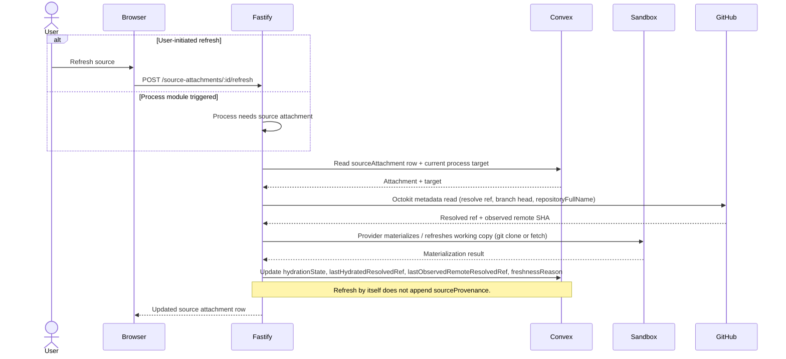

# Source Management Domain

A [Source Attachment](../conventions/glossary.md) is a durable repository relationship at project or process scope, recording purpose, access mode, target ref, hydration state, and freshness metadata. The domain keeps two GitHub identities side by side: `repositoryFullName` is the canonical `owner/name` identity used for uniqueness, conflict detection, shadowing, and provenance, while `repositoryUrl` is the operational clone or write URL used for hydration and code checkpoint paths. Source provenance is recorded immutably whenever a source actually informs work or receives a durable code update, distinct from the live attachment row. The domain has an active hardening item: Epic 6 was administratively closed before formal verification converged, and the live code is the authoritative reference for any field, transition, or error code that this page describes.

## Architecture Recap

Liminal Build is a four-surface system: a thin browser client, a Fastify control plane, Convex as durable state, and disposable sandbox environments managed through provider adapters. GitHub remains the canonical store for repository code; Liminal Build owns attachment metadata and process provenance, never source truth. Octokit metadata reads — repository identity, default branch, branch heads, ref existence — happen directly from Fastify; full clones and fetches go through the provider so working-copy state stays inside the disposable filesystem. The split matters because identity resolution does not need a sandbox, but materialization always does.

## Durable State

The Sources domain owns two Convex tables. The attachment table tracks the live operational record for one repository relationship; the provenance table is an append-only ledger of source use that survives detach, access loss, and metadata change.

| Table | Owns | File |
|-|-|-|
| `sourceAttachments` | Durable repository relationship — `projectId`, nullable `processId`, `provider` (`github`), `displayName`, `purpose`, `accessMode`, `repositoryUrl`, `repositoryFullName`, `targetRef`, `hydrationState`, `lastHydratedAt`, `lastHydratedResolvedRef`, `lastObservedRemoteResolvedRef`, `freshnessReason`, `refreshStatus`, `refreshRequestedAt`, `detachedAt`, `detachedByUserId`, `updatedAt` | [`convex/sourceAttachments.ts`](../../../convex/sourceAttachments.ts) |
| `sourceProvenance` | Immutable record of source use — `projectId`, `processId`, nullable `sourceAttachmentId`, `relationshipKind` (`informed_work` or `received_code_update`), `repositoryFullName`, `repositoryUrl`, `targetRef`, nullable `eventId`, `entryStatus` (`ready` or `degraded`), nullable `degradationReason`, `recordedAt` | [`convex/sourceProvenance.ts`](../../../convex/sourceProvenance.ts) |

Scope is determined by whether `processId` is present on the attachment row: `null` means project-scoped, a concrete process id means process-scoped. Process-scoped attachments shadow project-scoped attachments for that process's current-source view when both share the same `repositoryFullName` and `targetRef` per the Epic 6 active-source resolution algorithm. Provenance rows copy `repositoryFullName`, `repositoryUrl`, and `targetRef` at record time so historical entries stay legible after the source attachment is detached or its enrichment degrades.

## Canonical Identity vs Operational URL

The Sources domain stores two GitHub identities for every attachment and treats them as load-bearing in different paths. They are not interchangeable.

`repositoryFullName` is the canonical identity in normalized lowercase `owner/name` form. It is the basis for the `by_projectId_processId_repositoryFullName_targetRef` uniqueness index, duplicate detection on attach, the shadow key (`repositoryFullName:targetRef`) used in active-source resolution, and the durable identity copied onto every [Source Provenance](../conventions/glossary.md) record. `repositoryUrl` is the operational clone or write URL — a full `https://github.com/<owner>/<repo>` URL used by `LocalProviderAdapter` to clone the working tree at hydration time and by `OctokitCodeCheckpointWriter` to address the GitHub repo for code checkpoint commits. Both fields are persisted on every attachment row and on every provenance row; using the URL for identity comparisons or the full name for clone operations would break shadowing and hydration respectively. See [Repository Full Name](../conventions/glossary.md) and [Repository URL](../conventions/glossary.md) for the canonical definitions.

## Access Mode

[Access Mode](../conventions/glossary.md) records the expected write behavior of an attachment and constrains the kind of target ref it may carry.

The two access modes are `read_only` and `read_write`. `read_write` requires a branch-like target ref; if a `read_write` attachment is created or updated with a missing ref, the source management service resolves the repository's default branch and persists that. If the resolution returns a non-branch ref (tag or commit) for a `read_write` attachment, the service raises `SOURCE_ATTACHMENT_CONFLICT` with status 409. `read_only` attachments may use branch, tag, or commit refs, or no ref at all. Code checkpoint planning rejects `read_only` attachments before any commit attempt, and the source provenance service refuses to record `received_code_update` for any non-`read_write` attachment.

## Hydration State and Freshness

[Hydration State](../conventions/glossary.md) is set by the source refresh service after comparing the freshly observed remote ref to `lastHydratedResolvedRef` and inspecting the working-copy status of the target process environment. The state has exactly four values; pending refresh is operation status carried separately on `refreshStatus` and `refreshRequestedAt`, not a fifth hydration value.

| Hydration State | Meaning |
|-|-|
| `not_hydrated` | Attachment has never been hydrated; `lastHydratedAt` and `lastHydratedResolvedRef` are null. The initial state for a freshly created attachment row. |
| `hydrated` | Working copy was materialized for this attachment, the observed remote ref matches `lastHydratedResolvedRef`, and the environment still owns a working copy. Refresh paths skip work in this state. |
| `stale` | Working copy or ref is no longer current. Set when branch head drift, working-copy loss, or a target-ref change is detected. The refresh route is the recovery path. |
| `unavailable` | The repository or target ref cannot be reached through the GitHub identity layer. Set when `OctokitGitHubRepositoryResolver` returns `invalid` or `inaccessible`. |

[Freshness Reason](../conventions/glossary.md) is set when the state is `stale` or `unavailable` and explains why. The live code uses six string values across both states.

| Freshness Reason | When Set |
|-|-|
| `target_ref_changed` | A `hydrated` attachment's `targetRef` was updated to a different value; the management service marks the attachment stale on the same write. |
| `branch_head_moved` | The remote resolved SHA for a branch ref differs from `lastHydratedResolvedRef` during refresh evaluation. |
| `working_copy_missing` | The target process environment is `absent`, `lost`, or has no `environmentId`, while the attachment had previously been hydrated. |
| `repository_unavailable` | Repository identity could not be resolved at all and no `targetRef` is recorded; downgraded to `unavailable`. |
| `target_ref_unavailable` | Repository was reachable but the configured `targetRef` could not be resolved; downgraded to `unavailable`. |
| `access_revoked` | Octokit rejected the repository read with credentials (401/403) or returned a non-target-ref `inaccessible` result. |

The refresh service derives `hydrationState` first (state takes precedence over reason) and then derives `freshnessReason` consistent with that state. When a previously `stale` attachment recovers because branch head drift or working-copy loss is resolved, the reason is cleared back to `null` alongside the transition to `hydrated`.

## Refresh and Hydration

Source refresh runs both as part of the controlled execution cycle and as a standalone user action against `POST /api/projects/:projectId/source-attachments/:sourceAttachmentId/refresh`. The refresh route is rejected as `SOURCE_ATTACHMENT_REFRESH_NOT_AVAILABLE` unless the attachment is `stale` or `not_hydrated` and exactly one current process target owns the source.

Octokit metadata reads stay direct because identity resolution does not need a sandbox; full clones and fetches always go through the provider so working-copy state stays inside the disposable filesystem. Project-scoped refresh requires that the platform resolve exactly one concrete process working-copy target for the attachment — zero or multiple candidates yield `SOURCE_ATTACHMENT_REFRESH_NOT_AVAILABLE`. Provenance writes only when the source actually informs work or receives a durable code update; refresh by itself never appends a `sourceProvenance` row.

## Source Provenance

Source provenance is the immutable history of source use for a process. It survives detach, target-ref change, and credential loss because it copies repository identity at record time rather than depending on a live attachment lookup.

The two relationship kinds are `informed_work` and `received_code_update`. `informed_work` is appended by the source provenance service when an `ExecutionResult` reports that the process used the source as input — typically referenced from an artifact version that the process produced against the source. `received_code_update` is appended when a writable source attachment receives a durable code update through `OctokitCodeCheckpointWriter`; the provenance service refuses to record this kind for any attachment whose `accessMode` is not `read_write` or whose `detachedAt` is set. Both kinds carry `entryStatus` (`ready` or `degraded`) and an optional `degradationReason` so the read API can present detached, redacted, or otherwise unavailable rows without losing the recorded `repositoryFullName` and `targetRef`. The provenance table is append-only; rows are never updated and never hard-deleted.

## Scope and Shadowing

Scope rules govern which attachment is the current source for a given process and which is merely available at the project level. The active-source resolution algorithm lives in `apps/platform/server/services/processes/active-process-sources.ts` and is shared across the project shell aggregator, the process materials reader, the API surface, and refresh evaluation.

A Source Attachment is project-scoped when `processId` is `null` and process-scoped when `processId` names a concrete process. When a project-scoped row and a process-scoped row coexist for the same `repositoryFullName` and `targetRef`, the **process-scoped attachment shadows the project-scoped one for that process's current-source view**. Project-scoped attachments do not automatically become current for every process — they create shared rows that processes may inherit when no process-scoped sibling exists, but the per-process current-source view is built from `currentSourceAttachmentIds` on the process state row, with the shadow rule applied only when both scopes appear for the same shadow key. Soft detach preserves history: the attachment row remains in the table, `detachedAt` and `detachedByUserId` are set, and the row is filtered out of every active list while continuing to back any provenance row that references it. Detach never hard-deletes; provenance never depends on the live row's read state. See [Project Shell](./project-shell.md) and [Process Domain](./process-domain.md) for how the shadow rule surfaces in those views.

## Routes and Services

The source management surface is a small REST API on Fastify with one provenance read per process. Lifecycle actions operate on `sourceAttachmentId` independent of the scope the row was created at.

| Route | Method | Service |
|-|-|-|
| `/api/projects/:projectId/source-attachments` | POST | `DefaultSourceManagementService.attachProjectSource` in [`source-management.service.ts`](../../../apps/platform/server/services/sources/source-management.service.ts) |
| `/api/projects/:projectId/processes/:processId/source-attachments` | POST | `DefaultSourceManagementService.attachProcessSource` in [`source-management.service.ts`](../../../apps/platform/server/services/sources/source-management.service.ts) |
| `/api/projects/:projectId/source-attachments/:sourceAttachmentId` | PATCH | `DefaultSourceManagementService.updateSource` in [`source-management.service.ts`](../../../apps/platform/server/services/sources/source-management.service.ts) |
| `/api/projects/:projectId/source-attachments/:sourceAttachmentId` | DELETE | `DefaultSourceManagementService.detachSource` in [`source-management.service.ts`](../../../apps/platform/server/services/sources/source-management.service.ts) |
| `/api/projects/:projectId/source-attachments/:sourceAttachmentId/refresh` | POST | `DefaultSourceRefreshService.refreshSource` in [`source-refresh.service.ts`](../../../apps/platform/server/services/sources/source-refresh.service.ts) |
| `/api/projects/:projectId/processes/:processId/source-provenance` | GET | `DefaultSourceProvenanceService.listProcessSourceProvenance` in [`source-provenance.service.ts`](../../../apps/platform/server/services/sources/source-provenance.service.ts) |

Identity normalization (URL parsing, full-name lowercasing, target-ref trimming) is delegated to `SourceIdentityService`. Repository resolution and ref classification (`branch`, `tag`, `commit`, `none`) live in `OctokitGitHubRepositoryResolver`. The refresh service composes the resolver with the provider adapter registry through `RuntimeSourceHydrationExecutor` so refresh paths share the same hydration plan that controlled execution uses. Error codes used by these routes are catalogued in [Error Codes](../conventions/error-codes.md): `SOURCE_ATTACHMENT_NOT_FOUND`, `SOURCE_ATTACHMENT_CONFLICT`, `SOURCE_ATTACHMENT_REFRESH_NOT_AVAILABLE`, `SOURCE_ATTACHMENT_UNAVAILABLE`, and `INVALID_SOURCE_ATTACHMENT`.

## Adjacent Domains

- **Process Domain** — processes use sources at process scope or inherit project-scoped sources through the shadow rule; the process state rows carry `currentSourceAttachmentIds` (cross-link [Process Domain](./process-domain.md)).
- **Process Runtime and Environments** — controlled execution materializes sources via the provider adapter; code checkpoint writes back to writable sources via `OctokitCodeCheckpointWriter` (cross-link [Process Runtime and Environments](./process-runtime-and-environments.md)).
- **Artifacts and Versions** — `informed_work` provenance records source use during artifact production; the `eventId` field links a provenance row to the producing execution event (cross-link [Artifacts and Versions](./artifacts-and-versions.md)).
- **Project Shell** — project-scoped sources appear in the project shell aggregator's source section, which uses the same active-source resolution as the process surface (cross-link [Project Shell](./project-shell.md)).
- **Server Control Plane** — Octokit, source services, and the route layer all live in the Fastify control plane; the GitHub repository resolver is the only outbound GitHub client outside the code checkpoint writer (cross-link [Server Control Plane](./server-control-plane.md)).

## Active Hardening

The Sources domain carries the platform's largest active hardening item. Epic 6 was administratively closed on 2026-05-04 before formal epic verification converged; story-level gates passed, post-fix synthesis reported recorded blockers fixed, but the final epic-level gate was not run after the last fix pass.

The implementation is functionally landed but warrants an evidence-driven walk-through before heavy product reliance, particularly around scope shadowing across project and process surfaces, soft detach behavior on running working copies, refresh on missing working copies, and provenance edge cases (degraded enrichment, detached source visibility, redacted access). Late epic-fix changes touched source refresh, provenance, active-source resolution, source readers, Convex source attachment logic, execution provider adapters, process environment state, and platform store fallback behavior — that breadth means the standup review and the live code may diverge in places. Where they disagree, the live code is authoritative. See [Known Hardening: Epic 6 Source-Management Implementation Review](../current-technical-architecture/known-hardening-and-deferrals.md) and [Standup Review 06](../../arch-standup-review/06-source-attachments-canonical-source-management-build-summary.md) for the full context.

## Patterns and Conventions

- `repositoryFullName` is the canonical identity; `repositoryUrl` is operational. They are not interchangeable, and both are persisted on every row that names a source.
- `read_write` access mode requires a branch-like target ref. Missing refs resolve to the repository's default branch; tag and commit refs are rejected with `SOURCE_ATTACHMENT_CONFLICT`. `read_only` rejects write paths at planning time.
- Hydration state has four values: `not_hydrated`, `hydrated`, `stale`, `unavailable`. Pending refresh is operation status (`refreshStatus`, `refreshRequestedAt`) carried separately on the row.
- Octokit metadata reads happen directly from Fastify; full clones and fetches are provider-mediated so working-copy state stays in the disposable filesystem.
- Source provenance is append-only and immutable. Refresh alone does not write provenance; only `informed_work` and `received_code_update` events do.
- Process scope shadows project scope for the current-source view of that process when both rows share the same `repositoryFullName` and `targetRef`. Project-scoped attachments do not automatically become current for every process.
- Soft detach preserves history. Detach sets `detachedAt` and `detachedByUserId`, removes the row from every active list, and leaves provenance intact. Do not hard-delete attachments.
- Active-source resolution is centralized in `active-process-sources.ts` and reused across the project shell aggregator, the process materials reader, the API, and refresh.

## Likely Code Areas

The Sources domain spans Fastify services, route schemas, shared contracts, and Convex domain modules.

| Concern | Path |
|-|-|
| Source services | `apps/platform/server/services/sources/` |
| Source routes | `apps/platform/server/routes/source-management.ts` |
| Route schemas | `apps/platform/server/schemas/source-management.ts` |
| Shared contracts | `apps/platform/shared/contracts/source-management.ts` |
| Active source resolution | `apps/platform/server/services/processes/active-process-sources.ts` |
| Convex attachments | `convex/sourceAttachments.ts` |
| Convex provenance | `convex/sourceProvenance.ts` |
| Service tests | `tests/service/server/source-management-service.test.ts`, `tests/service/server/source-management-api.test.ts`, `tests/service/server/source-management-contracts.test.ts` |
| Convex tests | `convex/sourceAttachments.test.ts`, `convex/sourceProvenance.test.ts` |
| Client tests | `tests/service/client/source-attachment-section.test.ts`, `tests/service/client/source-provenance-section.test.ts`, `tests/service/client/source-management-ui.test.ts` |

## Related

- [Technical Design Overview](./overview.md)
- [Process Domain](./process-domain.md)
- [Process Runtime and Environments](./process-runtime-and-environments.md)
- [Artifacts and Versions](./artifacts-and-versions.md)
- [Project Shell](./project-shell.md)
- [Server Control Plane](./server-control-plane.md)
- [Convex Durable State and Projections](./convex-durable-state-and-projections.md)
- [Conventions: Error Codes](../conventions/error-codes.md)
- [Cross-Cutting Decisions](../current-technical-architecture/cross-cutting-decisions.md)
- [Key Runtime Flows: Source Hydration and Refresh](../current-technical-architecture/key-runtime-flows.md)
- [Known Hardening and Deferrals](../current-technical-architecture/known-hardening-and-deferrals.md)
- [Top-Tier Domains: Sources](../current-technical-architecture/top-tier-domains.md)
